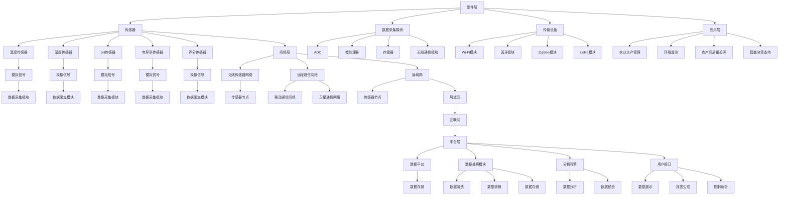

                 

### 第一部分：物联网与智慧农业概述

#### 1.1 物联网的基本概念

物联网（Internet of Things，IoT）是指通过互联网将各种物理设备、传感器、软件和计算机网络连接起来，以实现信息的采集、传输和处理。物联网的核心在于其能够将人与物、物与物进行智能连接，从而实现对物理世界的全面感知和智能控制。

在物联网中，每个设备都可以被视为一个节点，这些节点通过互联网进行通信，形成一个庞大的网络系统。物联网的组成部分主要包括传感器、通信网络、数据平台和终端设备等。

##### 物联网的组成部分

1. **传感器**：用于检测和采集环境中的物理量，如温度、湿度、光照、压力等。
2. **通信网络**：包括有线和无线通信网络，如Wi-Fi、蓝牙、5G等，用于将传感器采集到的数据传输到数据处理平台。
3. **数据平台**：用于存储、处理和分析从传感器传输来的数据，提供数据可视化和决策支持。
4. **终端设备**：用于接收和处理数据，如智能手机、平板电脑等。

##### 物联网的发展历程

物联网的概念最早可以追溯到20世纪80年代。当时，美国军方提出了智能互联设备的概念，旨在通过互联网实现军事设备的互联互通。随着互联网和通信技术的发展，物联网逐渐从概念走向实际应用。

2005年，麻省理工学院的《技术评论》将物联网列为21世纪最具影响力的八大科技之一，引起了全球的关注。此后，物联网技术得到了快速发展，应用领域不断拓展。

##### 物联网的基本工作原理

物联网的基本工作原理可以概括为以下步骤：

1. **数据采集**：传感器采集环境数据，如温度、湿度、光照等。
2. **数据传输**：通过通信网络将采集到的数据传输到数据平台。
3. **数据处理**：数据平台对传输来的数据进行存储、处理和分析，形成可用的信息。
4. **信息反馈**：根据处理结果，对设备进行控制或进行决策支持。

通过物联网，我们能够实现对物理世界的实时监控和智能管理，提高生产效率，降低成本，提升生活质量。

#### 1.2 智慧农业的背景和重要性

智慧农业是利用物联网、大数据、云计算、人工智能等现代信息技术，对农业生产过程进行智能化管理，从而提高农业生产效率和产品质量的一种农业发展模式。

##### 农业发展的现状与挑战

随着人口增长和城市化进程的加快，全球农业面临着前所未有的挑战。一方面，耕地资源日益紧张，农业生产需要提高效率以保障粮食安全；另一方面，农业面临着环境污染、资源浪费等问题，需要实现可持续发展。

当前，我国农业生产仍处于粗放型阶段，生产效率低、成本高、产品质量不稳定。传统的农业生产方式难以满足现代农业发展的需求，必须进行转型升级。

##### 智慧农业的概念和特点

智慧农业是指通过物联网、大数据、云计算、人工智能等现代信息技术，对农业生产过程进行智能化管理，从而实现农业生产的精细化和智能化。

智慧农业具有以下特点：

1. **数字化**：通过传感器和物联网技术，实现对农业生产过程的实时监控和数据采集。
2. **智能化**：利用人工智能技术，对采集到的数据进行分析和处理，实现农业生产的智能决策。
3. **精准化**：通过精准施肥、精准灌溉等技术，提高农业生产效率和产品质量。
4. **高效化**：通过智能化管理，降低农业生产成本，提高生产效率。

##### 智慧农业对农业发展的推动作用

智慧农业对农业发展的推动作用主要体现在以下几个方面：

1. **提高农业生产效率**：通过智能化管理，实现对农业生产过程的精准控制，提高生产效率。
2. **保障粮食安全**：通过提高农业生产效率，增加粮食产量，保障粮食安全。
3. **促进农业可持续发展**：通过减少资源消耗和环境污染，实现农业的可持续发展。
4. **推动农业现代化**：通过引入现代信息技术，推动农业现代化进程，提高农业竞争力。

总之，智慧农业是未来农业发展的必然趋势，对于保障粮食安全、促进农业现代化、实现农业可持续发展具有重要意义。

### 1.3 物联网在智慧农业中的应用概述

物联网在智慧农业中的应用非常广泛，主要包括以下几个方面：

1. **土壤监测**：通过物联网技术，实现对土壤温度、湿度、酸碱度等关键指标的实时监测，为农业生产提供科学依据。

2. **环境监测**：利用物联网传感器，对农田小气候、空气质量等环境因素进行实时监测，保障作物生长环境。

3. **灌溉管理**：通过物联网技术，实现精准灌溉，降低水资源消耗，提高灌溉效率。

4. **病虫害监测与防治**：利用物联网传感器，实时监测病虫害发生情况，实现病虫害的精准防治。

5. **农业机器管理**：通过物联网技术，实现对农业机器的智能调度和管理，提高农业机械化水平。

6. **农产品追溯**：利用物联网技术，实现对农产品从生产到销售的全程追溯，提高农产品质量。

7. **农业智能化管理**：通过物联网、大数据、人工智能等技术，实现农业生产的智能化管理，提高农业生产效率和产品质量。

通过物联网技术，智慧农业能够实现信息化、智能化和精准化，推动农业现代化进程，为农业可持续发展提供有力支持。

### 第二部分：土壤监测技术原理

#### 2.1 土壤监测的关键指标

土壤监测是智慧农业的重要组成部分，通过对土壤关键指标的实时监测，可以为农业生产提供科学依据，指导农业生产活动。土壤监测的关键指标主要包括以下几个方面：

1. **土壤温度**：土壤温度是影响作物生长的重要因素之一。适宜的土壤温度有利于作物根系发育和养分吸收，过高或过低的土壤温度都会对作物生长产生不利影响。

2. **土壤湿度**：土壤湿度直接关系到作物的水分供应。过高或过低的土壤湿度都会影响作物生长。因此，土壤湿度的监测对于合理灌溉、防止干旱和涝灾具有重要意义。

3. **土壤酸碱度**：土壤酸碱度（pH值）影响土壤中养分的溶解和有效性，对作物的生长和发育有重要影响。适宜的土壤酸碱度有利于作物吸收养分，过高或过低的酸碱度都会对作物生长产生不利影响。

4. **土壤养分含量**：土壤养分含量是土壤肥力的重要指标。土壤中氮、磷、钾等主要养分的含量及其比例，直接影响作物的生长和产量。因此，土壤养分含量的监测对于科学施肥、提高产量具有重要意义。

5. **土壤有机质含量**：土壤有机质含量是土壤肥力的综合指标，反映了土壤的肥力和健康状况。土壤有机质的积累和分解过程对土壤结构、水分保持能力和生物活性有重要影响。

#### 2.2 土壤监测技术的基本原理

土壤监测技术主要包括传感器技术、数据采集与传输技术、数据处理与分析技术等。

1. **传感器技术**

传感器是土壤监测的核心部件，用于检测土壤中的各种物理和化学参数。常见的土壤传感器包括温度传感器、湿度传感器、pH传感器、电导率传感器、养分传感器等。

土壤传感器的基本原理是通过将土壤中的物理和化学量转换为电信号，然后通过数据采集模块进行数据传输。例如，温度传感器通常采用热敏电阻或热电偶等原理，将土壤温度变化转换为电阻或电压变化；湿度传感器则利用电容或电阻变化来检测土壤湿度；pH传感器通过电化学方法测量土壤酸碱度。

2. **数据采集与传输技术**

土壤监测的数据采集与传输技术是实现土壤监测数据实时获取和远程传输的关键。数据采集通常通过传感器采集模块完成，这些模块可以将传感器检测到的数据转换为数字信号，并通过无线通信模块（如Wi-Fi、蓝牙、ZigBee、LoRa等）将数据传输到中央数据平台。

数据传输技术主要包括无线传输和有线传输两种方式。无线传输具有安装方便、成本较低等优点，适用于大面积的土壤监测；有线传输则适用于小范围、高精度的土壤监测，如实验室环境。

3. **数据处理与分析技术**

土壤监测数据采集到中央数据平台后，需要进行数据处理和分析。数据处理包括数据清洗、数据转换、数据存储等步骤。数据清洗是指去除数据中的噪声和错误，数据转换是将不同传感器采集到的数据进行统一格式处理，数据存储是将处理后的数据存储到数据库或数据仓库中。

数据处理与分析技术主要包括以下几种：

- **统计分析**：通过对土壤监测数据的统计分析，可以了解土壤的总体状况和变化趋势。
- **数据挖掘**：通过数据挖掘技术，可以发现土壤监测数据中的潜在规律和关系，为农业生产提供科学依据。
- **机器学习**：利用机器学习算法，可以建立土壤监测数据的预测模型，预测土壤参数的未来变化趋势。

#### 2.3 物联网技术在土壤监测中的应用

物联网技术在土壤监测中的应用主要体现在以下几个方面：

1. **传感器网络部署**

通过部署物联网传感器网络，实现对农田土壤的实时监测。传感器网络可以覆盖整个农田或特定区域，监测土壤温度、湿度、酸碱度、养分含量等关键指标。

2. **数据采集与传输**

物联网传感器采集到的土壤数据通过无线通信模块传输到中央数据平台。数据传输技术可以是Wi-Fi、蓝牙、ZigBee、LoRa等，具体选择取决于监测区域的网络环境。

3. **数据处理与分析**

中央数据平台对传输来的土壤数据进行处理和分析，提供数据可视化、统计分析、数据挖掘等功能，帮助农业生产者了解土壤状况，指导农业生产决策。

4. **智能决策支持**

通过物联网技术和大数据分析，可以实现对土壤参数的智能预测和决策支持。例如，根据土壤湿度预测，实现智能灌溉；根据土壤养分预测，实现精准施肥。

5. **远程监控与管理**

物联网技术使得农业生产者可以远程监控农田土壤状况，及时调整农业生产策略，提高农业生产效率和产品质量。

总的来说，物联网技术在土壤监测中的应用，实现了土壤监测的实时性、准确性和智能化，为智慧农业提供了有力支持。

### 2.4 物联网土壤监测系统的架构

物联网土壤监测系统是一个复杂且多层次的系统，其架构包括硬件层、网络层、平台层和应用层等。以下是对物联网土壤监测系统架构的详细描述：

#### 硬件层

硬件层是物联网土壤监测系统的基石，主要包括各种传感器、数据采集模块和传输设备。具体构成如下：

1. **传感器**：用于监测土壤的各种参数，如温度、湿度、pH值、电导率、养分含量等。这些传感器具有高精度、高稳定性和长寿命的特点，能够满足农田环境的要求。

2. **数据采集模块**：负责将传感器的模拟信号转换为数字信号，并进行初步处理。数据采集模块通常内置ADC（模拟-数字转换器）、微处理器、存储器和无线通信模块等。

3. **传输设备**：用于将数据采集模块生成的数据无线传输到网络层。常见的传输设备包括Wi-Fi模块、蓝牙模块、ZigBee模块和LoRa模块等。

#### 网络层

网络层是连接硬件层和平台层的桥梁，负责将传感器采集的数据传输到平台层。网络层的选择取决于监测区域的网络环境和技术要求，通常包括以下几种技术：

1. **无线传感器网络（WSN）**：通过部署多个传感器节点，形成一个无线网络，用于数据采集和传输。WSN技术适用于大面积、低成本的土壤监测。

2. **远程通信网络**：如移动通信网络（2G/3G/4G/5G）、卫星通信网络等，用于将传感器数据传输到中央数据平台。远程通信网络适用于远距离、高速数据传输的需求。

3. **局域网（LAN）**：通过有线或无线方式将传感器节点连接到局域网，再通过局域网连接到互联网。局域网技术适用于小范围、高精度的土壤监测。

#### 平台层

平台层是物联网土壤监测系统的核心，负责数据的处理、存储和分析，并提供用户接口和智能决策支持。平台层的主要组成部分如下：

1. **数据平台**：用于存储和处理传感器采集到的数据。数据平台通常采用分布式存储和计算技术，以提高数据处理的效率和可靠性。

2. **数据处理模块**：负责对传感器数据进行清洗、转换、存储和初步分析。数据处理模块可以采用批处理和实时处理技术，以适应不同类型的数据。

3. **分析引擎**：利用机器学习、数据挖掘等技术，对土壤数据进行分析和预测。分析引擎可以生成可视化报表、趋势分析和预测模型，为农业生产提供决策支持。

4. **用户接口**：提供用户与系统交互的界面，包括数据展示、报表生成、控制命令等。用户接口可以采用Web端、移动端等多种形式，方便用户随时查看和管理土壤监测数据。

#### 应用层

应用层是物联网土壤监测系统的外部层，面向具体应用场景，提供个性化的解决方案。应用层的主要组成部分如下：

1. **农业生产管理**：根据土壤监测数据，优化农业生产策略，如精准灌溉、科学施肥、病虫害防治等。

2. **环境监测**：监测农田环境中的空气质量、水质、土壤污染等指标，为环境保护提供数据支持。

3. **农产品质量追溯**：通过物联网技术，实现对农产品从生产到销售的全程追溯，提高产品质量和安全。

4. **智能决策支持**：基于土壤监测数据和预测模型，为农业生产提供智能决策支持，如种植计划、播种期、收获期等。

#### 系统架构图

以下是一个简化的物联网土壤监测系统架构图：

通过上述架构，物联网土壤监测系统实现了对土壤参数的实时监测、数据分析和智能决策支持，为农业生产提供了有力保障。

### 第三部分：物联网在土壤监测中的实施

#### 3.1 土壤监测传感器选择与配置

在实施物联网土壤监测时，选择合适的传感器和进行合理的配置是关键步骤。以下将详细介绍土壤监测传感器的选择原则、配置原则以及传感器的安装和维护。

##### 传感器选择原则

1. **测量精度**：选择具有高测量精度的传感器，以确保监测数据的准确性。高精度的传感器能够更好地反映土壤的真实状况，为农业生产提供可靠依据。

2. **稳定性**：传感器应具有良好的稳定性，能够在长时间运行中保持测量精度。稳定性的重要性在于，长时间的监测需要传感器能够稳定工作，避免因传感器故障导致数据偏差。

3. **响应速度**：传感器的响应速度应足够快，以适应土壤参数变化的实时监测需求。快速响应的传感器能够及时捕捉土壤参数的微小变化，为农业生产提供及时的决策支持。

4. **耐环境性**：传感器应具有较好的耐环境性能，能够适应农田环境的各种恶劣条件，如高温、低温、湿度、腐蚀等。耐环境性对于传感器在农田中长时间稳定运行至关重要。

5. **兼容性和互操作性**：传感器应与数据采集模块和传输设备具有良好的兼容性，确保数据能够顺利传输和采集。互操作性能够提高系统的集成度，降低维护成本。

##### 传感器配置原则

1. **全面覆盖**：在农田中合理分布传感器，确保能够全面覆盖监测区域，避免数据盲区。全面覆盖有助于获得更准确的土壤状况，为农业生产提供全面的数据支持。

2. **重点区域配置**：对于土壤状况较为特殊或对作物生长影响较大的区域，应重点配置传感器，加强监测。例如，对于酸碱度变化较大的区域，应增加pH传感器的配置。

3. **灵活配置**：根据不同作物和生长阶段的需求，灵活配置传感器。例如，在作物生长初期，应重点监测土壤湿度，而在生长后期，应关注土壤温度和养分含量。

4. **定期检查和更新**：定期检查传感器的运行状态，及时更新损坏或失效的传感器，确保监测系统的正常运行。

##### 传感器安装与维护

1. **正确安装**：按照传感器的安装说明，将传感器正确安装在农田中。传感器的安装位置应避免干扰因素，如道路、建筑物等，以确保监测数据的准确性。

2. **定期维护**：定期检查传感器的运行状态，包括传感器的外观、连接线和电池等。对于出现故障的传感器，应及时进行维修或更换。

3. **环境防护**：为传感器提供良好的防护措施，如安装保护罩、防水箱等，以防止传感器受到农田环境中的恶劣条件影响。

4. **数据记录**：记录传感器的安装位置、安装时间、传感器类型等信息，以便在数据分析和故障排除时参考。

通过遵循上述原则和方法，可以确保物联网土壤监测系统的高效运行，为农业生产提供可靠的土壤监测数据。

#### 3.2 数据采集与传输技术

在物联网土壤监测系统中，数据采集与传输技术是实现实时监测和远程管理的关键。以下将详细介绍土壤监测数据的采集方法、传输协议和数据传输方式。

##### 数据采集方法

1. **传感器采集**：土壤传感器是数据采集的核心设备，通过内置的传感器模块，实时检测土壤的温度、湿度、酸碱度、养分含量等参数。传感器将采集到的模拟信号转换为数字信号，并传输给数据采集模块。

2. **数据采集模块**：数据采集模块是连接传感器和传输设备的中间件，负责将传感器的模拟信号转换为数字信号，并进行初步处理。数据采集模块通常具备ADC（模拟-数字转换器）、微处理器、存储器和无线通信模块等功能。

3. **定时采集**：数据采集模块根据预设的时间间隔，定时采集传感器数据，并将数据存储在本地存储器中。在满足特定条件时（如数据超限或传感器故障），数据采集模块会立即采集并传输数据。

4. **事件驱动采集**：当传感器检测到特定事件（如温度过高、湿度过低等）时，数据采集模块会立即启动采集并传输数据，确保重要数据的及时捕获。

##### 数据传输协议

1. **无线传输协议**：常用的无线传输协议包括Wi-Fi、蓝牙、ZigBee、LoRa等。每种协议都有其特点和适用场景。例如，Wi-Fi传输速度快，适用于高带宽需求；蓝牙适用于短距离、低功耗的设备连接；ZigBee适用于大规模物联网应用；LoRa适用于远距离、低功耗的物联网通信。

2. **有线传输协议**：有线传输协议包括以太网、串口等。有线传输具有传输速度快、稳定性高的优点，适用于小范围、高精度的土壤监测。

3. **传输协议选择原则**：在选择传输协议时，应考虑传输距离、数据量、功耗、可靠性等因素。例如，在农田监测中，可优先选择LoRa或ZigBee等无线传输协议，以实现远距离、低功耗的数据传输。

##### 数据传输方式

1. **点对点传输**：传感器数据直接传输到中央数据平台。这种方式适用于传感器数量较少、传输距离较短的情况。

2. **多跳传输**：传感器数据通过中间节点传输到中央数据平台。多跳传输适用于传感器数量较多、传输距离较远的情况。通过中间节点的中转，可以有效延长传输距离，降低功耗。

3. **聚合传输**：多个传感器的数据在本地进行聚合处理，然后通过一个或几个数据采集模块传输到中央数据平台。这种方式适用于传感器数量较多、数据采集频率较低的情况，可以有效减少网络带宽占用。

通过合理选择数据采集方法和传输协议，以及采用合适的数据传输方式，可以确保物联网土壤监测系统的数据采集和传输高效、稳定，为农业生产提供实时、准确的数据支持。

#### 3.3 数据处理与分析方法

在物联网土壤监测系统中，数据处理与分析方法是实现土壤监测数据价值的重要环节。以下将详细介绍土壤监测数据的预处理、数据分析方法、数据可视化技术以及数据挖掘算法。

##### 数据预处理

1. **数据清洗**：数据清洗是数据处理的第一步，用于去除数据中的噪声和错误。常见的噪声包括传感器故障、传输错误、环境干扰等。数据清洗可以通过统计方法、机器学习方法等实现。

2. **数据转换**：数据转换是指将不同传感器采集到的数据进行统一格式处理，以便于后续分析和处理。数据转换包括数据类型转换、数据格式转换、数据规范化等。

3. **数据融合**：数据融合是将来自多个传感器或多个来源的数据进行整合，以获得更全面和准确的土壤状况。数据融合可以通过加权平均、最小二乘法等方法实现。

4. **数据存储**：将预处理后的数据存储到数据库或数据仓库中，以便进行长期存储和分析。常用的数据库系统包括MySQL、PostgreSQL、MongoDB等。

##### 数据分析方法

1. **统计分析**：统计分析是对数据的基本分析，包括均值、方差、标准差、相关性等。通过统计分析，可以了解土壤参数的分布情况、波动范围等。

2. **时间序列分析**：时间序列分析是对时间序列数据的分析，用于研究土壤参数随时间的变化趋势。常见的时间序列分析方法包括ARIMA模型、季节性分解、小波分析等。

3. **回归分析**：回归分析用于研究土壤参数之间的依赖关系，可以建立回归模型，预测土壤参数的未来变化趋势。

4. **聚类分析**：聚类分析用于将相似的数据点分组，可以发现土壤参数的相似性和差异性。常用的聚类算法包括K-means、层次聚类等。

##### 数据可视化技术

1. **图表展示**：通过图表展示土壤监测数据，可以直观地了解土壤参数的变化趋势和分布情况。常见的图表类型包括折线图、柱状图、饼图、散点图等。

2. **热力图**：热力图可以展示土壤参数的空间分布情况，通过颜色深浅表示土壤参数的数值大小。热力图适用于展示土壤温度、湿度等空间分布。

3. **地图展示**：通过地图展示土壤监测数据，可以直观地了解不同地区的土壤状况。地图展示适用于展示农田分布、土壤污染等。

##### 数据挖掘算法

1. **关联规则挖掘**：关联规则挖掘用于发现数据之间的关联关系，可以用于土壤参数之间的相关性分析。常用的算法包括Apriori算法、FP-growth算法等。

2. **分类算法**：分类算法用于将土壤监测数据分为不同的类别，可以用于土壤类型分类、病虫害分类等。常用的分类算法包括K-近邻（KNN）、支持向量机（SVM）、决策树等。

3. **聚类算法**：聚类算法用于将相似的数据点分为一组，可以用于土壤质量评价、作物生长阶段分类等。常用的聚类算法包括K-means、层次聚类等。

通过数据处理与分析方法，物联网土壤监测系统可以实现对土壤监测数据的全面分析和挖掘，为农业生产提供科学依据和智能决策支持。

### 3.4 物联网土壤监测系统的实际案例

#### 案例一：基于物联网的精准农业土壤监测系统

##### 案例背景

某农业科技有限公司位于华北平原，致力于通过物联网技术提高农业生产效率。该公司发现，传统的农业监测手段难以满足现代农业发展的需求，因此决定开发一套基于物联网的精准农业土壤监测系统。

##### 系统设计

1. **硬件架构**：
   - **传感器层**：部署了多台土壤传感器，包括温度传感器、湿度传感器、pH传感器和养分传感器，分布在农田的不同区域。
   - **数据采集层**：使用了数据采集模块，将传感器采集到的数据转换为数字信号，并通过LoRa无线传输模块传输到数据平台。
   - **数据平台层**：搭建了一个大数据平台，用于存储、处理和分析传感器数据。
   - **应用层**：开发了Web端和移动端用户界面，供农业生产者实时查看土壤数据、生成报告和接收智能决策建议。

2. **软件架构**：
   - **数据采集与传输**：使用Python编写脚本，实现传感器数据的采集与传输，并将数据存储到MySQL数据库中。
   - **数据处理与分析**：采用Java编写数据处理和分析模块，使用统计分析、时间序列分析和回归分析等方法，对土壤数据进行分析和预测。
   - **用户界面**：使用HTML、CSS和JavaScript开发Web端用户界面，使用React Native开发移动端用户界面。

##### 案例实施步骤

1. **需求分析与规划**：与农业生产者沟通，了解他们的需求和期望，制定系统设计方案。
2. **硬件选型与安装**：选择合适的土壤传感器和数据采集模块，进行硬件安装和调试。
3. **软件开发与集成**：编写数据采集与传输脚本、数据处理与分析模块，集成到数据平台和用户界面中。
4. **测试与优化**：进行系统测试，优化传感器数据采集与传输、数据处理与分析算法，确保系统稳定可靠。
5. **上线与运营**：将系统上线，进行实际运营，收集用户反馈，持续优化系统功能。

##### 案例效果分析

1. **实时监测与数据可视化**：通过Web端和移动端用户界面，农业生产者可以实时查看农田土壤的多种参数，如温度、湿度、pH值和养分含量，了解土壤状况。
2. **数据分析和智能决策**：系统对采集到的土壤数据进行分析，生成土壤状况报告和智能决策建议，如合理灌溉、科学施肥等，提高农业生产效率和产品质量。
3. **降低成本和减少浪费**：通过精准监测和智能决策，减少不必要的灌溉和施肥，降低农业生产成本，减少水资源和化肥的浪费。

#### 案例二：智能温室土壤监测与控制系统

##### 案例背景

某智能温室种植公司位于江南水乡，主要种植高端蔬菜和花卉。为了确保作物生长环境的最优化，公司决定开发一套智能温室土壤监测与控制系统。

##### 系统设计

1. **硬件架构**：
   - **传感器层**：部署了温度传感器、湿度传感器、二氧化碳传感器、光照传感器等，安装在温室的不同位置。
   - **数据采集层**：使用数据采集模块，将传感器数据传输到无线传输模块，并通过Wi-Fi传输到数据平台。
   - **数据平台层**：搭建了一个云计算平台，用于存储和处理传感器数据。
   - **控制层**：配备了自动化控制设备，如灌溉系统、通风系统、补光灯等，可以根据土壤数据自动调节温室环境。

2. **软件架构**：
   - **数据采集与传输**：使用Python编写脚本，实现传感器数据的采集与传输。
   - **数据处理与分析**：使用Python编写数据处理与分析模块，对传感器数据进行实时分析和预测。
   - **自动化控制**：使用Java编写自动化控制脚本，根据土壤数据自动调节温室环境。

##### 案例实施步骤

1. **需求分析与规划**：与种植公司沟通，了解温室环境监控和控制的需求，制定系统设计方案。
2. **硬件选型与安装**：选择合适的传感器和数据采集模块，进行硬件安装和调试。
3. **软件开发与集成**：编写数据采集与传输脚本、数据处理与分析模块、自动化控制脚本，集成到数据平台和控制系统中。
4. **测试与优化**：进行系统测试，优化传感器数据采集与传输、数据处理与分析算法，确保系统稳定可靠。
5. **上线与运营**：将系统上线，进行实际运营，收集用户反馈，持续优化系统功能。

##### 案例效果分析

1. **环境监控与实时反馈**：通过Web端和移动端用户界面，种植公司可以实时监控温室的土壤和环境参数，如温度、湿度、二氧化碳浓度、光照强度等，确保作物生长环境的最优化。
2. **自动化控制与节能**：系统根据土壤数据自动调节温室环境，如通风、灌溉、补光等，提高温室管理的自动化水平，减少人工干预，降低能源消耗。
3. **提高作物产量与质量**：通过实时监测和自动化控制，为作物提供最佳的生长环境，提高作物产量和品质，增加经济效益。

通过以上两个案例，物联网土壤监测系统在农业生产中发挥了重要作用，实现了土壤监测的实时性、准确性和智能化，为智慧农业提供了有力支持。

### 第四部分：智慧农业土壤监测系统案例分析

在本部分，我们将深入探讨两个具体的智慧农业土壤监测系统案例：精准农业土壤监测系统和智能温室土壤监测与控制系统。通过分析这些案例，我们将了解系统的实际应用效果，以及它们在提升农业生产效率和产品质量方面的贡献。

#### 案例一：基于物联网的精准农业土壤监测系统

**背景**：
某农业科技有限公司位于华北平原，主要从事粮食作物的种植。公司面临的主要挑战是土壤状况的不稳定性和传统农业监测手段的局限性，难以实现精细化的农业生产管理。

**系统设计**：
该系统由四个主要部分组成：传感器层、数据采集层、数据平台层和应用层。
1. **传感器层**：在农田中布置了温度传感器、湿度传感器、pH传感器和养分传感器，确保对土壤参数的全面监测。
2. **数据采集层**：每个传感器通过数据采集模块将数据转换为数字信号，并通过LoRa无线传输模块发送到数据平台。
3. **数据平台层**：搭建了一个大数据平台，用于存储和处理传感器数据，并提供了数据可视化和分析工具。
4. **应用层**：开发了Web端和移动端用户界面，使得农业生产者可以实时查看土壤参数、生成报告和接收智能决策建议。

**实施步骤**：
1. **需求分析与规划**：与农业生产者沟通，确定监测系统的具体需求，如监测参数、数据传输方式等。
2. **硬件选型与安装**：根据需求选择合适的传感器和数据采集模块，并进行安装和调试。
3. **软件开发与集成**：编写数据采集与传输脚本，集成到大数据平台和用户界面中。
4. **测试与优化**：进行系统测试，优化传感器数据采集与传输、数据处理与分析算法，确保系统稳定可靠。
5. **上线与运营**：将系统上线，进行实际运营，收集用户反馈，持续优化系统功能。

**效果分析**：
1. **实时监测与数据可视化**：农业生产者可以通过Web端和移动端用户界面，实时查看农田土壤的多种参数，如温度、湿度、pH值和养分含量，确保土壤状况的实时监控。
2. **数据分析和智能决策**：系统对采集到的土壤数据进行分析，生成土壤状况报告和智能决策建议，如合理灌溉、科学施肥等，提高农业生产效率和产品质量。
3. **降低成本和减少浪费**：通过精准监测和智能决策，减少不必要的灌溉和施肥，降低农业生产成本，减少水资源和化肥的浪费。
4. **提高作物产量和质量**：系统的精准监测和智能管理，为作物提供最佳的生长环境，提高了作物产量和品质，增加了经济效益。

#### 案例二：智能温室土壤监测与控制系统

**背景**：
某智能温室种植公司位于江南水乡，专注于高端蔬菜和花卉的种植。为了确保作物生长环境的最优化，公司决定开发一套智能温室土壤监测与控制系统。

**系统设计**：
该系统由四个主要部分组成：传感器层、数据采集层、数据平台层和控制层。
1. **传感器层**：在温室中布置了温度传感器、湿度传感器、二氧化碳传感器和光照传感器，确保对温室环境的全面监测。
2. **数据采集层**：每个传感器通过数据采集模块将数据转换为数字信号，并通过Wi-Fi传输模块发送到数据平台。
3. **数据平台层**：搭建了一个云计算平台，用于存储和处理传感器数据，并提供了数据可视化和分析工具。
4. **控制层**：配备了自动化控制设备，如灌溉系统、通风系统、补光灯等，可以根据土壤数据自动调节温室环境。

**实施步骤**：
1. **需求分析与规划**：与种植公司沟通，确定监测和控制系统的具体需求，如监测参数、控制策略等。
2. **硬件选型与安装**：根据需求选择合适的传感器和数据采集模块，并进行安装和调试。
3. **软件开发与集成**：编写数据采集与传输脚本、数据处理与分析模块和自动化控制脚本，集成到数据平台和控制系统中。
4. **测试与优化**：进行系统测试，优化传感器数据采集与传输、数据处理与分析算法，确保系统稳定可靠。
5. **上线与运营**：将系统上线，进行实际运营，收集用户反馈，持续优化系统功能。

**效果分析**：
1. **环境监控与实时反馈**：通过Web端和移动端用户界面，种植公司可以实时监控温室的土壤和环境参数，如温度、湿度、二氧化碳浓度、光照强度等，确保作物生长环境的最优化。
2. **自动化控制与节能**：系统根据土壤数据自动调节温室环境，如通风、灌溉、补光等，提高温室管理的自动化水平，减少人工干预，降低能源消耗。
3. **提高作物产量与质量**：通过实时监测和自动化控制，为作物提供最佳的生长环境，提高了作物产量和品质，增加了经济效益。

通过上述两个案例，我们可以看到智慧农业土壤监测系统在提升农业生产效率和产品质量方面具有显著作用。这些系统不仅实现了土壤监测的实时性和准确性，还通过智能决策支持，大幅提高了农业生产的管理水平。

### 第五部分：物联网土壤监测系统发展趋势与展望

#### 5.1 当前技术趋势分析

物联网土壤监测系统正处于快速发展阶段，当前技术趋势主要体现在以下几个方面：

1. **传感器技术的进步**：随着传感器技术的不断进步，传感器的精度、稳定性、响应速度和耐环境性得到了显著提升。新型传感器材料（如纳米材料、生物传感器）和智能传感器（如自供电传感器、可穿戴传感器）的问世，为土壤监测提供了更多选择。

2. **无线通信技术的升级**：无线通信技术的升级，如5G、NB-IoT、LoRa等，使得土壤监测数据传输更加高效、稳定和低功耗。5G技术的高带宽和低延迟特性，将进一步提升土壤监测系统的实时性和可靠性。

3. **大数据与人工智能的应用**：大数据和人工智能技术在土壤监测领域的应用日益广泛。通过大数据分析，可以挖掘土壤数据中的潜在规律和趋势，为农业生产提供科学依据。人工智能算法（如深度学习、机器学习）的应用，使得土壤监测系统能够实现智能预测和自动化决策。

4. **系统集成与互操作性**：物联网土壤监测系统的集成与互操作性逐渐增强。通过标准化接口和协议，不同厂商的传感器、数据平台和应用程序可以无缝集成，实现系统的高效运作和数据的互通共享。

5. **可持续发展与绿色农业**：随着全球对可持续发展的重视，物联网土壤监测系统在绿色农业中的应用得到了推广。通过减少资源消耗、降低污染和提高生产效率，物联网土壤监测系统有助于实现农业的可持续发展。

#### 5.2 未来发展展望

物联网土壤监测系统在未来的发展中，有望在以下几个方面取得重要突破：

1. **智能化与自主化**：未来的物联网土壤监测系统将更加智能化和自主化。通过人工智能和机器学习算法，系统可以自主学习和优化，实现更精准的土壤监测和更智能的农业生产管理。

2. **多源数据融合**：未来的土壤监测系统将整合多种数据源，如卫星遥感数据、气象数据、土壤实验室数据等，实现全方位的土壤监测。多源数据融合将提高土壤监测的准确性和可靠性。

3. **实时性与高效性**：随着通信技术的不断升级，物联网土壤监测系统的实时性和高效性将进一步提升。低延迟、高带宽的通信技术，将确保土壤监测数据的实时传输和处理，为农业生产提供即时决策支持。

4. **成本效益**：随着传感器技术和无线通信技术的成熟，物联网土壤监测系统的成本将逐渐降低。这使得更多的农业生产者能够负担得起先进的土壤监测系统，进一步推动智慧农业的发展。

5. **环保与可持续发展**：物联网土壤监测系统将在环保和可持续发展方面发挥更大作用。通过精准施肥、合理灌溉等技术，降低资源消耗和环境污染，实现农业的可持续发展。

总的来说，物联网土壤监测系统的发展前景广阔，将在智慧农业中发挥越来越重要的作用，为实现农业现代化和可持续发展提供有力支持。

### 6.1 物联网在智慧农业土壤监测中的应用成果

物联网技术在智慧农业土壤监测中的应用，取得了显著成果，主要体现在以下几个方面：

1. **实时监测与数据可视化**：通过部署物联网传感器，农业生产者可以实时监测土壤的温度、湿度、酸碱度、养分含量等关键参数，并通过数据平台和用户界面进行数据可视化，实现农田土壤状况的实时监控。

2. **精准管理与智能决策**：物联网土壤监测系统利用大数据分析和人工智能算法，对采集到的土壤数据进行处理和分析，生成土壤状况报告和智能决策建议，如合理灌溉、科学施肥、病虫害防治等，提高农业生产的精细化管理水平。

3. **降低成本与减少浪费**：通过物联网技术，农业生产者可以根据土壤监测数据，实现精准灌溉、合理施肥，减少水资源的浪费和化肥的使用，降低农业生产成本。

4. **提高作物产量与质量**：物联网土壤监测系统为作物提供最佳的生长环境，通过实时监测和智能管理，提高作物的产量和品质，增加经济效益。

5. **促进农业可持续发展**：物联网技术有助于实现农业的可持续发展，通过减少资源消耗和环境污染，推动农业的绿色发展和生态农业的建设。

6. **增强农产品安全性**：物联网技术可以实现对农产品从生产到销售的全程追溯，提高农产品质量，增强消费者对农产品的信任。

总之，物联网在智慧农业土壤监测中的应用，不仅提高了农业生产效率和产品质量，还为农业的可持续发展提供了有力支持，取得了显著的成果。

### 6.2 展望未来研究方向和发展趋势

展望未来，物联网土壤监测系统在智慧农业中将继续发挥重要作用，并有望在以下几个方面实现新的突破和发展趋势：

1. **智能化与自主化**：随着人工智能和机器学习技术的进步，物联网土壤监测系统将实现更高级别的智能化和自主化。系统将能够自主学习和优化，根据土壤环境变化自主调整监测参数和控制策略，实现自我管理和自我优化。

2. **多源数据融合**：未来物联网土壤监测系统将整合更多数据源，如卫星遥感数据、气象数据、土壤实验室数据等，实现全方位、多层次的土壤监测。多源数据融合将提高土壤监测的准确性和可靠性，为农业生产提供更全面的数据支持。

3. **实时性与高效性**：随着5G、6G等新一代通信技术的快速发展，物联网土壤监测系统的实时性和高效性将进一步提升。低延迟、高带宽的通信技术，将确保土壤监测数据的实时传输和处理，为农业生产提供即时决策支持。

4. **低成本与普及化**：随着传感器技术和无线通信技术的成熟，物联网土壤监测系统的成本将逐渐降低。这将使得更多的农业生产者能够负担得起先进的土壤监测系统，推动物联网技术在农业领域的普及。

5. **环保与可持续发展**：物联网土壤监测系统将在环保和可持续发展方面发挥更大作用。通过精准施肥、合理灌溉等技术，减少资源消耗和环境污染，推动农业的绿色发展和生态农业的建设。

6. **开放性与互操作性**：未来的物联网土壤监测系统将更加注重开放性和互操作性，通过标准化接口和协议，实现不同厂商的传感器、数据平台和应用程序的无缝集成，提升系统的兼容性和互通性。

7. **安全与隐私保护**：随着物联网土壤监测系统的广泛应用，数据安全和隐私保护将成为重要议题。未来的研究将关注如何确保数据安全、防止数据泄露和滥用，保护农业生产者的隐私。

总之，物联网土壤监测系统在未来的发展中，将不断迈向智能化、精准化、高效化和可持续发展，为智慧农业的全面实现提供强大支持。通过不断的技术创新和优化，物联网土壤监测系统将在智慧农业中发挥更加关键的作用。

