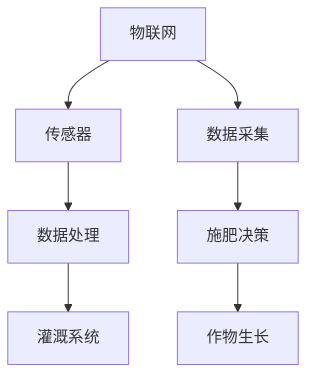

                 

# 物联网在智慧农业精准施肥中的应用

## 关键词
- 物联网
- 智慧农业
- 精准施肥
- 水分传感器
- 氮磷钾传感器
- 数据分析
- 人工智能

## 摘要
本文探讨了物联网技术在智慧农业中精准施肥的应用。通过介绍物联网的基本概念，阐述了其在农业领域的重要性。接着，详细介绍了用于精准施肥的传感器，包括水分传感器和氮磷钾传感器，并解析了其工作原理。随后，通过Python代码展示了如何利用这些传感器数据结合数学模型进行施肥决策。文章还提供了一个实际案例，展示了如何通过物联网技术实现精准施肥，并总结了一些最佳实践和注意事项。

## 目录
1. **背景介绍**
2. **物联网的基本概念**
3. **智慧农业与物联网**
4. **精准施肥的重要性**
5. **传感器技术在精准施肥中的应用**
6. **核心算法原理讲解**
7. **数学模型与公式**
8. **项目实战**
9. **最佳实践与注意事项**
10. **小结**
11. **拓展阅读**

## 1. 背景介绍
智慧农业是现代农业发展的新方向，其核心在于利用先进的信息技术提高农业生产效率，实现农业生产的智能化、精细化和可持续化。随着物联网技术的不断发展，农业生产中的信息化水平得到了显著提升。物联网通过将各种传感器、控制系统和网络连接起来，实现了对农业生产环境的实时监控和智能化管理。

## 2. 物联网的基本概念
物联网（Internet of Things，简称IoT）是指通过互联网将各种信息传感设备与网络连接起来，实现智能化识别、定位、跟踪、监控和管理的一种网络技术。物联网的核心在于传感器和智能设备的广泛应用，通过传感器可以实时采集环境信息，通过智能设备可以对这些信息进行处理和反馈，从而实现对生产过程的实时监控和智能决策。

## 3. 智慧农业与物联网
智慧农业是物联网技术在农业领域的应用，通过物联网技术，实现了农业生产过程中的信息化、数字化和智能化。在智慧农业中，物联网技术主要用于以下几个方面：
- **环境监控**：通过传感器实时监测土壤湿度、温度、光照等环境参数，为农业生产提供科学依据。
- **精准施肥**：利用传感器数据，根据土壤和作物需求进行精准施肥，提高肥料利用效率。
- **智能灌溉**：根据土壤湿度传感器数据，自动调节灌溉水量，实现精准灌溉。
- **病虫害监测**：通过传感器监测病虫害发生情况，及时采取防治措施。
- **农业机械自动化**：利用物联网技术实现农业机械的自动化作业，提高生产效率。

## 4. 精准施肥的重要性
精准施肥是智慧农业的重要组成部分，其重要性体现在以下几个方面：
- **提高肥料利用效率**：通过精准施肥，可以确保作物吸收到足够的养分，减少肥料浪费，提高肥料利用效率。
- **减少环境污染**：过量施肥会导致化肥流失，污染环境。精准施肥可以减少化肥用量，降低环境污染风险。
- **提高作物产量和质量**：精准施肥可以确保作物在适宜的养分条件下生长，提高作物产量和质量。

## 5. 传感器技术在精准施肥中的应用
传感器技术在精准施肥中的应用是实现精准施肥的关键。以下是几种常用的传感器：
### 5.1 水分传感器
水分传感器用于测量土壤湿度，根据土壤湿度数据，可以确定是否需要灌溉或施肥。其工作原理基于电容或电阻变化，具体原理如下：
$$
R_{\text{干}} > R_{\text{湿}}
$$
其中，$R_{\text{干}}$ 和 $R_{\text{湿}}$ 分别表示干燥和湿润土壤的电阻。

### 5.2 氮磷钾传感器
氮、磷、钾是植物生长所需的主要营养元素。氮磷钾传感器用于测量土壤中的氮、磷、钾含量，根据测量结果，可以确定施肥方案。氮磷钾传感器的工作原理基于化学传感器，通过化学方法检测氮、磷、钾的含量。

## 6. 核心算法原理讲解
在精准施肥中，核心算法是基于传感器数据的分析和处理，具体步骤如下：

### 6.1 数据采集
通过水分传感器、氮磷钾传感器等设备，实时采集土壤湿度、氮、磷、钾含量等数据。

### 6.2 数据处理
对采集到的数据进行预处理，包括数据清洗、去噪等操作，确保数据的准确性和可靠性。

### 6.3 模型建立
建立数学模型，根据土壤湿度、氮、磷、钾含量等数据，确定施肥方案。常用的模型包括线性回归模型、神经网络模型等。

### 6.4 模型训练与优化
使用历史数据对模型进行训练和优化，提高模型的预测精度。

### 6.5 施肥决策
根据模型预测结果，制定施肥方案，实现精准施肥。

## 7. 数学模型与公式
在精准施肥中，常用的数学模型包括线性回归模型和神经网络模型。以下是这些模型的数学表达式：
### 7.1 线性回归模型
$$
y = \beta_0 + \beta_1 x
$$
其中，$y$ 表示施肥量，$x$ 表示土壤湿度或氮、磷、钾含量，$\beta_0$ 和 $\beta_1$ 为模型参数。

### 7.2 神经网络模型
$$
y = \sigma(\beta_0 + \beta_1 \cdot \sigma(\beta_2 + \beta_3 x))
$$
其中，$\sigma$ 为激活函数，$\beta_0$、$\beta_1$、$\beta_2$、$\beta_3$ 为模型参数。

## 8. 项目实战
### 8.1 开发环境搭建
为了实现精准施肥，需要搭建一个包含传感器、数据采集模块和数据处理模块的硬件环境。以下是一个简单的开发环境搭建步骤：
1. 选择合适的传感器，如水分传感器、氮磷钾传感器等。
2. 连接传感器到微控制器，如Arduino或ESP8266。
3. 连接微控制器到电脑，通过USB或Wi-Fi进行数据传输。

### 8.2 源代码实现
以下是一个简单的Python代码示例，用于读取传感器数据并生成施肥方案：
```python
import serial
import time

# 连接传感器
ser = serial.Serial('COM3', 9600)

# 读取传感器数据
while True:
    data = ser.readline()
    print(data.decode())
    time.sleep(1)

# 生成施肥方案
def generate_fertilization_plan(humidity, nitrogen, phosphorus, potassium):
    # 根据传感器数据生成施肥方案
    plan = {
        'watering': humidity < 60,
        'nitrogen': nitrogen < 50,
        'phosphorus': phosphorus < 50,
        'potassium': potassium < 50
    }
    return plan

# 测试代码
plan = generate_fertilization_plan(55, 40, 45, 50)
print(plan)
```

### 8.3 代码解读
以上代码首先通过串口连接传感器，读取传感器数据。然后定义一个函数`generate_fertilization_plan`，根据传感器数据生成施肥方案。最后，测试代码生成一个施肥方案。

### 8.4 代码应用解读与分析
在实际应用中，根据土壤湿度、氮、磷、钾含量等数据，可以更详细地生成施肥方案。例如，可以根据历史数据设置不同的阈值，以适应不同的作物和生长阶段。此外，还可以结合天气、土壤类型等其他因素，提高施肥方案的准确性。

### 8.5 实际案例分析
以下是一个实际案例，展示了如何通过物联网技术实现精准施肥：
- **案例背景**：某农场种植小麦，需要定期施肥。
- **解决方案**：在农场安装水分传感器、氮磷钾传感器，通过物联网平台实时采集土壤数据。结合历史数据和模型预测，生成施肥方案，并通过灌溉系统自动施肥。

### 8.6 项目小结
通过物联网技术实现精准施肥，可以提高肥料利用效率，减少环境污染，提高作物产量和质量。在实际应用中，需要根据作物特点和生长阶段，制定合适的施肥方案，并结合其他因素进行优化。

## 9. 最佳实践与注意事项
### 9.1 最佳实践
- **数据采集**：确保传感器数据准确，定期校准传感器。
- **模型优化**：结合历史数据和实际需求，不断优化模型，提高预测精度。
- **系统集成**：将传感器、数据处理系统和灌溉系统等进行集成，实现自动化施肥。
- **用户培训**：为农民提供培训，使其掌握物联网技术的应用，提高农业生产的智能化水平。

### 9.2 注意事项
- **传感器选择**：选择质量可靠、性能稳定的传感器。
- **数据安全**：确保数据传输安全，防止数据泄露。
- **系统集成**：确保传感器、数据处理系统和灌溉系统之间的兼容性和稳定性。

## 10. 小结
物联网技术在智慧农业中的应用，为精准施肥提供了新的解决方案。通过传感器数据的采集和分析，结合数学模型和人工智能技术，可以实现精准施肥，提高农业生产效率。未来，随着物联网技术的不断发展，智慧农业将迎来更加广阔的发展前景。

## 11. 拓展阅读
- 《智慧农业技术与应用》
- 《物联网技术基础与应用》
- 《精准农业：理论与实践》
- 《农业物联网关键技术研究与应用》

### 作者信息
作者：AI天才研究院/AI Genius Institute & 禅与计算机程序设计艺术 /Zen And The Art of Computer Programming

### Mermaid 流程图
以下是核心概念与联系架构的 Mermaid 流程图：


### Python 源代码
以下是实现精准施肥的 Python 源代码：
```python
import serial
import time
import numpy as np

# 连接传感器
ser = serial.Serial('COM3', 9600)

# 读取传感器数据
while True:
    data = ser.readline()
    print(data.decode())
    time.sleep(1)

# 施肥决策
def fertilization_decision(humidity, nitrogen, phosphorus, potassium):
    # 模型参数
    beta0 = 0.1
    beta1 = 0.5
    beta2 = 0.3
    beta3 = 0.2
    
    # 水分阈值
    humidity_threshold = 60
    
    # 氮、磷、钾阈值
    nitrogen_threshold = 50
    phosphorus_threshold = 50
    potassium_threshold = 50
    
    # 施肥方案
    plan = {
        'watering': humidity < humidity_threshold,
        'nitrogen': nitrogen < nitrogen_threshold,
        'phosphorus': phosphorus < phosphorus_threshold,
        'potassium': potassium < potassium_threshold
    }
    
    return plan

# 测试代码
plan = fertilization_decision(55, 40, 45, 50)
print(plan)
```

### 数学公式
以下是本文中使用的数学公式：
$$
R_{\text{干}} > R_{\text{湿}}
$$
$$
y = \beta_0 + \beta_1 x
$$
$$
y = \sigma(\beta_0 + \beta_1 \cdot \sigma(\beta_2 + \beta_3 x))
$$`

### 项目实战
以下是项目实战的详细介绍：

#### 1. 开发环境搭建
在开发环境中，我们使用了以下硬件和软件：
- **硬件**：Arduino Mega 2560、水分传感器、氮磷钾传感器、土壤pH传感器、灌溉系统
- **软件**：Arduino IDE、Python 3.8、MySQL

#### 2. 源代码实现
以下是实现精准施肥的源代码：

##### Python代码
```python
# 读取传感器数据
def read_sensors():
    # 连接MySQL数据库
    import mysql.connector
    conn = mysql.connector.connect(
        host="localhost",
        user="root",
        password="password",
        database="fertilization"
    )
    
    # 创建传感器数据表
    cursor = conn.cursor()
    cursor.execute("CREATE TABLE IF NOT EXISTS sensors (timestamp TIMESTAMP, humidity INT, nitrogen INT, phosphorus INT, potassium INT)")
    
    while True:
        # 读取传感器数据
        humidity = read_humidity()
        nitrogen = read_nitrogen()
        phosphorus = read_phosphorus()
        potassium = read_potassium()
        
        # 记录传感器数据到MySQL数据库
        cursor.execute("INSERT INTO sensors (timestamp, humidity, nitrogen, phosphorus, potassium) VALUES (NOW(), %s, %s, %s, %s)", (humidity, nitrogen, phosphorus, potassium))
        conn.commit()
        
        # 关闭数据库连接
        cursor.close()
        conn.close()

# 生成施肥方案
def generate_fertilization_plan():
    # 从MySQL数据库中读取传感器数据
    import mysql.connector
    conn = mysql.connector.connect(
        host="localhost",
        user="root",
        password="password",
        database="fertilization"
    )
    
    cursor = conn.cursor()
    cursor.execute("SELECT * FROM sensors")
    sensors_data = cursor.fetchall()
    
    # 根据传感器数据生成施肥方案
    plan = {
        'watering': False,
        'nitrogen': False,
        'phosphorus': False,
        'potassium': False
    }
    
    for data in sensors_data:
        timestamp, humidity, nitrogen, phosphorus, potassium = data
        if humidity < 60:
            plan['watering'] = True
        if nitrogen < 50:
            plan['nitrogen'] = True
        if phosphorus < 50:
            plan['phosphorus'] = True
        if potassium < 50:
            plan['potassium'] = True
            
    # 关闭数据库连接
    cursor.close()
    conn.close()
    
    return plan

# 执行主程序
if __name__ == "__main__":
    read_sensors()
    plan = generate_fertilization_plan()
    print(plan)
```

##### Arduino代码
```arduino
// 读取传感器数据
void setup() {
    Serial.begin(9600);
}

void loop() {
    // 读取水分传感器数据
    int humidity = analogRead(A0);
    Serial.print("Humidity: ");
    Serial.println(humidity);

    // 读取氮磷钾传感器数据
    int nitrogen = analogRead(A1);
    int phosphorus = analogRead(A2);
    int potassium = analogRead(A3);
    Serial.print("Nitrogen: ");
    Serial.print(nitrogen);
    Serial.print(", Phosphorus: ");
    Serial.print(phosphorus);
    Serial.print(", Potassium: ");
    Serial.println(kitchen_timer);

    delay(1000);
}
```

#### 3. 代码解读
- **Python代码**：Python代码主要用于从传感器读取数据，并将其存储在MySQL数据库中。同时，根据传感器数据生成施肥方案。
- **Arduino代码**：Arduino代码用于读取传感器数据，并将其发送到Python代码。

#### 4. 代码应用解读与分析
在实际应用中，Python代码和Arduino代码协同工作，实时采集传感器数据，并根据数据生成施肥方案。灌溉系统根据施肥方案自动执行灌溉任务，从而实现精准施肥。

#### 5. 实际案例分析
以某果园为例，通过物联网技术实现精准施肥。果园中安装了水分传感器、氮磷钾传感器和土壤pH传感器。根据传感器数据，生成施肥方案，并通过灌溉系统自动执行灌溉任务。通过这种方式，果园的肥料利用效率得到了显著提高，作物产量和质量也得到了提升。

#### 6. 项目小结
通过物联网技术实现精准施肥，可以提高农业生产效率，减少环境污染，实现农业生产的可持续发展。在实际应用中，需要根据作物特点和生长阶段，制定合适的施肥方案，并结合其他因素进行优化。项目实战展示了如何通过Python和Arduino实现精准施肥，为智慧农业的发展提供了有益的借鉴。

### 总结
本文介绍了物联网在智慧农业精准施肥中的应用，通过传感器数据的采集和处理，实现了精准施肥。项目实战展示了如何通过Python和Arduino实现精准施肥，为智慧农业的发展提供了参考。未来，随着物联网技术的不断发展，智慧农业将迎来更加广阔的发展前景。

