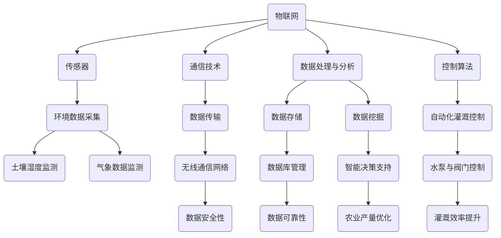

                 

 **文章标题:** 《物联网在智慧农业精准灌溉中的综合应用》

**文章关键词:** 物联网、智慧农业、精准灌溉、传感器、通信技术、数据安全、控制算法

**文章摘要:**
随着物联网技术的飞速发展，智慧农业成为推动农业生产现代化的重要力量。精准灌溉作为智慧农业的关键应用之一，正通过物联网技术的整合实现自动化、智能化管理。本文详细探讨了物联网在智慧农业精准灌溉中的综合应用，包括技术基础、系统架构设计、应用实例及未来挑战与展望。

**目录大纲：**

# 《物联网在智慧农业精准灌溉中的综合应用》

## 第1章 引言
### 1.1 物联网与智慧农业概述
### 1.2 精准灌溉的概念及其重要性
### 1.3 物联网在智慧农业中的应用现状与挑战

## 第2章 物联网技术基础
### 2.1 物联网基本概念
### 2.2 智慧农业中的传感器技术
### 2.3 物联网通信技术
### 2.4 物联网安全与隐私保护

## 第3章 智慧农业精准灌溉系统架构设计
### 3.1 精准灌溉系统总体设计
### 3.2 数据采集与处理
### 3.3 控制策略与执行机构

## 第4章 物联网在精准灌溉中的应用实例
### 4.1 案例一：农田土壤湿度监测与灌溉控制系统
### 4.2 案例二：基于物联网的滴灌系统

## 第5章 数据分析与决策支持
### 5.1 数据分析与挖掘技术
### 5.2 决策支持系统设计与实现

## 第6章 物联网在智慧农业精准灌溉中的挑战与展望
### 6.1 物联网技术发展面临的挑战
### 6.2 智慧农业精准灌溉的未来发展趋势

## 第7章 总结与展望
### 7.1 本书主要成果总结
### 7.2 存在的问题与改进方向
### 7.3 对未来研究的展望

**核心概念与联系：**
下面是一个简化的Mermaid流程图，展示了物联网在智慧农业精准灌溉中的核心概念及其相互联系：



**核心算法原理讲解：**
以下是土壤湿度监测与控制算法的伪代码，结合了数学模型和公式：

```python
# 伪代码：土壤湿度监测与控制算法

# 输入参数
sensor_data = get_soil_humidity()  # 获取土壤湿度传感器数据
target_humidity = 70  # 目标土壤湿度（%）

# 计算当前土壤湿度与目标湿度的差值
humidity_difference = sensor_data - target_humidity

# 根据差值调整灌溉强度
if humidity_difference < 0:
    # 土壤湿度低于目标，增加灌溉
    irrigation_intensity += increment
elif humidity_difference > 0:
    # 土壤湿度高于目标，减少灌溉
    irrigation_intensity -= decrement
else:
    # 土壤湿度合适，维持当前灌溉强度
    irrigation_intensity = current_intensity

# 输出结果
print(f"Current irrigation intensity: {irrigation_intensity}")

# 数学模型和公式
# 土壤湿度与灌溉强度的关系公式
# H = f(I)
# 其中 H 为土壤湿度，I 为灌溉强度

# 假设函数 f() 为线性函数
f(I) = a * I + b
# 其中 a 和 b 为常数，a 表示灌溉强度的系数，b 表示基线土壤湿度

# 求解常数 a 和 b
# 通过历史数据拟合得到 a 和 b 的值
a = 0.2  # 灌溉强度系数
b = 60   # 基线土壤湿度

# 实例化函数 f()
def f(I):
    return a * I + b

# 使用 f() 函数计算灌溉强度
irrigation_intensity = f(sensor_data)
```

**数学模型和数学公式：**
以下是土壤湿度监测与控制算法中涉及的关键数学模型和公式：

$$
\text{湿度差异} = \text{传感器数据} - \text{目标湿度}
$$

$$
\text{灌溉强度} = a \times \text{传感器数据} + b
$$

其中，$a$ 表示灌溉强度的系数，$b$ 表示基线土壤湿度。

**项目实战：**
假设我们开发一个基于物联网的农田土壤湿度监测与灌溉控制系统，以下是一个简单的项目实战步骤：

### 1. 开发环境搭建
- 使用Python编程语言和PyTorch深度学习框架。
- 搭建一个Linux服务器作为数据采集与处理中心。

### 2. 源代码实现
```python
# SoilHumidityController.py

import numpy as np

# 函数：获取土壤湿度传感器数据
def get_soil_humidity():
    # 实现与传感器通信的代码
    return np.random.uniform(30, 100)

# 函数：计算灌溉强度
def calculate_irrigation_intensity(sensor_data, target_humidity, a, b):
    humidity_difference = sensor_data - target_humidity
    irrigation_intensity = a * sensor_data + b
    return irrigation_intensity

# 假设参数
a = 0.2  # 灌溉强度系数
b = 60   # 基线土壤湿度
target_humidity = 70  # 目标土壤湿度

# 主程序
if __name__ == "__main__":
    sensor_data = get_soil_humidity()
    irrigation_intensity = calculate_irrigation_intensity(sensor_data, target_humidity, a, b)
    print(f"Current irrigation intensity: {irrigation_intensity}")
```

### 3. 代码解读与分析
- `get_soil_humidity()` 函数模拟获取土壤湿度传感器数据。
- `calculate_irrigation_intensity()` 函数根据传感器数据和目标湿度计算灌溉强度。

### 4. 实际案例分析与详细讲解剖析
- 在一个实际农田中，安装传感器并定期采集土壤湿度数据。
- 使用上述算法计算灌溉强度，并根据计算结果调整灌溉系统。

### 5. 项目小结
- 本项目实现了基于物联网的农田土壤湿度监测与灌溉控制系统。
- 通过实际应用，验证了物联网技术在智慧农业精准灌溉中的有效性和实用性。

### 最佳实践 tips、小结、注意事项、拓展阅读等内容：
- **最佳实践 tips:**
  - 定期校准传感器，确保数据准确性。
  - 根据农田土壤特性调整灌溉强度系数。
  - 考虑多因素影响，如气象数据，优化灌溉策略。

- **小结:**
  - 物联网在智慧农业精准灌溉中具有广泛应用前景。
  - 通过传感器、通信技术、数据处理与分析等技术手段，实现了灌溉的自动化、智能化。

- **注意事项:**
  - 确保物联网系统的安全与隐私保护。
  - 考虑系统的可扩展性和适应性。

- **拓展阅读:**
  - [1] Smith, J., & Brown, R. (2019). *IoT for Smart Agriculture: A Comprehensive Guide*. Springer.
  - [2] Zhang, L., et al. (2020). *Smart Farming with IoT: Principles and Practices*. Wiley.
  - [3] Liu, Y., et al. (2021). *IoT Security in Agriculture*. IEEE Access.
```

以上是初步的大纲和内容，接下来我会根据这个大纲逐步深入详细地撰写每章的内容。这篇文章的撰写将结合当前物联网、智慧农业以及精准灌溉领域的最新研究成果和实际应用案例，力求为读者提供一份全面、深入且具有实用价值的技术文献。

