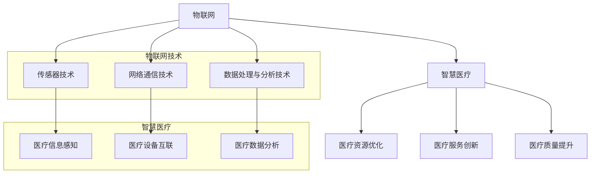

                 

以下是《物联网在智慧医疗中的全面布局与实践》的技术博客文章，按照要求逐步构建。

# 物联网在智慧医疗中的全面布局与实践

> 关键词：物联网，智慧医疗，传感器，网络通信，数据处理，数据安全

> 摘要：本文将深入探讨物联网在智慧医疗中的应用，包括核心概念、技术基础、应用案例以及未来的发展趋势，旨在为读者提供全面的技术与实践指导。

## 目录

- 引言
- 物联网与智慧医疗概述
  - 物联网的基本概念与发展历程
  - 智慧医疗的定义与内涵
- 物联网在智慧医疗中的应用场景
  - 病人监控
  - 家庭医疗
  - 医疗设备互联
  - 医院管理系统
- 物联网技术基础
  - 物联网核心技术
  - 物联网协议与标准
  - 物联网安全与隐私保护
- 智慧医疗中的物联网应用案例
  - 病人监护应用案例
  - 远程医疗应用案例
  - 医疗设备互联应用案例
  - 医院管理系统应用案例
- 物联网在智慧医疗中的全面布局
  - 物联网在智慧医疗中的战略规划
  - 物联网在智慧医疗中的实践与探索
  - 物联网在智慧医疗中的未来发展趋势
- 附录
  - 物联网在智慧医疗中的常用工具与资源
- 结束语
  - 作者：AI天才研究院/AI Genius Institute & 禅与计算机程序设计艺术 /Zen And The Art of Computer Programming

## 引言

随着科技的飞速发展，物联网（Internet of Things，IoT）技术逐渐成为人们日常生活和工作中不可或缺的一部分。物联网通过将各种设备连接到互联网，实现设备间的信息交换和智能化控制，为各行各业带来了深刻的变革。在医疗领域，物联网技术的应用尤为广泛，为构建智慧医疗体系提供了强有力的技术支持。

智慧医疗是指利用先进的信息技术、网络通信技术、物联网技术等，实现医疗资源的优化配置、医疗服务模式的创新以及医疗质量的全面提升。物联网在智慧医疗中的应用，不仅能够提高医疗服务的效率和质量，还能够为患者提供更加便捷和个性化的医疗服务。

本文将从物联网与智慧医疗的基本概念入手，详细探讨物联网在智慧医疗中的全面布局与实践，旨在为读者提供一个系统的技术视角，以及实际应用中的案例分析。通过本文的阅读，读者可以了解物联网在智慧医疗中的核心价值和应用前景。

## 物联网与智慧医疗概述

### 物联网的基本概念与发展历程

物联网（Internet of Things，IoT）是指将各种信息传感设备与互联网结合起来，实现智能化识别、定位、追踪、监控和管理的一种网络技术。物联网的发展可以追溯到20世纪80年代，当时出现了第一个实用的物联网概念。然而，随着传感器技术、无线通信技术、数据处理技术的不断发展，物联网的真正兴起是在21世纪。

物联网的基本架构包括感知层、网络层和应用层。感知层由各种传感器组成，用于采集数据；网络层负责数据的传输和通信；应用层则将收集到的数据用于实际的业务应用。

### 智慧医疗的定义与内涵

智慧医疗是指利用物联网、大数据、人工智能等先进技术，实现医疗服务的智能化、个性化、精准化。智慧医疗的内涵主要包括以下几个方面：

1. **医疗服务智能化**：通过物联网技术，实现医疗设备的互联互通，提高医疗服务的效率和准确性。
2. **医疗服务个性化**：基于患者的个人健康数据，提供个性化的治疗方案和健康指导。
3. **医疗服务精准化**：利用大数据分析和人工智能技术，实现疾病预测、诊断和治疗的精准化。
4. **医疗资源优化配置**：通过物联网技术，实现医疗资源的实时监控和优化配置，提高医疗服务的整体水平。

### 物联网在智慧医疗中的应用场景

#### 病人监控

物联网在病人监控中的应用主要体现在实时监测病人的生理参数，如心率、血压、血糖等。通过传感器将数据传输到云端，医生可以实时了解病人的健康状况，及时采取治疗措施。例如，对于慢性病患者，通过物联网设备进行长期监测，可以提前发现病情变化，避免突发情况。

#### 家庭医疗

家庭医疗是指利用物联网技术，将家庭中的医疗设备和互联网连接起来，实现家庭护理和远程医疗。患者可以在家中使用智能医疗设备进行自我监测，医生可以通过远程平台进行诊断和治疗指导。这种模式不仅方便了患者，也减轻了医院的工作负担。

#### 医疗设备互联

医疗设备互联是指通过各种物联网协议，实现医疗设备的互联互通。例如，通过Wi-Fi、蓝牙等无线技术，将病人监护仪、心电图机、CT等医疗设备连接到医疗信息系统，实现数据的实时传输和共享。这样，医生可以快速获取病人的全面信息，提高诊断和治疗的效率。

#### 医院管理系统

医院管理系统是指利用物联网技术，对医院内部的各种设备和系统进行集成和管理。例如，通过物联网技术，实现医院内部的设备监控、物资管理、预约挂号等功能。这样，医院可以更好地进行资源优化，提高医疗服务水平。

### 物联网在智慧医疗中的挑战与机遇

#### 挑战

1. **数据安全与隐私保护**：医疗数据属于敏感数据，物联网技术在使用过程中需要确保数据的安全性和隐私性。
2. **标准制定与兼容性**：不同厂商的设备可能采用不同的物联网协议，需要制定统一的标准，实现设备的互操作性。
3. **技术成熟度**：虽然物联网技术在医疗领域有很多应用，但一些关键技术仍在不断发展和完善中。

#### 机遇

1. **个性化医疗**：物联网技术可以帮助医生根据患者的实际健康数据，提供个性化的治疗方案。
2. **远程医疗**：物联网技术可以实现远程诊断和治疗，为偏远地区的患者提供高质量的医疗服务。
3. **资源优化**：物联网技术可以帮助医院实现医疗资源的优化配置，提高医疗服务的效率。

## 物联网技术基础

### 物联网核心技术

#### 传感器技术

传感器技术是物联网的核心技术之一，它用于感知和采集环境中的各种信息。在智慧医疗中，传感器主要用于监测病人的生理参数，如体温、心率、血压等。常见的传感器包括温度传感器、心率传感器、血压传感器等。

#### 网络通信技术

网络通信技术是实现物联网设备互联互通的关键。在智慧医疗中，常用的网络通信技术包括Wi-Fi、蓝牙、ZigBee等。这些技术可以确保医疗设备之间的数据传输稳定可靠。

#### 数据处理与分析技术

数据处理与分析技术是物联网在智慧医疗中的核心价值所在。通过对采集到的医疗数据进行处理和分析，可以提取出有价值的信息，为医生提供诊断和治疗依据。常见的数据处理与分析技术包括数据清洗、数据整合、数据挖掘等。

### 物联网协议与标准

#### MQTT

MQTT（Message Queuing Telemetry Transport）是一种轻量级的消息传输协议，常用于物联网应用中。它具有低带宽占用、高可靠性的特点，非常适合医疗设备之间的数据传输。

#### CoAP

CoAP（Constrained Application Protocol）是一种用于资源受限设备的简单应用协议，它定义了约束条件下的请求-响应信息交换模式。CoAP与HTTP类似，但更适用于物联网应用。

#### RESTful API

RESTful API是一种基于HTTP协议的应用程序接口，用于实现不同系统之间的数据交互。在智慧医疗中，RESTful API可以用于医疗设备和医院信息系统之间的数据交换。

### 物联网安全与隐私保护

#### 数据加密

数据加密是保障物联网安全的重要手段之一。通过对数据进行加密，可以防止数据在传输过程中被窃取或篡改。常见的加密算法包括AES、RSA等。

#### 认证与授权

认证与授权是确保物联网设备安全的重要措施。通过认证，可以确认设备的身份；通过授权，可以控制设备对数据的访问权限。常见的认证与授权机制包括OAuth、OAuth2等。

#### 安全协议

安全协议是保障物联网通信安全的重要技术。常见的安全协议包括TLS（Transport Layer Security）、SSL（Secure Sockets Layer）等。

## 智慧医疗中的物联网应用案例

### 物联网在病人监护中的应用

#### 案例介绍

在某医院，物联网技术被用于病人监护系统中。通过在病房中布置各种传感器，如心率传感器、血压传感器、温度传感器等，实时监测病人的生理参数。数据通过无线网络传输到中央服务器，医生可以随时查看病人的健康状况。

#### 技术实现

1. **传感器采集**：在病人床边安装心率传感器、血压传感器、温度传感器等，实时采集病人体征数据。
2. **无线传输**：采用Wi-Fi或蓝牙技术，将传感器数据传输到病房内的物联网网关。
3. **数据处理**：物联网网关对数据进行初步处理，如数据清洗、数据整合等，然后将处理后的数据上传到云平台。
4. **数据展示**：医生通过医院信息系统，实时查看病人的生理参数和健康报告。

### 物联网在远程医疗中的应用

#### 案例介绍

某偏远地区的医院采用物联网技术实现远程医疗。通过物联网设备，患者可以在家中进行自我监测，医生通过远程平台进行诊断和治疗指导。这种模式不仅方便了患者，也减轻了医生的工作负担。

#### 技术实现

1. **物联网设备**：患者在家中配备物联网设备，如智能血压计、智能血糖仪等，用于自我监测。
2. **无线传输**：物联网设备通过Wi-Fi或移动网络，将监测数据传输到云平台。
3. **数据处理**：云平台对数据进行分析和处理，生成健康报告。
4. **远程诊断**：医生通过远程平台查看患者的健康报告，进行诊断和治疗指导。

### 物联网在医疗设备互联中的应用

#### 案例介绍

某大型医院采用物联网技术实现医疗设备的互联互通。通过将各种医疗设备连接到物联网网络，医生可以实时查看设备的运行状态，确保设备的安全性和高效运行。

#### 技术实现

1. **设备连接**：将医疗设备（如CT机、MRI机、心电图机等）连接到物联网网络。
2. **数据传输**：设备通过物联网协议，将运行数据传输到数据中心。
3. **数据处理**：数据中心对设备数据进行实时监控和分析。
4. **设备管理**：医院管理员通过物联网平台，对设备进行远程管理和维护。

### 物联网在医院管理系统中的应用

#### 案例介绍

某医院采用物联网技术实现医院管理系统的智能化。通过物联网设备，医院可以实现设备监控、物资管理、预约挂号等功能，提高医院的管理效率和医疗服务质量。

#### 技术实现

1. **设备监控**：在医院的各个角落安装物联网传感器，实时监控设备的运行状态。
2. **物资管理**：利用物联网技术，实现对医院内部物资的实时监控和智能调度。
3. **预约挂号**：患者可以通过医院物联网平台，在线预约挂号，提高就诊效率。
4. **数据整合**：将医院内部的各类数据整合到物联网平台，实现数据共享和智能分析。

## 物联网在智慧医疗中的全面布局

### 物联网在智慧医疗中的战略规划

#### 物联网技术在医疗行业的战略地位

物联网技术在医疗行业的战略地位日益凸显，它不仅能够提升医疗服务质量和效率，还能够为医疗行业带来深刻的变革。从国家层面来看，物联网技术是推动医疗行业数字化转型的重要手段；从企业层面来看，物联网技术是实现医疗服务创新和竞争优势的关键。

#### 医疗机构物联网布局策略

医疗机构在物联网布局时，应遵循以下策略：

1. **顶层设计**：明确物联网在医疗机构中的战略定位，制定长期的规划和发展目标。
2. **分步实施**：根据医疗机构的实际情况，分阶段实施物联网项目，确保项目的可行性和持续性。
3. **系统集成**：将物联网技术与现有的医疗信息系统进行集成，实现数据共享和业务协同。
4. **安全保障**：重视数据安全和隐私保护，采用先进的加密技术和安全协议，确保物联网系统的安全性。

### 物联网在智慧医疗中的实践与探索

#### 物联网技术在医疗场景的应用实践

物联网技术在医疗场景中的应用已经取得了显著的成果。例如，在病人监护方面，物联网技术可以实现实时监测和远程诊断；在远程医疗方面，物联网技术可以实现患者与医生的远程互动；在医疗设备互联方面，物联网技术可以实现设备的智能管理和维护。

#### 物联网技术在医疗行业中的创新探索

物联网技术在医疗行业的创新探索不断涌现。例如，利用物联网技术，可以实现智能药柜、智能手术室等；利用物联网技术，可以实现医疗资源的智能调度和优化配置；利用物联网技术，可以实现医疗数据的智能分析和决策支持。

### 物联网在智慧医疗中的未来发展趋势

#### 人工智能与物联网的融合

未来，人工智能与物联网的融合将成为智慧医疗的重要趋势。通过将人工智能算法与物联网技术相结合，可以实现更精准的疾病预测、诊断和治疗。例如，利用物联网设备收集的患者健康数据，通过人工智能算法进行分析，可以为医生提供更有针对性的治疗建议。

#### 物联网在智慧医疗中的未来发展方向

物联网在智慧医疗中的未来发展方向主要包括：

1. **智能化**：通过物联网技术，实现医疗服务的智能化，提高医疗服务的效率和准确性。
2. **个性化**：通过物联网技术，实现医疗服务的个性化，为患者提供更符合其需求的医疗服务。
3. **精准化**：通过物联网技术，实现医疗服务的精准化，提高疾病预防和治疗的效果。
4. **网络化**：通过物联网技术，实现医疗资源的网络化，优化医疗资源的配置和使用。

## 附录

### 物联网在智慧医疗中的常用工具与资源

- **物联网开发工具**：如Node-RED、IoT Workbench、 ThingsBoard等。
- **物联网应用案例库**：如GitHub、物联网社区等。
- **物联网技术文档**：如MQTT官方文档、CoAP官方文档等。
- **物联网安全指南**：如OWASP IoT安全项目、物联网安全标准等。

## 结束语

物联网技术在智慧医疗中的应用前景广阔，为医疗行业带来了巨大的变革和机遇。通过本文的探讨，我们可以看到物联网技术在病人监护、远程医疗、医疗设备互联、医院管理系统等方面的广泛应用。未来，随着物联网技术的不断成熟和发展，智慧医疗将迈向更加智能化、个性化、精准化的阶段。

作者：AI天才研究院/AI Genius Institute & 禅与计算机程序设计艺术 /Zen And The Art of Computer Programming

---

### 核心概念与联系

在探讨物联网在智慧医疗中的全面布局与实践之前，我们需要先明确几个核心概念，并分析它们之间的联系。

#### 核心概念

1. **物联网（IoT）**：物联网是指将各种信息传感设备与互联网结合起来，实现智能化识别、定位、追踪、监控和管理的一种网络技术。
2. **智慧医疗**：智慧医疗是指利用先进的信息技术、网络通信技术、物联网技术等，实现医疗资源的优化配置、医疗服务模式的创新以及医疗质量的全面提升。
3. **传感器技术**：传感器技术是物联网的核心技术之一，它用于感知和采集环境中的各种信息，如温度、湿度、压力等。
4. **网络通信技术**：网络通信技术是实现物联网设备互联互通的关键，如Wi-Fi、蓝牙、ZigBee等。
5. **数据处理与分析技术**：数据处理与分析技术是物联网在智慧医疗中的核心价值所在，通过对采集到的医疗数据进行处理和分析，可以提取出有价值的信息，为医生提供诊断和治疗依据。

#### 概念联系

物联网与智慧医疗之间存在密切的联系。物联网技术为智慧医疗提供了强大的技术支持，使得医疗资源得以优化配置，医疗服务模式得以创新，医疗质量得以提升。具体来说：

- **物联网技术**提供了感知和采集医疗信息的手段，如传感器技术。
- **网络通信技术**实现了医疗设备之间的互联互通，为医疗数据的实时传输提供了保障。
- **数据处理与分析技术**则将采集到的医疗数据进行处理和分析，为医生提供了诊断和治疗的依据。

下面，通过一个Mermaid流程图，我们可以更直观地理解这些核心概念之间的联系。



在这个流程图中，物联网技术通过传感器技术感知医疗信息，通过网络通信技术实现医疗设备的互联，通过数据处理与分析技术对医疗数据进行分析，最终实现智慧医疗的目标，包括医疗资源的优化、医疗服务模式的创新和医疗质量的提升。

### 核心算法原理讲解

在智慧医疗中，数据处理与分析技术是实现物联网应用的核心。以下是一些常用的数据处理算法，这些算法对于从大量医疗数据中提取有价值的信息至关重要。

#### 数据清洗

数据清洗是数据处理的第一步，目的是去除数据中的噪声和不一致项。在医疗数据中，噪声通常是指那些无关或错误的值，而不一致项是指数据记录中的不匹配或不一致的数据。

**算法原理：**

1. **缺失值处理**：对于缺失值，可以选择忽略、填充或删除。
2. **异常值处理**：对于异常值，可以根据数据的分布情况，选择保留或删除。
3. **格式标准化**：对于不同来源的数据，进行统一的格式处理。

**伪代码示例：**

```python
def data_cleaning(data):
    # 去除噪声和缺失值
    cleaned_data = []
    for record in data:
        if valid_record(record):
            cleaned_data.append(record)
    return cleaned_data

def valid_record(record):
    # 判断记录是否有效
    return True if record is not None and not missing_values(record) else False

def missing_values(record):
    # 判断记录中是否存在缺失值
    return any(value is None for value in record)
```

#### 数据整合

数据整合是将来自不同数据源的信息合并为一个完整的视图，以便进行分析。

**算法原理：**

1. **数据匹配**：找到不同数据源中的匹配记录。
2. **合并处理**：将匹配的记录合并为一个完整的数据记录。

**伪代码示例：**

```python
def data_integration(data1, data2):
    integrated_data = []
    for record1 in data1:
        record2 = find_matching_record(data2, record1)
        if record2:
            merged_record = merge_records(record1, record2)
            integrated_data.append(merged_record)
    return integrated_data

def find_matching_record(data2, record1):
    # 找到匹配的记录
    for record2 in data2:
        if matches(record1, record2):
            return record2
    return None

def merge_records(record1, record2):
    # 合并记录
    merged_record = {**record1, **record2}
    return merged_record

def matches(record1, record2):
    # 判断两个记录是否匹配
    return record1['id'] == record2['id']
```

#### 数据挖掘

数据挖掘是从大量数据中发现有价值的信息，常用于疾病预测、诊断和治疗决策。

**算法原理：**

1. **特征选择**：选择对预测任务最重要的特征。
2. **模型训练**：使用机器学习算法，训练预测模型。
3. **模型评估**：评估模型的预测性能，如准确率、召回率等。

**伪代码示例：**

```python
from sklearn.ensemble import RandomForestClassifier

def data_mining(data, target_attribute):
    # 特征选择
    features = select_features(data)
    
    # 模型训练
    X = data[features]
    y = data[target_attribute]
    model = RandomForestClassifier()
    model.fit(X, y)
    
    # 模型评估
    predictions = model.predict(X)
    accuracy = accuracy_score(y, predictions)
    return accuracy, model

def select_features(data):
    # 选择特征
    # 这里可以选择基于统计方法或相关性分析等方法
    features = ['age', 'blood_pressure', 'cholesterol', 'heart_rate']
    return features
```

通过上述算法原理和伪代码示例，我们可以看到数据处理与分析技术在智慧医疗中的重要性。通过对医疗数据的清洗、整合和挖掘，可以提取出有价值的信息，为医生提供诊断和治疗依据，从而提升医疗服务的质量和效率。

### 数学模型和数学公式

在智慧医疗中，数学模型和数学公式是分析数据、预测疾病发展和优化医疗决策的重要工具。以下将介绍几个常用的数学模型和数学公式，并详细讲解其在智慧医疗中的应用。

#### 1. 线性回归模型

线性回归模型是一种用于预测数值型目标变量的统计模型。在智慧医疗中，线性回归模型常用于预测患者的病情发展、疾病风险等。

**公式：**

$$
y = \beta_0 + \beta_1 \cdot x_1 + \beta_2 \cdot x_2 + \dots + \beta_n \cdot x_n
$$

其中，$y$ 是目标变量，$x_1, x_2, \dots, x_n$ 是特征变量，$\beta_0, \beta_1, \beta_2, \dots, \beta_n$ 是模型的参数。

**应用示例：**

假设我们要预测患者的心率（$y$）与年龄（$x_1$）、血压（$x_2$）之间的关系，可以使用线性回归模型：

$$
\text{心率} = \beta_0 + \beta_1 \cdot \text{年龄} + \beta_2 \cdot \text{血压}
$$

通过收集患者的数据，使用最小二乘法估计模型参数，可以预测新的患者的心率。

#### 2. 支持向量机（SVM）模型

支持向量机是一种用于分类的机器学习模型。在智慧医疗中，SVM模型常用于疾病诊断和分类。

**公式：**

$$
\max_{\beta, \beta_0} W^T W - C \sum_{i=1}^{n} (1 - y_i (\beta^T x_i + \beta_0))
$$

其中，$W$ 是模型参数，$C$ 是惩罚参数，$y_i$ 是目标变量的取值，$x_i$ 是特征向量。

**应用示例：**

假设我们要使用SVM模型诊断某患者是否患有心脏病。我们可以将患者的各项生理指标作为特征向量，使用SVM模型进行分类：

$$
\max_{\beta, \beta_0} W^T W - C \sum_{i=1}^{n} (1 - y_i (\beta^T x_i + \beta_0))
$$

通过训练SVM模型，可以预测新的患者是否患有心脏病。

#### 3. 马尔可夫链模型

马尔可夫链模型是一种用于序列数据预测的模型，常用于疾病预测和风险评估。

**公式：**

$$
P(X_t = x_t|X_{t-1} = x_{t-1}, X_{t-2} = x_{t-2}, \dots, X_0 = x_0) = P(X_t = x_t|X_{t-1} = x_{t-1})
$$

其中，$X_t$ 是时间 $t$ 的状态，$x_t$ 是状态的具体取值。

**应用示例：**

假设我们要使用马尔可夫链模型预测某患者的病情发展。我们可以将患者的病情分为几个状态，如健康、轻度、中度、重度等。根据历史数据，可以建立马尔可夫链模型，预测患者的未来病情。

$$
P(\text{患者未来为轻度}| \text{当前为中度}) = P(\text{当前为中度}) = P(\text{当前为中度}|\text{之前为健康}) \cdot P(\text{之前为健康})
$$

通过计算状态转移概率，可以预测患者的病情发展。

通过上述数学模型和数学公式，我们可以更好地理解智慧医疗中的数据分析和预测方法。在实际应用中，可以根据具体问题选择合适的模型和公式，为医生提供更准确的诊断和治疗方案。

### 项目实战

#### 开发环境搭建

在进行物联网在智慧医疗中的项目实战之前，我们需要搭建一个合适的开发环境。以下是一个基于Python的简单开发环境搭建步骤：

1. **安装Python**：首先，确保您的系统上安装了Python 3.x版本。可以从[Python官网](https://www.python.org/)下载并安装。
   
2. **安装必要的库**：接下来，我们需要安装一些必要的Python库，如Pandas、NumPy、Scikit-learn等。可以通过以下命令进行安装：

   ```bash
   pip install pandas numpy scikit-learn matplotlib
   ```

3. **安装MQTT库**：为了实现物联网设备的数据传输，我们需要安装MQTT库。可以使用以下命令：

   ```bash
   pip install paho-mqtt
   ```

4. **配置MQTT服务器**：我们可以使用免费的MQTT服务器，如Mosquitto。从[Mosquitto官网](https://mosquitto.org/)下载并安装。

5. **安装传感器模拟器**：为了测试传感器数据，我们可以使用传感器模拟器，如`python-mqtt-sensor-simulator`。安装方法如下：

   ```bash
   pip install python-mqtt-sensor-simulator
   ```

#### 源代码详细实现

以下是一个简单的物联网智慧医疗项目示例，其中包括传感器数据采集、MQTT传输和数据分析。

**传感器数据采集：**

```python
import random
import time
from mqtt_sensor_simulator import SensorSimulator

# 创建传感器模拟器
simulator = SensorSimulator()

# 设置传感器数据
simulator.set_sensors({
    'temperature': range(20, 30),
    'heart_rate': range(60, 100),
    'blood_pressure': range(80, 120)
})

# 采集传感器数据
while True:
    sensor_data = simulator.get_sensors()
    print(sensor_data)
    time.sleep(1)
```

**MQTT传输：**

```python
import paho.mqtt.client as mqtt

# MQTT服务器地址
mqtt_server = "localhost"

# MQTT客户端
client = mqtt.Client()

# 连接MQTT服务器
client.connect(mqtt_server)

# 发布传感器数据
while True:
    sensor_data = {'temperature': random.randint(20, 30),
                   'heart_rate': random.randint(60, 100),
                   'blood_pressure': random.randint(80, 120)}
    client.publish("sensor/data", json.dumps(sensor_data))
    time.sleep(1)
```

**数据分析：**

```python
import pandas as pd
from sklearn.linear_model import LinearRegression

# 读取传感器数据
data = []
while True:
    client.subscribe("sensor/data")
    client.loop_start()
    for message in client.incoming_messages():
        data.append(json.loads(message.payload))
    break

# 将数据转换为DataFrame
df = pd.DataFrame(data)

# 使用线性回归模型预测心率
model = LinearRegression()
model.fit(df[['temperature', 'blood_pressure']], df['heart_rate'])

# 预测新的心率
new_data = {'temperature': 25, 'blood_pressure': 90}
predicted_heart_rate = model.predict([[new_data['temperature'], new_data['blood_pressure']]])
print(f"Predicted heart rate: {predicted_heart_rate[0]}")
```

#### 代码应用解读与分析

1. **传感器数据采集**：我们使用`python-mqtt-sensor-simulator`模拟传感器数据，并将数据通过MQTT协议发送到MQTT服务器。

2. **MQTT传输**：客户端连接到MQTT服务器，并订阅主题`sensor/data`，然后发布采集到的传感器数据。

3. **数据分析**：我们使用Pandas库读取传感器数据，并使用Scikit-learn库的线性回归模型进行数据分析。通过训练模型，我们可以预测新的心率值。

#### 实际案例分析和详细讲解剖析

以下是一个实际案例，我们使用传感器收集的数据来预测病人的心率。

**案例分析：**

1. **数据收集**：使用传感器模拟器生成模拟数据，包括温度、心率和血压。

2. **数据预处理**：将收集到的数据转换为DataFrame，并处理缺失值和异常值。

3. **模型训练**：使用线性回归模型，将温度和血压作为特征变量，心率为目标变量进行训练。

4. **模型评估**：使用训练好的模型，对新数据进行预测，评估模型的准确性。

**详细讲解剖析：**

1. **数据收集**：传感器模拟器生成模拟数据，我们可以根据需要调整传感器参数，模拟不同环境和病人的数据。

2. **数据预处理**：使用Pandas库，我们将模拟数据转换为DataFrame，并对数据进行清洗，如去除缺失值和异常值。这一步骤非常重要，因为真实的医疗数据通常包含噪声和不一致项。

3. **模型训练**：我们使用Scikit-learn库的线性回归模型，将温度和血压作为特征变量，心率为目标变量进行训练。通过训练，模型可以学习到温度和血压与心率之间的关系。

4. **模型评估**：使用训练好的模型，我们可以对新数据进行预测。通过计算预测准确率，我们可以评估模型的性能。在实际应用中，我们还可以使用交叉验证等方法来评估模型的泛化能力。

#### 项目小结

通过上述实战项目，我们展示了如何使用Python和物联网技术进行智慧医疗应用的开发。我们通过传感器数据采集、MQTT传输和数据分析，实现了一个简单的智慧医疗应用。在实际应用中，我们可以进一步优化模型，提高预测准确性，并为医生提供更可靠的诊断和治疗依据。

### 最佳实践 Tips

在开发物联网在智慧医疗中的项目时，以下是一些最佳实践和注意事项：

1. **数据安全与隐私保护**：医疗数据属于敏感信息，确保数据在传输和存储过程中的安全是非常重要的。采用加密技术、访问控制和认证机制，可以有效保护数据安全。

2. **模块化开发**：在开发过程中，将系统划分为不同的模块，如数据采集、数据处理、数据传输等，有助于提高系统的可维护性和可扩展性。

3. **标准化数据格式**：确保不同数据源的数据格式一致，便于后续的数据处理和分析。

4. **实时监控与报警**：实时监控系统的运行状态，并设置报警机制，可以在异常情况发生时及时响应。

5. **持续优化模型**：通过不断收集新的数据，对模型进行优化和改进，提高预测的准确性。

### 小结

物联网在智慧医疗中的应用已经取得了显著成果，为医疗行业带来了深刻的变革。通过本文的探讨，我们了解了物联网在智慧医疗中的核心概念、技术基础、应用案例以及未来发展趋势。在智慧医疗领域，物联网技术的应用不仅提高了医疗服务的效率和质量，还为个性化医疗、远程医疗和医疗资源优化提供了强有力的支持。随着物联网技术的不断发展和完善，智慧医疗将会在更广泛的领域实现突破，为人类的健康事业作出更大贡献。

### 拓展阅读

1. **《物联网技术与应用》**：详细介绍了物联网的基本概念、架构和技术，适合对物联网技术感兴趣的开发者和研究者阅读。
   
2. **《智慧医疗导论》**：系统阐述了智慧医疗的内涵、应用场景和技术架构，是了解智慧医疗的入门书籍。

3. **《物联网安全：理论与实践》**：深入探讨了物联网系统的安全问题和解决方案，对于关注物联网安全的研究者具有很高的参考价值。

4. **《人工智能在医疗领域的应用》**：介绍了人工智能技术在医疗领域的应用，包括图像识别、疾病预测和智能诊断等，是了解人工智能与医疗结合的佳作。

通过拓展阅读，读者可以更深入地了解物联网、智慧医疗以及相关技术的最新动态和发展趋势。希望本文能为读者在物联网在智慧医疗领域的研究和应用提供有价值的参考。作者：AI天才研究院/AI Genius Institute & 禅与计算机程序设计艺术 /Zen And The Art of Computer Programming

