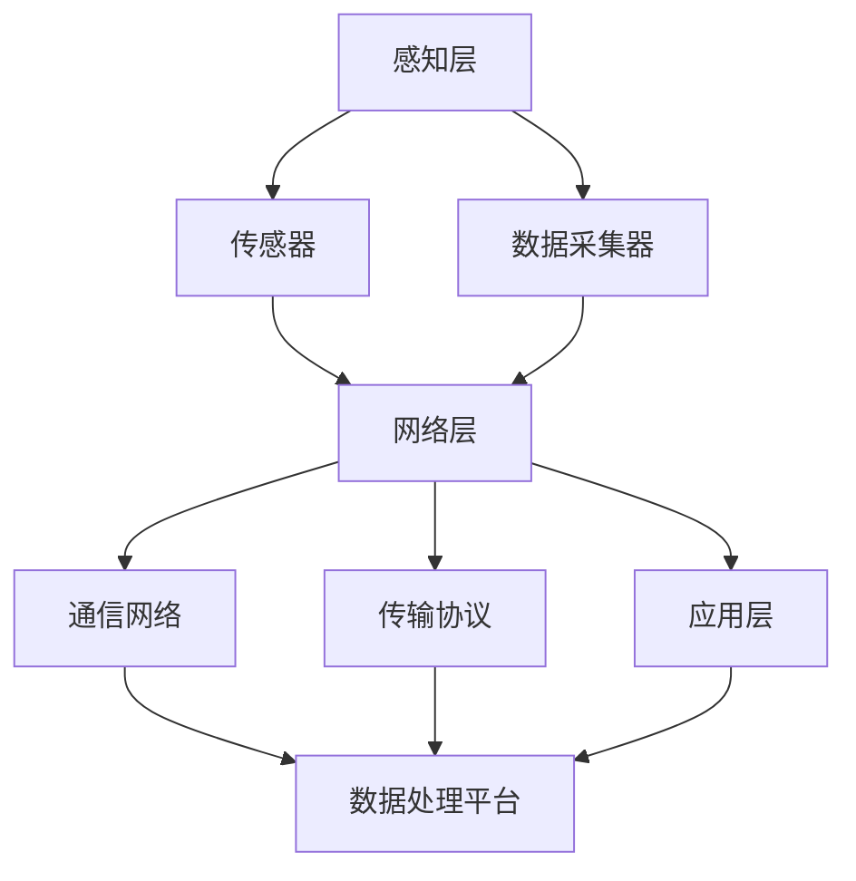
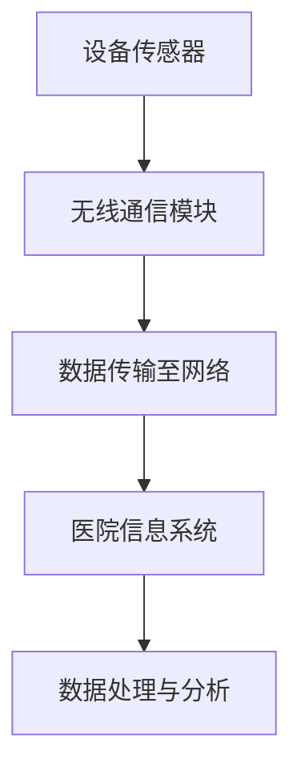
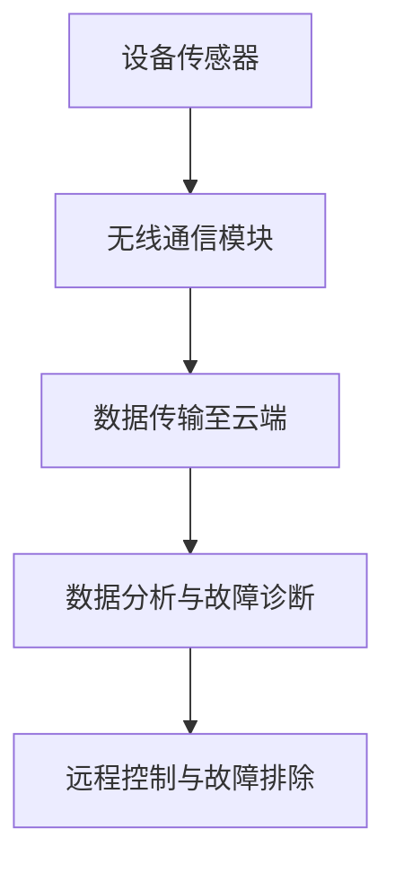
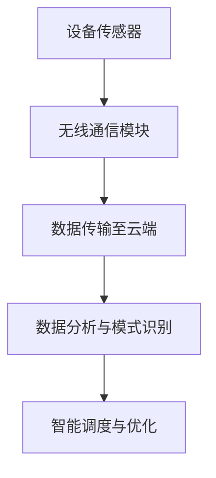
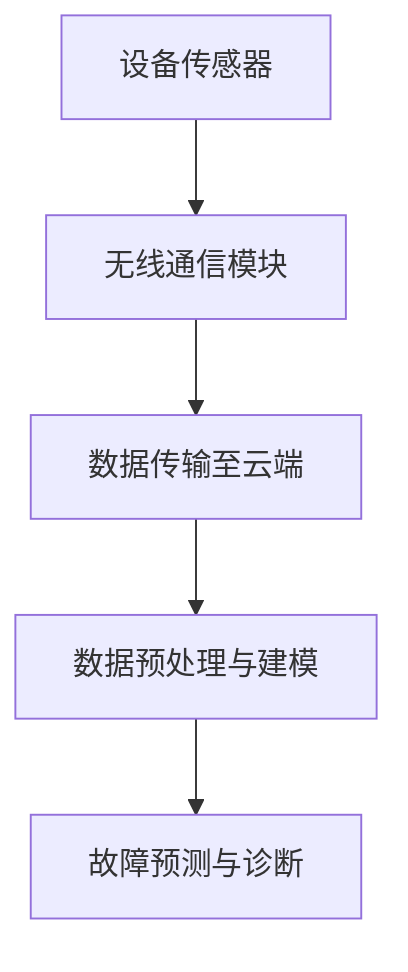

                 

### 引言和概述

#### 物联网与智慧医疗的背景

物联网（Internet of Things，IoT）是近年来发展迅猛的一个技术领域，其核心思想是将各种物理设备通过网络连接起来，实现智能化的信息交换和协同工作。物联网的应用场景非常广泛，涵盖了智能家居、工业自动化、智慧城市等多个领域。随着技术的进步和应用的深入，物联网在医疗领域的应用也逐渐受到重视，形成了智慧医疗（Smart Health）这一新兴领域。

智慧医疗是指通过信息技术、物联网技术等手段，提高医疗服务的效率和质量，实现医疗资源的优化配置和智能管理。智慧医疗的应用包括远程医疗、电子病历、智能医疗器械等多个方面，能够有效改善患者的就医体验，提高医疗服务的可及性和效率。在全球医疗资源紧张、人口老龄化加剧的背景下，智慧医疗的发展具有重要意义。

#### 物联网在医疗设备管理中的意义

在智慧医疗中，医疗设备管理是一个重要的组成部分。医疗设备是医疗服务的重要工具，其正常运行和高效管理对于保障医疗服务质量至关重要。物联网技术在医疗设备管理中的应用，可以带来以下几个方面的意义：

1. **设备状态的实时监控**：通过物联网技术，医疗设备可以实时采集并传输运行数据，如温度、湿度、电量等，实现对设备状态的实时监控和预警。

2. **远程维护和故障排除**：物联网技术可以实现设备的远程监控和维护，通过远程诊断和故障排除，减少设备的停机时间，提高设备利用率。

3. **智能调度和优化**：物联网技术可以收集并分析设备的使用数据，实现对设备的智能调度和优化，提高设备的利用效率。

4. **设备管理和维护成本的降低**：通过物联网技术，可以实现设备的远程监控和远程维护，减少现场维护的工作量，从而降低维护成本。

#### 本书结构安排

本书旨在系统地介绍物联网在智慧医疗设备管理中的应用，全书共分为七个章节。具体结构如下：

- **第1章 引言和概述**：介绍物联网和智慧医疗的背景，以及本书的结构安排。
- **第2章 物联网技术基础**：介绍物联网的基本概念、架构和通信协议。
- **第3章 智慧医疗设备管理**：讨论智慧医疗设备管理的现状和关键技术。
- **第4章 物联网在医疗设备管理中的应用**：详细介绍物联网在医疗设备监测、远程控制、智能调度等方面的应用。
- **第5章 安全与隐私保护**：讨论物联网在医疗设备管理中面临的隐私和安全问题。
- **第6章 案例分析**：分析几个典型的物联网医疗设备管理案例。
- **第7章 未来发展趋势与挑战**：探讨物联网在智慧医疗设备管理中的未来发展趋势和挑战。

通过本书的阅读，读者可以全面了解物联网在智慧医疗设备管理中的应用，掌握相关的技术和方法，为实际应用提供参考。

### 关键词

- 物联网
- 智慧医疗
- 医疗设备管理
- 实时监控
- 远程维护
- 安全与隐私保护

### 摘要

本文系统地介绍了物联网在智慧医疗设备管理中的应用。首先，通过介绍物联网和智慧医疗的背景，阐述了物联网在医疗设备管理中的意义。然后，详细介绍了物联网技术基础、智慧医疗设备管理的关键技术，以及物联网在医疗设备监测、远程控制、智能调度等方面的具体应用。此外，本文还讨论了物联网在医疗设备管理中面临的隐私和安全问题，并通过案例分析展示了物联网技术的实际应用效果。最后，本文对物联网在智慧医疗设备管理中的未来发展趋势和挑战进行了展望。通过本文的阅读，读者可以全面了解物联网在智慧医疗设备管理中的应用，为实际应用提供参考。 

---

## 物联网技术基础

### 物联网基本概念

物联网（Internet of Things，IoT）是指通过互联网将各种物理设备连接起来，实现设备与设备之间的信息交换和协同工作。物联网的核心思想是让物理世界中的各种设备都具有智能，能够相互感知、通信和协同，从而实现自动化、智能化的管理。

#### 物联网的定义

物联网是一种网络技术，它通过将传感器、设备、计算机系统等物理设备连接起来，形成一个庞大的网络系统。在这个系统中，每个设备都能够采集数据、发送数据，并接收其他设备发送的数据，从而实现信息的共享和交互。

#### 物联网的特点

1. **连接性**：物联网通过互联网将各种物理设备连接起来，形成一个庞大的网络系统。
2. **感知性**：物联网设备能够采集各种环境数据，如温度、湿度、光线等，实现对周围环境的感知。
3. **智能化**：物联网设备通过数据处理和分析，能够实现自动化控制，提高设备的工作效率和智能化水平。
4. **高效性**：物联网技术能够实现实时数据传输和处理，提高数据传输的速度和准确性。

#### 物联网的组成部分

物联网系统通常由以下几个部分组成：

1. **感知层**：包括传感器和感知设备，用于采集各种环境数据。
2. **网络层**：包括通信网络和传输协议，用于数据传输和通信。
3. **平台层**：包括数据处理平台和应用程序，用于数据处理和应用开发。
4. **应用层**：包括各种应用场景，如智能家居、智慧城市、智慧医疗等。

### 物联网架构与通信协议

物联网的架构通常分为三个层次：感知层、网络层和应用层。每一层都有其特定的功能和组件。

#### 感知层

感知层是物联网系统的基础，主要功能是采集各种环境数据。感知层包括各种传感器、RFID（射频识别）设备、摄像头等，这些设备能够实时监测周围的环境，并将数据传输到网络层。

#### 网络层

网络层负责数据的传输和通信。网络层包括无线传感器网络（WSN）、移动通信网络、互联网等。这些网络能够将感知层采集到的数据传输到平台层，同时也能够接收平台层的指令，实现对设备的控制。

#### 应用层

应用层是物联网系统的最高层次，负责数据处理和应用开发。应用层通过平台层提供的数据接口，开发各种应用场景，如智能家居、智慧城市、智慧医疗等。

#### 物联网通信协议

物联网通信协议是物联网系统中数据传输和通信的基础。常见的物联网通信协议包括ZigBee、蓝牙、Wi-Fi、LoRa等。

1. **ZigBee**：是一种短距离、低功耗的无线通信协议，常用于智能家居和工业自动化等领域。
2. **蓝牙**：是一种短距离、低功耗的无线通信技术，广泛应用于各种智能设备，如智能手机、智能手表等。
3. **Wi-Fi**：是一种宽带无线通信技术，具有较高的数据传输速率，常用于家庭和办公环境。
4. **LoRa**：是一种长距离、低功耗的无线通信技术，适合于远程监控和物联网应用。

### 物联网设备技术

物联网设备是物联网系统的核心，其技术特点主要包括以下几个方面：

1. **传感器技术**：传感器技术是物联网设备的关键，它能够实时监测环境数据，并将数据传输到网络层。
2. **嵌入式系统技术**：嵌入式系统技术是物联网设备的基础，它包括处理器、存储器、输入输出接口等，能够实现对设备的控制和管理。
3. **无线通信技术**：无线通信技术是物联网设备的关键，它能够实现设备之间的数据传输和通信。
4. **数据处理技术**：数据处理技术是物联网设备的重要功能，它能够对采集到的数据进行分析和处理，实现对设备的智能控制。

#### 智能传感器

智能传感器是物联网设备的重要组成部分，它具有感知、处理和通信功能。智能传感器通常由以下几个部分组成：

1. **传感器核心**：负责采集环境数据，如温度、湿度、光线等。
2. **微处理器**：负责对传感器数据进行处理，如数据滤波、数据分析等。
3. **无线通信模块**：负责将传感器数据传输到网络层。
4. **电源管理模块**：负责对设备进行电源管理，延长设备的使用寿命。

#### 物联网网关

物联网网关是物联网系统中的重要组件，它负责将各种物联网设备连接到互联网，实现数据的采集、传输和处理。物联网网关通常具有以下几个功能：

1. **协议转换**：将不同协议的数据进行转换，实现不同设备之间的通信。
2. **数据存储和处理**：将采集到的数据存储和处理，为应用层提供数据支持。
3. **远程控制**：实现对物联网设备的远程控制和管理。

#### 物联网设备的发展趋势

随着物联网技术的不断发展，物联网设备的技术特点和应用场景也在不断丰富和扩展。未来，物联网设备将向以下几个方向发展：

1. **智能化**：物联网设备将具有更高的智能化水平，能够实现更复杂的功能和自动化操作。
2. **小型化**：物联网设备将越来越小型化，便于安装和携带。
3. **低功耗**：物联网设备将具有更低的功耗，延长设备的使用寿命。
4. **互联互通**：物联网设备将实现更高的互联互通性，实现跨平台、跨设备的数据共享和协同工作。

通过以上对物联网技术基础的介绍，我们可以看到，物联网技术为智慧医疗设备管理提供了强大的技术支持，能够实现设备的智能化管理，提高医疗服务的效率和质量。

### 物联网架构与通信协议

物联网的架构通常分为三层：感知层、网络层和应用层。每一层都有其特定的功能和组件，它们共同协作，实现物联网系统的整体功能。

#### 感知层

感知层是物联网系统的基础，主要功能是采集各种环境数据。感知层由各种传感器和感知设备组成，这些设备能够实时监测环境中的温度、湿度、光线、声音、位置等数据。感知层的核心组件包括：

1. **传感器**：传感器是感知层中最基本的组件，用于检测和测量物理量，如温度、湿度、压力、光照等。
2. **数据采集器**：数据采集器负责收集传感器产生的数据，并将数据转换成数字信号，以便进一步处理和传输。

#### 网络层

网络层负责数据的传输和通信。网络层由各种通信网络和传输协议组成，常见的通信网络包括无线传感器网络（WSN）、移动通信网络和互联网等。网络层的核心组件包括：

1. **通信网络**：通信网络是物联网系统中的传输通道，负责将感知层采集到的数据传输到平台层。常见的通信网络包括Wi-Fi、蓝牙、LoRa、ZigBee等。
2. **传输协议**：传输协议定义了数据传输的规则和标准，确保数据能够在网络中可靠地传输。常见的传输协议包括TCP/IP、HTTP、MQTT等。

#### 应用层

应用层是物联网系统的最高层次，负责数据处理和应用开发。应用层通过平台层提供的数据接口，开发各种应用场景，如智能家居、智慧城市、智慧医疗等。应用层的核心组件包括：

1. **数据处理平台**：数据处理平台负责对网络层传输的数据进行存储、分析和处理，提供数据服务。
2. **应用开发**：应用开发是物联网系统的最终体现，通过应用程序实现各种具体应用场景，如设备监控、远程控制、数据分析等。

#### 物联网架构的 Mermaid 流程图

以下是一个简化的物联网架构的 Mermaid 流程图：



#### 物联网通信协议

物联网通信协议是物联网系统中数据传输和通信的基础。常见的物联网通信协议包括ZigBee、蓝牙、Wi-Fi、LoRa等。

1. **ZigBee**：ZigBee 是一种短距离、低功耗的无线通信协议，常用于智能家居和工业自动化等领域。ZigBee 的特点包括低功耗、高安全性和低成本。

2. **蓝牙**：蓝牙是一种短距离、低功耗的无线通信技术，广泛应用于各种智能设备，如智能手机、智能手表等。蓝牙的特点包括低延迟、高可靠性和高安全性。

3. **Wi-Fi**：Wi-Fi 是一种宽带无线通信技术，具有较高的数据传输速率，常用于家庭和办公环境。Wi-Fi 的特点包括高速传输、高可靠性和大范围覆盖。

4. **LoRa**：LoRa 是一种长距离、低功耗的无线通信技术，适合于远程监控和物联网应用。LoRa 的特点包括长距离传输、低功耗和高可靠性。

#### 物联网设备技术

物联网设备是物联网系统的核心，其技术特点主要包括以下几个方面：

1. **传感器技术**：传感器技术是物联网设备的关键，它能够实时监测环境数据，并将数据传输到网络层。

2. **嵌入式系统技术**：嵌入式系统技术是物联网设备的基础，它包括处理器、存储器、输入输出接口等，能够实现对设备的控制和管理。

3. **无线通信技术**：无线通信技术是物联网设备的关键，它能够实现设备之间的数据传输和通信。

4. **数据处理技术**：数据处理技术是物联网设备的重要功能，它能够对采集到的数据进行分析和处理，实现对设备的智能控制。

通过以上对物联网架构与通信协议的介绍，我们可以看到，物联网系统通过感知层、网络层和应用层的协同工作，实现设备之间的数据采集、传输和处理，为智慧医疗设备管理提供了强大的技术支持。

### 智慧医疗设备管理

智慧医疗设备管理是指通过物联网技术、大数据、云计算等技术手段，对医疗设备进行智能化管理，以提高医疗设备的使用效率和服务质量。智慧医疗设备管理涉及多个方面，包括设备的监测、远程控制、故障诊断、维护管理等。

#### 智慧医疗设备管理现状

目前，智慧医疗设备管理已经取得了一定的进展，主要体现在以下几个方面：

1. **设备状态的实时监控**：通过物联网技术，医疗设备可以实时采集并传输运行数据，如温度、湿度、电量等，实现对设备状态的实时监控和预警。例如，医院可以通过物联网技术实时监测心电图机、呼吸机等关键设备的运行状态，确保设备的正常运行。

2. **远程维护和故障排除**：物联网技术可以实现设备的远程监控和维护，通过远程诊断和故障排除，减少设备的停机时间，提高设备利用率。例如，当医疗设备的传感器检测到异常时，可以通过物联网网络将故障信息实时传输到维护人员，由维护人员远程进行故障诊断和维修。

3. **智能调度和优化**：物联网技术可以收集并分析设备的使用数据，实现对设备的智能调度和优化，提高设备的利用效率。例如，医院可以通过物联网技术对设备的使用情况进行实时分析，合理调配设备资源，避免资源浪费。

4. **设备管理和维护成本的降低**：通过物联网技术，可以实现设备的远程监控和远程维护，减少现场维护的工作量，从而降低维护成本。例如，医院可以通过物联网技术对设备进行远程维护，减少现场维修人员的需求，降低维护成本。

#### 智慧医疗设备管理的关键技术

智慧医疗设备管理的关键技术包括以下几个方面：

1. **物联网技术**：物联网技术是实现智慧医疗设备管理的基础，它能够实现医疗设备之间的数据采集、传输和通信。物联网技术包括传感器技术、无线通信技术、嵌入式系统技术等。

2. **大数据技术**：大数据技术可以对医疗设备的使用数据进行存储、分析和处理，从而实现对设备的智能化管理和优化。大数据技术包括数据采集、数据存储、数据分析和数据挖掘等。

3. **云计算技术**：云计算技术可以为智慧医疗设备管理提供强大的计算和存储能力，支持海量数据的处理和分析。云计算技术包括基础设施即服务（IaaS）、平台即服务（PaaS）和软件即服务（SaaS）等。

4. **人工智能技术**：人工智能技术可以对医疗设备的使用数据进行分析和处理，实现设备的智能调度和故障预测。人工智能技术包括机器学习、深度学习、自然语言处理等。

#### 物联网与医疗设备管理的关系

物联网与医疗设备管理之间存在紧密的联系。物联网技术为医疗设备管理提供了数据采集、传输和处理的能力，使医疗设备能够实现智能化管理和优化。具体来说：

1. **数据采集**：物联网技术可以实时采集医疗设备的各种运行数据，如温度、湿度、电量等，实现对设备状态的实时监控。

2. **数据传输**：物联网技术通过无线通信网络将医疗设备的运行数据传输到云端，实现数据的远程监控和分析。

3. **数据处理**：云计算技术可以对医疗设备的数据进行存储、分析和处理，实现设备的智能化管理和优化。

4. **数据应用**：通过对医疗设备的数据进行分析和处理，可以实现设备的智能调度、故障预测和远程维护，提高医疗设备的使用效率和可靠性。

#### 智慧医疗设备管理的挑战与机遇

智慧医疗设备管理面临着一系列的挑战和机遇：

1. **挑战**：

   - **数据安全与隐私保护**：医疗设备产生的数据涉及到患者隐私和安全，如何确保数据的安全和隐私保护是一个重要挑战。
   - **设备兼容性与互操作性**：医疗设备的多样性和复杂性导致不同设备之间的兼容性和互操作性成为挑战。
   - **设备管理和维护成本**：智慧医疗设备管理需要投入大量的人力、物力和财力，如何降低管理和维护成本是另一个挑战。

2. **机遇**：

   - **提高医疗设备的使用效率**：通过物联网技术，可以实现医疗设备的实时监控和智能调度，提高设备的使用效率和利用率。
   - **降低医疗设备的管理和维护成本**：通过远程监控和维护，可以减少现场维护的工作量，降低维护成本。
   - **提高医疗服务质量**：通过物联网技术，可以实现医疗设备的智能调度和故障预测，提高医疗服务的质量和患者满意度。

总之，智慧医疗设备管理通过物联网技术等手段，可以实现医疗设备的智能化管理和优化，提高医疗设备的使用效率和服务质量，为医疗行业的发展带来新的机遇。

### 物联网在医疗设备管理中的应用

物联网技术在医疗设备管理中有着广泛的应用，通过实现设备状态的实时监控、远程维护和智能调度，大幅提高了医疗设备的使用效率和服务质量。以下是物联网在医疗设备管理中的一些典型应用。

#### 设备状态的实时监控

物联网技术通过在医疗设备中嵌入传感器和通信模块，可以实时采集设备的状态信息，如温度、湿度、电量、运行时间等。这些数据可以通过无线网络传输到云端或医院的信息系统，实现设备状态的实时监控。

**核心概念与联系**

- **传感器技术**：传感器是物联网设备的核心组成部分，用于感知和测量环境数据。
- **无线通信技术**：无线通信技术如Wi-Fi、蓝牙、LoRa等，用于将采集到的数据传输到云端或医院信息系统。
- **数据处理与分析**：云端或医院信息系统对接收到的数据进行处理和分析，实现对设备状态的实时监控。

**Mermaid 流程图**

以下是一个简化的设备状态监控流程图：



**核心算法原理讲解**

设备状态的实时监控主要依赖于以下核心算法：

1. **数据采集算法**：通过传感器采集设备状态数据，如温度、湿度、电量等。
2. **数据过滤与校验算法**：对采集到的数据进行滤波和校验，去除噪声和错误数据。
3. **数据传输算法**：将过滤后的数据通过无线通信模块传输到云端或医院信息系统。

以下是使用Python实现的设备状态数据采集和传输的示例代码：

```python
import time
import serial
import requests

# 串口通信设置
ser = serial.Serial('/dev/ttyUSB0', 9600)

# 数据采集函数
def read_device_status():
    ser.write(b'read_status')
    time.sleep(1)
    response = ser.readline().decode('utf-8')
    return response

# 数据上传函数
def upload_data(data):
    url = "http://example.com/upload"
    headers = {'Content-Type': 'application/json'}
    response = requests.post(url, json=data, headers=headers)
    return response.status_code

# 主循环
while True:
    status = read_device_status()
    print("Device Status:", status)
    upload_data({'status': status})
    time.sleep(60)  # 每60秒上传一次数据
```

#### 远程维护和故障排除

物联网技术不仅能够实现设备状态的实时监控，还可以实现设备的远程维护和故障排除。当设备出现故障时，通过物联网网络，维护人员可以远程诊断故障原因，并提供解决方案，减少设备的停机时间。

**核心概念与联系**

- **远程监控**：通过物联网技术，实现对设备的远程监控和诊断。
- **远程控制**：通过物联网技术，实现对设备的远程操作和控制。
- **故障诊断与预测**：利用大数据分析和机器学习算法，对设备故障进行预测和诊断。

**Mermaid 流程图**

以下是一个简化的远程维护和故障排除流程图：



**核心算法原理讲解**

远程维护和故障排除主要依赖于以下核心算法：

1. **故障诊断算法**：通过对设备运行数据进行分析，识别潜在的故障模式。
2. **预测算法**：利用历史数据，预测设备可能出现的故障。
3. **控制算法**：根据故障诊断和预测结果，远程调整设备参数，排除故障。

以下是使用Python实现的设备故障诊断和远程控制示例代码：

```python
import time
import requests

# 数据上传函数
def upload_data(data):
    url = "http://example.com/upload"
    headers = {'Content-Type': 'application/json'}
    response = requests.post(url, json=data, headers=headers)
    return response.status_code

# 故障诊断函数
def diagnose_fault(data):
    # 对设备数据进行处理，识别故障
    if data['temperature'] > 50:
        return "Overheating"
    elif data['voltage'] < 10:
        return "Battery Low"
    else:
        return "No Fault"

# 主循环
while True:
    data = upload_data({'temperature': 45, 'voltage': 12})
    fault = diagnose_fault(data)
    print("Fault Detected:", fault)
    if fault == "Overheating":
        # 远程控制设备降温
        response = requests.post("http://example.com/control", json={'command': 'cool_down'})
    time.sleep(60)  # 每60秒进行一次故障诊断
```

#### 设备智能调度与优化

物联网技术还可以实现医疗设备的智能调度和优化，通过对设备使用数据的分析，合理分配和调度设备资源，提高设备的使用效率。

**核心概念与联系**

- **数据采集**：通过物联网技术，采集设备的使用数据，如使用频率、运行时间、维护记录等。
- **数据分析**：利用大数据分析技术，对设备使用数据进行分析，识别设备的最佳使用模式。
- **智能调度**：根据数据分析结果，智能调度设备资源，提高设备利用率。

**Mermaid 流程图**

以下是一个简化的设备智能调度流程图：



**核心算法原理讲解**

设备智能调度与优化主要依赖于以下核心算法：

1. **数据分析算法**：通过对设备使用数据进行分析，识别设备的最佳使用模式。
2. **调度算法**：根据数据分析结果，智能调度设备资源。
3. **优化算法**：通过优化调度策略，提高设备利用率。

以下是使用Python实现的设备智能调度和优化示例代码：

```python
import time
import requests
import numpy as np

# 数据上传函数
def upload_data(data):
    url = "http://example.com/upload"
    headers = {'Content-Type': 'application/json'}
    response = requests.post(url, json=data, headers=headers)
    return response.status_code

# 数据分析函数
def analyze_data(data_list):
    # 对设备使用数据进行分析
    usage_rate = np.mean(data_list)
    return usage_rate

# 智能调度函数
def schedule_device(usage_rate):
    # 根据使用率进行智能调度
    if usage_rate < 0.5:
        return "Schedule Maintenance"
    elif usage_rate < 0.8:
        return "Increase Usage"
    else:
        return "No Action Needed"

# 主循环
data_list = []
while True:
    data = upload_data({'usage': 0.7})
    data_list.append(data['usage'])
    if len(data_list) > 10:
        usage_rate = analyze_data(data_list)
        action = schedule_device(usage_rate)
        print("Scheduled Action:", action)
        data_list.pop(0)
    time.sleep(60)  # 每60秒进行一次数据分析
```

#### 智能诊断与预测

物联网技术还可以实现医疗设备的智能诊断与预测，通过对设备运行数据的分析，预测设备的故障并提前进行维护，减少设备的故障率和停机时间。

**核心概念与联系**

- **数据采集**：通过物联网技术，采集设备的历史运行数据。
- **数据分析**：利用大数据分析和机器学习算法，对设备运行数据进行分析，建立故障预测模型。
- **故障预测**：根据预测模型，预测设备的故障，并提前进行维护。

**Mermaid 流程图**

以下是一个简化的设备智能诊断与预测流程图：



**核心算法原理讲解**

设备智能诊断与预测主要依赖于以下核心算法：

1. **数据预处理算法**：对设备数据进行清洗、归一化等处理，为建模提供高质量的输入数据。
2. **机器学习算法**：利用历史设备数据，训练故障预测模型。
3. **预测算法**：根据预测模型，预测设备的故障并给出维护建议。

以下是使用Python实现的设备故障预测和智能诊断示例代码：

```python
import time
import requests
from sklearn.ensemble import RandomForestClassifier
from sklearn.model_selection import train_test_split
from sklearn.metrics import accuracy_score

# 数据上传函数
def upload_data(data):
    url = "http://example.com/upload"
    headers = {'Content-Type': 'application/json'}
    response = requests.post(url, json=data, headers=headers)
    return response.status_code

# 数据预处理函数
def preprocess_data(data_list):
    # 对设备数据进行预处理
    processed_data = []
    for data in data_list:
        processed_data.append([data['temperature'], data['humidity'], data['voltage']])
    return processed_data

# 训练故障预测模型函数
def train_model(data_list):
    # 将设备数据进行训练
    X = preprocess_data(data_list)
    y = [1 if 'fault' in data else 0 for data in data_list]
    X_train, X_test, y_train, y_test = train_test_split(X, y, test_size=0.2)
    model = RandomForestClassifier()
    model.fit(X_train, y_train)
    return model

# 故障预测函数
def predict_fault(model, data):
    # 预测设备故障
    temperature, humidity, voltage = data
    processed_data = preprocess_data([[temperature, humidity, voltage]])
    prediction = model.predict(processed_data)
    return prediction

# 主循环
data_list = []
while True:
    data = upload_data({'temperature': 45, 'humidity': 60, 'voltage': 12})
    data_list.append(data)
    if len(data_list) > 50:
        model = train_model(data_list)
        prediction = predict_fault(model, {'temperature': 50, 'humidity': 70, 'voltage': 11})
        print("Fault Prediction:", prediction)
        data_list.pop(0)
    time.sleep(60)  # 每60秒进行一次故障预测
```

通过以上示例代码，我们可以看到物联网技术在医疗设备管理中的应用如何通过数据采集、传输、处理和分析，实现设备的实时监控、远程维护、智能调度和故障预测，从而提高医疗设备的使用效率和服务质量。

### 安全与隐私保护

在物联网技术广泛应用于医疗设备管理的背景下，安全和隐私保护成为关键议题。医疗数据涉及到患者的敏感信息，一旦泄露或被恶意利用，可能导致严重后果。因此，保障医疗物联网系统的安全性和隐私性至关重要。

#### 物联网安全概述

物联网安全涉及多个层面，包括物理安全、网络安全、数据安全、应用安全等。在医疗设备管理中，物联网安全主要关注以下几个方面：

1. **设备安全**：防止设备被非法控制或恶意篡改，确保设备正常运行。
2. **网络安全**：保护网络传输过程中的数据不被窃取或篡改，确保数据传输的完整性和保密性。
3. **数据安全**：保护存储和传输过程中的医疗数据，防止数据泄露或被恶意使用。
4. **应用安全**：确保应用程序的安全可靠，防止因应用漏洞导致的安全风险。

#### 医疗物联网安全挑战

医疗物联网面临诸多安全挑战：

1. **数据泄露**：医疗数据具有高度敏感性，一旦泄露，可能导致患者隐私被侵犯。
2. **设备被攻击**：医疗设备可能成为网络攻击的目标，攻击者可能通过设备入侵系统，获取敏感信息。
3. **网络攻击**：医疗物联网系统可能面临分布式拒绝服务（DDoS）攻击，导致系统瘫痪。
4. **安全漏洞**：医疗设备可能存在设计或实现上的安全漏洞，这些漏洞可能被恶意利用。

#### 隐私保护技术

为了保障医疗物联网系统的安全和隐私，可以采用以下隐私保护技术：

1. **数据加密**：对传输和存储的数据进行加密，确保数据在传输过程中不被窃取或篡改。
2. **访问控制**：通过访问控制机制，限制对医疗数据的访问，确保只有授权用户才能访问敏感数据。
3. **匿名化处理**：对医疗数据进行匿名化处理，去除可以直接识别患者身份的信息，降低数据泄露的风险。
4. **安全协议**：采用安全通信协议，如TLS（传输层安全协议），确保数据在传输过程中的安全性。
5. **安全审计**：建立安全审计机制，对系统的访问和操作进行记录和监控，及时发现和处理潜在的安全威胁。

#### 隐私保护实践案例

以下是一个关于隐私保护的实践案例：

**案例背景**：某医院使用物联网技术对医疗设备进行管理，其中包括心电监护仪、呼吸机等关键设备。这些设备实时采集患者的生命体征数据，并将数据传输到医院的信息系统中。

**解决方案**：

1. **数据加密**：对传输和存储的数据进行加密处理，确保数据在传输过程中不被窃取或篡改。
2. **访问控制**：在医院信息系统中实施严格的访问控制机制，只有授权的医疗工作人员才能访问患者的敏感数据。
3. **匿名化处理**：在数据上传前，对患者的身份信息进行匿名化处理，去除可以直接识别患者身份的信息。
4. **安全协议**：使用TLS协议确保数据在传输过程中的安全性。
5. **安全审计**：建立安全审计机制，对系统的访问和操作进行记录和监控，及时发现和处理潜在的安全威胁。

**效果评估**：通过上述措施，该医院的医疗物联网系统在数据安全和隐私保护方面取得了显著成效，有效降低了数据泄露和设备被攻击的风险。

#### 安全与隐私保护实践建议

为了在医疗物联网设备管理中实现有效的安全和隐私保护，以下是一些建议：

1. **定期安全审计**：定期对物联网系统进行安全审计，及时发现和修复潜在的安全漏洞。
2. **培训与教育**：加强对医疗工作人员的安全教育和培训，提高他们对安全风险的认识和应对能力。
3. **合规性检查**：确保物联网设备和管理系统的设计和实现符合相关的法律法规和标准，如HIPAA（健康保险携带与责任法案）。
4. **引入安全机制**：在设备设计和应用开发过程中，引入安全机制，如安全协议、访问控制和数据加密等。
5. **持续更新与升级**：随着技术的不断进步，持续更新和升级物联网设备和系统的安全功能，以应对新的安全威胁。

通过以上措施，医疗物联网设备管理可以在保障安全和隐私的同时，提高设备的利用效率和服务质量。

### 案例分析

在本章节中，我们将通过分析几个典型的物联网医疗设备管理案例，深入探讨物联网技术在医疗设备管理中的应用效果和挑战。

#### 案例一：智能输液管理系统

**背景**：某大型医院引入了一套智能输液管理系统，通过物联网技术实现对输液设备的实时监控和管理。

**应用**：

1. **设备状态监控**：系统通过传感器实时监测输液泵的工作状态，如电量、输液速度等。
2. **远程控制**：医生可以通过医院信息系统远程调整输液速度，确保患者得到精确的治疗。
3. **智能调度**：系统根据患者的需求和历史数据，智能调度输液设备，提高设备利用率。

**效果**：

- **提高了治疗效果**：通过实时监控和远程控制，医生能够更好地掌握患者的治疗状态，提高治疗效果。
- **降低了人力成本**：智能调度减少了护士手动操作输液泵的次数，降低了人力成本。
- **提高了设备利用率**：系统优化了输液设备的调度，减少了设备闲置时间。

**挑战**：

- **数据安全问题**：输液管理系统的数据涉及到患者隐私，需要加强数据加密和访问控制。
- **设备兼容性问题**：不同品牌和型号的输液泵可能存在兼容性问题，需要统一标准和协议。

#### 案例二：智能心电监护系统

**背景**：某心血管病医院引进了一套智能心电监护系统，用于实时监测患者的心电图数据。

**应用**：

1. **实时数据采集**：系统通过传感器实时采集患者的心电图数据，并传输到云端。
2. **远程诊断**：医生可以通过医院信息系统远程查看心电图数据，进行诊断和指导。
3. **数据分析与预警**：系统利用大数据分析和机器学习算法，对心电图数据进行分析，预测潜在的心脏问题，提前进行预警。

**效果**：

- **提高了诊断准确率**：通过远程诊断和数据分析，医生能够更准确地判断患者的心脏状况，提高诊断准确率。
- **提高了患者满意度**：系统使患者能够在家中进行心电监护，减少了就诊次数，提高了患者满意度。
- **降低了医疗成本**：远程监护系统减少了患者就诊次数和医疗资源消耗。

**挑战**：

- **数据隐私保护**：心电图数据涉及到患者隐私，需要加强数据隐私保护措施。
- **算法准确性**：机器学习算法的准确性依赖于大量的训练数据，如何确保算法的准确性和稳定性是一个挑战。

#### 案例三：智能手术辅助系统

**背景**：某医院引进了一套智能手术辅助系统，用于辅助医生进行手术操作。

**应用**：

1. **手术导航**：系统通过传感器和摄像头实时监测手术现场，为医生提供手术导航。
2. **远程协作**：手术团队可以通过物联网网络进行远程协作，共享手术信息和影像资料。
3. **智能监控**：系统实时监测手术过程中的关键参数，如体温、血压等，确保手术安全。

**效果**：

- **提高了手术精度**：通过手术导航和远程协作，提高了手术的精度和安全性。
- **提高了团队协作效率**：远程协作使医生能够更便捷地共享信息和资源，提高了团队协作效率。
- **减少了手术风险**：智能监控确保手术过程中的关键参数在正常范围内，降低了手术风险。

**挑战**：

- **系统稳定性**：手术过程中需要确保物联网系统的稳定性，避免因系统故障导致手术中断。
- **设备兼容性问题**：不同设备之间的兼容性可能影响系统的整体性能，需要解决兼容性问题。

#### 案例四：智能康复训练系统

**背景**：某康复中心引入了一套智能康复训练系统，用于帮助患者进行康复训练。

**应用**：

1. **实时监控**：系统通过传感器实时监测患者的运动数据，如步态、力度等。
2. **个性化训练**：系统根据患者的康复情况和训练进度，自动生成个性化的训练计划。
3. **数据反馈**：系统实时向患者和医生反馈训练数据，帮助患者更好地进行康复训练。

**效果**：

- **提高了康复效果**：通过实时监控和个性化训练，提高了患者的康复效果。
- **降低了康复时间**：智能康复训练系统能够根据患者的具体情况调整训练计划，缩短康复时间。
- **提升了患者满意度**：系统使康复训练更加科学和有效，提高了患者的满意度。

**挑战**：

- **数据隐私保护**：康复训练系统涉及患者隐私，需要加强数据隐私保护。
- **设备稳定性**：康复训练系统需要长时间运行，设备的稳定性是关键挑战。

#### 案例五：智能药品管理系统

**背景**：某医院引进了一套智能药品管理系统，用于管理药品的库存、使用和追踪。

**应用**：

1. **药品库存管理**：系统通过物联网技术实时监测药品的库存情况，自动提醒采购和补货。
2. **药品使用追踪**：系统记录患者使用的药品信息，确保药品的正确使用和跟踪。
3. **数据分析与预警**：系统对药品使用数据进行分析，预测药品的消耗趋势，提前进行预警。

**效果**：

- **提高了药品管理效率**：通过实时库存管理和药品使用追踪，提高了药品管理效率。
- **降低了药品浪费**：系统自动提醒采购和补货，减少了药品的浪费。
- **提高了药品使用安全性**：系统确保药品的正确使用和跟踪，提高了药品使用安全性。

**挑战**：

- **数据准确性**：药品管理系统的数据需要确保准确性，避免因数据错误导致管理失效。
- **系统兼容性**：不同品牌的药品管理设备和系统可能存在兼容性问题，需要解决兼容性问题。

通过以上案例分析，我们可以看到物联网技术在医疗设备管理中具有广泛的应用前景。尽管面临一些挑战，但通过有效的技术手段和管理措施，可以实现医疗设备管理的智能化和高效化。

### 未来发展趋势与挑战

随着物联网技术的不断发展，其在智慧医疗设备管理中的应用前景也愈发广阔。然而，这一领域的发展也面临诸多挑战。以下是物联网在智慧医疗设备管理中的未来发展趋势和主要挑战：

#### 未来发展趋势

1. **设备互联互通**：未来，医疗设备将实现更高程度的互联互通，各种设备之间能够无缝连接和协同工作，形成一个智能化的医疗生态系统。这将有助于提高医疗服务的效率和质量。

2. **数据智能化处理**：随着大数据和人工智能技术的进步，医疗设备产生的海量数据将得到更加智能化和高效的处理。通过数据挖掘和机器学习算法，可以实现对医疗设备运行状态和患者健康数据的深度分析和预测。

3. **个性化医疗设备管理**：未来，智慧医疗设备管理将更加注重个性化，根据患者的具体需求和健康状况，为其提供量身定制的医疗服务。通过物联网技术，可以实现设备的智能调度和优化，提高医疗资源的使用效率。

4. **远程医疗服务普及**：随着物联网技术的发展，远程医疗服务将变得更加普及和便捷。医生可以通过物联网网络实时监测患者的健康数据，提供远程诊断和治疗建议，提高医疗服务的可及性和效率。

5. **系统集成与协同**：未来，物联网技术将与其他新兴技术如人工智能、5G、区块链等相结合，实现医疗设备管理的系统化和协同化。这将有助于构建更加智能和高效的医疗服务体系。

#### 主要挑战

1. **数据隐私和安全**：医疗数据涉及到患者隐私，如何在保障数据安全和隐私的同时，实现数据的共享和利用，是物联网在智慧医疗设备管理中面临的一大挑战。需要采用先进的数据加密、访问控制和安全审计等技术手段，确保数据的安全性和隐私性。

2. **设备兼容性与互操作性**：医疗设备种类繁多，不同设备之间的兼容性和互操作性是一个难题。未来，需要制定统一的技术标准和接口规范，确保不同设备之间能够无缝连接和协同工作。

3. **系统稳定性与可靠性**：医疗设备管理系统的稳定性至关重要。未来，需要不断提高系统的稳定性和可靠性，确保设备能够在各种复杂环境下稳定运行，不会因为系统故障导致医疗服务中断。

4. **成本与效益**：物联网技术在医疗设备管理中的应用虽然具有显著的优势，但同时也需要投入大量的资金和资源。如何在保证技术应用效果的同时，控制成本，实现经济效益，是一个需要解决的挑战。

5. **专业人才短缺**：物联网技术在医疗设备管理中的应用需要大量专业的技术人才，包括物联网工程师、数据分析师、医疗设备专家等。然而，目前相关人才的培养和储备尚不足以满足市场需求，人才短缺问题亟待解决。

#### 应对策略与建议

1. **加强政策支持**：政府可以出台相关政策，鼓励和支持物联网技术在医疗设备管理中的应用，提供资金和技术支持，推动行业的发展。

2. **推动技术标准化**：行业组织可以制定统一的技术标准和接口规范，促进不同设备和系统之间的兼容性和互操作性，降低应用门槛。

3. **加大人才培养力度**：高校和职业培训机构可以开设相关课程和培训项目，培养和储备物联网技术在医疗设备管理领域的专业人才。

4. **提升技术能力**：企业可以加强技术创新，提高物联网设备和系统的稳定性、可靠性和安全性，以满足市场需求。

5. **加强数据安全防护**：在数据传输和存储过程中，采用先进的数据加密、访问控制和安全审计等技术手段，确保数据的安全性和隐私性。

通过以上策略和建议，可以应对物联网在智慧医疗设备管理中的挑战，推动这一领域的健康发展，为医疗行业带来更多的创新和变革。

### 项目实战

在本节中，我们将通过一个具体的实战项目，介绍如何使用物联网技术进行医疗设备管理系统的开发。这个项目将涵盖开发环境的搭建、源代码的实现以及详细代码解读。

#### 项目背景

假设我们需要开发一个智能心电监护系统，该系统将实时监测患者的心电图数据，并实现远程诊断和预警功能。系统架构包括感知层、网络层和应用层。感知层使用心电图传感器采集数据，网络层通过无线通信模块将数据传输到服务器，应用层提供数据存储、分析和远程诊断功能。

#### 开发环境搭建

1. **硬件环境**：
   - 心电图传感器（如Myo ECG传感器）
   - 无线通信模块（如ESP8266）
   - 单片机（如Arduino）

2. **软件环境**：
   - Arduino IDE（用于编程单片机）
   - Python（用于后端数据处理和分析）
   - Flask（用于构建Web应用）

#### 源代码实现

以下是项目的主要源代码实现：

1. **感知层**：使用Arduino IDE编写心电传感器数据的采集程序。

   ```cpp
   #include <Arduino.h>

   const int ECG_PIN = A0; // ECG传感器连接到A0引脚
   int sensorValue = 0; // 用于存储传感器数据

   void setup() {
       Serial.begin(9600); // 初始化串口通信
   }

   void loop() {
       sensorValue = analogRead(ECG_PIN); // 读取传感器数据
       Serial.print(sensorValue); // 将数据发送到串口
       Serial.println(" mV"); // 输出单位
       delay(1000); // 每秒采集一次数据
   }
   ```

2. **网络层**：使用ESP8266模块将数据上传到服务器。

   ```cpp
   #include <WiFi.h>
   #include <HTTPClient.h>

   const char* ssid = "yourSSID"; // 替换为你的WiFi SSID
   const char* password = "yourPASSWORD"; // 替换为你的WiFi密码
   String apiKey = "YOUR_API_KEY"; // 替换为你的API密钥

   void setup() {
       Serial.begin(9600);
       WiFi.begin(ssid, password);
       while (WiFi.status() != WL_CONNECTED) {
           Serial.print(".");
           delay(1000);
       }
       Serial.println("\nWiFi connected");
   }

   void loop() {
       if (WiFi.status() == WL_CONNECTED) {
           HTTPClient http;
           String url = "http://example.com/upload?api_key=" + apiKey + "&value=" + sensorValue;
           http.begin(url);
           int httpCode = http.POST("");
           if (httpCode == 200) {
               Serial.println("Data uploaded successfully");
           } else {
               Serial.println("Failed to upload data");
           }
           http.end();
       }
       delay(5000); // 每隔5秒上传一次数据
   }
   ```

3. **应用层**：使用Python和Flask构建服务器端，实现数据存储、分析和远程诊断。

   ```python
   from flask import Flask, request, jsonify
   import sqlite3

   app = Flask(__name__)

   def init_db():
       conn = sqlite3.connect('ecg_data.db')
       c = conn.cursor()
       c.execute('''CREATE TABLE IF NOT EXISTS ecg (id INTEGER PRIMARY KEY, value INTEGER)''')
       conn.commit()
       conn.close()

   @app.route('/upload', methods=['POST'])
   def upload_data():
       api_key = request.form['api_key']
       value = int(request.form['value'])
       if api_key == 'YOUR_API_KEY':
           conn = sqlite3.connect('ecg_data.db')
           c = conn.cursor()
           c.execute("INSERT INTO ecg (value) VALUES (?)", (value,))
           conn.commit()
           conn.close()
           return jsonify({'status': 'success'})
       else:
           return jsonify({'status': 'invalid api key'})

   if __name__ == '__main__':
       init_db()
       app.run(host='0.0.0.0', port=80)
   ```

#### 代码解读与分析

1. **感知层代码**：
   - 使用Arduino IDE编写代码，通过A0引脚读取心电图传感器的数据。
   - 数据通过串口发送到上位机或服务器，每秒采集一次数据。

2. **网络层代码**：
   - 使用ESP8266模块连接WiFi，将采集到的数据上传到服务器。
   - 使用HTTPClient库实现HTTP POST请求，将数据上传到服务器端。

3. **应用层代码**：
   - 使用Python和Flask构建服务器端，接收和处理上传的数据。
   - 数据存储在SQLite数据库中，可以通过Web接口进行查询和数据分析。

#### 实际案例分析与详细讲解

假设我们收集到了一组心电图数据，我们可以使用以下Python代码进行数据分析和故障诊断：

```python
import pandas as pd
import numpy as np
from sklearn.ensemble import RandomForestClassifier
from sklearn.model_selection import train_test_split
from sklearn.metrics import accuracy_score

# 读取数据
conn = sqlite3.connect('ecg_data.db')
df = pd.read_sql_query("SELECT * FROM ecg", conn)

# 数据预处理
df['value'] = df['value'].astype(float)
df = df[['value']]

# 训练模型
X_train, X_test, y_train, y_test = train_test_split(df, df['value'], test_size=0.2)
model = RandomForestClassifier()
model.fit(X_train, y_train)

# 预测
predictions = model.predict(X_test)
accuracy = accuracy_score(y_test, predictions)
print("Accuracy:", accuracy)
```

通过上述代码，我们可以训练一个随机森林分类器，对心电图数据进行分类，预测是否存在异常情况。假设我们设置了阈值，当预测结果超过阈值时，系统将发出预警，提示医生进行进一步检查。

#### 项目小结

通过本项目的实战，我们了解了如何使用物联网技术进行医疗设备管理系统的开发。项目涵盖了硬件设备选择、数据采集、数据传输和服务器端数据处理等多个方面。在实际应用中，可以根据具体需求调整和优化系统功能，实现更高效、更智能的医疗设备管理。

### 最佳实践 Tips

在实际应用物联网技术进行医疗设备管理时，以下是一些最佳实践和注意事项，可以帮助您更好地实现项目的成功：

1. **确保数据安全**：在数据采集、传输和存储过程中，必须采用严格的数据加密和访问控制措施，保护患者隐私和数据安全。使用HTTPS、TLS等安全协议确保数据传输的安全性。

2. **选择合适的硬件设备**：根据实际需求和预算，选择适合的医疗设备传感器和通信模块。确保设备具有足够的稳定性和可靠性，能够适应医疗环境的特殊要求。

3. **合理设计系统架构**：在系统设计阶段，应充分考虑系统的可扩展性和可维护性。选择合适的架构模式，如微服务架构，可以方便系统的扩展和维护。

4. **优化数据处理和分析**：利用大数据和人工智能技术，对医疗设备产生的海量数据进行分析和处理。通过数据挖掘和机器学习算法，实现设备的智能监控和故障预测。

5. **定期更新和升级**：随着物联网技术的发展，定期对设备和系统进行更新和升级，以确保系统的稳定性和安全性。同时，更新系统功能，以满足不断变化的需求。

6. **培训和管理**：加强对医疗工作人员的物联网技术和安全知识培训，提高他们对物联网设备和系统的操作能力。建立完善的管理机制，确保设备和系统的正常运行。

7. **合规性和标准**：确保物联网设备和系统符合相关的法规和标准，如HIPAA（健康保险携带与责任法案）、ISO 27001（信息安全管理体系）等。遵守行业规范，提高系统的可靠性和合规性。

### 小结

通过本文的详细分析，我们可以看到物联网技术在智慧医疗设备管理中具有广泛的应用前景。物联网技术通过实现设备状态的实时监控、远程维护和智能调度，显著提高了医疗设备的使用效率和服务质量。同时，我们也探讨了物联网在医疗设备管理中面临的数据安全与隐私保护、设备兼容性与互操作性等挑战，并提出了相应的解决策略。

未来，随着物联网技术的不断进步，其在智慧医疗设备管理中的应用将更加深入和广泛。通过加强技术标准制定、人才培养和政策支持，物联网技术在医疗设备管理中将迎来更广阔的发展空间。我们期待物联网技术能够为医疗行业带来更多的创新和变革，为患者提供更加高效、安全和便捷的医疗服务。

### 拓展阅读

为了深入了解物联网在智慧医疗设备管理中的应用，读者可以参考以下拓展阅读资源：

1. **学术期刊与论文**：
   - IEEE Journal of Biomedical and Health Informatics
   - Journal of Medical Systems
   - International Journal of Medical Informatics

2. **技术报告与白皮书**：
   - McKinsey & Company：The Internet of Medical Things: Transforming Health Care
   - GSMA Intelligence：The Internet of Medical Things: Transforming Healthcare

3. **专业书籍**：
   - **《物联网：从概念到实践》**，作者：Ethan Ackerman
   - **《智慧医疗：物联网时代的医疗变革》**，作者：Jeffrey Carr
   - **《物联网安全：保护你的智能生活》**，作者：Michael A. Schwartz

4. **在线课程与教程**：
   - Coursera：Internet of Things Specialization
   - edX：Introduction to IoT

5. **行业网站与博客**：
   - Healthcare IoT
   - MedTech Intelligence

通过这些资源，读者可以更全面地了解物联网在智慧医疗设备管理中的最新进展、技术细节和应用案例，为实际项目提供更多的理论支持和实践指导。

