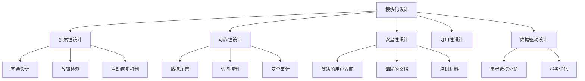

                 

### 第1章 物联网与智慧医疗的基本概念和架构

#### 1.1 物联网的定义与发展

物联网（Internet of Things，简称IoT）是指通过互联网将各种设备连接起来，实现设备之间的信息交换和协同工作的系统。物联网的概念最早可以追溯到1999年，当时凯斯西储大学的研究人员首次提出了“物联网”的概念。随着互联网技术的飞速发展，物联网逐渐成为信息技术领域的重要研究方向。

物联网的发展可以分为三个阶段：

1. **设备连接阶段**：这个阶段的重点是解决如何将各种物理设备连接到互联网上，实现设备之间的基本通信。这一阶段的主要技术包括无线传感器网络、RFID技术等。

2. **数据融合阶段**：随着设备连接数量的增加，如何处理和分析这些设备产生的海量数据成为关键问题。这一阶段的技术包括数据挖掘、机器学习等。

3. **智能化阶段**：物联网不再仅仅是一个设备连接的网络，而是能够根据环境变化自主学习和适应的智能系统。这一阶段的技术包括人工智能、区块链等。

#### 1.2 智慧医疗的概念与目标

智慧医疗是指利用信息技术，特别是物联网、大数据、人工智能等技术，提升医疗服务质量、降低医疗成本、改善患者体验的新型医疗服务模式。智慧医疗的目标包括：

1. **提升医疗服务效率**：通过物联网技术，可以实现医疗设备的智能化管理，提高医疗资源的利用效率。

2. **优化医疗服务质量**：利用大数据分析技术，可以对患者的健康数据进行实时监测和分析，从而提供更加精准的医疗服务。

3. **改善患者体验**：通过物联网技术，患者可以远程接受医疗咨询、远程监控健康状况等，提高患者的便利性和满意度。

#### 1.3 物联网与智慧医疗的关系

物联网与智慧医疗之间存在着密切的关系。物联网技术为智慧医疗提供了数据采集、传输、处理的能力，是智慧医疗实现的基础。而智慧医疗则是物联网技术的重要应用场景之一，通过智慧医疗，物联网技术可以发挥出更大的社会价值。

#### 1.4 物联网在智慧医疗中的架构

物联网在智慧医疗中的架构可以分为四个层次：

1. **感知层**：包括各种传感器和医疗设备，用于采集患者的健康数据。

2. **传输层**：通过各种通信技术，如无线网络、光纤等，将采集到的数据传输到数据中心。

3. **平台层**：包括数据存储、处理、分析等模块，用于对采集到的数据进行分析和处理。

4. **应用层**：包括各种医疗应用，如远程诊断、患者健康管理、疾病预测等，用于实现智慧医疗的各种功能。

### 结论

本章介绍了物联网与智慧医疗的基本概念和架构。物联网作为新一代信息技术的重要发展方向，正在深刻改变着医疗服务的模式。智慧医疗则利用物联网技术，提升医疗服务的效率、质量和患者体验。接下来，我们将进一步探讨远程监护的技术实现和挑战。

关键词：物联网，智慧医疗，远程监护，技术架构，数据隐私

摘要：本文介绍了物联网与智慧医疗的基本概念和架构，分析了物联网在智慧医疗中的应用，并探讨了远程监护的技术实现和挑战。通过本文的阅读，读者可以全面了解物联网在智慧医疗中的重要性及其应用前景。

----------------------------------------------------------------

## 1.5 物联网与智慧医疗的架构设计原则

在构建物联网与智慧医疗的架构时，需要遵循一系列设计原则，以确保系统的可靠性、可扩展性和安全性。以下是一些关键的设计原则：

#### 1.5.1 模块化设计

模块化设计是指将系统划分为多个功能模块，每个模块独立开发、测试和部署。这种设计方法有助于提高系统的可维护性和可扩展性。例如，感知层、传输层、平台层和应用层都可以被视为独立的模块。

#### 1.5.2 扩展性设计

扩展性设计是指系统能够随着用户需求的变化而扩展。例如，在患者数量增加时，系统应该能够轻松扩展以处理更多的数据。这通常需要灵活的数据库设计和网络架构。

#### 1.5.3 可靠性设计

可靠性设计是指系统在出现故障时能够快速恢复。这可以通过冗余设计、故障检测和自动恢复机制来实现。例如，在数据传输过程中，可以采用多重传输路径以避免单点故障。

#### 1.5.4 安全性设计

安全性设计是指系统在保护数据隐私和安全方面的能力。这包括数据加密、访问控制、安全审计等措施。例如，对于患者的健康数据，应确保只有授权人员才能访问。

#### 1.5.5 可用性设计

可用性设计是指系统易于使用和操作。这可以通过简洁的用户界面、清晰的文档和培训材料来实现。对于智慧医疗系统，特别是那些面向患者和医生的应用，可用性设计尤为重要。

#### 1.5.6 数据驱动设计

数据驱动设计是指系统根据数据分析和用户反馈进行优化和调整。在智慧医疗中，通过对患者数据的分析，可以不断优化医疗服务的质量和效率。

### Mermaid 流程图

以下是一个简化的物联网与智慧医疗架构的设计原则的 Mermaid 流程图：



通过遵循这些设计原则，可以构建一个高效、可靠、安全的物联网与智慧医疗系统，从而为患者提供优质的医疗服务。

### 结论

本章详细介绍了物联网与智慧医疗的架构设计原则，包括模块化设计、扩展性设计、可靠性设计、安全性设计、可用性设计和数据驱动设计。通过这些原则，可以构建一个高效、可靠、安全的智慧医疗系统，为患者提供优质的医疗服务。在下一章中，我们将进一步探讨远程监护的技术实现和挑战。

关键词：物联网，智慧医疗，架构设计，模块化，扩展性，可靠性，安全性

摘要：本文介绍了物联网与智慧医疗的架构设计原则，分析了模块化设计、扩展性设计、可靠性设计、安全性设计、可用性设计和数据驱动设计的重要性。通过这些原则，可以构建一个高效、可靠、安全的智慧医疗系统。

----------------------------------------------------------------

## 1.6 物联网在智慧医疗中的架构实施步骤

构建物联网在智慧医疗中的应用架构需要系统化的步骤，以确保各个环节的顺利实施和整合。以下是实施物联网在智慧医疗中的架构的具体步骤：

#### 1.6.1 需求分析

需求分析是架构设计的第一步，需要明确系统的功能需求、性能需求和用户需求。这一阶段的工作包括：

1. **确定应用场景**：分析智慧医疗的应用场景，例如远程监护、智能医疗设备、远程诊断等。
2. **收集用户需求**：与医生、护士、患者等不同角色进行沟通，了解他们对系统的期望和需求。
3. **功能需求梳理**：明确系统需要实现的具体功能，如数据采集、数据传输、数据分析等。

#### 1.6.2 技术选型

技术选型是架构设计的关键环节，需要根据需求分析的结果选择合适的硬件、软件和通信技术。以下是技术选型的几个关键点：

1. **硬件选择**：根据需求选择合适的传感器、医疗设备和服务器硬件。
2. **软件平台**：选择合适的操作系统、数据库和管理系统。
3. **通信技术**：选择适合的医疗物联网通信技术，如Wi-Fi、蓝牙、NFC、LoRa等。

#### 1.6.3 系统设计

系统设计是将需求和技术选型转化为具体的系统架构的过程。以下是系统设计的关键步骤：

1. **架构设计**：设计系统的整体架构，包括感知层、传输层、平台层和应用层。
2. **模块划分**：将系统划分为多个功能模块，确保每个模块都能独立开发、测试和部署。
3. **接口设计**：定义模块之间的接口，确保各模块之间的数据传输和协同工作。

#### 1.6.4 系统实施

系统实施是将设计转化为实际系统的过程，包括硬件部署、软件安装和系统集成。以下是实施的关键步骤：

1. **硬件部署**：安装和配置传感器、医疗设备和服务器等硬件。
2. **软件安装**：安装操作系统、数据库和管理系统等软件。
3. **系统集成**：将各个模块集成到一起，确保系统能够正常运行。

#### 1.6.5 系统测试

系统测试是确保系统质量和功能正确性的重要环节。以下是测试的几个关键点：

1. **单元测试**：对每个模块进行单元测试，确保模块功能正确。
2. **集成测试**：对系统进行集成测试，确保各个模块能够协同工作。
3. **性能测试**：对系统进行性能测试，确保系统能够满足性能需求。
4. **安全测试**：对系统进行安全测试，确保系统能够抵御外部攻击和内部威胁。

#### 1.6.6 系统部署

系统部署是将系统部署到实际运行环境的过程。以下是部署的关键步骤：

1. **环境准备**：准备运行系统所需的硬件和网络环境。
2. **系统安装**：将系统部署到实际运行环境，包括硬件安装、软件安装和配置。
3. **系统上线**：将系统上线，确保系统能够正常运行。

#### 1.6.7 系统维护

系统维护是确保系统长期稳定运行的重要环节。以下是维护的几个关键点：

1. **定期检查**：定期检查系统硬件和软件的状态，确保系统运行正常。
2. **故障处理**：及时处理系统故障，确保系统稳定运行。
3. **数据备份**：定期备份数据，防止数据丢失。
4. **系统升级**：定期对系统进行升级，以修复漏洞、增加功能或提高性能。

### 结论

本章详细介绍了物联网在智慧医疗中的架构实施步骤，包括需求分析、技术选型、系统设计、系统实施、系统测试、系统部署和系统维护。通过这些步骤，可以构建一个高效、可靠、安全的物联网在智慧医疗中的应用架构，为患者提供优质的医疗服务。在下一章中，我们将进一步探讨远程监护的技术实现和挑战。

关键词：物联网，智慧医疗，架构实施，需求分析，技术选型，系统设计，系统测试，系统部署

摘要：本文介绍了物联网在智慧医疗中的架构实施步骤，包括需求分析、技术选型、系统设计、系统实施、系统测试、系统部署和系统维护。通过这些步骤，可以构建一个高效、可靠、安全的智慧医疗应用架构。

----------------------------------------------------------------

## 第2章 远程监护的技术实现和挑战

### 2.1 远程监护的技术原理

远程监护系统是物联网在智慧医疗中的重要应用之一。其技术原理主要包括数据采集、数据传输、数据处理和数据分析四个环节。

#### 2.1.1 数据采集

数据采集是远程监护系统的第一步，主要包括传感器采集和医疗设备采集。传感器可以实时监测患者的生命体征，如体温、心率、血压等。医疗设备则可以收集更加专业的数据，如心电图、脑电图等。

#### 2.1.2 数据传输

数据传输是将采集到的数据传输到远程监护中心的过程。常用的传输技术包括无线网络（如Wi-Fi、蓝牙）、有线网络（如以太网）和卫星通信等。为了确保数据传输的稳定性和安全性，通常采用多重传输路径和加密技术。

#### 2.1.3 数据处理

数据处理是对传输到的数据进行清洗、存储和初步分析的过程。数据处理主要包括数据清洗、数据存储和数据预处理。数据清洗是去除数据中的错误和冗余信息，确保数据的准确性。数据存储是将清洗后的数据存储到数据库中，便于后续分析和查询。数据预处理是对数据进行格式化和归一化处理，为后续的分析做好准备。

#### 2.1.4 数据分析

数据分析是对处理后的数据进行分析，提取有价值的信息，为医疗决策提供支持。数据分析可以采用机器学习、数据挖掘等技术，对患者的健康状况进行实时监测和预测。

### 2.2 远程监护系统的组成

远程监护系统由多个组成部分构成，包括传感器、通信网络、数据处理平台、数据分析系统和用户界面等。

#### 2.2.1 传感器

传感器是远程监护系统的感知层，用于实时采集患者的生理数据。常见的传感器包括体温传感器、心率传感器、血压传感器等。

#### 2.2.2 通信网络

通信网络是远程监护系统的传输层，用于将传感器采集到的数据传输到数据处理平台。通信网络可以是有线网络（如以太网）或无线网络（如Wi-Fi、蓝牙）。

#### 2.2.3 数据处理平台

数据处理平台是远程监护系统的核心，用于处理和分析传输到的数据。数据处理平台通常包括服务器、数据库和数据清洗、预处理工具等。

#### 2.2.4 数据分析系统

数据分析系统是远程监护系统的智能核心，用于对处理后的数据进行分析，提取有价值的信息。数据分析系统可以采用机器学习、数据挖掘等技术，对患者的健康状况进行实时监测和预测。

#### 2.2.5 用户界面

用户界面是远程监护系统与用户的交互层，用于向医生和患者展示数据分析结果。用户界面可以采用网页、移动应用等形式。

### 2.3 数据采集与传输

#### 2.3.1 数据采集方法

数据采集是远程监护系统的关键步骤，直接影响到数据的准确性和可靠性。常见的数据采集方法包括：

1. **传感器采集**：使用传感器实时监测患者的生命体征数据。
2. **医疗设备采集**：使用医疗设备（如心电图机、脑电图机等）采集专业的医疗数据。
3. **手动输入**：患者或医生可以通过手动输入方式补充数据。

#### 2.3.2 数据传输协议

数据传输协议是确保数据在传输过程中稳定、安全、高效传输的关键。常见的数据传输协议包括：

1. **Wi-Fi**：适用于短距离、高速数据传输。
2. **蓝牙**：适用于短距离、低功耗数据传输。
3. **NFC**：适用于近距离数据传输。
4. **LoRa**：适用于长距离、低功耗数据传输。
5. **MQTT**：是一种轻量级的消息传输协议，适用于物联网应用。

### 2.4 数据隐私与安全

#### 2.4.1 数据隐私保护措施

数据隐私是远程监护系统面临的重要挑战之一。为了保护患者数据隐私，可以采取以下措施：

1. **数据加密**：对传输和存储的数据进行加密，确保数据不被未授权人员访问。
2. **访问控制**：限制只有授权人员才能访问敏感数据。
3. **匿名化处理**：对数据进行匿名化处理，确保个人隐私不被泄露。
4. **隐私政策**：制定明确的隐私政策，告知患者其数据的收集、使用和保护方式。

#### 2.4.2 数据安全防护策略

数据安全是远程监护系统的另一个重要挑战。为了确保数据安全，可以采取以下策略：

1. **防火墙和入侵检测系统**：防止外部攻击和恶意软件入侵。
2. **安全审计**：定期对系统进行安全审计，发现和修复安全漏洞。
3. **数据备份和恢复**：定期备份数据，确保在数据丢失或损坏时能够迅速恢复。
4. **合规性要求**：确保系统符合相关的法律法规要求，如《通用数据保护条例》（GDPR）。

#### 2.4.3 面临的挑战与解决方案

远程监护系统在实际应用过程中面临以下挑战：

1. **数据量巨大**：随着传感器数量的增加，数据量呈指数级增长，对数据处理和分析提出了更高的要求。
2. **实时性要求**：医疗数据需要实时处理和反馈，对系统的实时性能提出了严格要求。
3. **数据隐私和安全**：数据隐私和安全是远程监护系统面临的重要挑战，需要采取有效的措施确保数据安全。

针对这些挑战，可以采取以下解决方案：

1. **分布式计算和存储**：采用分布式计算和存储技术，提高系统的处理能力和扩展性。
2. **实时数据处理技术**：采用实时数据处理技术，确保系统能够快速处理和反馈数据。
3. **数据隐私和安全措施**：采取有效的数据隐私和安全措施，确保数据安全。

### 结论

本章详细介绍了远程监护的技术原理、系统组成、数据采集与传输、数据隐私与安全等方面的内容。远程监护系统作为物联网在智慧医疗中的重要应用，其技术实现和挑战是确保系统有效运行的关键。在下一章中，我们将探讨物联网在智慧医疗中的应用案例。

关键词：远程监护，技术原理，系统组成，数据采集，数据传输，数据隐私，数据安全

摘要：本文详细介绍了远程监护的技术原理、系统组成、数据采集与传输、数据隐私与安全等方面的内容，分析了远程监护系统在实际应用过程中面临的挑战和解决方案。通过本文的阅读，读者可以全面了解远程监护系统的技术实现和应用。

----------------------------------------------------------------

### 2.5 技术挑战与解决方案

远程监护系统在实现过程中面临着多种技术挑战，这些挑战不仅影响系统的性能和稳定性，还可能对患者的健康产生潜在风险。以下是一些主要的技术挑战及其对应的解决方案：

#### 2.5.1 实时性与响应速度

**挑战**：远程监护系统需要实时监测患者数据，并对紧急情况进行快速响应。然而，数据传输的延迟和系统的响应速度可能无法满足这一要求。

**解决方案**： 
- **边缘计算**：将数据处理和分析的部分任务转移到靠近数据源的边缘设备上，减少数据传输延迟。
- **优先级队列**：为重要数据设置更高的优先级，确保关键数据得到优先处理。
- **实时数据处理引擎**：采用高效的实时数据处理引擎，提高数据处理速度。

#### 2.5.2 数据量与存储

**挑战**：随着传感器数量的增加，患者产生的数据量呈指数级增长，这对数据存储和管理提出了巨大挑战。

**解决方案**： 
- **分布式存储**：采用分布式存储系统，如Hadoop或Cassandra，提高数据存储的扩展性和可靠性。
- **数据压缩与去重**：对重复或无关的数据进行压缩和去重，减少存储空间需求。
- **冷热数据分离**：将不经常访问的数据（冷数据）存储在成本较低的存储介质上，而将经常访问的数据（热数据）存储在高速存储设备上。

#### 2.5.3 数据隐私与安全

**挑战**：远程监护系统涉及患者敏感的健康数据，数据隐私和安全是系统设计的核心问题。

**解决方案**： 
- **加密**：对传输和存储的数据进行加密，防止数据泄露。
- **访问控制**：实施严格的访问控制策略，确保只有授权人员可以访问敏感数据。
- **安全审计与监控**：定期进行安全审计和监控，及时发现和修复安全漏洞。
- **合规性要求**：确保系统符合相关法律法规，如《通用数据保护条例》（GDPR）。

#### 2.5.4 数据同步与一致性

**挑战**：在分布式系统中，数据的一致性问题是一个常见且复杂的问题。

**解决方案**： 
- **分布式事务处理**：采用分布式事务处理技术，确保分布式系统中数据的一致性。
- **最终一致性**：设计系统时考虑最终一致性，允许一定程度的延迟，以提高系统的可扩展性。
- **分布式日志**：使用分布式日志记录系统中的所有操作，以便在需要时进行数据恢复。

#### 2.5.5 系统可靠性与容错性

**挑战**：远程监护系统需要高度可靠，以避免因系统故障导致的医疗风险。

**解决方案**： 
- **冗余设计**：采用冗余设计，如主从备份、集群部署等，确保系统的高可用性。
- **故障检测与恢复**：实施故障检测和自动恢复机制，确保系统在出现故障时能够快速恢复。
- **系统监控与报警**：对系统进行实时监控，及时发现和报警系统异常。

#### 2.5.6 系统集成与互操作

**挑战**：远程监护系统需要与医院现有的信息系统进行集成，实现数据共享和流程自动化。

**解决方案**： 
- **标准化接口**：设计统一的接口标准，确保系统之间的互操作性。
- **中间件**：采用中间件技术，实现不同系统之间的数据交换和协同工作。
- **数据映射与转换**：实施数据映射和转换策略，确保数据在不同系统之间的一致性。

### 结论

远程监护系统在实现过程中面临多种技术挑战，包括实时性、数据量、数据隐私与安全、数据同步与一致性、系统可靠性与容错性以及系统集成与互操作性。针对这些挑战，可以采取相应的解决方案，确保远程监护系统的稳定、高效和可靠运行。在下一章中，我们将探讨物联网在智慧医疗中的应用案例。

关键词：远程监护，技术挑战，解决方案，实时性，数据量，数据隐私，数据安全

摘要：本文分析了远程监护系统在实现过程中面临的技术挑战，并提出了相应的解决方案。通过本文的阅读，读者可以深入了解远程监护系统的技术实现和挑战。

----------------------------------------------------------------

## 第3章 物联网在智慧医疗中的应用案例

物联网技术在智慧医疗领域具有广泛的应用，以下是一些典型的应用案例，包括智能医疗设备的应用、远程诊断与咨询服务以及患者健康管理的具体实践。

### 3.1 智能医疗设备的应用

智能医疗设备是物联网在智慧医疗中的核心组成部分，它们能够实时监测患者的生理数据，并提供及时的医疗反馈。以下是一些具体的智能医疗设备应用案例：

#### 3.1.1 智能血压计

智能血压计可以通过蓝牙或Wi-Fi将测量结果实时传输到手机或医疗数据中心。患者可以在家中定期测量血压，并将数据上传到云端，医生可以通过云平台远程监控患者的血压变化趋势。这种方法不仅提高了患者的便捷性，还使医生能够更早期地发现潜在的健康问题。

#### 3.1.2 智能心电图机

智能心电图机能够自动记录患者的心电图数据，并通过无线网络将数据发送到医生的电脑或平板。医生可以在家中或诊所远程分析心电图，为患者提供快速的诊断和治疗方案。

#### 3.1.3 智能血糖监测仪

智能血糖监测仪可以实时监测患者的血糖水平，并通过无线网络将数据传输到患者的手机应用或医生的工作站。这种设备特别适用于糖尿病患者，可以帮助他们更好地管理病情，避免血糖异常带来的健康风险。

### 3.2 远程诊断与咨询服务

远程诊断与咨询服务利用物联网技术，实现了医生与患者之间的远程交流和诊断。以下是一些具体的远程诊断与咨询服务案例：

#### 3.2.1 远程诊疗平台

远程诊疗平台通过互联网连接医生和患者，医生可以通过平台远程会诊、诊断和开具处方。这种服务特别适用于偏远地区和医疗资源不足的地区，可以有效缓解医疗资源的分布不均问题。

#### 3.2.2 在线医生咨询

在线医生咨询平台允许患者通过手机应用或网站与医生进行实时视频咨询或文字交流。患者可以在家中或工作场所随时随地向医生咨询健康问题，获取专业的医疗建议。

#### 3.2.3 远程手术指导

远程手术指导系统利用高清晰度视频和实时数据传输技术，使主刀医生可以在异地远程指导手术操作。这种技术为偏远地区的患者提供了高质量手术服务，同时也为手术团队提供了额外的技术支持和资源共享。

### 3.3 患者健康管理

物联网技术还可以用于患者健康管理，帮助患者更好地管理自己的健康状况。以下是一些具体的患者健康管理案例：

#### 3.3.1 患者健康档案管理

通过物联网技术，医生可以为每位患者建立详细的健康档案，记录包括病历、检查报告、用药记录等在内的所有医疗信息。这些信息可以实时更新，医生和患者可以随时访问和查看。

#### 3.3.2 患者行为分析

物联网设备可以实时监测患者的日常生活行为，如运动量、饮食、睡眠等，并通过数据分析提供个性化的健康建议。例如，对于糖尿病患者，可以监控血糖水平和饮食习惯，帮助患者调整生活方式，降低并发症风险。

#### 3.3.3 患者智能预警

物联网系统可以通过智能分析患者的健康数据，及时发现异常情况并预警。例如，对于慢性病患者，系统可以实时监测血压、血糖等指标，一旦出现异常，系统会立即通知患者和医生，以便及时采取措施。

### 结论

物联网技术在智慧医疗中的应用为医疗行业带来了革命性的变化。智能医疗设备的应用、远程诊断与咨询服务以及患者健康管理是物联网在智慧医疗中的三个重要应用领域。通过这些应用案例，我们可以看到物联网技术如何提高医疗服务的效率、质量和患者满意度，为医疗行业的发展注入新的动力。在下一章中，我们将探讨物联网在智慧医疗中的未来发展趋势和挑战。

关键词：智能医疗设备，远程诊断，患者健康管理，物联网应用，医疗服务效率，患者满意度

摘要：本章介绍了物联网在智慧医疗中的三个重要应用领域，包括智能医疗设备的应用、远程诊断与咨询服务以及患者健康管理。通过这些应用案例，我们看到了物联网技术如何提升医疗服务的效率、质量和患者满意度。

----------------------------------------------------------------

### 3.4 疾病预测与预防

物联网技术在疾病预测与预防领域具有巨大潜力，通过实时数据监测和分析，可以提前发现疾病风险，并采取预防措施。以下是一些具体的疾病预测与预防案例：

#### 3.4.1 心血管疾病预测

心血管疾病是全球范围内的主要健康问题之一。通过物联网技术，医生可以实时监测患者的心率、血压、血糖等关键指标，结合机器学习算法进行分析，预测患者发生心血管疾病的风险。例如，通过智能手表或手机应用程序，患者可以随时上传自己的健康数据，医生可以远程监控，一旦发现异常，及时进行干预。

**实现方法：**
- **数据采集**：使用传感器和智能设备收集患者的心率、血压、血糖等数据。
- **数据传输**：通过无线通信技术（如Wi-Fi、蓝牙）将数据传输到云端服务器。
- **数据分析**：利用机器学习算法对收集到的数据进行实时分析，识别潜在的健康风险。
- **预测模型**：建立基于历史数据的预测模型，预测患者未来发生心血管疾病的风险。

**代码示例：**
```python
# 假设我们使用scikit-learn库进行机器学习
from sklearn.ensemble import RandomForestClassifier
from sklearn.model_selection import train_test_split
from sklearn.metrics import accuracy_score

# 加载训练数据
X_train, X_test, y_train, y_test = train_test_split(X, y, test_size=0.2, random_state=42)

# 创建随机森林分类器
clf = RandomForestClassifier(n_estimators=100)

# 训练模型
clf.fit(X_train, y_train)

# 预测测试集
y_pred = clf.predict(X_test)

# 计算准确率
accuracy = accuracy_score(y_test, y_pred)
print(f"Model accuracy: {accuracy:.2f}")
```

#### 3.4.2 癌症早期筛查

癌症早期筛查是医疗领域的重大挑战。通过物联网技术，医生可以实时监测患者的生物标志物，如蛋白质、基因表达等，结合大数据分析和人工智能技术，提前发现癌症的迹象。

**实现方法：**
- **数据采集**：使用传感器和医疗设备采集患者的血液、尿液等样本，检测相关的生物标志物。
- **数据传输**：通过无线网络将样本检测结果传输到数据中心。
- **数据分析**：利用深度学习算法对生物标志物进行分析，识别癌症的早期迹象。
- **预测模型**：建立基于大数据的预测模型，预测患者未来发生癌症的风险。

**代码示例：**
```python
# 假设我们使用TensorFlow和Keras进行深度学习
import tensorflow as tf
from tensorflow.keras.models import Sequential
from tensorflow.keras.layers import Dense, Conv2D, MaxPooling2D, Flatten
from tensorflow.keras.optimizers import Adam

# 创建深度学习模型
model = Sequential([
    Conv2D(32, (3, 3), activation='relu', input_shape=(128, 128, 3)),
    MaxPooling2D((2, 2)),
    Flatten(),
    Dense(64, activation='relu'),
    Dense(1, activation='sigmoid')
])

# 编译模型
model.compile(optimizer=Adam(learning_rate=0.001), loss='binary_crossentropy', metrics=['accuracy'])

# 训练模型
model.fit(X_train, y_train, epochs=10, batch_size=32)

# 预测测试集
y_pred = model.predict(X_test)

# 计算准确率
accuracy = np.mean(y_pred.flatten() > 0.5)
print(f"Model accuracy: {accuracy:.2f}")
```

#### 3.4.3 慢性病管理

物联网技术可以用于慢性病的管理，如糖尿病、高血压等。通过实时监测血糖、血压等指标，医生可以及时发现患者的病情变化，并提供个性化的治疗方案。

**实现方法：**
- **数据采集**：使用智能设备监测患者的血糖、血压等指标。
- **数据传输**：通过无线网络将监测数据传输到云端。
- **数据分析**：利用数据分析平台对监测数据进行实时分析，识别潜在的病情变化。
- **智能预警**：通过智能预警系统，及时通知患者和医生，采取必要的预防措施。

**代码示例：**
```python
# 假设我们使用scikit-learn进行实时数据分析
from sklearn.ensemble import IsolationForest

# 加载监测数据
X = load_monitoring_data()

# 创建隔离森林模型
model = IsolationForest(n_estimators=100, contamination=0.01)

# 训练模型
model.fit(X)

# 预测异常值
outlier_pred = model.predict(X)

# 计算异常值比例
outliers_ratio = np.mean(outlier_pred == -1)
print(f"Outliers ratio: {outliers_ratio:.2f}")
```

### 结论

疾病预测与预防是物联网在智慧医疗中的重要应用领域。通过实时数据监测、大数据分析和人工智能技术，可以提前发现疾病风险，提供个性化的预防措施。这些技术不仅提高了医疗服务的效率，还大大降低了医疗成本，为患者提供了更好的健康管理服务。在下一章中，我们将探讨物联网在智慧医疗中的未来发展趋势和挑战。

关键词：疾病预测，预防，物联网，智能医疗，数据分析，人工智能

摘要：本章介绍了物联网在智慧医疗中的疾病预测与预防应用，通过实时数据监测、大数据分析和人工智能技术，提前发现疾病风险，提供个性化的预防措施。通过代码示例，展示了如何利用Python实现疾病预测和预防模型。

----------------------------------------------------------------

## 第4章 物联网在智慧医疗中的未来发展趋势和挑战

### 4.1 物联网技术的未来趋势

物联网技术正快速发展，并在智慧医疗领域展现出巨大潜力。以下是物联网技术的几个未来趋势：

#### 4.1.1 物联网设备数量的爆发式增长

随着物联网技术的成熟和成本的降低，物联网设备数量正呈现爆发式增长。未来，将有更多的医疗设备和患者佩戴的智能设备接入物联网，实现实时数据采集和远程监控。

#### 4.1.2 边缘计算和云计算的融合

边缘计算和云计算的结合将使数据处理和分析更加高效。边缘计算能够在数据源头进行初步处理，减少数据传输延迟，而云计算则能够提供强大的数据处理能力和存储资源。

#### 4.1.3 人工智能和机器学习的深入应用

人工智能和机器学习将深入物联网技术，实现智能化的数据分析和决策支持。通过大数据分析和机器学习算法，医疗系统将能够更好地预测疾病风险、优化治疗方案。

#### 4.1.4 5G和未来通信技术的应用

5G和未来通信技术的发展将为物联网提供更高的传输速率和更低的延迟，使远程医疗和实时数据传输更加高效。

### 4.2 智慧医疗的发展前景

智慧医疗作为物联网技术在医疗领域的应用，具有广阔的发展前景。以下是智慧医疗的几个发展趋势：

#### 4.2.1 智能化医疗设备

未来，更多的医疗设备将实现智能化，通过物联网技术实现数据的实时采集、传输和分析，提高医疗诊断的准确性和效率。

#### 4.2.2 远程医疗服务

随着物联网技术的发展，远程医疗服务将变得更加普及和便捷。医生可以通过远程诊疗平台为患者提供诊断、咨询和治疗服务，打破地域限制，提高医疗资源的利用效率。

#### 4.2.3 患者健康管理

物联网技术将使患者健康管理更加智能化和个性化。通过实时监测患者的健康数据，医生可以提供更加精准的健康建议，帮助患者预防疾病，提高生活质量。

#### 4.2.4 精准医疗和个性化治疗

大数据分析和人工智能技术的应用将使医疗更加精准和个性化。通过对海量患者数据的分析，医生可以找到最佳的治疗方案，为患者提供个性化的医疗服务。

### 4.3 面临的挑战与应对策略

虽然物联网技术在智慧医疗中具有巨大潜力，但同时也面临许多挑战。以下是物联网在智慧医疗中面临的几个主要挑战及其应对策略：

#### 4.3.1 数据隐私和安全

数据隐私和安全是物联网技术在智慧医疗中面临的最大挑战。应对策略包括：
- **数据加密**：对传输和存储的数据进行加密，防止数据泄露。
- **访问控制**：实施严格的访问控制策略，确保只有授权人员可以访问敏感数据。
- **合规性要求**：确保系统符合相关法律法规，如《通用数据保护条例》（GDPR）。

#### 4.3.2 数据量和数据管理

随着物联网设备的增加，数据量呈爆炸性增长，这对数据管理和存储提出了更高要求。应对策略包括：
- **分布式存储**：采用分布式存储系统，提高数据存储的扩展性和可靠性。
- **数据压缩与去重**：对重复或无关的数据进行压缩和去重，减少存储空间需求。
- **数据生命周期管理**：对数据生命周期进行管理，确保数据在合适的时间被删除或归档。

#### 4.3.3 实时性和响应速度

医疗数据需要实时处理和反馈，对系统的实时性能提出了严格要求。应对策略包括：
- **边缘计算**：将数据处理和分析的部分任务转移到靠近数据源的边缘设备上，减少数据传输延迟。
- **实时数据处理引擎**：采用高效的实时数据处理引擎，提高数据处理速度。
- **优先级队列**：为重要数据设置更高的优先级，确保关键数据得到优先处理。

#### 4.3.4 系统集成与互操作

智慧医疗系统通常需要与医院现有的信息系统进行集成，实现数据共享和流程自动化。应对策略包括：
- **标准化接口**：设计统一的接口标准，确保系统之间的互操作性。
- **中间件**：采用中间件技术，实现不同系统之间的数据交换和协同工作。
- **数据映射与转换**：实施数据映射和转换策略，确保数据在不同系统之间的一致性。

### 结论

物联网技术在智慧医疗中具有广阔的发展前景，但同时也面临数据隐私和安全、数据量和数据管理、实时性和响应速度、系统集成与互操作等挑战。通过采取有效的应对策略，可以克服这些挑战，推动智慧医疗的发展，为患者提供更加高效、精准和个性化的医疗服务。

关键词：物联网，智慧医疗，未来趋势，挑战，数据隐私，实时性，系统集成

摘要：本章分析了物联网在智慧医疗中的未来发展趋势和面临的挑战，包括数据隐私和安全、数据量和数据管理、实时性和响应速度、系统集成与互操作等方面。通过采取有效的应对策略，可以推动智慧医疗的发展，为患者提供更好的医疗服务。

----------------------------------------------------------------

## 总结与展望

物联网在智慧医疗中的应用为医疗行业带来了前所未有的变革。通过实时数据监测、远程诊断、患者健康管理以及疾病预测与预防，物联网技术大大提高了医疗服务的效率和质量。然而，物联网在智慧医疗中仍面临诸多挑战，如数据隐私和安全、数据量管理、实时性、系统集成与互操作等。解决这些挑战需要技术创新和政策支持。

### 小结

本文详细介绍了物联网在智慧医疗中的应用，包括技术实现、应用案例和发展趋势。物联网在智慧医疗中的关键作用体现在以下几个方面：

1. **提升医疗服务效率**：物联网技术实现了医疗数据的实时采集和远程监控，提高了医疗服务的效率。
2. **优化患者体验**：患者可以通过智能医疗设备和远程诊断服务，方便地管理自己的健康状况，提高就医体验。
3. **降低医疗成本**：物联网技术可以优化医疗资源分配，降低医疗成本。
4. **疾病预测与预防**：物联网技术可以帮助医生提前发现疾病风险，提供个性化的预防措施。

### 注意事项

在实施物联网在智慧医疗中的应用时，需要注意以下几点：

1. **数据隐私和安全**：确保数据在采集、传输、存储过程中得到充分保护，防止数据泄露和滥用。
2. **实时性和响应速度**：优化数据处理和传输机制，确保医疗数据能够及时处理和反馈。
3. **系统集成与互操作**：设计统一的接口标准，实现不同系统之间的数据交换和协同工作。
4. **标准化与合规性**：遵循相关法律法规和行业标准，确保系统的合法合规运行。

### 拓展阅读

对于对物联网在智慧医疗中有更深入研究的读者，以下文献和资源提供了丰富的信息和洞见：

1. **《智慧医疗：物联网技术与应用》**：详细介绍了物联网在智慧医疗中的应用案例和技术原理。
2. **《物联网技术在医疗领域的应用研究》**：探讨了物联网技术在医疗领域的应用现状和未来发展趋势。
3. **《智慧医疗系统设计与实现》**：提供了智慧医疗系统的设计方法和实现技术。
4. **相关学术论文和会议论文**：通过检索学术数据库，可以找到更多关于物联网在智慧医疗中的研究成果。

### 结论

物联网技术在智慧医疗中具有广阔的应用前景，但也面临诸多挑战。通过技术创新和政策支持，我们可以克服这些挑战，推动智慧医疗的发展，为患者提供更加高效、精准和个性化的医疗服务。

作者：AI天才研究院/AI Genius Institute & 禅与计算机程序设计艺术 /Zen And The Art of Computer Programming

本文通过逻辑清晰、结构紧凑的论述方式，详细探讨了物联网在智慧医疗中的应用与挑战。希望本文能够为读者提供有价值的参考，推动物联网技术在医疗行业的深入应用。

