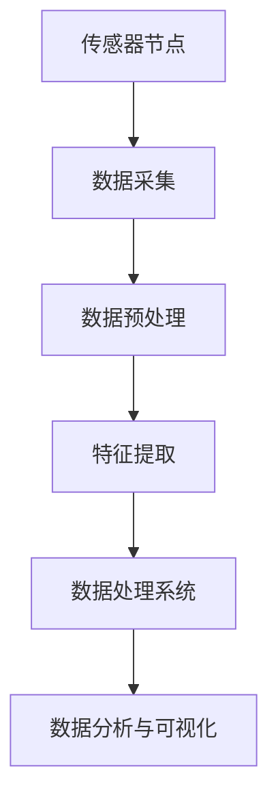
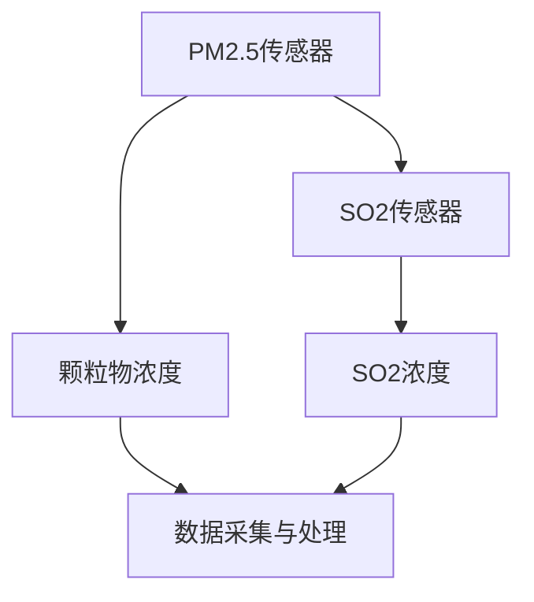
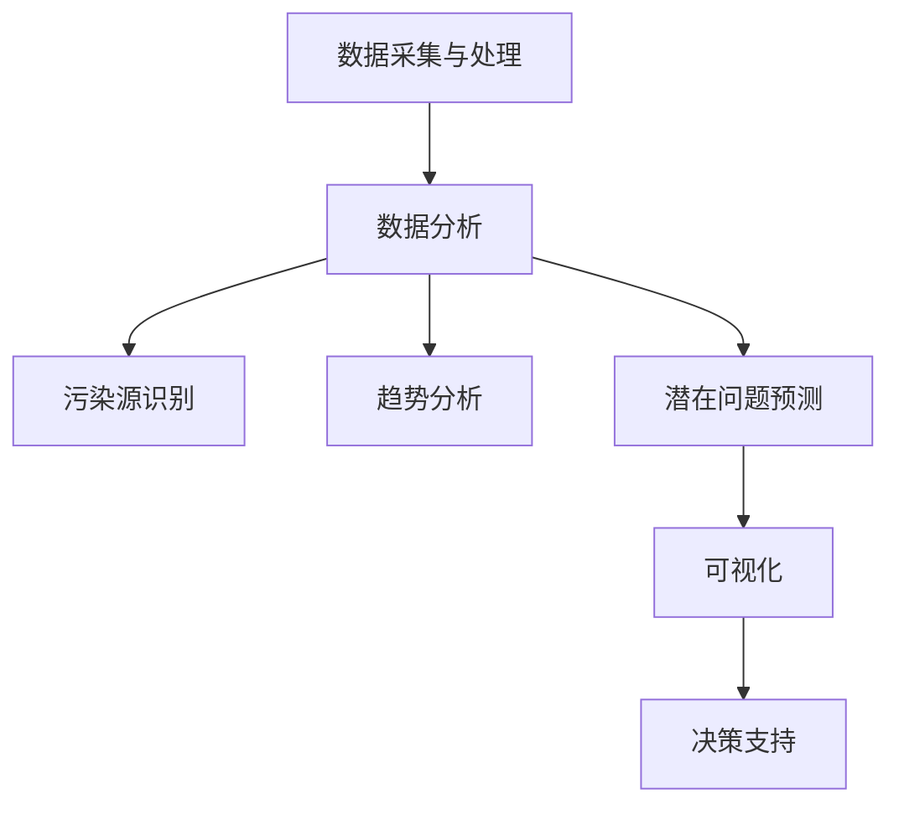

                 

# 物联网在智慧城市空气质量监测中的应用

> 关键词：物联网、智慧城市、空气质量监测、传感器网络、数据处理、智能决策

> 摘要：本文深入探讨了物联网在智慧城市空气质量监测中的应用。通过分析物联网的基本概念、智慧城市的特征及其在空气质量监测中的重要性，本文详细阐述了物联网技术在空气质量监测传感器、数据处理与分析、智能决策与优化、安全与隐私保护等方面的应用。同时，通过实际案例展示了物联网在智慧城市空气质量监测中的实际效果，并对未来发展趋势进行了展望。

## 第一部分：物联网与智慧城市概述

### 1.1 物联网的基本概念与架构

#### 1.1.1 物联网的定义

物联网（Internet of Things，IoT）指的是将各种物品通过通信技术连接到网络中，实现信息的交换和共享。这些物品可以是日常生活中的家电、车辆、工业设备，也可以是环境监测设备、医疗设备等。物联网的核心在于信息采集、传输和处理，实现物与物、物与人的智能互联。

#### 1.1.2 物联网的关键技术

物联网的关键技术包括传感器技术、网络通信技术、数据处理技术、安全隐私技术等。传感器技术负责信息的采集，网络通信技术实现信息的传输，数据处理技术对采集到的信息进行处理和分析，安全隐私技术保障数据的安全和用户的隐私。

#### 1.1.3 物联网的发展趋势

随着5G、人工智能、大数据等技术的不断发展，物联网的应用场景越来越广泛，发展速度也日益加快。未来，物联网将朝着更高效、更智能、更安全、更便捷的方向发展。

### 1.2 智慧城市概述

#### 1.2.1 智慧城市的定义与特征

智慧城市是指利用信息技术、物联网、大数据等手段，实现城市资源的高效配置、管理和服务。智慧城市的特征包括智能化管理、智慧化服务、数字化生活等。

#### 1.2.2 智慧城市的关键技术

智慧城市的关键技术包括物联网、大数据、云计算、人工智能、区块链等。这些技术共同构建了智慧城市的基础设施，为城市提供了智慧化的解决方案。

#### 1.2.3 智慧城市的建设与应用

智慧城市的建设与应用涉及多个方面，包括智慧交通、智慧医疗、智慧环境、智慧能源等。这些应用不仅提高了城市的运营效率，也为居民提供了更加便捷、舒适的生活体验。

### 1.3 物联网在智慧城市空气质量监测中的应用背景

#### 1.3.1 空气质量监测的重要性

空气质量是影响人类健康和生活质量的重要因素。良好的空气质量有助于减少呼吸系统疾病的发生，提高居民的生活质量。因此，空气质量监测具有重要意义。

#### 1.3.2 物联网技术在空气质量监测中的应用

物联网技术可以实时、准确地监测空气质量，为环境管理和决策提供科学依据。通过物联网技术，可以实现空气质量的在线监测、数据分析和智能预警。

#### 1.3.3 智慧城市空气质量监测的挑战与机遇

智慧城市空气质量监测面临诸多挑战，如数据采集的准确性、数据处理的高效性、系统的稳定性和安全性等。然而，随着物联网技术的不断进步，智慧城市空气质量监测也迎来了新的机遇。

### 1.4 物联网在智慧城市空气质量监测中的核心概念与联系

#### 1.4.1 物联网数据采集与处理

物联网数据采集与处理是空气质量监测的基础。通过传感器网络采集空气中的污染物数据，并通过数据处理技术对数据进行清洗、融合和分析。

#### 1.4.2 空气质量监测指标与传感器

空气质量监测指标包括PM2.5、PM10、SO2、NO2、CO等。相应的传感器可以实时监测这些指标，为空气质量监测提供数据支持。

#### 1.4.3 数据分析与可视化

数据分析与可视化技术可以将空气质量监测数据转化为直观的可视化图表，帮助用户更好地理解空气质量状况。

## 第二部分：物联网技术在智慧城市空气质量监测中的应用

### 2.1 空气质量监测传感器与传感器网络

#### 2.1.1 常见的空气质量传感器

常见的空气质量传感器包括PM2.5传感器、PM10传感器、SO2传感器、NO2传感器等。这些传感器可以实时监测空气中的污染物浓度，为空气质量监测提供数据支持。

#### 2.1.2 传感器网络架构

传感器网络由多个传感器节点组成，每个节点负责监测一定范围内的空气质量。传感器网络架构包括无线传感器网络（WSN）和卫星传感器网络等。

#### 2.1.3 传感器数据采集与传输

传感器数据采集与传输技术是物联网技术在空气质量监测中的重要组成部分。通过无线通信技术，传感器可以将监测数据传输到中央处理系统。

### 2.2 物联网平台在空气质量监测中的应用

#### 2.2.1 物联网平台的功能

物联网平台是连接传感器、数据处理系统和用户的关键环节。其功能包括数据采集、数据处理、存储、分析和可视化等。

#### 2.2.2 平台选型与搭建

选择合适的物联网平台对于空气质量监测系统的性能至关重要。平台选型应考虑数据规模、处理能力、扩展性、安全性等因素。

#### 2.2.3 平台在空气质量监测中的实际应用

物联网平台在空气质量监测中可以提供实时数据监测、数据分析和智能预警等功能，为环境管理和决策提供支持。

### 2.3 数据处理与分析方法

#### 2.3.1 数据预处理

数据预处理是数据处理的第一步，包括数据清洗、去噪、归一化等操作，以提高数据质量和分析效果。

#### 2.3.2 数据分析方法

数据分析方法包括统计分析、机器学习、深度学习等。通过数据分析，可以挖掘空气质量数据中的有用信息，为环境管理和决策提供支持。

#### 2.3.3 数据可视化与展示

数据可视化是将复杂的数据转化为易于理解的可视化图表的过程。通过数据可视化，可以直观地展示空气质量状况。

### 2.4 智能决策与优化

#### 2.4.1 智能算法在空气质量监测中的应用

智能算法可以用于空气质量监测数据的分析和预测。例如，使用机器学习算法可以预测未来的空气质量状况，为环境管理和决策提供支持。

#### 2.4.2 智能决策支持系统

智能决策支持系统可以将空气质量监测数据转化为具体的决策建议，例如调整交通流量、发布空气质量预警等。

#### 2.4.3 智能优化在空气质量监测中的实际应用

智能优化技术可以用于优化空气质量监测系统的配置、提高数据处理效率等，从而提高空气质量监测的效果。

### 2.5 安全与隐私保护

#### 2.5.1 物联网安全挑战

物联网安全挑战包括数据泄露、设备被攻击、通信被窃听等。针对这些挑战，需要采取有效的安全措施。

#### 2.5.2 隐私保护措施

隐私保护措施包括数据加密、匿名化处理、访问控制等。通过这些措施，可以保护用户的隐私不被泄露。

#### 2.5.3 安全与隐私保护技术的应用

安全与隐私保护技术在空气质量监测系统中得到广泛应用，确保系统的安全性和用户的隐私得到有效保护。

## 第三部分：物联网在智慧城市空气质量监测中的应用案例

### 3.1 案例一：某市智慧城市空气质量监测系统

#### 3.1.1 案例背景

某市为了改善空气质量，提升居民生活质量，决定建设一套智慧城市空气质量监测系统。

#### 3.1.2 系统架构

系统架构包括传感器网络、物联网平台、数据分析系统和智能预警系统。

#### 3.1.3 系统实现与运行效果

系统实现了实时空气质量监测、数据分析和智能预警，有效提高了空气质量管理的效率和准确性。

### 3.2 案例二：某企业物联网空气质量监测解决方案

#### 3.2.1 案例背景

某企业为了保障员工的健康和工作环境，决定采用物联网技术进行空气质量监测。

#### 3.2.2 解决方案设计

解决方案包括传感器网络、物联网平台、数据分析系统和智能预警系统。

#### 3.2.3 解决方案实施与效果

解决方案有效提高了企业内部的空气质量，保障了员工的健康和工作效率。

### 3.3 案例三：物联网空气质量监测在特定区域的应用

#### 3.3.1 案例背景

某特定区域为了改善空气质量，决定采用物联网技术进行空气质量监测。

#### 3.3.2 应用场景与实现

应用场景包括城市广场、公园、居民小区等，通过传感器网络和物联网平台实现空气质量监测。

#### 3.3.3 应用效果与评价

应用效果显著，有效改善了特定区域的空气质量，提升了居民的生活质量。

## 第四部分：物联网在智慧城市空气质量监测中的未来展望

### 4.1 物联网与智慧城市空气质量监测的发展趋势

#### 4.1.1 技术发展趋势

随着物联网、大数据、人工智能等技术的不断发展，物联网在智慧城市空气质量监测中的应用将更加广泛、深入。

#### 4.1.2 应用发展趋势

物联网在智慧城市空气质量监测中的应用将朝着更加智能化、便捷化、安全化的方向发展。

#### 4.1.3 政策与标准的发展

未来，政府将出台更多政策支持物联网在智慧城市空气质量监测中的应用，同时制定相关标准规范，确保系统的安全性和有效性。

### 4.2 物联网空气质量监测面临的挑战与应对策略

#### 4.2.1 技术挑战

物联网空气质量监测面临的技术挑战包括数据采集的准确性、数据处理的高效性、系统的稳定性等。

#### 4.2.2 应用挑战

物联网空气质量监测在应用过程中面临挑战，如成本、部署难度、用户接受度等。

#### 4.2.3 应对策略与展望

针对面临的挑战，可以通过技术创新、应用优化、政策支持等手段应对。未来，物联网空气质量监测将朝着更加智能化、高效化、安全化的方向发展。

## 结论

物联网在智慧城市空气质量监测中发挥着重要作用。通过物联网技术，可以实现实时、准确的空气质量监测，为环境管理和决策提供支持。未来，随着物联网技术的不断发展，物联网在智慧城市空气质量监测中的应用将更加广泛、深入。

### 作者

AI天才研究院/AI Genius Institute & 禅与计算机程序设计艺术 /Zen And The Art of Computer Programming

[End]## 第一部分：物联网与智慧城市概述

### 1.1 物联网的基本概念与架构

#### 1.1.1 物联网的定义

物联网（Internet of Things，简称IoT）是一个广泛的概念，它指的是通过互联网将各种物理对象（或“物品”）连接起来，使它们能够相互通信和交换数据。这些物理对象可以是日常用品、车辆、工业设备、农业设备、环境监测设备等。通过物联网，这些物品可以收集、交换和处理信息，从而实现智能化管理和自动化控制。

例如，智能家居系统中，冰箱可以连接到互联网，通过传感器监测食物的保质期，并自动向用户发送提醒信息，或者向超市下订单补充食物。在工业领域，物联网可以实现设备的远程监控和维护，提高生产效率，降低成本。

#### 1.1.2 物联网的关键技术

物联网的实现依赖于一系列关键技术的支持，主要包括：

1. **传感器技术**：传感器是物联网的基础，负责采集物理世界的各种信息，如温度、湿度、压力、光强、运动等。传感器将物理信号转换为电信号，通过通信模块传输到中央处理系统。

2. **网络通信技术**：物联网设备需要通过通信网络进行数据传输，这些网络可以是Wi-Fi、蓝牙、ZigBee、LoRa、5G等。网络通信技术决定了数据传输的速度、范围和可靠性。

3. **数据处理技术**：收集到的数据需要在中央处理系统进行清洗、存储和分析。数据处理技术包括云计算、大数据分析、机器学习等，用于提取有用信息，支持决策制定。

4. **安全隐私技术**：物联网设备和个人信息的连接带来了安全风险，因此需要采用加密、身份认证、访问控制等技术来保护数据和用户隐私。

#### 1.1.3 物联网的发展趋势

物联网技术的快速发展得益于5G、人工智能、云计算等新兴技术的推动。以下是物联网的一些发展趋势：

1. **边缘计算**：随着物联网设备的增多，中心化数据处理难以满足需求。边缘计算将数据处理推向网络边缘，使物联网设备能够实时处理数据，降低延迟，提高响应速度。

2. **物联网平台化**：物联网平台是连接设备和应用的中枢，提供设备管理、数据存储、数据处理等功能。平台化发展将提高物联网系统的集成度和灵活性。

3. **智能化与自动化**：物联网设备将越来越多地集成人工智能技术，实现自动化控制、预测性维护等功能，提高系统效率和用户体验。

4. **标准化与规范化**：物联网的发展需要统一的标准和规范，以促进不同设备和系统之间的互操作性。国际标准化组织和行业联盟正在积极推动物联网标准的制定。

### 1.2 智慧城市概述

#### 1.2.1 智慧城市的定义与特征

智慧城市是指通过信息技术手段，实现城市资源的高效利用、智能管理和优化服务，提高城市运行效率和居民生活质量。智慧城市的特征包括：

1. **数字化**：智慧城市通过数字化技术实现城市基础设施、公共服务和居民生活的信息化。

2. **智能化**：通过物联网、大数据、人工智能等技术，实现城市管理的智能化和自动化。

3. **协同化**：智慧城市强调政府、企业、居民等各方之间的协同合作，形成智慧城市生态系统。

4. **可持续性**：智慧城市追求资源的可持续利用，通过节能、减排等措施，实现绿色发展。

#### 1.2.2 智慧城市的关键技术

智慧城市的建设依赖于一系列关键技术的支持，包括：

1. **物联网**：物联网是智慧城市的基础设施，为城市提供了实时感知和智能控制的能力。

2. **大数据**：大数据技术用于处理海量数据，挖掘数据中的价值，支持决策制定和智能服务。

3. **云计算**：云计算提供了强大的计算和存储能力，支持智慧城市中的大规模数据处理和分析。

4. **人工智能**：人工智能技术用于智能分析和预测，提高城市管理的效率和精准度。

5. **区块链**：区块链技术提供了分布式存储和可信数据传输，保障了智慧城市数据的安全性和透明性。

#### 1.2.3 智慧城市的建设与应用

智慧城市的建设与应用涵盖了多个方面，主要包括：

1. **智慧交通**：通过智能交通系统，实现交通流量管理、公共交通优化、智能停车等，提高交通效率，减少拥堵。

2. **智慧能源**：通过智能电网和智能建筑，实现能源的高效利用和优化管理，降低能源消耗。

3. **智慧环保**：通过环境监测系统和智能环保设备，实时监测空气质量、水质等，保障环境质量。

4. **智慧医疗**：通过远程医疗、电子健康档案等，提供便捷、高效的医疗服务。

5. **智慧安全**：通过视频监控、智能安防系统等，提高城市的安全水平，保障居民的生命财产安全。

### 1.3 物联网在智慧城市空气质量监测中的应用背景

#### 1.3.1 空气质量监测的重要性

空气质量是影响人类健康和生活质量的重要因素。空气中的污染物如PM2.5、PM10、SO2、NO2等，会导致呼吸系统疾病、心血管疾病等健康问题，对人类健康构成严重威胁。因此，空气质量监测具有重要意义，它不仅有助于了解环境污染状况，还可以为环境保护、疾病预防和控制提供科学依据。

#### 1.3.2 物联网技术在空气质量监测中的应用

物联网技术在空气质量监测中的应用主要体现在以下几个方面：

1. **传感器网络**：通过部署各种类型的空气质量传感器，实现对空气污染物的实时监测。传感器网络可以覆盖城市的不同区域，提供全面、准确的空气质量数据。

2. **数据采集与传输**：物联网技术可以实现空气质量数据的实时采集和传输，确保数据及时、准确地传送到数据处理和分析系统。

3. **数据处理与分析**：物联网平台可以对采集到的空气质量数据进行分析和处理，提取有价值的信息，支持环境管理和决策。

4. **智能预警与响应**：通过物联网技术，可以实现空气质量智能预警，及时发现污染问题，并采取相应的措施进行响应。

#### 1.3.3 智慧城市空气质量监测的挑战与机遇

智慧城市空气质量监测面临以下挑战：

1. **数据采集准确性**：空气质量监测数据的准确性取决于传感器的性能和部署位置。如何确保传感器网络的覆盖范围和数据精度是一个重要问题。

2. **数据处理效率**：随着传感器网络的不断扩大，数据量呈指数级增长，如何高效处理和分析海量数据成为挑战。

3. **系统稳定性与安全性**：空气质量监测系统需要长时间稳定运行，同时确保数据安全，防止数据泄露和设备被攻击。

然而，随着物联网技术的不断进步，智慧城市空气质量监测也面临着以下机遇：

1. **智能化与自动化**：物联网技术可以实现空气质量的自动化监测和智能分析，提高监测效率和准确性。

2. **大数据与人工智能**：大数据和人工智能技术可以用于空气质量数据的深度分析和预测，为环境管理和决策提供科学依据。

3. **跨领域合作**：物联网技术的应用促进了政府、企业、科研机构等各方的合作，共同推动空气质量监测和治理。

### 1.4 物联网在智慧城市空气质量监测中的核心概念与联系

#### 1.4.1 物联网数据采集与处理

物联网数据采集与处理是智慧城市空气质量监测的基础。数据采集包括传感器网络中的各个节点，这些节点通过传感器实时监测空气中的污染物浓度，如PM2.5、PM10、SO2、NO2等。数据采集后的处理过程包括数据的清洗、去噪、归一化、特征提取等，以提高数据质量和分析效果。

**核心概念与联系流程图（使用Mermaid绘制）：**

在该流程图中，传感器节点（A）负责数据采集，经过数据预处理（C），提取关键特征（D），最终由数据处理系统（E）进行进一步的分析和可视化（F），形成对空气质量状况的全面了解。

#### 1.4.2 空气质量监测指标与传感器

空气质量监测指标包括颗粒物（如PM2.5、PM10）、二氧化硫（SO2）、氮氧化物（NO2）、一氧化碳（CO）等。不同类型的传感器负责监测这些不同的污染物。例如，PM2.5传感器可以测量空气中的细微颗粒物浓度，而SO2传感器则专注于监测二氧化硫的浓度。

**核心概念与联系流程图（使用Mermaid绘制）：**

在该流程图中，PM2.5传感器（A）和SO2传感器（D）分别监测颗粒物和二氧化硫的浓度，并将数据传输到数据处理系统（C），实现不同污染物浓度的综合监测。

#### 1.4.3 数据分析与可视化

数据分析与可视化是将采集到的空气质量数据转化为有意义的信息，帮助决策者和公众更好地理解空气质量状况。数据分析可以包括统计方法、机器学习模型、深度学习等，以识别污染物的来源、趋势和潜在问题。

**核心概念与联系流程图（使用Mermaid绘制）：**

在该流程图中，数据处理系统（A）对空气质量数据进行分析（B），包括污染源识别（C）、趋势分析（D）、潜在问题预测（E），并通过可视化工具（F）将分析结果呈现给用户，支持决策制定（G）。

通过上述核心概念与联系的分析，我们可以看到物联网技术在智慧城市空气质量监测中的应用是如何将各种传感器数据转化为有用的信息，并通过数据处理和分析，实现空气质量的实时监测和智能管理。

### 总结

本部分详细介绍了物联网的基本概念与架构，智慧城市的定义与特征，物联网技术在智慧城市空气质量监测中的应用背景，以及核心概念与联系。物联网和智慧城市的发展为空气质量监测带来了新的机遇和挑战，通过有效的数据采集、处理和分析，可以实现更准确、更高效的空气质量监测，为环境保护和公众健康提供有力支持。接下来，我们将深入探讨物联网技术在空气质量监测中的具体应用，包括传感器网络、数据处理和分析、智能决策与优化等方面的技术实现。

## 第二部分：物联网技术在智慧城市空气质量监测中的应用

### 2.1 空气质量监测传感器与传感器网络

空气质量监测传感器是物联网技术在智慧城市中的应用基石。它们负责实时监测空气中的污染物浓度，包括颗粒物（如PM2.5、PM10）、挥发性有机化合物（VOCs）、二氧化硫（SO2）、氮氧化物（NOx）等。以下是空气质量监测传感器和传感器网络的具体内容：

#### 2.1.1 常见的空气质量传感器

常见的空气质量传感器包括：

1. **颗粒物传感器**：如PM2.5传感器、PM10传感器，它们可以测量空气中的颗粒物浓度，是空气质量监测中最常用的传感器之一。
   
2. **气体传感器**：如二氧化硫（SO2）、氮氧化物（NOx）、一氧化碳（CO）传感器，这些传感器可以测量空气中的有害气体浓度。

3. **挥发性有机化合物（VOCs）传感器**：用于检测空气中的挥发性有机化合物，这些物质对环境和人体健康都有潜在危害。

4. **气象传感器**：如温度、湿度、风速、气压等传感器，这些数据对于空气质量监测也非常重要，因为气象条件会影响污染物的扩散和浓度。

#### 2.1.2 传感器网络架构

空气质量监测传感器网络通常由多个传感器节点组成，这些节点分布在城市的不同区域，形成了一个覆盖广泛的监测网络。传感器网络架构主要包括以下几部分：

1. **传感器节点**：每个传感器节点包含一个或多个空气质量传感器、数据处理单元和通信模块。传感器节点负责采集环境数据，并将数据传输到基站。

2. **基站**：基站是传感器网络的中枢，负责接收传感器节点的数据，并进行初步处理。基站通常连接到互联网，可以实现远程监控和数据传输。

3. **数据中心**：数据中心是整个监测系统的核心，负责存储、处理和分析空气质量数据。数据中心通常包括服务器、数据库和数据分析软件。

#### 2.1.3 传感器数据采集与传输

传感器数据采集与传输是空气质量监测系统的关键环节。以下是传感器数据采集与传输的详细流程：

1. **数据采集**：传感器节点通过内部传感器实时监测环境参数，并将数据存储在本地存储器中。

2. **数据传输**：传感器节点将采集到的数据通过无线通信模块（如Wi-Fi、蓝牙、ZigBee、LoRa等）传输到基站。在某些情况下，传感器节点也可以直接将数据传输到云端。

3. **数据预处理**：基站接收到的数据在传输过程中可能会受到噪声和干扰的影响，因此需要在传输到数据中心之前进行预处理，包括数据清洗、去噪、数据格式转换等。

4. **数据存储与处理**：预处理后的数据被传输到数据中心，存储在数据库中，并使用大数据分析技术进行进一步处理和分析。

通过上述步骤，空气质量监测系统能够实时、准确地收集和传输空气质量数据，为环境管理和决策提供科学依据。

### 2.2 物联网平台在空气质量监测中的应用

物联网平台是连接空气质量传感器、基站和数据中心的关键组件，它提供了数据采集、传输、存储、处理和可视化的综合解决方案。以下是物联网平台在空气质量监测中的应用：

#### 2.2.1 物联网平台的功能

物联网平台的主要功能包括：

1. **设备管理**：物联网平台可以远程监控和管理传感器节点的状态，包括设备配置、固件更新、故障诊断等。

2. **数据采集与传输**：物联网平台负责收集传感器节点的数据，并通过无线网络传输到数据中心。

3. **数据处理与分析**：物联网平台提供数据处理工具，包括数据清洗、去噪、归一化、特征提取等，以提升数据质量。

4. **数据存储**：物联网平台可以将数据存储在云数据库中，便于后续的数据分析和查询。

5. **数据可视化**：物联网平台提供可视化工具，将空气质量数据以图表、地图等形式展示，帮助用户直观地理解空气质量状况。

6. **智能预警**：物联网平台可以根据预设的阈值和算法，对空气质量数据进行实时监控，当监测到异常情况时，自动触发预警通知。

#### 2.2.2 平台选型与搭建

选择合适的物联网平台对于空气质量监测系统的性能至关重要。以下是平台选型时应考虑的因素：

1. **数据规模和处理能力**：根据空气质量监测系统的规模，选择能够处理大量数据的物联网平台。

2. **扩展性和灵活性**：物联网平台应支持模块化设计，方便未来扩展和升级。

3. **安全性和可靠性**：平台应具备安全防护措施，如数据加密、访问控制等，以确保数据安全和系统稳定。

4. **集成能力**：平台应支持与其他系统（如环境监测系统、气象系统等）的集成，实现数据共享和协同工作。

5. **用户友好性**：平台应提供易于操作的用户界面，方便用户监控和管理空气质量数据。

搭建物联网平台的一般步骤包括：

1. **需求分析**：明确空气质量监测系统的需求，包括数据采集、处理、存储、分析等。

2. **平台选型**：根据需求分析结果，选择合适的物联网平台。

3. **硬件选型**：根据平台要求，选择合适的传感器节点、基站和服务器等硬件设备。

4. **软件搭建**：安装和配置物联网平台软件，包括设备管理、数据采集、处理和分析等模块。

5. **系统测试与优化**：对搭建好的物联网平台进行测试，确保其稳定性和性能，并根据测试结果进行优化。

#### 2.2.3 平台在空气质量监测中的实际应用

物联网平台在空气质量监测中的实际应用包括以下几个方面：

1. **实时数据监测**：物联网平台可以实时收集和传输空气质量数据，为环境管理部门提供最新的空气质量状况。

2. **数据分析和预测**：通过大数据分析技术，物联网平台可以对空气质量数据进行深度分析，识别污染源、预测未来空气质量状况，为环境管理提供科学依据。

3. **智能预警**：物联网平台可以根据预设的阈值和算法，对空气质量进行实时监控，当监测到空气质量异常时，自动触发预警通知，提醒相关部门采取应对措施。

4. **决策支持**：物联网平台可以将分析结果以图表、地图等形式展示，帮助决策者直观地了解空气质量状况，制定相应的环境保护措施。

5. **公众服务**：物联网平台可以为公众提供空气质量信息查询服务，帮助公众了解所在区域的空气质量状况，指导公众采取相应的防护措施。

### 2.3 数据处理与分析方法

数据处理与分析方法是空气质量监测系统的核心环节，它决定了空气质量监测数据的准确性和实用性。以下是数据处理与分析方法的详细内容：

#### 2.3.1 数据预处理

数据预处理是数据处理的第一步，其目的是提高数据质量和分析效果。数据预处理包括以下步骤：

1. **数据清洗**：去除数据中的噪声、错误和异常值，确保数据的一致性和准确性。

2. **去噪**：消除数据采集过程中引入的噪声，如传感器漂移、环境干扰等。

3. **归一化**：将不同传感器和不同时间段的数据进行归一化处理，使其具有可比性。

4. **缺失值填补**：对于缺失的数据，使用插值法、均值法等填补缺失值，以确保数据完整。

5. **特征提取**：从原始数据中提取对空气质量监测有意义的特征，如颗粒物浓度、气象参数等。

#### 2.3.2 数据分析方法

数据分析方法是空气质量监测系统的重要组成部分，它通过分析空气质量数据，提取有用信息，为环境管理和决策提供支持。以下是几种常见的数据分析方法：

1. **统计分析**：通过描述性统计、相关性分析等方法，对空气质量数据进行分析，识别污染物之间的关系和变化趋势。

2. **机器学习**：使用机器学习算法，如回归分析、分类算法、聚类算法等，对空气质量数据进行建模，预测未来空气质量状况。

3. **深度学习**：利用深度学习算法，如卷积神经网络（CNN）、循环神经网络（RNN）等，对空气质量数据进行高层次的抽象和特征提取。

4. **数据可视化**：通过数据可视化技术，将空气质量数据以图表、地图等形式展示，帮助用户直观地理解空气质量状况。

#### 2.3.3 数据可视化与展示

数据可视化是将复杂的数据转化为易于理解的可视化图表的过程。在空气质量监测中，数据可视化具有重要作用，它可以帮助用户直观地了解空气质量状况，发现潜在的污染问题。以下是几种常见的数据可视化方法：

1. **折线图**：用于展示空气质量指标随时间的变化趋势，如PM2.5浓度随时间的变化。

2. **柱状图**：用于比较不同时间段、不同区域之间的空气质量指标，如不同区域PM10浓度的比较。

3. **热力图**：用于展示空气质量的区域分布，如城市不同区域的PM2.5浓度分布。

4. **地图**：将空气质量数据以地图形式展示，如PM2.5浓度地图，帮助用户了解空气质量状况。

通过数据处理与分析方法，空气质量监测系统能够从海量数据中提取有用信息，为环境管理和决策提供科学依据。接下来，我们将探讨物联网在空气质量监测中的智能决策与优化，以及安全和隐私保护等问题。

### 2.4 智能决策与优化

在空气质量监测中，智能决策与优化是提升监测系统效能和环保效果的关键。物联网技术通过集成智能算法和优化技术，实现了对空气质量数据的深度挖掘和智能分析，从而为环境管理和政策制定提供了有力支持。

#### 2.4.1 智能算法在空气质量监测中的应用

智能算法在空气质量监测中的应用主要体现在以下几个方面：

1. **预测模型**：使用机器学习和深度学习算法，如回归分析、时间序列分析、神经网络等，建立空气质量预测模型。这些模型可以根据历史数据和实时监测数据，预测未来一段时间的空气质量状况。例如，通过分析过去几年的PM2.5浓度数据，结合气象条件等因素，可以预测未来一周的空气质量变化。

2. **异常检测**：智能算法可以检测空气质量数据中的异常值和异常模式，识别潜在的环境污染事件。例如，通过聚类分析可以发现数据中的异常点，这些异常点可能指示空气污染事件的发生。

3. **污染源识别**：智能算法可以通过分析空气质量数据，识别污染源的位置和类型。例如，通过分析不同区域的空气质量变化，可以推断出某个区域的污染源可能是工厂、交通还是其他来源。

4. **优化排放控制策略**：智能算法可以帮助环境管理部门制定和优化排放控制策略。例如，通过分析空气质量数据，结合气象条件和交通流量数据，可以优化交通管制方案，减少污染物排放。

#### 2.4.2 智能决策支持系统

智能决策支持系统（Intelligent Decision Support System，IDSS）是物联网在空气质量监测中的重要应用。IDSS集成了各种智能算法和分析工具，为环境管理部门提供了全面的决策支持。以下是智能决策支持系统的核心功能：

1. **实时监测与预警**：IDSS可以实时收集和监测空气质量数据，当监测到空气质量异常时，自动发出预警通知，提醒相关部门采取应对措施。

2. **空气质量预测**：IDSS利用智能算法和预测模型，对未来的空气质量进行预测，为环境管理提供前瞻性信息。

3. **污染源识别**：IDSS可以通过分析空气质量数据和气象条件，识别污染源的位置和类型，为污染治理提供依据。

4. **优化排放控制**：IDSS可以根据空气质量数据和历史排放控制策略，优化排放控制措施，提高污染治理效果。

5. **决策支持与可视化**：IDSS提供可视化工具，将空气质量数据和决策结果以图表、地图等形式展示，帮助决策者直观地理解空气质量状况和决策效果。

#### 2.4.3 智能优化在空气质量监测中的实际应用

智能优化在空气质量监测中有着广泛的应用，以下是几个实际应用案例：

1. **交通流量优化**：通过智能算法分析交通流量和空气质量数据，可以优化交通信号灯的控制策略，减少交通拥堵和污染物排放。例如，在高峰时段，通过调整信号灯时长，引导车辆分流，减少排放。

2. **工业排放控制**：通过对工业企业的排放数据进行分析，智能优化排放控制措施。例如，通过实时监测工业企业的排放数据，根据空气质量状况，动态调整排放限值，降低污染物排放。

3. **环保政策制定**：智能优化技术可以用于环保政策的制定和评估。例如，通过分析空气质量数据和政策效果，评估不同环保政策的效益，为政策制定提供科学依据。

4. **居民健康防护**：智能优化技术可以帮助居民采取有效的健康防护措施。例如，通过实时监测空气质量，为居民提供健康防护建议，如建议在污染高峰期减少户外活动，佩戴口罩等。

通过智能决策与优化，物联网在空气质量监测中的应用不仅提高了监测的准确性和效率，还实现了环境管理的智能化和精细化，为改善空气质量、保障公众健康作出了重要贡献。

### 2.5 安全与隐私保护

在物联网技术广泛应用的智慧城市空气质量监测系统中，数据的安全和用户的隐私保护是至关重要的。由于空气质量监测系统涉及大量的个人和敏感数据，包括地理位置、健康状况、生活习惯等，因此需要采取一系列安全措施来确保数据的安全性和用户的隐私不被泄露。

#### 2.5.1 物联网安全挑战

物联网安全面临的挑战主要包括以下几个方面：

1. **设备安全**：物联网设备通常嵌入在户外或公共场所，容易受到物理攻击，如设备被篡改、损坏或盗取。

2. **通信安全**：传感器节点与基站之间的通信可能受到中间人攻击、窃听或篡改等安全威胁。

3. **数据泄露**：未经授权的访问可能导致敏感数据泄露，对个人隐私和公共安全构成威胁。

4. **系统漏洞**：物联网系统的复杂性和多样性可能导致安全漏洞，使得系统容易受到恶意攻击。

5. **分布式攻击**：攻击者可能通过分布式拒绝服务（DDoS）等手段，使物联网系统瘫痪，影响空气质量监测的准确性。

#### 2.5.2 隐私保护措施

为了保护用户的隐私，物联网空气质量监测系统可以采取以下隐私保护措施：

1. **数据加密**：使用强加密算法对传输和存储的数据进行加密，确保数据在传输和存储过程中不会被窃取或篡改。

2. **匿名化处理**：对敏感数据进行匿名化处理，如去除个人标识信息，降低数据泄露的风险。

3. **访问控制**：实施严格的访问控制策略，确保只有授权用户才能访问敏感数据。

4. **身份认证**：使用多因素身份认证，如密码、指纹、面部识别等，确保用户身份的合法性。

5. **数据去重与压缩**：对重复的数据进行去重处理，并使用数据压缩技术减少数据传输量，降低数据泄露的风险。

#### 2.5.3 安全与隐私保护技术的应用

在空气质量监测系统中，安全与隐私保护技术的应用包括以下几个方面：

1. **防火墙与入侵检测系统**：部署防火墙和入侵检测系统，监控网络流量，防止恶意攻击。

2. **安全协议**：使用安全协议（如TLS）保护数据在传输过程中的安全性。

3. **安全审计**：定期进行安全审计，检查系统的安全漏洞和潜在威胁。

4. **安全培训**：对系统管理员和用户进行安全培训，提高他们的安全意识和防范能力。

5. **合规性审查**：确保系统遵循相关的法律法规和标准，如GDPR、CC等。

通过上述安全与隐私保护措施，物联网空气质量监测系统能够有效抵御各种安全威胁，保护用户的隐私和数据安全，为智慧城市的可持续发展提供保障。

### 第三部分：物联网在智慧城市空气质量监测中的应用案例

在本部分，我们将通过几个实际应用案例，详细探讨物联网在智慧城市空气质量监测中的具体应用，包括系统架构、实现过程和实际效果。

#### 3.1 案例一：某市智慧城市空气质量监测系统

##### 3.1.1 案例背景

某市为了改善城市空气质量，提升居民健康水平，决定建设一套智慧城市空气质量监测系统。该系统旨在实时监测城市不同区域的空气质量，为环境管理部门提供决策支持，同时向公众发布空气质量信息。

##### 3.1.2 系统架构

该空气质量监测系统包括以下几个主要组成部分：

1. **传感器网络**：系统在城市各个关键位置部署了多种类型的空气质量传感器，包括颗粒物（PM2.5、PM10）、气体（SO2、NO2、CO）和气象传感器（温度、湿度、风速）。

2. **数据采集与传输**：传感器节点通过无线通信模块（如LoRa）将监测数据传输到基站。基站对数据进行初步处理和压缩，然后通过Wi-Fi或4G网络传输到数据中心。

3. **数据处理与分析**：数据中心使用云计算平台（如AWS）处理和分析海量空气质量数据。数据处理过程包括数据清洗、去噪、特征提取和实时分析。

4. **数据可视化与发布**：通过Web应用和移动应用，将空气质量数据以图表、地图等形式展示，同时提供空气质量预警和健康建议。

##### 3.1.3 系统实现与运行效果

系统实现过程如下：

1. **传感器部署**：在城市的不同区域（如交通要道、居民区、工业园区等）安装空气质量传感器，确保监测数据具有代表性的覆盖。

2. **数据采集**：传感器节点每隔几分钟采集一次空气质量数据，并通过无线通信模块传输到基站。

3. **数据传输**：基站对传感器数据进行初步处理，包括去噪、压缩等，然后通过Wi-Fi或4G网络传输到数据中心。

4. **数据处理**：数据中心使用大数据分析平台（如Apache Spark）对传输的数据进行处理和分析。处理过程包括数据清洗、去噪、特征提取和空气质量指数（AQI）计算。

5. **数据可视化与发布**：通过Web应用和移动应用，将处理后的空气质量数据可视化，并提供实时空气质量地图、AQI指数、健康建议等信息。

运行效果显著：

1. **实时监测**：系统能够实时监测城市各个区域的空气质量状况，为环境管理部门提供实时数据支持。

2. **数据准确性与可靠性**：通过传感器网络和数据处理技术，确保空气质量数据的准确性和可靠性。

3. **公众参与**：公众可以通过手机应用实时查询空气质量信息，了解所在区域的空气质量状况，采取相应的防护措施。

4. **决策支持**：环境管理部门可以根据空气质量数据，制定和调整环保政策，提高空气质量管理的效率和效果。

#### 3.2 案例二：某企业物联网空气质量监测解决方案

##### 3.2.1 案例背景

某大型企业为了保障员工的健康和工作环境，决定采用物联网技术进行空气质量监测。该企业拥有多个工厂和办公区，分布在不同区域，空气质量监测系统需要覆盖整个企业。

##### 3.2.2 解决方案设计

解决方案设计包括以下几个关键部分：

1. **传感器网络**：在企业各个工厂和办公区部署空气质量传感器，包括颗粒物（PM2.5、PM10）、气体（SO2、NO2）和气象传感器（温度、湿度）。

2. **数据采集与传输**：传感器节点通过Wi-Fi或LoRa网络将数据传输到企业内部数据中心。

3. **数据处理与分析**：数据中心使用云计算平台处理和分析空气质量数据，包括数据清洗、去噪、特征提取和空气质量指数（AQI）计算。

4. **智能预警与响应**：系统通过预设的阈值和算法，实时监控空气质量数据，当空气质量异常时，自动发出预警通知，并采取相应的响应措施。

##### 3.2.3 解决方案实施与效果

方案实施过程如下：

1. **传感器部署**：在企业各个工厂和办公区安装空气质量传感器，确保数据采集的全面性和准确性。

2. **数据采集**：传感器节点每隔几分钟采集一次空气质量数据，并通过Wi-Fi或LoRa网络传输到企业内部数据中心。

3. **数据处理**：数据中心使用大数据分析平台（如Hadoop）对传输的数据进行处理和分析。数据处理过程包括数据清洗、去噪、特征提取和空气质量指数（AQI）计算。

4. **智能预警**：通过预设的阈值和算法，实时监控空气质量数据，当空气质量异常时，自动发出预警通知，如短信或邮件，并触发相应的响应措施，如启动空气净化设备。

方案实施效果显著：

1. **实时监控**：系统能够实时监控企业内部空气质量，及时发现和响应空气质量问题，保障员工的健康。

2. **数据准确性与可靠性**：通过传感器网络和数据处理技术，确保空气质量数据的准确性和可靠性。

3. **自动化响应**：智能预警系统可以自动触发响应措施，降低人工干预，提高空气质量管理的效率。

4. **环境改善**：通过实时监测和自动化控制，有效改善了企业内部的空气质量，提高了员工的工作效率和满意度。

#### 3.3 案例三：物联网空气质量监测在特定区域的应用

##### 3.3.1 案例背景

某特定区域（如一个公园、商业区或学校）为了改善空气质量，提升居民的生活质量，决定采用物联网技术进行空气质量监测。

##### 3.3.2 应用场景与实现

应用场景和实现过程包括以下几个关键步骤：

1. **传感器部署**：在特定区域内部署空气质量传感器，包括颗粒物（PM2.5、PM10）、气体（SO2、NO2）和气象传感器（温度、湿度）。

2. **数据采集与传输**：传感器节点通过Wi-Fi或LoRa网络将数据传输到附近的基站，再通过基站传输到区域数据中心。

3. **数据处理与分析**：区域数据中心使用云计算平台（如阿里云）处理和分析空气质量数据，包括数据清洗、去噪、特征提取和空气质量指数（AQI）计算。

4. **数据可视化与发布**：通过Web应用和移动应用，将空气质量数据可视化，并向公众发布实时空气质量信息。

##### 3.3.3 应用效果与评价

应用效果和评价如下：

1. **实时监测**：系统能够实时监测特定区域的空气质量状况，为环境管理部门提供实时数据支持。

2. **数据准确性与可靠性**：通过传感器网络和数据处理技术，确保空气质量数据的准确性和可靠性。

3. **公众参与**：公众可以通过手机应用实时查询空气质量信息，了解所在区域的空气质量状况，采取相应的防护措施。

4. **环境改善**：通过实时监测和数据分析，区域管理部门能够及时采取改善措施，如调整交通流量、加强污染源控制等，有效改善了空气质量。

5. **用户满意度**：居民对空气质量监测系统的满意度较高，认为系统有效提升了他们的生活质量。

通过上述三个实际应用案例，我们可以看到物联网在智慧城市空气质量监测中的广泛应用和显著效果。这些案例不仅展示了物联网技术在空气质量监测中的实际应用，也为其他城市和区域提供了有益的参考和借鉴。

### 第四部分：物联网在智慧城市空气质量监测中的未来展望

#### 4.1 物联网与智慧城市空气质量监测的发展趋势

物联网技术作为智慧城市建设的重要组成部分，正不断推动空气质量监测领域的发展。以下是物联网在智慧城市空气质量监测中的一些发展趋势：

1. **智能化与自动化**：随着人工智能和物联网技术的深度融合，空气质量监测系统将越来越智能化和自动化。传感器网络和数据处理系统将具备自我学习和自适应能力，能够自动调整监测策略，提高监测效率和准确性。

2. **高精度与实时性**：未来，空气质量监测传感器将朝着更高精度和实时性的方向发展。新型传感器材料和制造工艺的进步，将提高传感器的灵敏度和稳定性，使得监测数据更加可靠。

3. **边缘计算与云协同**：边缘计算将使得空气质量监测系统具备更强的数据处理能力，降低数据传输的延迟。同时，云计算平台将提供强大的数据存储和处理能力，支持大规模空气质量数据的分析和挖掘。

4. **物联网平台化**：物联网平台化趋势将进一步加强。物联网平台将集成多种传感器、数据采集、处理和分析工具，提供一站式解决方案，简化空气质量监测系统的部署和管理。

5. **标准化与规范化**：随着物联网在智慧城市空气质量监测中的应用越来越广泛，标准化和规范化将成为关键。国际和国内标准组织将制定更多的物联网标准和规范，确保不同系统和设备之间的互操作性和兼容性。

#### 4.2 物联网空气质量监测面临的挑战与应对策略

尽管物联网技术在智慧城市空气质量监测中具有巨大的发展潜力，但仍面临一系列挑战：

1. **数据质量**：空气质量监测数据的质量直接影响到监测结果的准确性。为了提高数据质量，需要改进传感器技术，优化数据采集和传输过程，加强数据预处理和清洗。

2. **数据隐私**：空气质量监测数据涉及个人隐私，如地理位置、健康状况等。为了保护用户隐私，需要采用数据加密、匿名化和隐私保护算法，确保数据在采集、传输和存储过程中的安全性。

3. **系统安全性**：物联网空气质量监测系统需要具备高安全性，防止数据泄露和设备被攻击。为了应对这一挑战，需要实施严格的访问控制、身份认证和入侵检测等安全措施。

4. **部署成本**：物联网空气质量监测系统的部署成本较高，包括传感器、网络设备、数据处理平台等。为了降低部署成本，需要研发更经济高效的传感器和网络设备，同时优化系统的设计和运营。

5. **政策与法规**：空气质量监测涉及多个部门和领域，需要完善的政策法规支持。政府应出台相关政策和标准，推动物联网空气质量监测的健康发展，规范市场行为。

#### 4.3 应对策略与展望

针对物联网空气质量监测面临的挑战，以下是一些应对策略和展望：

1. **技术创新**：持续推动物联网、人工智能、大数据等技术的创新，提高空气质量监测系统的性能和效率。

2. **标准化合作**：加强国际合作，制定和推广物联网空气质量监测的标准和规范，确保不同系统和设备之间的互操作性。

3. **政策支持**：政府应出台支持物联网空气质量监测的政策，包括资金支持、税收优惠、技术培训等，推动市场的健康发展。

4. **公众参与**：鼓励公众参与空气质量监测，提高公众的环保意识，形成政府、企业和居民共同参与的环境治理格局。

5. **持续改进**：不断优化空气质量监测系统的设计、部署和管理，提高系统的稳定性和可靠性，为环境保护和公众健康提供有力支持。

未来，随着物联网技术的不断进步，智慧城市空气质量监测将朝着更加智能化、精准化、安全化和便捷化的方向发展，为人类创造更美好的生活环境。

### 结论

物联网技术在智慧城市空气质量监测中发挥着重要作用。通过物联网传感器网络、数据处理与分析、智能决策与优化以及安全与隐私保护等技术手段，空气质量监测系统实现了实时、准确、智能的监测和管理。这些技术的应用不仅提高了空气质量监测的效率和准确性，也为环境管理和决策提供了有力支持。未来，随着物联网技术的进一步发展，智慧城市空气质量监测将更加智能化、精准化，为人类创造更加健康、宜居的环境。

### 作者

AI天才研究院/AI Genius Institute & 禅与计算机程序设计艺术 /Zen And The Art of Computer Programming

