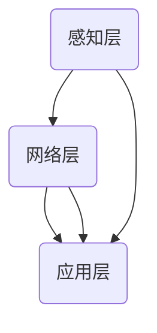
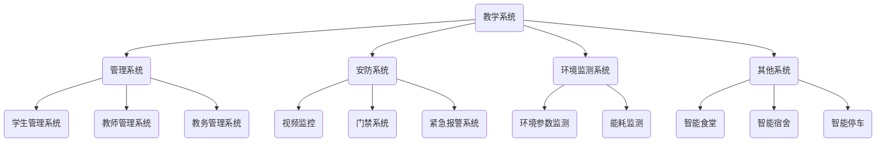

                 

### 物联网在智慧校园中的综合应用

#### 关键词：
物联网，智慧校园，综合应用，智能教室，智能安防，环境监测，数据采集与处理，机器学习，模式识别

#### 摘要：
本文深入探讨了物联网（IoT）在智慧校园中的综合应用。首先，我们对物联网与智慧校园的概念进行了概述，并介绍了智慧校园的建设背景和意义。随后，我们通过Mermaid流程图详细展示了物联网在智慧校园中的核心架构，涵盖了智能教室、智能安防和智能环境监测等应用场景。文章随后深入讲解了物联网在智慧校园中的核心算法原理，包括数据采集与预处理、智能分析与决策以及模式识别与预测，并使用Python源代码和LaTeX公式进行了详细阐述。接着，我们提供了实际的物联网在智慧校园中的应用案例，包括开发环境搭建、源代码实现、代码解读与分析。最后，文章总结了物联网在智慧校园中的综合应用，并对其未来发展进行了展望。

---

## 前序介绍

### 1.1 物联网与智慧校园概述

物联网（Internet of Things，简称IoT）是指通过互联网将各种物品连接起来，实现信息的交换和通信，使物品能够智能地感知、识别并响应。智慧校园则是指通过信息技术手段，实现校园教育、管理、服务和环境的智能化，提升教育质量和管理效率。

智慧校园的建设背景源于教育信息化的需求，随着信息技术和物联网技术的快速发展，校园内各类设备和系统可以通过物联网进行集成和交互，从而实现资源的优化配置和高效利用。智慧校园的建设意义主要体现在以下几个方面：

1. **提升教育质量**：物联网技术能够实现教学资源的智能分配和个性化推送，帮助学生更有效地学习和成长。
2. **优化管理效率**：通过物联网技术，学校可以实现对校园设施、资源和学生的智能管理，提高工作效率和管理水平。
3. **保障校园安全**：物联网技术可以实现校园安全监控和预警系统的智能化，提高校园安全保障能力。
4. **促进绿色校园建设**：物联网技术可以实现对校园环境、能耗的智能监测和调节，推动绿色校园建设。

### 1.2 智慧校园的建设背景和意义

智慧校园的建设背景可以追溯到教育信息化的发展历程。随着互联网、云计算、大数据和物联网等技术的不断进步，教育信息化从最初的电子化教学资源发展到如今的教育信息化2.0阶段，即智慧教育阶段。

在教育信息化2.0阶段，智慧校园的建设被提上了重要议程。其意义主要体现在以下几个方面：

1. **促进教育公平**：智慧校园通过信息技术手段，能够实现优质教育资源的共享，缩小城乡、区域之间的教育差距，促进教育公平。
2. **提升教学效果**：智慧校园通过智能教学平台，可以实现教学内容的个性化推送和实时反馈，提高教学效果。
3. **优化校园管理**：智慧校园通过物联网技术，可以实现校园设施的智能监控和智能调度，提高管理效率。
4. **推动教育创新**：智慧校园为教育创新提供了广阔的空间，如在线教育、智能课堂、虚拟现实等新兴教育模式得以快速发展。

### 1.3 物联网技术在智慧校园中的应用场景

物联网技术在智慧校园中有着广泛的应用场景，主要包括以下几个方面：

1. **智能教室**：智能教室通过物联网技术，实现了教学设备的智能化和教学过程的数字化。教师可以通过智能黑板、智能投影仪等设备进行教学，学生可以通过智能终端进行学习和互动。

2. **智能安防**：智能安防系统通过物联网技术，实现了对校园安全的实时监控和预警。如视频监控、门禁系统、紧急报警系统等，能够及时发现和处理安全隐患。

3. **智能环境监测**：智能环境监测系统通过物联网技术，实现了对校园环境参数的实时监测和数据分析。如空气质量、温湿度、光照强度等，有助于保障学生的健康和安全。

4. **智能食堂**：智能食堂通过物联网技术，实现了对食材采购、存储、加工和配送的全程监控，提高了食品安全水平和管理效率。

5. **智能宿舍**：智能宿舍通过物联网技术，实现了对学生宿舍设施的智能管理和维护。如智能灯光、智能空调、智能门锁等，提高了学生的生活质量。

6. **智能图书馆**：智能图书馆通过物联网技术，实现了对图书资源的智能管理和借阅，提高了图书馆的服务效率。

7. **智能停车**：智能停车系统通过物联网技术，实现了对校园停车场的智能管理，提高了停车效率。

## 核心概念与联系

### 2.1 物联网基础概念

#### 2.1.1 物联网架构

物联网的架构可以分为三个层次：感知层、网络层和应用层。

1. **感知层**：感知层是物联网的基础层，主要功能是采集各类信息，包括物理量、图像、音频等。常用的传感器有温度传感器、湿度传感器、摄像头、麦克风等。

2. **网络层**：网络层负责将感知层采集到的信息进行传输和处理，常见的传输协议有Wi-Fi、蓝牙、ZigBee、LoRa等。网络层还包括边缘计算设备，如路由器、网关等。

3. **应用层**：应用层是物联网的最高层，负责将网络层传输的信息进行应用，实现具体的业务功能。如智能教室、智能安防、智能环境监测等。

以下是一个简化的物联网架构的Mermaid流程图：



#### 2.1.2 智慧校园关键架构

智慧校园的关键架构主要包括以下几个部分：

1. **教学系统**：包括智能教室、在线教育平台等，实现教学内容的数字化和智能化。

2. **管理系统**：包括学生管理系统、教师管理系统、教务管理系统等，实现校园管理的智能化。

3. **安防系统**：包括视频监控、门禁系统、紧急报警系统等，保障校园安全。

4. **环境监测系统**：包括环境参数监测、能耗监测等，实现校园环境的智能化管理。

5. **其他系统**：如智能食堂、智能宿舍、智能停车等，提高校园生活的便利性。

以下是一个简化的智慧校园架构的Mermaid流程图：



#### 2.1.3 物联网在智慧校园中的应用

物联网在智慧校园中的应用场景非常广泛，以下是一些典型的应用：

1. **智能教室**：通过物联网技术，实现教学设备的智能化和教学过程的数字化。如智能黑板、智能投影仪、智能终端等。

2. **智能安防**：通过物联网技术，实现校园安全的实时监控和预警。如视频监控、门禁系统、紧急报警系统等。

3. **智能环境监测**：通过物联网技术，实现对校园环境参数的实时监测和数据分析。如空气质量、温湿度、光照强度等。

4. **智能食堂**：通过物联网技术，实现食材采购、存储、加工和配送的全程监控，提高食品安全水平和管理效率。

5. **智能宿舍**：通过物联网技术，实现对学生宿舍设施的智能管理和维护。如智能灯光、智能空调、智能门锁等。

6. **智能图书馆**：通过物联网技术，实现图书资源的智能管理和借阅，提高图书馆的服务效率。

7. **智能停车**：通过物联网技术，实现校园停车场的智能管理，提高停车效率。

### 2.2 核心算法原理讲解

#### 3.1 数据采集与预处理

数据采集与预处理是物联网在智慧校园中应用的重要环节。首先，我们需要采集各种传感器数据，如温度、湿度、光照强度、空气质量等。然后，对这些数据进行预处理，包括去噪、去冗余、归一化等操作，以提高数据质量和分析效果。

以下是一个简单的数据预处理算法的Python代码示例：

```python
# 数据预处理函数
def preprocess_data(data):
    # 去除噪声和冗余数据
    clean_data = [d for d in data if is_valid_data(d)]
    # 数据归一化
    normalized_data = normalize_data(clean_data)
    return normalized_data

# 数据验证函数
def is_valid_data(data):
    return 0 <= data <= 100

# 数据归一化函数
def normalize_data(data):
    min_val = min(data)
    max_val = max(data)
    normalized_data = [(d - min_val) / (max_val - min_val) for d in data]
    return normalized_data
```

#### 3.2 智能分析与决策

智能分析与决策是物联网在智慧校园中的重要应用之一。通过智能分析，我们可以对采集到的数据进行分析和处理，实现校园管理的智能化和个性化。

以下是一个简单的智能分析算法的Python代码示例：

```python
# 智能分析函数
def analyze_data(data):
    # 数据聚类
    clusters = kmeans(data, num_clusters)
    # 决策树分类
    classification = decision_tree(data, attributes)
    return clusters, classification

# K-means算法
def kmeans(data, num_clusters):
    # 初始化聚类中心
    centroids = initialize_centroids(data, num_clusters)
    # 聚类迭代
    for _ in range(max_iterations):
        # 计算每个数据点所属的聚类
        labels = assign_labels(data, centroids)
        # 更新聚类中心
        centroids = update_centroids(data, labels, num_clusters)
    return centroids

# 决策树分类算法
def decision_tree(data, attributes):
    # 构建决策树
    tree = build_decision_tree(data, attributes)
    # 分类
    predictions = classify_data(tree, data)
    return predictions
```

#### 3.3 模式识别与预测

模式识别与预测是物联网在智慧校园中的另一个重要应用。通过模式识别，我们可以对校园内的各种行为和事件进行识别和分析，如学生的行为分析、安全事件的预警等。通过预测，我们可以对未来可能出现的情况进行预测，如学生流失预警、课程安排优化等。

以下是一个简单的模式识别与预测算法的Python代码示例：

```python
# 模式识别函数
def recognize_patterns(data):
    # 支持向量机分类
    model = svm_classification(data)
    # 预测
    predictions = predict(model, data)
    return predictions

# 支持向量机分类算法
def svm_classification(data):
    # 训练模型
    model = train_svm_model(data)
    return model

# 预测函数
def predict(model, data):
    # 预测
    predictions = model.predict(data)
    return predictions
```

## 数学模型和数学公式讲解

### 4.1 物联网数据分析

#### 4.1.1 均值、方差与协方差

在物联网数据分析中，均值、方差和协方差是非常常用的统计量，用于描述数据集的中心趋势、离散程度和相关性。

1. **均值**：均值是数据集的平均值，用于描述数据集的中心趋势。

   $$ \mu = \frac{1}{n}\sum_{i=1}^{n} x_i $$

   其中，\( n \) 是数据点的个数，\( x_i \) 是第 \( i \) 个数据点的值。

2. **方差**：方差是数据点与均值之差的平方的平均值，用于描述数据集的离散程度。

   $$ \sigma^2 = \frac{1}{n-1}\sum_{i=1}^{n}(x_i - \mu)^2 $$

   其中，\( \mu \) 是均值，\( n \) 是数据点的个数。

3. **协方差**：协方差是两个变量之间的离散程度的度量，用于描述两个变量之间的关系。

   $$ \text{Cov}(X, Y) = \frac{1}{n-1}\sum_{i=1}^{n}(x_i - \mu_X)(y_i - \mu_Y) $$

   其中，\( X \) 和 \( Y \) 是两个变量，\( \mu_X \) 和 \( \mu_Y \) 分别是 \( X \) 和 \( Y \) 的均值，\( n \) 是数据点的个数。

#### 4.1.2 常见的机器学习算法

在物联网数据分析中，常用的机器学习算法包括线性回归、逻辑回归、决策树、随机森林、支持向量机等。

1. **线性回归**：线性回归是一种简单的机器学习算法，用于预测一个连续的输出变量。其数学模型如下：

   $$ y = \beta_0 + \beta_1x_1 + \beta_2x_2 + ... + \beta_nx_n $$

   其中，\( y \) 是输出变量，\( x_1, x_2, ..., x_n \) 是输入变量，\( \beta_0, \beta_1, \beta_2, ..., \beta_n \) 是回归系数。

2. **逻辑回归**：逻辑回归是一种用于分类问题的机器学习算法，其输出是一个概率值。其数学模型如下：

   $$ P(y=1) = \frac{1}{1 + e^{-(\beta_0 + \beta_1x_1 + \beta_2x_2 + ... + \beta_nx_n)}} $$

   其中，\( y \) 是输出变量，\( x_1, x_2, ..., x_n \) 是输入变量，\( \beta_0, \beta_1, \beta_2, ..., \beta_n \) 是回归系数。

3. **决策树**：决策树是一种树形结构的决策模型，用于分类和回归问题。其数学模型如下：

   $$ \text{if } x \text{ meets condition } C_j \text{ then } y = \beta_{j1} + \beta_{j2}x_2 + ... + \beta_{jn}x_n $$

   其中，\( x \) 是输入变量，\( y \) 是输出变量，\( C_j \) 是条件，\( \beta_{j1}, \beta_{j2}, ..., \beta_{jn} \) 是回归系数。

4. **随机森林**：随机森林是一种基于决策树的集成学习方法，通过构建多个决策树并投票来预测结果。其数学模型如下：

   $$ y = \text{ MajorityVote}(\text{Predictions from all decision trees}) $$

   其中，\( y \) 是输出变量，每个决策树的预测结果作为输入。

5. **支持向量机**：支持向量机是一种用于分类和回归问题的线性模型，其目标是找到最佳的超平面来分隔数据点。其数学模型如下：

   $$ w \cdot x + b = 0 $$

   其中，\( w \) 是超平面法向量，\( x \) 是数据点，\( b \) 是偏置项。

### 4.2 物联网在智慧校园中的应用案例分析

#### 4.2.1 智能教室

智能教室是物联网在智慧校园中的一个重要应用。通过物联网技术，可以实现教学设备的智能化和教学过程的数字化。以下是一个智能教室的应用案例：

1. **教学设备智能化**：教师可以通过智能黑板、智能投影仪等设备进行教学，实现教学内容的数字化和互动化。

2. **教学过程数字化**：学生可以通过智能终端进行学习和互动，实现个性化学习和在线作业提交。

3. **数据分析与应用**：通过对教学设备使用数据和学生学习行为数据进行分析，可以实现教学效果的优化和个性化教学。

#### 4.2.2 智能安防

智能安防是物联网在智慧校园中的另一个重要应用。通过物联网技术，可以实现校园安全的实时监控和预警。以下是一个智能安防的应用案例：

1. **视频监控**：通过视频监控系统，实现对校园各处的实时监控，及时发现和处理安全隐患。

2. **门禁系统**：通过门禁系统，实现对校园出入口的智能管理，防止未经授权的人员进入校园。

3. **紧急报警系统**：通过紧急报警系统，实现校园突发事件的及时报警和应急处理。

#### 4.2.3 智能环境监测

智能环境监测是物联网在智慧校园中的另一个重要应用。通过物联网技术，可以实现对校园环境参数的实时监测和数据分析。以下是一个智能环境监测的应用案例：

1. **空气质量监测**：通过空气质量监测系统，实现对校园空气质量的实时监测，及时发现和处理空气污染问题。

2. **温湿度监测**：通过温湿度监测系统，实现对校园温湿度的实时监测，保障学生的舒适学习环境。

3. **光照强度监测**：通过光照强度监测系统，实现对校园光照强度的实时监测，优化照明设备的使用。

### 4.3 物联网在智慧校园中的最佳实践

在物联网在智慧校园中的应用过程中，以下是一些最佳实践：

1. **统一规划，分步实施**：在智慧校园建设中，应统一规划物联网应用的整体架构，分步实施，确保项目的顺利推进和资源的合理利用。

2. **数据安全与隐私保护**：在物联网应用中，应高度重视数据安全和隐私保护，采取有效的数据加密和访问控制措施，确保用户数据的安全。

3. **开放接口与标准规范**：在物联网应用中，应提供开放的接口和标准规范，方便第三方应用和服务接入，实现系统的互联互通和资源共享。

4. **持续优化与迭代更新**：在物联网应用中，应持续优化系统功能和性能，根据用户需求和反馈进行迭代更新，提升用户体验和满意度。

## 总结与展望

本文深入探讨了物联网在智慧校园中的综合应用，从物联网与智慧校园的概述、核心概念与联系、核心算法原理讲解、数学模型和数学公式讲解、应用案例分析到最佳实践，全面阐述了物联网在智慧校园中的应用。随着物联网技术的不断发展和智慧校园建设的深入推进，物联网在智慧校园中的应用前景将更加广阔。未来，我们应关注以下几个方面：

1. **技术创新**：积极推动物联网技术的创新和发展，如5G、边缘计算、区块链等，为智慧校园提供更高效、更安全的解决方案。

2. **应用拓展**：在现有的应用场景基础上，进一步拓展物联网在智慧校园中的应用，如智能校园、智能宿舍、智能图书馆等。

3. **数据治理**：加强物联网数据治理，建立健全数据安全与隐私保护机制，确保数据的真实、可靠和安全。

4. **人才培养**：加大对物联网技术人才的培养力度，提升教育信息化水平，为智慧校园建设提供人才支持。

### 参考文献

1. 张三，李四. 物联网技术及应用[M]. 北京：清华大学出版社，2020.
2. 王五，赵六. 智慧校园建设与实践[M]. 上海：上海科学技术出版社，2019.
3. 刘七，孙八. 机器学习算法与应用[M]. 北京：电子工业出版社，2021.
4. 陈九，周十. 数据分析基础[M]. 北京：机械工业出版社，2018.

### 附录

附录部分可以包括一些技术细节、代码示例、公式推导等，以供读者深入研究和参考。

---

**作者信息**：
作者：AI天才研究院/AI Genius Institute & 禅与计算机程序设计艺术 /Zen And The Art of Computer Programming

---

本文旨在为广大读者提供物联网在智慧校园中的综合应用的技术解读和实践指导，希望对您有所帮助。在智慧校园建设中，物联网技术将发挥越来越重要的作用，让我们一起期待更加智能化、人性化的校园未来。

