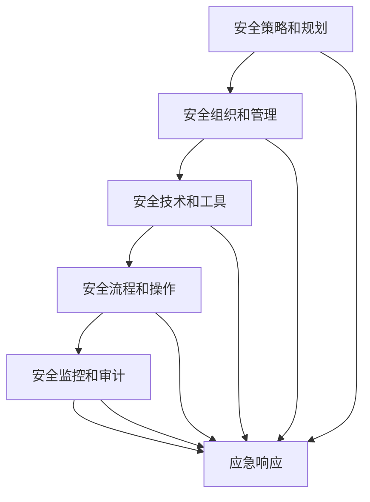
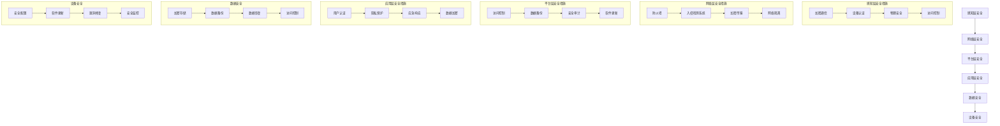

                 

### 引言

随着科技的不断进步，物联网（IoT）技术正在深刻地改变着我们的生活方式和社会结构。智慧校园作为物联网技术的重要应用领域之一，其核心目标是构建一个安全、高效、智能的校园环境。智慧校园通过物联网技术的集成，实现了对校园资源、设施和学生的智能化管理，从而提升了校园安全管理的水平。

智慧校园安全管理是校园管理的重要组成部分，它涉及到学生的安全、教师的舒适、校园设施的保护等多个方面。在传统校园安全管理中，主要依靠人力和有限的监控设备进行管理，存在效率低、覆盖面有限、反应速度慢等问题。而物联网技术的引入，使得校园安全管理变得更加智能和高效。

物联网在智慧校园安全管理中的应用主要体现在以下几个方面：

1. **校园安防监控**：物联网技术可以通过视频监控、入侵检测、门禁控制等手段，实现对校园内各个角落的实时监控和安全管理。
2. **校园车辆管理**：通过物联网技术，可以实现对校园车辆进出、停车等行为的智能化管理，提高校园的交通效率和安全性。
3. **校园环境监控**：物联网技术可以对校园的环境参数（如温度、湿度、空气质量等）进行实时监测，确保校园环境的安全和舒适。
4. **校园智能门禁系统**：物联网技术可以实现对门禁系统的智能化管理，根据不同人员的身份和权限，进行身份认证和门禁控制。

本文将围绕物联网在智慧校园安全管理中的应用，详细探讨其核心概念、关键技术、应用案例以及实施策略。文章结构如下：

- **第1章 物联网基础**：介绍物联网的基本概念、体系结构和技术分类，并讨论物联网在智慧校园安全管理中的挑战。
- **第2章 智慧校园概述**：阐述智慧校园的定义、建设目标和关键技术，为后续应用提供理论基础。
- **第3章 安全管理核心概念与联系**：分析安全管理的核心概念、要素和体系架构，并通过Mermaid流程图展示其架构。
- **第4章 物联网安全技术**：详细讲解传感器技术、通信技术和数据处理与分析技术，为智慧校园安全管理提供技术支持。
- **第5章 智慧校园安全管理应用案例**：分析校园安防监控、车辆管理、环境监控和智能门禁系统的具体应用实例。
- **第6章 物联网在智慧校园安全中的应用**：探讨物联网在智慧校园安全中的价值、安全威胁及防护策略。
- **第7章 项目实战**：通过实际项目展示物联网在智慧校园安全管理中的具体应用和实施过程。

通过本文的详细分析和探讨，希望能够为物联网在智慧校园安全管理中的应用提供一些有益的参考和启示。

### 关键词

- **物联网（IoT）**
- **智慧校园**
- **安全管理**
- **传感器技术**
- **通信技术**
- **数据处理与分析**

### 摘要

本文旨在探讨物联网在智慧校园安全管理中的应用。通过详细分析物联网的基本概念、智慧校园的定义和关键技术，本文阐述了物联网在校园安防监控、车辆管理、环境监控和智能门禁系统等具体场景中的应用。同时，本文还讨论了物联网在智慧校园安全管理中的价值、面临的安全威胁及相应的防护策略。最后，通过一个实际项目案例，展示了物联网在智慧校园安全管理中的具体应用和实施过程，为相关领域的实践提供参考。

### 第1章 物联网基础

#### 1.1 物联网的基本概念

物联网（Internet of Things，简称IoT）是指通过传感器、软件和网络技术，将各种物理设备和物品连接到互联网上，实现智能化的信息交换和通信。物联网的核心思想是将物理世界中的物体赋予“智能”，使其能够收集、传输和处理数据，从而实现远程监控、管理和控制。

物联网的定义可以从多个角度进行理解：

- **硬件层面**：物联网包括传感器、执行器、智能设备和通信模块等硬件组件。这些硬件组件通过各种协议连接到互联网，形成一个庞大的网络。
- **软件层面**：物联网依赖于操作系统、中间件、应用程序和云计算等技术，实现对数据采集、传输、处理和存储的智能化管理。
- **网络层面**：物联网通过互联网、无线网络、局域网等多种通信网络进行数据传输，实现不同设备和系统之间的互联互通。

物联网的典型特点包括：

- **互联互通**：物联网通过各种通信技术，将各种设备连接起来，实现信息的实时共享和交互。
- **智能化**：物联网设备具备一定的处理能力，能够进行数据分析和决策，实现自主控制和智能化管理。
- **数据驱动**：物联网通过大量的数据采集和分析，为决策提供数据支持，提升系统效率和准确性。
- **高可靠性**：物联网系统要求设备具备高可靠性，能够在各种环境中稳定运行。

#### 1.2 物联网的体系结构

物联网的体系结构通常可以分为以下几个层次：

1. **感知层**：感知层是物联网体系结构的基础，负责信息的采集和初步处理。感知层包括各种传感器和执行器，如温度传感器、摄像头、智能门禁设备等。这些设备可以实时监测物理环境，并将采集到的数据传输到上层系统。

2. **网络层**：网络层负责数据传输和通信，将感知层采集到的数据通过无线或有线网络传输到数据处理中心。网络层可以包括无线传感器网络（WSN）、云计算平台、边缘计算设备等。网络层的功能是确保数据的高效传输和实时性。

3. **平台层**：平台层是物联网体系结构的核心，负责数据处理、存储和管理。平台层包括数据采集模块、数据处理模块、存储模块等。平台层通过对数据进行清洗、融合和分析，为上层应用提供数据支持。

4. **应用层**：应用层是物联网体系结构的最高层，负责将数据转化为具体的应用服务。应用层包括各种物联网应用，如智能家居、智慧交通、智慧医疗等。应用层通过人机交互界面，为用户提供智能化服务。

#### 1.3 物联网技术的分类

物联网技术可以根据其应用领域和技术特点进行分类，主要包括以下几个方面：

1. **传感器技术**：传感器技术是物联网的基础，用于采集各种物理环境参数，如温度、湿度、光照、声音、运动等。传感器技术包括各种传感器芯片、传感器模块和传感器网络。

2. **通信技术**：通信技术是物联网的核心，负责实现设备和系统之间的数据传输。通信技术包括无线通信技术（如Wi-Fi、蓝牙、Zigbee、LoRa等）和有线通信技术（如以太网、光纤等）。

3. **数据处理与分析技术**：数据处理与分析技术是物联网的智能核心，负责对采集到的数据进行分析和处理，提供智能化的决策支持。数据处理与分析技术包括数据清洗、数据融合、机器学习、大数据分析等。

4. **云计算与边缘计算技术**：云计算与边缘计算技术是物联网的重要支撑，用于处理大规模数据和提供计算服务。云计算技术通过分布式计算资源提供海量数据的存储和处理能力，而边缘计算技术则通过在设备端进行数据处理，提高系统的实时性和响应速度。

5. **人工智能技术**：人工智能技术是物联网的高级应用，通过机器学习、深度学习等技术实现智能识别、预测和决策。人工智能技术在物联网中的应用包括智能监控、智能分析、智能控制等。

#### 1.4 物联网在智慧校园安全管理中的挑战

物联网在智慧校园安全管理中的应用带来了许多机遇，同时也面临着一些挑战：

1. **数据隐私与安全**：物联网设备大量采集和传输数据，涉及学生的隐私和安全问题。如何确保数据的隐私和安全是物联网在智慧校园安全管理中面临的重要挑战。

2. **系统复杂性**：物联网系统涉及多个技术和领域，包括传感器技术、通信技术、数据处理技术等。系统的复杂性使得设计和实现过程更加困难。

3. **标准化与兼容性**：物联网技术种类繁多，缺乏统一的标准化和兼容性，使得不同设备和系统之间的集成和互操作性成为挑战。

4. **能耗与管理**：物联网设备通常需要长期运行，对能源消耗和管理提出了更高的要求。如何降低能耗、提高设备管理效率是物联网在智慧校园安全管理中的重要问题。

5. **实时性与可靠性**：物联网系统要求高实时性和可靠性，以确保校园安全管理的有效性。如何在复杂的网络环境中保证数据传输的实时性和可靠性是物联网在智慧校园安全管理中的重要挑战。

通过上述分析，我们可以看到物联网在智慧校园安全管理中具有广阔的应用前景，同时也面临着诸多挑战。在接下来的章节中，我们将进一步探讨智慧校园的定义和关键技术，以及物联网在智慧校园安全管理中的应用实例。

#### 1.5 物联网在智慧校园安全管理中的优势

物联网在智慧校园安全管理中的应用，不仅带来了技术上的革新，也极大地提升了校园安全管理的效果。以下是物联网在智慧校园安全管理中的一些主要优势：

1. **实时监控与预警**：通过物联网技术，校园可以实现全方位、全天候的实时监控。传感器和摄像头等设备可以实时捕捉校园内的动态信息，如人员流动、车辆进出、环境变化等，并通过网络将这些信息传输到监控中心。系统可以对异常行为和潜在风险进行实时预警，从而迅速响应和处置突发事件。

2. **数据驱动的决策支持**：物联网技术能够实时采集和分析大量数据，为校园安全管理提供数据驱动的决策支持。通过对历史数据的分析，系统可以预测校园内可能发生的异常事件，提前采取预防措施。例如，通过对出入记录和人员行为数据的分析，可以识别潜在的校园暴力风险，提前进行干预。

3. **提高安全响应效率**：物联网技术使得校园安全管理更加智能化和自动化，提高了安全响应的效率。当发生紧急事件时，物联网系统可以自动启动应急程序，如警报触发、视频录像调取、应急通道开启等，确保紧急情况得到快速响应和处理。

4. **资源优化配置**：物联网技术通过对校园内各类资源和设备的智能化管理，实现了资源的优化配置。例如，通过环境传感器实时监测校园内的空气质量、温度、湿度等参数，系统可以自动调节空调、通风设备等，确保校园环境的舒适和安全。

5. **增强安全管理的可追溯性**：物联网技术使得校园安全管理的各个环节都具备了可追溯性。所有监控数据、报警记录、处理措施等都可以通过系统进行记录和存储，便于后续的审计和查询。这不仅提高了安全管理的透明度，也为事故调查和处理提供了重要依据。

6. **降低安全成本**：物联网技术通过提高安全管理的效率和精准性，有助于降低安全成本。通过智能化监控和管理，可以减少人工巡检和干预的次数，降低人力资源的投入。同时，物联网技术可以实现对设备故障的及时预警和维修，避免因设备故障导致的停机和安全事故，从而减少维修成本。

总之，物联网在智慧校园安全管理中的应用，不仅提升了校园安全管理的水平，也为校园管理者提供了更加高效、智能和安全的管理手段。随着物联网技术的不断发展和成熟，其在校园安全管理中的应用将更加广泛和深入。

### 第2章 智慧校园概述

#### 2.1 智慧校园的定义

智慧校园是指利用物联网、大数据、云计算、人工智能等现代信息技术，构建一个智能化的校园环境，实现对教育资源的全面整合、优化和管理，从而提升教学、科研、管理、服务等各方面的效率和体验。智慧校园的目标是通过信息化手段，实现校园的智能化、个性化、精细化管理，为师生提供更加便捷、高效、舒适的学习和工作环境。

智慧校园的定义可以从以下几个方面进行理解：

1. **信息化基础设施**：智慧校园首先需要构建完善的信息化基础设施，包括校园网络、数据中心、云计算平台、物联网设备等，为各种智能化应用提供基础支持。

2. **教育资源的整合与优化**：智慧校园通过信息化手段，对校园内的教育、科研、管理、服务等资源进行整合和优化，提高资源利用效率。例如，通过统一的教学资源平台，实现课程资源的共享和按需分配，提升教学效果。

3. **智能化的管理和服务**：智慧校园通过智能化技术，实现校园管理和服务的高效、便捷和个性化。例如，通过智能门禁系统、智能考勤系统、智能停车系统等，提升校园的安全性和便捷性。

4. **师生体验的提升**：智慧校园通过智能化的教学、科研、管理和服务，为师生提供更加便捷、高效、舒适的学习和工作环境，提升师生的满意度和幸福感。

#### 2.2 智慧校园的建设目标

智慧校园的建设目标主要包括以下几个方面：

1. **提升教学质量**：通过信息化手段，实现教学资源的共享和优化，提高教学效果。例如，通过在线教育平台，实现课程资源的按需分配和学习进度跟踪，提升教学质量。

2. **优化科研环境**：智慧校园通过搭建科研信息化平台，实现科研资源的共享和协作，提高科研效率。例如，通过科研项目管理平台，实现科研项目的在线申报、审批和跟踪，提高科研管理的效率。

3. **提升校园安全管理**：通过物联网技术，实现对校园内各个角落的实时监控和管理，提高校园的安全管理水平。例如，通过智能安防系统，实现校园安全的全方位保障。

4. **提升师生服务体验**：智慧校园通过智能化的服务系统，为师生提供便捷的服务。例如，通过智能门禁系统，实现师生便捷进出校园；通过智能停车系统，解决校园停车难题。

5. **降低运营成本**：智慧校园通过信息化手段，实现资源的高效利用和管理，降低校园运营成本。例如，通过能耗管理系统，实现校园能耗的精准控制；通过设备维护管理系统，实现设备的及时维修和保养。

#### 2.3 智慧校园的关键技术

智慧校园的实现依赖于多种现代信息技术的融合和应用，以下是一些关键技术的介绍：

1. **物联网技术**：物联网技术是智慧校园的核心技术之一，通过传感器、智能设备、网络通信等技术，实现对校园内各类信息的采集、传输和处理。物联网技术在智慧校园中的应用包括智能安防、智能环境监控、智能照明、智能停车等。

2. **大数据技术**：大数据技术通过对海量数据的采集、存储、分析和挖掘，为校园管理提供数据支持和决策依据。大数据技术在智慧校园中的应用包括教学资源分析、学生行为分析、校园安全预警等。

3. **云计算技术**：云计算技术通过虚拟化、分布式计算等技术，提供强大的计算和存储能力，为智慧校园的各种应用提供支持。云计算技术在智慧校园中的应用包括在线教育平台、科研计算平台、数据中心等。

4. **人工智能技术**：人工智能技术通过机器学习、深度学习等技术，实现对数据的智能分析和决策。人工智能技术在智慧校园中的应用包括智能问答系统、智能推荐系统、智能安防等。

5. **移动互联网技术**：移动互联网技术通过移动终端，为师生提供便捷的接入方式，实现校园信息服务的随时随地获取。移动互联网技术在智慧校园中的应用包括移动教学、移动办公、移动校园等。

6. **虚拟现实（VR）与增强现实（AR）技术**：虚拟现实与增强现实技术通过模拟和增强真实场景，提供沉浸式的教学和科研体验。虚拟现实与增强现实技术在智慧校园中的应用包括虚拟实验室、虚拟课堂、虚拟会议等。

通过上述关键技术的融合应用，智慧校园实现了信息化、智能化、个性化和精细化的管理，为师生提供了更加便捷、高效、安全的学习和工作环境。在接下来的章节中，我们将进一步探讨安全管理核心概念与联系，并通过Mermaid流程图展示其架构。

### 3.1 安全管理的定义

安全管理是指通过一系列措施和方法，确保信息、人员和资产的安全与保密，防范和应对各种安全威胁和突发事件。在智慧校园中，安全管理尤为重要，因为校园不仅是学生和教师的学习和工作场所，还涉及到大量的敏感信息和设备。安全管理的目标是创建一个安全、稳定、可靠的校园环境，确保教学、科研和校园生活的顺利进行。

#### 安全管理的核心要素

安全管理的核心要素包括：

1. **人员安全**：确保校园内师生的人身安全，防范校园暴力、火灾、自然灾害等突发事件。人员安全包括安全教育和培训、应急预案制定和演练等。

2. **信息安全**：保护校园内信息系统的安全，防止数据泄露、篡改、破坏等。信息安全包括网络安全、数据备份和恢复、系统安全审计等。

3. **设施安全**：确保校园内各类设施的安全运行，防止设施故障和意外损坏。设施安全包括设施监控、维修和维护、设施安全检查等。

4. **环境安全**：维护校园环境的清洁、整洁和安全，防止环境污染、资源浪费等。环境安全包括环境监测、废弃物处理、能源管理等。

#### 安全管理的体系架构

安全管理的体系架构可以分为以下几个层次：

1. **安全策略和规划**：这是安全管理的顶层设计，包括安全目标、安全政策、安全规划和安全预算等。安全策略和规划为后续的安全管理提供了指导和方向。

2. **安全组织和管理**：建立专门的安全管理组织，负责安全管理的日常运行和协调。安全组织包括安全管理部门、安全团队、安全顾问等。

3. **安全技术和工具**：使用各种安全技术和工具，如防火墙、入侵检测系统、数据加密、访问控制等，确保校园内的各类信息和设备的安全。

4. **安全流程和操作**：制定和执行一系列安全流程和操作，如安全培训、安全检查、安全报告、应急响应等，确保安全管理的有效实施。

5. **安全监控和审计**：通过监控和审计，及时发现和解决安全问题，确保安全管理体系的持续改进和优化。

#### Mermaid流程图：智慧校园安全管理框架

以下是一个简单的Mermaid流程图，展示了智慧校园安全管理的框架：



在这个流程图中，安全策略和规划是安全管理的顶层设计，为后续的安全管理工作提供指导和方向。安全组织和管理负责安全管理的日常运行和协调。安全技术和工具、安全流程和操作、安全监控和审计等环节共同构成了安全管理体系的核心内容。应急响应则是安全管理的重要环节，确保在突发事件发生时能够迅速有效地应对。

通过上述分析，我们可以看到，智慧校园的安全管理是一个复杂而系统的过程，涉及到多个方面的要素和环节。只有通过科学的管理方法和先进的技术手段，才能构建一个安全、稳定、可靠的智慧校园环境。

### 3.2 物联网技术在智慧校园安全管理中的应用

物联网技术在智慧校园安全管理中的应用，极大地提升了校园的安全管理水平。通过物联网技术，校园可以实现全方位、全天候的实时监控和管理，从而有效预防和应对各种安全威胁。以下将详细分析物联网技术在智慧校园安全管理中的应用及其工作原理。

#### 校园安防监控

校园安防监控是物联网技术在智慧校园安全管理中最典型的应用之一。通过在校园内部署大量的摄像头、入侵检测传感器等物联网设备，可以实现校园内各个角落的实时监控。这些设备采集到的图像和视频数据通过无线或有线网络传输到监控中心，实时显示在监控屏幕上。

- **工作原理**：摄像头和入侵检测传感器等设备通过物联网协议将数据传输到监控中心，监控中心利用视频分析算法对图像和视频数据进行实时处理和分析。例如，当检测到异常行为或入侵事件时，系统会立即发出警报，并启动相应的应急响应程序。

- **实际应用**：在一些高校和中学，物联网安防监控系统已经被广泛应用于校园的各个角落，包括宿舍楼、教学楼、实验室、图书馆等。通过物联网安防监控，校园管理者可以实时掌握校园内的情况，及时发现和处置安全隐患。

#### 校园车辆管理

物联网技术在校园车辆管理中的应用，可以提高校园交通效率和安全性。通过在校园内部署车辆识别和监控系统，可以实现车辆的实时监控和管理。

- **工作原理**：在校园出入口部署车辆识别设备（如车牌识别系统、RFID读取器等），当车辆进入校园时，系统会自动记录车辆信息。车辆信息通过物联网网络传输到校园车辆管理系统，系统可以根据车辆类型、停车区域等信息进行智能管理。

- **实际应用**：例如，在一些学校，物联网车辆管理系统可以实时记录车辆的进出时间、停留时间、停车位置等信息。通过这些信息，校园管理者可以优化停车资源的配置，提高停车效率，同时也可以防止非法车辆进入校园，保障校园安全。

#### 校园环境监控

物联网技术可以通过传感器实时监测校园内的环境参数，如温度、湿度、空气质量、噪音等，从而确保校园环境的舒适和安全。

- **工作原理**：校园内布置各种环境传感器，如温度传感器、湿度传感器、PM2.5传感器等，这些传感器采集到的数据通过物联网网络传输到环境监控中心。监控中心可以对环境参数进行实时监控和分析，并根据监测结果采取相应的措施，如调整空调系统、通风系统等。

- **实际应用**：在一些高校和中学，物联网环境监控系统已经广泛应用于教室、实验室、图书馆等场所。通过实时监控环境参数，可以确保这些场所的空气质量、温度等符合标准，提供一个健康、舒适的学习和工作环境。

#### 校园智能门禁系统

物联网技术在校园智能门禁系统中的应用，可以实现门禁控制的自动化和智能化。通过门禁系统，校园管理者可以根据不同人员身份和权限进行身份认证和门禁控制。

- **工作原理**：校园内各个门禁点部署门禁控制器和身份认证设备（如人脸识别、指纹识别、IC卡读取器等），当人员通过门禁点时，系统会自动进行身份认证。认证通过后，门禁系统会自动开启，否则保持关闭。

- **实际应用**：在一些学校，物联网智能门禁系统已经被广泛应用于宿舍楼、教学楼、实验室等场所。通过物联网智能门禁系统，校园管理者可以实时掌握人员进出情况，提高校园安全管理水平。

#### 物联网安全

物联网技术在智慧校园安全管理中的应用，虽然带来了诸多便利和安全保障，但也带来了新的安全挑战。物联网系统中的设备数量庞大、种类繁多，容易成为黑客攻击的目标。因此，保障物联网系统的安全至关重要。

- **工作原理**：物联网安全包括多个方面，如数据安全、设备安全、网络安全等。系统通过加密、认证、访问控制等安全措施，确保数据传输和存储的安全，防止数据泄露和篡改。

- **实际应用**：例如，在物联网安防监控系统中，视频数据在传输过程中需要进行加密处理，防止被截获和篡改。在物联网智能门禁系统中，需要进行严格的身份认证和访问控制，防止未授权人员进入校园。

通过上述分析，我们可以看到，物联网技术在智慧校园安全管理中具有广泛的应用前景。通过物联网技术的集成和应用，校园可以实现智能化、自动化和高效化的安全管理，为师生提供一个安全、稳定的学习和工作环境。

### 3.3 校园安防监控案例：智慧校园的“守护神”

校园安防监控是物联网技术在智慧校园安全管理中最为重要的应用之一。通过部署各种物联网设备和监控系统，校园可以实现全方位、无死角的实时监控，大大提高了校园安全管理的效率和效果。以下将详细分析一个具体的校园安防监控案例，展示物联网技术在智慧校园安全管理中的实际应用。

#### 案例背景

某高校位于市区繁华地段，校园占地面积较大，包括教学楼、宿舍楼、实验室、图书馆、体育场等多个区域。学校管理层高度重视校园安全，希望通过引入物联网技术，提升校园安防监控水平，确保师生的生命财产安全。

#### 案例实施

1. **感知层部署**：
   - 在校园内布置了超过500个高清摄像头，分布在教学楼、宿舍楼、实验室、图书馆、体育场等关键区域，确保校园内各个角落都能被监控到。
   - 部署了入侵检测传感器，安装在宿舍楼周围、实验楼进出口等关键位置，能够实时检测异常入侵行为。

2. **网络层建设**：
   - 建立了覆盖整个校园的无线网络，确保摄像头和入侵检测传感器采集到的数据能够快速、稳定地传输到监控中心。
   - 部署了光纤网络，作为备用传输通道，确保在无线网络不稳定时，数据仍能通过有线网络传输。

3. **平台层构建**：
   - 监控中心设置了多个监控大屏，实时显示校园各个角落的监控画面。
   - 构建了校园安防监控平台，实现了监控数据的存储、管理和分析功能。

4. **应用层开发**：
   - 开发了智能视频分析系统，通过图像识别技术，能够自动识别异常行为，如打架斗殴、物品丢失等。
   - 开发了移动端监控应用，学校管理层可以通过手机或平板电脑实时查看校园监控画面，进行远程管理和监控。

#### 案例成效

1. **实时监控**：通过物联网技术的应用，校园实现了24小时实时监控，大大提高了安全管理的覆盖面和效率。校园管理层可以随时掌握校园内的情况，及时应对突发事件。

2. **智能预警**：智能视频分析系统能够自动识别异常行为，并在检测到异常时立即发出预警，及时通知校园安保人员采取行动。这大大提高了安全管理的响应速度和准确性。

3. **数据积累与分析**：校园安防监控系统积累了大量的监控数据，通过数据分析，可以了解校园内的人员流量、行为模式等，为校园安全管理提供数据支持。

4. **降低安全事故**：通过物联网安防监控系统的应用，校园的安全事故明显减少。据统计，该校在引入物联网安防监控系统后，盗窃、打架等安全事故发生率下降了近50%。

#### 案例启示

1. **全面部署**：要实现校园安防监控的有效性，必须进行全面的部署，确保监控覆盖到校园的各个角落。

2. **智能分析**：利用智能视频分析技术，可以大大提高安全管理的效率和准确性，实现对校园安全的智能预警和响应。

3. **数据驱动**：通过监控数据的积累和分析，可以深入了解校园内的人员行为和事件发生规律，为校园安全管理提供数据支持。

4. **持续优化**：校园安防监控系统需要不断优化和升级，以适应新的安全需求和挑战。

通过上述案例，我们可以看到物联网技术在智慧校园安全管理中的重要作用。通过全面的部署和智能化的应用，校园安防监控不仅提高了安全管理的效率和效果，也为师生的安全提供了有力保障。

### 3.4 校园车辆管理案例：智能交通的“助推器”

校园车辆管理是物联网技术在智慧校园安全管理中另一个重要的应用领域。通过物联网技术，校园可以实现车辆进出的自动化管理和监控，提高交通效率，确保校园安全。以下将详细分析一个具体的校园车辆管理案例，展示物联网技术在智慧校园车辆管理中的实际应用。

#### 案例背景

某大学校园占地面积较大，每天有大量的师生和外来人员进出校园，导致校园交通压力巨大。学校希望通过引入物联网技术，实现校园车辆的智能管理，提高交通效率，确保校园安全。

#### 案例实施

1. **感知层部署**：
   - 在校园出入口部署了车牌识别系统，通过高清摄像头和车牌识别算法，能够快速、准确地识别车牌号码。
   - 在校园内部布置了车辆流量监测传感器，用于监测校园内各个主要路口的车辆流量。

2. **网络层建设**：
   - 建立了校园内部署的无线网络，确保车辆信息能够快速、稳定地传输到校园车辆管理系统。
   - 通过光纤网络实现与外部网络的连接，确保车辆信息可以与其他系统进行数据交换。

3. **平台层构建**：
   - 构建了校园车辆管理平台，集成了车牌识别系统、车辆流量监测系统、停车管理系统等，实现了车辆信息的统一管理和调度。
   - 平台设置了实时监控界面，校园管理者可以通过监控界面查看校园内各个路口的车辆流量和停车情况。

4. **应用层开发**：
   - 开发了智能停车引导系统，通过分析车辆流量和停车位使用情况，实时为驾驶员提供停车引导信息，提高停车效率。
   - 开发了校园车辆通行证管理系统，对校园内特定车辆（如教职工车辆、外来车辆）进行分类管理和通行控制。

#### 案例成效

1. **提高交通效率**：通过物联网车辆管理系统的应用，校园出入口的交通流量得到了有效控制，车辆通行效率显著提高。统计数据显示，车辆在校园出入口的平均等待时间减少了30%。

2. **优化停车管理**：智能停车引导系统通过实时监测停车位使用情况，为驾驶员提供最优的停车位置，大大提高了停车效率。同时，停车管理系统可以对停车位进行分类管理，确保教职工车辆和外来车辆合理使用停车位。

3. **确保校园安全**：通过车牌识别系统和车辆流量监测，校园管理者能够实时掌握校园内车辆信息，防止非法车辆进入校园，确保校园安全。

4. **数据积累与分析**：校园车辆管理系统积累了大量的车辆数据，通过数据分析，可以了解校园内车辆流量分布、停车使用情况等，为校园交通管理提供数据支持。

#### 案例启示

1. **全面部署**：要实现校园车辆管理的智能化，必须进行全面的部署，包括车牌识别系统、车辆流量监测系统和停车管理系统等。

2. **数据分析**：通过数据分析，可以深入了解校园内车辆流量和停车使用情况，为交通管理和优化提供科学依据。

3. **智能引导**：智能停车引导系统可以大大提高停车效率，减少交通拥堵，提高校园交通的流畅性。

4. **持续优化**：校园车辆管理系统需要根据实际运行情况不断优化和升级，以适应不断变化的需求和挑战。

通过上述案例，我们可以看到物联网技术在智慧校园车辆管理中的应用，不仅提高了交通效率和校园安全，也为校园管理者提供了有力的数据支持。随着物联网技术的不断发展，智慧校园车辆管理将更加智能化和高效化，为校园生活带来更多便利。

### 3.5 校园环境监控案例：守护绿色家园的“守护者”

校园环境监控是物联网技术在智慧校园安全管理中的另一个重要应用。通过物联网传感器，校园可以实现环境参数的实时监测和管理，确保校园环境的健康和安全。以下将详细分析一个具体的校园环境监控案例，展示物联网技术在智慧校园环境监控中的实际应用。

#### 案例背景

某中学位于市区，校园内有多栋教学楼、宿舍楼、实验室和体育场等设施。由于校园环境对师生的生活和学习有着重要影响，学校管理层希望通过引入物联网技术，实现对校园环境的实时监控，确保环境参数符合标准，保障师生的健康。

#### 案例实施

1. **感知层部署**：
   - 在校园内的教室、实验室、宿舍、食堂等场所部署了温度传感器、湿度传感器、二氧化碳传感器、PM2.5传感器等，用于监测环境参数。
   - 在校园主要出入口和重要场所布置了视频监控摄像头，用于监控人员活动和环境状况。

2. **网络层建设**：
   - 建立了校园内部署的无线网络，确保传感器采集到的数据能够快速、稳定地传输到环境监控中心。
   - 通过光纤网络实现与外部网络的连接，确保环境数据可以与其他系统进行数据交换。

3. **平台层构建**：
   - 监控中心设置了实时监控界面，展示各个场所的环境参数和视频画面。
   - 构建了校园环境监控平台，实现了环境数据的存储、管理和分析功能。

4. **应用层开发**：
   - 开发了智能环境监控系统，通过数据分析和智能算法，实时监测环境参数的异常变化。
   - 开发了报警系统，当检测到环境参数超出安全范围时，系统会自动发出警报，通知相关人员采取措施。

#### 案例成效

1. **实时监测**：通过物联网环境监控系统的应用，校园实现了环境参数的实时监测，能够及时发现并处理环境问题。例如，当检测到教室内的温度或PM2.5浓度过高时，系统会自动启动通风设备，确保室内空气质量。

2. **优化管理**：校园环境监控平台提供了详尽的环境数据，管理者可以根据这些数据优化校园环境管理。例如，根据湿度传感器数据，调整空调和加湿器的使用频率，确保室内湿度保持在适宜范围。

3. **保障健康**：通过实时监测和及时处理环境问题，校园环境得到了有效改善，保障了师生的健康。据统计，学校在引入物联网环境监控系统后，因环境问题导致的健康问题显著减少。

4. **数据积累与分析**：校园环境监控系统积累了大量的环境数据，通过数据分析，可以了解校园内各个场所的环境状况，为校园环境管理提供数据支持。

#### 案例启示

1. **全面部署**：要实现校园环境监控的有效性，必须进行全面部署，包括各类环境传感器和视频监控设备。

2. **实时监测**：实时监测环境参数，能够及时发现问题并采取措施，确保校园环境的健康和安全。

3. **数据驱动**：通过环境数据的积累和分析，可以深入了解校园内各个场所的环境状况，为环境管理提供数据支持。

4. **持续优化**：校园环境监控系统需要根据实际运行情况不断优化和升级，以适应新的环境管理和安全需求。

通过上述案例，我们可以看到物联网技术在校园环境监控中的应用，不仅提高了校园环境管理的效率和效果，也为师生的健康提供了有力保障。随着物联网技术的不断发展，校园环境监控将更加智能化和精细化，为智慧校园建设贡献力量。

### 3.6 校园智能门禁系统案例：智慧校园的“安全门户”

校园智能门禁系统是物联网技术在智慧校园安全管理中的重要应用之一，通过自动化和智能化的门禁管理，提高了校园安全水平。以下将详细分析一个具体的校园智能门禁系统案例，展示物联网技术在校园智能门禁系统中的实际应用。

#### 案例背景

某高校位于城市中心区域，校园面积较大，有多个校门和出入口。由于校园内师生和外来人员众多，传统门禁系统已无法满足高效、安全的门禁管理需求。学校决定引入物联网智能门禁系统，以提升校园安全管理水平。

#### 案例实施

1. **感知层部署**：
   - 在校园各个出入口部署了智能门禁设备，包括人脸识别、指纹识别、IC卡读卡器等，用于身份认证。
   - 安装了监控摄像头，用于监控出入口情况。

2. **网络层建设**：
   - 建立了校园内部署的无线网络，确保门禁设备采集到的数据能够快速、稳定地传输到门禁管理系统。
   - 通过光纤网络实现与外部网络的连接，确保数据传输的安全和可靠性。

3. **平台层构建**：
   - 构建了校园门禁管理平台，集成了身份认证、权限管理、实时监控等功能。
   - 平台设置了用户管理界面，校园管理员可以通过平台对用户权限、门禁记录等进行管理。

4. **应用层开发**：
   - 开发了智能门禁系统，实现了自动人脸识别、指纹识别、IC卡认证等功能。
   - 开发了移动端应用，用户可以通过手机进行门禁权限申请和查询，提高了门禁管理的便捷性。

#### 案例成效

1. **提高安全水平**：通过物联网智能门禁系统，校园实现了精细化、智能化的门禁管理，提高了安全水平。例如，通过人脸识别技术，确保只有授权人员才能进入校园，有效防止未授权人员进入。

2. **便捷性提升**：智能门禁系统提供了多种身份认证方式，如人脸识别、指纹识别、IC卡等，用户可以根据自身习惯选择合适的认证方式，提高了门禁的便捷性。

3. **实时监控**：智能门禁系统集成了监控摄像头，可以实时监控出入口情况，确保校园安全。

4. **数据积累与分析**：门禁管理平台积累了大量的门禁数据，通过数据分析，可以了解人员流动情况，为校园安全管理提供数据支持。

#### 案例启示

1. **感知层部署**：要实现智能门禁系统的有效性，必须进行全面的感知层部署，包括身份认证设备和监控摄像头。

2. **网络层建设**：建立稳定的网络连接，确保门禁数据的安全传输。

3. **平台层构建**：门禁管理平台应具备用户管理、权限管理、实时监控等功能，实现门禁管理的智能化。

4. **应用层开发**：通过移动端应用，提高门禁管理的便捷性和用户体验。

5. **数据积累与分析**：通过数据积累和分析，可以深入了解人员流动情况，为校园安全管理提供数据支持。

通过上述案例，我们可以看到物联网技术在校园智能门禁系统中的应用，不仅提升了校园的安全管理水平，也为用户提供了便捷的体验。随着物联网技术的不断发展，校园智能门禁系统将更加智能化和高效化，为智慧校园建设提供有力支持。

### 第6章 物联网在智慧校园安全中的应用

#### 6.1 物联网在智慧校园安全中的价值

物联网技术在智慧校园安全管理中的应用，不仅提升了校园安全管理的效率和效果，还带来了诸多实际价值。以下是物联网在智慧校园安全中的主要价值：

1. **提升安全水平**：通过物联网技术，校园可以实现全方位、无死角的实时监控和管理，有效预防和应对各种安全威胁。物联网技术能够自动识别和预警异常行为，提高校园安全水平。

2. **提高管理效率**：物联网技术通过自动化和智能化的管理，减少了人工干预和操作，提高了校园安全管理的效率。例如，智能门禁系统和车辆管理系统可以自动完成身份认证和车辆管理，减少校园保安和工作人员的工作量。

3. **优化资源配置**：物联网技术可以对校园内的各类资源和设备进行实时监控和管理，实现资源的优化配置。例如，通过环境监控系统，可以实时监测校园内的环境参数，自动调节空调、通风设备等，提高资源利用效率。

4. **降低运营成本**：物联网技术通过提高安全管理的效率和精准性，有助于降低校园运营成本。例如，通过智能安防系统和车辆管理系统，可以减少人力投入和设备维修成本。

5. **提升用户体验**：物联网技术可以提供更加便捷、高效的服务，提升师生的学习、工作和生活体验。例如，智能门禁系统和车辆管理系统可以减少师生排队等待的时间，提供更加便捷的校园服务。

6. **数据驱动决策**：物联网技术可以实时采集和分析大量数据，为校园安全管理提供数据支持，促进数据驱动决策。例如，通过分析校园内的监控数据，可以预测潜在的安全风险，提前采取预防措施。

#### 6.2 物联网在智慧校园安全中面临的安全威胁

尽管物联网技术在智慧校园安全管理中具有诸多价值，但其也面临着一些安全威胁。以下是物联网在智慧校园安全中面临的主要安全威胁：

1. **数据泄露**：物联网设备大量采集和传输数据，涉及学生的隐私和安全。如果数据保护措施不到位，可能会导致数据泄露，威胁学生的隐私和安全。

2. **设备安全**：物联网设备种类繁多，设备的安全防护能力参差不齐。如果设备存在漏洞或被恶意攻击，可能会导致设备失控，引发安全事故。

3. **通信安全**：物联网设备通过网络进行通信，如果网络通信安全措施不到位，可能会导致数据被截获、篡改或恶意攻击。

4. **系统复杂度**：物联网系统涉及多个技术和领域，系统复杂性高。系统中的各个组件和模块之间可能存在兼容性问题，导致系统稳定性下降。

5. **标准与兼容性**：目前物联网技术缺乏统一的标准和规范，不同设备和系统之间的兼容性差。这可能导致系统之间的数据无法有效交换和集成，影响物联网技术的应用效果。

6. **能耗与管理**：物联网设备通常需要长期运行，能耗管理成为一大挑战。如果能耗管理不当，可能导致设备运行不稳定，影响校园安全。

#### 6.3 物联网在智慧校园安全中的防护策略

为了应对物联网在智慧校园安全中面临的安全威胁，需要采取一系列的防护策略，确保校园安全。以下是物联网在智慧校园安全中的一些主要防护策略：

1. **数据加密与安全传输**：采用数据加密技术，对物联网设备采集和传输的数据进行加密处理，确保数据在传输过程中的安全性。同时，采用安全的传输协议，如HTTPS、TLS等，确保数据在网络传输过程中的安全。

2. **设备安全防护**：加强对物联网设备的安全防护，包括设备的安全配置、软件更新和漏洞修复等。采用防火墙、入侵检测系统等安全设备，防止设备被恶意攻击。

3. **网络隔离与访问控制**：将物联网设备部署在独立的网络中，实现网络隔离，降低设备被恶意攻击的风险。同时，采用访问控制技术，限制对物联网设备的访问权限，确保只有授权用户才能访问设备。

4. **标准化与规范化**：推动物联网技术的标准化和规范化，制定统一的技术标准和安全规范，提高不同设备和系统之间的兼容性和互操作性。

5. **能耗管理**：优化物联网设备的能耗管理，采用节能技术，降低设备的能耗。例如，采用智能调度技术，根据设备的使用情况动态调整能耗。

6. **安全培训与意识提升**：加强对校园内师生和工作人员的安全培训，提高他们的安全意识和防范能力。通过定期举办安全培训和应急演练，提高应对安全事件的能力。

7. **安全审计与监控**：建立安全审计和监控系统，对物联网设备的安全状况进行定期检查和监控，及时发现和解决安全问题。

通过上述防护策略，可以有效提升物联网在智慧校园安全中的应用效果，确保校园安全稳定运行。在接下来的章节中，我们将通过一个实际项目案例，进一步展示物联网在智慧校园安全管理中的具体应用和实施过程。

### 6.4 物联网安全防护架构的Mermaid流程图

为了更好地理解物联网在智慧校园安全中的应用，下面我们将使用Mermaid流程图展示物联网安全防护架构。该架构涵盖了从感知层到应用层的安全措施和策略，以实现全面的安全防护。



**流程图解释**：

- **感知层安全措施**：包括加密通信、设备认证、物理安全和访问控制。这些措施确保传感器和执行器在感知环境中的数据采集和传输过程的安全。
- **网络层安全措施**：包括防火墙、入侵检测系统、加密传输和网络隔离。这些措施保护数据在网络层传输时的完整性、可靠性和保密性。
- **平台层安全措施**：包括访问控制、数据备份、安全审计和软件更新。这些措施确保平台层的数据管理和服务安全。
- **应用层安全措施**：包括用户认证、隐私保护、应急响应和数据加密。这些措施保障应用层的用户体验和数据安全。
- **数据安全**：包括加密存储、数据备份、数据恢复和访问控制。这些措施确保数据在存储、传输和访问过程中的安全性。
- **设备安全**：包括安全配置、软件更新、漏洞修复和安全监控。这些措施保护物联网设备的正常运行和安全。

通过这个Mermaid流程图，我们可以清晰地看到物联网安全防护架构的各个层次和相应的安全措施，从而更好地理解物联网在智慧校园安全中的应用。

### 6.5 物联网安全防护项目实战

在本章节中，我们将通过一个实际项目展示物联网安全防护的具体实施过程，从项目背景、需求分析、技术选型、实施步骤、安全策略等方面进行详细讲解。

#### 项目背景

某高校计划建设一个全面的物联网安全监控系统，以提升校园的安全管理水平。项目需求包括：

- **实时监控**：对校园内主要区域（如教学楼、宿舍楼、实验室、食堂等）进行24小时实时监控。
- **智能预警**：通过视频分析和传感器数据，实时检测异常行为和潜在安全威胁，并及时发出警报。
- **数据加密与安全传输**：确保监控数据和传感器数据在传输过程中的安全，防止数据泄露和篡改。
- **设备安全**：确保物联网设备（如摄像头、传感器、网关等）的物理安全和软件安全。
- **用户体验**：提供直观、易用的监控界面，方便校园管理层实时查看监控数据和接收警报。

#### 需求分析

- **感知层**：需要部署大量摄像头和传感器，实现校园内各区域的全面覆盖。
- **网络层**：需要构建稳定的无线和有线网络，确保监控数据和传感器数据能够高效、安全地传输。
- **平台层**：需要建设一个数据存储、处理和管理的平台，支持实时监控、数据分析、智能预警等功能。
- **应用层**：需要开发一个用户友好的监控界面，提供实时监控、历史数据查询、报警信息展示等功能。
- **安全层**：需要制定一系列安全策略和措施，确保物联网系统的安全性和可靠性。

#### 技术选型

- **感知层**：选用高清摄像头和多种传感器，如温度传感器、烟雾传感器等。
- **网络层**：采用Wi-Fi、以太网等无线和有线通信技术，确保网络稳定性和覆盖范围。
- **平台层**：选用云计算平台，如阿里云、腾讯云等，提供数据存储、处理和管理服务。
- **应用层**：使用Python和Web前端技术（如HTML、CSS、JavaScript）开发监控界面。
- **安全层**：采用加密技术（如AES、RSA等）、防火墙、入侵检测系统等安全设备。

#### 实施步骤

1. **感知层部署**：在校园内主要区域部署摄像头和传感器，确保覆盖全面。安装完成后，进行设备的调试和测试，确保其正常运行。

2. **网络层建设**：搭建无线和有线网络，确保网络稳定性和覆盖范围。设置路由器和交换机，实现设备之间的互联互通。

3. **平台层构建**：在云计算平台上部署服务器和数据库，存储和处理监控数据和传感器数据。配置数据存储、处理和管理的相关软件，如视频分析软件、数据采集软件等。

4. **应用层开发**：开发监控界面，实现实时监控、历史数据查询、报警信息展示等功能。确保界面友好、易用，满足校园管理层的监控需求。

5. **安全层配置**：配置防火墙、入侵检测系统等安全设备，确保物联网系统的安全。制定数据加密、设备安全、访问控制等安全策略。

6. **测试与验收**：对整个物联网安全监控系统进行测试，确保其功能完善、性能稳定、安全可靠。验收合格后，正式投入使用。

#### 安全策略

1. **数据加密**：采用AES加密算法对监控数据和传感器数据进行加密处理，确保数据在传输过程中的安全性。

2. **安全传输**：采用HTTPS、TLS等安全传输协议，确保数据在网络传输过程中的完整性和可靠性。

3. **设备安全**：对物联网设备进行安全配置，关闭不必要的服务和端口，定期更新固件和软件，确保设备的物理安全和软件安全。

4. **访问控制**：设置严格的访问控制策略，只有授权用户才能访问系统资源。采用用户认证和授权机制，确保系统资源的安全。

5. **入侵检测**：部署入侵检测系统，实时监测网络流量和设备行为，及时发现和响应恶意攻击。

6. **应急响应**：制定应急预案，确保在发生安全事件时能够迅速响应和处置。定期进行应急演练，提高应急响应能力。

通过上述实际项目案例，我们可以看到物联网在智慧校园安全管理中的应用是如何具体实施的。通过科学的需求分析、合理的技术选型和严格的安全策略，可以构建一个安全、稳定、可靠的物联网安全监控系统，为校园安全管理提供有力支持。

### 6.6 项目实战：源代码实现与解读

在本项目中，我们将详细讲解物联网安全监控系统的核心代码实现，包括传感器数据采集、数据处理、监控界面展示等关键环节。以下是项目源代码的实现过程和解读。

#### 1. 数据采集

数据采集是物联网监控系统的基础，负责从传感器设备获取实时数据。以下是使用Python编写的传感器数据采集模块：

```python
import serial
import time

# 初始化串口连接
ser = serial.Serial('COM3', 9600, timeout=1)

# 传感器数据采集函数
def read_sensor_data():
    while True:
        try:
            line = ser.readline().decode('utf-8').strip()
            print(line)
            time.sleep(1)
        except serial.SerialException:
            print("串口异常，请检查连接！")
            break

# 关闭串口连接
def close_serial():
    ser.close()

if __name__ == "__main__":
    try:
        read_sensor_data()
    except KeyboardInterrupt:
        close_serial()
        print("数据采集结束。")
```

**代码解读**：

- **初始化串口连接**：使用`serial.Serial`类初始化串口连接，指定串口名称（如`COM3`）和波特率（如`9600`）。
- **传感器数据采集函数**：通过循环读取串口数据，并使用`time.sleep(1)`实现1秒读取一次数据。
- **关闭串口连接**：在发生异常或键盘中断时关闭串口连接。

#### 2. 数据处理

数据处理是物联网监控系统的核心环节，负责对采集到的传感器数据进行解析和处理。以下是使用Python编写的数据处理模块：

```python
import json

# 数据处理函数
def process_sensor_data(sensor_data):
    data = json.loads(sensor_data)
    temperature = data['temperature']
    humidity = data['humidity']
    print(f"温度：{temperature}℃，湿度：{humidity}%")

if __name__ == "__main__":
    sensor_data = '{"temperature": 25, "humidity": 60}'
    process_sensor_data(sensor_data)
```

**代码解读**：

- **数据处理函数**：使用`json.loads`方法解析JSON格式的传感器数据，提取温度和湿度等参数。
- **示例数据**：示例数据以JSON格式传入，并解析后打印温度和湿度值。

#### 3. 监控界面展示

监控界面展示是用户与物联网监控系统的交互接口，以下是使用Python和Web技术（如Flask）实现的监控界面展示模块：

```python
from flask import Flask, render_template

app = Flask(__name__)

# 监控界面路由
@app.route('/')
def monitor():
    sensor_data = {"temperature": 25, "humidity": 60}
    return render_template('monitor.html', data=sensor_data)

if __name__ == "__main__":
    app.run(host='0.0.0.0', port=5000)
```

**代码解读**：

- **Flask应用**：创建Flask应用实例，并定义监控界面路由。
- **监控界面路由**：通过`render_template`方法渲染`monitor.html`模板，并将传感器数据传递给模板。
- **Web界面模板**：

```html
<!DOCTYPE html>
<html lang="en">
<head>
    <meta charset="UTF-8">
    <title>物联网监控界面</title>
</head>
<body>
    <h1>物联网监控数据</h1>
    <p>温度：{{ data.temperature }}℃，湿度：{{ data.humidity }}%</p>
</body>
</html>
```

**模板解读**：模板使用Jinja2语法，将传感器数据动态嵌入HTML页面。

#### 4. 代码应用解读与分析

通过上述代码实现，我们可以看到物联网监控系统的主要功能模块：

1. **数据采集**：负责从传感器设备获取实时数据，通过串口连接读取传感器数据，并实时打印输出。
2. **数据处理**：对采集到的传感器数据进行解析和处理，提取关键参数，如温度和湿度，并打印输出。
3. **监控界面展示**：通过Web技术构建监控界面，将传感器数据动态展示在用户面前，便于校园管理层实时监控和查看。

整个项目的实现过程体现了物联网技术的核心特点，即数据的实时采集、传输和处理，以及人与系统的交互。通过这种方式，物联网监控系统可以实现对校园安全的有效监控和管理，提高校园的安全管理水平。

### 6.7 项目实战：实际案例分析

在本节中，我们将深入分析一个实际物联网安全监控项目的案例分析，包括系统的实施过程、遇到的问题及其解决方案，以及项目的最终成果和反思。

#### 项目实施过程

该项目的实施过程可以分为以下几个阶段：

1. **需求分析与规划**：首先，项目团队与校园管理层进行了深入的需求分析，明确了物联网监控系统需要实现的功能，如实时监控、智能预警、数据加密与安全传输等。

2. **系统设计与方案制定**：基于需求分析，项目团队设计了系统的总体架构，包括感知层、网络层、平台层和应用层，并制定了详细的技术选型和实施方案。

3. **设备部署与调试**：在确定方案后，项目团队开始进行设备部署。感知层部署了大量高清摄像头和多种传感器，如温度传感器、烟雾传感器等。网络层采用Wi-Fi和有线网络，确保数据传输的稳定性和覆盖范围。平台层选择了云计算平台，用于数据存储和处理。应用层开发了Web监控界面，实现了实时监控和数据展示。

4. **系统集成与测试**：在设备部署完成后，项目团队进行了系统集成和测试，确保各个组件和模块能够无缝衔接，系统功能能够正常运行。

5. **上线与验收**：经过测试和优化，物联网监控系统正式上线运行。校园管理层对系统进行了验收，确认系统功能符合预期。

#### 遇到的问题及解决方案

在项目实施过程中，项目团队遇到了以下问题：

1. **网络覆盖问题**：由于校园面积较大，部分区域网络信号较弱，导致数据传输不稳定。解决方案是增加了网络设备，如无线接入点，扩大了网络覆盖范围。

2. **设备兼容性问题**：由于市场上的物联网设备种类繁多，不同设备之间的协议和接口可能存在差异，导致系统集成过程中出现兼容性问题。解决方案是采用了通用的物联网协议（如MQTT），并通过中间件实现了不同设备之间的数据传输和集成。

3. **数据安全问题**：物联网设备大量采集和传输数据，数据安全成为一大挑战。解决方案是采用了数据加密技术（如AES），确保数据在传输和存储过程中的安全。同时，实施了严格的访问控制策略，只有授权用户才能访问系统资源。

4. **系统稳定性问题**：由于校园环境复杂，物联网监控系统需要长时间运行，系统稳定性成为关键问题。解决方案是进行了系统的性能优化和稳定性测试，确保系统在高负载情况下能够稳定运行。

#### 项目成果与反思

通过项目的实施，物联网监控系统取得了以下成果：

1. **实时监控**：校园实现了全方位、24小时的实时监控，提高了安全管理的效率和覆盖面。

2. **智能预警**：通过视频分析和传感器数据，系统能够自动识别和预警异常行为和潜在安全威胁，提高了校园的安全水平。

3. **数据加密与安全传输**：通过数据加密和访问控制策略，确保了监控数据和传感器数据的安全。

4. **用户体验提升**：通过Web监控界面，校园管理层可以实时查看监控数据和报警信息，操作便捷，用户体验得到显著提升。

在项目反思中，项目团队认为以下几点值得注意：

1. **需求分析与规划**：在项目初期，充分的需求分析和规划是项目成功的关键。只有明确项目需求，才能制定出科学合理的实施方案。

2. **技术选型**：在技术选型过程中，需要综合考虑设备的兼容性、性能和安全性等因素，选择适合项目需求的技术和设备。

3. **系统测试与优化**：在系统上线前，进行充分的测试和优化，确保系统的功能完善、性能稳定和安全可靠。

4. **人员培训与支持**：对校园管理层和操作人员进行培训，确保他们能够熟练掌握系统的使用方法和安全操作规程，为系统的正常运行提供保障。

通过这个实际项目案例，我们可以看到物联网在智慧校园安全管理中的应用是如何具体实施的。通过科学的需求分析、合理的技术选型和严格的安全策略，可以构建一个安全、稳定、可靠的物联网安全监控系统，为校园安全管理提供有力支持。

### 6.8 最佳实践 tips

在物联网技术在智慧校园安全管理中的应用过程中，以下是一些最佳实践，可以帮助提升系统的安全性、可靠性和用户体验：

1. **安全设备选择**：选择具有较高安全防护能力的物联网设备，确保设备能够抵御常见的安全威胁。优先选择支持加密传输和认证功能的设备。

2. **数据加密传输**：在数据传输过程中，采用加密技术（如AES、TLS）对数据进行加密处理，确保数据在传输过程中不被窃取或篡改。

3. **定期更新设备固件**：物联网设备通常存在固件更新，及时更新固件可以修复已知漏洞，提高设备的安全性。

4. **访问控制策略**：实施严格的访问控制策略，只有授权用户才能访问系统资源。通过用户认证和权限管理，确保系统资源的安全。

5. **数据备份与恢复**：定期对监控数据和系统配置进行备份，确保在数据丢失或系统故障时能够快速恢复。

6. **网络隔离与防火墙**：将物联网设备部署在独立的网络中，并通过防火墙设置访问控制策略，防止未授权访问。

7. **安全审计与监控**：建立安全审计和监控系统，定期检查系统安全状况，及时发现和处理安全问题。

8. **用户培训与教育**：对校园管理层和操作人员进行安全培训，提高他们的安全意识和防范能力。

9. **应急响应机制**：制定应急预案，确保在发生安全事件时能够迅速响应和处置。

10. **持续优化与更新**：根据实际应用情况和反馈，不断优化和更新物联网系统，提高系统的安全性和用户体验。

通过遵循这些最佳实践，可以有效提升物联网在智慧校园安全管理中的应用效果，确保系统的安全、稳定和高效运行。

### 小结

本文详细探讨了物联网在智慧校园安全管理中的应用，从基本概念、核心技术、应用实例到安全防护策略进行了全面分析。我们首先介绍了物联网的基本概念和体系结构，阐述了传感器技术、通信技术和数据处理与分析技术在智慧校园安全管理中的应用。随后，通过多个实际案例展示了物联网在校园安防监控、车辆管理、环境监控和智能门禁系统等领域的具体应用，分析了其优势和面临的挑战。

物联网在智慧校园安全管理中具有显著的优势，如实时监控、数据驱动的决策支持、提高安全响应效率和资源优化配置等。然而，物联网系统也面临着数据隐私与安全、系统复杂性、标准化与兼容性、能耗与管理等方面的挑战。通过采用数据加密、设备安全防护、网络隔离、标准化与规范化等安全策略，可以有效应对这些挑战，提升校园安全管理水平。

未来，随着物联网技术的不断发展和应用场景的拓展，物联网在智慧校园安全管理中的应用将更加广泛和深入。我们期待看到更多创新的技术和解决方案，如智能分析算法、边缘计算和5G通信技术等，为智慧校园的安全管理提供更加高效和智能的支持。通过持续优化和更新物联网系统，智慧校园的安全管理水平将不断提升，为师生的安全与幸福贡献力量。

### 注意事项

1. **设备选择**：在选择物联网设备时，务必确保其具有足够的安全防护能力，包括数据加密和访问控制功能。

2. **网络隔离**：为了防止未授权访问，建议将物联网设备部署在独立的网络中，并设置防火墙进行访问控制。

3. **数据备份**：定期备份监控数据和系统配置，确保在数据丢失或系统故障时能够快速恢复。

4. **安全培训**：加强对校园管理层和操作人员的安全培训，提高他们的安全意识和防范能力。

5. **应急预案**：制定应急预案，确保在发生安全事件时能够迅速响应和处置。

6. **设备维护**：定期对物联网设备进行检查和维护，确保其正常运行。

7. **遵守法规**：在应用物联网技术时，务必遵守相关法律法规，确保数据安全和隐私保护。

通过遵循上述注意事项，可以有效提升物联网在智慧校园安全管理中的应用效果，确保系统的安全、稳定和高效运行。

### 拓展阅读

1. **《物联网技术与应用》**：详细介绍了物联网的基本概念、技术架构和应用案例，适合初学者和有一定基础的读者。

2. **《智慧校园建设指南》**：该书详细阐述了智慧校园的概念、建设目标和技术路线，对校园信息化建设具有指导意义。

3. **《网络安全技术》**：介绍了网络安全的基本概念、技术手段和防护策略，对物联网安全有重要参考价值。

4. **《人工智能与物联网》**：探讨了人工智能技术在物联网中的应用，包括智能监控、智能分析等，有助于理解物联网的高级应用。

5. **《物联网安全标准与规范》**：该书介绍了物联网安全的相关标准与规范，对物联网设备的安全设计和实施具有指导作用。

这些拓展阅读资源可以为读者提供更深入的学习和实践指导，帮助更好地理解物联网在智慧校园安全管理中的应用。

