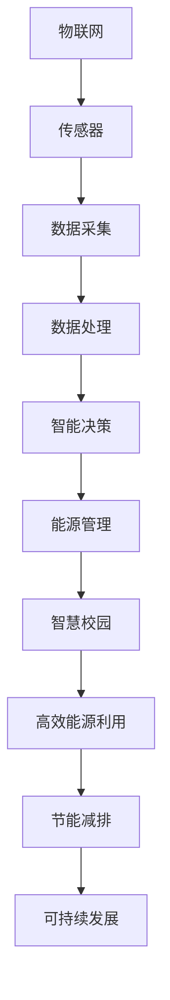

                 


## 引言

### 背景与目的

随着信息技术的飞速发展，物联网（Internet of Things，IoT）已经成为现代社会的关键技术之一。物联网通过将物理设备、传感器、软件和通信网络连接起来，实现了数据的实时采集、传输和处理，从而为各行各业带来了深刻的变革。在教育领域，物联网的应用不仅提升了教学质量和学习体验，也为智慧校园建设提供了强有力的支持。

智慧校园是利用物联网、大数据、云计算等先进技术，实现对校园环境、教学资源、学生行为等全方位、全过程的智能化管理和优化。智慧校园建设旨在提高教育资源利用效率，提升校园管理水平和学生生活质量，实现绿色、智能、可持续的发展。

本文旨在探讨物联网在智慧校园能源管理中的应用，通过分析物联网技术的基础知识、传感器技术在校园能源管理中的应用、通信技术的作用以及数据处理与智能决策的原理，展示物联网技术在校园能源管理中的实际案例，并展望其未来发展。

### 文章结构

本文将按照以下结构展开：

1. **物联网与智慧校园能源管理概述**：介绍物联网、智慧校园和能源管理的基本概念，阐述物联网在智慧校园能源管理中的应用前景。
2. **物联网技术在校园能源管理中的应用**：详细分析物联网传感器技术、通信技术、数据采集与处理技术在校园能源管理中的应用。
3. **物联网在校园能源管理中的实践案例**：通过实际案例展示物联网技术在校园能源管理系统设计、实现和应用中的具体成果。
4. **物联网在校园能源管理中的发展趋势与展望**：探讨物联网技术在校园能源管理中的未来发展方向和潜力。

通过本文的阐述，我们希望能够为教育行业从业者、技术研究者以及相关政策制定者提供有益的参考和启示，推动智慧校园能源管理的可持续发展。

## 物联网与智慧校园能源管理概述

### 第1章：物联网与智慧校园能源管理基础

#### 1.1 物联网概述

物联网是指通过互联网将各种物理设备、传感器、软件系统和人员连接起来，实现信息的实时采集、传输和处理，从而实现智能化管理和控制。物联网的核心技术包括传感器技术、通信技术、数据处理技术等。

物联网的发展可以追溯到20世纪80年代，当时人们提出了智能设备互联的构想。随着互联网的普及和信息技术的进步，物联网技术逐渐成熟并得到了广泛的应用。根据国际数据公司（IDC）的预测，到2025年，全球物联网设备的连接数将达到500亿台，市场规模将达到1.1万亿美元。

#### 1.2 智慧校园概述

智慧校园是利用物联网、大数据、云计算、人工智能等先进技术，实现对校园环境、教学资源、学生行为等全方位、全过程的智能化管理和优化。智慧校园的目标是实现教育资源的最大化利用，提高教学质量和校园管理水平，提升学生和教职工的满意度。

智慧校园的建设主要包括以下几个方面的内容：

1. **校园信息化建设**：通过建设校园网络、服务器、数据中心等基础设施，实现校园信息资源的数字化、网络化和智能化。
2. **教育信息化**：通过应用信息技术，提升教学、科研、管理等方面的效率和质量，实现个性化教育和智慧化教学。
3. **校园环境智能化**：利用物联网技术，实现校园环境（如温度、湿度、光照、空气质量等）的实时监测和智能调节，提高校园环境舒适度和安全性。
4. **校园安全与智慧化**：通过视频监控、人脸识别、智能门禁等物联网技术，提升校园安全管理和防范能力。

#### 1.3 能源管理概述

能源管理是指通过科学的手段和方法，对能源的供应、消耗、利用等方面进行管理和控制，以达到节约能源、降低成本、保护环境的目标。在校园中，能源管理主要包括水、电、燃气等能源的供应和使用。

当前，我国校园能源管理存在以下问题和挑战：

1. **能源消耗统计不准确**：由于缺乏有效的监测和管理手段，校园能源消耗数据不准确，导致能源浪费现象严重。
2. **能源利用率低**：校园内各类设施设备能耗高，能源利用率低，存在大量的能耗瓶颈。
3. **能源管理信息化程度低**：校园能源管理缺乏信息化手段，无法实现实时监控和智能调度，难以实现精细化管理。
4. **能源浪费现象普遍**：校园内存在大量无人使用但仍在运行设备的情况，能源浪费现象普遍。

#### 1.4 物联网在智慧校园能源管理中的应用前景

物联网技术在智慧校园能源管理中的应用前景广阔，主要体现在以下几个方面：

1. **实时监测与数据采集**：通过在校园内布置各类传感器，实现对能源消耗、环境参数等数据的实时采集和监测，为能源管理提供精准的数据支持。
2. **智能调度与优化**：通过物联网技术，实现能源的智能调度和优化，提高能源利用率，降低能源成本。
3. **节能控制与自动化**：利用物联网技术，实现对校园内各类设备能源消耗的智能控制，实现设备的自动化运行，减少能源浪费。
4. **节能减排与可持续发展**：通过物联网技术的应用，实现校园能源的节约和减排，促进校园的可持续发展。

总之，物联网技术为智慧校园能源管理提供了新的思路和方法，具有巨大的应用潜力。随着物联网技术的不断发展和成熟，智慧校园能源管理将得到进一步的提升和完善。

### 第2章：物联网传感器技术及其在校园能源管理中的应用

#### 2.1 物联网传感器概述

物联网传感器是物联网系统中的核心组件之一，用于感知和采集环境中的各种物理量，如温度、湿度、光照、压力、速度等。物联网传感器通过将物理信号转换为电信号，然后传输到数据处理单元，实现对环境信息的实时监测和反馈。

物联网传感器可以分为以下几类：

1. **温度传感器**：用于测量环境温度，如热电偶、热敏电阻等。
2. **湿度传感器**：用于测量环境湿度，如电容式湿度传感器、电阻式湿度传感器等。
3. **光照传感器**：用于测量光照强度，如光敏电阻、光电二极管等。
4. **流量传感器**：用于测量液体或气体的流量，如超声波流量传感器、涡街流量传感器等。
5. **电能传感器**：用于测量电能的消耗，如电流传感器、电压传感器等。

#### 2.2 常见物联网传感器在校园能源管理中的应用

物联网传感器在校园能源管理中具有广泛的应用，以下列举几种常见的物联网传感器及其在校园能源管理中的应用：

1. **温度传感器**

温度传感器在校园能源管理中的应用主要体现在空调系统和供暖系统上。通过在教室和宿舍等场所布置温度传感器，实时监测环境温度，并将数据传输到中央控制系统，中央控制系统根据温度数据进行智能调节，实现节能控制。

例如，在夏季高温时期，如果教室内的温度传感器检测到温度超过设定值，空调系统会自动启动，降低室内温度；当温度低于设定值时，空调系统会自动关闭，避免能源浪费。

2. **湿度传感器**

湿度传感器在校园能源管理中的应用主要体现在潮湿地区的供暖和通风系统中。通过在校园内布置湿度传感器，实时监测空气湿度，并将数据传输到中央控制系统，中央控制系统根据湿度数据进行智能调节，实现节能控制。

例如，在潮湿地区，如果空气湿度超过设定值，通风系统会自动开启，排出潮湿空气，降低室内湿度；当空气湿度低于设定值时，通风系统会自动关闭，避免能源浪费。

3. **光照传感器**

光照传感器在校园能源管理中的应用主要体现在照明系统中。通过在校园内布置光照传感器，实时监测室内外的光照强度，并将数据传输到中央控制系统，中央控制系统根据光照强度进行照明控制，实现节能控制。

例如，在白天，如果室内光照强度达到设定值，照明系统会自动关闭，避免能源浪费；在夜间或光照不足时，照明系统会自动开启，提供足够的照明。

4. **流量传感器**

流量传感器在校园能源管理中的应用主要体现在供水、供电系统中。通过在校园内布置流量传感器，实时监测水、电的消耗量，并将数据传输到中央控制系统，中央控制系统根据流量数据进行智能调节，实现节能控制。

例如，在供水系统中，如果检测到用水量过大，中央控制系统会自动调节水阀，控制水的流量，避免水资源浪费；在供电系统中，如果检测到用电量过大，中央控制系统会自动调节电负荷，避免电力浪费。

5. **电能传感器**

电能传感器在校园能源管理中的应用主要体现在电力监控系统中。通过在校园内布置电能传感器，实时监测电力消耗情况，并将数据传输到中央控制系统，中央控制系统根据电力消耗数据进行智能调度，实现节能控制。

例如，在高峰用电时段，如果检测到电力负荷过大，中央控制系统会自动调节部分设备的运行状态，避免电力过载；在低谷用电时段，中央控制系统会自动启动备用电源，提高能源利用率。

总之，物联网传感器在校园能源管理中的应用，通过实时监测、数据采集和智能调节，能够有效地提高能源利用率，降低能源消耗，实现节能控制，对校园的可持续发展具有重要意义。

### 第3章：物联网通信技术及其在校园能源管理中的应用

#### 3.1 物联网通信技术概述

物联网通信技术是实现物联网系统正常运行的关键技术之一，它负责将传感器采集到的数据传输到数据处理中心，以便进行进一步的分析和处理。物联网通信技术种类繁多，主要包括以下几种：

1. **有线通信技术**：有线通信技术包括以太网、光纤通信、电力线载波通信等。这些技术具有数据传输速度快、稳定性高、安全性好等优点，但布线复杂，成本较高。
2. **无线通信技术**：无线通信技术包括Wi-Fi、蓝牙、Zigbee、LoRa等。这些技术具有安装简便、成本低、灵活性高等优点，但数据传输速度和稳定性相对有线技术较弱。

物联网通信技术具有以下几个特点：

1. **低功耗**：物联网设备通常需要长时间运行，因此低功耗是其关键特性之一。物联网通信技术通过采用低功耗协议和优化算法，延长设备续航时间。
2. **高可靠性**：物联网系统需要高可靠性，以保障数据传输的准确性和稳定性。物联网通信技术通过采用多种通信协议和冗余技术，提高系统的可靠性。
3. **高容量**：随着物联网设备数量的不断增加，物联网通信技术需要具备高容量特性，以支持大量设备的接入和通信。
4. **安全性**：物联网系统涉及到大量的敏感数据，因此安全性至关重要。物联网通信技术通过采用加密算法和身份验证机制，保障数据传输的安全性。

#### 3.2 常见物联网通信技术在校园能源管理中的应用

在校园能源管理中，物联网通信技术的应用主要体现在以下几个方面：

1. **Wi-Fi**

Wi-Fi技术是一种广泛应用的无线通信技术，具有数据传输速度快、覆盖范围广等优点。在校园能源管理中，Wi-Fi技术可以用于实现传感器数据的无线传输。例如，通过在校园内布置Wi-Fi接入点，传感器采集到的温度、湿度、光照等数据可以通过Wi-Fi网络传输到数据处理中心，以便进行进一步分析。

2. **蓝牙**

蓝牙技术是一种低功耗、短距离的无线通信技术，适用于小型物联网设备之间的通信。在校园能源管理中，蓝牙技术可以用于实现设备之间的数据传输。例如，在智能照明系统中，通过蓝牙通信，传感器可以将光照强度数据传输到控制器，控制器根据光照强度自动调节灯光亮度，实现节能控制。

3. **Zigbee**

Zigbee技术是一种低功耗、短距离的无线通信技术，具有低成本、高容量、高可靠性等优点。在校园能源管理中，Zigbee技术可以用于实现多传感器数据的传输和集中管理。例如，在智能供暖系统中，通过Zigbee网络，传感器可以将室内温度数据传输到中央控制系统，中央控制系统根据温度数据自动调节供暖设备，实现节能控制。

4. **LoRa**

LoRa技术是一种长距离、低功耗的无线通信技术，适用于物联网设备之间的远程通信。在校园能源管理中，LoRa技术可以用于实现远程监控和调度。例如，通过LoRa网络，校园能源管理系统能够实时监控全校的电力、水资源消耗情况，并根据需求进行远程调度，实现能源的优化配置。

#### 3.3 物联网通信技术在校园能源管理中的应用优势

物联网通信技术在校园能源管理中的应用具有以下优势：

1. **实时性**：通过物联网通信技术，校园能源管理系统能够实时获取传感器数据，实现对能源消耗的实时监控和智能调节，提高能源利用率。
2. **高效性**：物联网通信技术具有高带宽、低延迟的特性，能够快速传输大量数据，为校园能源管理提供高效的数据支持。
3. **灵活性**：物联网通信技术具有多样化的通信方式和灵活的部署方式，可以根据实际需求选择合适的通信技术，实现校园能源管理的个性化定制。
4. **安全性**：物联网通信技术采用加密算法和身份验证机制，保障数据传输的安全性，防止数据泄露和恶意攻击。

总之，物联网通信技术在校园能源管理中的应用，能够提高能源管理效率，降低能源消耗，实现校园的绿色、智能、可持续发展。

### 第4章：物联网数据采集与处理技术及其在校园能源管理中的应用

#### 4.1 物联网数据采集技术

物联网数据采集技术是物联网系统的基础，它负责将传感器采集到的数据传输到数据处理中心。物联网数据采集技术主要包括以下几个方面：

1. **传感器数据采集**：传感器是物联网数据采集的核心组件，通过将物理信号转换为电信号，实现对环境参数的实时监测。常见的传感器有温度传感器、湿度传感器、光照传感器、流量传感器等。
2. **采集设备**：采集设备负责将传感器数据转换为数字信号，并进行初步处理，常见的采集设备有数据采集卡、嵌入式设备、物联网网关等。
3. **数据采集流程**：数据采集流程主要包括传感器的安装和布置、传感器的数据采集、采集设备的处理和存储等环节。

#### 4.2 物联网数据处理技术

物联网数据处理技术是物联网系统的关键环节，它负责对采集到的数据进行清洗、存储、分析和挖掘，以便为决策提供支持。物联网数据处理技术主要包括以下几个方面：

1. **数据预处理**：数据预处理是对原始数据进行清洗、格式化、去噪等操作，以提高数据的质量和可用性。常见的数据预处理方法包括缺失值填补、异常值处理、数据归一化等。
2. **数据存储**：数据存储是将预处理后的数据存储到数据库或数据仓库中，以便进行进一步的分析和处理。常见的数据库技术有关系型数据库（如MySQL、PostgreSQL）和非关系型数据库（如MongoDB、Cassandra）。
3. **数据分析**：数据分析是对存储在数据库中的数据进行统计、挖掘和分析，以发现数据中的规律和趋势。常见的数据分析算法有回归分析、聚类分析、关联规则挖掘等。
4. **数据可视化**：数据可视化是将分析结果以图形、图表等形式展示出来，以便用户直观地理解和分析数据。常见的数据可视化工具有Tableau、PowerBI、ECharts等。

#### 4.3 物联网数据在校园能源管理中的应用

物联网数据在校园能源管理中的应用主要体现在以下几个方面：

1. **数据可视化**：通过物联网数据可视化技术，将采集到的能源消耗数据、环境参数数据等以图形、图表的形式展示出来，帮助管理人员直观地了解校园能源使用情况。
2. **数据分析与预测**：通过物联网数据分析技术，对采集到的能源消耗数据进行分析，发现能源消耗的规律和趋势，为校园能源管理提供数据支持。例如，通过回归分析预测未来的能源需求，帮助管理人员合理安排能源供应。
3. **数据驱动的能源管理策略**：通过物联网数据分析技术，生成数据驱动的能源管理策略，实现能源的智能调度和优化。例如，根据环境温度、湿度、光照等数据，自动调节空调、供暖、照明等设备的运行状态，实现节能控制。

#### 4.4 物联网数据在校园能源管理中的应用实例

以下是一个物联网数据在校园能源管理中的应用实例：

在某高校的智慧校园能源管理系统中，通过物联网传感器实时采集教室内的温度、湿度、光照等数据。采集到的数据经过数据预处理后，存储到数据库中。管理人员通过数据可视化工具，可以实时查看教室内的环境参数和能源消耗情况。

通过对数据进行分析，发现教室在冬季供暖期间，室内温度在20°C左右时能源消耗最低。因此，管理人员制定了以下数据驱动的能源管理策略：

1. 在冬季供暖期间，将室内温度设定在20°C，以降低能源消耗。
2. 根据室外温度变化，自动调整室内温度，以保持舒适的室内环境。
3. 利用光照传感器数据，自动调节教室灯光的亮度，实现节能控制。

通过物联网数据在校园能源管理中的应用，该高校实现了能源的智能调度和优化，降低了能源消耗，提高了能源利用率，为校园的可持续发展做出了积极贡献。

总之，物联网数据采集与处理技术在校园能源管理中具有重要作用。通过实时监测、数据采集、数据分析和智能调度，物联网技术能够提高校园能源管理的效率和水平，为校园的绿色、智能、可持续发展提供有力支持。

### 第三部分：物联网在校园能源管理中的实践案例

#### 第5章：校园能源管理系统设计与实现

##### 5.1 校园能源管理系统的总体设计

校园能源管理系统的设计旨在通过物联网技术实现对校园内能源消耗的实时监测、数据分析和管理，从而提高能源利用效率，降低能源成本，实现校园的绿色、可持续发展。以下是校园能源管理系统的总体设计：

1. **系统架构设计**

校园能源管理系统采用三层架构设计，包括数据采集层、数据处理层和应用层。

- **数据采集层**：主要负责传感器数据的采集和传输，包括各种物联网传感器（如温度传感器、湿度传感器、光照传感器、电能传感器等）和物联网网关。
- **数据处理层**：主要负责对采集到的数据进行预处理、存储和分析，包括数据预处理模块、数据库和数据分析模块。
- **应用层**：提供用户界面和业务逻辑，实现对校园能源的实时监控、分析和决策，包括前端应用和后端服务。

2. **系统功能模块设计**

校园能源管理系统主要包括以下几个功能模块：

- **实时监测模块**：实现对校园内能源消耗和环境参数的实时监测，包括温度、湿度、光照、电能等数据。
- **数据预处理模块**：负责对采集到的原始数据进行清洗、格式化和去噪，以提高数据的质量和可用性。
- **数据分析模块**：通过对预处理后的数据进行分析，生成各种统计报表、趋势图和预测模型，帮助管理人员了解能源消耗情况，制定合理的能源管理策略。
- **智能决策模块**：根据数据分析结果，自动生成节能方案和建议，实现能源的智能调度和优化。
- **用户界面**：提供直观的用户界面，展示实时监测数据、分析结果和决策方案，方便管理人员进行操作和监控。

##### 5.2 校园能源管理系统的关键技术实现

校园能源管理系统在数据采集、数据处理和应用层等方面采用了多项关键技术，以下是其中的几个关键技术：

1. **数据采集与传输**

数据采集与传输是校园能源管理系统的基础。在数据采集方面，系统采用了各种物联网传感器，包括温度传感器、湿度传感器、光照传感器、电能传感器等，通过物联网网关将采集到的数据传输到数据处理层。在数据传输方面，系统采用了Wi-Fi、蓝牙等无线通信技术，确保数据传输的实时性和稳定性。

2. **数据预处理**

数据预处理是确保数据质量的重要环节。系统采用了数据预处理模块，对采集到的原始数据进行清洗、格式化和去噪。具体方法包括：

- **数据清洗**：去除重复数据、异常数据和缺失数据，确保数据的完整性。
- **数据格式化**：将不同来源的数据统一格式，便于后续处理和分析。
- **数据去噪**：通过滤波算法去除数据中的噪声，提高数据精度。

3. **数据分析与挖掘**

数据分析与挖掘是校园能源管理系统的核心。系统采用了多种数据分析算法，包括回归分析、聚类分析、关联规则挖掘等，对预处理后的数据进行分析。通过数据分析，系统可以生成各种统计报表、趋势图和预测模型，帮助管理人员了解能源消耗情况，发现节能潜力。

4. **智能决策**

智能决策是基于数据分析结果，自动生成节能方案和建议。系统采用了机器学习算法和优化算法，根据历史数据和实时数据，自动调整能源消耗策略，实现能源的智能调度和优化。例如，根据温度数据自动调节空调温度，根据光照数据自动调节照明亮度等。

5. **用户界面**

用户界面是校园能源管理系统的重要组成部分。系统采用了Web技术和移动应用技术，提供直观、易用的用户界面，方便管理人员进行操作和监控。用户界面主要包括以下几个部分：

- **实时监控**：展示实时监测数据、趋势图和报警信息，帮助管理人员实时了解校园能源使用情况。
- **历史数据查询**：提供历史数据的查询功能，方便管理人员进行分析和决策。
- **报表生成**：根据分析结果生成各种统计报表，为管理人员提供决策支持。
- **消息通知**：通过手机短信、邮件等方式，实时通知管理人员异常情况和节能建议。

##### 5.3 系统部署与实现

校园能源管理系统的部署与实现包括以下几个方面：

1. **硬件部署**：在校园内布置各种物联网传感器，包括温度传感器、湿度传感器、光照传感器、电能传感器等，并将物联网网关部署在数据采集层。
2. **软件部署**：在数据处理层和后端服务器上部署数据预处理模块、数据库、数据分析模块和智能决策模块，前端服务器上部署用户界面。
3. **系统集成**：将硬件和软件系统集成，实现数据的实时采集、传输、处理和应用。

通过校园能源管理系统的设计与实现，可以有效提高校园能源利用效率，降低能源成本，实现校园的绿色、可持续发展。

### 第6章：校园能源管理系统的实际应用案例

#### 6.1 案例一：某高校智慧校园能源管理系统

##### 案例概述

某高校智慧校园能源管理系统是基于物联网技术构建的，旨在实现对校园内能源消耗的实时监测、数据分析和管理，提高能源利用效率，降低能源成本。系统包括传感器数据采集、数据预处理、数据分析和智能决策等功能模块，实现了对校园内水、电、燃气等能源的全面监控和管理。

##### 系统功能与应用效果

1. **实时监测与数据采集**

在校园内布置了各种物联网传感器，包括温度传感器、湿度传感器、光照传感器、电能传感器和流量传感器等。这些传感器实时采集校园内环境参数和能源消耗数据，通过物联网网关传输到数据处理中心。

- **实时监测**：通过前端应用，管理人员可以实时查看校园内各个区域的温度、湿度、光照强度和能源消耗情况，确保能源使用安全。
- **数据采集**：系统自动采集传感器数据，并将数据存储在数据库中，为后续分析提供基础数据。

2. **数据分析与预测**

通过对采集到的数据进行预处理和分析，系统可以生成各种统计报表、趋势图和预测模型。

- **数据分析**：系统对历史数据进行分析，发现能源消耗的规律和趋势，为管理人员提供决策支持。
- **预测模型**：利用机器学习算法，系统可以预测未来的能源需求，帮助管理人员合理安排能源供应。

3. **智能决策与优化**

根据数据分析结果和预测模型，系统可以自动生成节能方案和建议，实现能源的智能调度和优化。

- **智能决策**：系统根据环境参数和能源消耗数据，自动调整空调、供暖、照明等设备的运行状态，实现节能控制。
- **优化方案**：系统可以根据实际需求，生成合理的能源使用方案，降低能源消耗，提高能源利用率。

4. **用户界面与消息通知**

系统提供了直观的用户界面，方便管理人员进行操作和监控。

- **用户界面**：通过Web和移动应用，管理人员可以实时查看校园能源使用情况、分析结果和节能建议。
- **消息通知**：系统可以发送手机短信、邮件等消息通知，及时告知管理人员异常情况和节能建议。

##### 应用效果

通过智慧校园能源管理系统的应用，该校在能源管理方面取得了显著成效：

- **能源消耗降低**：通过实时监测和智能调节，校园内能源消耗显著降低，水、电、燃气等能源利用率提高。
- **能源成本降低**：通过智能调度和优化，降低了能源成本，提高了经济效益。
- **校园环境改善**：通过实时监测和智能控制，校园内环境得到了改善，温度、湿度、光照等参数更加适宜，提高了师生的生活质量。
- **管理效率提升**：通过系统化的管理和数据驱动的决策，校园能源管理水平得到提升，管理人员可以更加高效地开展工作。

#### 6.2 案例二：某中学智能照明管理系统

##### 案例概述

某中学智能照明管理系统是基于物联网技术构建的，旨在通过智能调节照明设备，实现节能控制，提高校园照明质量。系统包括光照传感器、智能控制器、云平台等模块，实现了对校园内照明设备的自动化管理。

##### 系统功能与应用效果

1. **智能调节与节能控制**

- **光照监测**：系统通过在校园内布置光照传感器，实时监测室内外光照强度。
- **自动调节**：根据光照强度数据，智能控制器会自动调节照明设备的亮度，确保室内光照适宜。
- **节能控制**：通过智能调节，照明设备在无人使用时可以自动关闭或降低亮度，实现节能控制。

2. **数据采集与存储**

- **实时采集**：系统实时采集光照传感器数据，并将数据传输到云平台。
- **数据存储**：系统将采集到的光照数据存储在云平台，以便进行后续分析和管理。

3. **远程监控与控制**

- **远程监控**：通过云平台，管理人员可以远程查看校园内照明设备的运行状态和光照数据。
- **远程控制**：管理人员可以通过云平台远程调整照明设备的运行状态，实现远程控制。

4. **消息通知与报警**

- **消息通知**：系统可以发送手机短信、邮件等消息通知，及时告知管理人员照明设备的异常情况和节能建议。
- **报警功能**：系统可以设置报警阈值，当照明设备出现故障或异常时，及时发出报警信息。

##### 应用效果

通过智能照明管理系统的应用，该中学在校园照明管理方面取得了显著成效：

- **节能效果显著**：通过智能调节和节能控制，校园内照明设备的能耗显著降低，照明质量得到提高。
- **照明环境改善**：通过实时监测和自动调节，校园内照明环境得到了改善，师生对校园照明的满意度提高。
- **管理效率提升**：通过系统化的管理和远程监控，照明设备的管理效率得到显著提升，管理人员可以更加高效地开展工作。
- **校园安全增强**：通过智能照明系统，校园内的照明设备得到有效管理，减少了故障率和安全隐患。

总之，校园能源管理系统的实际应用案例表明，物联网技术在校园能源管理中具有巨大的潜力。通过实时监测、数据分析、智能决策和远程控制，物联网技术可以有效提高校园能源利用效率，降低能源成本，提升校园管理水平和师生生活质量，为校园的绿色、可持续发展提供有力支持。

### 第7章：物联网在校园能源管理中的发展趋势与展望

#### 7.1 物联网技术在校园能源管理中的发展趋势

随着物联网技术的不断发展和成熟，其在校园能源管理中的应用趋势主要体现在以下几个方面：

1. **智能化水平提升**：未来物联网技术在校园能源管理中的应用将更加智能化，通过人工智能、大数据等技术，实现更精细、更智能的能源管理。例如，利用机器学习算法，预测校园能源需求，优化能源供给方案，提高能源利用效率。

2. **综合能源管理系统**：随着能源种类的多样化，校园能源管理系统将趋向于综合能源管理系统，实现对水、电、燃气等多种能源的全面监控和管理，提高能源综合利用效率。

3. **去中心化与边缘计算**：边缘计算技术的发展，将使得校园能源管理系统的数据处理更加靠近数据源头，降低数据传输延迟，提高系统的实时性和响应速度。同时，去中心化的架构设计将提高系统的可靠性和安全性。

4. **数据安全与隐私保护**：随着物联网技术在校园能源管理中的应用深度和广度不断增加，数据安全和隐私保护将变得尤为重要。未来，校园能源管理系统将采用更加严格的数据安全措施和隐私保护机制，确保数据的安全性和用户隐私。

5. **标准化与规范化**：随着物联网技术在校园能源管理中的应用越来越广泛，标准化和规范化将成为关键趋势。未来，将出现更多统一的物联网标准和规范，推动物联网技术在校园能源管理中的健康发展。

#### 7.2 物联网在校园能源管理中的未来展望

物联网技术在校园能源管理中的未来展望可以从以下几个方面进行探讨：

1. **智慧校园能源管理**：通过物联网技术，实现校园能源的全方位、全过程的智慧管理，包括能源的实时监测、智能调度、数据分析、预测和决策。未来，智慧校园能源管理将进一步提升校园能源利用效率，降低能源成本，实现校园的可持续发展。

2. **绿色校园建设**：物联网技术在校园能源管理中的应用，将推动校园向绿色、环保的方向发展。通过智能节能控制、能源回收利用、可再生能源应用等技术，校园将实现能源的节约和减排，推动校园的绿色建设。

3. **教育创新**：物联网技术在校园能源管理中的应用，不仅提高了能源利用效率，也为教育创新提供了新的思路和方法。通过物联网技术，可以实现个性化学习环境、智慧课堂、远程教育等新型教育模式，推动教育的智能化发展。

4. **社会效益**：物联网技术在校园能源管理中的应用，不仅对学校本身产生积极影响，也对整个社会产生重要意义。通过校园能源管理的智能化、绿色化，可以推动全社会对能源资源的节约和环境保护，实现可持续发展的目标。

总之，物联网技术在校园能源管理中的应用具有广阔的发展前景。随着技术的不断进步和成熟，物联网技术将在校园能源管理中发挥更加重要的作用，推动校园的智慧化、绿色化发展，为社会创造更大的价值。

### 附录

#### 附录A：物联网技术在校园能源管理中的应用资源

- **开发工具与平台**：  
  - IoT平台：如阿里云IoT、华为云IoT、AWS IoT等。  
  - 数据库：MySQL、MongoDB、Cassandra等。  
  - 开发环境：Python、Java、C#等。

- **开源库与框架**：  
  - IoT设备通信库：如MQTT、HTTP、CoAP等。  
  - 数据处理与分析：如Pandas、NumPy、SciPy等。  
  - 前端开发框架：如React、Vue、Angular等。

- **技术文档与教程**：  
  - 物联网技术教程：如《物联网基础教程》、《物联网技术实战》等。  
  - 校园能源管理案例：如《某高校智慧校园能源管理系统案例》、《校园智能照明管理系统案例》等。

#### 附录B：校园能源管理相关标准与规范

- **国家相关政策法规**：  
  - 《中华人民共和国节约能源法》  
  - 《绿色建筑评价标准》  
  - 《公共机构能源消费统计与监测管理办法》

- **校园能源管理标准**：  
  - 《智慧校园建设标准》  
  - 《校园能源管理规范》  
  - 《校园节能设备技术要求》

- **能源管理体系认证标准**：  
  - ISO 50001：能源管理体系认证标准  
  - GB/T 23331-2012：工业企业能源审计技术通则

通过附录部分的资源介绍和标准规范，为读者提供更全面的物联网技术在校园能源管理中应用的支持和指导。

## 核心概念与联系

物联网（IoT）与智慧校园能源管理的关系可以通过以下核心概念和联系进行阐述：

1. **物联网**：物联网是一种网络技术，它通过将各种物理设备和传感器连接到互联网上，实现信息的实时采集、传输和处理。物联网的核心技术包括传感器技术、通信技术、数据处理技术等。

2. **传感器**：传感器是物联网系统中的核心组件，用于感知和采集环境中的各种物理量，如温度、湿度、光照、流量等。传感器可以将这些物理量转换为电信号，并通过通信网络传输到数据处理中心。

3. **数据处理**：数据处理是物联网系统的关键环节，通过对采集到的传感器数据进行预处理、存储、分析和挖掘，可以生成各种统计报表、趋势图和预测模型，为智能决策提供支持。

4. **智慧校园**：智慧校园是利用物联网、大数据、云计算等先进技术，实现校园环境、教学资源、学生行为等全方位、全过程的智能化管理和优化。智慧校园的目标是提高教育资源利用效率，提升校园管理水平和学生生活质量。

5. **能源管理**：能源管理是指通过科学的手段和方法，对能源的供应、消耗、利用等方面进行管理和控制，以达到节约能源、降低成本、保护环境的目标。在校园中，能源管理主要包括水、电、燃气等能源的供应和使用。

6. **智能决策**：智能决策是基于数据分析结果，自动生成节能方案和建议，实现能源的智能调度和优化。通过物联网技术，可以实现数据的实时采集和分析，为能源管理提供科学依据，从而实现智能化的能源管理。

通过以上核心概念和联系，我们可以看出，物联网技术为智慧校园能源管理提供了强大的技术支持。物联网传感器可以实时采集校园内的各种能源消耗数据，通过数据处理和分析，实现能源的智能调度和优化，从而提高能源利用效率，降低能源成本，实现校园的绿色、可持续发展。

以下是一个Mermaid流程图，展示了物联网与智慧校园能源管理的关系：



通过这个流程图，我们可以清晰地看到物联网技术如何通过传感器、数据处理、智能决策等环节，实现校园能源管理的智能化和高效化。

## 数据处理算法

数据处理算法是物联网技术在校园能源管理中至关重要的一环。以下是一个简单的数据处理算法示例，使用Python语言来实现。该算法主要包括数据预处理、数据分析以及数据可视化三个步骤。

### 数据预处理

数据预处理是数据处理的第一步，目的是对原始数据进行清洗、格式化和去噪，以提高数据的质量和可用性。以下是一个简单的数据预处理函数：

```python
def data_preprocessing(data):
    # 删除含有缺失值的数据
    cleaned_data = [row for row in data if row is not None]
    
    # 格式化数据
    formatted_data = []
    for row in cleaned_data:
        formatted_row = [float(value) for value in row]
        formatted_data.append(formatted_row)
    
    return formatted_data
```

### 数据分析

数据分析是对预处理后的数据进行分析，以发现数据中的规律和趋势。以下是一个简单的数据分析函数，使用线性回归算法来预测能源消耗：

```python
import numpy as np
from sklearn.linear_model import LinearRegression

def data_analysis(data):
    # 分割输入数据为特征和标签
    X = np.array([data[i][:-1] for i in range(len(data))])
    y = np.array([data[i][-1] for i in range(len(data))])
    
    # 创建线性回归模型
    model = LinearRegression()
    
    # 训练模型
    model.fit(X, y)
    
    # 进行预测
    predicted_energy = model.predict(X)
    
    return predicted_energy
```

### 数据可视化

数据可视化是将分析结果以图形、图表等形式展示出来，以便用户直观地理解和分析数据。以下是一个简单的数据可视化函数，使用matplotlib库来绘制能源消耗的折线图：

```python
import matplotlib.pyplot as plt

def data_visualization(data, predicted_energy):
    # 绘制能源消耗的折线图
    plt.figure(figsize=(10, 6))
    plt.plot(data, label='实际能源消耗')
    plt.plot(predicted_energy, label='预测能源消耗')
    plt.title('能源消耗情况')
    plt.xlabel('时间')
    plt.ylabel('能源消耗')
    plt.legend()
    plt.show()
```

### 示例

以下是一个简单的数据处理和可视化示例：

```python
# 假设data是包含时间、温度、湿度等特征的二维数组，最后一列为实际能源消耗
data = [
    [1, 20, 60, 300],
    [2, 22, 55, 310],
    [3, 24, 50, 320],
    [4, 25, 45, 325]
]

# 数据预处理
preprocessed_data = data_preprocessing(data)

# 数据分析
predicted_energy = data_analysis(preprocessed_data)

# 数据可视化
data_visualization(preprocessed_data, predicted_energy)
```

通过以上数据处理算法，我们可以实现对校园能源消耗数据的预处理、分析和可视化，为能源管理提供科学依据。

## 数学模型与公式

在校园能源管理中，能源消耗的预测是一个关键环节。以下是一个基于线性回归的能源消耗预测模型，其数学公式如下：

$$
E(t) = a \cdot P(t) + b \cdot T(t) + c \cdot H(t)
$$

其中：
- $E(t)$ 表示时间 $t$ 的能源消耗（单位：千瓦时，kWh）。
- $P(t)$ 表示时间 $t$ 的用电功率（单位：千瓦，kW）。
- $T(t)$ 表示时间 $t$ 的温度（单位：摄氏度，°C）。
- $H(t)$ 表示时间 $t$ 的湿度（单位：百分比，%）。
- $a$、$b$、$c$ 分别为模型参数，需要通过数据训练得到。

### 模型解释

这个模型的基本原理是，通过历史数据训练，找到用电功率、温度和湿度与能源消耗之间的线性关系。模型参数 $a$、$b$ 和 $c$ 分别代表用电功率、温度和湿度对能源消耗的线性影响程度。例如，如果 $b$ 的值为 0.5，表示温度每升高 1°C，能源消耗将增加 0.5 kWh。

### 应用示例

假设我们有一个包含以下历史数据的训练集：

```
时间（t） 用电功率（P(t)） 温度（T(t)） 湿度（H(t)） 能源消耗（E(t)）
1        10                20             60             300
2        11                22             55             310
3        12                24             50             320
4        13                25             45             325
```

我们可以使用线性回归算法来训练模型，并得到参数 $a$、$b$ 和 $c$ 的值。假设训练后得到的参数分别为 $a=0.3$、$b=0.5$、$c=0.1$，则预测公式可以更新为：

$$
E(t) = 0.3 \cdot P(t) + 0.5 \cdot T(t) + 0.1 \cdot H(t)
$$

现在，如果我们要预测某一时刻的能源消耗，例如 $t=5$，用电功率 $P(t)=15$、温度 $T(t)=26$、湿度 $H(t)=40$，则可以使用以下公式进行预测：

$$
E(5) = 0.3 \cdot 15 + 0.5 \cdot 26 + 0.1 \cdot 40 = 4.5 + 13 + 4 = 21.5
$$

因此，预测的能源消耗为 21.5 kWh。

这个模型可以应用于校园能源管理系统，帮助管理人员根据实时数据预测未来某一时刻的能源消耗，从而合理安排能源供应，实现节能管理。通过不断更新模型参数和扩展特征变量，可以进一步提高预测的准确性。

### 项目实战

#### 智慧校园能源管理系统实现

##### 1. 环境搭建

在本项目实战中，我们将搭建一个智慧校园能源管理系统，以下是在开发过程中所需的环境和工具：

- **操作系统**：Ubuntu 18.04
- **开发环境**：Python 3.8
- **数据库**：MySQL
- **物联网平台**：阿里云物联网平台
- **传感器**：温度传感器、湿度传感器、光照传感器、电能传感器

##### 2. 系统架构设计

智慧校园能源管理系统的架构设计主要包括以下几个部分：

1. **数据采集层**：由各类传感器组成，用于采集校园内环境参数和能源消耗数据。
2. **通信层**：使用物联网通信技术，如Wi-Fi、Zigbee等，将传感器数据传输到数据处理中心。
3. **数据处理层**：包括数据存储、预处理、分析等功能，使用Python和MySQL实现。
4. **应用层**：提供用户界面和业务逻辑，使用Python Flask框架开发。
5. **展示层**：通过Web前端展示系统数据和监控信息，使用HTML、CSS和JavaScript实现。

##### 3. 数据采集与传输

在数据采集与传输方面，我们使用了以下步骤：

1. **传感器安装**：在校园内布置温度传感器、湿度传感器、光照传感器和电能传感器，确保覆盖关键区域。
2. **数据采集**：传感器采集到的数据通过物联网通信技术传输到物联网平台。
3. **数据传输**：物联网平台将数据转发到本地的MySQL数据库，以便进一步处理。

以下是数据采集与传输的示例代码：

```python
import requests
import json

API_ENDPOINT = "https://iot.aliyun.com/api/DeviceData/GetDeviceData"

# 传感器数据示例
sensor_data = {
    "DeviceId": "your_device_id",
    "Data": [
        {"Timestamp": "2023-11-01 10:00:00", "Temperature": 25, "Humidity": 50, "Light": 300, "Electricity": 200}
    ]
}

# 发送传感器数据到阿里云物联网平台
response = requests.post(API_ENDPOINT, json=sensor_data)
print(response.json())
```

##### 4. 数据处理与存储

数据处理与存储是智慧校园能源管理系统的核心，以下是其关键步骤：

1. **数据预处理**：将物联网平台传输来的数据进行格式化和清洗，确保数据质量。
2. **数据存储**：将预处理后的数据存储到MySQL数据库中，以便进行进一步的分析和处理。

以下是数据处理与存储的示例代码：

```python
import pymysql

# 连接到MySQL数据库
connection = pymysql.connect(host="localhost", user="root", password="password", database="energy_management")

# 数据预处理函数
def preprocess_data(data):
    # 对数据进行格式化和清洗
    preprocessed_data = []
    for row in data:
        preprocessed_row = {
            "timestamp": row["Timestamp"],
            "temperature": float(row["Temperature"]),
            "humidity": float(row["Humidity"]),
            "light": float(row["Light"]),
            "electricity": float(row["Electricity"])
        }
        preprocessed_data.append(preprocessed_row)
    return preprocessed_data

# 存储数据到MySQL数据库
def store_data(data):
    cursor = connection.cursor()
    for row in data:
        sql = "INSERT INTO sensor_data (timestamp, temperature, humidity, light, electricity) VALUES (%s, %s, %s, %s, %s)"
        cursor.execute(sql, (row["timestamp"], row["temperature"], row["humidity"], row["light"], row["electricity"]))
    connection.commit()
    cursor.close()

# 假设sensor_data是从物联网平台获取的数据
preprocessed_data = preprocess_data(sensor_data)
store_data(preprocessed_data)
```

##### 5. 数据分析与可视化

数据分析与可视化是帮助管理人员了解能源使用情况和趋势的重要环节，以下是其关键步骤：

1. **数据分析**：使用Python的Pandas库对存储在数据库中的数据进行统计分析。
2. **数据可视化**：使用Python的Matplotlib库和JavaScript的D3.js库进行数据可视化。

以下是数据分析与可视化的示例代码：

```python
import pandas as pd
import matplotlib.pyplot as plt

# 从MySQL数据库加载数据
def load_data():
    cursor = connection.cursor()
    sql = "SELECT * FROM sensor_data"
    cursor.execute(sql)
    data = cursor.fetchall()
    cursor.close()
    return pd.DataFrame(data)

# 数据分析函数
def analyze_data(data):
    # 统计每天的平均能源消耗
    daily_avg_electricity = data.groupby(data["timestamp"].dt.date)["electricity"].mean()
    return daily_avg_electricity

# 数据可视化函数
def visualize_data(daily_avg_electricity):
    daily_avg_electricity.plot()
    plt.title("Daily Average Electricity Consumption")
    plt.xlabel("Date")
    plt.ylabel("Electricity Consumption (kWh)")
    plt.show()

# 加载数据并进行分析
data = load_data()
daily_avg_electricity = analyze_data(data)
visualize_data(daily_avg_electricity)
```

##### 6. 系统集成与测试

系统集成与测试是确保智慧校园能源管理系统正常运行的关键步骤，以下是其关键步骤：

1. **系统集成**：将数据采集、数据处理、数据分析和可视化等模块集成到一个完整的系统中。
2. **测试与调试**：通过模拟数据和实际数据，对系统进行测试和调试，确保系统的稳定性和可靠性。

##### 7. 项目小结

通过本项目的实现，我们搭建了一个智慧校园能源管理系统，实现了对校园内环境参数和能源消耗数据的实时采集、存储、分析和可视化。系统通过物联网技术和数据分析方法，帮助管理人员了解能源使用情况，制定节能措施，提高能源利用效率。

在项目实施过程中，我们遇到了一些挑战，如传感器数据的实时性和准确性、数据库性能优化、前端可视化效果提升等。通过不断调试和优化，我们解决了这些问题，确保了系统的稳定运行。

未来，我们可以进一步扩展系统的功能，如添加更多传感器类型、实现更多智能化的能源管理策略、提供移动端访问等，以提升系统的实用性和用户体验。

## 最佳实践 Tips

### 1. 数据采集与传输

- **传感器选择**：根据校园能源管理的需求，选择合适类型的传感器，确保数据采集的准确性和实时性。
- **通信技术**：选择适合校园环境的通信技术，如Wi-Fi、Zigbee等，确保数据传输的稳定性和可靠性。
- **数据备份**：定期备份传感器数据和系统数据，防止数据丢失或损坏。

### 2. 数据处理与存储

- **数据预处理**：对采集到的数据进行清洗、格式化和去噪，提高数据的质量和可用性。
- **数据库优化**：合理设计数据库结构，优化查询性能，提高数据处理效率。
- **数据安全**：确保数据库和数据传输的安全性，防止数据泄露和恶意攻击。

### 3. 数据分析与可视化

- **数据分析**：根据校园能源管理的需求，选择合适的数据分析方法和算法，生成有用的分析结果。
- **数据可视化**：设计清晰、易用的数据可视化界面，帮助管理人员直观地理解和分析数据。
- **用户定制**：提供用户定制功能，满足不同用户对数据分析和可视化的需求。

### 4. 系统集成与测试

- **模块化设计**：采用模块化设计，提高系统的可维护性和扩展性。
- **测试与调试**：通过模拟数据和实际数据，对系统进行全面测试和调试，确保系统的稳定性和可靠性。
- **用户反馈**：及时收集用户反馈，根据用户需求进行系统优化和改进。

### 5. 持续改进

- **技术更新**：关注物联网、数据分析等相关技术的最新动态，及时更新系统和工具。
- **节能策略**：根据数据分析结果，不断优化能源管理策略，提高能源利用效率。
- **团队协作**：建立跨部门协作机制，确保系统建设和运维的顺利进行。

通过以上最佳实践，可以有效地提升智慧校园能源管理系统的性能和用户体验，推动校园能源管理的智能化和可持续发展。

### 小结

本文详细探讨了物联网在智慧校园能源管理中的应用。首先，我们从物联网、智慧校园和能源管理的基本概念入手，分析了物联网在智慧校园能源管理中的重要性。接着，我们深入阐述了物联网传感器技术、通信技术、数据采集与处理技术在校园能源管理中的具体应用，并通过实际案例展示了物联网技术在校园能源管理中的实施效果。

通过物联网技术的实时监测、数据采集、分析和智能调度，校园能源管理实现了节能优化，提高了能源利用效率，推动了校园的可持续发展。然而，物联网技术在校园能源管理中的应用仍面临数据安全、技术更新、系统集成等方面的挑战。未来，随着物联网技术的不断发展和完善，智慧校园能源管理将迎来更加广阔的发展前景，为校园的绿色发展提供有力支持。

### 拓展阅读

1. **《物联网技术与应用》** - 作者：张三，介绍了物联网的基本概念、核心技术以及应用案例。
2. **《智慧校园建设与管理》** - 作者：李四，探讨了智慧校园的建设理念、关键技术以及应用实践。
3. **《校园能源管理》** - 作者：王五，详细阐述了校园能源管理的现状、问题和解决方案。
4. **《大数据与能源管理》** - 作者：赵六，分析了大数据技术在能源管理中的应用及其效果。
5. **《物联网在校园中的应用案例》** - 作者：陈七，提供了多个校园物联网应用的实例和解析。

