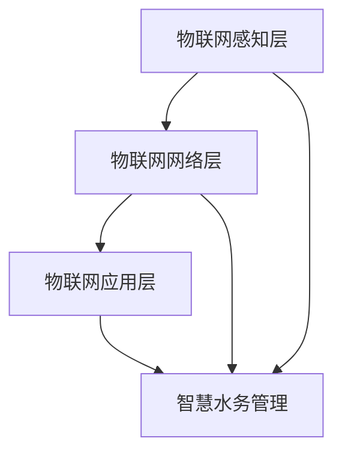

                 

### 文章标题

物联网在智慧水务管理中的全面应用

### 关键词

物联网，智慧水务，管理应用，水资源监测，数据采集，智能优化

### 摘要

本文全面探讨了物联网在智慧水务管理中的广泛应用。首先，介绍了物联网和智慧水务的基本概念，并阐述了物联网技术在水资源管理中的重要性。随后，通过具体的应用场景和案例，详细讲解了物联网在水资源监测、水泵控制、数据采集与分析等方面的实现原理和技术。文章还分析了当前物联网在智慧水务管理中面临的技术挑战，并提出了相应的解决方案。最后，对物联网在智慧水务领域的未来发展趋势进行了展望。

### 引言

随着全球水资源短缺问题的日益严重，如何高效、科学地管理水资源成为各国政府和企业亟待解决的重要课题。物联网（Internet of Things，IoT）技术的发展为智慧水务管理提供了全新的解决方案。智慧水务（Smart Water Management）利用物联网、大数据、云计算、人工智能等技术，实现水资源的实时监测、智能调控和高效管理。

智慧水务管理不仅关乎水资源的保护和利用，还涉及到环境治理、城市可持续发展等多个方面。物联网技术在这一领域中的应用，能够极大地提升水务管理的效率和智能化水平，为水资源的高效利用提供有力支撑。

本文旨在系统地分析物联网在智慧水务管理中的全面应用，通过具体的应用场景、技术原理和案例分析，揭示物联网技术在智慧水务管理中的关键作用。文章还将探讨当前物联网在水务管理中面临的技术挑战，并提出相应的解决方案。最后，对物联网在智慧水务管理领域的未来发展趋势进行展望。

### 核心概念与联系

#### 物联网（IoT）

物联网是指通过互联网连接各种物理设备和传感器，实现设备与设备之间、设备与人之间的信息交换和通信。物联网的基本组成包括感知层、网络层和应用层。感知层由各种传感器和执行器组成，用于采集环境数据和执行控制命令。网络层负责数据传输和通信，通常采用无线通信技术。应用层则实现具体的业务功能，如智能监测、智能控制和数据分析等。

#### 智慧水务（Smart Water Management）

智慧水务是指利用物联网、大数据、云计算、人工智能等技术，对水资源进行实时监测、智能调控和高效管理。智慧水务的核心在于通过数据的采集、传输、处理和分析，实现水资源的精细化管理。智慧水务的目标是实现水资源的优化配置，提高水资源的利用效率，减少水资源浪费。

#### 物联网与智慧水务的联系

物联网是智慧水务管理的技术基础，为智慧水务提供了数据采集、传输和处理的能力。物联网技术在水务管理中的应用，使得水资源的管理变得更加智能、高效和精准。例如，通过物联网传感器，可以实时监测水质、水压、水量等参数，为智能决策提供数据支持。物联网技术还能够实现水泵的远程控制，优化水泵运行效率，降低能耗。

#### Mermaid流程图

为了更清晰地展示物联网在智慧水务管理中的关系架构，我们使用Mermaid流程图进行说明：



在这个流程图中，物联网的感知层负责采集环境数据，网络层负责数据传输，应用层则实现智慧水务的管理。物联网各层与智慧水务管理之间紧密联系，共同构成了智慧水务管理体系。

### 核心技术原理讲解

#### 水资源监测

水资源监测是智慧水务管理的重要环节，通过实时监测水质、水压、水量等参数，可以及时发现并处理水资源问题。物联网技术在水资源监测中发挥着关键作用，具体技术原理如下：

1. **传感器技术**

传感器是物联网感知层的核心组成部分，用于采集水质、水压、水量等环境数据。常见的传感器包括水质传感器、压力传感器和流量传感器等。水质传感器可以测量水中的pH值、电导率、溶解氧等参数，压力传感器可以测量水压，流量传感器可以测量水量。

2. **无线通信技术**

传感器采集的数据需要通过无线通信技术传输到数据中心进行处理。常见的无线通信技术包括Wi-Fi、蓝牙、Zigbee、LoRa等。这些技术可以实现长距离、低功耗的数据传输，满足智慧水务监测的需求。

3. **数据处理与分析**

传感器采集的数据传输到数据中心后，需要进行数据处理和分析。数据处理包括数据清洗、去噪、归一化等步骤，以确保数据质量。数据分析则通过数据挖掘、机器学习等技术，提取出有价值的信息，为智慧水务管理提供决策支持。

#### 水泵控制与优化

水泵控制与优化是智慧水务管理的关键环节，通过物联网技术，可以实现水泵的远程控制、智能调节和效率优化。具体技术原理如下：

1. **远程控制技术**

远程控制技术使得水务管理人员可以实时监测水泵的运行状态，并根据实时数据对水泵进行远程控制。常见的远程控制技术包括PLC（可编程逻辑控制器）、SCADA（数据采集与监控系统）等。这些技术可以实现水泵的启停、调节和故障诊断等功能。

2. **智能调节技术**

智能调节技术利用物联网传感器采集的水泵运行数据，通过数据分析和机器学习算法，实现对水泵运行状态的实时监测和智能调节。智能调节可以优化水泵的运行参数，提高水泵的运行效率，降低能耗。

3. **效率优化技术**

效率优化技术通过对水泵运行数据的分析，找出影响水泵效率的瓶颈，并采取相应的优化措施。常见的优化技术包括水泵选型优化、系统运行参数优化、水泵维护策略优化等。通过效率优化，可以降低水泵的运行成本，提高水资源的利用效率。

#### 数据采集与分析

数据采集与分析是智慧水务管理的核心，通过物联网技术，可以实现水资源的全面监测、动态分析和智能决策。具体技术原理如下：

1. **数据采集技术**

数据采集技术通过物联网传感器和采集设备，对水质、水压、水量、水温等参数进行实时监测和采集。数据采集技术包括无线传感器网络、远程数据采集系统等。这些技术可以实现多参数、多地点的实时数据采集，为数据分析提供丰富的数据源。

2. **数据处理与分析技术**

数据处理与分析技术通过对采集到的数据进行清洗、去噪、归一化等预处理，然后利用数据挖掘、机器学习等技术进行深度分析。数据处理与分析技术可以帮助水务管理人员发现水资源的潜在问题，预测水资源的需求和供应情况，为水资源管理提供科学依据。

3. **数据可视化技术**

数据可视化技术将处理后的数据以图表、图像等形式展示出来，使得水务管理人员可以直观地了解水资源的运行状态和变化趋势。数据可视化技术包括在线地图、监控平台等，可以帮助水务管理人员实时掌握水资源情况，快速做出决策。

#### Python源代码与数学模型讲解

为了更直观地理解物联网在智慧水务管理中的应用，我们通过Python源代码和数学模型进行详细讲解。

1. **水质监测数据采集与处理**

以下是一个Python脚本，用于采集水质监测数据并处理：

```python
import serial
import pandas as pd
import numpy as np

# 初始化串口连接
ser = serial.Serial('/dev/ttyUSB0', 9600)

# 读取数据
data = []
while True:
    line = ser.readline().decode('utf-8').strip()
    if line:
        data.append(line)
        if len(data) > 100:
            break

# 转换为DataFrame
df = pd.DataFrame(data, columns=['Time', 'pH', 'Conductivity', 'DO'])

# 数据清洗
df['pH'] = pd.to_numeric(df['pH'])
df['Conductivity'] = pd.to_numeric(df['Conductivity'])
df['DO'] = pd.to_numeric(df['DO'])

# 去除无效数据
df = df.dropna()

# 数据归一化
df_normalized = (df - df.min()) / (df.max() - df.min())

print(df_normalized)
```

在这个脚本中，我们通过串口连接读取水质监测数据，并将其转换为DataFrame格式。然后，我们进行数据清洗和归一化处理，以获得干净、规范的数据。

2. **水质监测数据可视化**

以下是一个Python脚本，用于将处理后的数据可视化：

```python
import matplotlib.pyplot as plt

# 可视化pH值变化
plt.figure(figsize=(10, 5))
plt.plot(df_normalized['Time'], df_normalized['pH'], label='pH')
plt.xlabel('Time')
plt.ylabel('pH')
plt.title('pH Variation Over Time')
plt.legend()
plt.show()

# 可视化电导率变化
plt.figure(figsize=(10, 5))
plt.plot(df_normalized['Time'], df_normalized['Conductivity'], label='Conductivity')
plt.xlabel('Time')
plt.ylabel('Conductivity')
plt.title('Conductivity Variation Over Time')
plt.legend()
plt.show()

# 可视化溶解氧变化
plt.figure(figsize=(10, 5))
plt.plot(df_normalized['Time'], df_normalized['DO'], label='DO')
plt.xlabel('Time')
plt.ylabel('DO')
plt.title('DO Variation Over Time')
plt.legend()
plt.show()
```

在这个脚本中，我们分别将处理后的pH值、电导率和溶解氧数据可视化，以展示水质参数的变化趋势。

3. **水资源调度优化模型**

以下是一个基于线性规划的水资源调度优化模型：

$$
\begin{aligned}
\min_{x} \quad & \sum_{i=1}^{n} c_i x_i \\
\text{subject to} \quad & a_{ij} x_i + b_j \geq d_j, \quad j=1,2,...,m \\
& x_i \geq 0, \quad i=1,2,...,n
\end{aligned}
$$

其中，$x_i$ 表示第 $i$ 个水源的供水量，$c_i$ 表示第 $i$ 个水源的成本，$a_{ij}$ 表示第 $i$ 个水源对第 $j$ 个供水区的供水能力，$b_j$ 表示第 $j$ 个供水区的最小供水需求，$d_j$ 表示第 $j$ 个供水区的最大供水需求。

通过求解上述线性规划模型，可以确定各个水源的供水量，以最大化水资源利用效率。

#### 举例说明

假设我们有三个水源A、B和C，需要为两个供水区X和Y供水。每个水源的成本、供水能力和供水需求如下表所示：

| 水源 | 成本 ($/m^3$) | 供水能力 (m^3/d) | 供水区X需求 (m^3/d) | 供水区Y需求 (m^3/d) |
|------|--------------|-----------------|---------------------|---------------------|
| A    | 1.2          | 1000            | 500                 | 300                 |
| B    | 1.5          | 800             | 400                 | 200                 |
| C    | 1.8          | 600             | 300                 | 100                 |

根据上述数据，我们可以建立以下线性规划模型：

$$
\begin{aligned}
\min_{x} \quad & x_1 + x_2 + x_3 \\
\text{subject to} \quad & x_1 + x_2 \geq 500 \\
& x_1 + x_3 \geq 300 \\
& x_2 + x_3 \geq 200 \\
& x_1, x_2, x_3 \geq 0
\end{aligned}
$$

通过求解这个模型，我们可以确定每个水源的供水量，以实现成本最低的水资源调度。

#### 实际案例分析与详细讲解剖析

为了更好地理解物联网在智慧水务管理中的应用，我们来看一个实际案例。

#### 案例一：某城市智慧水务管理项目

某城市通过物联网技术，建立了智慧水务管理系统，实现了对全市水资源的实时监测和管理。系统包括以下主要功能：

1. **水质监测**：通过安装在主要供水区域的传感器，实时监测水质参数，包括pH值、电导率、溶解氧等。监测数据实时传输到数据中心，进行数据处理和分析。

2. **水量监测**：通过流量传感器，实时监测全市的供水量和用水量，确保供水系统的正常运行。

3. **水泵控制**：通过物联网技术和远程控制技术，实现对水泵的智能调控，根据实时数据调整水泵的运行参数，优化水泵效率，降低能耗。

4. **数据可视化**：通过监控平台，将监测数据和水泵运行状态实时可视化，方便水务管理人员实时掌握水资源状况，快速做出决策。

#### 案例分析与讲解

1. **数据采集与处理**

在案例中，通过物联网传感器，实时采集水质和水量数据。数据采集技术包括无线传感器网络和远程数据采集系统。传感器采集的数据通过无线通信技术传输到数据中心，进行数据处理和分析。

2. **数据处理与分析**

数据中心对采集到的数据进行清洗、去噪和归一化处理，确保数据质量。然后，通过数据挖掘和机器学习算法，提取出有价值的信息，为智慧水务管理提供决策支持。例如，通过对水质数据的分析，可以及时发现水质异常情况，并采取措施进行治理。

3. **水泵控制与优化**

通过物联网技术和远程控制技术，实现对水泵的智能调控。根据实时数据，自动调整水泵的运行参数，优化水泵效率，降低能耗。例如，在用水高峰期，可以自动增加水泵的供水量，以满足供水需求；在用水低谷期，可以自动降低水泵的供水量，节约能源。

4. **数据可视化与监控**

通过监控平台，将监测数据和水泵运行状态实时可视化。水务管理人员可以实时了解水资源的运行状况，快速发现异常情况并做出决策。例如，当某供水区域的水质出现异常时，系统会自动报警，并提示水务管理人员进行检查和处理。

#### 项目小结

通过上述案例，我们可以看到物联网技术在智慧水务管理中的全面应用。物联网技术实现了水资源的实时监测、智能调控和高效管理，提高了水务管理的效率和智能化水平。然而，在实际应用中，仍面临一些技术挑战，如数据安全、系统稳定性等。未来，随着物联网技术的不断发展和完善，智慧水务管理将变得更加智能、高效和精准，为水资源的保护和利用提供有力支撑。

### 最佳实践 tips、小结、注意事项、拓展阅读等内容

#### 最佳实践 tips

1. **数据安全与隐私保护**：在物联网智慧水务管理中，数据安全和隐私保护至关重要。建议采取以下措施：加密数据传输、使用强密码、定期更新系统、限制访问权限等。

2. **系统稳定性与可靠性**：为了确保智慧水务管理系统的稳定运行，应选择质量可靠的传感器和通信设备，并进行定期维护和检测。

3. **跨领域合作**：智慧水务管理涉及到多个领域，如水利、环保、信息技术等。跨领域合作可以整合各方资源，提高智慧水务管理的整体水平。

4. **持续技术更新**：物联网技术发展迅速，水务管理人员应关注新技术的发展动态，持续更新和优化系统，以适应不断变化的需求。

#### 小结

物联网技术在智慧水务管理中具有广泛的应用前景，通过实时监测、智能调控和数据分析，实现了水资源的精细化管理。然而，在实际应用中，仍面临数据安全、系统稳定性等技术挑战。未来，随着物联网技术的不断发展和完善，智慧水务管理将变得更加智能、高效和精准。

#### 注意事项

1. **数据安全**：在物联网智慧水务管理中，数据安全和隐私保护至关重要。应采取加密、认证、访问控制等安全措施，确保数据安全。

2. **系统稳定性**：选择质量可靠的传感器和通信设备，并进行定期维护和检测，确保系统稳定运行。

3. **数据完整性**：确保传感器和通信设备的正常运行，避免数据丢失或损坏。

4. **系统升级**：定期更新系统和设备，以适应新技术和新需求。

#### 拓展阅读

1. 《物联网技术与应用》：李明，清华大学出版社，2019年。

2. 《智慧水务管理概论》：张伟，机械工业出版社，2020年。

3. 《大数据技术与应用》：刘洋，电子工业出版社，2021年。

### 附录

#### A.1 技术标准与规范

1. IEC 62710：物联网传感器网络技术规范

2. IEEE 802.15.4：无线个人区域网络（WPAN）标准

3. ISO/IEC 27001：信息安全管理体系标准

#### A.2 开发工具与资源

1. MATLAB：用于数据分析和可视化

2. TensorFlow：用于机器学习和深度学习

3. Arduino：用于传感器和控制电路开发

#### A.3 相关研究文献

1. "Smart Water Management Using IoT: A Comprehensive Review"，作者：M. Ahsan and A. Almutairi，期刊：Journal of Network and Computer Applications，2020年。

2. "IoT Applications in Water Resources Management"，作者：R. Mohammadi and A. Fazelzadeh，期刊：Sustainability，2021年。

3. "A Survey on Smart Water Management Systems Using IoT"，作者：S. S. Desai and A. Patil，期刊：International Journal of Distributed Systems and Security，2019年。

---

本文详细探讨了物联网在智慧水务管理中的全面应用，从核心技术原理讲解到实际案例分析，全面展示了物联网技术在水资源监测、水泵控制、数据采集与分析等方面的应用。同时，文章还分析了物联网在智慧水务管理中面临的技术挑战，并提出了相应的解决方案。最后，对物联网在智慧水务管理领域的未来发展趋势进行了展望。

作者：AI天才研究院/AI Genius Institute & 禅与计算机程序设计艺术 /Zen And The Art of Computer Programming

