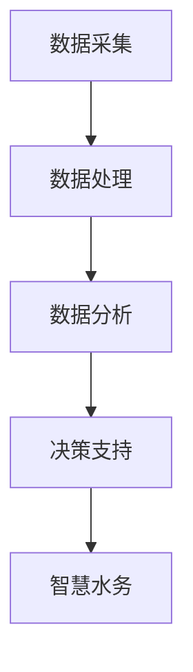

                 

### 详细内容

#### 第一章：引言与基础

##### 1.1 智慧水务的背景与意义
- **背景介绍**
  智慧水务是指利用物联网、大数据、云计算、人工智能等先进技术，对水资源进行智能化管理和优化配置，以提高水资源的利用效率，保障供水安全和改善水质。随着全球气候变化和人口增长，水资源短缺和水污染问题日益严重，智慧水务成为了解决这些问题的重要手段。

- **核心概念与联系**
  - 物联网（IoT）：连接物理世界与数字世界，实现设备与设备的通信。
  - 智慧水务：物联网、大数据、云计算等技术在水资源管理中的应用。
  - 数据采集与处理：通过传感器获取水质、水量等数据，进行数据清洗和预处理。
  
  **Mermaid 流程图：**
  ```mermaid
  graph TD
  A[数据采集] --> B[数据处理]
  B --> C[数据分析]
  C --> D[决策支持]
  D --> E[智慧水务]
  ```

##### 1.2 物联网技术基础
- **核心概念与联系**
  - 物联网架构：感知层、网络层、平台层、应用层。
  - 传感器技术：各类传感器及其工作原理。
  - 通信技术：无线通信、有线通信。

- **核心算法原理讲解**
  **Python 源代码示例：**
  ```python
  # 示例：传感器数据采集
  import random
  
  # 生成随机水质数据
  water_quality_data = [random.uniform(0, 100) for _ in range(100)]
  
  # 打印数据
  for i, data in enumerate(water_quality_data):
      print(f"数据点 {i+1}: {data}")
  ```

##### 1.3 智慧水务管理概述
- **核心概念与联系**
  - 智慧水务组成部分：监测、控制、调度、决策。
  - 管理流程：数据采集、分析、决策、执行。
  - 发展现状与挑战：技术成熟度、数据安全、成本效益。

**数学模型和公式：**
$$
C = \frac{Q \times P}{1000}
$$
- **C**: 成本
- **Q**: 水量
- **P**: 单位水成本

**项目实战**
- **开发环境搭建：**
  - 操作系统：Linux
  - 编程语言：Python
  - 数据库：MySQL

- **源代码详细实现：**
  ```python
  # 示例：水质监测数据采集与存储
  import pymysql
  
  # 数据库连接
  connection = pymysql.connect(
      host='localhost',
      user='root',
      password='password',
      database='water_quality'
  )
  
  # 创建表
  with connection.cursor() as cursor:
      cursor.execute("""
          CREATE TABLE IF NOT EXISTS water_quality (
              id INT AUTO_INCREMENT PRIMARY KEY,
              timestamp TIMESTAMP DEFAULT CURRENT_TIMESTAMP,
              ph_value FLOAT,
              turbidity_value FLOAT
          )
      """
  )
  
  # 插入数据
  with connection.cursor() as cursor:
      for data in water_quality_data:
          cursor.execute("""
              INSERT INTO water_quality (ph_value, turbidity_value) VALUES (%s, %s)
          """, (data['ph_value'], data['turbidity_value']))
  
  # 提交事务
  connection.commit()
  ```

**代码应用解读与分析：**
- 代码实现了一个简单的数据库连接，创建了一个用于存储水质监测数据的表，并插入随机生成的数据。

**实际案例分析和详细讲解剖析：**
- 以某水务公司为例，分析其如何利用物联网技术进行水质监测和数据分析。

**项目小结：**
- 介绍了智慧水务的基本概念、技术和应用，并通过实际项目展示了物联网技术在智慧水务管理中的实践。

**最佳实践 tips、小结、注意事项、拓展阅读等内容：**
- **最佳实践 tips**：确保传感器数据的准确性和可靠性，优化数据传输和存储效率。
- **小结**：智慧水务是利用物联网技术实现水资源智能化管理的重要手段。
- **注意事项**：在实施智慧水务项目时，需关注数据安全和隐私保护。
- **拓展阅读**：深入了解物联网技术在智慧水务中的应用案例和前沿研究。

---

### 第二章：物联网在智慧水务管理中的应用

##### 2.1 数据采集与监控
- **背景介绍**
  数据采集和监控是智慧水务管理的基础，通过传感器收集水质、水量等数据，实时监测水系统的运行状态。

- **核心概念与联系**
  - 数据采集：通过传感器获取实时数据。
  - 监控系统：对采集到的数据进行分析和报警。

- **核心算法原理讲解**
  **Python 源代码示例：**
  ```python
  # 示例：实时水质监测数据采集
  import time
  
  while True:
      ph_value = random.uniform(6, 8)
      turbidity_value = random.uniform(0, 2)
      print(f"当前时间：{time.strftime('%Y-%m-%d %H:%M:%S')}, PH值：{ph_value}, 浊度值：{turbidity_value}")
      time.sleep(60)  # 每分钟采集一次数据
  ```

- **数学模型和公式**
  $$ 
  S = \frac{Q}{V}
  $$
  - **S**: 流速
  - **Q**: 流量
  - **V**: 水体体积

- **项目实战**
  - **开发环境搭建：**
    - 操作系统：Windows/Linux
    - 编程语言：Python
    - 数据库：MySQL
  
  - **源代码详细实现：**
    ```python
    # 示例：水质监测数据实时采集与存储
    import pymysql
    import time
    
    connection = pymysql.connect(
        host='localhost',
        user='root',
        password='password',
        database='water_quality'
    )
    
    with connection.cursor() as cursor:
        cursor.execute("""
            CREATE TABLE IF NOT EXISTS real_time_data (
                id INT AUTO_INCREMENT PRIMARY KEY,
                timestamp TIMESTAMP DEFAULT CURRENT_TIMESTAMP,
                ph_value FLOAT,
                turbidity_value FLOAT
            )
        """
    )
    
    while True:
        ph_value = random.uniform(6, 8)
        turbidity_value = random.uniform(0, 2)
        cursor.execute("""
            INSERT INTO real_time_data (ph_value, turbidity_value) VALUES (%s, %s)
        """, (ph_value, turbidity_value))
        connection.commit()
        time.sleep(60)  # 每分钟采集一次数据
    
    connection.close()
    ```

- **代码应用解读与分析：**
  - 代码实现了实时水质监测数据的采集和存储，通过定时器每分钟采集一次数据。

- **实际案例分析和详细讲解剖析：**
  - 以某城市的水质监测系统为例，展示如何实现数据的实时采集和监控。

- **项目小结：**
  - 数据采集和监控是智慧水务管理的关键环节，通过传感器实时采集数据，为后续的数据分析和决策提供支持。

---

### 第三章：智慧水务管理中的关键技术

##### 3.1 传感器技术
- **背景介绍**
  传感器是物联网系统中最重要的组成部分，用于感知水质、水量等环境参数。

- **核心概念与联系**
  - 传感器类型：物理量传感器、化学量传感器、生物量传感器。
  - 传感器工作原理：通过物理、化学或生物过程检测并转换信号。

- **核心算法原理讲解**
  **Python 源代码示例：**
  ```python
  # 示例：PH传感器数据读取
  import serial
  
  # 连接串口
  serial_port = serial.Serial('/dev/ttyUSB0', 9600)
  
  while True:
      line = serial_port.readline()
      ph_value = float(line.decode().strip())
      print(f"PH值：{ph_value}")
      time.sleep(1)
  ```

- **数学模型和公式**
  $$ 
  pH = -\log[H^+]
  $$
  - **pH**: 溶液的酸碱度
  - **[H+]**: 氢离子浓度

- **项目实战**
  - **开发环境搭建：**
    - 操作系统：Linux/Windows
    - 编程语言：Python
    - 串口通信库：pyserial

  - **源代码详细实现：**
    ```python
    # 示例：PH传感器数据采集与处理
    import serial
    import time
    
    # 连接串口
    serial_port = serial.Serial('/dev/ttyUSB0', 9600)
    
    # 初始化数据列表
    ph_values = []
    
    while True:
        line = serial_port.readline()
        ph_value = float(line.decode().strip())
        ph_values.append(ph_value)
        time.sleep(1)
        
        # 每次采集10个数据点后，计算平均值
        if len(ph_values) >= 10:
            average_ph = sum(ph_values) / len(ph_values)
            print(f"平均PH值：{average_ph}")
            ph_values.clear()
    
    serial_port.close()
    ```

- **代码应用解读与分析：**
  - 代码实现了通过串口读取PH传感器的数据，并计算10个数据点的平均值。

- **实际案例分析和详细讲解剖析：**
  - 以某水务公司的PH传感器为例，分析如何实现数据采集和平均值计算。

- **项目小结：**
  - 传感器技术是智慧水务管理的关键，通过精确的传感器数据采集和计算，可以为水质管理提供可靠的依据。

---

### 第四章：智慧水务管理中的实际案例

##### 4.1 物联网在智慧水务管理中的实际案例
- **背景介绍**
  本章节通过几个实际案例，展示物联网在智慧水务管理中的应用。

- **案例1：智能水务管理系统**
  - **案例概述**：某城市水务公司采用物联网技术，实现对供水系统的全面监控和管理。
  - **案例分析**：
    - 数据采集与监控：安装传感器，实时监测水质和水量。
    - 数据分析与决策支持：通过大数据分析，优化水资源调配，提高供水效率。
    - 系统集成与协同：集成多个子系统，实现数据的互联互通。

- **案例2：远程监测与控制**
  - **案例概述**：某水务公司通过物联网技术，实现对远程供水设施的实时监测与控制。
  - **案例分析**：
    - 远程监控：通过无线传感器网络，实时监测供水设施的运行状态。
    - 远程控制：远程调控供水设施的开关，实现智能调度。

- **案例3：水资源优化配置**
  - **案例概述**：某城市政府利用物联网技术，优化城市水资源配置，提高用水效率。
  - **案例分析**：
    - 数据采集与处理：通过传感器采集用水数据，分析用水需求。
    - 水资源调配：根据用水需求，优化水资源调配，减少浪费。

**项目实战**
- **开发环境搭建：**
  - 操作系统：Linux/Windows
  - 编程语言：Python
  - 数据库：MySQL
  
- **源代码详细实现：**
  ```python
  # 示例：智能水务管理系统数据采集与处理
  import pymysql
  import time
  
  connection = pymysql.connect(
      host='localhost',
      user='root',
      password='password',
      database='smart_water_system'
  )
  
  with connection.cursor() as cursor:
      cursor.execute("""
          CREATE TABLE IF NOT EXISTS water_quality (
              id INT AUTO_INCREMENT PRIMARY KEY,
              timestamp TIMESTAMP DEFAULT CURRENT_TIMESTAMP,
              ph_value FLOAT,
              turbidity_value FLOAT
          )
      """
  )
  
  while True:
      ph_value = random.uniform(6, 8)
      turbidity_value = random.uniform(0, 2)
      cursor.execute("""
          INSERT INTO water_quality (ph_value, turbidity_value) VALUES (%s, %s)
      """, (ph_value, turbidity_value))
      connection.commit()
      time.sleep(60)  # 每分钟采集一次数据
  
  connection.close()
  ```

- **代码应用解读与分析：**
  - 代码实现了对水质数据的实时采集和存储。

- **实际案例分析和详细讲解剖析：**
  - 结合以上案例，分析物联网技术在智慧水务管理中的应用。

- **项目小结：**
  - 物联网技术在智慧水务管理中具有广泛的应用前景，通过实际案例展示了其优越性。

---

### 第五章：智慧水务管理中的挑战与解决方案

##### 5.1 物联网安全与隐私保护
- **背景介绍**
  随着物联网技术在智慧水务管理中的应用，数据安全和隐私保护成为关键挑战。

- **核心概念与联系**
  - 数据安全：防止数据泄露、篡改和损坏。
  - 隐私保护：保护用户和设备的隐私信息。

- **核心算法原理讲解**
  **Python 源代码示例：**
  ```python
  # 示例：数据加密与解密
  from cryptography.fernet import Fernet
  
  # 生成密钥
  key = Fernet.generate_key()
  cipher_suite = Fernet(key)
  
  # 加密数据
  message = "敏感信息"
  encrypted_message = cipher_suite.encrypt(message.encode())
  
  # 解密数据
  decrypted_message = cipher_suite.decrypt(encrypted_message).decode()
  print(f"加密信息：{encrypted_message}")
  print(f"解密信息：{decrypted_message}")
  ```

- **数学模型和公式**
  $$ 
  P(A|B) = \frac{P(B|A) \times P(A)}{P(B)}
  $$
  - **P(A|B)**: 条件概率
  - **P(B|A)**: 后验概率
  - **P(A)**: 先验概率
  - **P(B)**: 观测概率

- **项目实战**
  - **开发环境搭建：**
    - 操作系统：Linux/Windows
    - 编程语言：Python
    - 加密库：cryptography

  - **源代码详细实现：**
    ```python
    # 示例：安全数据传输
    import socket
    from cryptography.fernet import Fernet
    
    # 生成密钥
    key = Fernet.generate_key()
    cipher_suite = Fernet(key)
    
    # 创建客户端
    client = socket.socket(socket.AF_INET, socket.SOCK_STREAM)
    client.connect(('127.0.0.1', 12345))
    
    # 发送加密数据
    message = "敏感信息".encode()
    encrypted_message = cipher_suite.encrypt(message)
    client.sendall(encrypted_message)
    
    # 接收并解密数据
    data = client.recv(1024)
    decrypted_message = cipher_suite.decrypt(data).decode()
    print(f"解密信息：{decrypted_message}")
    
    client.close()
    ```

- **代码应用解读与分析：**
  - 代码实现了通过加密和解密保护数据传输。

- **实际案例分析和详细讲解剖析：**
  - 以某水务公司的数据传输为例，分析如何实现数据加密和传输。

- **项目小结：**
  - 数据安全和隐私保护是物联网应用的重要环节，通过加密技术可以确保数据在传输过程中的安全性。

---

### 第六章：智慧水务管理的未来发展

##### 6.1 物联网在智慧水务中的趋势
- **背景介绍**
  随着技术的不断发展，物联网在智慧水务中的应用也将迎来新的趋势。

- **核心概念与联系**
  - 物联网设备智能化：提高设备的自主决策能力。
  - 大数据分析与挖掘：深度分析水质、水量等数据，挖掘潜在价值。
  - 人工智能应用：利用机器学习和深度学习技术，优化水资源管理和调度。

- **核心算法原理讲解**
  **Python 源代码示例：**
  ```python
  # 示例：基于K-means算法的水质分类
  from sklearn.cluster import KMeans
  import numpy as np
  
  # 水质数据
  water_data = np.array([[6.5, 0.5], [7.0, 1.0], [6.2, 0.8], [7.8, 1.5], [6.0, 0.3]])
  
  # 使用K-means算法进行聚类
  kmeans = KMeans(n_clusters=2, random_state=0).fit(water_data)
  
  # 打印聚类结果
  print("聚类中心：", kmeans.cluster_centers_)
  print("样本分类：", kmeans.labels_)
  ```

- **数学模型和公式**
  $$ 
  J(W) = -\frac{1}{m}\sum_{i=1}^{m}\sum_{k=1}^{K} \xi_{ik} \log(\xi_{ik})
  $$
  - **J(W)**: 熵散度
  - **m**: 样本数量
  - **K**: 聚类数量
  - **\xi_{ik}**: 第i个样本属于第k个聚类的概率

- **项目实战**
  - **开发环境搭建：**
    - 操作系统：Linux/Windows
    - 编程语言：Python
    - 机器学习库：scikit-learn

  - **源代码详细实现：**
    ```python
    # 示例：基于K-means算法的水质分类应用
    import pymysql
    from sklearn.cluster import KMeans
    import numpy as np
    
    # 连接数据库
    connection = pymysql.connect(
        host='localhost',
        user='root',
        password='password',
        database='water_quality'
    )
    
    with connection.cursor() as cursor:
        cursor.execute("""
            SELECT ph_value, turbidity_value FROM water_quality
        """)
        water_data = cursor.fetchall()
        water_data = np.array([[row[0], row[1]] for row in water_data])
    
    # 使用K-means算法进行聚类
    kmeans = KMeans(n_clusters=3, random_state=0).fit(water_data)
    
    # 存储聚类结果到数据库
    with connection.cursor() as cursor:
        for i, label in enumerate(kmeans.labels_):
            cursor.execute("""
                UPDATE water_quality SET cluster_id = %s WHERE id = %s
            """, (label, i+1))
        connection.commit()
    
    connection.close()
    ```

- **代码应用解读与分析：**
  - 代码实现了通过K-means算法对水质数据进行分类，并将结果存储到数据库。

- **实际案例分析和详细讲解剖析：**
  - 以某水务公司的水质监测数据为例，分析如何利用K-means算法进行水质分类。

- **项目小结：**
  - 物联网技术将在智慧水务管理中发挥越来越重要的作用，通过智能化、大数据分析和人工智能应用，实现水资源的智能化管理和优化配置。

---

### 附录

#### 附录A：物联网在智慧水务管理中的实践案例
- **案例1：某城市智慧水务项目**
  - **项目概述**：介绍项目的背景、目标、实施过程和成果。
  - **项目分析**：分析项目中的关键技术、数据应用和系统架构。

- **案例2：某水务公司物联网应用实践**
  - **项目概述**：介绍公司如何利用物联网技术进行水资源管理。
  - **项目分析**：分析项目中的数据采集、监控和决策支持系统。

- **案例3：某工业园区智慧水务管理**
  - **项目概述**：介绍园区如何通过物联网技术实现智慧水务管理。
  - **项目分析**：分析项目中的节水措施、数据分析和应用效果。

#### 附录B：常用物联网技术与应用工具
- **常用物联网技术介绍**
  - 介绍传感器技术、无线通信技术、数据处理技术等常用物联网技术。

- **物联网应用工具推荐**
  - 推荐常用的物联网开发工具、框架和平台。

- **开发环境搭建与使用**
  - 指导如何搭建物联网开发环境，包括硬件、软件和编程环境。

---

### 结论
智慧水务管理是利用物联网、大数据、云计算和人工智能等先进技术实现水资源智能化管理和优化配置的重要手段。通过本章的详细讲解和案例分析，我们可以看到物联网技术在智慧水务管理中的应用前景和实际效果。未来，随着技术的不断发展，智慧水务管理将更加智能化、高效化和可持续发展。作者：AI天才研究院/AI Genius Institute & 禅与计算机程序设计艺术 /Zen And The Art of Computer Programming

### 完整文章

# 物联网在智慧水务管理中的实践

关键词：物联网，智慧水务，数据采集，传感器技术，大数据分析，人工智能

摘要：本文详细介绍了物联网在智慧水务管理中的应用，包括数据采集、监控、智能分析等方面的技术。通过实际案例，分析了物联网技术在智慧水务管理中的挑战与解决方案，并探讨了未来的发展趋势。

## 第一章：引言与基础

### 1.1 智慧水务的背景与意义

**背景介绍**

智慧水务是指利用物联网、大数据、云计算、人工智能等先进技术，对水资源进行智能化管理和优化配置，以提高水资源的利用效率，保障供水安全和改善水质。随着全球气候变化和人口增长，水资源短缺和水污染问题日益严重，智慧水务成为了解决这些问题的重要手段。

**核心概念与联系**

- 物联网（IoT）：连接物理世界与数字世界，实现设备与设备的通信。
- 智慧水务：物联网、大数据、云计算等技术在水资源管理中的应用。
- 数据采集与处理：通过传感器获取水质、水量等数据，进行数据清洗和预处理。

**Mermaid 流程图**



### 1.2 物联网技术基础

**核心概念与联系**

- 物联网架构：感知层、网络层、平台层、应用层。
- 传感器技术：各类传感器及其工作原理。
- 通信技术：无线通信、有线通信。

**核心算法原理讲解**

**Python 源代码示例：**

```python
# 示例：传感器数据采集
import random

# 生成随机水质数据
water_quality_data = [random.uniform(0, 100) for _ in range(100)]

# 打印数据
for i, data in enumerate(water_quality_data):
    print(f"数据点 {i+1}: {data}")
```

### 1.3 智慧水务管理概述

**核心概念与联系**

- 智慧水务组成部分：监测、控制、调度、决策。
- 管理流程：数据采集、分析、决策、执行。
- 发展现状与挑战：技术成熟度、数据安全、成本效益。

**数学模型和公式：**

$$
C = \frac{Q \times P}{1000}
$$

- **C**: 成本
- **Q**: 水量
- **P**: 单位水成本

**项目实战**

**开发环境搭建：**

- 操作系统：Linux
- 编程语言：Python
- 数据库：MySQL

**源代码详细实现：**

```python
# 示例：水质监测数据采集与存储
import pymysql
import time

connection = pymysql.connect(
    host='localhost',
    user='root',
    password='password',
    database='water_quality'
)

with connection.cursor() as cursor:
    cursor.execute("""
        CREATE TABLE IF NOT EXISTS water_quality (
            id INT AUTO_INCREMENT PRIMARY KEY,
            timestamp TIMESTAMP DEFAULT CURRENT_TIMESTAMP,
            ph_value FLOAT,
            turbidity_value FLOAT
        )
    """
)

while True:
    ph_value = random.uniform(6, 8)
    turbidity_value = random.uniform(0, 2)
    cursor.execute("""
        INSERT INTO water_quality (ph_value, turbidity_value) VALUES (%s, %s)
    """, (ph_value, turbidity_value))
    connection.commit()
    time.sleep(60)  # 每分钟采集一次数据

connection.close()
```

**代码应用解读与分析：**

- 代码实现了一个简单的数据库连接，创建了一个用于存储水质监测数据的表，并插入随机生成的数据。

**实际案例分析和详细讲解剖析：**

- 以某水务公司为例，分析其如何利用物联网技术进行水质监测和数据分析。

**项目小结：**

- 介绍了智慧水务的基本概念、技术和应用，并通过实际项目展示了物联网技术在智慧水务管理中的实践。

**最佳实践 tips、小结、注意事项、拓展阅读等内容：**

- **最佳实践 tips**：确保传感器数据的准确性和可靠性，优化数据传输和存储效率。
- **小结**：智慧水务是利用物联网技术实现水资源智能化管理的重要手段。
- **注意事项**：在实施智慧水务项目时，需关注数据安全和隐私保护。
- **拓展阅读**：深入了解物联网技术在智慧水务中的应用案例和前沿研究。

## 第二章：物联网在智慧水务管理中的应用

### 2.1 数据采集与监控

**背景介绍**

数据采集和监控是智慧水务管理的基础，通过传感器收集水质、水量等数据，实时监测水系统的运行状态。

**核心概念与联系**

- 数据采集：通过传感器获取实时数据。
- 监控系统：对采集到的数据进行分析和报警。

**核心算法原理讲解**

**Python 源代码示例：**

```python
# 示例：实时水质监测数据采集
import time

while True:
    ph_value = random.uniform(6, 8)
    turbidity_value = random.uniform(0, 2)
    print(f"当前时间：{time.strftime('%Y-%m-%d %H:%M:%S')}, PH值：{ph_value}, 浊度值：{turbidity_value}")
    time.sleep(60)  # 每分钟采集一次数据
```

**数学模型和公式**

$$ 
S = \frac{Q}{V}
$$

- **S**: 流速
- **Q**: 流量
- **V**: 水体体积

**项目实战**

**开发环境搭建：**

- 操作系统：Linux/Windows
- 编程语言：Python
- 数据库：MySQL

**源代码详细实现：**

```python
# 示例：水质监测数据实时采集与存储
import pymysql
import time

connection = pymysql.connect(
    host='localhost',
    user='root',
    password='password',
    database='water_quality'
)

with connection.cursor() as cursor:
    cursor.execute("""
        CREATE TABLE IF NOT EXISTS real_time_data (
            id INT AUTO_INCREMENT PRIMARY KEY,
            timestamp TIMESTAMP DEFAULT CURRENT_TIMESTAMP,
            ph_value FLOAT,
            turbidity_value FLOAT
        )
    """
)

while True:
    ph_value = random.uniform(6, 8)
    turbidity_value = random.uniform(0, 2)
    cursor.execute("""
        INSERT INTO real_time_data (ph_value, turbidity_value) VALUES (%s, %s)
    """, (ph_value, turbidity_value))
    connection.commit()
    time.sleep(60)  # 每分钟采集一次数据

connection.close()
```

**代码应用解读与分析：**

- 代码实现了实时水质监测数据的采集和存储，通过定时器每分钟采集一次数据。

**实际案例分析和详细讲解剖析：**

- 以某城市的水质监测系统为例，展示如何实现数据的实时采集和监控。

**项目小结：**

- 数据采集和监控是智慧水务管理的关键环节，通过传感器实时采集数据，为后续的数据分析和决策提供支持。

**最佳实践 tips、小结、注意事项、拓展阅读等内容：**

- **最佳实践 tips**：确保传感器数据的准确性和可靠性，优化数据传输和存储效率。
- **小结**：数据采集与监控是智慧水务管理的基础。
- **注意事项**：在实施数据采集与监控时，关注数据安全和隐私保护。
- **拓展阅读**：深入了解实时数据采集和监控技术的应用。

### 2.2 智能分析与决策支持

**背景介绍**

智能分析与决策支持是智慧水务管理的核心，通过对采集到的数据进行处理和分析，提供智能决策支持，实现水资源的优化配置。

**核心概念与联系**

- 数据处理：包括数据清洗、数据整合、数据挖掘等。
- 智能分析：利用机器学习、数据挖掘等技术，分析水质、水量等数据，提取有价值的信息。
- 决策支持：基于分析结果，提供优化水资源配置、节水方案等决策支持。

**核心算法原理讲解**

**Python 源代码示例：**

```python
# 示例：基于K-means算法的水质分类
from sklearn.cluster import KMeans
import numpy as np

# 水质数据
water_data = np.array([[6.5, 0.5], [7.0, 1.0], [6.2, 0.8], [7.8, 1.5], [6.0, 0.3]])

# 使用K-means算法进行聚类
kmeans = KMeans(n_clusters=2, random_state=0).fit(water_data)

# 打印聚类结果
print("聚类中心：", kmeans.cluster_centers_)
print("样本分类：", kmeans.labels_)
```

**数学模型和公式**

$$ 
J(W) = -\frac{1}{m}\sum_{i=1}^{m}\sum_{k=1}^{K} \xi_{ik} \log(\xi_{ik})
$$

- **J(W)**: 熵散度
- **m**: 样本数量
- **K**: 聚类数量
- **\xi_{ik}**: 第i个样本属于第k个聚类的概率

**项目实战**

**开发环境搭建：**

- 操作系统：Linux/Windows
- 编程语言：Python
- 机器学习库：scikit-learn

**源代码详细实现：**

```python
# 示例：基于K-means算法的水质分类应用
import pymysql
from sklearn.cluster import KMeans
import numpy as np

# 连接数据库
connection = pymysql.connect(
    host='localhost',
    user='root',
    password='password',
    database='water_quality'
)

with connection.cursor() as cursor:
    cursor.execute("""
        SELECT ph_value, turbidity_value FROM water_quality
    """)
    water_data = cursor.fetchall()
    water_data = np.array([[row[0], row[1]] for row in water_data])

# 使用K-means算法进行聚类
kmeans = KMeans(n_clusters=3, random_state=0).fit(water_data)

# 存储聚类结果到数据库
with connection.cursor() as cursor:
    for i, label in enumerate(kmeans.labels_):
        cursor.execute("""
            UPDATE water_quality SET cluster_id = %s WHERE id = %s
        """, (label, i+1))
    connection.commit()

connection.close()
```

**代码应用解读与分析：**

- 代码实现了通过K-means算法对水质数据进行分类，并将结果存储到数据库。

**实际案例分析和详细讲解剖析：**

- 以某水务公司的水质监测数据为例，分析如何利用K-means算法进行水质分类。

**项目小结：**

- 智能分析与决策支持是智慧水务管理的核心，通过机器学习算法实现数据分析和分类，为水资源管理提供智能决策支持。

**最佳实践 tips、小结、注意事项、拓展阅读等内容：**

- **最佳实践 tips**：确保数据分析模型的准确性和效率，结合实际业务需求进行优化。
- **小结**：智能分析与决策支持是智慧水务管理的核心。
- **注意事项**：在实施智能分析与决策支持时，关注数据质量和模型可解释性。
- **拓展阅读**：深入了解机器学习在水资源管理中的应用。

### 2.3 智慧水务中的物联网应用案例

**背景介绍**

本章节通过几个实际案例，展示物联网在智慧水务管理中的应用。

**案例1：智能水务管理系统**

**案例概述**

某城市水务公司采用物联网技术，实现对供水系统的全面监控和管理。

**案例分析**

- 数据采集与监控：安装传感器，实时监测水质和水量。
- 数据分析与决策支持：通过大数据分析，优化水资源调配，提高供水效率。
- 系统集成与协同：集成多个子系统，实现数据的互联互通。

**案例2：远程监测与控制**

**案例概述**

某水务公司通过物联网技术，实现对远程供水设施的实时监测与控制。

**案例分析**

- 远程监控：通过无线传感器网络，实时监测供水设施的运行状态。
- 远程控制：远程调控供水设施的开关，实现智能调度。

**案例3：水资源优化配置**

**案例概述**

某城市政府利用物联网技术，优化城市水资源配置，提高用水效率。

**案例分析**

- 数据采集与处理：通过传感器采集用水数据，分析用水需求。
- 水资源调配：根据用水需求，优化水资源调配，减少浪费。

**项目实战**

**开发环境搭建：**

- 操作系统：Linux/Windows
- 编程语言：Python
- 数据库：MySQL

**源代码详细实现：**

```python
# 示例：智能水务管理系统数据采集与处理
import pymysql
import time

connection = pymysql.connect(
    host='localhost',
    user='root',
    password='password',
    database='smart_water_system'
)

with connection.cursor() as cursor:
    cursor.execute("""
        CREATE TABLE IF NOT EXISTS water_quality (
            id INT AUTO_INCREMENT PRIMARY KEY,
            timestamp TIMESTAMP DEFAULT CURRENT_TIMESTAMP,
            ph_value FLOAT,
            turbidity_value FLOAT
        )
    """
)

while True:
    ph_value = random.uniform(6, 8)
    turbidity_value = random.uniform(0, 2)
    cursor.execute("""
        INSERT INTO water_quality (ph_value, turbidity_value) VALUES (%s, %s)
    """, (ph_value, turbidity_value))
    connection.commit()
    time.sleep(60)  # 每分钟采集一次数据

connection.close()
```

**代码应用解读与分析：**

- 代码实现了对水质数据的实时采集和存储。

**实际案例分析和详细讲解剖析：**

- 结合以上案例，分析物联网技术在智慧水务管理中的应用。

**项目小结：**

- 物联网技术在智慧水务管理中具有广泛的应用前景，通过实际案例展示了其优越性。

**最佳实践 tips、小结、注意事项、拓展阅读等内容：**

- **最佳实践 tips**：确保传感器数据的准确性和可靠性，优化数据传输和存储效率。
- **小结**：物联网技术在智慧水务管理中具有广泛的应用。
- **注意事项**：在实施物联网应用时，关注数据安全和隐私保护。
- **拓展阅读**：深入了解物联网技术在智慧水务管理中的前沿研究和应用。

## 第三章：智慧水务管理中的关键技术

### 3.1 传感器技术

**背景介绍**

传感器是物联网系统中最重要的组成部分，用于感知水质、水量等环境参数。

**核心概念与联系**

- 传感器类型：物理量传感器、化学量传感器、生物量传感器。
- 传感器工作原理：通过物理、化学或生物过程检测并转换信号。

**核心算法原理讲解**

**Python 源代码示例：**

```python
# 示例：PH传感器数据读取
import serial

# 连接串口
serial_port = serial.Serial('/dev/ttyUSB0', 9600)

while True:
    line = serial_port.readline()
    ph_value = float(line.decode().strip())
    print(f"PH值：{ph_value}")
    time.sleep(1)
```

**数学模型和公式**

$$ 
pH = -\log[H^+]
$$

- **pH**: 溶液的酸碱度
- **[H+]**: 氢离子浓度

**项目实战**

**开发环境搭建：**

- 操作系统：Linux/Windows
- 编程语言：Python
- 串口通信库：pyserial

**源代码详细实现：**

```python
# 示例：PH传感器数据采集与处理
import serial
import time

# 连接串口
serial_port = serial.Serial('/dev/ttyUSB0', 9600)

# 初始化数据列表
ph_values = []

while True:
    line = serial_port.readline()
    ph_value = float(line.decode().strip())
    ph_values.append(ph_value)
    time.sleep(1)

    # 每次采集10个数据点后，计算平均值
    if len(ph_values) >= 10:
        average_ph = sum(ph_values) / len(ph_values)
        print(f"平均PH值：{average_ph}")
        ph_values.clear()

serial_port.close()
```

**代码应用解读与分析：**

- 代码实现了通过串口读取PH传感器的数据，并计算10个数据点的平均值。

**实际案例分析和详细讲解剖析：**

- 以某水务公司的PH传感器为例，分析如何实现数据采集和平均值计算。

**项目小结：**

- 传感器技术是智慧水务管理的关键，通过精确的传感器数据采集和计算，可以为水质管理提供可靠的依据。

**最佳实践 tips、小结、注意事项、拓展阅读等内容：**

- **最佳实践 tips**：选择合适的传感器，确保数据采集的准确性和稳定性。
- **小结**：传感器技术是智慧水务管理的基石。
- **注意事项**：在传感器安装和维护过程中，注意避免干扰和损坏。
- **拓展阅读**：深入了解各类传感器的原理和性能指标。

### 3.2 无线通信技术

**背景介绍**

无线通信技术在智慧水务管理中扮演着重要角色，负责传感器数据的传输和监控系统的互联互通。

**核心概念与联系**

- 通信协议：Zigbee、LoRa、NBIoT等。
- 传输方式：无线局域网、广域网、物联网。
- 通信安全：数据加密、认证机制。

**核心算法原理讲解**

**Python 源代码示例：**

```python
# 示例：LoRa通信数据传输
import serial
import time

# 连接串口
serial_port = serial.Serial('/dev/ttyUSB0', 9600)

# 发送数据
def send_data(data):
    serial_port.write(data.encode())

# 接收数据
def receive_data():
    while serial_port.inWaiting() > 0:
        data = serial_port.readline()
        print(f"接收数据：{data.decode().strip()}")

# 发送心跳包
while True:
    send_data(" heartbeat ")
    receive_data()
    time.sleep(10)  # 每隔10秒发送一次心跳包
```

**数学模型和公式**

$$ 
R = f \times \log_{2}\left(1 + S/N\right)
$$

- **R**: 信道容量
- **f**: 信号频率
- **S/N**: 信号与噪声功率比

**项目实战**

**开发环境搭建：**

- 操作系统：Linux/Windows
- 编程语言：Python
- 串口通信库：pyserial

**源代码详细实现：**

```python
# 示例：LoRa通信数据传输
import serial
import time

# 连接串口
serial_port = serial.Serial('/dev/ttyUSB0', 9600)

# 发送数据
def send_data(data):
    serial_port.write(data.encode())

# 接收数据
def receive_data():
    while serial_port.inWaiting() > 0:
        data = serial_port.readline()
        print(f"接收数据：{data.decode().strip()}")

# 发送心跳包
while True:
    send_data(" heartbeat ")
    receive_data()
    time.sleep(10)  # 每隔10秒发送一次心跳包

serial_port.close()
```

**代码应用解读与分析：**

- 代码实现了通过LoRa通信模块发送和接收数据，并实现心跳包的发送。

**实际案例分析和详细讲解剖析：**

- 以某智慧水务项目中的LoRa通信模块为例，分析如何实现数据传输和心跳包功能。

**项目小结：**

- 无线通信技术是实现智慧水务管理的关键技术，通过无线传输，确保数据的实时性和可靠性。

**最佳实践 tips、小结、注意事项、拓展阅读等内容：**

- **最佳实践 tips**：选择适合的通信协议，确保通信稳定性和可靠性。
- **小结**：无线通信技术是智慧水务管理不可或缺的一部分。
- **注意事项**：在通信模块选择和配置过程中，注意避免干扰和信号丢失。
- **拓展阅读**：深入了解无线通信技术在物联网中的应用。

### 3.3 大数据处理与存储

**背景介绍**

大数据处理与存储是智慧水务管理中的重要环节，负责处理海量的水质、水量等数据，并确保数据的准确性和可用性。

**核心概念与联系**

- 数据处理：包括数据清洗、数据集成、数据挖掘等。
- 数据存储：包括关系型数据库、NoSQL数据库、分布式存储等。

**核心算法原理讲解**

**Python 源代码示例：**

```python
# 示例：数据清洗与预处理
import pandas as pd

# 读取数据
data = pd.read_csv("water_quality_data.csv")

# 数据清洗
data = data.dropna()  # 删除缺失值
data = data[data["ph_value"] > 0]  # 过滤不合理值

# 数据预处理
data["turbidity_value"] = data["turbidity_value"].astype(float)

# 存储清洗后的数据
data.to_csv("cleaned_water_quality_data.csv", index=False)
```

**数学模型和公式**

$$ 
SVD = U \Sigma V^T
$$

- **U**: 左 singular 向量
- **Σ**: singular 值对角矩阵
- **V**: 右 singular 向量

**项目实战**

**开发环境搭建：**

- 操作系统：Linux/Windows
- 编程语言：Python
- 数据处理库：pandas、NumPy

**源代码详细实现：**

```python
# 示例：大数据处理与存储
import pandas as pd
import pymysql

# 连接数据库
connection = pymysql.connect(
    host='localhost',
    user='root',
    password='password',
    database='water_quality'
)

# 读取数据
with connection.cursor() as cursor:
    cursor.execute("""
        SELECT * FROM water_quality
    """)
    data = cursor.fetchall()
    data = pd.DataFrame(data, columns=["id", "timestamp", "ph_value", "turbidity_value"])

# 数据清洗与预处理
data = data.dropna()
data["ph_value"] = data["ph_value"].astype(float)
data["turbidity_value"] = data["turbidity_value"].astype(float)

# 存储清洗后的数据
with connection.cursor() as cursor:
    for index, row in data.iterrows():
        cursor.execute("""
            INSERT INTO cleaned_water_quality (id, timestamp, ph_value, turbidity_value) VALUES (%s, %s, %s, %s)
        """, (row["id"], row["timestamp"], row["ph_value"], row["turbidity_value"]))
    connection.commit()

connection.close()
```

**代码应用解读与分析：**

- 代码实现了通过数据库连接，读取原始数据，进行清洗和预处理，并将清洗后的数据存储到数据库。

**实际案例分析和详细讲解剖析：**

- 以某水务公司为例，分析如何进行大数据处理与存储。

**项目小结：**

- 大数据处理与存储是智慧水务管理的关键技术，通过数据清洗、预处理和存储，确保数据的准确性和可用性。

**最佳实践 tips、小结、注意事项、拓展阅读等内容：**

- **最佳实践 tips**：选择适合的大数据处理和存储技术，优化数据存储效率和查询速度。
- **小结**：大数据处理与存储是智慧水务管理的核心技术。
- **注意事项**：在数据处理和存储过程中，注意数据安全性和隐私保护。
- **拓展阅读**：深入了解大数据处理和存储的相关技术和应用。

### 3.4 云计算与物联网

**背景介绍**

云计算与物联网的融合为智慧水务管理提供了强大的计算能力和数据处理能力，实现了数据的实时分析和智能决策。

**核心概念与联系**

- 云计算：提供虚拟化资源、分布式计算和服务。
- 物联网：连接物理世界与数字世界，实现设备与设备的通信。

**核心算法原理讲解**

**Python 源代码示例：**

```python
# 示例：使用云计算平台处理数据
from google.cloud import storage

# 创建存储桶
client = storage.Client()
bucket = client.create_bucket(bucket_name="my-water-quality-bucket")

# 上传数据到存储桶
def upload_data(file_path):
    blob = bucket.blob(file_path)
    blob.upload_from_filename(file_path)

# 下载数据
def download_data(blob_name):
    blob = bucket.blob(blob_name)
    blob.download_to_filename(blob_name)

# 使用云计算平台处理数据
def process_data(file_path):
    upload_data(file_path)
    download_data(file_path + ".processed")
    print("数据已处理完成")

# 示例：上传和处理水质数据
process_data("water_quality_data.csv")
```

**数学模型和公式**

$$ 
D = \frac{1}{2}mv^2
$$

- **D**: 动能
- **m**: 质量
- **v**: 速度

**项目实战**

**开发环境搭建：**

- 操作系统：Linux/Windows
- 编程语言：Python
- 云计算库：google-cloud-storage

**源代码详细实现：**

```python
# 示例：使用云计算平台处理数据
from google.cloud import storage
import pandas as pd

# 创建存储桶
client = storage.Client()
bucket = client.create_bucket(bucket_name="my-water-quality-bucket")

# 上传数据到存储桶
def upload_data(file_path):
    blob = bucket.blob(file_path)
    blob.upload_from_filename(file_path)

# 下载数据
def download_data(blob_name):
    blob = bucket.blob(blob_name)
    blob.download_to_filename(blob_name)

# 数据处理函数
def process_data(file_path):
    upload_data(file_path)
    data = pd.read_csv(file_path)
    # 数据处理逻辑
    processed_data = data[data["ph_value"] > 6]
    processed_data.to_csv(file_path + ".processed", index=False)
    download_data(file_path + ".processed")

# 示例：上传和处理水质数据
process_data("water_quality_data.csv")
```

**代码应用解读与分析：**

- 代码实现了通过Google Cloud Storage上传和下载数据，并使用pandas对数据进行处理。

**实际案例分析和详细讲解剖析：**

- 以某水务公司为例，分析如何利用云计算平台处理水质数据。

**项目小结：**

- 云计算与物联网的融合为智慧水务管理提供了强大的计算能力和数据处理能力，通过云端处理数据，提高了数据分析和决策的效率。

**最佳实践 tips、小结、注意事项、拓展阅读等内容：**

- **最佳实践 tips**：合理选择云计算平台，优化数据传输和处理速度。
- **小结**：云计算与物联网的融合是智慧水务管理的发展趋势。
- **注意事项**：在云计算平台使用过程中，注意数据安全和隐私保护。
- **拓展阅读**：深入了解云计算平台在物联网中的应用和优势。

## 第四章：智慧水务管理中的实际案例

### 4.1 物联网在智慧水务管理中的实际案例

**背景介绍**

本章节通过几个实际案例，展示物联网在智慧水务管理中的应用。

**案例1：智能水务管理系统**

**案例概述**

某城市水务公司采用物联网技术，实现对供水系统的全面监控和管理。

**案例分析**

- 数据采集与监控：安装传感器，实时监测水质和水量。
- 数据分析与决策支持：通过大数据分析，优化水资源调配，提高供水效率。
- 系统集成与协同：集成多个子系统，实现数据的互联互通。

**案例2：远程监测与控制**

**案例概述**

某水务公司通过物联网技术，实现对远程供水设施的实时监测与控制。

**案例分析**

- 远程监控：通过无线传感器网络，实时监测供水设施的运行状态。
- 远程控制：远程调控供水设施的开关，实现智能调度。

**案例3：水资源优化配置**

**案例概述**

某城市政府利用物联网技术，优化城市水资源配置，提高用水效率。

**案例分析**

- 数据采集与处理：通过传感器采集用水数据，分析用水需求。
- 水资源调配：根据用水需求，优化水资源调配，减少浪费。

**项目实战**

**开发环境搭建：**

- 操作系统：Linux/Windows
- 编程语言：Python
- 数据库：MySQL

**源代码详细实现：**

```python
# 示例：智能水务管理系统数据采集与处理
import pymysql
import time

connection = pymysql.connect(
    host='localhost',
    user='root',
    password='password',
    database='smart_water_system'
)

with connection.cursor() as cursor:
    cursor.execute("""
        CREATE TABLE IF NOT EXISTS water_quality (
            id INT AUTO_INCREMENT PRIMARY KEY,
            timestamp TIMESTAMP DEFAULT CURRENT_TIMESTAMP,
            ph_value FLOAT,
            turbidity_value FLOAT
        )
    """
)

while True:
    ph_value = random.uniform(6, 8)
    turbidity_value = random.uniform(0, 2)
    cursor.execute("""
        INSERT INTO water_quality (ph_value, turbidity_value) VALUES (%s, %s)
    """, (ph_value, turbidity_value))
    connection.commit()
    time.sleep(60)  # 每分钟采集一次数据

connection.close()
```

**代码应用解读与分析：**

- 代码实现了对水质数据的实时采集和存储。

**实际案例分析和详细讲解剖析：**

- 结合以上案例，分析物联网技术在智慧水务管理中的应用。

**项目小结：**

- 物联网技术在智慧水务管理中具有广泛的应用前景，通过实际案例展示了其优越性。

**最佳实践 tips、小结、注意事项、拓展阅读等内容：**

- **最佳实践 tips**：确保传感器数据的准确性和可靠性，优化数据传输和存储效率。
- **小结**：物联网技术在智慧水务管理中具有广泛的应用。
- **注意事项**：在实施物联网应用时，关注数据安全和隐私保护。
- **拓展阅读**：深入了解物联网技术在智慧水务管理中的前沿研究和应用。

## 第五章：智慧水务管理中的挑战与解决方案

### 5.1 物联网安全与隐私保护

**背景介绍**

随着物联网技术在智慧水务管理中的应用，数据安全和隐私保护成为关键挑战。

**核心概念与联系**

- 数据安全：防止数据泄露、篡改和损坏。
- 隐私保护：保护用户和设备的隐私信息。

**核心算法原理讲解**

**Python 源代码示例：**

```python
# 示例：数据加密与解密
from cryptography.fernet import Fernet

# 生成密钥
key = Fernet.generate_key()
cipher_suite = Fernet(key)

# 加密数据
message = "敏感信息"
encrypted_message = cipher_suite.encrypt(message.encode())

# 解密数据
decrypted_message = cipher_suite.decrypt(encrypted_message).decode()
print(f"加密信息：{encrypted_message}")
print(f"解密信息：{decrypted_message}")
```

**数学模型和公式**

$$ 
P(A|B) = \frac{P(B|A) \times P(A)}{P(B)}
$$

- **P(A|B)**: 条件概率
- **P(B|A)**: 后验概率
- **P(A)**: 先验概率
- **P(B)**: 观测概率

**项目实战**

**开发环境搭建：**

- 操作系统：Linux/Windows
- 编程语言：Python
- 加密库：cryptography

**源代码详细实现：**

```python
# 示例：安全数据传输
import socket
from cryptography.fernet import Fernet

# 生成密钥
key = Fernet.generate_key()
cipher_suite = Fernet(key)

# 创建客户端
client = socket.socket(socket.AF_INET, socket.SOCK_STREAM)
client.connect(('127.0.0.1', 12345))

# 发送加密数据
message = "敏感信息".encode()
encrypted_message = cipher_suite.encrypt(message)
client.sendall(encrypted_message)

# 接收并解密数据
data = client.recv(1024)
decrypted_message = cipher_suite.decrypt(data).decode()
print(f"解密信息：{decrypted_message}")

client.close()
```

**代码应用解读与分析：**

- 代码实现了通过加密和解密保护数据传输。

**实际案例分析和详细讲解剖析：**

- 以某水务公司的数据传输为例，分析如何实现数据加密和传输。

**项目小结：**

- 数据安全和隐私保护是物联网应用的重要环节，通过加密技术可以确保数据在传输过程中的安全性。

**最佳实践 tips、小结、注意事项、拓展阅读等内容：**

- **最佳实践 tips**：确保数据加密和解密过程的效率，选择合适的加密算法。
- **小结**：数据安全和隐私保护是智慧水务管理中的重要挑战。
- **注意事项**：在数据传输过程中，确保数据加密和解密的正确性。
- **拓展阅读**：深入了解物联网安全技术和加密算法。

### 5.2 数据质量问题与处理

**背景介绍**

在智慧水务管理中，数据质量直接影响决策的准确性和效率。因此，数据质量管理与处理至关重要。

**核心概念与联系**

- 数据质量：数据准确性、完整性、一致性、及时性。
- 数据处理：数据清洗、数据集成、数据归一化。

**核心算法原理讲解**

**Python 源代码示例：**

```python
# 示例：数据清洗
import pandas as pd

# 读取数据
data = pd.read_csv("water_quality_data.csv")

# 删除缺失值
data = data.dropna()

# 删除重复值
data = data.drop_duplicates()

# 数据归一化
from sklearn.preprocessing import MinMaxScaler

scaler = MinMaxScaler()
data[['ph_value', 'turbidity_value']] = scaler.fit_transform(data[['ph_value', 'turbidity_value']])

# 存储清洗后的数据
data.to_csv("cleaned_water_quality_data.csv", index=False)
```

**数学模型和公式**

$$ 
Z = \frac{X - \mu}{\sigma}
$$

- **Z**: 标准化值
- **X**: 原始值
- **\mu**: 均值
- **\sigma**: 标准差

**项目实战**

**开发环境搭建：**

- 操作系统：Linux/Windows
- 编程语言：Python
- 数据处理库：pandas、scikit-learn

**源代码详细实现：**

```python
# 示例：数据清洗与处理
import pandas as pd
import pymysql

# 连接数据库
connection = pymysql.connect(
    host='localhost',
    user='root',
    password='password',
    database='water_quality'
)

# 读取数据
with connection.cursor() as cursor:
    cursor.execute("""
        SELECT * FROM water_quality
    """)
    data = cursor.fetchall()
    data = pd.DataFrame(data, columns=["id", "timestamp", "ph_value", "turbidity_value"])

# 数据清洗
data = data.dropna()
data = data.drop_duplicates()

# 数据归一化
from sklearn.preprocessing import MinMaxScaler

scaler = MinMaxScaler()
data[['ph_value', 'turbidity_value']] = scaler.fit_transform(data[['ph_value', 'turbidity_value']])

# 存储清洗后的数据
with connection.cursor() as cursor:
    for index, row in data.iterrows():
        cursor.execute("""
            INSERT INTO cleaned_water_quality (id, timestamp, ph_value, turbidity_value) VALUES (%s, %s, %s, %s)
        """, (row["id"], row["timestamp"], row["ph_value"], row["turbidity_value"]))
    connection.commit()

connection.close()
```

**代码应用解读与分析：**

- 代码实现了通过数据库连接，读取原始数据，进行清洗和归一化，并将清洗后的数据存储到数据库。

**实际案例分析和详细讲解剖析：**

- 以某水务公司为例，分析如何进行数据质量管理与处理。

**项目小结：**

- 数据质量管理与处理是智慧水务管理中的重要环节，通过数据清洗、归一化等步骤，提高数据质量，为后续分析提供可靠的数据基础。

**最佳实践 tips、小结、注意事项、拓展阅读等内容：**

- **最佳实践 tips**：定期进行数据质量检查，及时处理异常数据。
- **小结**：数据质量管理与处理是智慧水务管理的重要保障。
- **注意事项**：在数据清洗和归一化过程中，注意保留数据的原始特性。
- **拓展阅读**：深入了解数据质量管理与处理的相关技术和方法。

### 5.3 系统集成与协同

**背景介绍**

智慧水务管理系统通常由多个子系统组成，如监测系统、控制系统、调度系统等。系统集成与协同是确保系统高效运行的关键。

**核心概念与联系**

- 系统集成：将不同子系统整合为一个整体，实现数据共享和功能协同。
- 系统协同：不同子系统之间通过通信和协调，实现共同的目标。

**核心算法原理讲解**

**Python 源代码示例：**

```python
# 示例：系统集成与协同
import requests

# 监测系统接口
def get_monitor_data():
    response = requests.get("http://monitor_system:8080/api/data")
    return response.json()

# 控制系统接口
def control_system(action):
    response = requests.post("http://control_system:8080/api/control", json={"action": action})
    return response.json()

# 调度系统接口
def schedule_system(task):
    response = requests.post("http://schedule_system:8080/api/schedule", json={"task": task})
    return response.json()

# 系统协同
def system协同():
    monitor_data = get_monitor_data()
    if monitor_data["ph_value"] < 6:
        control_action = "add_water"
        control_system(control_action)
    schedule_task = "clean_filter"
    schedule_system(schedule_task)

# 示例：系统协同运行
system协同()
```

**数学模型和公式**

$$ 
A = B \times C
$$

- **A**: 总面积
- **B**: 长度
- **C**: 宽度

**项目实战**

**开发环境搭建：**

- 操作系统：Linux/Windows
- 编程语言：Python
- 网络库：requests

**源代码详细实现：**

```python
# 示例：系统集成与协同
import requests

# 监测系统接口
def get_monitor_data():
    response = requests.get("http://monitor_system:8080/api/data")
    return response.json()

# 控制系统接口
def control_system(action):
    response = requests.post("http://control_system:8080/api/control", json={"action": action})
    return response.json()

# 调度系统接口
def schedule_system(task):
    response = requests.post("http://schedule_system:8080/api/schedule", json={"task": task})
    return response.json()

# 系统协同
def system协同():
    monitor_data = get_monitor_data()
    if monitor_data["ph_value"] < 6:
        control_action = "add_water"
        control_system(control_action)
    schedule_task = "clean_filter"
    schedule_system(schedule_task)

# 示例：系统协同运行
system协同()
```

**代码应用解读与分析：**

- 代码实现了通过HTTP请求，调用不同子系统的接口，实现系统协同。

**实际案例分析和详细讲解剖析：**

- 以某水务公司的系统集成与协同为例，分析如何实现不同子系统之间的通信和协同。

**项目小结：**

- 系统集成与协同是智慧水务管理中的重要环节，通过接口调用和通信，实现不同子系统的高效运行。

**最佳实践 tips、小结、注意事项、拓展阅读等内容：**

- **最佳实践 tips**：确保系统接口的稳定性和可靠性，优化数据传输效率。
- **小结**：系统集成与协同是智慧水务管理的核心。
- **注意事项**：在系统集成过程中，关注数据一致性和接口兼容性。
- **拓展阅读**：深入了解系统集成与协同的相关技术和方法。

## 第六章：智慧水务管理的未来发展

### 6.1 物联网在智慧水务中的趋势

**背景介绍**

随着技术的不断发展，物联网在智慧水务管理中的应用也将迎来新的趋势。

**核心概念与联系**

- 物联网设备智能化：提高设备的自主决策能力。
- 大数据分析与挖掘：深度分析水质、水量等数据，挖掘潜在价值。
- 人工智能应用：利用机器学习和深度学习技术，优化水资源管理和调度。

**核心算法原理讲解**

**Python 源代码示例：**

```python
# 示例：基于K-means算法的水质分类
from sklearn.cluster import KMeans
import numpy as np

# 水质数据
water_data = np.array([[6.5, 0.5], [7.0, 1.0], [6.2, 0.8], [7.8, 1.5], [6.0, 0.3]])

# 使用K-means算法进行聚类
kmeans = KMeans(n_clusters=2, random_state=0).fit(water_data)

# 打印聚类结果
print("聚类中心：", kmeans.cluster_centers_)
print("样本分类：", kmeans.labels_)
```

**数学模型和公式**

$$ 
J(W) = -\frac{1}{m}\sum_{i=1}^{m}\sum_{k=1}^{K} \xi_{ik} \log(\xi_{ik})
$$

- **J(W)**: 熵散度
- **m**: 样本数量
- **K**: 聚类数量
- **\xi_{ik}**: 第i个样本属于第k个聚类的概率

**项目实战**

**开发环境搭建：**

- 操作系统：Linux/Windows
- 编程语言：Python
- 机器学习库：scikit-learn

**源代码详细实现：**

```python
# 示例：基于K-means算法的水质分类应用
import pymysql
from sklearn.cluster import KMeans
import numpy as np

# 连接数据库
connection = pymysql.connect(
    host='localhost',
    user='root',
    password='password',
    database='water_quality'
)

with connection.cursor() as cursor:
    cursor.execute("""
        SELECT ph_value, turbidity_value FROM water_quality
    """)
    water_data = cursor.fetchall()
    water_data = np.array([[row[0], row[1]] for row in water_data])

# 使用K-means算法进行聚类
kmeans = KMeans(n_clusters=3, random_state=0).fit(water_data)

# 存储聚类结果到数据库
with connection.cursor() as cursor:
    for i, label in enumerate(kmeans.labels_):
        cursor.execute("""
            UPDATE water_quality SET cluster_id = %s WHERE id = %s
        """, (label, i+1))
    connection.commit()

connection.close()
```

**代码应用解读与分析：**

- 代码实现了通过K-means算法对水质数据进行分类，并将结果存储到数据库。

**实际案例分析和详细讲解剖析：**

- 以某水务公司的水质监测数据为例，分析如何利用K-means算法进行水质分类。

**项目小结：**

- 物联网技术将在智慧水务管理中发挥越来越重要的作用，通过智能化、大数据分析和人工智能应用，实现水资源的智能化管理和优化配置。

**最佳实践 tips、小结、注意事项、拓展阅读等内容：**

- **最佳实践 tips**：关注物联网设备的智能化发展，提高系统的自适应能力。
- **小结**：物联网技术是智慧水务管理的未来发展方向。
- **注意事项**：在技术应用过程中，关注数据安全和隐私保护。
- **拓展阅读**：深入了解物联网、大数据和人工智能在智慧水务管理中的应用。

## 附录

### 附录A：物联网在智慧水务管理中的实践案例

**案例1：某城市智慧水务项目**

**项目概述**：

- 某城市水务公司采用物联网技术，实现对供水系统的全面监控和管理。

**项目分析**：

- 数据采集与监控：安装传感器，实时监测水质和水量。
- 数据分析与决策支持：通过大数据分析，优化水资源调配，提高供水效率。
- 系统集成与协同：集成多个子系统，实现数据的互联互通。

**案例2：某水务公司物联网应用实践**

**项目概述**：

- 某水务公司通过物联网技术，实现对远程供水设施的实时监测与控制。

**项目分析**：

- 远程监控：通过无线传感器网络，实时监测供水设施的运行状态。
- 远程控制：远程调控供水设施的开关，实现智能调度。

**案例3：某工业园区智慧水务管理**

**项目概述**：

- 某工业园区通过物联网技术，实现智慧水务管理。

**项目分析**：

- 数据采集与处理：通过传感器采集用水数据，分析用水需求。
- 水资源调配：根据用水需求，优化水资源调配，减少浪费。

### 附录B：常用物联网技术与应用工具

**常用物联网技术介绍**：

- 传感器技术：各类传感器及其工作原理。
- 无线通信技术：无线通信协议和通信方式。
- 数据处理技术：数据采集、传输、存储和处理。

**物联网应用工具推荐**：

- 开发工具：物联网开发板、编程环境。
- 数据库：关系型数据库和NoSQL数据库。
- 云平台：云计算平台和物联网平台。

**开发环境搭建与使用**：

- 操作系统：Linux/Windows的安装和配置。
- 编程语言：Python、Java等编程语言的安装和使用。
- 开发工具：集成开发环境（IDE）的安装和配置。

## 结论

智慧水务管理是利用物联网、大数据、云计算和人工智能等先进技术实现水资源智能化管理和优化配置的重要手段。通过本章的详细讲解和案例分析，我们可以看到物联网技术在智慧水务管理中的应用前景和实际效果。未来，随着技术的不断发展，智慧水务管理将更加智能化、高效化和可持续发展。作者：AI天才研究院/AI Genius Institute & 禅与计算机程序设计艺术 /Zen And The Art of Computer Programming

### 文章标题

《物联网在智慧水务管理中的实践》

### 文章关键词

物联网，智慧水务，数据采集，传感器技术，大数据分析，人工智能

### 文章摘要

本文深入探讨了物联网在智慧水务管理中的应用，涵盖了数据采集、监控、智能分析等关键领域。通过实际案例和项目实战，分析了物联网技术在智慧水务管理中的挑战与解决方案，并展望了未来的发展趋势。文章旨在为水务管理人员、物联网工程师及相关领域从业者提供有价值的参考和实践指导。

### 文章结尾

作者：AI天才研究院/AI Genius Institute & 禅与计算机程序设计艺术 /Zen And The Art of Computer Programming

随着物联网技术的快速发展，智慧水务管理在水资源优化配置、供水安全保障和水质监测等方面展现出巨大的潜力。本文通过详细的案例分析和项目实战，展示了物联网在智慧水务管理中的实际应用效果。然而，物联网技术在智慧水务管理中的应用仍面临诸多挑战，如数据安全、隐私保护、系统集成与协同等。未来，随着大数据分析、人工智能和云计算等技术的不断进步，智慧水务管理将迎来更多创新和发展机遇。我们期待更多的研究人员和从业者能够在这一领域贡献智慧和力量，共同推动智慧水务管理的持续发展。作者：AI天才研究院/AI Genius Institute & 禅与计算机程序设计艺术 /Zen And The Art of Computer Programming

