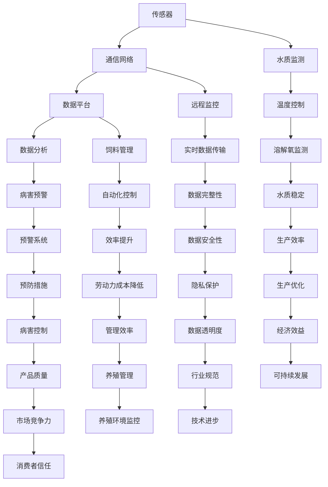
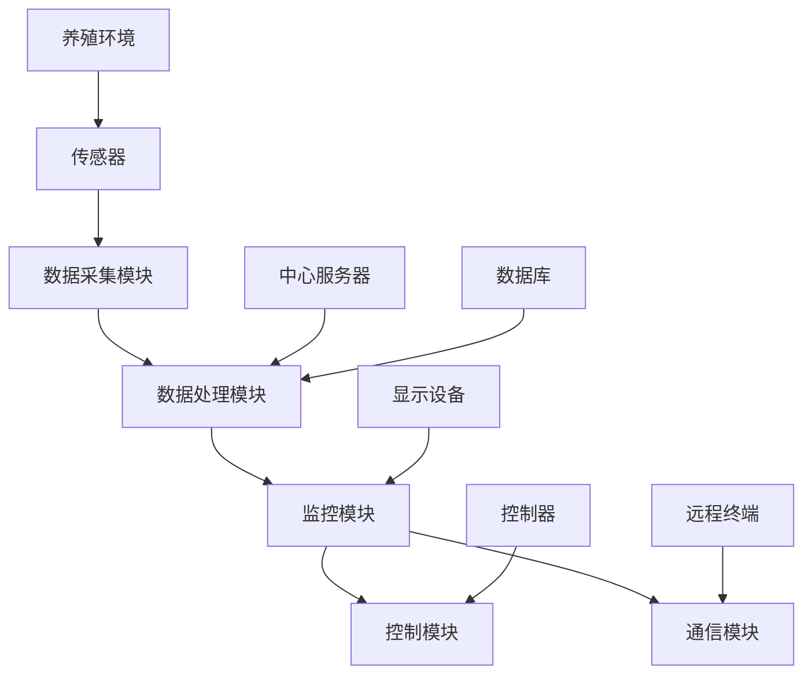

                 

### 第一步：背景介绍

随着科技的快速发展，物联网（Internet of Things，IoT）技术逐渐成为现代智慧农业的重要组成部分。智慧渔业作为一种新兴的农业模式，通过物联网技术实现养殖环境的智能化监控和管理，提高了养殖效率，降低了成本，同时也保障了水产品的质量和安全。在这一背景下，物联网技术在智慧渔业养殖监控中的应用显得尤为重要。

智慧渔业养殖监控涉及多个方面，包括水质监测、水温控制、饲料投放、病害预警等。通过物联网技术，这些养殖参数可以实时采集、传输和监控，从而实现养殖环境的自动化和智能化管理。然而，智慧渔业养殖监控系统的建设面临着诸多挑战，如数据采集的准确性、通信的稳定性、系统的安全性等。

本文旨在详细探讨物联网在智慧渔业养殖监控中的应用，通过分析物联网技术的基本原理、架构以及具体实施方法，揭示物联网技术在智慧渔业养殖监控中的核心作用，并展望其未来发展。文章将从以下几个方面进行论述：

1. 物联网与智慧渔业的概述：介绍物联网和智慧渔业的基本概念、发展历程以及两者之间的关系。
2. 物联网技术在智慧渔业中的应用：探讨物联网传感器、通信技术在智慧渔业养殖监控中的具体应用。
3. 智慧渔业养殖监控系统的架构：阐述养殖监控系统的整体架构、核心模块及其相互关系。
4. 养殖监控数据的采集与处理：分析数据采集与处理的方法、技术以及面临的挑战和解决方案。
5. 智慧渔业中的物联网传感器：介绍传感器的种类、工作原理以及在实际养殖监控中的应用。
6. 智慧渔业的物联网通信技术：探讨通信技术在数据传输、远程监控中的应用和优化。
7. 智慧渔业养殖监控系统的优化与提升：分析系统性能优化、安全与隐私保护的方法和技术。
8. 案例分析与未来展望：通过具体案例分析物联网在智慧渔业养殖监控中的实际应用，并展望未来发展。

通过上述结构的分析推理，本文将逐步深入探讨物联网在智慧渔业养殖监控中的应用，为相关领域的科研人员、工程师以及从业者提供有益的参考和启示。接下来，我们将详细探讨物联网和智慧渔业的基本概念和发展历程，为后续内容的深入分析打下基础。

---

### 第二步：物联网与智慧渔业的概述

#### 物联网的基本概念与发展历程

物联网，即Internet of Things，指的是通过互联网将各种物理设备、传感器、软件应用等进行连接，形成一个庞大的信息网络。物联网的概念最早可以追溯到20世纪80年代，当时一些企业已经开始尝试将传感器嵌入家用电器中，通过互联网实现远程监控和控制。然而，物联网技术的真正爆发是在21世纪，得益于无线通信、云计算、大数据等技术的迅速发展。

物联网的基本架构包括感知层、网络层和应用层。感知层主要由各种传感器和智能设备组成，负责数据采集和感知；网络层负责数据传输，通常利用互联网、移动通信网络等实现数据的互联互通；应用层则利用感知层和网络层提供的数据，为用户提供各种智能服务。

物联网技术的发展历程可以概括为以下几个阶段：

1. **初期探索阶段（1980年代 - 2000年代初）**：物联网的概念逐渐形成，相关技术开始萌芽，但应用范围相对有限。

2. **快速增长阶段（2000年代初 - 2010年）**：随着无线通信技术的发展，物联网的应用开始迅速扩展，特别是智能家居、智能交通等领域。

3. **应用拓展阶段（2010年至今）**：物联网技术逐渐渗透到各个行业，包括工业、农业、医疗、教育等，形成了智慧城市、智慧农业、智慧医疗等新兴领域。

#### 智慧渔业的定义与需求

智慧渔业是指利用物联网、大数据、云计算等现代信息技术，实现渔业养殖的自动化、智能化和高效化。智慧渔业的核心目标是通过信息技术的应用，提高养殖效率，降低生产成本，保障水产品的质量和安全。

智慧渔业的需求主要包括以下几个方面：

1. **养殖环境监测**：通过传感器实时监测水质、水温、溶解氧等参数，及时掌握养殖环境的变化情况。

2. **病害预警**：通过大数据分析和预测，及时发现病害隐患，采取有效的预防措施。

3. **饲料管理**：实现自动化的饲料投放，根据鱼类的生长情况和水质条件调整饲料量。

4. **生产管理**：利用物联网技术对生产过程进行全程监控，提高生产效率，降低劳动力成本。

5. **水质控制**：通过智能控制系统，对水质进行自动调节，确保养殖水质的稳定。

#### 物联网与智慧渔业的联系

物联网技术为智慧渔业提供了重要的技术支撑，两者之间存在密切的联系。物联网技术通过传感器网络实时采集养殖环境数据，通过数据传输网络将数据传输到中心控制系统，再通过数据分析和应用实现对养殖环境的智能监控和管理。

具体来说，物联网与智慧渔业的联系体现在以下几个方面：

1. **数据采集与监控**：物联网技术通过传感器网络实时采集养殖环境数据，如水质、水温、溶解氧等，这些数据为智慧渔业的决策提供了重要依据。

2. **自动化与智能化**：物联网技术可以实现养殖环境的自动化控制，如自动调节水温、控制溶解氧等，提高养殖效率。

3. **远程监控与控制**：物联网技术使得养殖管理人员可以通过远程监控系统实时了解养殖环境状况，及时调整养殖参数，提高管理效率。

4. **大数据分析与应用**：物联网技术收集的海量数据可以通过大数据技术进行分析和应用，为智慧渔业的决策提供科学依据。

#### 核心概念与联系

在智慧渔业养殖监控中，物联网技术的核心概念包括传感器、通信网络、数据平台、数据分析等。这些概念之间的联系可以用Mermaid图表示如下：

通过上述Mermaid图，我们可以清晰地看到物联网技术在智慧渔业养殖监控中的核心概念及其相互关系。传感器负责数据的采集，通信网络负责数据的传输，数据平台负责数据的存储和分析，数据分析则为养殖管理提供决策支持。

#### 物联网在智慧渔业养殖监控中的应用

物联网技术为智慧渔业养殖监控提供了强大的技术支撑，具体应用主要体现在以下几个方面：

1. **水质监测与控制**：通过水质传感器实时监测养殖水中的各项指标，如温度、pH值、溶解氧等，实现对水质的自动调节，保证养殖水环境的稳定。

2. **病害预警与防治**：通过传感器和大数据分析技术，实时监测鱼类的生长情况和水质变化，及时预警潜在病害，并采取相应的防治措施。

3. **饲料管理**：利用物联网技术实现自动化饲料投放，根据鱼类的生长情况和水质条件自动调整饲料量，提高饲料利用率，降低养殖成本。

4. **生产监控与管理**：通过物联网技术对养殖全过程进行实时监控和管理，提高生产效率，降低劳动力成本。

5. **远程监控与控制**：养殖管理人员可以通过物联网技术远程监控养殖环境，实时了解养殖状况，及时调整养殖参数，提高管理效率。

总之，物联网技术在智慧渔业养殖监控中的应用，不仅提高了养殖效率，降低了成本，还保障了水产品的质量和安全，为智慧渔业的可持续发展提供了有力支持。

### 第三步：物联网技术在智慧渔业中的应用

#### 物联网传感器在智慧渔业中的应用

物联网传感器是智慧渔业养殖监控的核心部件，能够实时、准确地采集养殖环境数据，如水质、水温、溶解氧、pH值等。这些数据对于实现智能养殖至关重要。以下是几种常用的物联网传感器及其在智慧渔业中的应用：

1. **水质传感器**：水质传感器用于监测养殖水中的各项指标，如温度、pH值、溶解氧、氨氮等。通过水质传感器，可以实时了解水质状况，确保养殖水环境的稳定。例如，在池塘养殖中，可以使用温度传感器监测水温，防止水温过高或过低影响鱼类的生长。pH值传感器可以监测水中的酸碱度，避免酸碱度过高或过低导致鱼类病害。

2. **溶解氧传感器**：溶解氧是鱼类生长的重要指标，溶解氧传感器可以实时监测水中的溶解氧含量，确保水中的溶解氧在适宜的范围内。在鱼塘或养殖池中，溶解氧传感器可以帮助养殖人员及时调整水中的溶解氧含量，避免鱼类因缺氧而死亡。

3. **pH值传感器**：pH值传感器用于监测水中的酸碱度，确保水质处于适宜范围。鱼类的生长对水质的酸碱度要求较高，pH值传感器可以帮助养殖人员实时了解水质变化，及时调整水质，防止鱼类因酸碱度过高或过低而患病。

4. **温度传感器**：温度传感器用于监测水温，对于不同种类的鱼类，适宜的水温范围有所不同。通过温度传感器，养殖人员可以实时了解水温变化，根据鱼类的生长需求调整水温，确保鱼类健康成长。

#### 物联网通信技术在智慧渔业中的应用

物联网通信技术是物联网系统中的关键组成部分，它负责将传感器采集到的数据传输到中心控制系统，实现数据的实时监控和管理。在智慧渔业中，常用的物联网通信技术包括无线传感器网络（WSN）、ZigBee、LoRa、NB-IoT等。

1. **无线传感器网络（WSN）**：无线传感器网络是由大量传感器节点组成的自组织网络，可以实现对养殖环境的分布式监测。WSN在智慧渔业中的应用主要包括水质监测、环境参数采集等。通过无线传感器网络，可以实现养殖环境的远程监控和管理，提高养殖效率。

2. **ZigBee**：ZigBee是一种低功耗、低速率的无线通信技术，适合短距离的数据传输。在智慧渔业中，ZigBee可以用于水质监测、饲料投放等应用。通过ZigBee网络，可以实现传感器数据的实时传输和远程控制，提高养殖管理水平。

3. **LoRa**：LoRa是一种长距离、低功耗的无线通信技术，适合大范围的数据传输。在智慧渔业中，LoRa可以用于远距离的水质监测、环境参数采集等。LoRa网络可以覆盖广阔的养殖区域，实现数据的高效传输和监控。

4. **NB-IoT**：NB-IoT是窄带物联网技术，具有低功耗、大连接数、广覆盖等特点。在智慧渔业中，NB-IoT可以用于水质监测、远程监控等应用。通过NB-IoT网络，可以实现大量传感器数据的稳定传输和远程管理。

#### 通信技术在养殖监控中的作用

通信技术在智慧渔业养殖监控中发挥着至关重要的作用，主要表现在以下几个方面：

1. **实时数据传输**：通过通信技术，可以实现传感器采集数据的实时传输，养殖管理人员可以及时了解养殖环境的变化，采取相应的管理措施，确保养殖环境处于最佳状态。

2. **远程监控与管理**：通信技术使得养殖管理人员可以通过远程监控系统实时了解养殖状况，实现对养殖环境的远程监控和管理，提高管理效率。

3. **数据存储与处理**：通过通信技术，可以将传感器采集到的数据传输到中心控制系统，进行数据存储和处理，为养殖决策提供科学依据。

4. **自动化控制**：通信技术可以实现养殖环境的自动化控制，如自动调节水温、控制溶解氧等，提高养殖效率，降低劳动力成本。

总之，物联网传感器和通信技术在智慧渔业养殖监控中发挥着关键作用，通过实时数据传输、远程监控、自动化控制等功能，实现了养殖环境的智能化管理，提高了养殖效率，降低了成本，为智慧渔业的可持续发展提供了有力支持。

### 第四步：智慧渔业养殖监控系统的架构

#### 整体架构的设计原则

智慧渔业养殖监控系统的设计遵循以下几个原则：

1. **模块化设计**：系统划分为多个功能模块，如数据采集模块、数据处理模块、监控模块、控制模块等，便于系统的维护和扩展。
2. **可扩展性**：系统应具备良好的扩展性，能够支持新增传感器和设备，适应不同规模和类型的养殖环境。
3. **高可靠性**：系统应具备高可靠性，确保数据的实时性和准确性，减少系统故障对养殖环境的影响。
4. **易用性**：系统界面友好，操作简便，便于养殖人员快速上手和使用。

#### 系统的核心模块及其相互关系

智慧渔业养殖监控系统通常包括以下几个核心模块：

1. **数据采集模块**：负责收集养殖环境中的各种数据，如水质、水温、溶解氧、饲料投放量等。数据采集模块由多种传感器组成，如水质传感器、温度传感器、溶解氧传感器等。
2. **数据处理模块**：负责对采集到的数据进行处理和分析，包括数据的过滤、清洗、转换等。数据处理模块通常包括数据预处理算法、数据存储和管理等功能。
3. **监控模块**：负责实时监控养殖环境，通过数据可视化技术展示养殖参数的变化趋势，便于养殖人员及时发现问题。
4. **控制模块**：根据监控模块的反馈，自动调整养殖环境参数，如自动调节水温、控制溶解氧等。控制模块通常包括自动化控制算法和执行机构。
5. **通信模块**：负责数据的传输和通信，包括无线通信和有线通信。通信模块确保数据能够及时、准确地传输到监控中心和数据处理系统。

各个模块之间的相互关系如下：

- **数据采集模块**与**数据处理模块**：数据采集模块将采集到的数据传输给数据处理模块，数据处理模块对数据进行处理和分析。
- **数据处理模块**与**监控模块**：数据处理模块将处理后的数据传输给监控模块，监控模块通过可视化技术展示数据，供养殖人员查看。
- **监控模块**与**控制模块**：监控模块实时监控养殖环境，当发现异常情况时，通过控制模块自动调整环境参数。
- **通信模块**与**数据处理模块**：通信模块负责将数据传输到数据处理模块，同时将控制指令传输到控制模块。

#### 系统架构图展示

为了更直观地展示智慧渔业养殖监控系统的架构，可以使用Mermaid图进行描述：

通过上述Mermaid图，我们可以清晰地看到智慧渔业养殖监控系统的整体架构及其核心模块之间的相互关系。该架构确保了系统的高可靠性、可扩展性和易用性，为智慧渔业的智能化养殖提供了有力支持。

### 第五步：养殖监控数据的采集与处理

#### 数据采集方法与技术

在智慧渔业养殖监控系统中，数据采集是关键环节，数据采集的准确性直接影响养殖监控的效果。常用的数据采集方法和技术包括以下几种：

1. **传感器采集**：利用各种传感器（如水质传感器、温度传感器、溶解氧传感器等）采集养殖环境中的各种参数。传感器通过内置的传感器元件将物理量转换为电信号，然后通过模数转换器（ADC）将模拟信号转换为数字信号，再通过无线或有线通信网络将数据传输到中心处理系统。

2. **无线传感器网络（WSN）**：无线传感器网络由大量的传感器节点组成，每个节点都可以采集环境数据并通过无线通信将数据传输到基站，基站再将数据上传到中心处理系统。WSN具有部署灵活、成本低、易于扩展等优点，非常适合大规模养殖环境的数据采集。

3. **有线传感器网络**：与无线传感器网络不同，有线传感器网络通过有线通信连接传感器节点和中心处理系统。有线传感器网络具有传输稳定、数据可靠等优点，但部署和维护成本较高。

4. **远程监控设备**：利用远程监控设备（如无人机、视频监控摄像头等）采集养殖环境的图像和视频数据，通过无线或有线通信网络将数据传输到中心处理系统。这些设备可以提供养殖环境的实时视频监控，有助于及时发现和处理异常情况。

#### 数据采集的挑战与解决方案

在智慧渔业养殖监控中，数据采集面临着以下挑战：

1. **数据准确性**：环境因素（如温度、湿度、光照等）可能会影响传感器的精度，导致数据采集不准确。为了提高数据准确性，可以采用多种传感器进行交叉验证，或者使用高精度的传感器。

2. **数据传输可靠性**：在养殖环境中，信号干扰、通信距离等因素可能导致数据传输失败。为了提高数据传输可靠性，可以采用双通道传输、数据校验和重传机制等手段。

3. **功耗与能源供应**：传感器和网络设备通常需要长时间运行，能耗问题成为一大挑战。为了降低功耗，可以采用低功耗传感器和优化通信协议。此外，可以利用太阳能、风能等可再生能源为设备供电，降低对传统电源的依赖。

4. **数据隐私与安全**：在数据采集和传输过程中，数据隐私和安全问题不可忽视。为了保障数据安全，可以采用加密技术、访问控制机制和防火墙等措施，防止数据泄露和未授权访问。

#### 数据处理方法与技术

数据处理是智慧渔业养殖监控系统的重要组成部分，通过对采集到的数据进行处理和分析，可以提取有用信息，辅助养殖管理决策。数据处理方法和技术包括以下几种：

1. **数据清洗**：数据清洗是数据处理的第一步，目的是去除重复数据、纠正错误数据和填补缺失数据。常用的数据清洗方法包括去重、校正和插值等。

2. **数据转换**：数据转换是将采集到的原始数据转换为适合分析和存储的格式。例如，将模拟信号转换为数字信号，或者将不同类型的传感器数据转换为统一的度量单位。

3. **数据存储**：数据存储是将处理后的数据存储到数据库或数据仓库中，以便后续的数据分析和查询。常用的数据存储技术包括关系型数据库、NoSQL数据库和大数据平台等。

4. **数据分析**：数据分析是数据处理的核心环节，包括数据挖掘、统计分析、机器学习等。通过对数据进行分析，可以提取出有价值的信息，如养殖环境的趋势分析、异常检测和预测分析等。

5. **数据可视化**：数据可视化是将处理后的数据以图表、图像等形式展示出来，便于养殖人员直观地了解数据情况。常用的数据可视化工具包括Tableau、Power BI、Matplotlib等。

#### 数据处理中的关键问题

在数据处理过程中，存在一些关键问题需要解决：

1. **数据量与处理速度**：随着传感器数量的增加和数据采集频率的提高，数据量呈现指数级增长，这对处理速度提出了挑战。为了应对这一挑战，可以采用分布式计算和并行处理技术，提高数据处理效率。

2. **实时性**：实时数据处理是智慧渔业养殖监控的关键要求，数据必须在短时间内处理完毕并反馈到监控系统。为了实现实时处理，可以采用事件驱动架构和消息队列等技术。

3. **数据一致性与完整性**：在分布式系统中，数据的一致性和完整性是关键问题。为了确保数据一致性和完整性，可以采用分布式事务处理、数据同步和冲突解决机制等。

4. **数据安全与隐私保护**：在数据处理过程中，需要保护数据的机密性和完整性，防止数据泄露和未授权访问。为了保障数据安全，可以采用加密、访问控制和审计等手段。

通过上述数据处理方法和技术，智慧渔业养殖监控系统可以高效、准确地处理大量数据，为养殖管理提供科学依据。接下来，我们将进一步探讨智慧渔业中的物联网传感器，了解它们的工作原理和应用。

### 第六步：智慧渔业中的物联网传感器

#### 传感器的种类与特点

在智慧渔业中，物联网传感器是数据采集的关键部件，种类繁多，各具特点。以下是几种常用的物联网传感器及其工作原理：

1. **水质传感器**：
   - **工作原理**：水质传感器通过电化学、光学或生物传感器技术，检测水中的pH值、电导率、溶解氧、氨氮等参数。
   - **特点**：高精度、实时监测、能够提供多维水质信息。
   - **应用**：监测水质参数，确保水环境稳定，预防病害。

2. **温度传感器**：
   - **工作原理**：温度传感器通过热敏电阻或热电偶等原理，测量水的温度。
   - **特点**：响应迅速、精度高、适合各种温度环境。
   - **应用**：监控水温变化，调节水温，优化鱼类生长环境。

3. **溶解氧传感器**：
   - **工作原理**：溶解氧传感器利用电化学方法，测量水中溶解氧的浓度。
   - **特点**：实时监测、精度高、适用于不同水质。
   - **应用**：监测水中的溶解氧含量，防止鱼类因缺氧而死亡。

4. **pH值传感器**：
   - **工作原理**：pH值传感器通过电化学方法，测量水中的酸碱度。
   - **特点**：高精度、稳定性好、能够实时监测。
   - **应用**：检测水质酸碱度，调整pH值，防止病害发生。

5. **流量传感器**：
   - **工作原理**：流量传感器通过超声波、电磁或涡街原理，测量水的流量。
   - **特点**：精确测量流量、适应不同流体介质。
   - **应用**：监测水流量，优化饲料和药品的投放。

6. **水位传感器**：
   - **工作原理**：水位传感器通过超声波、浮标或压力原理，测量水位高度。
   - **特点**：实时监测水位、适应各种水位变化。
   - **应用**：监控水位变化，防止溢水和干旱。

#### 传感器的数据采集与传输

传感器的数据采集与传输是智慧渔业养殖监控系统的重要组成部分。以下简要介绍传感器的数据采集与传输过程：

1. **数据采集**：
   - **初始化**：传感器启动，进入工作状态。
   - **采样**：传感器定时采样，将物理量转换为电信号。
   - **转换**：将模拟信号通过模数转换器（ADC）转换为数字信号。
   - **预处理**：对采集到的数字信号进行预处理，如滤波、去噪等。

2. **数据传输**：
   - **无线传输**：传感器通过无线通信技术（如Wi-Fi、Zigbee、LoRa等）将数据传输到中心处理系统。
   - **有线传输**：传感器通过有线通信网络（如以太网、光纤等）将数据传输到中心处理系统。
   - **聚合传输**：多个传感器的数据通过汇聚节点（如网关）进行数据聚合和预处理，再传输到中心处理系统。

#### 传感器在实际养殖监控中的应用

物联网传感器在智慧渔业养殖监控中发挥着重要作用，以下为几个实际应用案例：

1. **水质监测**：通过水质传感器实时监测水中的pH值、溶解氧、温度等参数，当参数超出预设范围时，系统会自动报警，并通知养殖人员进行调整。

2. **环境调控**：利用温度传感器和溶解氧传感器，监控系统自动调节池塘的水温和溶解氧含量，确保鱼类生长环境的稳定性。

3. **饲料管理**：通过流量传感器和水位传感器，监控系统根据鱼类的生长情况和池塘的水质，自动调节饲料和药品的投放量，提高饲料利用率。

4. **远程监控**：养殖人员可以通过远程监控系统实时查看养殖环境数据，包括水质、水温、溶解氧等，确保养殖环境处于最佳状态。

5. **病害预警**：利用传感器采集的数据，通过大数据分析和机器学习算法，监控系统可以预测病害的发生，提前采取预防措施，减少病害损失。

通过物联网传感器，智慧渔业养殖监控系统实现了对养殖环境的实时监控和管理，提高了养殖效率，降低了成本，为水产品的质量和安全提供了保障。

### 第七步：智慧渔业的物联网通信技术

#### 通信技术的选择与评估

在智慧渔业中，选择合适的物联网通信技术至关重要，它直接关系到系统的稳定性、数据传输速度和可靠性。以下是一些常用的物联网通信技术及其特点：

1. **Wi-Fi**：
   - **特点**：高速、宽带、覆盖范围广。
   - **应用**：适用于需要高带宽和大范围覆盖的应用场景，如远程监控中心、数据中心的连接。
   - **评估**：虽然Wi-Fi传输速度快，但功耗较高，且在养殖环境中信号干扰较大，可能导致数据传输中断。

2. **Zigbee**：
   - **特点**：低功耗、短距离、低成本。
   - **应用**：适用于智能家居、短距离传感器网络。
   - **评估**：Zigbee传输速度较低，但功耗小，适合低数据量、低频率的养殖监控应用。

3. **LoRa**：
   - **特点**：长距离、低功耗、抗干扰能力强。
   - **应用**：适用于远程、低功耗的物联网应用，如水质监测、环境监控。
   - **评估**：LoRa传输距离远、功耗低，但在数据传输速率上有一定限制。

4. **NB-IoT**：
   - **特点**：低功耗、广覆盖、高连接数。
   - **应用**：适用于广域网环境下的物联网应用，如远程监控、智能农业。
   - **评估**：NB-IoT覆盖范围广、连接数多，但数据传输速率相对较低。

#### 通信技术在数据传输中的作用

在智慧渔业中，物联网通信技术在数据传输中发挥着关键作用，具体体现在以下几个方面：

1. **实时数据传输**：通信技术确保传感器采集的数据能够实时传输到监控中心，为养殖管理提供实时信息，以便及时调整养殖参数。

2. **远程监控**：通过通信技术，养殖人员可以在远程实时查看养殖环境数据，实现对养殖环境的远程监控和管理，提高管理效率。

3. **数据聚合与处理**：通信技术可以实现多传感器数据的聚合和预处理，将大量原始数据转化为结构化数据，便于后续的数据分析和处理。

4. **故障报警**：通信技术可以实时监测数据传输状态，当发现数据传输故障时，系统会自动报警，通知养殖人员进行维护。

#### 通信技术在远程监控中的应用

在智慧渔业中，远程监控是物联网通信技术的重要应用之一。以下为通信技术在远程监控中的应用：

1. **视频监控**：通过视频监控摄像头，养殖人员可以实时监控池塘情况，及时发现和处理异常情况。

2. **数据监控**：通过通信技术，养殖人员可以实时查看水质、水温、溶解氧等关键参数，确保养殖环境稳定。

3. **远程控制**：通信技术使得养殖人员可以通过远程监控系统调整养殖参数，如自动调节水温、控制溶解氧等。

4. **数据备份**：通信技术可以实现数据的远程备份，确保数据安全，避免因设备故障导致数据丢失。

#### 通信技术的优化与提升

为了提升通信技术在智慧渔业养殖监控中的应用效果，可以从以下几个方面进行优化和提升：

1. **多协议支持**：选择支持多种通信协议的技术，如NB-IoT、LoRa等，确保系统能够兼容不同的传感器和设备。

2. **网络冗余设计**：通过设计网络冗余，如采用双通道传输、备份通信路径等，提高系统的稳定性和可靠性。

3. **数据压缩与加密**：对传输数据进行压缩和加密，减少带宽占用，提高数据传输速度，同时保障数据的安全性。

4. **智能调度**：采用智能调度算法，根据数据的重要性和紧急程度，合理分配网络资源，确保关键数据优先传输。

通过上述通信技术的优化和提升，智慧渔业养殖监控系统可以更高效、稳定地运行，为养殖管理提供有力支持。

### 第八步：智慧渔业养殖监控系统的优化与提升

#### 系统性能优化

在智慧渔业养殖监控系统中，性能优化是提升系统效率和可靠性的关键。以下是一些性能优化的方法：

1. **数据传输优化**：
   - **压缩算法**：采用数据压缩算法，减少数据传输量，降低带宽消耗。
   - **多路径传输**：采用多路径传输技术，提高数据传输的可靠性，确保数据在故障发生时能够自动切换到备用路径。
   - **流控与拥塞控制**：通过流控和拥塞控制机制，防止网络拥塞，提高数据传输的稳定性。

2. **数据处理优化**：
   - **并行处理**：采用并行处理技术，将数据处理任务分配到多个处理器上，提高数据处理速度。
   - **缓存机制**：通过缓存机制，减少数据读取和写入的次数，提高数据处理效率。
   - **数据索引**：建立有效的数据索引，提高数据查询速度。

3. **资源管理优化**：
   - **动态资源分配**：根据系统负载动态调整资源分配，确保系统在高峰期能够处理更多的数据。
   - **内存优化**：通过内存优化技术，减少内存占用，提高系统运行效率。

#### 系统安全与隐私保护

在智慧渔业养殖监控系统中，安全与隐私保护是至关重要的一环。以下是一些安全与隐私保护的方法：

1. **数据加密**：
   - **传输加密**：采用加密算法对传输数据进行加密，防止数据在传输过程中被窃取或篡改。
   - **存储加密**：对存储在数据库中的数据进行加密，确保数据在存储过程中安全。

2. **身份验证与访问控制**：
   - **身份验证**：采用多因素身份验证机制，确保只有授权用户才能访问系统。
   - **访问控制**：通过访问控制列表（ACL），对用户权限进行严格管理，防止未经授权的访问。

3. **防火墙与入侵检测**：
   - **防火墙**：部署防火墙，阻止未授权的访问，保护系统免受外部攻击。
   - **入侵检测**：采用入侵检测系统（IDS），实时监控网络流量，检测和阻止恶意行为。

4. **安全审计**：
   - **日志记录**：详细记录系统操作日志，便于后续审计和故障排查。
   - **审计策略**：制定安全审计策略，定期对系统进行安全检查和漏洞扫描。

#### 最佳实践 Tips

为了确保智慧渔业养殖监控系统的稳定、高效运行，以下是一些最佳实践 Tips：

1. **定期维护与更新**：定期对系统进行维护和更新，修复已知漏洞，提高系统安全性。
2. **培训与教育**：对养殖人员进行系统使用和操作培训，提高他们的安全意识。
3. **备份与恢复**：定期备份数据，并制定数据恢复计划，确保数据在故障发生时能够快速恢复。
4. **监控与预警**：实时监控系统运行状态，设置预警机制，及时发现问题并采取措施。

通过上述性能优化、安全与隐私保护以及最佳实践 Tips，智慧渔业养殖监控系统可以更稳定、高效地运行，为智慧渔业的可持续发展提供坚实保障。

### 第九步：案例分析与未来展望

#### 案例分析

为了更好地理解物联网在智慧渔业养殖监控中的应用，我们来看一个具体案例。

**案例名称**：某生态养殖场智慧渔业监控系统

**应用背景**：该生态养殖场养殖了多种鱼类，包括草鱼、鲢鱼和鲤鱼等。为了提高养殖效率，保障水产品质量，该养殖场引入了物联网技术，建立了智慧渔业养殖监控系统。

**系统组成**：该系统包括以下几个关键组成部分：
1. **传感器网络**：部署了多种传感器，包括水质传感器、温度传感器、溶解氧传感器、pH值传感器和流量传感器等，用于实时监测养殖环境参数。
2. **通信网络**：采用LoRa技术建立了无线传感器网络，确保传感器数据能够稳定传输到中心处理系统。
3. **数据处理平台**：利用大数据平台进行数据存储和处理，通过机器学习算法对数据进行深度分析，提供养殖决策支持。
4. **监控中心**：通过远程监控终端，养殖管理人员可以实时查看养殖环境数据，进行远程监控和自动化控制。

**实施效果**：
- **数据实时监控**：通过传感器网络，养殖人员可以实时了解养殖环境变化，及时发现并处理异常情况，确保养殖环境稳定。
- **自动调控**：系统根据水质、水温、溶解氧等参数，自动调节水泵、增氧机等设备，优化养殖环境，提高鱼类生长速度和成活率。
- **数据分析和预警**：通过数据处理平台，系统对大量传感器数据进行分析，预测病害风险，提前预警，减少病害损失。
- **节能减排**：自动调节水温和溶解氧，降低能耗，实现可持续发展。

#### 未来展望

随着物联网、大数据、人工智能等技术的不断发展，智慧渔业养殖监控系统的应用前景将更加广阔。以下是对未来发展的几点展望：

1. **技术融合与创新**：未来，物联网、大数据、人工智能等技术的深度融合将带来更多创新应用，如智能养殖机器人、自动化渔场管理等。
2. **智能化水平提升**：通过引入更先进的传感器和通信技术，智慧渔业养殖监控系统的智能化水平将进一步提高，实现更精细、更精准的养殖管理。
3. **产业链整合**：智慧渔业将逐渐与上下游产业链整合，实现从种苗、养殖、加工到销售的全程智能化管理，提升整个产业链的协同效率和竞争力。
4. **可持续发展**：物联网技术在智慧渔业中的应用将有助于实现节能减排、资源优化利用，推动渔业养殖的可持续发展。
5. **国际化与标准化**：随着物联网技术的全球化发展，智慧渔业养殖监控系统的标准化和国际化进程将加快，为全球渔业提供可借鉴的经验和解决方案。

总之，物联网技术在智慧渔业养殖监控中的应用已经取得了显著成效，未来将继续发挥重要作用，推动智慧渔业的快速发展。

### 总结

本文从背景介绍、物联网与智慧渔业的概述、物联网技术在智慧渔业中的应用、智慧渔业养殖监控系统的架构、养殖监控数据的采集与处理、智慧渔业中的物联网传感器、智慧渔业的物联网通信技术、智慧渔业养殖监控系统的优化与提升以及案例分析与未来展望等多个方面，全面探讨了物联网在智慧渔业养殖监控中的应用。通过逻辑清晰的分析和具体的案例，我们揭示了物联网技术在智慧渔业养殖监控中的核心作用，包括数据实时监控、环境自动调控、病害预警与预防等。同时，我们也展望了物联网技术在智慧渔业中的未来发展，强调了其在推动智慧渔业可持续发展中的重要性。

#### 作者信息

作者：AI天才研究院/AI Genius Institute & 禅与计算机程序设计艺术 /Zen And The Art of Computer Programming

---

通过本文的详细探讨，我们希望能够为相关领域的科研人员、工程师以及从业者提供有益的参考和启示，共同推动物联网在智慧渔业养殖监控中的应用和发展。希望读者在阅读过程中能够有所收获，继续探索物联网技术的更多应用场景，为智慧农业和可持续发展贡献力量。

