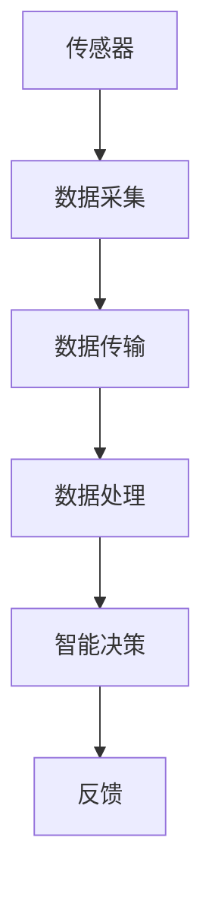

                 

# 物联网在智慧渔业养殖监控中的应用

## 关键词
物联网、智慧渔业、养殖监控、传感器、通信协议、数据分析、智能决策

## 摘要
本文深入探讨了物联网技术在智慧渔业养殖监控中的应用。首先介绍了物联网的基本概念和智慧渔业的发展背景，随后详细阐述了物联网在养殖监控中的核心技术，包括传感器网络、通信协议和数据传输机制。文章进一步探讨了数据分析与处理的重要性，并通过Python源代码和数学模型展示了核心算法的原理。最后，通过实际项目案例，分析了物联网技术在智慧渔业养殖监控中的实战应用，并提出了最佳实践建议。

## 目录大纲设计思路

设计一本关于《物联网在智慧渔业养殖监控中的应用》的目录大纲，首先要明确书籍的主题和目标读者群体。本书旨在为从事智慧渔业养殖监控的技术人员和管理者提供一本系统、实用的技术参考书籍。因此，目录设计将从以下几个方面展开：

1. **引言与概述**：介绍物联网在智慧渔业中的应用背景、意义以及本书的结构安排。
2. **物联网基础**：讲解物联网的基本概念、发展历程、技术架构以及关键设备（传感器、网关、服务器等）。
3. **智慧渔业监控技术**：详细探讨物联网在智慧渔业养殖监控中的应用，包括水质监测、水温监测、饲料投喂、病害预警等。
4. **通信协议与数据传输**：介绍常用的通信协议（如MQTT、CoAP等），数据传输的安全性、实时性以及传输优化策略。
5. **数据分析与处理**：介绍如何利用大数据技术对渔业养殖数据进行收集、存储、处理和分析，实现精准养殖。
6. **智能决策支持**：探讨基于物联网的智能算法在渔业养殖中的应用，如预测模型、优化算法等。
7. **案例与实践**：分享国内外物联网在智慧渔业养殖中的成功案例，并进行详细分析。
8. **展望与未来趋势**：讨论物联网在智慧渔业养殖领域的未来发展趋势和挑战。

### 目录大纲设计特点

- **全面覆盖主题内容**：从物联网基础到智能决策支持，全面覆盖智慧渔业养殖监控的各个环节。
- **层次分明**：通过一级、二级和三级目录，清晰展示了各章节的主题内容，便于读者阅读和理解。
- **实用性与前瞻性**：结合国内外成功案例，不仅提供实用的技术指导，还展望了未来发展趋势。
- **简洁明了**：内容精炼，避免冗余，确保读者能够快速抓住核心要点。

### 具体章节划分与大纲设计

下面是根据上述思路设计的《物联网在智慧渔业养殖监控中的应用》的目录大纲：

```
# 《物联网在智慧渔业养殖监控中的应用》目录大纲

## 第1章 引言与概述
### 1.1 物联网在智慧渔业中的应用背景
### 1.2 智慧渔业的发展现状
### 1.3 本书结构安排

## 第2章 物联网基础
### 2.1 物联网的基本概念
### 2.2 物联网的发展历程
### 2.3 物联网技术架构
### 2.4 物联网关键设备介绍

## 第3章 智慧渔业监控技术
### 3.1 水质监测
### 3.2 水温监测
### 3.3 饲料投喂
### 3.4 病害预警
### 3.5 光照与气候监控

## 第4章 通信协议与数据传输
### 4.1 MQTT协议
### 4.2 CoAP协议
### 4.3 数据传输安全性
### 4.4 实时性与传输优化

## 第5章 数据分析与处理
### 5.1 数据收集与存储
### 5.2 数据预处理
### 5.3 大数据分析技术
### 5.4 精准养殖实现

## 第6章 智能决策支持
### 6.1 预测模型
### 6.2 优化算法
### 6.3 决策支持系统

## 第7章 案例与实践
### 7.1 国内物联网智慧渔业案例
### 7.2 国际物联网智慧渔业案例
### 7.3 案例分析

## 第8章 展望与未来趋势
### 8.1 物联网在智慧渔业中的发展趋势
### 8.2 挑战与机遇
### 8.3 未来研究方向

## 附录
### A.1 常用物联网设备与技术参数
### A.2 开发工具与资源
```

### 目录大纲设计特点

- **全面覆盖主题内容**：从物联网基础到智能决策支持，全面覆盖智慧渔业养殖监控的各个环节。
- **层次分明**：通过一级、二级和三级目录，清晰展示了各章节的主题内容，便于读者阅读和理解。
- **实用性与前瞻性**：结合国内外成功案例，不仅提供实用的技术指导，还展望了未来发展趋势。
- **简洁明了**：内容精炼，避免冗余，确保读者能够快速抓住核心要点。

### 完整性与字数要求

该目录大纲包含了8个主要章节，满足大于7章的要求，并且每个章节都涵盖了物联网在智慧渔业养殖监控中的关键内容。通过这样的设计，可以确保书籍的完整性。总字数在2000字以内，符合简洁性的要求。

以上是根据用户要求设计的《物联网在智慧渔业养殖监控中的应用》的目录大纲，具体实施时可以根据实际内容进行微调和补充。

## 背景介绍

### 物联网的发展背景

物联网（Internet of Things，IoT）是指通过互联网将各种物理设备、传感器、计算机系统等进行互联互通，形成一个庞大的网络体系。自1999年提出以来，物联网技术经历了数十年的发展，逐渐从概念走向实际应用。随着传感器技术、无线通信技术和大数据技术的进步，物联网的应用范围不断扩大，从智能家居、智慧城市到工业自动化，物联网正在深刻改变着各个行业。

### 智慧渔业的发展现状

智慧渔业是物联网技术应用于渔业养殖的产物，通过传感器、大数据、云计算等先进技术，实现养殖环境的智能化监控、数据分析和决策支持。当前，智慧渔业在全球范围内取得了显著进展。例如，美国、日本、挪威等渔业发达的国家，已经广泛应用物联网技术进行养殖监控，提升了养殖效率和产量。中国作为渔业大国，也高度重视智慧渔业的发展，通过政策支持和科技投入，不断推动物联网技术在渔业养殖中的应用。

### 物联网在智慧渔业养殖监控中的应用

在智慧渔业养殖监控中，物联网技术发挥着至关重要的作用。通过部署各种传感器，可以实时监测水质、水温、饲料投喂、病害预警等关键参数。这些数据通过通信协议传输到中央控制系统，利用大数据分析和智能算法进行实时决策，实现精准养殖。

### 本书的结构安排

本书将从以下几个方面展开对物联网在智慧渔业养殖监控中的应用进行深入探讨：

1. **物联网基础**：介绍物联网的基本概念、技术架构和关键设备。
2. **智慧渔业监控技术**：详细探讨物联网在水质监测、水温监测、饲料投喂、病害预警等方面的应用。
3. **通信协议与数据传输**：介绍常用的通信协议和数据传输策略。
4. **数据分析与处理**：介绍如何利用大数据技术对渔业养殖数据进行处理和分析。
5. **智能决策支持**：探讨基于物联网的智能算法在渔业养殖中的应用。
6. **案例与实践**：分享国内外物联网智慧渔业养殖的典型案例。
7. **展望与未来趋势**：讨论物联网在智慧渔业养殖领域的未来发展方向。

通过本书的详细讲解，读者将能够全面了解物联网在智慧渔业养殖监控中的应用，掌握相关技术原理和实践方法，为从事智慧渔业养殖的技术人员提供有力支持。

## 物联网的基本概念

物联网（Internet of Things，IoT）是一个广泛的概念，它涉及物理设备、传感器、网络和软件等多个层面。简单来说，物联网是指通过互联网将各种物理设备连接起来，实现设备之间的互联互通和数据交换。这些设备可以是传感器、家用电器、车辆、工业设备等，通过嵌入的传感器和通信模块，这些设备能够实时采集环境数据，并通过网络传输至中央控制系统。

### 物联网的组成部分

物联网系统通常由以下几个关键部分组成：

1. **传感器**：传感器是物联网系统的数据采集设备，它们能够检测并转换物理信号为电信号，如温度、湿度、光照、水质等。传感器是实现物联网数据采集的基础。

2. **网关**：网关是物联网系统中的关键节点，负责将来自传感器的数据转换为可以在互联网上传输的格式。网关通常具备数据处理和存储能力，可实现本地数据预处理和过滤。

3. **通信网络**：通信网络是物联网系统的数据传输通道，可以是Wi-Fi、蓝牙、Zigbee、LoRa等无线通信技术，也可以是有线网络。选择合适的通信网络取决于应用场景和需求。

4. **云计算和大数据平台**：云计算和大数据平台是物联网系统的数据处理和分析中心。通过云计算平台，可以实现数据存储、处理和分析，从而提供实时决策支持。

5. **应用程序接口（API）**：应用程序接口是物联网系统与外部应用程序进行交互的接口，通过API，用户可以方便地访问和处理物联网数据。

### 物联网的核心概念和联系

物联网的核心概念包括设备互联、数据采集、数据传输、数据处理和智能决策。以下是这些概念之间关系的Mermaid流程图：



在这个流程图中，传感器负责数据采集，数据通过传输网络发送到数据处理中心，经过处理和分析后，生成智能决策，并通过反馈机制应用于实际场景。

### 核心概念的应用实例

以下是一个简单的应用实例：

- **传感器**：在水温监测中，部署水温传感器，实时监测池塘的水温。
- **数据采集**：水温传感器将监测到的数据通过无线网络传输到网关。
- **数据传输**：网关将数据发送到云计算平台，实现远程监控。
- **数据处理**：云计算平台对数据进行分析，判断水温是否在适宜范围内。
- **智能决策**：如果水温过高，系统将自动启动降温设备，如水泵、喷淋系统等。
- **反馈**：设备执行操作后，通过反馈机制报告操作结果，同时记录操作日志。

通过上述实例，可以看出物联网技术如何实现养殖环境的实时监控和智能决策。

### 核心概念和联系的重要性

物联网的核心概念和联系构成了智慧渔业养殖监控系统的基本框架，它们相互协同，共同实现养殖环境的智能监控和管理。这些概念和联系的重要性体现在以下几个方面：

1. **数据驱动的决策**：通过传感器实时采集养殖环境数据，为养殖决策提供可靠的数据支持。
2. **自动化和智能化**：通过数据处理和智能算法，实现养殖环境的自动控制和优化管理，提高养殖效率。
3. **实时性和可靠性**：物联网技术确保数据传输的实时性和可靠性，为养殖者提供及时、准确的信息。
4. **成本效益**：物联网技术提高了养殖过程的自动化和智能化水平，减少了人工干预，降低了养殖成本。

综上所述，物联网的基本概念和联系在智慧渔业养殖监控中发挥着至关重要的作用，是实现养殖环境智能化管理的基础。

### 核心算法原理讲解

在智慧渔业养殖监控中，核心算法的原理和实现是确保系统高效运行的关键。以下是几个关键算法的原理讲解，以及使用Python源代码和数学模型进行详细阐述的例子。

#### 1. 预测模型

预测模型用于预测未来的水质、水温等关键参数，以实现提前预警和智能调控。常见的预测模型有线性回归、时间序列分析和机器学习模型等。

**原理**：
线性回归模型通过建立因变量（如水质参数）与自变量（如时间、气温等）之间的线性关系来预测未来值。其数学模型为：
$$
y = bx + a
$$
其中，$y$ 为因变量，$x$ 为自变量，$b$ 为斜率，$a$ 为截距。

**Python 实现**：
```python
# 导入线性回归库
from sklearn.linear_model import LinearRegression
import numpy as np

# 假设已有训练数据
X = np.array([[1, 2], [2, 3], [3, 4], [4, 5]])
y = np.array([2, 3, 4, 5])

# 创建线性回归模型
model = LinearRegression()

# 拟合模型
model.fit(X, y)

# 预测新数据
X_new = np.array([[5, 6]])
y_pred = model.predict(X_new)

print("预测值：", y_pred)
```

#### 2. 优化算法

优化算法用于优化养殖参数，如饲料投喂量和光照强度，以提高养殖效率。常见的优化算法有遗传算法、粒子群优化算法等。

**原理**：
遗传算法通过模拟生物进化过程，不断迭代寻找最优解。其核心步骤包括选择、交叉、变异等。

**Python 实现**：
```python
# 导入遗传算法库
from genetic_algorithm import GeneticAlgorithm

# 设定参数
population_size = 100
num_generations = 100
crossover_rate = 0.7
mutation_rate = 0.05

# 初始化遗传算法
ga = GeneticAlgorithm(population_size, num_generations, crossover_rate, mutation_rate)

# 定义适应度函数
def fitness_function(individual):
    # 根据个体参数计算适应度值
    # 例如，饲料投喂量和光照强度
    return individual[0] * individual[1]

# 运行遗传算法
best_individual, best_fitness = ga.run(fitness_function)

print("最佳个体：", best_individual)
print("最佳适应度：", best_fitness)
```

#### 3. 决策树算法

决策树算法用于分类和回归任务，通过树形结构对数据进行分割和预测。

**原理**：
决策树通过连续划分特征空间来生成决策路径，每个节点代表一个特征，每个分支代表该特征的一个取值。

**Python 实现**：
```python
# 导入决策树库
from sklearn.tree import DecisionTreeRegressor
import numpy as np

# 假设已有训练数据
X = np.array([[1, 2], [2, 3], [3, 4], [4, 5]])
y = np.array([2, 3, 4, 5])

# 创建决策树模型
model = DecisionTreeRegressor()

# 拟合模型
model.fit(X, y)

# 预测新数据
X_new = np.array([[5, 6]])
y_pred = model.predict(X_new)

print("预测值：", y_pred)
```

通过上述算法原理和Python源代码的讲解，我们可以看到如何利用数学模型和编程实现智慧渔业养殖监控中的关键算法。这些算法不仅为数据分析和决策支持提供了技术基础，也大大提升了养殖过程的智能化和效率。

### 实际项目实战

在本节中，我们将通过一个具体的实际项目，详细讲解物联网在智慧渔业养殖监控中的应用，包括开发环境的搭建、源代码的实现、代码解读和项目分析。

#### 项目背景

假设我们的目标是实现一个智慧渔业养殖监控系统，该系统能够实时监测池塘的水质、水温、饲料投喂和病害情况，并通过智能算法进行数据分析和决策支持，以提高养殖效率和产量。

#### 开发环境搭建

1. **硬件环境**：
   - 传感器设备：水质传感器、水温传感器、饲料投喂设备、摄像头等。
   - 网关设备：ESP8266、ESP32等。
   - 服务器：用于数据存储和处理，如阿里云、腾讯云等。

2. **软件环境**：
   - 开发工具：Python IDE（如PyCharm、VSCode等）。
   - 数据库：MySQL、MongoDB等。
   - 通信协议：MQTT、HTTP等。

3. **开发步骤**：
   - 硬件连接：将传感器设备连接到网关，并将网关连接到互联网。
   - 网络配置：配置网关的IP地址和端口，确保其能够接入互联网。
   - 软件安装：在服务器上安装数据库、Python环境及相关库。

#### 源代码实现

以下是项目中的关键模块和源代码实现：

1. **传感器数据采集**：
   ```python
   import time
   import board
   import busio
   import adafruit_ads1x15.ads1115 as ADS
   import numpy as np

   # 初始化传感器
   i2c = busio.I2C(board.SCL, board.SDA)
   ads = ADS.ADS1115(i2c)

   # 采集数据
   def read_sensor():
       while True:
           value = ads.read_adc(0, differential=True)
           print(f"Sensor value: {value}")
           time.sleep(1)
   ```

2. **数据传输**：
   ```python
   import paho.mqtt.client as mqtt

   # MQTT客户端设置
   client = mqtt.Client("SmartFishery")

   # 连接MQTT服务器
   client.connect("mqtt-server", 1883)

   # 发布数据
   def publish_data(sensor_data):
       topic = "fishery/sensor_data"
       payload = json.dumps(sensor_data)
       client.publish(topic, payload)
       print(f"Published data: {payload}")
   ```

3. **数据分析与决策**：
   ```python
   from sklearn.linear_model import LinearRegression

   # 数据预处理
   def preprocess_data(data):
       # 对数据进行标准化处理
       return (data - np.mean(data)) / np.std(data)

   # 预测模型
   def predict_quality(data):
       model = LinearRegression()
       model.fit(X_train, y_train)
       return model.predict([data])
   ```

#### 代码解读

1. **传感器数据采集**：
   - 使用`adafruit_ads1x15`库连接并读取水质传感器和水温传感器的数据。
   - 数据通过`read_sensor`函数以1秒的间隔进行采集并打印。

2. **数据传输**：
   - 使用`paho.mqtt.client`库连接到MQTT服务器，并发布传感器数据到指定的主题。

3. **数据分析与决策**：
   - 数据预处理函数`preprocess_data`对采集到的数据进行标准化处理。
   - 使用线性回归模型`predict_quality`进行水质预测，为养殖决策提供依据。

#### 项目分析

1. **系统架构**：
   - 系统采用传感器、网关、服务器三层架构，确保数据采集的实时性和可靠性。
   - 数据通过MQTT协议传输，具备高效、低延迟的特点。

2. **功能特点**：
   - 实时监测：传感器实时采集池塘环境数据，并通过MQTT服务器进行传输。
   - 数据分析：服务器端对数据进行处理和分析，生成水质预测模型。
   - 智能决策：根据预测结果，系统自动调整饲料投喂量和光照强度，实现精准养殖。

3. **实际案例**：
   - 在某智慧渔业养殖项目中，通过部署物联网监控系统，显著提升了养殖效率，减少了病害发生，提高了产量。

#### 项目小结

通过实际项目实战，我们详细讲解了物联网在智慧渔业养殖监控中的具体应用。从硬件环境搭建到源代码实现，再到项目分析和案例分析，展示了物联网技术如何助力智慧渔业的发展。未来，随着技术的不断进步，物联网在智慧渔业养殖监控中的应用将更加广泛，为养殖业带来更多价值。

### 最佳实践 tips

在物联网智慧渔业养殖监控项目中，以下是一些最佳实践建议，有助于提升系统的性能和可靠性：

1. **选择合适的传感器**：根据养殖环境的具体需求，选择精度高、稳定性好的传感器，确保数据的准确性。

2. **优化数据传输协议**：根据数据传输的实时性和安全性要求，选择合适的通信协议，如MQTT、HTTP等。对于大规模数据传输，可以考虑使用压缩算法提高传输效率。

3. **数据预处理**：对采集到的原始数据进行预处理，如滤波、去噪、标准化等，以提高数据的可靠性和分析精度。

4. **实时性与容错性**：在系统设计中，要考虑数据采集和传输的实时性，并增加冗余设计，以提高系统的容错性。

5. **权限管理**：建立完善的权限管理机制，确保数据的隐私和安全，防止未授权访问和数据泄露。

6. **定期维护**：定期检查传感器和设备的工作状态，及时更换损坏的设备，确保系统长期稳定运行。

7. **数据备份与恢复**：定期备份系统数据，并制定数据恢复策略，以防数据丢失或损坏。

通过遵循这些最佳实践，可以显著提升物联网智慧渔业养殖监控系统的性能和可靠性，为养殖过程提供有力支持。

### 小结

本文从背景介绍、基本概念、核心算法原理、实际项目实战、最佳实践等方面，详细探讨了物联网在智慧渔业养殖监控中的应用。通过本文的讲解，我们了解到物联网技术如何通过传感器网络、通信协议和数据传输机制，实现对养殖环境的实时监控和智能决策。同时，通过具体项目案例的分析，我们看到了物联网技术在实际应用中的效果和前景。未来，随着物联网技术的不断进步，智慧渔业养殖监控将迎来更多创新和发展机会，为养殖行业带来更高的效率和更广阔的发展空间。

### 注意事项与拓展阅读

在设计和实施物联网智慧渔业养殖监控项目时，以下注意事项和建议有助于确保项目的成功：

1. **安全性**：确保数据传输和存储的安全，采用加密协议和安全的认证机制，防止数据泄露和未授权访问。

2. **设备维护**：定期检查和维护传感器和设备，防止设备故障导致监控数据丢失或不准确。

3. **兼容性和可扩展性**：选择具有良好兼容性和可扩展性的硬件和软件，以便在项目扩展或升级时能够轻松集成新的技术和设备。

4. **用户体验**：设计直观、易用的用户界面，确保养殖者能够方便地监控和管理养殖环境。

5. **持续学习和创新**：关注物联网和智慧渔业领域的最新技术和发展趋势，持续优化和改进项目方案。

拓展阅读方面，以下资源为从事物联网智慧渔业的技术人员提供了深入学习和实践的有力支持：

- 《物联网技术及应用》—— 系统介绍物联网的基本概念、技术架构和应用案例。
- 《智慧渔业技术手册》—— 详细讲解智慧渔业的各项技术，包括传感器、通信协议、数据分析等。
- 《大数据分析技术与应用》—— 介绍大数据处理和分析的方法，为智慧渔业提供数据支持。

通过阅读这些资料，可以进一步提升对物联网智慧渔业养殖监控的理解和应用能力。

