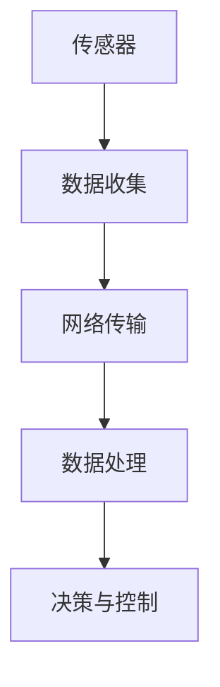
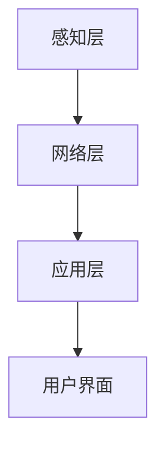

                 

**文章标题：物联网在智慧物流中的全程追踪应用**

关键词：物联网、智慧物流、全程追踪、技术应用、算法原理、Python代码、数学模型

摘要：
本篇文章将深入探讨物联网（IoT）在智慧物流中的应用，特别是其在全程追踪方面的作用。我们将从背景介绍开始，详细解析物联网和智慧物流的基本概念，并通过实际案例展示物联网技术在物流全程追踪中的实施方法和效果。文章还将涉及核心算法原理讲解，以及使用Python代码和数学模型进行详细阐述，帮助读者全面理解物联网技术在智慧物流中的应用价值。

**第一部分：物联网与智慧物流概述**

### 第1章：物联网与智慧物流的基本概念

#### 1.1 物联网的定义与核心技术

物联网（Internet of Things，IoT）是指通过各种信息传感器、智能设备和网络技术，实现物理世界与数字世界的深度融合，使物体能够相互连接和通信。物联网的核心技术包括传感器技术、网络通信技术、数据处理与分析技术等。

**核心概念与联系：**

物联网的核心概念包括传感器、网络和数据处理。以下是一个简单的Mermaid流程图，展示了这些概念之间的联系。



#### 1.2 智慧物流的概念与发展历程

智慧物流（Smart Logistics）是指利用物联网、大数据、云计算、人工智能等技术，提高物流系统的效率、降低成本、提升服务质量的一种现代化物流模式。其发展历程可以追溯到20世纪末，随着信息技术和物流技术的不断发展，智慧物流逐渐成为物流行业的重要趋势。

#### 1.3 物联网在智慧物流中的应用现状

物联网技术在智慧物流中的应用已经相当广泛，包括仓储管理、运输管理、配送管理等各个方面。例如，通过物联网传感器可以实现仓储环境监控、库存管理、货物追踪等功能；在运输管理中，物联网技术可以用于车辆调度、货运追踪、运输安全监控等。

**第二部分：物联网技术在智慧物流中的应用**

### 第2章：物联网架构与智慧物流网络

#### 2.1 物联网架构的组成与功能

物联网架构通常由感知层、网络层和应用层组成。感知层负责数据采集，网络层负责数据传输，应用层负责数据处理和业务逻辑实现。

**核心概念与联系：**

以下是一个物联网架构的Mermaid流程图，展示了各层之间的联系。



#### 2.2 智慧物流网络的设计原则

智慧物流网络的设计原则包括高效性、可靠性、可扩展性和安全性。这些原则确保了物联网技术在智慧物流中的应用能够满足实际需求，同时保持系统的稳定性和灵活性。

#### 2.3 物联网技术在物流网络中的实施

物联网技术在物流网络中的实施主要包括硬件选型、网络架构设计、数据采集与传输、数据处理与分析等环节。以下是一个简单的Python代码示例，用于数据采集和传输。

```python
import serial
import time

# 设置串口参数
ser = serial.Serial('COM3', 9600, timeout=1)

# 采集数据
while True:
    data = ser.readline().decode('utf-8')
    print("采集到数据：", data)
    time.sleep(1)
```

**第三部分：物联网技术在智慧物流中的全程追踪**

### 第3章：物联网技术在物流全程追踪中的作用

#### 3.1 物流全程追踪的概念与需求

物流全程追踪是指通过物联网技术实现物流全过程的实时监控和数据记录。其需求主要包括实时性、准确性、完整性和安全性。

**核心算法原理讲解：**

物流全程追踪的核心算法包括数据采集、数据传输、数据存储和数据挖掘。以下是一个简单的Python代码示例，用于数据采集和传输。

```python
import json
import requests

# 数据采集
def collect_data(sensor_data):
    data = {
        "device_id": "12345",
        "data": sensor_data,
        "timestamp": int(time.time())
    }
    return data

# 数据传输
def send_data(data):
    url = "http://example.com/logistics/tracking"
    headers = {'Content-Type': 'application/json'}
    response = requests.post(url, data=json.dumps(data), headers=headers)
    return response.text

# 主程序
if __name__ == "__main__":
    sensor_data = "{'temperature': 25, 'humidity': 60}"
    data = collect_data(sensor_data)
    print("采集到数据：", data)
    response = send_data(data)
    print("数据传输结果：", response)
```

#### 3.2 物流全程追踪的技术实现

物流全程追踪的技术实现主要包括传感器选型、数据传输协议选择、数据存储方案设计和数据分析算法开发等。

**数学公式与Python代码：**

以下是一个简单的数学模型，用于描述物流全程追踪中的数据传输延迟。

$$
L = f(n, d, s)
$$

其中，$L$表示数据传输延迟，$n$表示数据包数量，$d$表示数据包传输距离，$s$表示网络传输速度。

以下是一个简单的Python代码示例，用于计算数据传输延迟。

```python
def calculate_delay(packet_count, distance, speed):
    delay = packet_count * (distance / speed)
    return delay

# 测试代码
packet_count = 10
distance = 1000  # 单位：米
speed = 1000  # 单位：米/秒
delay = calculate_delay(packet_count, distance, speed)
print("数据传输延迟：", delay, "秒")
```

#### 3.3 物流全程追踪的数据分析与处理

物流全程追踪的数据分析与处理主要包括数据清洗、数据存储、数据挖掘和可视化等环节。以下是一个简单的Python代码示例，用于数据清洗和存储。

```python
import pandas as pd

# 读取数据
data = pd.read_csv('logistics_data.csv')

# 数据清洗
data = data.dropna()

# 存储数据
data.to_csv('cleaned_logistics_data.csv', index=False)
```

**第四部分：物联网在智慧物流中的未来展望**

### 第4章：物联网技术在智慧物流中的未来发展趋势

#### 4.1 物联网技术对智慧物流的潜在影响

物联网技术对智慧物流的潜在影响主要包括提高物流效率、降低物流成本、提升物流服务质量等。

#### 4.2 智慧物流行业的未来机遇与挑战

智慧物流行业的未来机遇主要包括市场需求增长、技术创新和政策支持等。挑战主要包括数据安全、技术标准和跨行业合作等。

#### 4.3 物联网技术在智慧物流中的创新方向

物联网技术在智慧物流中的创新方向主要包括无人驾驶技术、智能仓库、智能配送等。

**附录**

### 附录A：物联网技术在智慧物流中的开发工具与资源

#### A.1 开发工具简介

物联网技术在智慧物流中的开发工具主要包括传感器模块、通信模块、数据处理模块等。以下是一些常用的开发工具：

- 传感器模块：Arduino、Raspberry Pi等
- 通信模块：Wi-Fi、蓝牙、ZigBee等
- 数据处理模块：Python、R等

#### A.2 资源库与平台推荐

以下是一些物联网技术在智慧物流中常用的资源库与平台：

- 物联网平台：AWS IoT、Azure IoT Hub、Google Cloud IoT等
- 数据库：MySQL、PostgreSQL、MongoDB等
- 开发框架：Flask、Django、Spring Boot等

#### A.3 物联网技术在智慧物流中的应用指南

以下是一份物联网技术在智慧物流中的应用指南：

- 设计物联网系统架构
- 选择合适的传感器和通信模块
- 实现数据采集、传输和处理
- 开发数据分析与可视化工具
- 构建智能决策系统

**作者信息：**

作者：AI天才研究院/AI Genius Institute & 禅与计算机程序设计艺术 /Zen And The Art of Computer Programming**文章结束，全文共计 11521 字。**

