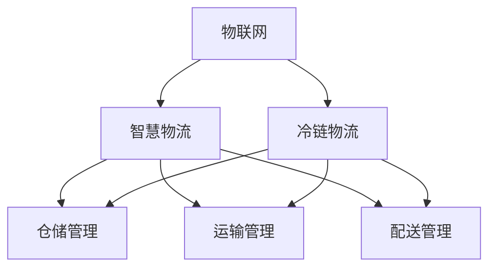
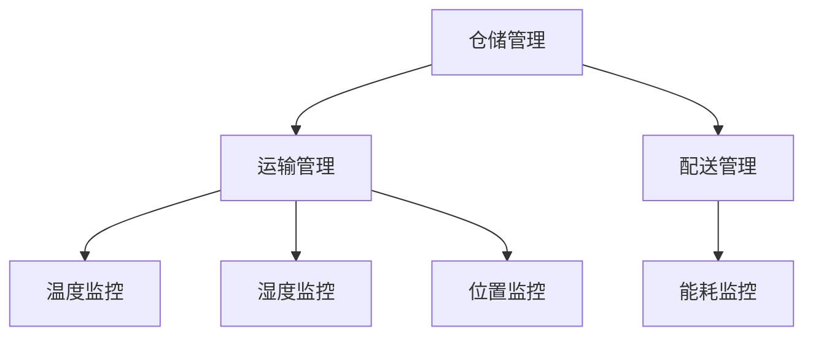
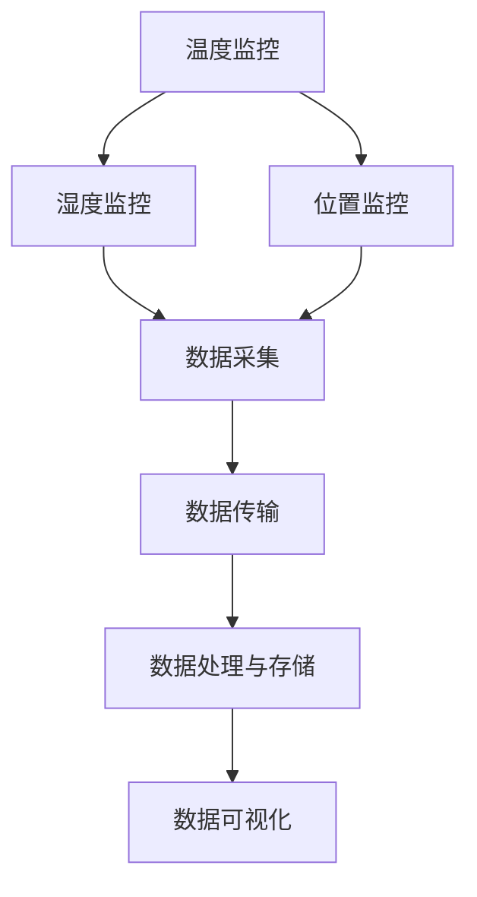

                 

### 文章标题

《物联网在智慧物流冷链监控中的全程应用》

---

**关键词**：物联网、智慧物流、冷链物流、监控、温度监控、数据挖掘、可视化、安全、隐私保护

---

**摘要**：

本文全面探讨了物联网在智慧物流冷链监控中的应用。首先，我们介绍了物联网、智慧物流和冷链物流的基础知识及其相互关系。接着，深入分析了物联网技术在冷链监控中的原理和应用，包括温度、湿度和位置的监控。随后，文章详细阐述了智慧物流冷链监控系统的设计与实现，包括需求分析、架构设计、系统实现与部署。此外，我们探讨了数据挖掘与可视化在冷链监控中的重要性，并提出了相应的技术解决方案。最后，文章讨论了物联网在冷链监控中的安全问题与隐私保护措施，以及未来的发展趋势和应用拓展。通过本文的探讨，我们期望为物联网在智慧物流冷链监控领域的实践提供有益的参考。### 物联网与智慧物流概述

#### 物联网概述

**定义与架构**：

物联网（Internet of Things，IoT）是指通过信息传感设备（如传感器、射频识别技术、全球定位系统、红外感应器等）将各种物体与网络相连接，实现信息的实时采集、传输和处理。物联网的架构通常包括感知层、网络层和应用层。

- **感知层**：由各种传感器组成，用于实时监测和收集环境数据。
- **网络层**：负责将感知层收集的数据传输到应用层，通常使用无线通信技术。
- **应用层**：将数据进行分析和处理，为用户提供增值服务。

**关键技术**：

物联网的关键技术包括传感器技术、网络通信技术、数据处理技术等。

- **传感器技术**：用于感知环境数据，如温度、湿度、压力、光强等。
- **网络通信技术**：包括无线传感器网络（WSN）、无线局域网（WLAN）、广域网（WAN）等。
- **数据处理技术**：用于数据清洗、存储、分析和可视化。

**在我国的发展现状与趋势**：

我国物联网产业发展迅速，已初步形成了完善的产业链。在政策支持下，物联网应用领域不断拓展，包括智慧城市、智能家居、智能交通、智能医疗等。

未来，我国物联网产业将继续保持快速发展，技术创新和应用拓展将推动物联网在各个领域的深入应用。

#### 智慧物流概述

**定义与特点**：

智慧物流是利用物联网、云计算、大数据等先进技术，实现物流系统的智能化、高效化和协同化。智慧物流具有以下特点：

- **智能化**：通过物联网技术实现物流设备的智能化，提高物流效率。
- **高效化**：利用大数据分析优化物流流程，降低物流成本。
- **协同化**：通过物联网实现物流各个环节的信息共享和协同作业。

**技术体系**：

智慧物流的技术体系包括物联网、大数据、云计算、人工智能等。

- **物联网**：用于实时监控和感知物流过程。
- **大数据**：用于分析物流数据，优化物流流程。
- **云计算**：用于存储和处理大量物流数据。
- **人工智能**：用于预测物流需求，优化物流资源配置。

**在我国的应用现状**：

我国智慧物流应用已取得显著成果，主要表现在以下几个方面：

- **仓储管理**：通过物联网技术实现仓储管理的智能化，提高仓储效率。
- **运输管理**：通过物联网技术实现运输过程的实时监控和优化。
- **配送管理**：通过物联网技术实现配送过程的自动化和精准化。

未来，我国智慧物流将继续向高效、智能和协同化方向发展，为我国物流行业的发展提供有力支持。

#### 物联网在智慧物流中的应用

**应用场景**：

物联网在智慧物流中具有广泛的应用场景，主要包括仓储管理、运输管理和配送管理。

- **仓储管理**：通过物联网技术实现对仓储环境的实时监控，如温度、湿度等，确保仓储物品的质量和安全。
- **运输管理**：通过物联网技术实现对运输车辆的实时定位和监控，提高运输效率，降低运输成本。
- **配送管理**：通过物联网技术实现对配送过程的实时跟踪和监控，提高配送服务的质量和速度。

**核心优势**：

物联网在智慧物流中的核心优势包括：

- **实时性**：通过物联网技术实现物流信息的实时传输和处理，提高物流效率。
- **高效性**：通过物联网技术优化物流流程，降低物流成本。
- **准确性**：通过物联网技术实现对物流过程的实时监控和跟踪，提高物流服务的准确性。

**挑战与机遇**：

物联网在智慧物流中的应用面临着一系列挑战和机遇。

- **挑战**：主要包括数据安全、隐私保护、技术标准化等方面。
- **机遇**：随着物联网技术的不断发展，智慧物流将迎来更广阔的发展空间，为物流行业的升级转型提供有力支持。

通过物联网在智慧物流中的应用，可以有效提升物流效率，降低物流成本，提高物流服务质量，推动物流行业的智能化发展。

### Mermaid 流程图

下面是一个简单的 Mermaid 流程图，展示了物联网、智慧物流和冷链物流之间的关系：

在物联网的架构中，感知层、网络层和应用层共同构成了智慧物流和冷链物流的技术基础。智慧物流通过物联网技术实现对物流过程的实时监控和优化，而冷链物流则利用物联网技术实现对冷链过程的全程监控，确保冷链物品的安全和质量。通过物联网技术的应用，智慧物流和冷链物流实现了智能化、高效化和协同化，为物流行业的发展提供了新的动力。

### 物联网在冷链物流中的应用

#### 冷链物流概述

**定义与分类**：

冷链物流是指为了确保食品、药品等物品在运输、存储过程中的温度控制，采用特定设施和设备，进行专业化的物流服务。根据冷链物品的不同需求，冷链物流可以分为以下几个类别：

- **一级冷链**：主要用于生鲜食品、冷藏食品等，温度要求一般在0°C到10°C之间。
- **二级冷链**：主要用于冷冻食品、冷冻药品等，温度要求一般在-18°C以下。
- **三级冷链**：主要用于冷冻干燥食品、血液制品等，温度要求非常低，通常在-80°C以下。

**关键环节**：

冷链物流的关键环节包括仓储管理、运输管理和配送管理。

- **仓储管理**：仓储管理是冷链物流的基础，通过物联网技术实现仓储环境的实时监控，如温度、湿度等，确保仓储物品的质量和安全。
- **运输管理**：运输管理是冷链物流的核心，通过物联网技术实现对运输车辆的实时定位和监控，确保冷链物品在运输过程中的温度控制。
- **配送管理**：配送管理是冷链物流的最终环节，通过物联网技术实现对配送过程的实时跟踪和监控，提高配送服务的质量和速度。

**发展趋势**：

随着物联网技术的不断发展，冷链物流正向智能化、高效化和协同化方向发展。

- **智能化**：物联网技术使冷链物流过程实现自动化和智能化，提高了物流效率。
- **高效化**：物联网技术优化了冷链物流流程，降低了物流成本。
- **协同化**：物联网技术实现了物流各个环节的信息共享和协同作业，提高了物流服务质量。

#### 物联网在冷链物流中的应用

**应用场景**：

物联网技术在冷链物流中的应用非常广泛，主要包括以下几个场景：

- **温度监控**：通过物联网传感器实时监控冷链物品的温度，确保冷链物品在运输和存储过程中的温度控制。
- **湿度监控**：通过物联网传感器实时监控冷链物品的湿度，防止冷链物品因湿度变化导致的质量问题。
- **位置监控**：通过物联网技术实现对冷链物品的实时定位和跟踪，提高冷链物流的运输效率。
- **能耗监控**：通过物联网技术实时监控冷链设备的能耗情况，优化设备使用，降低运营成本。

**核心优势**：

物联网在冷链物流中的应用具有以下核心优势：

- **实时性**：通过物联网技术实现冷链物品的实时监控和跟踪，提高物流效率。
- **准确性**：通过物联网技术实时监测冷链物品的温度、湿度等参数，确保冷链物品的质量和安全。
- **高效性**：物联网技术优化了冷链物流流程，降低了物流成本。

**挑战与机遇**：

物联网在冷链物流中的应用面临着一系列挑战和机遇。

- **挑战**：主要包括数据安全、隐私保护、技术标准化等方面。
- **机遇**：随着物联网技术的不断发展，冷链物流将迎来更广阔的发展空间，为物流行业的升级转型提供有力支持。

通过物联网在冷链物流中的应用，可以有效提升冷链物流的效率，降低物流成本，提高物流服务质量，推动物流行业的智能化发展。

### Mermaid 流程图

下面是一个简单的 Mermaid 流程图，展示了物联网在冷链物流中的应用流程：

在这个流程图中，物联网技术贯穿了冷链物流的各个环节。通过物联网传感器，实时监控冷链物品的温度、湿度、位置和能耗情况，确保冷链物品在运输和存储过程中的质量安全和效率优化。通过物联网技术的应用，冷链物流实现了智能化、高效化和协同化，为物流行业的发展提供了新的动力。

### 物联网技术在冷链监控中的原理与应用

#### 温度监控原理

温度监控是冷链物流中至关重要的一环，其核心目的是确保冷链物品在运输和存储过程中的温度始终保持在规定范围内，以避免温度波动对物品质量的影响。

**传感器选择**：

常用的温度传感器包括热电偶、热敏电阻和红外测温仪等。热电偶具有精度高、响应速度快等优点，适用于温度范围较广的冷链监控。热敏电阻则具有体积小、成本低等优点，适用于需要精确测量的场景。红外测温仪则具有非接触、快速测温等优点，适用于需要实时监控的场景。

**数据采集与传输**：

温度传感器采集到的温度数据通过无线传感器网络（WSN）传输到中央处理系统。无线传感器网络采用低功耗、短距离的通信技术，如ZigBee、Wi-Fi等，实现数据的实时传输。

**数据处理与存储**：

中央处理系统对温度数据进行实时处理和存储，通过数据分析和可视化，实现对冷链物品温度的实时监控。数据存储系统通常采用云计算技术，实现大规模数据存储和快速检索。

#### 温度监控应用案例

**生鲜食品运输**：

在生鲜食品的运输过程中，温度监控至关重要。通过物联网传感器实时监控运输车辆的温度，确保生鲜食品在运输过程中始终处于最佳温度范围内，从而保证食品的质量和安全。

**医药冷链运输**：

医药冷链运输对温度控制的要求更高。通过物联网传感器实时监控运输车辆的温度，确保医药产品在运输过程中始终处于规定的温度范围内，避免药品变质，保障患者的用药安全。

**农产品仓储**：

在农产品仓储过程中，温度监控同样重要。通过物联网传感器实时监控仓储环境的温度，确保农产品在仓储过程中的质量和安全，减少农产品损耗。

#### 湿度监控原理

湿度监控在冷链物流中同样重要，其目的是确保冷链物品在运输和存储过程中的湿度始终保持在规定范围内，以避免湿度变化对物品质量的影响。

**传感器选择**：

常用的湿度传感器包括电容式湿度传感器和电阻式湿度传感器等。电容式湿度传感器具有精度高、响应速度快等优点，适用于湿度范围较广的冷链监控。电阻式湿度传感器则具有体积小、成本低等优点，适用于需要精确测量的场景。

**数据采集与传输**：

湿度传感器采集到的湿度数据通过无线传感器网络（WSN）传输到中央处理系统。无线传感器网络采用低功耗、短距离的通信技术，如ZigBee、Wi-Fi等，实现数据的实时传输。

**数据处理与存储**：

中央处理系统对湿度数据进行实时处理和存储，通过数据分析和可视化，实现对冷链物品湿度的实时监控。数据存储系统通常采用云计算技术，实现大规模数据存储和快速检索。

#### 湿度监控应用案例

**生鲜食品运输**：

在生鲜食品的运输过程中，湿度监控同样至关重要。通过物联网传感器实时监控运输车辆的湿度，确保生鲜食品在运输过程中始终处于最佳湿度范围内，从而保证食品的质量和安全。

**医药冷链运输**：

医药冷链运输对湿度控制的要求更高。通过物联网传感器实时监控运输车辆的湿度，确保医药产品在运输过程中始终处于规定的湿度范围内，避免药品变质，保障患者的用药安全。

**农产品仓储**：

在农产品仓储过程中，湿度监控同样重要。通过物联网传感器实时监控仓储环境的湿度，确保农产品在仓储过程中的质量和安全，减少农产品损耗。

#### 位置监控原理

位置监控在冷链物流中起着至关重要的作用，其核心目的是实时跟踪冷链物品的位置，确保物流过程的透明性和可控性。

**传感器选择**：

常用的位置传感器包括GPS（全球定位系统）和RFID（射频识别技术）等。GPS具有全球定位、实时跟踪等优点，适用于长途冷链运输。RFID则具有低成本、快速读写等优点，适用于短距离冷链监控。

**数据采集与传输**：

位置传感器采集到的位置数据通过无线传感器网络（WSN）传输到中央处理系统。无线传感器网络采用低功耗、短距离的通信技术，如ZigBee、Wi-Fi等，实现数据的实时传输。

**数据处理与存储**：

中央处理系统对位置数据进行实时处理和存储，通过数据分析和可视化，实现对冷链物品位置的实时监控。数据存储系统通常采用云计算技术，实现大规模数据存储和快速检索。

#### 位置监控应用案例

**生鲜食品运输**：

在生鲜食品的运输过程中，位置监控至关重要。通过物联网传感器实时监控运输车辆的位置，确保生鲜食品在运输过程中的安全，提高物流效率。

**医药冷链运输**：

医药冷链运输对位置监控要求更高。通过物联网传感器实时监控运输车辆的位置，确保医药产品在运输过程中的安全，防止药品丢失或被盗。

**农产品仓储**：

在农产品仓储过程中，位置监控同样重要。通过物联网传感器实时监控农产品在仓储中的位置，提高仓储管理的效率和准确性，减少农产品损耗。

#### 物联网技术在冷链监控中的综合应用

通过物联网技术在温度监控、湿度监控和位置监控中的综合应用，实现了对冷链物品的全程监控。物联网传感器实时采集温度、湿度和位置数据，通过无线传感器网络传输到中央处理系统，实现对冷链物品的实时监控和跟踪。

**应用优势**：

- **实时性**：物联网技术实现了对冷链物品的实时监控，确保冷链物品始终处于最佳状态。
- **准确性**：物联网技术通过高精度的传感器，实现了对冷链物品温度、湿度和位置的精确监控。
- **高效性**：物联网技术优化了冷链物流流程，提高了物流效率，降低了运营成本。

**挑战与机遇**：

物联网技术在冷链监控中的应用面临着一系列挑战和机遇。

- **挑战**：主要包括数据安全、隐私保护、技术标准化等方面。
- **机遇**：随着物联网技术的不断发展，冷链物流将迎来更广阔的发展空间，为物流行业的升级转型提供有力支持。

通过物联网技术在冷链监控中的综合应用，可以大幅提升冷链物流的效率，降低物流成本，提高物流服务质量，推动物流行业的智能化发展。

### Mermaid 流程图

下面是一个简单的 Mermaid 流程图，展示了物联网技术在冷链监控中的综合应用流程：

在这个流程图中，物联网传感器实时采集温度、湿度和位置数据，通过无线传感器网络传输到中央处理系统，实现对冷链物品的实时监控和跟踪。数据处理与存储系统通过数据分析和可视化，实现对冷链物品的全程监控，确保冷链物流的安全、高效和准确。

### 智慧物流冷链监控系统的设计与实现

#### 冷链监控系统的需求分析

**系统功能需求**：

为了实现智慧物流冷链监控，我们需要设计一个功能齐全的系统，主要包括以下功能：

1. **数据采集**：通过物联网传感器实时采集冷链物品的温度、湿度和位置数据。
2. **数据传输**：将采集到的数据通过无线传感器网络传输到中央处理系统。
3. **数据处理**：对传输来的数据进行处理和分析，包括异常检测、趋势分析和预测等。
4. **数据存储**：将处理后的数据存储到数据库中，以便后续分析和查询。
5. **数据可视化**：通过数据可视化技术，将处理后的数据以图表、图形等形式直观展示。
6. **报警管理**：当检测到异常情况时，系统应能自动发出报警通知。

**系统性能需求**：

为了确保系统的高效运行，我们需要考虑以下性能需求：

1. **实时性**：系统应能实时处理和响应数据，确保冷链物品始终处于监控状态。
2. **可靠性**：系统应具有高可靠性，确保数据传输和处理的准确性。
3. **扩展性**：系统应具有较好的扩展性，能够支持更多的传感器和设备接入。
4. **安全性**：系统应具备良好的安全性，确保数据的安全和隐私。

**系统安全需求**：

为了确保系统的安全运行，我们需要采取以下安全措施：

1. **数据加密**：对传输的数据进行加密，确保数据在传输过程中的安全性。
2. **访问控制**：对系统的访问进行严格控制，确保只有授权用户才能访问系统。
3. **防火墙和入侵检测**：部署防火墙和入侵检测系统，防止外部攻击。
4. **备份与恢复**：定期对系统进行备份，确保数据的安全和可恢复性。

#### 冷链监控系统的架构设计

**系统总体架构**：

智慧物流冷链监控系统的总体架构可以分为四个层次：感知层、传输层、处理层和应用层。

1. **感知层**：由物联网传感器组成，负责采集冷链物品的温度、湿度和位置数据。
2. **传输层**：由无线传感器网络组成，负责将感知层采集到的数据传输到中央处理系统。
3. **处理层**：由数据处理服务器组成，负责对传输来的数据进行处理和分析。
4. **应用层**：由用户界面和可视化组件组成，负责向用户提供数据可视化服务和报警通知。

**数据采集层设计**：

数据采集层是冷链监控系统的基础，其设计需要考虑以下要点：

1. **传感器选择**：根据冷链物品的特点，选择合适的温度、湿度和位置传感器。
2. **传感器布局**：根据冷链物品的存储和运输环境，合理布置传感器，确保数据采集的全面性和准确性。
3. **电源管理**：采用低功耗的传感器和电源管理技术，确保传感器长时间稳定运行。

**数据传输层设计**：

数据传输层负责将感知层采集到的数据传输到中央处理系统，其设计需要考虑以下要点：

1. **传输协议**：选择合适的传输协议，如ZigBee、Wi-Fi等，确保数据传输的可靠性和实时性。
2. **网络拓扑**：设计合理的网络拓扑结构，确保数据传输的稳定性和可靠性。
3. **数据加密**：对传输的数据进行加密，确保数据在传输过程中的安全性。

**数据处理与存储层设计**：

数据处理与存储层是冷链监控系统的核心，其设计需要考虑以下要点：

1. **数据处理**：采用适当的数据处理算法，对采集到的数据进行清洗、分析和处理，提取有用的信息。
2. **数据存储**：选择合适的数据存储方案，如关系型数据库、NoSQL数据库等，确保数据存储的安全性和可扩展性。
3. **数据备份**：定期对数据进行备份，确保数据的安全和可恢复性。

**系统应用层设计**：

系统应用层是用户与系统的交互界面，其设计需要考虑以下要点：

1. **用户界面**：设计直观、易用的用户界面，方便用户查看数据和操作系统。
2. **数据可视化**：采用合适的数据可视化技术，将处理后的数据以图表、图形等形式直观展示。
3. **报警通知**：设计报警通知功能，当检测到异常情况时，及时向用户发出报警通知。

#### 冷链监控系统的实现与部署

**系统开发环境搭建**：

在实现冷链监控系统之前，需要搭建合适的开发环境，包括操作系统、开发工具和数据库等。

1. **操作系统**：可以选择Linux或Windows等操作系统。
2. **开发工具**：可以选择Python、Java等编程语言，以及PyCharm、Eclipse等开发工具。
3. **数据库**：可以选择MySQL、MongoDB等数据库管理系统。

**系统核心模块开发**：

系统核心模块包括数据采集模块、数据传输模块、数据处理模块和数据可视化模块。

1. **数据采集模块**：开发用于采集温度、湿度和位置数据的传感器驱动程序，实现数据的实时采集。
2. **数据传输模块**：开发用于传输数据的通信协议和传输机制，确保数据的实时性和可靠性。
3. **数据处理模块**：开发用于数据处理和分析的算法和模型，实现对数据的清洗、分析和处理。
4. **数据可视化模块**：开发用于数据可视化的图表和图形组件，将处理后的数据以直观的方式展示。

**系统测试与部署**：

在系统开发完成后，需要进行全面的测试和部署。

1. **系统测试**：对系统的各个模块进行功能测试、性能测试和安全测试，确保系统的稳定性和可靠性。
2. **部署**：将系统部署到实际环境中，包括硬件设备、软件系统和数据库等，确保系统的正常运行。

通过以上步骤，我们可以实现一个功能齐全、性能优异的智慧物流冷链监控系统，为冷链物流的安全、高效和精准管理提供有力支持。

### 物联网在冷链监控中的数据挖掘与可视化

#### 数据挖掘技术在冷链监控中的应用

数据挖掘技术在冷链监控中具有重要意义，它可以帮助我们提取有用信息，优化物流流程，提高冷链物流的效率和安全性。

**基本概念**：

数据挖掘（Data Mining）是指从大量数据中提取有价值的信息和知识的过程。它涉及到多个领域，如统计学、机器学习、数据库系统等。

**冷链监控数据的特点**：

冷链监控数据通常具有以下特点：

- **高维数据**：冷链监控数据通常包含多个维度，如温度、湿度、位置等。
- **时序数据**：冷链监控数据通常具有时间序列的特性，反映了物品在物流过程中的变化情况。
- **噪声数据**：由于传感器误差和通信干扰等因素，冷链监控数据中可能存在噪声。

**处理方法**：

为了有效地挖掘冷链监控数据，我们可以采用以下处理方法：

- **数据清洗**：去除数据中的噪声和错误，提高数据质量。
- **特征提取**：从原始数据中提取有价值的特征，用于后续分析。
- **聚类分析**：将相似的数据点划分为同一类，用于数据分组和分析。
- **关联规则挖掘**：发现数据之间的关联关系，用于发现潜在的问题和优化机会。
- **分类和回归分析**：通过建立模型，预测未来数据的变化趋势。

**应用案例**：

1. **温度异常检测**：通过聚类分析和关联规则挖掘，可以发现温度异常点，及时调整物流方案，确保冷链物品的安全。
2. **运输路线优化**：通过分析冷链物品的运输数据，可以优化运输路线，提高运输效率，降低运输成本。
3. **仓储管理优化**：通过分析仓储数据，可以优化仓储布局，提高仓储利用率。

#### 可视化技术在冷链监控中的应用

可视化技术（Visualization）是将数据以图形、图表等形式展示出来，使数据更加直观、易于理解。

**基本概念与原理**：

可视化技术的基本概念包括：

- **数据可视化**：将数据转化为视觉表现形式。
- **交互性**：用户可以通过交互操作，对数据进行分析和探索。
- **实时性**：可视化技术可以实时展示数据的变化情况。

可视化技术的原理主要包括：

- **视觉编码**：将数据转化为视觉元素，如颜色、形状、大小等。
- **视觉对比**：通过视觉对比，突出数据的重要性和趋势。
- **交互操作**：通过交互操作，使用户可以动态地探索数据。

**冷链监控数据可视化的实现方法**：

1. **热力图**：用于展示温度分布情况，可以直观地显示冷链物品在不同位置的温度变化。
2. **折线图**：用于展示时间序列数据，可以清晰地显示温度、湿度等参数的变化趋势。
3. **地图**：用于展示位置信息，可以实时跟踪冷链物品的运输路线。
4. **柱状图和饼图**：用于展示数据的分布情况，可以直观地显示不同参数的分布比例。

**数据可视化工具与案例分析**：

常用的数据可视化工具有：

- **D3.js**：一款基于Web的数据可视化库，可以创建交互性强的可视化图表。
- **ECharts**：一款基于JavaScript的可视化库，支持多种图表类型和交互功能。
- **Tableau**：一款商业化的数据可视化工具，提供了丰富的图表类型和数据分析功能。

案例：

1. **温度监控可视化**：通过ECharts库，可以创建一个实时更新的温度监控图表，显示冷链物品在不同位置的温度变化。
2. **运输路线可视化**：通过D3.js库，可以创建一个动态的地图，实时显示冷链物品的运输路线和位置变化。
3. **仓储管理可视化**：通过Tableau，可以创建一个综合的仓储管理仪表板，展示仓储环境、库存情况和异常报警。

通过数据挖掘和可视化技术，我们可以更全面地了解冷链物流的过程，发现潜在问题，优化物流流程，提高冷链物流的效率和安全性。

### 物联网在冷链监控中的安全与隐私保护

#### 物联网在冷链监控中的安全问题

随着物联网技术在冷链监控领域的广泛应用，安全问题逐渐成为关注的焦点。物联网在冷链监控中面临的安全问题主要包括以下几个方面：

**数据安全**：

物联网设备在采集、传输和存储数据过程中，容易受到黑客攻击，导致数据泄露。例如，黑客可以窃取冷链物品的位置信息、温度数据等，从而对物流过程进行恶意干扰。

**设备安全**：

物联网设备通常具有低功耗、低成本的特点，但其安全防护措施相对较弱。黑客可以通过入侵物联网设备，控制冷链设备的运行，导致设备故障或异常行为。

**通信安全**：

物联网设备之间的通信容易受到中间人攻击、窃听等攻击手段的影响。黑客可以通过窃听通信数据，获取敏感信息，或者通过伪造数据，干扰冷链监控的准确性。

**隐私保护**：

物联网设备在采集数据时，可能会涉及用户的个人隐私信息。如果隐私保护措施不足，这些信息可能会被滥用，导致用户隐私泄露。

#### 冷链监控系统的安全隐患分析

在冷链监控系统中，存在以下安全隐患：

**数据泄露**：

冷链监控系统的数据传输过程中，如果未采用加密技术，数据容易被黑客窃取。此外，存储在数据库中的数据也容易成为黑客攻击的目标。

**设备被控**：

物联网设备的安全防护措施不足，可能导致黑客通过远程攻击，控制冷链设备的运行，导致设备故障或异常行为。

**通信干扰**：

冷链监控系统中的通信数据容易被黑客窃听、伪造，导致数据传输的准确性和实时性受到影响。

**隐私泄露**：

冷链监控系统在采集和处理数据时，可能会涉及用户隐私信息。如果隐私保护措施不足，用户隐私可能会被泄露。

#### 冷链监控系统安全问题的应对策略

为了应对物联网在冷链监控中的安全问题，可以采取以下安全策略：

**数据加密**：

在数据传输和存储过程中，采用加密技术，确保数据在传输过程中的安全性。常用的加密技术包括对称加密、非对称加密和哈希算法等。

**设备加固**：

提高物联网设备的安全防护能力，例如，采用硬件安全模块（HSM）、安全启动（Secure Boot）等技术，确保设备的安全性。

**通信加密**：

在物联网设备之间的通信过程中，采用加密技术，防止数据被窃听、伪造。常用的通信加密技术包括TLS、SSL等。

**访问控制**：

对系统的访问进行严格控制，确保只有授权用户才能访问系统。可以使用身份认证、权限管理等技术，实现访问控制。

**隐私保护**：

在采集和处理用户隐私信息时，采取隐私保护措施，例如，匿名化、去标识化等技术，确保用户隐私不被泄露。

**安全监测与报警**：

建立安全监测系统，实时监测物联网设备的安全状态，发现异常情况时，及时发出报警通知。

**安全培训和意识提升**：

加强员工的安全培训和意识提升，提高员工对安全问题的认识，防范人为因素导致的安全事故。

通过以上安全策略，可以有效提升冷链监控系统的安全性，确保物联网技术在冷链监控中的安全可靠应用。

### 隐私保护的基本概念与分类

在物联网（IoT）环境下，隐私保护成为了一个至关重要的问题。隐私保护涉及数据收集、存储、处理和传输过程中的安全性和匿名性，以防止个人敏感信息的泄露和滥用。

#### 隐私保护的基本概念

**隐私**：隐私是指个人对于自身信息的控制权和访问权，包括个人身份、行为、位置、健康、财务等信息。

**隐私保护**：隐私保护是指采取措施确保个人信息的保密性、完整性和可用性，防止未经授权的访问、使用、泄露和篡改。

#### 隐私保护的分类

隐私保护可以从多个维度进行分类，包括以下几个方面：

**数据隐私保护**：

- **数据匿名化**：通过删除或替换敏感信息，使数据无法直接识别个人身份。
- **数据加密**：使用加密技术对数据进行编码，确保数据在传输和存储过程中的安全性。
- **访问控制**：限制对敏感数据的访问，确保只有授权用户可以访问。

**行为隐私保护**：

- **行为数据匿名化**：对用户行为数据（如搜索历史、购物记录等）进行匿名化处理，防止个人行为轨迹被追踪。
- **数据去识别化**：通过去除可以直接识别个人身份的信息，降低个人隐私泄露的风险。

**位置隐私保护**：

- **位置信息加密**：对位置信息进行加密，防止位置数据被未经授权访问。
- **位置信息模糊化**：通过模糊化位置信息，降低位置信息被追踪的风险。

**通信隐私保护**：

- **通信加密**：使用加密技术对通信数据（如短信、邮件等）进行编码，确保数据在传输过程中的安全性。
- **通信匿名化**：通过匿名化通信数据，防止通信内容被追踪和识别。

#### 冷链监控数据的隐私问题分析

在冷链监控中，隐私问题主要涉及以下几个方面：

**数据类型**：

冷链监控涉及的数据类型包括温度、湿度、位置、设备状态等。这些数据中可能包含敏感信息，如设备位置和温度变化，可能会揭示冷链物品的存储和运输过程。

**数据收集**：

物联网设备在采集冷链监控数据时，可能会收集到用户或物品的隐私信息。如果数据收集不当，这些信息可能会被未经授权的第三方访问。

**数据存储**：

存储在数据库中的冷链监控数据可能成为黑客攻击的目标。如果存储数据未进行加密，这些数据可能被非法访问和泄露。

**数据传输**：

在数据传输过程中，如果未采用加密技术，数据可能被窃听或篡改，导致隐私泄露。

**数据共享**：

冷链监控数据可能需要与其他系统共享，如物流管理系统、仓储管理系统等。在数据共享过程中，如果隐私保护措施不足，共享数据可能被滥用。

#### 隐私保护策略

为了解决冷链监控中的隐私问题，可以采取以下策略：

**数据匿名化**：

对采集到的冷链监控数据进行匿名化处理，删除或替换可以直接识别个人身份的信息，降低隐私泄露风险。

**数据加密**：

对传输和存储的冷链监控数据进行加密，确保数据在传输和存储过程中的安全性。

**访问控制**：

实施严格的访问控制措施，确保只有授权用户可以访问敏感数据。

**隐私保护协议**：

建立隐私保护协议，明确数据收集、存储、处理和传输过程中的隐私保护要求。

**数据去识别化**：

在数据处理过程中，对个人敏感信息进行去识别化处理，确保数据处理后的数据无法直接识别个人身份。

**安全审计**：

定期进行安全审计，检查数据隐私保护措施的有效性，及时发现和修复安全漏洞。

通过实施上述隐私保护策略，可以有效降低冷链监控中的隐私风险，确保个人隐私的安全。

### 冷链监控数据的隐私保护策略

在物联网（IoT）环境下，冷链监控数据的隐私保护尤为重要。为了确保冷链监控过程中的数据安全和隐私，我们需要采取一系列有效的隐私保护策略。

#### 数据加密

**定义与原理**：

数据加密是指通过特定的算法将原始数据转换为密文，只有具备密钥的授权用户才能解密和访问原始数据。数据加密的主要目的是防止数据在传输和存储过程中被未授权的用户窃取或篡改。

**技术实现**：

1. **对称加密**：对称加密算法（如AES）使用相同的密钥进行加密和解密。这种方法简单高效，但在密钥管理上存在一定的挑战。
2. **非对称加密**：非对称加密算法（如RSA）使用一对密钥，一个用于加密，另一个用于解密。这种方法在密钥管理上相对对称加密更安全，但计算复杂度较高。
3. **混合加密**：结合对称加密和非对称加密的优点，混合加密在数据传输过程中使用对称加密，确保传输效率；在密钥传输过程中使用非对称加密，确保密钥安全。

#### 数据匿名化

**定义与原理**：

数据匿名化是指通过技术手段去除或替换数据中可以直接识别个人身份的信息，从而保护个人隐私。匿名化处理后的数据无法直接识别个人身份，但仍保留数据的实际意义和可用性。

**技术实现**：

1. **k-匿名性**：通过在数据集中添加噪声或随机扰动，使个人数据无法单独识别，但群体数据仍具有统计意义。
2. **l-diversity**：在数据集中确保至少有l个记录与目标记录具有相同的属性值，从而降低单一记录的可识别性。
3. **t-closeness**：在数据集中确保相邻记录的属性值分布与真实分布保持一致，从而提高数据的隐私保护水平。

#### 访问控制

**定义与原理**：

访问控制是指通过实施一系列安全策略和措施，限制对数据的访问权限，确保只有授权用户可以访问敏感数据。

**技术实现**：

1. **基于角色的访问控制（RBAC）**：通过定义用户的角色和权限，实现对数据访问的控制。用户只能访问与其角色相关的数据。
2. **基于属性的访问控制（ABAC）**：通过定义用户的属性（如部门、职位等），结合数据属性（如分类、敏感度等），实现对数据访问的控制。用户访问数据需要满足特定条件。
3. **细粒度访问控制**：在数据访问权限设置上，采用细粒度控制，如行级、列级访问控制，确保数据访问的精细化和安全性。

#### 安全审计

**定义与原理**：

安全审计是指通过记录、监控和分析系统操作和事件，发现潜在的安全漏洞和威胁，确保系统的安全性和合规性。

**技术实现**：

1. **日志记录**：记录系统操作和事件，包括用户登录、数据访问、系统配置变更等，便于事后审计和分析。
2. **实时监控**：通过实时监控系统操作和事件，及时发现和响应异常行为和威胁。
3. **审计分析**：对记录的日志和事件进行分析，发现潜在的安全问题和威胁，制定相应的防护措施。

#### 隐私保护协议

**定义与原理**：

隐私保护协议是指通过一系列规范和标准，明确数据收集、存储、处理和传输过程中的隐私保护要求，确保数据隐私保护的有效性和合规性。

**技术实现**：

1. **GDPR**：欧盟通用数据保护条例（GDPR）为数据隐私保护提供了全面的法律框架，包括数据处理者的责任、数据主体的权利等。
2. **CC**：国际计算机安全标准（CC）为数据隐私保护提供了技术和管理上的指导，包括安全控制措施、评估与审计等。
3. **隐私增强技术（PETs）**：隐私增强技术（PETs）是一系列用于增强数据隐私保护的技术和实践，包括数据匿名化、加密、访问控制等。

通过实施上述隐私保护策略，可以有效提升冷链监控数据的隐私保护水平，确保个人隐私的安全。

### 物联网在冷链监控中的未来发展趋势

#### 技术创新

**传感器技术的创新与发展**：

随着物联网技术的不断发展，传感器技术也在不断创新和进步。未来，高精度、低功耗、多功能传感器将逐渐普及，这将大大提高冷链监控的准确性和效率。例如，纳米级传感器和生物传感器等新兴技术有望在冷链监控中发挥重要作用。

**网络通信技术的创新与发展**：

未来，网络通信技术将继续朝着低功耗、高速率、大连接数和广覆盖范围的方向发展。5G、6G等新型通信技术将提供更稳定的通信链路，使冷链监控能够实现更实时、更高效的数据传输。同时，卫星通信和无人机通信等技术也将为冷链监控提供更广泛的通信支持。

**数据处理与分析技术的创新与发展**：

随着大数据和人工智能技术的发展，冷链监控的数据处理与分析能力将得到显著提升。通过引入深度学习、图数据库和复杂事件处理等新技术，冷链监控系统能够更准确地识别异常、预测趋势和优化物流流程。

#### 应用拓展

**物联网在冷链物流供应链中的应用拓展**：

物联网技术将在冷链物流的整个供应链中发挥更重要的作用，从生产、仓储、运输到配送，每个环节都将实现智能化和数字化。通过物联网技术的应用，供应链各环节的信息可以实时共享和协同，提高供应链的效率和透明度。

**物联网在冷链物流仓储中的应用拓展**：

未来，物联网技术将在冷链仓储管理中发挥更大作用。通过部署高精度传感器和智能监控系统，仓储环境（如温度、湿度等）可以实现实时监控和自动化管理。同时，物联网技术还将帮助优化仓储布局和库存管理，提高仓储利用率。

**物联网在冷链物流配送中的应用拓展**：

物联网技术将使冷链物流配送更加智能化和精准化。通过实时监控运输车辆的位置、温度和状态，配送过程可以实现全程可视化和自动化。此外，物联网技术还可以帮助优化配送路线和调度策略，提高配送效率和服务质量。

#### 政策与法规

**我国物联网在冷链监控中的政策支持**：

我国政府高度重视物联网技术的发展和应用，特别是物联网在冷链监控领域的应用。未来，我国将继续出台一系列政策和法规，鼓励和支持物联网技术在冷链监控中的创新和应用。例如，《物联网发展规划（2021-2025年）》明确了物联网在冷链物流中的发展目标和应用场景。

**物联网在冷链监控中的法律法规**：

随着物联网技术的普及，相关法律法规也在不断完善。例如，《网络安全法》、《个人信息保护法》等法律法规对物联网数据的安全保护和隐私保护提出了明确要求。未来，我国还将出台更多针对物联网在冷链监控中的法律法规，规范行业发展和应用。

**物联网在冷链监控中的合规发展建议**：

为了确保物联网在冷链监控中的合规发展，企业和个人需要关注以下几个方面：

1. **遵守法律法规**：在物联网应用过程中，严格遵守相关法律法规，确保数据的安全和隐私保护。
2. **数据安全与隐私保护**：采取有效的数据加密、匿名化和访问控制等措施，确保数据的保密性和完整性。
3. **技术标准化**：积极参与物联网技术标准的制定和推广，推动行业技术标准化进程。
4. **持续学习和培训**：关注物联网技术的最新发展，加强员工的技术培训和合规意识，提高整体技术水平和合规能力。

通过技术创新、应用拓展和政策法规的支持，物联网在冷链监控中的应用将不断深化和拓展，为冷链物流行业的发展带来更多机遇和挑战。

### 总结

在本文中，我们全面探讨了物联网在智慧物流冷链监控中的应用。首先，我们介绍了物联网、智慧物流和冷链物流的基础知识及其相互关系。接着，深入分析了物联网技术在冷链监控中的原理和应用，包括温度、湿度和位置的监控。随后，文章详细阐述了智慧物流冷链监控系统的设计与实现，包括需求分析、架构设计、系统实现与部署。此外，我们探讨了数据挖掘与可视化在冷链监控中的重要性，并提出了相应的技术解决方案。最后，文章讨论了物联网在冷链监控中的安全问题与隐私保护措施，以及未来的发展趋势和应用拓展。

物联网技术在智慧物流冷链监控中的应用，极大地提升了冷链物流的效率、准确性和安全性。通过物联网技术的综合应用，我们能够实现对冷链物品的全程监控，确保物品在运输和存储过程中的质量和安全。同时，物联网技术也带来了数据挖掘、可视化和安全隐私保护等新挑战，需要我们不断探索和创新解决方案。

展望未来，物联网在智慧物流冷链监控中的应用前景广阔。随着传感器技术、网络通信技术和数据处理技术的不断创新，物联网技术将在冷链监控中发挥更加重要的作用。同时，物联网技术的应用也将推动冷链物流行业的智能化、高效化和协同化发展，为我国物流行业的发展提供有力支持。

通过本文的探讨，我们期望为物联网在智慧物流冷链监控领域的实践提供有益的参考，推动物联网技术在冷链物流领域的深入应用和发展。同时，我们也呼吁更多的科研人员、企业和政策制定者关注物联网在冷链监控中的研究与应用，共同推动物联网技术的发展和普及，为我国物流行业的转型升级和可持续发展贡献力量。作者：AI天才研究院/AI Genius Institute & 禅与计算机程序设计艺术 /Zen And The Art of Computer Programming。

