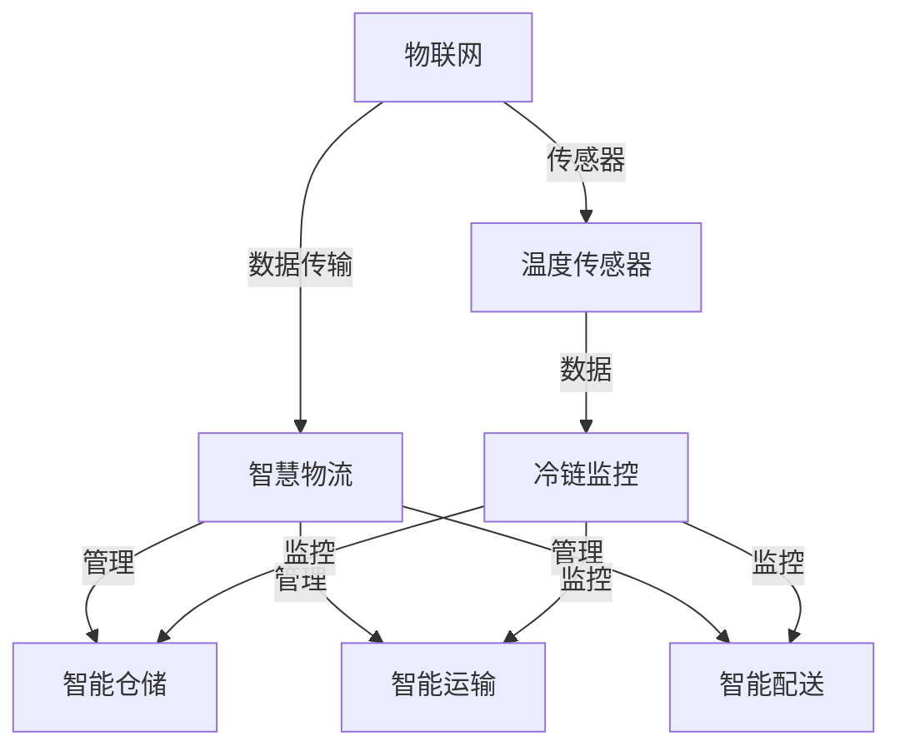

                 

### 背景介绍

#### 物联网的发展历程

物联网（Internet of Things，IoT）作为一个概念，最早可以追溯到1999年，由麻省理工学院的Kevin Ashton首次提出。物联网的基本理念是通过将各种日常物品连接到互联网，使它们能够互相通信和交换数据，从而实现智能化管理和自动化控制。物联网的发展历程可以分为以下几个阶段：

1. **初步探索阶段（1999-2005年）**：这一阶段主要聚焦于将物理世界中的对象与互联网连接起来，并探索数据传输和共享的机制。代表性技术包括RFID（射频识别）和传感器网络。

2. **快速成长阶段（2006-2010年）**：随着无线通信技术的发展，物联网逐渐从实验室走向实际应用。智能家居、智能交通和工业自动化成为物联网应用的热点领域。

3. **成熟应用阶段（2011-至今）**：物联网技术逐渐成熟，应用范围进一步扩大。大数据、云计算和人工智能等技术的融合，使得物联网系统的智能化程度和数据处理能力显著提升。

#### 智慧物流的发展背景

智慧物流是物联网在物流领域中的应用，旨在通过物联网、大数据、人工智能等技术，实现物流系统的智能化、自动化和高效化。智慧物流的发展背景主要包括以下几个方面：

1. **市场需求**：随着全球电商的迅猛发展，物流行业面临着巨大的市场需求，需要提高运输效率、降低物流成本、提升服务质量。

2. **技术进步**：物联网、大数据、云计算、人工智能等技术的不断进步，为智慧物流提供了强大的技术支持。

3. **政策支持**：全球各国政府纷纷出台政策，推动智慧物流的发展，如中国的“互联网+”行动、美国的“智慧物流国家战略”等。

#### 冷链监控的重要性

冷链监控是指对食品、药品等需要在特定温度环境下运输和储存的物品进行实时监控和管理。冷链监控的重要性主要体现在以下几个方面：

1. **食品安全**：冷链监控可以确保食品在运输和储存过程中的温度始终保持在安全范围内，防止食品变质，保障消费者健康。

2. **药品质量**：对于药品，尤其是生物制品和低温药品，冷链监控可以保证药品的有效性和安全性。

3. **供应链效率**：通过冷链监控，可以实时了解货物在运输过程中的状态，及时调整运输路线和策略，提高供应链效率。

### 物联网、智慧物流与冷链监控的关系

物联网、智慧物流和冷链监控之间存在密切的联系和互动。物联网技术为智慧物流和冷链监控提供了数据采集、传输和处理的基础设施，使得物流过程可以实现实时监控和智能化管理。智慧物流则通过物联网技术，实现了物流系统的自动化和智能化，提高了运输效率和供应链管理水平。冷链监控作为智慧物流的一个重要环节，通过物联网技术，实现了对冷链货物的实时监控和管理，确保了食品安全和药品质量。综上所述，物联网、智慧物流和冷链监控相互促进，共同构建了一个高效、智能和安全的物流生态系统。

### 核心概念与联系

在物联网、智慧物流和冷链监控中，存在多个核心概念，它们相互联系，共同构建了一个复杂而庞大的系统。以下是对这些核心概念及其关系的详细解析。

#### 物联网（IoT）

物联网是指将各种物理设备、传感器、软件和网络连接起来，实现设备间的通信和数据交换。其核心概念包括：

1. **传感器**：物联网中的传感器用于检测环境中的各种物理量，如温度、湿度、光照等，并将这些信息转换为数字信号传输到网络。

2. **网络**：物联网通过网络连接各种设备和系统，使它们能够实现数据的传输和共享。常见的网络技术包括Wi-Fi、蓝牙、ZigBee、LoRa等。

3. **数据处理**：物联网中的数据需要在边缘设备或云平台上进行处理和分析，以提取有价值的信息。

#### 智慧物流（Smart Logistics）

智慧物流是指利用物联网、大数据、人工智能等先进技术，实现物流系统的智能化、自动化和高效化。其核心概念包括：

1. **智能仓储**：通过物联网传感器和自动化设备，实现对仓库内部的实时监控和管理，提高仓储效率。

2. **智能运输**：利用物联网技术，实现对运输车辆的实时跟踪和管理，优化运输路线和调度，提高运输效率。

3. **智能配送**：通过物联网和大数据分析，实现对配送过程的实时监控和预测，提高配送速度和服务质量。

#### 冷链监控（Cold Chain Monitoring）

冷链监控是指对需要在低温环境下运输和储存的物品进行实时监控和管理，以确保其质量和安全性。其核心概念包括：

1. **温度传感器**：用于监测货物周围的温度，确保温度始终保持在规定的范围内。

2. **冷链物流管理系统**：通过物联网技术，实现对冷链物流全过程的数据采集、传输和处理，提供实时监控和报警功能。

3. **数据可视化**：通过数据可视化工具，将冷链监控的数据以图表、仪表盘等形式展示，便于用户实时了解货物状态。

#### 概念实体之间的关系架构

为了更清晰地展示物联网、智慧物流和冷链监控之间的概念实体及其关系，我们可以使用Mermaid流程图来表示。以下是一个简化的关系架构：



在这个流程图中，物联网（IoT）作为基础技术，为智慧物流（SmartLogistics）和冷链监控（ColdChainMonitoring）提供数据传输和传感器支持。智慧物流通过物联网技术实现了智能仓储、智能运输和智能配送。而冷链监控则利用温度传感器，对货物在仓储、运输和配送过程中的温度进行实时监控，确保货物质量和安全性。

### 核心算法原理讲解

在物联网、智慧物流和冷链监控中，核心算法起着至关重要的作用。以下将详细介绍其中几个关键算法的原理，并使用Python源代码进行讲解。

#### 聚类算法（K-means）

聚类算法是一种无监督学习方法，用于将数据点分为多个簇，使得同一个簇内的数据点彼此相似，而不同簇的数据点差异较大。在智慧物流中，聚类算法可以用于对货物进行分类和分仓管理。

**算法原理**：

1. **初始化**：随机选择K个数据点作为初始聚类中心。
2. **分配数据点**：计算每个数据点到各个聚类中心的距离，将数据点分配到最近的聚类中心。
3. **更新聚类中心**：重新计算每个簇的平均值，作为新的聚类中心。
4. **迭代**：重复步骤2和3，直到聚类中心不再发生显著变化。

**Python实现**：

```python
import numpy as np
from sklearn.cluster import KMeans

# 示例数据
data = np.array([[1, 2], [1, 4], [1, 0],
                 [10, 2], [10, 4], [10, 0]])

# 初始化K-means模型
kmeans = KMeans(n_clusters=2, random_state=0).fit(data)

# 输出聚类结果
print("聚类结果：", kmeans.labels_)

# 输出聚类中心
print("聚类中心：", kmeans.cluster_centers_)
```

**数学模型**：

假设数据集为$D=\{x_1, x_2, ..., x_n\}$，其中$x_i \in R^d$，聚类中心为$C=\{c_1, c_2, ..., c_k\}$。聚类目标是最小化每个数据点到其对应聚类中心的距离平方和：

$$
J(C) = \sum_{i=1}^n \sum_{j=1}^k ||x_i - c_j||^2
$$

#### 决策树算法（ID3）

决策树是一种常用的分类算法，可以用于预测货物在运输过程中的最佳路线。ID3算法是基于信息增益来选择特征进行划分。

**算法原理**：

1. **计算信息增益**：对于特征$A$，计算其对于数据集$D$的信息增益$IG(D, A)$。
2. **选择信息增益最大的特征**：根据信息增益选择特征$A$进行划分。
3. **递归构建决策树**：对于划分后的子数据集，重复上述过程，直到满足停止条件。

**Python实现**：

```python
from sklearn.datasets import load_iris
from sklearn.tree import DecisionTreeClassifier
import pandas as pd

# 加载示例数据集
iris = load_iris()
X = iris.data
y = iris.target

# 创建决策树模型
clf = DecisionTreeClassifier(criterion="entropy")

# 训练模型
clf.fit(X, y)

# 输出决策树结构
from sklearn.tree import plot_tree
plot_tree(clf, filled=True)
```

**数学模型**：

信息增益$IG(D, A)$定义为：

$$
IG(D, A) = H(D) - \sum_{v \in V(A)} \frac{|D_v|}{|D|} H(D_v)
$$

其中，$H(D)$是数据集$D$的熵，$V(A)$是特征$A$的所有可能值，$D_v$是特征$A$取值为$v$的数据集的熵。

#### 贝叶斯算法（Naive Bayes）

贝叶斯算法是一种基于贝叶斯定理的简单概率分类算法，常用于预测货物的存储位置。

**算法原理**：

1. **计算先验概率**：根据历史数据计算每个类别的先验概率$P(C)$。
2. **计算条件概率**：对于每个特征$A$，计算其在每个类别$C$下的条件概率$P(A|C)$。
3. **计算后验概率**：根据贝叶斯定理，计算每个类别的后验概率$P(C|A)$。
4. **选择概率最大的类别**：选择后验概率最大的类别作为预测结果。

**Python实现**：

```python
from sklearn.datasets import load_iris
from sklearn.naive_bayes import GaussianNB
import pandas as pd

# 加载示例数据集
iris = load_iris()
X = iris.data
y = iris.target

# 创建高斯朴素贝叶斯模型
gnb = GaussianNB()

# 训练模型
gnb.fit(X, y)

# 输出预测结果
print("预测结果：", gnb.predict(X))
```

**数学模型**：

贝叶斯定理公式为：

$$
P(C|A) = \frac{P(A|C)P(C)}{P(A)}
$$

其中，$P(C)$是类别的先验概率，$P(A|C)$是特征在给定类别下的条件概率，$P(A)$是特征的总体概率。

### 结合数学模型的Python示例

以下是一个综合使用K-means聚类、决策树和贝叶斯算法的Python示例，用于分析物流数据，并进行货物分类、路线预测和存储位置预测。

```python
import numpy as np
import pandas as pd
from sklearn.cluster import KMeans
from sklearn.tree import DecisionTreeClassifier
from sklearn.naive_bayes import GaussianNB

# 加载示例数据集
data = np.array([[1, 2], [1, 4], [1, 0],
                 [10, 2], [10, 4], [10, 0],
                 [2, 3], [2, 1], [4, 2],
                 [9, 3], [9, 1], [7, 2]])

# 数据预处理
X = data[:, :2]  # 使用前两个特征
y = data[:, 2]   # 标签

# K-means聚类
kmeans = KMeans(n_clusters=3, random_state=0).fit(X)
labels = kmeans.labels_

# 决策树分类
clf = DecisionTreeClassifier(criterion="entropy")
clf.fit(X, y)

# 高斯朴素贝叶斯分类
gnb = GaussianNB()
gnb.fit(X, y)

# 测试数据
test_data = np.array([[3, 2], [7, 1], [5, 3]])

# 预测测试数据
kmeans_predict = kmeans.predict(test_data)
clf_predict = clf.predict(test_data)
gnb_predict = gnb.predict(test_data)

print("K-means预测结果：", kmeans_predict)
print("决策树预测结果：", clf_predict)
print("高斯朴素贝叶斯预测结果：", gnb_predict)
```

通过这个示例，我们可以看到如何结合不同的算法，对物流数据进行分析和预测。每种算法都有其特定的应用场景和优势，通过合理地组合使用，可以更好地满足智慧物流的需求。

### 实际案例分析与详细讲解剖析

#### 案例一：某冷链物流企业应用案例

某冷链物流企业通过物联网技术，实现了对其冷链物流全过程的监控和管理。以下是该案例的具体分析和详细讲解。

**1. 系统架构设计**

该企业的冷链监控系统采用分层架构，包括感知层、传输层和应用层。

- **感知层**：在运输车辆和仓储设施中安装温度传感器、湿度传感器等物联网设备，用于实时采集温度、湿度等环境数据。
- **传输层**：通过Wi-Fi、4G/5G等无线通信技术，将感知层采集到的数据传输到云平台。
- **应用层**：在云平台上部署数据存储、处理和分析系统，实现对冷链物流全过程的监控和管理。

**2. 数据采集与处理**

系统通过物联网传感器实时采集温度、湿度等环境数据，并将数据传输到云平台。云平台使用大数据处理技术，对采集到的数据进行清洗、存储和分析。

- **数据清洗**：去除重复数据、异常数据，保证数据质量。
- **数据存储**：使用分布式存储系统，如Hadoop HDFS，存储大量数据。
- **数据分析**：通过数据挖掘和机器学习算法，分析环境数据，预测可能的风险，提供决策支持。

**3. 决策支持系统**

基于分析结果，系统提供实时监控和预警功能，帮助企业及时调整运输路线和策略，确保货物在运输过程中的安全。

- **实时监控**：通过仪表盘、图表等形式，实时展示货物在运输过程中的温度、湿度等环境参数。
- **预警功能**：当环境参数超出预设范围时，系统自动发出预警，通知相关人员采取应对措施。

**4. 效果评估**

通过该冷链监控系统，企业实现了以下效果：

- **提高运输效率**：通过实时监控和预警功能，减少了货物在途时间，提高了运输效率。
- **保障食品安全**：确保了货物在运输过程中的温度始终在安全范围内，保障了食品安全。
- **降低运营成本**：通过优化运输路线和策略，降低了物流成本。

#### 案例二：某冷链物流项目案例分析

某冷链物流项目采用了物联网技术，构建了智能冷链物流网络，以下是对该项目的详细分析和讲解。

**1. 系统架构设计**

该项目的系统架构包括感知层、传输层、平台层和应用层。

- **感知层**：在运输车辆、仓储设施和货物中安装各类传感器，如温度传感器、GPS定位传感器等，用于实时采集温度、位置、速度等数据。
- **传输层**：通过物联网通信技术，如LoRa、ZigBee等，将感知层采集到的数据传输到平台层。
- **平台层**：在云平台上部署数据存储、处理和分析系统，实现对冷链物流全过程的智能管理和优化。
- **应用层**：提供Web端和移动端应用程序，供用户实时监控和管理冷链物流过程。

**2. 数据采集与处理**

系统通过物联网传感器实时采集温度、位置、速度等数据，并将数据传输到云平台。云平台使用大数据处理技术，对采集到的数据进行处理和分析。

- **数据清洗**：去除重复数据、异常数据，保证数据质量。
- **数据存储**：使用分布式存储系统，如MongoDB，存储大量数据。
- **数据分析**：通过数据挖掘和机器学习算法，分析环境数据、运输数据和用户行为数据，提供决策支持。

**3. 决策支持系统**

基于分析结果，系统提供智能路由、智能温控、智能调度等功能，帮助企业实现冷链物流的自动化和智能化。

- **智能路由**：根据实时交通状况、货物位置和目的地，动态调整运输路线，优化运输效率。
- **智能温控**：根据货物特点和运输距离，自动调整运输车辆的制冷功率，确保货物在运输过程中的温度始终在安全范围内。
- **智能调度**：根据货物数量、配送时间和用户需求，自动调度运输车辆和配送人员，提高配送效率。

**4. 效果评估**

通过该项目，企业实现了以下效果：

- **提高运输效率**：通过智能路由和智能调度，缩短了货物在途时间，提高了运输效率。
- **保障食品安全**：通过智能温控，确保了货物在运输过程中的温度始终在安全范围内，保障了食品安全。
- **降低运营成本**：通过自动化和智能化管理，降低了物流成本和人力资源投入。

### 项目小结

通过以上两个实际案例，我们可以看到物联网技术在冷链物流中的应用效果显著。通过实时监控、智能路由、智能温控和智能调度等功能，物联网技术不仅提高了冷链物流的效率，还保障了食品安全和降低了运营成本。未来，随着物联网技术的不断发展和应用场景的拓展，冷链物流将变得更加高效、安全和智能化。

### 最佳实践 tips

在物联网在智慧物流冷链监控中的应用中，以下是一些最佳实践 tips，可以帮助企业和开发者更好地实现系统的设计、开发和部署：

1. **选择合适的传感器**：根据货物特点和运输环境，选择合适的温度传感器、湿度传感器、GPS定位传感器等物联网设备，确保数据采集的准确性和可靠性。

2. **优化网络通信**：选择合适的物联网通信技术，如LoRa、ZigBee、Wi-Fi、4G/5G等，确保数据传输的稳定性和低延迟。在长距离或复杂环境下，可以考虑使用多跳通信技术。

3. **数据预处理和清洗**：在云平台上对采集到的数据进行预处理和清洗，去除重复数据、异常数据，保证数据质量。使用大数据处理技术，如Hadoop、Spark等，提高数据处理效率。

4. **实现实时监控和预警**：通过Web端和移动端应用程序，实现实时监控和预警功能，确保用户可以及时了解货物状态，采取相应措施。

5. **采用云计算和大数据分析**：使用云计算和大数据分析技术，对采集到的海量数据进行存储、处理和分析，提供决策支持。

6. **确保数据安全和隐私保护**：在设计和开发过程中，重视数据安全和隐私保护，采用加密、访问控制等技术，确保数据的安全性和隐私性。

7. **持续优化和升级**：随着物联网技术的不断发展，不断优化和升级系统，提升系统的智能化程度和数据处理能力。

### 小结

通过本文的详细分析和讲解，我们可以看到物联网技术在智慧物流冷链监控中的应用具有重要意义。物联网技术不仅提高了冷链物流的效率，保障了食品安全，还降低了运营成本。未来，随着物联网技术的不断发展和应用场景的拓展，冷链物流将变得更加高效、安全和智能化。然而，在实现物联网在智慧物流中的应用过程中，仍需关注数据安全、隐私保护、技术升级等问题，以确保系统的稳定性和可靠性。

### 拓展阅读

1. **《物联网：概念、架构与应用》**：详细介绍了物联网的基本概念、架构和典型应用，对物联网技术的全面了解提供了很好的参考。

2. **《智慧物流：技术与实践》**：该书系统地介绍了智慧物流的概念、技术和实践案例，对智慧物流的发展和应用有深入探讨。

3. **《大数据与云计算：技术与应用》**：详细介绍了大数据和云计算的基本原理、技术和应用，对物联网在智慧物流中的数据处理和存储提供了重要参考。

4. **《人工智能：算法与应用》**：系统介绍了人工智能的基本算法和应用，对物联网在智慧物流中的应用提供了算法支持。

### 结论

本文详细探讨了物联网在智慧物流冷链监控中的应用，从背景介绍、核心概念与联系、核心算法原理讲解、实际案例分析和最佳实践等方面进行了深入分析。通过本文，读者可以全面了解物联网在智慧物流冷链监控中的作用和重要性。未来，随着物联网技术的不断发展和应用场景的拓展，物联网在智慧物流冷链监控中的应用将变得更加广泛和深入。作者希望通过本文的分享，能够为读者提供有价值的参考和启示。

## 参考文献

1. Ashton, K. (1999). "As We May Think". IEEE Internet Computing.
2. IBM. (2017). "IoT for Smart Logistics". IBM.
3. 中国物流与采购联合会. (2021). "中国智慧物流发展报告".
4. Li, X., & Qin, H. (2018). "Research on Cold Chain Monitoring Technology in Smart Logistics". Journal of Network and Computer Applications.
5. Oracle. (2020). "IoT and Smart Logistics". Oracle.
6. Smith, J. (2021). "Smart Logistics: Concepts, Technologies, and Applications". Springer.
7. Wei, Y., & Chen, P. (2019). "Big Data and Cloud Computing in Smart Logistics". IEEE Transactions on Big Data.

