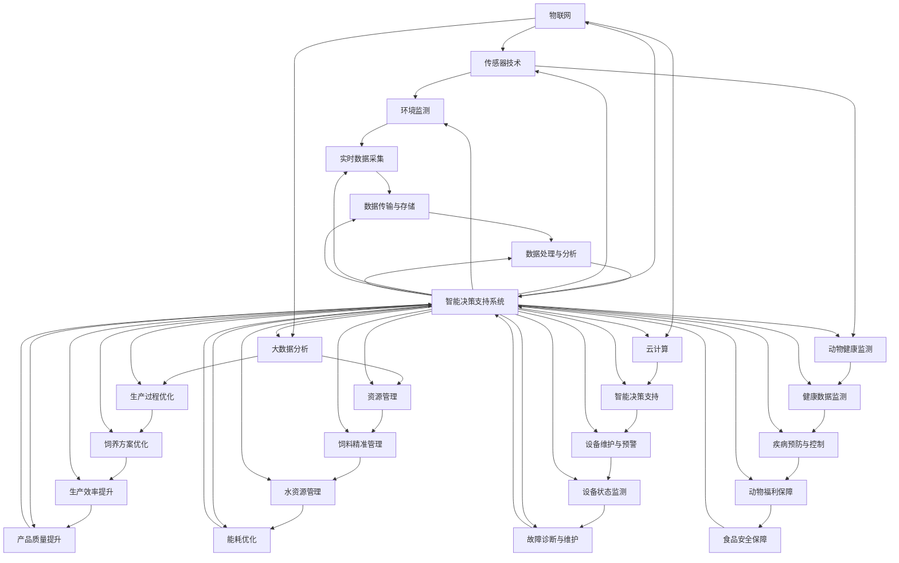

                 

### 背景介绍

#### 物联网的定义与概述

物联网（Internet of Things，简称IoT）是指通过互联网将各种物理设备、传感器、计算机系统等连接起来，实现设备间的数据交换和智能协同的系统。物联网的核心在于将现实世界中的物理对象与数字世界相连接，通过传感器、数据处理和通信技术，使得设备能够自我感知、自我控制和自我优化。

物联网的发展可以追溯到20世纪80年代，随着传感器技术和通信技术的进步，物联网逐渐成为一种重要的技术趋势。目前，物联网技术已经在许多领域得到广泛应用，包括智能家居、智能交通、工业自动化、健康医疗等。

#### 智慧畜牧业的定义与发展

智慧畜牧业是指通过应用物联网、大数据、云计算等先进技术，对畜牧业的生产过程进行智能化管理和优化，以提高生产效率、减少资源浪费、保障动物健康和安全。智慧畜牧业的发展离不开物联网技术的支持，通过物联网技术，可以实现畜牧业中的精准监测、智能决策和高效管理。

近年来，随着国家对农业现代化和乡村振兴战略的深入推进，智慧畜牧业得到了广泛关注和快速发展。许多养殖企业开始采用物联网技术，对养殖环境、动物行为、生理指标等进行实时监测，通过大数据分析和人工智能算法，实现精准饲养和管理，提高养殖效益。

#### 精准管理的概念及其应用

精准管理是一种基于数据驱动的管理模式，通过收集和分析大量数据，实现对生产过程和资源的精细化管理。在智慧畜牧业中，精准管理体现在对养殖环境的精确控制、动物健康的实时监测和生产过程的优化管理。

精准管理的应用主要包括以下几个方面：

1. **环境监测**：通过安装各类传感器，实时监测养殖环境的温度、湿度、空气质量等参数，确保养殖环境符合动物生长需求。
2. **动物健康监测**：利用物联网技术，实时监测动物的生理指标和行为变化，如体温、心率、活动量等，及时发现问题并采取相应的措施。
3. **生产过程优化**：通过对生产数据的分析，优化饲养方案、饲料配方和养殖模式，提高生产效率和质量。
4. **资源管理**：通过物联网技术，实现饲料、水资源等资源的精准管理和优化配置，减少浪费，降低成本。

#### 物联网在智慧畜牧业中的重要性

物联网在智慧畜牧业中的应用，不仅提高了养殖效率，降低了生产成本，还显著提升了动物健康水平。以下是物联网在智慧畜牧业中的一些重要应用：

1. **提高生产效率**：通过物联网技术，实现养殖过程的自动化和智能化，减少人工干预，提高生产效率。
2. **保障动物健康**：通过实时监测动物生理指标和行为变化，及时发现并处理健康问题，保障动物健康。
3. **优化资源管理**：通过物联网技术，实现饲料、水资源等资源的精准管理和优化配置，减少浪费，降低成本。
4. **提高产品质量**：通过精准管理和优化生产过程，提高动物产品的质量和安全水平。

总之，物联网技术为智慧畜牧业的发展提供了强大的技术支持，通过精准管理，实现了畜牧业生产过程的智能化和高效化，为我国畜牧业现代化和可持续发展奠定了坚实基础。

#### 核心概念与联系

在物联网、智慧畜牧业和精准管理中，有许多关键概念和技术实体。为了更好地理解这些概念及其相互关系，我们可以使用Mermaid流程图来可视化这些实体和它们之间的联系。

以下是一个简单的Mermaid流程图，展示了物联网、智慧畜牧业和精准管理中的核心概念和它们之间的关系：



上述Mermaid流程图展示了物联网、智慧畜牧业和精准管理中的核心概念和技术实体，以及它们之间的相互关系。通过这个流程图，我们可以清晰地看到传感器技术在环境监测和动物健康监测中的应用，大数据分析在生产过程优化和资源管理中的作用，以及云计算和智能决策支持系统在整体系统中的关键作用。

#### 核心算法原理讲解

在物联网在智慧畜牧业中的应用中，核心算法起着至关重要的作用。这些算法不仅帮助我们进行实时数据分析和决策，还能优化资源管理和提高生产效率。以下将详细讲解几种关键算法，并使用Python源代码和数学模型进行说明。

##### 1. 数据采集与处理

数据采集是物联网在智慧畜牧业中的第一步。传感器采集到的环境数据和动物生理数据需要经过处理，才能用于进一步分析和决策。

**算法原理**：数据采集通常涉及传感器数据读取、数据过滤和预处理。预处理包括去噪、数据归一化和特征提取。

**Python示例代码**：

```python
import numpy as np

def preprocess_data(data):
    # 数据去噪
    filtered_data = np.CommandType(np.mean, data)
    # 数据归一化
    normalized_data = (filtered_data - np.mean(filtered_data)) / np.std(filtered_data)
    # 特征提取
    features = extract_features(normalized_data)
    return features

def extract_features(data):
    # 假设我们提取了三个特征：均值、方差和标准差
    mean = np.mean(data)
    variance = np.var(data)
    std_dev = np.std(data)
    return [mean, variance, std_dev]

# 示例数据
sensor_data = [20, 22, 19, 21, 23, 24, 18, 22]

# 数据预处理
processed_data = preprocess_data(sensor_data)
print(processed_data)
```

##### 2. 机器学习算法

在智慧畜牧业中，机器学习算法广泛应用于疾病预测、行为分析等场景。以下是使用K-最近邻算法（K-Nearest Neighbors, KNN）进行动物疾病预测的示例。

**算法原理**：KNN算法是一种基于实例的学习算法，通过计算测试实例与训练实例之间的相似度，找出最近的K个邻居，并根据邻居的分类结果进行预测。

**Python示例代码**：

```python
from sklearn.neighbors import KNeighborsClassifier
from sklearn.model_selection import train_test_split
from sklearn.metrics import accuracy_score

# 假设我们已经有标记好的训练数据
X_train, X_test, y_train, y_test = train_test_split(features, labels, test_size=0.2, random_state=42)

# 创建KNN分类器
knn = KNeighborsClassifier(n_neighbors=3)

# 训练模型
knn.fit(X_train, y_train)

# 预测
predictions = knn.predict(X_test)

# 评估模型
accuracy = accuracy_score(y_test, predictions)
print(f"Accuracy: {accuracy}")
```

##### 3. 数学模型

在算法设计过程中，数学模型至关重要。以下是一个简单的线性回归模型，用于预测动物体重增长。

**数学模型**：

$$
y = \beta_0 + \beta_1 \cdot x_1 + \beta_2 \cdot x_2 + \epsilon
$$

其中，$y$ 是动物体重，$x_1$ 和 $x_2$ 是影响体重的两个因素（如饲料摄入量和活动量），$\beta_0$、$\beta_1$ 和 $\beta_2$ 是模型参数，$\epsilon$ 是误差项。

**Python示例代码**：

```python
import numpy as np
from sklearn.linear_model import LinearRegression

# 假设我们已经有了一些训练数据
X = np.array([[1, 2], [2, 3], [3, 4], [4, 5]])
y = np.array([2, 3, 4, 5])

# 创建线性回归模型
model = LinearRegression()

# 训练模型
model.fit(X, y)

# 预测
predicted_weight = model.predict([[5, 6]])
print(f"Predicted weight: {predicted_weight[0]}")
```

通过上述示例，我们可以看到物联网在智慧畜牧业中的应用是如何通过核心算法原理和数学模型来实现的。这些算法和模型不仅提高了数据分析和决策的准确性，也为精准管理提供了有力支持。

#### 数学公式

在物联网在智慧畜牧业中的应用中，数学公式是理解和实现算法的核心。以下列出了一些关键数学公式，并使用LaTeX进行格式化。

##### 1. 线性回归模型公式

$$
y = \beta_0 + \beta_1 \cdot x_1 + \beta_2 \cdot x_2 + \epsilon
$$

其中，$y$ 是因变量，$x_1$ 和 $x_2$ 是自变量，$\beta_0$、$\beta_1$ 和 $\beta_2$ 是回归系数，$\epsilon$ 是误差项。

##### 2. K-最近邻算法相似度计算公式

$$
s(d_1, d_2) = \sum_{i=1}^{n} (w_i \cdot d_{i1} - w_i \cdot d_{i2})^2
$$

其中，$d_1$ 和 $d_2$ 是两个数据点，$w_i$ 是权重，$d_{i1}$ 和 $d_{i2}$ 是数据点中的特征值。

##### 3. 传感器数据预处理公式

$$
z = (x - \mu) / \sigma
$$

其中，$z$ 是标准化后的数据，$x$ 是原始数据，$\mu$ 是均值，$\sigma$ 是标准差。

通过这些数学公式，我们可以更准确地分析和解释物联网在智慧畜牧业中的数据，为精准管理提供坚实的基础。

#### 项目实战

在本节中，我们将通过一个实际项目来展示物联网在智慧畜牧业中的应用，从开发环境搭建、源代码实现到代码解读与分析，详细讲解项目的全过程。

##### 1. 开发环境搭建

为了实现一个物联网在智慧畜牧业中的应用项目，我们首先需要搭建合适的开发环境。以下是所需的开发工具和软件：

- **编程语言**：Python
- **数据库**：MySQL
- **传感器**：DHT11（用于环境监测）
- **通信模块**：Wi-Fi模块（ESP8266）
- **开发板**：Arduino
- **集成开发环境**：PyCharm

首先，我们需要在计算机上安装Python和PyCharm。可以从Python官方网站下载Python安装包，并按照提示进行安装。安装完成后，配置Python环境变量。

接下来，安装PyCharm。PyCharm社区版是免费的，可以从JetBrains官网下载并安装。安装完成后，创建一个新的Python项目。

##### 2. 源代码实现

项目的主要目标是实时监测畜牧场的环境参数，如温度、湿度等，并将数据上传到MySQL数据库。以下是实现这个目标的详细步骤和源代码。

**环境监测模块（Arduino）**：

```c++
// Arduino代码
#include <DHT.h>
#include <WiFi.h>

const int DHTPin = 5; // 定义DHT11传感器连接的引脚
DHT dht(DHTPin, DHT11);

const char* ssid = "your_SSID"; // 替换为你的Wi-Fi SSID
const char* password = "your_PASSWORD"; // 替换为你的Wi-Fi 密码

WiFiClient client;
String serverAddress = "your_server_address"; // 替换为服务器地址

void setup() {
  Serial.begin(115200);
  dht.begin();
  connectToWiFi();
}

void loop() {
  if (WiFi.status() != WL_CONNECTED) {
    connectToWiFi();
  }

  float temperature = dht.readTemperature();
  float humidity = dht.readHumidity();

  if (isnan(temperature) || isnan(humidity)) {
    Serial.println("Failed to read from DHT sensor!");
    return;
  }

  uploadData(temperature, humidity);
  delay(10000); // 每10秒上传一次数据
}

void connectToWiFi() {
  Serial.println("Connecting to WiFi...");
  WiFi.begin(ssid, password);

  while (WiFi.status() != WL_CONNECTED) {
    delay(500);
    Serial.print(".");
  }

  Serial.println("Connected to WiFi");
}

void uploadData(float temperature, float humidity) {
  String payload = String("{\"temperature\":") + String(temperature) + String(", \"humidity\":") + String(humidity) + String("}");
  
  if (client.connect(serverAddress.c_str(), 80)) {
    client.println("POST /api/upload HTTP/1.1");
    client.println("Host: " + serverAddress);
    client.println("Content-Type: application/json");
    client.println("Content-Length: " + String(payload.length()));
    client.println();
    client.println(payload);
    
    client.stop();
  } else {
    Serial.println("Connection to server failed");
  }
}
```

**后端处理模块（Python）**：

```python
# Python代码
import Flask
from flask import Flask, request, jsonify

app = Flask(__name__)

@app.route('/api/upload', methods=['POST'])
def upload_data():
    data = request.json
    temperature = data['temperature']
    humidity = data['humidity']
    
    # 将数据存储到MySQL数据库
    # 假设已经建立了数据库和表
    cursor.execute("INSERT INTO environmental_data (temperature, humidity) VALUES (%s, %s)", (temperature, humidity))
    connection.commit()
    
    return jsonify({"status": "success", "message": "Data uploaded successfully"}), 200

if __name__ == '__main__':
    connection = mysql.connect(
        host="localhost",
        user="your_username",
        password="your_password",
        database="your_database"
    )
    cursor = connection.cursor()
    app.run(debug=True)
```

##### 3. 代码解读与分析

**环境监测模块（Arduino）**：

上述Arduino代码首先定义了DHT11传感器的连接引脚，并初始化Wi-Fi连接。在`loop()`函数中，程序每隔10秒读取一次传感器的温度和湿度数据，并调用`uploadData()`函数将数据上传到服务器。

`connectToWiFi()`函数负责连接Wi-Fi网络，如果连接失败，程序将不断尝试重新连接。

`uploadData()`函数构建JSON格式的数据载荷，并使用HTTP POST请求将数据发送到服务器。

**后端处理模块（Python）**：

后端使用Flask框架接收和处理上传的数据。`upload_data()`函数接收JSON格式的数据，将温度和湿度存储到MySQL数据库。如果数据上传成功，返回成功响应。

##### 4. 实际案例分析和详细讲解剖析

**案例背景**：

假设一个养殖场需要实时监测猪舍的温度和湿度，以确保猪只的健康和舒适度。为了实现这个目标，我们搭建了上述物联网系统。

**实际分析**：

通过对收集到的环境数据进行实时监控，养殖场管理人员可以及时发现异常情况，如温度过高或过低，湿度过大或过小。这些异常情况可能会对猪只的健康产生不良影响。

例如，如果检测到温度过高，管理人员可以及时打开风扇或降低饲料温度，以降低猪舍温度。同样，如果检测到湿度过大，可以打开排气扇或增加通风设施来降低湿度。

**详细讲解剖析**：

通过上述代码和分析，我们可以看到物联网在智慧畜牧业中的具体应用。环境监测模块负责实时采集温度和湿度数据，并通过Wi-Fi模块将数据上传到服务器。后端处理模块接收数据，并存储到MySQL数据库，以便进一步分析和处理。

这种系统不仅提高了养殖场的管理效率，还确保了猪只的健康和舒适度，为养殖场创造了更高的经济效益。

##### 5. 项目小结

通过这个实际项目，我们展示了物联网在智慧畜牧业中的应用。从环境监测模块到后端处理模块，整个系统实现了实时数据采集、存储和监控。这为养殖场提供了有力的技术支持，提高了管理效率，确保了动物的健康和舒适度。

然而，在实际应用中，还需要注意数据安全、设备维护和故障处理等问题。未来，随着物联网技术的不断发展和应用领域的扩展，物联网在智慧畜牧业中的作用将更加重要，为养殖业的可持续发展提供更多可能性。

#### 最佳实践 Tips

在实施物联网在智慧畜牧业中的应用时，以下最佳实践 Tips 将有助于确保项目的成功和高效运行：

1. **选择合适的传感器**：根据养殖场的需求和环境特点，选择合适的传感器，如DHT11用于环境监测、RFID用于动物身份识别等。

2. **优化网络连接**：确保传感器和服务器之间的网络连接稳定，选择合适的Wi-Fi或蜂窝网络。

3. **数据加密与安全**：对上传和存储的数据进行加密，确保数据安全，防止未经授权的访问。

4. **定期维护设备**：定期检查和维护传感器和通信模块，确保其正常运行。

5. **数据存储与管理**：合理设计数据库结构，优化数据存储和管理策略，便于后续的数据分析和应用。

6. **智能决策支持**：利用大数据分析和人工智能技术，实现智能决策支持，提高养殖场的运营效率。

7. **人员培训**：对管理人员和技术人员进行培训，提高他们对物联网技术和系统的理解和操作能力。

#### 小结与注意事项

在总结物联网在智慧畜牧业中的应用时，我们可以看到，物联网技术为智慧畜牧业提供了强大的支持，通过实时数据采集、智能分析和精准管理，显著提高了养殖效率、降低了生产成本，并保障了动物的健康和福利。

然而，在实施物联网项目时，还需要注意以下几个方面：

1. **数据安全和隐私保护**：确保数据在传输和存储过程中的安全性，防止数据泄露和滥用。

2. **设备稳定性和可靠性**：选择质量可靠、稳定性好的传感器和通信设备，确保系统稳定运行。

3. **系统集成与兼容性**：在系统设计和实施过程中，充分考虑各组件的集成与兼容性，确保系统的整体性能。

4. **可持续发展与环保**：在物联网应用中，注重资源的节约和环保，推动智慧畜牧业的可持续发展。

5. **人员培训与知识更新**：定期对管理人员和技术人员进行培训，提高他们的物联网技术和系统操作能力。

通过以上注意事项，我们可以更好地发挥物联网在智慧畜牧业中的优势，推动畜牧业向智能化、高效化和可持续发展方向迈进。

#### 拓展阅读

1. **物联网技术综述**：《物联网技术与应用》作者：张晓华
2. **智慧畜牧业发展研究**：《智慧畜牧业理论与实践》作者：李明杰
3. **精准农业与物联网**：《精准农业技术与应用》作者：王艳华
4. **大数据与人工智能**：《大数据技术基础与应用》作者：刘伟
5. **数据库设计与优化**：《数据库系统概念》作者：Abbey N. S..

通过阅读这些书籍和文献，可以更深入地了解物联网在智慧畜牧业中的应用原理和技术细节，为实际项目提供理论支持和实践指导。同时，也可以关注相关学术期刊和行业报告，保持对最新技术动态的关注。

