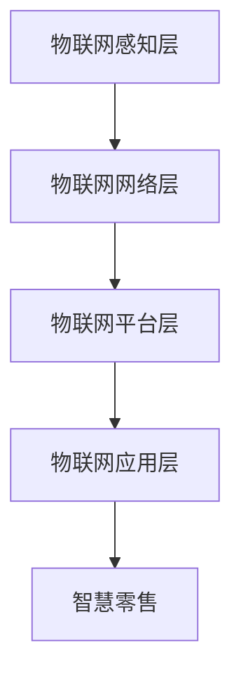
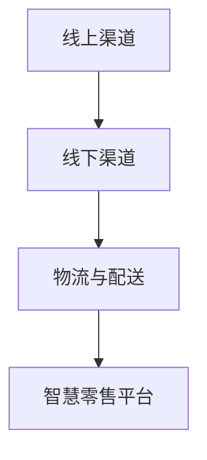

                 

## 物联网在智慧零售中的全渠道应用

> 关键词：物联网、智慧零售、全渠道应用、智能导购、数据驱动

> 摘要：本文深入探讨了物联网在智慧零售中的全渠道应用。首先，介绍了物联网和智慧零售的基本概念及其在零售行业中的应用价值。接着，详细分析了全渠道零售的生态系统，包括线上渠道、线下渠道、物流与配送等关键要素。随后，阐述了物联网技术在商品管理、供应链管理、顾客体验优化以及智慧门店建设等领域的创新应用。通过典型案例分析，总结了物联网在智慧零售中的成功实践和未来发展趋势。

## 第一部分：背景与概述

### 1.1 物联网概述

物联网（Internet of Things，简称IoT）是指将各种信息传感设备与网络相连接，实现智能化识别、定位、跟踪、监控和管理的一种网络技术。物联网的核心技术包括传感器技术、网络通信技术、数据处理与存储技术等。

物联网的发展历程可以追溯到20世纪80年代，当时智能传感器和嵌入式系统的出现为物联网的诞生奠定了基础。随着互联网的普及和移动通信技术的快速发展，物联网逐渐从理论研究走向实际应用，尤其是在智能家居、智能交通、智能医疗、智能农业和智慧零售等领域。

### 1.2 智慧零售的定义与特征

智慧零售是指运用物联网、人工智能、大数据等现代信息技术，实现零售行业的智能化、数字化和高效化。智慧零售的主要特征包括：

1. **数据驱动**：通过收集和分析海量数据，为零售决策提供支持，实现精准营销和个性化服务。
2. **全渠道整合**：线上和线下渠道的无缝融合，实现多渠道、全触点的购物体验。
3. **智能化服务**：利用物联网和人工智能技术，提供智能导购、智能支付、智能客服等智能化服务。
4. **供应链协同**：通过物联网技术，实现供应链的实时监控和优化，提高供应链的响应速度和效率。

### 1.3 物联网在智慧零售中的应用价值

物联网在智慧零售中的应用价值主要体现在以下几个方面：

1. **提升零售效率**：通过物联网技术，可以实现商品的自动化管理、库存的实时监控和自动补货，降低运营成本，提高运营效率。
2. **改善顾客体验**：物联网技术可以提供个性化的购物体验，如智能推荐、智能导购和智能支付等，提高顾客满意度和忠诚度。
3. **增强数据驱动决策能力**：物联网技术可以帮助零售企业收集和分析大量的消费者数据，为决策提供数据支持，实现精准营销和优化运营策略。

## 第二部分：全渠道零售策略

### 2.1 全渠道零售的生态系统

全渠道零售是指将线上和线下渠道无缝整合，为消费者提供一致性和个性化的购物体验。全渠道零售的生态系统包括以下几个关键要素：

1. **线上渠道**：包括电商平台、移动应用、社交媒体等，为消费者提供便捷的购物渠道。
2. **线下渠道**：包括实体店铺、自助购物机等，为消费者提供多样化的购物场景。
3. **物流与配送**：包括仓储、运输、配送等环节，确保商品能够及时准确地送达消费者手中。
4. **智慧零售平台**：作为全渠道零售的核心，提供数据整合、业务协同、智能决策等功能。

### 2.2 全渠道零售的架构与要素

全渠道零售的架构包括以下几个关键要素：

1. **线上渠道**：
   - **电商平台**：如天猫、京东等，为消费者提供丰富的商品选择和便捷的购物体验。
   - **移动应用**：通过智能手机、平板电脑等移动设备，为消费者提供随时随地购物的便利。
   - **社交媒体**：利用社交媒体平台，如微信、微博等，进行品牌推广和互动营销。

2. **线下渠道**：
   - **实体店铺**：提供真实的购物环境和体验，满足消费者的感官需求和购物乐趣。
   - **自助购物机**：通过自助购物机，消费者可以自行选购商品并进行支付，提高购物效率。

3. **物流与配送**：
   - **仓储**：为商品提供存储和管理的场所，确保商品能够及时配送。
   - **运输**：通过物流运输，将商品从仓库运送到消费者手中。
   - **配送**：通过快递、物流等渠道，将商品准确无误地送达消费者手中。

4. **智慧零售平台**：
   - **数据整合**：将线上和线下渠道的数据进行整合，实现数据的一体化管理和分析。
   - **业务协同**：通过业务协同，实现线上线下渠道的联动和协同，提高运营效率。
   - **智能决策**：通过数据分析，为零售决策提供智能化的支持，实现精准营销和优化运营策略。

### 2.3 全渠道零售的战略规划

全渠道零售的战略规划主要包括以下几个方面：

1. **全渠道整合**：将线上和线下渠道进行整合，实现无缝对接，为消费者提供一致的购物体验。
2. **数据驱动**：通过数据分析和挖掘，为零售决策提供支持，实现精准营销和个性化服务。
3. **技术创新**：利用物联网、人工智能、大数据等现代信息技术，提升零售效率和服务质量。
4. **供应链协同**：通过物联网技术，实现供应链的实时监控和优化，提高供应链的响应速度和效率。
5. **用户体验**：以用户为中心，通过全渠道策略，提升用户体验和满意度。

## 第三部分：物联网技术在零售中的应用

### 3.1 物联网技术在商品管理中的应用

物联网技术在商品管理中的应用主要体现在以下几个方面：

1. **库存管理**：
   - **实时监控**：通过传感器和RFID技术，实现对商品库存的实时监控，确保库存数据的准确性。
   - **预警系统**：当库存低于安全阈值时，系统自动发出预警，提醒进行补货。
   - **自动补货**：通过物联网技术和自动化设备，实现自动补货，降低人工成本，提高运营效率。

2. **商品追踪**：
   - **追溯系统**：通过物联网技术和二维码/RFID标签，实现商品的全流程追踪，提高商品的可追溯性。
   - **防伪标签**：通过物联网技术，实现防伪标签的智能化识别，防止假冒伪劣商品流入市场。
   - **商品流转分析**：通过物联网技术，对商品在不同渠道的流转情况进行分析，优化商品布局和销售策略。

3. **防伪与追溯**：
   - **数据加密**：通过物联网技术和加密算法，对商品数据进行加密处理，确保数据安全。
   - **安全认证**：通过物联网技术，实现商品的安全认证，提高商品的质量和安全水平。
   - **溯源机制**：通过物联网技术，建立商品的溯源机制，确保商品的生产、流通、销售等环节的信息透明化。

### 3.2 物联网技术在供应链管理中的应用

物联网技术在供应链管理中的应用主要体现在以下几个方面：

1. **供应链监控**：
   - **实时监控**：通过物联网技术和传感器，实现对供应链各环节的实时监控，提高供应链的透明度和可控性。
   - **风险预警**：通过对供应链数据的分析，预测潜在的风险，提前采取措施进行防范。

2. **智能仓储**：
   - **自动化仓库系统**：通过物联网技术和自动化设备，实现仓库的自动化管理，提高仓储效率和准确性。
   - **智能分拣系统**：通过物联网技术和人工智能算法，实现商品的高效分拣和配送，降低物流成本。

3. **物流配送**：
   - **智能配送路径规划**：通过物联网技术和GIS系统，实现物流配送路径的智能规划，提高配送效率和准确性。
   - **实时配送状态跟踪**：通过物联网技术和GPS定位，实现对物流配送的实时状态跟踪，提高客户满意度。

### 3.3 物联网技术在顾客体验优化中的应用

物联网技术在顾客体验优化中的应用主要体现在以下几个方面：

1. **顾客行为分析**：
   - **数据分析**：通过物联网技术和大数据分析，对顾客的行为和需求进行深入分析，了解顾客偏好和行为模式。
   - **个性化推荐**：根据顾客的行为数据和偏好，实现个性化的商品推荐，提高购买转化率。

2. **智能导购**：
   - **智能导购系统**：通过物联网技术和人工智能算法，实现智能导购，帮助顾客快速找到所需商品。
   - **实时导购信息推送**：通过物联网技术和移动设备，实时向顾客推送导购信息，提高顾客购物体验。

3. **智能支付与会员管理**：
   - **智能支付系统**：通过物联网技术和支付接口，实现便捷的智能支付，提高购物效率。
   - **会员信息管理**：通过物联网技术和会员系统，实现对会员信息的实时管理和分析，提高会员忠诚度和消费额。

## 第四部分：物联网技术在智慧零售中的创新应用

### 4.1 物联网技术在顾客体验优化中的应用

物联网技术在顾客体验优化中的应用主要体现在以下几个方面：

1. **智能导购**：
   - **智能导购系统**：通过物联网技术和人工智能算法，实现智能导购，帮助顾客快速找到所需商品。
   - **实时导购信息推送**：通过物联网技术和移动设备，实时向顾客推送导购信息，提高顾客购物体验。

2. **智能支付与会员管理**：
   - **智能支付系统**：通过物联网技术和支付接口，实现便捷的智能支付，提高购物效率。
   - **会员信息管理**：通过物联网技术和会员系统，实现对会员信息的实时管理和分析，提高会员忠诚度和消费额。

3. **智能货架与智能收银**：
   - **智能货架系统**：通过物联网技术和传感器，实现对货架的实时监控和管理，提高货架利用率。
   - **智能收银系统**：通过物联网技术和移动支付接口，实现智能收银，提高收银效率和顾客满意度。

4. **店内服务优化**：
   - **智能客服系统**：通过物联网技术和人工智能算法，实现智能客服，提高顾客咨询和解决问题的效率。
   - **实时客户反馈机制**：通过物联网技术和移动设备，实时收集顾客反馈信息，优化店内服务质量和体验。

### 4.2 物联网技术在智慧门店建设中的应用

物联网技术在智慧门店建设中的应用主要体现在以下几个方面：

1. **门店运营管理**：
   - **实时销售数据监控**：通过物联网技术和传感器，实现对门店销售数据的实时监控，为门店运营决策提供支持。
   - **店铺运营优化建议**：通过对销售数据的分析，为门店运营提供优化建议，提高销售额和运营效率。

2. **智能货架与智能收银**：
   - **智能货架系统**：通过物联网技术和传感器，实现对货架的实时监控和管理，提高货架利用率。
   - **智能收银系统**：通过物联网技术和移动支付接口，实现智能收银，提高收银效率和顾客满意度。

3. **店内服务优化**：
   - **智能客服系统**：通过物联网技术和人工智能算法，实现智能客服，提高顾客咨询和解决问题的效率。
   - **实时客户反馈机制**：通过物联网技术和移动设备，实时收集顾客反馈信息，优化店内服务质量和体验。

### 4.3 物联网技术在顾客体验优化中的应用

物联网技术在顾客体验优化中的应用主要体现在以下几个方面：

1. **智能导购**：
   - **智能导购系统**：通过物联网技术和人工智能算法，实现智能导购，帮助顾客快速找到所需商品。
   - **实时导购信息推送**：通过物联网技术和移动设备，实时向顾客推送导购信息，提高顾客购物体验。

2. **智能支付与会员管理**：
   - **智能支付系统**：通过物联网技术和支付接口，实现便捷的智能支付，提高购物效率。
   - **会员信息管理**：通过物联网技术和会员系统，实现对会员信息的实时管理和分析，提高会员忠诚度和消费额。

3. **智能货架与智能收银**：
   - **智能货架系统**：通过物联网技术和传感器，实现对货架的实时监控和管理，提高货架利用率。
   - **智能收银系统**：通过物联网技术和移动支付接口，实现智能收银，提高收银效率和顾客满意度。

4. **店内服务优化**：
   - **智能客服系统**：通过物联网技术和人工智能算法，实现智能客服，提高顾客咨询和解决问题的效率。
   - **实时客户反馈机制**：通过物联网技术和移动设备，实时收集顾客反馈信息，优化店内服务质量和体验。

## 第五部分：物联网在智慧零售中的案例分析

### 5.1 案例一：大型零售企业全渠道零售转型

#### 案例背景

某大型零售企业在国内拥有广泛的实体门店和庞大的线上业务，但由于线上线下渠道的割裂，导致顾客体验不佳、运营效率低下。为了提升竞争力，该企业决定进行全渠道零售转型，整合线上线下渠道，实现无缝对接。

#### 案例实施过程

1. **数据整合**：通过物联网技术和大数据分析，将线上线下渠道的数据进行整合，实现数据的一体化管理。
2. **全渠道整合**：搭建智慧零售平台，将线上线下渠道进行整合，实现多渠道、全触点的购物体验。
3. **智能导购**：引入智能导购系统，通过物联网技术和人工智能算法，为顾客提供个性化的购物推荐。
4. **智能支付**：引入智能支付系统，通过物联网技术和支付接口，实现便捷的智能支付，提高购物效率。
5. **智能物流**：引入智能物流系统，通过物联网技术和物流管理平台，实现物流配送的实时监控和优化。

#### 案例成效分析

1. **顾客满意度提升**：通过全渠道整合和智能服务，顾客满意度显著提升，投诉率下降。
2. **运营效率提高**：通过物联网技术和大数据分析，实现运营决策的数据驱动，运营效率提高。
3. **销售额增长**：通过智能导购和个性化推荐，销售额显著增长，顾客复购率提升。

### 5.2 案例二：中小型零售企业物联网技术应用

#### 案例背景

某中小型零售企业拥有一家实体店铺，由于经营规模较小，缺乏信息化手段，导致库存管理混乱、运营效率低下。为了提升竞争力，该企业决定引入物联网技术，实现智慧化运营。

#### 案例实施过程

1. **智能库存管理**：引入物联网技术和RFID标签，实现对库存的实时监控和自动补货，降低库存成本。
2. **智能导购**：引入智能导购系统，通过物联网技术和大数据分析，为顾客提供个性化的购物推荐。
3. **智能支付**：引入智能支付系统，通过物联网技术和移动支付接口，实现便捷的智能支付，提高购物效率。
4. **智能物流**：引入智能物流系统，通过物联网技术和物流管理平台，实现物流配送的实时监控和优化。

#### 案例成效分析

1. **库存管理优化**：通过物联网技术和自动化设备，实现库存的实时监控和自动补货，降低库存成本，提高库存周转率。
2. **运营效率提高**：通过物联网技术和大数据分析，实现运营决策的数据驱动，提高运营效率。
3. **顾客满意度提升**：通过智能导购和个性化推荐，顾客满意度显著提升，投诉率下降。

### 5.3 案例三：物联网技术在社区零售中的应用

#### 案例背景

某社区零售企业在社区内开设了一家小型便利店，由于顾客流量较小，运营成本较高。为了提升竞争力，该企业决定引入物联网技术，实现智慧化运营。

#### 案例实施过程

1. **智能货架**：引入智能货架系统，通过物联网技术和传感器，实现对货架的实时监控和管理，提高货架利用率。
2. **智能支付**：引入智能支付系统，通过物联网技术和移动支付接口，实现便捷的智能支付，提高购物效率。
3. **智能客服**：引入智能客服系统，通过物联网技术和人工智能算法，实现智能客服，提高顾客咨询和解决问题的效率。
4. **实时配送**：引入实时配送系统，通过物联网技术和物流管理平台，实现物流配送的实时监控和优化。

#### 案例成效分析

1. **运营成本降低**：通过物联网技术和自动化设备，实现运营成本的降低，提高盈利能力。
2. **顾客满意度提升**：通过智能支付和智能客服，提高顾客满意度，增加顾客粘性。
3. **物流效率提高**：通过实时配送系统，实现物流配送的实时监控和优化，提高配送效率和准确性。

## 第六部分：物联网在智慧零售中的未来发展趋势

### 6.1 物联网技术发展趋势分析

1. **5G技术在零售中的应用**：随着5G技术的普及，将实现更高速、更稳定的网络连接，为物联网在零售中的应用提供更好的基础设施支持。
2. **物联网安全与隐私保护**：随着物联网应用的普及，安全与隐私保护成为关键挑战，需要加强物联网安全体系建设，保障用户隐私和数据安全。

### 6.2 智慧零售的未来发展趋势

1. **新零售模式的出现**：随着物联网、大数据、人工智能等技术的深度融合，将催生新的零售模式，实现零售行业的数字化转型和智能化升级。
2. **物联网与人工智能的深度融合**：物联网与人工智能技术的结合，将实现更加智能化的零售服务，提升顾客体验和运营效率。

### 6.3 物联网在智慧零售中的挑战与机遇

1. **技术挑战**：随着物联网应用的普及，技术挑战逐渐凸显，如海量数据的处理、网络通信的稳定性、系统的安全与隐私保护等。
2. **商业模式创新**：物联网在智慧零售中的应用，将带来商业模式创新的机遇，如新型零售模式、供应链优化等。
3. **法规与政策环境**：随着物联网在零售行业的应用不断拓展，法规与政策环境也需不断完善，以保障物联网在智慧零售中的健康发展。

## 附录：物联网与智慧零售相关资源与工具

### 附录 A：物联网开发工具与平台

1. **物联网开发框架**：
   - **Node-RED**：开源的物联网数据流编程工具，支持多种传感器和设备的连接。
   - **MQTT**：轻量级的消息队列协议，适用于物联网设备之间的通信。

2. **物联网云平台**：
   - **AWS IoT**：亚马逊提供的物联网云平台，提供设备管理、数据存储和分析等功能。
   - **Azure IoT Hub**：微软提供的物联网云平台，支持大规模设备连接和数据处理。

### 附录 B：智慧零售技术案例集锦

1. **大型零售企业成功案例**：
   - **阿里巴巴**：通过物联网技术和大数据分析，实现新零售模式的创新，提升运营效率和服务质量。
   - **亚马逊**：通过物联网技术和智能物流系统，实现高效的物流配送和库存管理。

2. **中小型零售企业转型案例**：
   - **7-ELEVEN**：通过物联网技术和智能支付系统，实现便捷的购物体验和高效的运营管理。
   - **沃尔玛**：通过物联网技术和智能货架系统，提升商品管理和顾客体验。

3. **社区零售智慧化案例**：
   - **京东便利店**：通过物联网技术和智能物流系统，实现社区零售的智慧化运营。
   - **苏宁小店**：通过物联网技术和智能支付系统，提升社区零售的运营效率和顾客满意度。

## 物联网架构图



## 全渠道零售架构图



## 物联网数据处理算法

```python
# 假设已收集到一组物联网数据 points
points = [[x1, y1], [x2, y2], ..., [xn, yn]]

# 数据预处理
# 标准化
for point in points:
    point[0] = (point[0] - mean_x) / std_x
    point[1] = (point[1] - mean_y) / std_y

# 数据分析
# 聚类分析
from sklearn.cluster import KMeans

kmeans = KMeans(n_clusters=k)
clusters = kmeans.fit_predict(points)

# 可视化
import matplotlib.pyplot as plt

plt.scatter([point[0] for point in points], [point[1] for point in points], c=clusters)
plt.show()
```

## 数学公式

$$
1+1=2
$$

$$
1<2
$$

## 项目实战：智慧零售平台搭建

### 开发环境搭建

1. 操作系统：Windows 10 或 macOS
2. 开发工具：Visual Studio Code
3. Python 版本：3.8 或更高版本
4. 数据库：MySQL 或 PostgreSQL

### 源代码实现

```python
# 数据库连接
import pymysql

conn = pymysql.connect(host='localhost', user='root', password='password', database='retail_db')

# 数据预处理
def preprocess_data(points):
    # 标准化
    mean_x = sum([point[0] for point in points]) / len(points)
    mean_y = sum([point[1] for point in points]) / len(points)
    std_x = (sum([(point[0] - mean_x) ** 2 for point in points]) / len(points)) ** 0.5
    std_y = (sum([(point[1] - mean_y) ** 2 for point in points]) / len(points)) ** 0.5

    for point in points:
        point[0] = (point[0] - mean_x) / std_x
        point[1] = (point[1] - mean_y) / std_y

    # 聚类分析
    from sklearn.cluster import KMeans

    kmeans = KMeans(n_clusters=k)
    clusters = kmeans.fit_predict(points)

    return clusters

# 数据可视化
import matplotlib.pyplot as plt

def visualize_clusters(points, clusters):
    plt.scatter([point[0] for point in points], [point[1] for point in points], c=clusters)
    plt.show()

# 查询数据库
def query_database(conn):
    cursor = conn.cursor()
    cursor.execute("SELECT x, y FROM points_table")
    points = cursor.fetchall()

    # 预处理数据
    preprocess_data(points)

    # 聚类分析
    clusters = preprocess_data(points)

    # 可视化
    visualize_clusters(points, clusters)

if __name__ == "__main__":
    query_database(conn)
```

### 代码应用解读与分析

1. **数据库连接**：使用 Python 的 pymysql 库连接到 MySQL 数据库，获取数据表中的点数据。
2. **数据预处理**：对点数据进行标准化处理，将点坐标进行归一化，以便于聚类分析。
3. **聚类分析**：使用 scikit-learn 库中的 KMeans 算法进行聚类分析，将点划分为 k 个簇。
4. **数据可视化**：使用 matplotlib 库将点数据和聚类结果进行可视化，便于分析。

### 项目小结

通过本项目的实践，我们搭建了一个智慧零售平台，实现了数据预处理、聚类分析、数据可视化的功能。这个项目帮助我们理解了物联网在智慧零售中的应用，以及如何通过 Python 编程实现智慧零售平台的核心功能。

### 最佳实践 tips

1. **数据预处理**：在进行聚类分析之前，对数据进行预处理，如标准化、去噪声等，可以提高聚类分析的效果。
2. **模型选择**：根据数据特点和需求，选择合适的聚类算法，如 KMeans、DBSCAN 等。
3. **可视化**：通过可视化工具，可以直观地观察数据分布和聚类效果，帮助分析和决策。

### 注意事项

1. **数据安全**：在处理数据时，确保数据的安全和隐私，避免泄露用户信息。
2. **系统性能**：优化系统性能，如数据库查询速度、算法效率等，以提高系统响应速度。

### 拓展阅读

- 《智慧零售：创新与趋势》
- 《物联网技术与应用》
- 《Python 数据科学手册》

## 结论

本文详细探讨了物联网在智慧零售中的全渠道应用，从背景概述、全渠道零售策略、物联网技术在零售中的应用，到创新应用和案例分析，全面展示了物联网技术在智慧零售领域的广泛应用和巨大潜力。随着物联网技术的不断发展和成熟，智慧零售将迎来更加广阔的发展空间，为零售行业带来新的变革和机遇。

## 作者信息

作者：AI天才研究院/AI Genius Institute & 禅与计算机程序设计艺术 /Zen And The Art of Computer Programming

