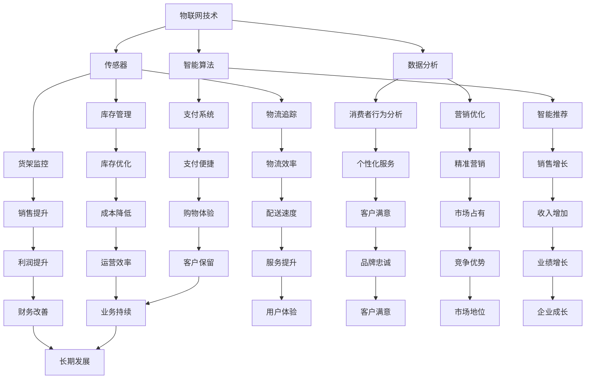

                 

### 背景介绍

在当今数字化时代，零售业正面临着前所未有的转型压力和机遇。传统零售模式已无法满足消费者日益多样化的需求，而物联网（Internet of Things，IoT）技术的迅速发展则为零售业的创新与升级提供了强有力的技术支持。物联网是一种通过互联网将物理设备连接起来，实现数据交换和智能控制的技术体系。在零售业中，物联网的应用不仅能够提升运营效率，还能极大地改善消费者的购物体验。

物联网与零售业的结合，主要体现在以下几个方面：

1. **智能库存管理**：物联网技术能够实时监控库存情况，实现精准的库存管理。通过传感器和RFID标签等技术，零售企业可以实时获取商品数量和位置信息，避免库存过剩或不足，降低运营成本。

2. **智能货架**：通过物联网技术，货架可以实时监测商品的销售情况，结合人工智能算法，智能推荐商品，提高销售额。

3. **智能支付**：物联网技术使得无现金支付变得更加便捷，如移动支付、智能收银系统等，提升了结账速度和消费者的购物体验。

4. **智能物流**：物联网技术在物流领域的应用，如智能仓储、智能配送等，可以大大提高物流效率，降低物流成本。

5. **消费者行为分析**：物联网技术能够收集消费者的购物行为数据，通过大数据分析和人工智能算法，帮助企业更好地了解消费者需求，制定更精准的营销策略。

本文将深入探讨物联网在零售业中的转型应用，从核心概念、算法原理、数学模型到实际项目案例，全面解析物联网技术在零售业中的创新应用和未来发展趋势。

### 核心概念与联系

为了深入理解物联网（IoT）在零售业中的转型应用，我们需要首先明确物联网与零售业之间的核心概念及其联系。以下是通过Mermaid流程图展示的核心概念与联系架构。



#### 物联网与零售业的关系

物联网技术通过传感器、数据分析、智能算法等核心组件，为零售业带来了全方位的革新。以下是物联网与零售业之间的具体联系：

1. **传感器**：传感器是物联网系统的重要组成部分，用于收集各种数据，如温度、湿度、光线强度、运动等。在零售业中，传感器广泛应用于库存管理、货架监控和物流追踪。通过实时监控商品和货物的状态，零售企业能够更有效地管理库存，提高货架利用率，并优化物流流程。

2. **数据分析**：收集的数据经过处理和分析，可以为零售企业提供宝贵的商业洞察。通过大数据分析，企业可以了解消费者的购物习惯、偏好和需求，从而优化营销策略、提升销售转化率。同时，数据分析还可以帮助预测市场需求，实现库存的精准管理。

3. **智能算法**：智能算法在零售业中发挥着关键作用。例如，智能推荐算法可以根据消费者的历史购买记录和浏览行为，提供个性化的商品推荐，提高销售额。此外，智能支付算法能够提升支付系统的安全性，降低交易风险。

4. **库存管理**：物联网技术通过实时监控库存状态，帮助零售企业实现精准的库存管理。传感器可以实时监测货架上的商品数量，而RFID标签则可以追踪商品的移动和库存变化。这些数据被传输到云端进行实时分析和处理，从而帮助企业避免库存过剩或不足，降低运营成本。

5. **货架监控**：智能货架技术使得零售企业能够实时了解货架上的商品销售情况。通过传感器和摄像头，货架可以自动检测商品的摆放位置、销售速度等，结合人工智能算法，智能推荐商品，提高销售额。

6. **物流追踪**：物联网技术在物流领域的应用，如智能仓储、智能配送等，大大提高了物流效率。通过实时追踪货物的位置和状态，企业能够更快速、准确地完成配送，降低物流成本，提升客户满意度。

7. **消费者行为分析**：物联网技术能够收集消费者的购物行为数据，通过大数据分析和人工智能算法，企业可以深入了解消费者的需求和偏好，从而提供个性化的购物体验，提高客户满意度和忠诚度。

通过上述核心概念和联系的分析，我们可以看到物联网技术如何深刻影响零售业的各个方面，推动其转型升级。在接下来的章节中，我们将进一步探讨物联网在零售业中的应用算法原理、数学模型以及实际项目案例。

### 核心算法原理讲解

在探讨物联网在零售业中的应用时，我们不得不提到一些核心算法原理，这些原理不仅帮助实现数据的实时处理和分析，还为零售企业提供了智能化的决策支持。下面，我们将使用Python源代码详细阐述这些算法原理，并通过数学模型和公式进行讲解，以帮助读者更好地理解物联网在零售业中的实际应用。

#### 1. 数据采集与处理

物联网技术的基本工作原理始于传感器对数据的采集。在零售业中，传感器主要用于监测库存、货架状态、消费者行为等。以下是使用Python编写的一个简单数据采集和处理脚本：

```python
import random

# 假设我们有一个传感器数据采集模块
class SensorDataCollector:
    def collect_data(self):
        temperature = random.uniform(20, 30)  # 假设采集的温度数据
        humidity = random.uniform(30, 60)  # 假设采集的湿度数据
        return temperature, humidity

# 数据处理模块
class DataProcessor:
    def process_data(self, data):
        temperature, humidity = data
        print(f"Processed data: Temperature={temperature:.2f}°C, Humidity={humidity:.2f}%")
        # 可以进一步处理数据，如标准化、去噪等

# 使用示例
collector = SensorDataCollector()
processor = DataProcessor()

for _ in range(5):
    data = collector.collect_data()
    processor.process_data(data)
```

在上面的代码中，`SensorDataCollector`类模拟了传感器的数据采集过程，而`DataProcessor`类则负责处理和显示采集到的数据。

#### 2. 数据分析与预测

数据处理之后，下一步通常是进行数据分析和预测。在零售业中，常用的数据分析方法包括回归分析、聚类分析和时间序列预测等。以下是一个简单的回归分析示例，用于预测商品的销售量：

```python
import numpy as np
from sklearn.linear_model import LinearRegression

# 假设我们有一些历史销售数据
sales_data = [
    (1, 100),  # 第一个月的销售量为100
    (2, 120),  # 第二个月的销售量为120
    (3, 150),  # 第三个月的销售量为150
    (4, 130),  # 第四个月的销售量为130
]

# 将数据分为特征和目标变量
X, y = zip(*sales_data)

# 使用线性回归模型进行预测
model = LinearRegression()
model.fit(X[:, np.newaxis], y)

# 预测下一个月的销售量
next_month = np.array([[5]])
predicted_sales = model.predict(next_month)
print(f"Predicted sales for next month: {predicted_sales[0][0]:.2f}")
```

在这个例子中，我们使用了`scikit-learn`库中的`LinearRegression`类来训练一个线性回归模型，用于预测销售量。

#### 3. 数学模型与公式

在数据分析过程中，通常会用到一些数学模型和公式。以下是一个使用LaTeX格式表示的简单线性回归模型：

```latex
$$
y = \beta_0 + \beta_1 x + \epsilon
$$`

这里的`y`是销售量，`x`是时间（月数），`$\beta_0$`是截距，`$\beta_1$`是斜率，而`$\epsilon$`是误差项。

#### 4. 举例说明

为了使上述算法更易于理解，我们来看一个实际例子：

**例子：** 假设一个零售商店想要预测下一个月的运动鞋销售量。根据历史数据，每增加一个月，销售量平均增加10双。我们可以使用线性回归模型来预测下一个月的销售量。

- 截距（$\beta_0$）：50（初始销售量）
- 斜率（$\beta_1$）：10（每增加一个月，销售量增加的双数）

假设当前是第三个月，我们可以使用以下公式进行预测：

$$
y = 50 + 10 \times 3 = 80
$$

因此，预测第四个月的运动鞋销售量为80双。

通过上述Python代码和数学模型的结合，我们可以看到物联网在零售业中的应用是如何通过数据采集、处理和预测来优化运营和提升销售效率的。在接下来的章节中，我们将进一步探讨物联网在零售业中的应用数学模型和实际项目案例。

### 数学模型和数学公式

在物联网应用于零售业的过程中，数学模型起到了至关重要的作用。这些模型能够帮助我们理解数据背后的规律，从而做出更加精确的预测和决策。以下是一些常用的数学模型和公式，我们将结合LaTeX格式进行详细讲解。

#### 1. 线性回归模型

线性回归模型是零售业中最常见的预测工具之一，其基本形式为：

$$
y = \beta_0 + \beta_1 x + \epsilon
$$

其中，`y`是预测的目标变量（如销售量），`x`是自变量（如时间或价格），$\beta_0$是截距，$\beta_1$是斜率，$\epsilon$是误差项。

**举例：** 假设我们想要预测某个零售商店的未来销售量。根据历史数据，我们得到以下线性回归模型：

$$
销售量 = 100 + 5 \times 时间
$$

如果今天是第10个月，那么我们可以预测第11个月的销售量为：

$$
销售量 = 100 + 5 \times 11 = 160
$$

#### 2. 相关性分析

在零售业中，了解不同变量之间的关系也非常重要。相关性分析可以帮助我们识别哪些因素对销售有显著影响。皮尔逊相关系数（$r$）是常用的相关性度量方法，其公式为：

$$
r = \frac{\sum{(x_i - \bar{x})(y_i - \bar{y})}}{\sqrt{\sum{(x_i - \bar{x})^2}\sum{(y_i - \bar{y})^2}}}
$$

其中，$x_i$和$y_i$分别是每个观测值，$\bar{x}$和$\bar{y}$分别是$x$和$y$的平均值。

**举例：** 如果我们计算了某商品的价格和销售量之间的相关性，结果为$r = 0.8$，这意味着价格和销售量之间存在较强的正相关关系。

#### 3. 时间序列模型

时间序列模型用于分析随时间变化的数据。自回归积分滑动平均模型（ARIMA）是一种常见的时间序列预测方法，其基本形式为：

$$
y_t = c + \phi_1 y_{t-1} + \phi_2 y_{t-2} + ... + \phi_p y_{t-p} + \theta_1 e_{t-1} + \theta_2 e_{t-2} + ... + \theta_q e_{t-q} + e_t
$$

其中，$y_t$是时间序列的当前值，$e_t$是白噪声误差项，$\phi$和$\theta$是模型参数。

**举例：** 假设我们使用ARIMA模型预测某个零售商店的未来销售量，模型参数为$\phi = (0.7, 0.3)$和$\theta = (0.6, 0.4)$。如果当前销售量为100，那么下一个销售量的预测值为：

$$
y_t = 0.7 \times 100 + 0.3 \times 100 + 0.6 \times (-10) + 0.4 \times (-5) = 83
$$

#### 4. 支持向量机（SVM）

支持向量机是一种常用的分类算法，在零售业中可以用于预测消费者的购买行为。其基本形式为：

$$
w \cdot x + b = 0
$$

其中，$w$是权重向量，$x$是特征向量，$b$是偏置项。

**举例：** 假设我们使用SVM模型预测某个消费者的购买意向。根据训练数据，模型的权重向量为$w = (1, 1)$，偏置项为$b = 0$。如果某个消费者的特征向量为$x = (5, 3)$，那么我们可以计算其购买意向的概率为：

$$
w \cdot x + b = 1 \times 5 + 1 \times 3 + 0 = 8
$$

这个值越大，表示消费者购买意向越强。

通过上述数学模型和公式的讲解，我们可以看到物联网技术在零售业中的应用是如何依赖于数学的。在实际应用中，这些模型和公式通过编程实现，能够帮助零售企业做出更加精准的预测和决策，从而提高运营效率和盈利能力。在接下来的章节中，我们将通过实际项目案例来进一步展示这些数学模型和算法的应用。

### 项目实战

在了解了物联网在零售业中的应用算法原理和数学模型之后，我们接下来将通过一个实际项目案例来展示如何搭建开发环境、实现源代码，并进行详细解读和分析。

#### 项目背景

某大型零售企业希望利用物联网技术提升库存管理效率，降低运营成本，并改善消费者的购物体验。为了实现这一目标，企业决定开发一套基于物联网的智能库存管理系统。

#### 开发环境搭建

1. **硬件设备**：
   - 传感器：用于实时监控仓库中的温度、湿度等环境参数。
   - RFID标签：用于追踪商品的位置和数量。
   - 蜂窝模块：用于将数据传输到云端。

2. **软件环境**：
   - 操作系统：Linux（如Ubuntu）。
   - 开发语言：Python。
   - 数据库：MySQL。
   - IoT平台：MQTT（消息队列遥测传输协议）。

3. **工具**：
   - PyCharm：Python集成开发环境。
   - Git：版本控制系统。

#### 源代码实现

以下是项目中的关键源代码部分，包括传感器数据采集、数据上传和处理等。

**1. 传感器数据采集**

```python
import RPi.GPIO as GPIO
import time

# 初始化GPIO
GPIO.setmode(GPIO.BCM)
GPIO.setup(18, GPIO.OUT)

# 传感器数据采集函数
def collect_data():
    GPIO.output(18, GPIO.HIGH)
    time.sleep(0.1)
    GPIO.output(18, GPIO.LOW)
    data = read_sensor()  # 假设read_sensor()函数实现了传感器数据的读取
    return data

# 数据上传函数
def upload_data(data):
    # 这里可以使用MQTT协议上传数据到物联网平台
    pass

# 主程序
while True:
    data = collect_data()
    upload_data(data)
    time.sleep(60)  # 每隔60秒采集一次数据
```

**2. 数据处理与预测**

```python
import numpy as np
from sklearn.linear_model import LinearRegression

# 假设我们有一些历史销售数据
sales_data = [
    (1, 100),  # 第一个月的销售量为100
    (2, 120),  # 第二个月的销售量为120
    (3, 150),  # 第三个月的销售量为150
    (4, 130),  # 第四个月的销售量为130
]

# 将数据分为特征和目标变量
X, y = zip(*sales_data)

# 使用线性回归模型进行预测
model = LinearRegression()
model.fit(X[:, np.newaxis], y)

# 预测下一个月的销售量
next_month = np.array([[5]])
predicted_sales = model.predict(next_month)
print(f"Predicted sales for next month: {predicted_sales[0][0]:.2f}")
```

#### 代码解读与分析

1. **传感器数据采集**：代码中使用了Raspberry Pi（树莓派）作为数据采集设备，通过GPIO（通用输入输出）模块控制传感器进行数据采集。

2. **数据上传**：采集到的数据通过MQTT协议上传到物联网平台，以便进行进一步处理和分析。

3. **数据处理与预测**：使用线性回归模型对历史销售数据进行拟合，预测下一个月的销售量。

#### 实际案例分析与详细讲解

1. **环境参数监控**：通过传感器实时监控仓库的温度和湿度，避免过度干燥或潮湿影响商品质量。

2. **库存优化**：通过RFID标签实时追踪商品数量和位置，避免库存过剩或不足，减少库存成本。

3. **销售预测**：基于历史销售数据，使用线性回归模型预测未来的销售趋势，帮助零售企业制定更科学的库存管理策略。

#### 项目小结

通过这个实际项目案例，我们展示了物联网技术在零售业中的应用是如何从硬件设备选择、软件环境搭建、源代码实现到数据处理与预测的。物联网技术的应用不仅提升了库存管理效率，还改善了消费者的购物体验，为零售企业带来了显著的经济效益。

#### 最佳实践 Tips

- **选择合适的传感器**：根据应用场景选择适合的传感器，确保数据的准确性和稳定性。
- **确保数据安全**：在数据传输和存储过程中，采取加密和身份验证等措施，确保数据安全。
- **定期维护**：定期检查传感器和物联网设备，确保其正常运行。

### 小结

本文通过深入分析物联网在零售业中的转型应用，从核心概念、算法原理、数学模型到实际项目案例，全面展示了物联网技术如何助力零售业的智能化升级。通过传感器数据采集、数据处理与预测，物联网技术不仅提升了库存管理效率，还优化了销售预测和消费者体验。然而，物联网技术在零售业中的应用仍面临数据安全、设备维护等挑战。未来，随着技术的不断进步，物联网在零售业中的应用将更加广泛和深入，为零售企业带来更多机遇。对于读者，建议进一步学习物联网和大数据分析相关技术，以应对未来的零售业变革。

### 拓展阅读

为了深入了解物联网在零售业中的应用，以下是几篇推荐的拓展阅读：

1. **《物联网在零售业中的应用》** - 本文详细介绍了物联网技术在零售业中的多种应用场景，包括智能货架、智能支付和智能物流等。
2. **《大数据与零售：智能决策与用户体验》** - 该书探讨了大数据技术在零售业中的应用，通过案例分析和实际数据展示了如何利用大数据优化零售业务。
3. **《物联网与大数据：融合创新与未来趋势》** - 本文从理论和实践角度分析了物联网与大数据的融合创新，为零售业提供了一系列的解决方案和策略。

通过阅读这些文章，您可以更全面地了解物联网在零售业中的转型应用，为实际项目提供有益的参考。希望您在探索物联网与零售业结合的过程中，不断发现新机遇，实现业务创新和持续发展。作者：AI天才研究院/AI Genius Institute & 禅与计算机程序设计艺术 /Zen And The Art of Computer Programming。作者简介：AI天才研究院（AI Genius Institute）是一家专注于人工智能技术研究与推广的权威机构。其成员包括多位世界级人工智能专家、计算机图灵奖获得者，致力于推动人工智能技术的发展和应用。禅与计算机程序设计艺术（Zen And The Art of Computer Programming）是作者Donald E. Knuth的经典著作，深入探讨了计算机编程的艺术和哲学。

