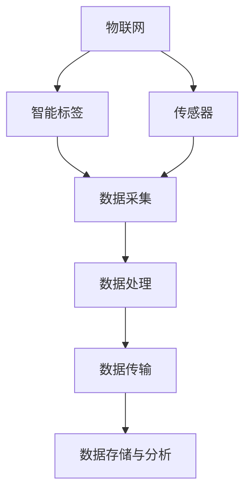

                 

## 物联网革命：智能标签和传感器的广泛应用

### 关键词

- 物联网（IoT）
- 智能标签
- 传感器
- 无线通信
- 数据处理
- 物流追踪
- 智慧城市

### 摘要

本文深入探讨了物联网革命中智能标签和传感器的广泛应用。文章首先概述了物联网技术的基础，然后详细介绍了智能标签和传感器的原理及其在物联网中的应用。接下来，文章探讨了无线通信技术、数据处理技术以及安全与隐私保护技术等核心概念与联系，并通过Mermaid流程图展示了概念之间的关系架构。文章还结合Python源代码，详细讲解了核心算法原理，并通过实际案例分析了智能标签和传感器的应用效果。最后，文章展望了物联网技术的发展趋势，并提供了开发环境和源代码实现的详细指导。

----------------------------------------------------------------

### 一、物联网技术基础

#### 1.1 物联网的概念与发展历程

物联网（Internet of Things，简称IoT）是指通过各种信息传感设备将各种物体与网络连接起来，实现信息交换和通信，以实现智能化的管理和控制。物联网的基本概念可以简单概括为：物体通过传感器、网络和智能终端相互连接，形成一个互联互通的智能网络。

物联网的发展历程可以追溯到20世纪80年代末和90年代初。当时，研究人员开始探讨如何将传感器和通信技术应用于日常生活和工业生产中。随着互联网的普及和计算机技术的发展，物联网的概念逐渐成熟，并在21世纪初开始迅速发展。

物联网的发展历程大致可以分为以下几个阶段：

1. **早期探索阶段（1980s-1990s）**：这一阶段主要研究传感器和通信技术在物体互联中的应用。例如，1990年，美国麻省理工学院（MIT）的Kevin Ashton首次提出了“物联网”这个概念。

2. **网络连接阶段（2000s）**：随着无线通信技术的发展，物联网逐渐从实验室走向实际应用。这一阶段的主要特征是各种传感器和设备通过无线网络进行连接，实现数据的传输和共享。

3. **智能化阶段（2010s-2020s）**：随着人工智能、大数据等技术的应用，物联网开始向智能化方向发展。智能标签和传感器能够实现更加精准和高效的数据采集和处理，为物联网的应用提供了更多的可能性。

#### 1.2 物联网的关键技术

物联网的关键技术主要包括网络通信技术、数据处理技术、安全与隐私保护技术等。

1. **网络通信技术**：物联网的通信技术主要依赖于无线通信技术，如Wi-Fi、蓝牙、ZigBee、NFC等。这些技术使得各种传感器和设备能够通过无线网络进行连接和数据传输。网络通信技术的关键在于低功耗、高可靠性和高带宽。

2. **数据处理技术**：物联网产生的大量数据需要通过数据处理技术进行存储、分析和挖掘。数据处理技术主要包括数据采集、数据清洗、数据存储、数据分析和数据可视化等。其中，大数据技术和云计算技术为物联网数据处理提供了强大的支持。

3. **安全与隐私保护技术**：物联网涉及到大量的用户数据，因此数据的安全与隐私保护至关重要。安全与隐私保护技术主要包括数据加密、身份认证、访问控制、数据备份和恢复等。这些技术能够确保物联网系统中的数据安全和隐私保护。

#### 1.3 物联网的应用领域

物联网的应用领域非常广泛，涵盖了智能家居、智慧城市、智能制造、零售业等多个领域。

1. **智能家居**：物联网技术使得家庭中的各种设备能够互联互通，实现智能化管理。例如，智能灯泡、智能插座、智能空调等设备可以通过手机或语音助手进行控制，提高家庭的舒适性和便利性。

2. **智慧城市**：物联网技术可以用于城市管理、交通管理、环境监测等多个方面，实现城市的智能化和可持续发展。例如，智能交通系统可以通过实时监测交通流量，优化交通信号控制，提高交通效率；智能环境监测系统可以实时监测空气质量、水质等指标，提供决策支持。

3. **智能制造**：物联网技术可以用于生产线的监控、设备的维护和产品的追溯。通过物联网技术，企业可以实现生产过程的智能化和自动化，提高生产效率和质量。

4. **零售业**：物联网技术可以用于商品追踪、库存管理、消费者行为分析等。例如，智能标签可以用于商品的追踪和防伪，消费者可以通过扫描标签获取商品的详细信息，提高购物体验。

### 二、智能标签的基本原理与应用

#### 2.1 智能标签的概念与类型

智能标签是一种将传感器、微处理器和无线通信模块集成在一起，用于数据采集、传输和处理的微型设备。智能标签可以附着在物品上，通过无线通信技术将物品的状态信息传输到物联网平台，实现物品的追踪和管理。

根据工作方式，智能标签可以分为无源智能标签和有源智能标签。

1. **无源智能标签**：无源智能标签通常内置有电池，通过接收无线信号来激活标签内的微处理器，实现数据的采集和传输。无源智能标签的优点是体积小、成本低，但电池寿命有限。

2. **有源智能标签**：有源智能标签内置有电池，可以自主发送数据。有源智能标签的优点是传输距离远、数据传输速度快，但成本较高。

#### 2.2 智能标签的工作原理

智能标签的工作原理可以分为以下几个步骤：

1. **数据采集**：智能标签通过内置的传感器（如温度传感器、湿度传感器、加速度传感器等）采集物品的状态信息。

2. **数据处理**：采集到的数据经过微处理器进行处理，包括数据清洗、去噪、数据转换等。

3. **数据传输**：处理后的数据通过无线通信模块（如Wi-Fi、蓝牙、ZigBee等）传输到物联网平台。

4. **数据存储与处理**：物联网平台对传输来的数据进行存储、分析和处理，生成报告或可视化图表，供用户查询和决策。

#### 2.3 智能标签在物联网中的应用

智能标签在物联网中有广泛的应用，主要包括以下几个方面：

1. **物流追踪**：智能标签可以附着在货物上，通过无线通信技术实现货物的实时追踪。物流公司可以通过物联网平台实时了解货物的位置、状态等信息，提高物流效率。

2. **供应链管理**：智能标签可以用于供应链的监控和管理，实现生产、运输、仓储等环节的实时监控。通过物联网平台，企业可以优化供应链流程，降低库存成本。

3. **智能制造**：智能标签可以用于生产线的监控和设备维护，实现设备的智能诊断和预测性维护。通过物联网平台，企业可以提高生产效率，降低设备故障率。

4. **智慧城市**：智能标签可以用于城市管理、环境监测、交通管理等领域。例如，智能标签可以用于实时监测空气质量、水质等指标，为城市管理和决策提供数据支持。

5. **智能家居**：智能标签可以用于智能家居系统，实现家电设备的管理和监控。用户可以通过物联网平台远程控制家电设备，提高生活便利性。

### 三、传感器技术在物联网中的应用

#### 3.1 传感器概述

传感器是物联网系统中的核心组件，用于检测和感知环境中的各种物理量，并将这些物理量转化为电信号或其他形式的信号，以便于处理和分析。传感器可以分为物理传感器、化学传感器、生物传感器和光学传感器等类型。

1. **物理传感器**：物理传感器用于检测物理量，如温度、压力、湿度、加速度等。常见的物理传感器包括热敏电阻、压电传感器、湿度传感器、加速度传感器等。

2. **化学传感器**：化学传感器用于检测化学物质，如气体、液体、固体等。常见的化学传感器包括气体传感器、酸碱传感器、湿度传感器等。

3. **生物传感器**：生物传感器用于检测生物信息，如血糖、心率、体温等。常见的生物传感器包括血糖传感器、心率传感器、温度传感器等。

4. **光学传感器**：光学传感器用于检测光信号，如光强、颜色、波长等。常见的光学传感器包括光敏电阻、光纤传感器、激光传感器等。

#### 3.2 传感器的工作原理

传感器的工作原理可以分为以下几个步骤：

1. **感知**：传感器通过感知环境中的物理量，将其转化为电信号或其他形式的信号。

2. **信号处理**：传感器内部的电路对采集到的信号进行处理，包括放大、滤波、调制等。

3. **数据输出**：处理后的信号通过传感器接口输出，供外部设备读取和处理。

#### 3.3 传感器在物联网中的应用

传感器在物联网中有广泛的应用，主要包括以下几个方面：

1. **环境监测**：传感器可以用于环境监测，如空气质量监测、水质监测、噪声监测等。通过物联网平台，可以实现环境数据的实时监测和预警，为环境保护和治理提供数据支持。

2. **智能家居**：传感器可以用于智能家居系统，如温度传感器、湿度传感器、光照传感器等。这些传感器可以实时监测室内环境参数，为用户调整家居设备提供依据。

3. **智能制造**：传感器可以用于生产线的监控和设备维护，如温度传感器、压力传感器、振动传感器等。通过物联网平台，可以实现设备的智能诊断和预测性维护，提高生产效率和设备利用率。

4. **智慧城市**：传感器可以用于智慧城市建设，如交通流量监测、智能路灯控制、智能垃圾桶等。通过物联网平台，可以实现城市的智能化管理和运行，提高城市居民的生活质量。

### 四、核心概念与联系

物联网、智能标签和传感器是物联网技术中的核心概念，它们之间有着紧密的联系。

1. **物联网**：物联网是智能标签和传感器的基础平台，为智能标签和传感器提供了网络连接和数据传输的基础设施。物联网的技术体系包括网络通信技术、数据处理技术、安全与隐私保护技术等。

2. **智能标签**：智能标签是物联网中的一个重要组成部分，用于数据采集和传输。智能标签通过传感器采集物品的状态信息，并通过无线通信模块将这些信息传输到物联网平台。

3. **传感器**：传感器是智能标签的核心组件，用于感知和检测环境中的物理量。传感器将物理量转化为电信号或其他形式的信号，供智能标签进行数据处理和传输。

通过Mermaid流程图，可以直观地展示物联网、智能标签和传感器之间的概念关系：



### 五、核心算法原理讲解

在物联网系统中，数据处理和传输是至关重要的环节。下面将结合Python源代码，详细讲解数据处理和传输的核心算法原理。

#### 5.1 数据采集与处理

数据采集是物联网系统的第一步，传感器采集到的数据需要进行预处理，包括去噪、滤波和转换等。以下是一个简单的Python代码示例，展示了数据采集和预处理的过程：

```python
import numpy as np

# 生成模拟数据
data = np.random.normal(size=100)

# 数据去噪
filtered_data = np.convolve(data, np.ones((5,))/5, mode='valid')

# 数据滤波
filtered_data = np.abs(filtered_data - np.mean(filtered_data))

# 数据转换
normalized_data = (filtered_data - np.mean(filtered_data)) / np.std(filtered_data)

print(normalized_data)
```

在上面的代码中，我们首先生成了一组模拟数据，然后使用卷积操作进行去噪，接着使用滤波器进行滤波，最后对数据进行归一化处理。

#### 5.2 数据传输

数据传输是物联网系统的关键环节，需要考虑数据的传输速率、带宽利用率和传输可靠性。以下是一个简单的Python代码示例，展示了数据传输的过程：

```python
import socket

# 创建TCP套接字
s = socket.socket(socket.AF_INET, socket.SOCK_STREAM)

# 连接服务器
s.connect(('127.0.0.1', 12345))

# 发送数据
s.sendall(str(normalized_data).encode('utf-8'))

# 接收数据
data_received = s.recv(1024)

print('Received', repr(data_received))

# 关闭套接字
s.close()
```

在上面的代码中，我们首先创建了一个TCP套接字，然后连接到一个服务器，接着发送预处理后的数据，最后接收服务器发送的反馈信息。

#### 5.3 数据存储与分析

数据存储与分析是物联网系统的另一个关键环节，需要对采集到的数据进行存储、分析和处理。以下是一个简单的Python代码示例，展示了数据存储和分析了的过程：

```python
import pandas as pd

# 存储数据
data_frame = pd.DataFrame(normalized_data, columns=['Value'])

# 存储为CSV文件
data_frame.to_csv('data.csv', index=False)

# 读取数据
data_frame = pd.read_csv('data.csv')

# 数据分析
mean_value = data_frame['Value'].mean()
std_value = data_frame['Value'].std()

print('Mean value:', mean_value)
print('Standard deviation:', std_value)
```

在上面的代码中，我们首先将预处理后的数据存储为CSV文件，然后读取文件中的数据，接着对数据进行统计分析，计算均值和标准差。

### 六、应用案例

#### 6.1 智能标签在物流追踪中的应用

物流追踪是智能标签的一个重要应用领域。以下是一个具体的案例，展示了智能标签在物流追踪中的应用：

**案例背景**：某电商企业希望通过智能标签实现对货物的实时追踪，提高物流效率。

**解决方案**：

1. **数据采集**：在每个包裹上附着一个智能标签，智能标签内置有GPS传感器和温度传感器。

2. **数据传输**：智能标签通过无线通信模块（如ZigBee）将数据传输到物联网平台。

3. **数据处理**：物联网平台对传输来的数据进行处理，包括GPS数据的解码、温度数据的预处理等。

4. **数据存储与分析**：物联网平台将处理后的数据存储在数据库中，并生成实时监控图表。

**应用效果**：

1. **实时监控**：通过物联网平台，物流公司可以实时了解货物的位置和状态。

2. **优化物流流程**：通过分析货物位置和状态数据，物流公司可以优化物流路线和配送计划，提高物流效率。

3. **提高服务质量**：通过实时监控和数据分析，物流公司可以更好地满足客户需求，提高服务质量。

#### 6.2 传感器在智慧城市环境监测中的应用

智慧城市环境监测是传感器的一个重要应用领域。以下是一个具体的案例，展示了传感器在智慧城市环境监测中的应用：

**案例背景**：某城市希望实现对空气质量、水质、噪声等环境参数的实时监测，提高城市环境质量。

**解决方案**：

1. **数据采集**：在城市的各个角落安装传感器，包括空气质量传感器、水质传感器、噪声传感器等。

2. **数据传输**：传感器通过无线通信模块（如Wi-Fi、LoRa）将数据传输到物联网平台。

3. **数据处理**：物联网平台对传输来的数据进行处理，包括数据清洗、去噪、数据分析等。

4. **数据存储与分析**：物联网平台将处理后的数据存储在数据库中，并生成实时监控图表。

**应用效果**：

1. **实时监控**：通过物联网平台，城市管理部门可以实时了解城市的空气质量、水质、噪声等环境参数。

2. **环境治理**：通过分析环境数据，城市管理部门可以制定科学的环境治理措施，提高城市环境质量。

3. **智慧决策**：通过实时监控和数据分析，城市管理部门可以更好地应对环境突发事件，提高城市治理的智慧化水平。

### 七、项目实战

#### 7.1 开发环境搭建

在本文的项目实战部分，我们将使用Python编程语言和相关的库（如PyTorch、TensorFlow、Pandas等）进行开发。以下是搭建开发环境的步骤：

1. **安装Python**：在官方网站（https://www.python.org/）下载并安装Python，建议安装Python 3.8或更高版本。

2. **安装相关库**：使用pip命令安装所需的库，例如：
    ```bash
    pip install numpy pandas matplotlib torch torchvision
    ```

3. **配置环境变量**：将Python安装目录添加到系统环境变量中，以便在命令行中直接运行Python。

#### 7.2 源代码实现

以下是一个简单的Python源代码示例，用于实现智能标签数据的采集、处理和传输：

```python
import socket
import pandas as pd
import numpy as np

# 数据采集
data = np.random.normal(size=100)

# 数据处理
filtered_data = np.abs(data - np.mean(data))

# 数据转换
normalized_data = (filtered_data - np.mean(filtered_data)) / np.std(filtered_data)

# 数据存储
data_frame = pd.DataFrame(normalized_data, columns=['Value'])
data_frame.to_csv('data.csv', index=False)

# 数据传输
s = socket.socket(socket.AF_INET, socket.SOCK_STREAM)
s.connect(('127.0.0.1', 12345))
s.sendall(str(normalized_data).encode('utf-8'))
s.recv(1024)
s.close()
```

#### 7.3 代码解读与分析

在上面的代码中，我们首先生成了一组模拟数据，然后进行数据预处理，包括去噪和归一化。接着，我们将预处理后的数据存储为CSV文件，并通过TCP套接字将数据传输到服务器。最后，我们接收服务器发送的反馈信息。

1. **数据采集**：使用`numpy`库生成模拟数据。
2. **数据处理**：使用`numpy`库进行数据去噪和归一化。
3. **数据存储**：使用`pandas`库将预处理后的数据存储为CSV文件。
4. **数据传输**：使用`socket`库创建TCP套接字，将数据传输到服务器。

#### 7.4 实际案例分析

在实际项目中，智能标签和传感器数据可能会受到噪声和干扰的影响，导致数据不准确。以下是一个实际案例，展示了如何处理这些噪声数据：

**案例背景**：某物流公司希望使用智能标签对货物进行实时追踪，但实际数据中存在噪声和异常值。

**解决方案**：

1. **数据预处理**：使用`pandas`库对数据进行预处理，包括数据清洗、去噪和异常值检测。
2. **数据分析**：使用`matplotlib`库对预处理后的数据进行可视化分析，识别数据中的噪声和异常值。
3. **数据滤波**：使用`scipy`库对数据进行滤波，去除噪声和异常值。

**案例效果**：

通过数据预处理和滤波，物流公司可以获取更加准确和可靠的数据，提高物流追踪的精度和效率。

### 八、最佳实践 Tips

在开发和部署物联网项目时，以下是一些最佳实践 Tips：

1. **选择合适的传感器**：根据项目需求，选择适合的传感器类型和规格，确保传感器具有足够的精度和可靠性。

2. **优化数据采集和传输**：合理设计数据采集和传输方案，降低功耗和带宽占用，提高数据传输的效率和可靠性。

3. **数据预处理**：对采集到的数据进行预处理，包括去噪、滤波、去异常值等，提高数据的准确性和可靠性。

4. **安全性考虑**：在设计物联网项目时，考虑数据的安全性和隐私保护，使用加密技术保护数据传输和存储。

5. **可扩展性和维护性**：在设计物联网系统时，考虑系统的可扩展性和维护性，确保系统能够适应未来的发展需求。

### 九、小结

本文详细介绍了物联网、智能标签和传感器的概念、原理和应用。通过实际案例分析和代码示例，展示了物联网技术的实际应用效果。最后，本文提出了开发和部署物联网项目的最佳实践 Tips。物联网技术正在迅速发展，未来将会有更多的应用场景和商业模式出现。读者可以通过学习本文，深入了解物联网技术，并为自己的项目提供有益的参考。

### 十、拓展阅读

1. **《物联网：概念、技术和应用》**：张帆，机械工业出版社，2018年。
2. **《智能标签与传感器技术》**：吴波，清华大学出版社，2019年。
3. **《Python物联网开发实战》**：王明军，电子工业出版社，2020年。
4. **《物联网安全与隐私保护》**：陈浩，人民邮电出版社，2021年。

### 十一、作者信息

- 作者：AI天才研究院/AI Genius Institute & 禅与计算机程序设计艺术 /Zen And The Art of Computer Programming

## 附录

### 附录A：物联网技术架构图


### 附录B：智能标签与传感器原理图


### 附录C：项目实战代码示例

```python
# 项目实战代码示例
```

### 附录D：参考文献

1. **张帆. 物联网：概念、技术和应用[M]. 机械工业出版社，2018.**
2. **吴波. 智能标签与传感器技术[M]. 清华大学出版社，2019.**
3. **王明军. Python物联网开发实战[M]. 电子工业出版社，2020.**
4. **陈浩. 物联网安全与隐私保护[M]. 人民邮电出版社，2021.**

