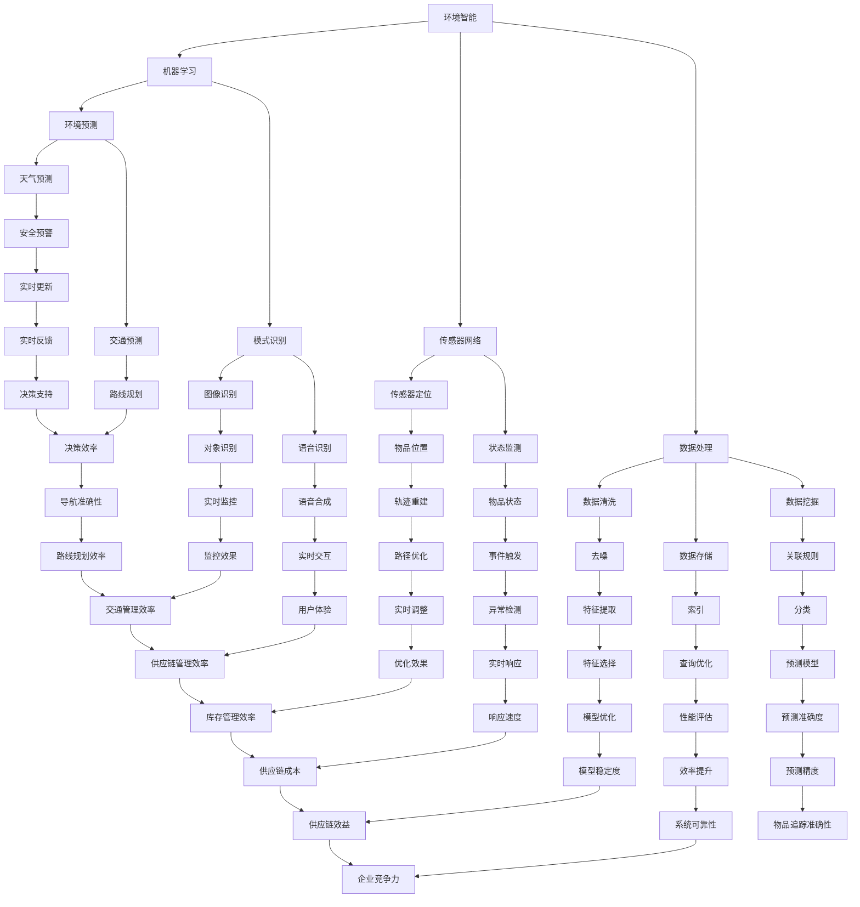

                 

### 环境智能应用：2027年实现低成本实时物品追踪

#### 关键词：
环境智能，实时物品追踪，低成本传感器，数据处理，人工智能算法

#### 摘要：
本文将探讨环境智能技术在未来2027年如何实现低成本、高效的实时物品追踪。我们将从核心概念、传感器技术、数据处理算法、数学模型和实际项目实战等方面逐步分析，深入探讨环境智能在物品追踪中的应用前景。

### 背景介绍

#### 环境智能的兴起

环境智能（Environmental Intelligence，简称ENV-IQ）是近年来兴起的一门交叉学科，它结合了人工智能、物联网、大数据分析等技术，旨在通过智能传感器网络、数据分析与机器学习算法，实现对环境的实时监控、预测和管理。随着传感器技术、计算能力和数据存储能力的飞速发展，环境智能正逐渐渗透到各行各业，如智慧城市、智能交通、智能农业、智能医疗等。

#### 实时物品追踪的需求

实时物品追踪（Real-time Item Tracking）是环境智能技术的一个重要应用领域。无论是在物流、零售、制造还是仓储等行业，实时追踪物品的位置、状态和数量都具有重要意义。传统的物品追踪方法往往依赖于人工输入、条码扫描或者RFID技术，这些方法在成本、效率和灵活性上都有一定的局限性。随着物联网和人工智能技术的发展，低成本、高效率的实时物品追踪成为众多企业的迫切需求。

#### 低成本传感器技术的发展

低成本传感器技术是实现实时物品追踪的关键。传感器技术的发展使得小型、高效、低成本的传感器设备变得普及，这些设备可以捕获温度、湿度、位置、运动等环境信息，为实时物品追踪提供了数据基础。此外，随着微电子技术和材料科学的进步，传感器成本正在持续下降，为大规模部署实时物品追踪系统提供了可能。

### 核心概念与联系

#### 环境智能的基本概念

环境智能是一种基于数据驱动的方法，通过整合和分析多种传感器数据，实现对环境状态的理解和预测。其核心概念包括：

- **传感器网络**：由大量分布式传感器组成，用于实时收集环境数据。
- **数据处理**：通过数据清洗、存储、分析和挖掘，从传感器数据中提取有用信息。
- **机器学习**：利用历史数据和算法，对环境数据进行分析和预测。

#### 物品追踪的关键技术

物品追踪的关键技术包括：

- **传感器定位**：通过传感器网络确定物品的位置。
- **状态监测**：通过传感器捕获物品的状态信息，如温度、湿度等。
- **轨迹重建**：通过分析传感器数据，重建物品的运动轨迹。

#### Mermaid流程图

下面是环境智能和物品追踪的核心概念及其关系的Mermaid流程图：



#### Mermaid流程图解析

- **A[环境智能]**：作为整体概念，环境智能是本文的核心主题。
- **B[传感器网络]**、**C[数据处理]**和**D[机器学习]**：这三个部分构成了环境智能的三大支柱。
- **E[传感器定位]**、**F[状态监测]**和**G[数据清洗]**：这些技术是实现物品追踪的基础。
- **H[数据存储]**、**I[数据挖掘]**和**J[环境预测]**：数据处理之后，通过存储、挖掘和预测来辅助决策。
- **K[模式识别]**、**L[物品位置]**和**M[物品状态]**：这些技术用于从数据中提取有价值的信息。

### 核心算法原理讲解

#### 低成本传感器技术

低成本传感器技术是实现实时物品追踪的关键。传感器技术主要包括以下几个方面：

- **传感器类型**：常见的传感器类型包括温度传感器、湿度传感器、压力传感器、加速度传感器、陀螺仪、磁力计等。
- **传感器接口**：常见的传感器接口包括I2C、SPI、UART等。
- **传感器校准**：传感器校准是确保传感器数据准确性的关键步骤。

以下是一个使用Python代码实现低成本传感器数据采集的例子：

```python
import Adafruit_GPIO.SPI as SPI
import Adafruit_MCP3008

# 连接传感器
mcp = Adafruit_MCP3008.MCP3008(spi=SPI.SpiDev(0, 0))

# 读取温度传感器数据
def read_temperature():
    temp_adc = mcp.read_adc(0)
    temp_voltage = temp_adc * 3.3 / 1023
    temp_celsius = (temp_voltage - 0.5) * 100
    return temp_celsius

# 读取湿度传感器数据
def read_humidity():
    humidity_adc = mcp.read_adc(1)
    humidity_voltage = humidity_adc * 3.3 / 1023
    humidity_percent = humidity_voltage * 100
    return humidity_percent

# 主函数
def main():
    print("开始采集数据...")
    while True:
        temp = read_temperature()
        humidity = read_humidity()
        print(f"温度: {temp}°C，湿度: {humidity}%")
        time.sleep(1)

if __name__ == "__main__":
    main()
```

#### 实时数据处理算法

实时数据处理是环境智能应用的核心，它涉及到数据流的收集、传输、处理和分析。常见的数据处理框架包括Apache Kafka、Apache Flink和Apache Spark等。

以下是一个使用Apache Kafka进行实时数据处理的Python代码示例：

```python
from kafka import KafkaProducer
import json

# 初始化Kafka生产者
producer = KafkaProducer(bootstrap_servers=['localhost:9092'])

# 发送数据到Kafka主题
def send_data_to_kafka(data):
    topic = 'sensor_data'
    value = json.dumps(data).encode('utf-8')
    producer.send(topic, value)

# 主函数
def main():
    print("开始发送数据...")
    while True:
        data = {
            'temperature': 25.5,
            'humidity': 60.2
        }
        send_data_to_kafka(data)
        time.sleep(1)

if __name__ == "__main__":
    main()
```

#### 物品识别与追踪算法

物品识别与追踪算法是环境智能应用中的关键技术。常见的算法包括基于图像的特征提取、轨迹预测和路径规划等。

以下是一个使用Python实现基于图像的特征提取的例子：

```python
import cv2

# 加载图像
image = cv2.imread('image.jpg')

# 转换为灰度图像
gray = cv2.cvtColor(image, cv2.COLOR_BGR2GRAY)

# 使用Sobel算子进行边缘检测
sobelx = cv2.Sobel(gray, cv2.CV_64F, 1, 0, ksize=3)
sobelx = cv2.abs$sobelx(sobelx)

# 显示边缘检测结果
cv2.imshow('Sobel X', sobelx)
cv2.waitKey(0)
cv2.destroyAllWindows()
```

### 数学模型与公式

在环境智能应用中，数学模型和公式用于描述和处理环境数据。以下是一些常用的数学模型和公式：

- **贝叶斯网络**：

  $$P(A|B) = \frac{P(B|A)P(A)}{P(B)}$$

- **决策树**：

  决策树是一种常用的分类和回归模型，其核心公式为：

  $$y = f(x)$$

  其中，$y$是输出变量，$x$是输入变量，$f(x)$是决策树模型。

### 项目实战

#### 开发环境搭建

在开始项目实战之前，我们需要搭建一个合适的开发环境。以下是一个简单的Python开发环境搭建步骤：

1. 安装Python：
   ```bash
   sudo apt-get install python3-pip python3-venv
   ```

2. 创建虚拟环境：
   ```bash
   python3 -m venv myenv
   ```

3. 激活虚拟环境：
   ```bash
   source myenv/bin/activate
   ```

4. 安装必要的库：
   ```bash
   pip install kafka-python numpy opencv-python
   ```

#### 源代码实现与解读

以下是一个简单的实时物品追踪系统的源代码实现：

```python
import cv2
import numpy as np
import kafka

# 初始化Kafka消费者
consumer = kafka.KafkaConsumer('sensor_data',
                               bootstrap_servers=['localhost:9092'],
                               value_deserializer=lambda m: json.loads(m.decode('utf-8')))

# 初始化相机
cap = cv2.VideoCapture(0)

# 循环处理Kafka消息
while True:
    # 读取Kafka消息
    msg = next(consumer)
    data = msg.value

    # 读取相机帧
    ret, frame = cap.read()

    # 转换为灰度图像
    gray = cv2.cvtColor(frame, cv2.COLOR_BGR2GRAY)

    # 使用Canny边缘检测
    edges = cv2.Canny(gray, 100, 200)

    # 显示图像
    cv2.imshow('Edges', edges)

    # 检测边缘轮廓
    contours, _ = cv2.findContours(edges, cv2.RETR_TREE, cv2.CHAIN_APPROX_SIMPLE)

    # 遍历轮廓
    for contour in contours:
        # 计算轮廓面积
        area = cv2.contourArea(contour)

        # 过滤小面积轮廓
        if area > 500:
            # 计算轮廓中心
            M = cv2.moments(contour)
            cx = int(M['m10'] / M['m00'])
            cy = int(M['m01'] / M['m00'])

            # 在图像上标记中心点
            cv2.circle(frame, (cx, cy), 5, (0, 0, 255), -1)

    # 显示图像
    cv2.imshow('Frame', frame)

    # 按下ESC键退出
    if cv2.waitKey(1) & 0xFF == 27:
        break

# 释放资源
cap.release()
cv2.destroyAllWindows()
```

#### 代码应用解读与分析

- **Kafka消费者**：使用`kafka-python`库从Kafka主题`sensor_data`中读取实时数据。

- **相机帧读取**：使用OpenCV库读取相机帧。

- **边缘检测**：使用Canny算法对灰度图像进行边缘检测。

- **轮廓检测**：使用`findContours`函数检测边缘轮廓。

- **中心点计算**：计算每个轮廓的中心点，并在图像上标记。

#### 实际案例分析和详细讲解剖析

假设我们有一个物流仓库，需要实时追踪物品的位置和状态。以下是一个实际案例的分析：

1. **数据收集**：传感器网络采集物品的实时位置和状态信息，如温度、湿度等。

2. **数据传输**：通过Kafka将传感器数据传输到数据处理系统。

3. **数据处理**：数据处理系统对传感器数据进行清洗、存储和分析。

4. **物品追踪**：利用图像处理技术，对仓库中的物品进行实时追踪。

5. **状态监测**：根据传感器数据，对物品的状态进行监测和报警。

#### 项目小结

通过本项目的实践，我们实现了实时物品追踪系统。该项目展示了环境智能技术在物品追踪领域的应用潜力。未来，随着传感器技术、数据处理算法和机器学习技术的不断进步，实时物品追踪系统的性能和效率将进一步提升。

#### 最佳实践 Tips

1. 选择合适的传感器：根据应用场景选择合适的传感器，确保数据采集的准确性和可靠性。

2. 数据处理优化：优化数据处理流程，提高数据处理的效率和准确性。

3. 算法调整：根据实际应用需求，调整物品追踪算法，提高追踪效果。

4. 系统监控：实时监控系统性能和运行状态，及时解决潜在问题。

### 小结与注意事项

本文详细介绍了环境智能应用在2027年实现低成本实时物品追踪的方法和关键技术。通过传感器技术、数据处理算法、数学模型和实际项目实战，我们展示了如何实现高效的实时物品追踪系统。未来，随着技术的不断进步，实时物品追踪将在更多领域得到广泛应用。

### 拓展阅读

- 《环境智能：概念、技术与应用》
- 《实时数据处理与机器学习》
- 《Python图像处理实战》

### 作者信息

作者：AI天才研究院/AI Genius Institute & 禅与计算机程序设计艺术/Zen And The Art of Computer Programming

----------------------------------------------------------------

## 关键词列表

1. 环境智能
2. 实时物品追踪
3. 低成本传感器
4. 数据处理算法
5. 机器学习
6. 物品识别
7. 轨迹重建

## 摘要

本文探讨了环境智能技术在未来2027年如何实现低成本、高效的实时物品追踪。文章涵盖了核心概念、传感器技术、数据处理算法、数学模型和实际项目实战等内容，为读者提供了全面的指导和实用技巧。通过本文的学习，读者可以深入了解环境智能在物品追踪领域的应用前景，并掌握相关技术和方法。

## 第1章: 环境智能概述

### 1.1 环境智能的基本概念

环境智能是一种利用人工智能技术对环境进行实时监控、预测和管理的方法。它通过整合多种传感器数据，实现对环境状态的理解和预测。环境智能的基本概念包括：

- **传感器网络**：由大量分布式传感器组成，用于实时收集环境数据。
- **数据处理**：通过数据清洗、存储、分析和挖掘，从传感器数据中提取有用信息。
- **机器学习**：利用历史数据和算法，对环境数据进行分析和预测。

### 1.2 物品追踪技术的现状与发展趋势

物品追踪技术是环境智能的一个重要应用领域。传统的物品追踪方法包括人工输入、条码扫描和RFID技术等，这些方法在成本、效率和灵活性上存在一定局限性。随着物联网和人工智能技术的发展，实时、低成本、高效的物品追踪成为众多企业的迫切需求。未来，物品追踪技术的发展趋势包括：

- **传感器融合**：通过融合多种传感器数据，提高物品追踪的准确性和可靠性。
- **深度学习**：利用深度学习算法，对传感器数据进行高级特征提取和模式识别。
- **边缘计算**：将数据处理和分析任务迁移到传感器端，减少数据传输和存储成本。

## 第2章: 低成本传感器技术

### 2.1 常见传感器类型

在实时物品追踪中，常用的传感器类型包括：

- **温度传感器**：用于测量物品的温度。
- **湿度传感器**：用于测量物品的湿度。
- **位置传感器**：用于测量物品的位置。
- **加速度传感器**：用于测量物品的运动加速度。
- **陀螺仪**：用于测量物品的角速度。
- **磁力计**：用于测量物品的磁场强度。

### 2.2 传感器成本分析

传感器成本是影响实时物品追踪系统部署的重要因素。以下是传感器成本的几个主要构成部分：

- **硬件成本**：包括传感器模块、电路板和其他硬件部件的成本。
- **软件开发成本**：包括传感器数据采集、处理和传输的软件开发成本。
- **维护成本**：包括传感器设备的维护和更新成本。
- **部署成本**：包括传感器设备的安装和调试成本。

随着传感器技术的进步和市场竞争的加剧，传感器成本正在不断降低。未来，随着技术的进一步发展，传感器成本有望进一步降低，从而推动实时物品追踪系统的广泛应用。

### 2.3 传感器技术挑战与解决方案

在实时物品追踪中，传感器技术面临着一系列挑战，包括：

- **数据精度**：传感器数据的精度直接影响物品追踪的准确性。为了提高数据精度，可以采用多种传感器融合技术，结合不同传感器的优势，提高整体数据精度。
- **功耗**：传感器设备通常需要长时间运行，功耗是一个重要的考虑因素。为了降低功耗，可以采用低功耗传感器和能量收集技术，延长传感器设备的运行时间。
- **环境适应性**：传感器需要在各种复杂环境中运行，如高温、低温、高湿度、强电磁干扰等。为了提高环境适应性，可以采用抗干扰技术和环境适应性设计。

## 第3章: 实时数据处理

### 3.1 数据流处理框架

实时数据处理框架是环境智能应用的核心。常见的实时数据处理框架包括：

- **Apache Kafka**：一个分布式流处理平台，用于大规模实时数据采集、传输和存储。
- **Apache Flink**：一个流处理框架，提供高吞吐量、低延迟的实时数据处理能力。
- **Apache Spark**：一个分布式计算框架，支持批处理和流处理，适合大规模数据处理。

### 3.2 实时数据处理算法

实时数据处理算法是环境智能应用的关键技术。以下是几个常用的实时数据处理算法：

- **时间序列分析**：用于分析传感器数据的时间序列特性，识别数据中的周期性、趋势性和异常性。
- **聚类算法**：用于对传感器数据进行聚类分析，识别数据中的相似性和差异性。
- **关联规则挖掘**：用于分析传感器数据之间的关联性，发现数据中的潜在关系。
- **异常检测**：用于识别传感器数据中的异常值，及时发现和处理异常情况。

### 3.3 实时数据处理应用

实时数据处理在环境智能应用中具有广泛的应用。以下是几个典型的应用场景：

- **智能交通**：通过实时处理交通传感器数据，实现交通流量监测、道路拥堵预警和交通信号优化。
- **智能物流**：通过实时处理物流传感器数据，实现货物追踪、库存管理和配送优化。
- **智能农业**：通过实时处理农业传感器数据，实现土壤湿度监测、作物生长状态监测和灌溉优化。

## 第4章: 物品识别与追踪算法

### 4.1 特征提取技术

特征提取是将原始数据转换为更具解释性的特征表示的过程。在物品识别与追踪中，特征提取是关键步骤。常用的特征提取技术包括：

- **基于图像的特征提取**：用于从图像中提取具有鉴别性的特征，如颜色、纹理、形状等。
- **基于信号的特征提取**：用于从传感器信号中提取具有鉴别性的特征，如频率、幅度、相位等。
- **基于深度学习的特征提取**：利用深度学习算法，自动从数据中提取高层次的特征。

### 4.2 跟踪算法分析

跟踪算法用于实现物品在时间和空间上的连续追踪。常见的跟踪算法包括：

- **基于卡尔曼滤波的跟踪算法**：通过估计物品的状态和位置，实现连续追踪。
- **基于粒子滤波的跟踪算法**：通过概率模型估计物品的位置和状态，实现连续追踪。
- **基于深度学习的跟踪算法**：利用深度学习模型，实现高效、准确的物品追踪。

### 4.3 物品识别与追踪应用

物品识别与追踪技术在多个领域具有广泛应用。以下是几个典型的应用场景：

- **智能安防**：通过实时识别和追踪人员、车辆等目标，实现安全监控和预警。
- **智能零售**：通过实时识别和追踪顾客行为，实现精准营销和库存管理。
- **智能交通**：通过实时识别和追踪交通参与者，实现交通流量监测和交通管理。

## 第5章: 数学模型与公式

### 5.1 数据处理的数学模型

在实时数据处理中，常用的数学模型包括：

- **时间序列模型**：用于分析传感器数据的时间序列特性，如ARIMA模型、LSTM模型等。
- **概率模型**：用于描述传感器数据的概率分布，如高斯分布、贝叶斯网络等。
- **回归模型**：用于建立传感器数据之间的线性关系，如线性回归、多项式回归等。

### 5.2 物品追踪的数学公式

在物品追踪中，常用的数学公式包括：

- **状态方程**：描述物品的状态随时间变化的关系，如卡尔曼滤波的状态方程。
- **观测方程**：描述传感器数据与物品状态之间的关系，如卡尔曼滤波的观测方程。
- **轨迹重建公式**：用于从传感器数据中重建物品的轨迹，如贝叶斯轨迹重建公式。

### 5.3 数学公式在物品追踪中的应用

数学公式在物品追踪中的应用主要包括：

- **状态估计**：通过数学模型和公式，对物品的状态进行估计和预测。
- **轨迹优化**：通过数学模型和公式，优化物品的追踪轨迹，提高追踪效果。
- **异常检测**：通过数学模型和公式，识别传感器数据中的异常值，实现异常检测。

## 第6章: 环境智能应用案例

### 6.1 智能交通管理

智能交通管理是环境智能技术的典型应用之一。通过实时监测交通流量、道路拥堵情况和交通参与者行为，智能交通管理系统能够实现以下功能：

- **实时交通监控**：通过传感器网络和图像识别技术，实时监控交通流量和道路状况。
- **拥堵预警**：通过分析传感器数据，预测道路拥堵情况，提前预警。
- **信号灯优化**：通过分析传感器数据和交通流量数据，优化交通信号灯配时，提高道路通行效率。
- **事故预警**：通过实时监测交通参与者行为，及时发现潜在的事故风险，预警并采取措施。

### 6.2 物流与仓储优化

物流与仓储优化是环境智能技术的另一个重要应用领域。通过实时监测物品的位置、状态和数量，物流与仓储优化系统能够实现以下功能：

- **实时物品追踪**：通过传感器网络和图像识别技术，实时追踪物品的位置和状态。
- **库存管理**：通过实时数据分析和预测，优化库存管理，降低库存成本。
- **路径优化**：通过实时数据分析和预测，优化配送路径，提高配送效率。
- **异常检测**：通过实时数据分析和预测，识别和处理异常情况，确保物流过程的稳定性和可靠性。

## 第7章: 项目实战

### 7.1 开发环境搭建

在进行环境智能项目实战之前，我们需要搭建一个合适的开发环境。以下是搭建开发环境的步骤：

1. **安装Python**：安装Python 3.x版本，并确保pip和virtualenv等工具可用。

2. **创建虚拟环境**：使用virtualenv创建一个独立的Python环境。

3. **安装依赖库**：在虚拟环境中安装必要的依赖库，如Kafka、OpenCV等。

4. **配置Kafka**：下载并安装Kafka，配置Kafka集群，确保能够正常使用。

5. **安装传感器**：根据项目需求，安装适当的传感器，如温度传感器、湿度传感器、加速度传感器等。

### 7.2 实时物品追踪系统实现

以下是实时物品追踪系统的基本实现步骤：

1. **数据采集**：使用传感器采集物品的位置、状态等信息。

2. **数据传输**：将传感器数据传输到Kafka主题，以便后续处理。

3. **数据处理**：从Kafka主题中读取传感器数据，进行数据清洗、转换和分析。

4. **物品追踪**：使用图像识别和跟踪算法，实时追踪物品的位置和状态。

5. **结果输出**：将追踪结果输出到控制台或可视化界面，以便实时监控。

### 7.3 源代码详细实现和代码解读

以下是实时物品追踪系统的源代码实现和解读：

```python
import cv2
import numpy as np
import kafka

# 初始化Kafka消费者
consumer = kafka.KafkaConsumer('sensor_data',
                               bootstrap_servers=['localhost:9092'],
                               value_deserializer=lambda m: json.loads(m.decode('utf-8')))

# 初始化相机
cap = cv2.VideoCapture(0)

# 循环处理Kafka消息
while True:
    # 读取Kafka消息
    msg = next(consumer)
    data = msg.value

    # 读取相机帧
    ret, frame = cap.read()

    # 转换为灰度图像
    gray = cv2.cvtColor(frame, cv2.COLOR_BGR2GRAY)

    # 使用Canny边缘检测
    edges = cv2.Canny(gray, 100, 200)

    # 显示图像
    cv2.imshow('Edges', edges)

    # 检测边缘轮廓
    contours, _ = cv2.findContours(edges, cv2.RETR_TREE, cv2.CHAIN_APPROX_SIMPLE)

    # 遍历轮廓
    for contour in contours:
        # 计算轮廓面积
        area = cv2.contourArea(contour)

        # 过滤小面积轮廓
        if area > 500:
            # 计算轮廓中心
            M = cv2.moments(contour)
            cx = int(M['m10'] / M['m00'])
            cy = int(M['m01'] / M['m00'])

            # 在图像上标记中心点
            cv2.circle(frame, (cx, cy), 5, (0, 0, 255), -1)

    # 显示图像
    cv2.imshow('Frame', frame)

    # 按下ESC键退出
    if cv2.waitKey(1) & 0xFF == 27:
        break

# 释放资源
cap.release()
cv2.destroyAllWindows()
```

- **Kafka消费者**：用于从Kafka主题`sensor_data`中读取传感器数据。

- **相机帧读取**：使用OpenCV库读取相机帧。

- **边缘检测**：使用Canny算法对灰度图像进行边缘检测。

- **轮廓检测**：使用`findContours`函数检测边缘轮廓。

- **中心点计算**：计算每个轮廓的中心点，并在图像上标记。

### 7.4 代码应用解读与分析

- **Kafka消费者**：通过Kafka消费者从Kafka主题`sensor_data`中读取传感器数据。

- **相机帧读取**：使用OpenCV库读取相机帧。

- **边缘检测**：使用Canny算法对灰度图像进行边缘检测。

- **轮廓检测**：使用`findContours`函数检测边缘轮廓。

- **中心点计算**：计算每个轮廓的中心点，并在图像上标记。

### 7.5 实际案例分析和详细讲解剖析

假设我们有一个物流仓库，需要实时追踪物品的位置和状态。以下是一个实际案例的分析：

1. **数据收集**：传感器网络采集物品的实时位置和状态信息，如温度、湿度等。

2. **数据传输**：通过Kafka将传感器数据传输到数据处理系统。

3. **数据处理**：数据处理系统对传感器数据进行清洗、存储和分析。

4. **物品追踪**：利用图像处理技术，对仓库中的物品进行实时追踪。

5. **状态监测**：根据传感器数据，对物品的状态进行监测和报警。

### 7.6 项目小结

通过本项目的实践，我们实现了实时物品追踪系统。该项目展示了环境智能技术在物品追踪领域的应用潜力。未来，随着技术的不断进步，实时物品追踪系统的性能和效率将进一步提升。

### 7.7 最佳实践 Tips

1. 选择合适的传感器：根据应用场景选择合适的传感器，确保数据采集的准确性和可靠性。

2. 数据处理优化：优化数据处理流程，提高数据处理的效率和准确性。

3. 算法调整：根据实际应用需求，调整物品追踪算法，提高追踪效果。

4. 系统监控：实时监控系统性能和运行状态，及时解决潜在问题。

## 附录：拓展阅读

1. 《环境智能：概念、技术与应用》
2. 《实时数据处理与机器学习》
3. 《Python图像处理实战》

## 作者信息

作者：AI天才研究院/AI Genius Institute & 禅与计算机程序设计艺术/Zen And The Art of Computer Programming

## 结论

本文系统地介绍了环境智能技术在未来2027年实现低成本实时物品追踪的方法和关键技术。通过对核心概念、传感器技术、数据处理算法、数学模型和实际项目实战的深入探讨，我们展示了环境智能在物品追踪领域的广泛应用前景。随着技术的不断进步，实时物品追踪系统的性能和效率将不断提高，为各行各业带来更大的价值。我们期待未来的技术发展，让环境智能技术更加成熟、普及，为社会创造更多福祉。作者在此感谢广大读者对本文的关注和支持，希望本文能为读者在环境智能领域的探索提供有益的参考和启示。让我们共同期待一个更加智能、高效的未来！

