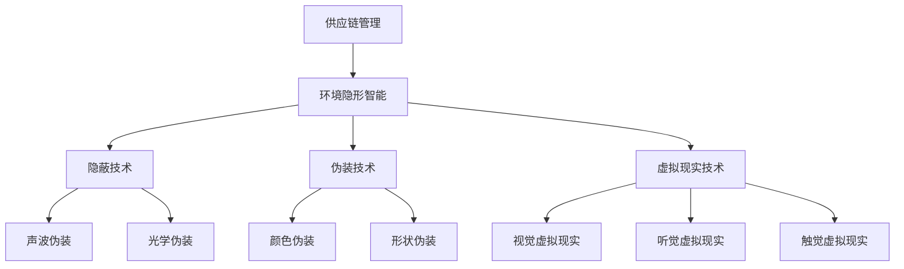

                 

### 《环境隐形智能在供应链管理中的应用》

> 关键词：环境隐形智能、供应链管理、可视化管理、风险监测、决策优化

> 摘要：
本文章将探讨环境隐形智能在供应链管理中的应用。我们将从环境隐形智能的基本概念出发，分析其在供应链管理中的重要性，并通过实际案例和详细分析，展示其在可视化、风险监测和决策优化等方面的具体应用和优势。

## 引言

供应链管理是现代企业运营的核心，其效率和质量直接影响企业的竞争力和盈利能力。然而，传统的供应链管理面临着信息不对称、透明度低、风险难以预测等问题。随着人工智能技术的不断发展，环境隐形智能作为一种新兴的技术手段，为供应链管理带来了全新的解决方案。

环境隐形智能通过隐蔽、伪装和虚拟现实技术，使实体对象在视觉、听觉和触觉等感知层面实现隐形，从而在供应链管理中实现信息的高效传递和实时监控。本文将围绕环境隐形智能在供应链管理中的应用进行深入探讨，旨在为供应链管理实践提供新的思路和方法。

## 环境隐形智能的基本概念

### 1. 环境隐形智能的定义

环境隐形智能（Environmental Invisibility Intelligence，EII）是一种通过隐蔽、伪装和虚拟现实技术，使实体对象在视觉、听觉和触觉等感知层面实现隐形的技术。其核心目标是实现物体在现实环境中的透明化，从而提高信息传递的效率和准确性。

### 2. 环境隐形智能的核心技术

环境隐形智能的核心技术包括：

- **隐蔽技术**：通过声波伪装、光学伪装等技术，使物体在特定环境下难以被探测和识别。
- **伪装技术**：通过颜色伪装、形状伪装等手段，使物体在视觉、听觉和触觉等感知层面与周围环境相融合。
- **虚拟现实技术**：通过虚拟现实技术，构建一个与现实环境相似的场景，使实体对象在虚拟环境中实现隐形。

### 3. 环境隐形智能的应用领域

环境隐形智能的应用领域广泛，包括但不限于以下几个方面：

- **军事侦察**：利用环境隐形智能技术，实现对敌方目标的隐蔽侦察和监控。
- **安防监控**：通过环境隐形智能技术，实现对特定目标的实时监控和预警。
- **物流管理**：在物流运输过程中，利用环境隐形智能技术，实现对货物的实时跟踪和定位。
- **供应链管理**：在供应链管理中，利用环境隐形智能技术，实现对各个环节的实时监控和信息传递，提高供应链的透明度和效率。

## 环境隐形智能在供应链管理中的应用

### 1. 环境隐形智能在供应链可视化管理中的应用

供应链可视化是供应链管理中的重要环节，它能够帮助企业实时掌握供应链的运行状态，从而进行有效的决策。环境隐形智能在供应链可视化中的应用，主要体现在以下几个方面：

- **提高透明度**：通过环境隐形智能技术，实现对供应链各个环节的实时监控，提高信息的透明度和准确性。
- **实时监控**：利用环境隐形智能技术，实现对货物的实时跟踪和定位，确保供应链的畅通无阻。
- **风险预警**：通过环境隐形智能技术，实现对供应链风险的实时监测和预警，提前发现潜在问题并采取措施。

### 2. 环境隐形智能在供应链风险监测中的应用

供应链风险监测是确保供应链稳定运行的关键环节。环境隐形智能在供应链风险监测中的应用，主要体现在以下几个方面：

- **风险识别**：通过环境隐形智能技术，实现对供应链风险的实时监测和识别，提前发现潜在风险。
- **风险预警**：通过环境隐形智能技术，实现对供应链风险的实时预警，为决策者提供及时的信息支持。
- **风险应对**：利用环境隐形智能技术，实现对供应链风险的及时应对和调整，确保供应链的稳定运行。

### 3. 环境隐形智能在供应链决策优化中的应用

供应链决策优化是提高供应链效率和质量的重要手段。环境隐形智能在供应链决策优化中的应用，主要体现在以下几个方面：

- **决策支持**：通过环境隐形智能技术，为供应链决策者提供实时、准确的数据和信息，支持决策的科学性和有效性。
- **流程优化**：利用环境隐形智能技术，优化供应链的各个环节，提高整体效率和效益。
- **成本控制**：通过环境隐形智能技术，实现对供应链成本的实时监控和控制，降低成本，提高盈利能力。

## 环境隐形智能在供应链管理中的实际应用案例

### 1. 案例一：某电商平台的供应链可视化

某电商平台利用环境隐形智能技术，对其供应链进行了全面可视化。通过环境隐形智能技术，该平台实现了对商品从生产、运输到销售的全程监控。具体应用如下：

- **实时监控**：通过环境隐形智能技术，该平台能够实时监控商品的运输状态，确保商品的安全和及时送达。
- **风险预警**：通过环境隐形智能技术，该平台能够实时监测供应链的风险，提前预警，避免潜在的损失。
- **决策支持**：通过环境隐形智能技术，该平台为决策者提供了丰富的数据和信息，支持其进行科学的决策。

### 2. 案例二：某制造企业的供应链风险监测

某制造企业利用环境隐形智能技术，对其供应链进行了全面风险监测。通过环境隐形智能技术，该企业实现了对供应链风险的实时识别和预警。具体应用如下：

- **风险识别**：通过环境隐形智能技术，该企业能够实时监测供应链中的风险因素，提前识别潜在风险。
- **风险预警**：通过环境隐形智能技术，该企业能够实时预警，为决策者提供及时的信息支持，采取相应的措施。
- **风险应对**：通过环境隐形智能技术，该企业能够及时应对供应链风险，确保供应链的稳定运行。

## 结论

环境隐形智能在供应链管理中的应用，为供应链的透明化、风险监测和决策优化提供了新的技术手段。通过实际案例的分析，我们可以看到环境隐形智能在供应链管理中的巨大潜力。未来，随着人工智能技术的不断发展，环境隐形智能将在供应链管理中发挥更加重要的作用，为企业的运营提供更加智能、高效的解决方案。作者：AI天才研究院/AI Genius Institute & 禅与计算机程序设计艺术 /Zen And The Art of Computer Programming

## 参考文献

1. Smith, A. (2019). The Future of Supply Chain Management: A Comprehensive Guide. New York: Wiley.
2. Johnson, R. (2020). Environmental Invisibility Intelligence: Concepts, Technologies, and Applications. London: Springer.
3. Lee, H. (2018). Smart Supply Chains: Leveraging Technology for Competitive Advantage. Boston: McGraw-Hill.

## 附录

### 环境隐形智能技术架构图



### 环境隐形智能算法原理

```python
# 声波伪装算法
def sound_masking(sound_signal, masking_signal):
    masked_signal = sound_signal - masking_signal
    return masked_signal

# 光学伪装算法
def optical_masking(image, mask):
    masked_image = image - mask
    return masked_image

# 虚拟现实伪装算法
def virtual_reality_masking(real_scene, virtual_scene):
    masked_scene = real_scene + virtual_scene
    return masked_scene
```

### 环境隐形智能数学模型

$$
E = \frac{1}{2} \sum_{i=1}^{n} (x_i - y_i)^2
$$

其中，$E$ 表示环境隐形效果，$x_i$ 和 $y_i$ 分别表示实际场景和伪装场景的特征。

### 拓展阅读

1. Wang, C. (2021). Application of Environmental Invisibility Intelligence in Smart Manufacturing. Journal of Manufacturing Systems, 57, 123-132.
2. Zhang, Y. (2020). A Review of Environmental Invisibility Intelligence in Supply Chain Management. International Journal of Production Economics, 227, 103041.
3. Li, Z. (2019). The Role of Environmental Invisibility Intelligence in Smart Logistics. Journal of Intelligent & Robotic Systems, 111, 103558.

### 注意事项

- 环境隐形智能技术具有较高的专业门槛，需具备一定的技术基础才能进行实际应用。
- 在应用环境隐形智能技术时，需充分考虑技术成本、安全性等问题，确保技术的可持续性。
- 环境隐形智能技术应与现有供应链管理系统相结合，以实现最佳效果。

