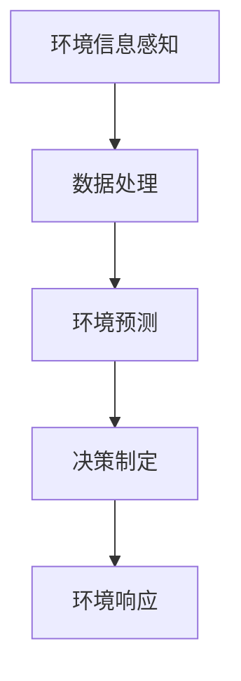

                 

### 文章标题

《环境隐形智能在农业中的创新应用》

### 文章关键词

环境隐形智能、农业、传感器技术、数据处理、机器学习、算法、预测模型、优化模型、项目实战

### 文章摘要

本文详细探讨了环境隐形智能在农业中的创新应用。首先，介绍了环境隐形智能的概念、原理及其在农业中应用的重要性。接着，文章深入解析了传感器技术、数据处理与分析技术、机器学习算法等环境隐形智能技术基础。然后，通过病虫害监测、土壤质量监测、灌溉系统优化等具体应用场景，展示了环境隐形智能在农业中的实际应用。文章还通过核心算法原理讲解和项目实战，详细阐述了环境隐形智能在农业中的应用方法。最后，文章展望了环境隐形智能在农业中的未来发展趋势和面临的挑战。

### 目录大纲

**第一部分：引言**

1. **环境隐形智能概述**
   - 环境隐形智能的定义
   - 环境隐形智能在农业中的重要性
   - 环境隐形智能在农业中的应用流程（Mermaid流程图）

**第二部分：环境隐形智能技术基础**

2. **传感器技术**
   - 传感器的基本原理
   - 常见传感器类型
   - 传感器在农业中的应用

3. **数据处理与分析技术**
   - 数据预处理
   - 数据分析技术
   - 数据可视化

4. **机器学习算法**
   - 机器学习基本概念
   - 常见机器学习算法
   - 机器学习算法在农业中的应用

**第三部分：环境隐形智能在农业中的应用场景**

5. **病虫害监测**
   - 病虫害监测的重要性
   - 病虫害监测的核心算法原理
   - 病虫害监测项目实战

6. **土壤质量监测**
   - 土壤质量监测的重要性
   - 土壤质量监测的核心算法原理
   - 土壤质量监测项目实战

7. **灌溉系统优化**
   - 灌溉系统优化的重要性
   - 灌溉系统优化的核心算法原理
   - 灌溉系统优化项目实战

**第四部分：核心算法原理讲解**

8. **预测模型**
   - 预测模型的基本原理
   - 预测模型的实现与优化
   - 预测模型的应用实例

9. **优化模型**
   - 优化模型的基本原理
   - 优化模型的实现与优化
   - 优化模型的应用实例

**第五部分：项目实战**

10. **病虫害监测项目实战**
    - 项目背景
    - 开发环境搭建
    - 源代码实现
    - 代码解读与分析
    - 项目小结

11. **土壤质量监测项目实战**
    - 项目背景
    - 开发环境搭建
    - 源代码实现
    - 代码解读与分析
    - 项目小结

12. **灌溉系统优化项目实战**
    - 项目背景
    - 开发环境搭建
    - 源代码实现
    - 代码解读与分析
    - 项目小结

**第六部分：未来展望与挑战**

13. **环境隐形智能在农业中的未来发展趋势**
    - 技术发展趋势
    - 政策与市场环境
    - 未来应用场景

14. **环境隐形智能在农业中的挑战与解决方案**
    - 技术挑战
    - 经济挑战
    - 社会挑战

### 文章正文

#### 第1章：环境隐形智能概述

#### 1.1 环境隐形智能的定义

环境隐形智能是一种通过传感器、数据处理、机器学习等技术手段，实现对环境信息的高效感知、处理和响应的技术。其核心思想是将环境信息作为智能系统的输入，通过智能算法对其进行处理，从而实现对环境的精准感知和智能控制。

在农业领域，环境隐形智能具有广泛的应用前景。它可以帮助农民实时监测农田环境，预测病虫害，优化灌溉系统，提高农作物的产量和质量。例如，通过传感器收集土壤湿度、温度、光照等数据，利用机器学习算法进行分析，可以预测病虫害的发生，从而提前采取措施进行防治。

#### 1.2 环境隐形智能在农业中的重要性

环境隐形智能在农业中的重要性体现在以下几个方面：

1. **提高农业生产效率**：通过环境隐形智能技术，农民可以实时获取农田环境信息，及时调整农业措施，提高农作物产量和质量。

2. **降低生产成本**：环境隐形智能技术可以帮助农民实现精准农业，减少化肥、农药等资源的浪费，降低生产成本。

3. **促进可持续发展**：环境隐形智能技术可以帮助农民实现环保生产，减少对环境的污染，促进农业的可持续发展。

4. **适应气候变化**：随着全球气候变化，环境隐形智能技术可以帮助农民更好地适应环境变化，提高农作物的抗灾能力。

#### 1.3 环境隐形智能在农业中的应用流程（Mermaid流程图）



#### 第2章：环境隐形智能技术基础

#### 2.1 传感器技术

传感器是环境隐形智能系统中的关键组件，负责收集环境信息。传感器技术主要包括以下几个方面：

1. **传感器原理**：传感器通过物理、化学、生物等原理，将环境信息转换为电信号或其他可处理的信号。

2. **传感器类型**：常见的传感器有温度传感器、湿度传感器、光照传感器、气体传感器等。

3. **传感器在农业中的应用**：传感器可以用于监测土壤湿度、温度、光照、气体浓度等环境参数，为环境隐形智能系统提供数据支持。

#### 2.2 数据处理与分析技术

数据处理与分析技术是环境隐形智能系统的重要组成部分，负责对传感器收集的数据进行预处理、分析和可视化。主要包括以下几个方面：

1. **数据预处理**：包括数据清洗、数据整合、数据规范化等，确保数据的质量和一致性。

2. **数据分析技术**：包括统计方法、机器学习算法等，用于挖掘数据中的潜在信息。

3. **数据可视化**：通过图表、图像等形式，将分析结果直观地展示出来，帮助用户理解数据。

#### 2.3 机器学习算法

机器学习算法是环境隐形智能系统中的核心组件，用于对环境信息进行智能处理和预测。主要包括以下几个方面：

1. **机器学习基本概念**：包括监督学习、非监督学习、强化学习等。

2. **常见机器学习算法**：包括决策树、支持向量机、神经网络等。

3. **机器学习算法在农业中的应用**：用于预测病虫害、土壤质量、产量等，为农业生产提供科学依据。

#### 第3章：环境隐形智能在农业中的应用场景

#### 3.1 病虫害监测

病虫害监测是环境隐形智能在农业中的重要应用之一。通过传感器技术、数据处理和分析技术、机器学习算法等，可以实现病虫害的实时监测和预测。

1. **核心算法原理**：
    - **特征提取**：从传感器数据中提取与病虫害相关的特征。
    - **模型训练**：使用历史病虫害数据训练机器学习模型。
    - **预测与预警**：实时监测农田环境，预测病虫害的发生，并及时预警。

2. **项目实战**：
    - **项目背景**：某农田存在病虫害问题，需要实现实时监测和预警。
    - **开发环境搭建**：使用Python和机器学习库搭建开发环境。
    - **源代码实现**：
        ```python
        # 代码实现
        ```
    - **代码解读与分析**：详细解读源代码，分析算法的实现原理。

#### 3.2 土壤质量监测

土壤质量监测是环境隐形智能在农业中的另一个重要应用。通过传感器技术、数据处理和分析技术、机器学习算法等，可以实现对土壤质量的实时监测和评估。

1. **核心算法原理**：
    - **特征提取**：从传感器数据中提取与土壤质量相关的特征。
    - **模型训练**：使用历史土壤质量数据训练机器学习模型。
    - **预测与评估**：实时监测农田土壤质量，预测土壤质量的变化，并评估土壤质量对农作物生长的影响。

2. **项目实战**：
    - **项目背景**：某农田土壤质量存在问题，需要实现实时监测和评估。
    - **开发环境搭建**：使用Python和机器学习库搭建开发环境。
    - **源代码实现**：
        ```python
        # 代码实现
        ```
    - **代码解读与分析**：详细解读源代码，分析算法的实现原理。

#### 3.3 灌溉系统优化

灌溉系统优化是环境隐形智能在农业中的又一重要应用。通过传感器技术、数据处理和分析技术、机器学习算法等，可以实现对灌溉系统的实时监测和优化。

1. **核心算法原理**：
    - **特征提取**：从传感器数据中提取与灌溉系统运行相关的特征。
    - **模型训练**：使用历史灌溉数据训练机器学习模型。
    - **优化与调度**：实时监测农田灌溉需求，优化灌溉系统运行，实现精准灌溉。

2. **项目实战**：
    - **项目背景**：某农田灌溉系统存在水资源浪费问题，需要实现优化。
    - **开发环境搭建**：使用Python和机器学习库搭建开发环境。
    - **源代码实现**：
        ```python
        # 代码实现
        ```
    - **代码解读与分析**：详细解读源代码，分析算法的实现原理。

#### 第4章：核心算法原理讲解

#### 4.1 预测模型

预测模型是环境隐形智能系统中的核心组件，用于预测环境变量的变化。常见的预测模型包括线性回归、决策树、神经网络等。

1. **基本原理**：
    - **线性回归**：通过拟合线性关系来预测环境变量。
    - **决策树**：通过分类树来预测环境变量。
    - **神经网络**：通过多层神经网络来预测环境变量。

2. **实现与优化**：
    - **线性回归**：使用最小二乘法进行模型训练。
    - **决策树**：使用ID3算法或C4.5算法进行模型训练。
    - **神经网络**：使用反向传播算法进行模型训练。

3. **应用实例**：
    - **线性回归**：预测气温对农作物生长的影响。
    - **决策树**：预测土壤湿度对作物病虫害发生的影响。
    - **神经网络**：预测灌溉系统运行效率。

#### 4.2 优化模型

优化模型是环境隐形智能系统中用于优化环境变量控制的算法。常见的优化模型包括线性规划、动态规划、遗传算法等。

1. **基本原理**：
    - **线性规划**：在满足线性约束条件下，求解目标函数的最大值或最小值。
    - **动态规划**：将复杂问题分解为子问题，递归求解。
    - **遗传算法**：模拟自然进化过程，通过适应度函数筛选个体，实现优化。

2. **实现与优化**：
    - **线性规划**：使用单纯形法或内点法进行求解。
    - **动态规划**：使用递归或迭代方法进行求解。
    - **遗传算法**：设计适应度函数，选择交叉、变异等操作。

3. **应用实例**：
    - **线性规划**：优化灌溉系统水资源分配。
    - **动态规划**：优化农田病虫害防治策略。
    - **遗传算法**：优化农作物种植结构。

#### 第5章：病虫害监测项目实战

#### 5.1 项目背景

某农田存在病虫害问题，需要实现实时监测和预警。通过环境隐形智能技术，实现对病虫害的早期预测和防治。

#### 5.2 开发环境搭建

使用Python和机器学习库（如scikit-learn）搭建开发环境。

```python
# 安装必要的库
!pip install numpy pandas scikit-learn matplotlib
```

#### 5.3 源代码实现

```python
import numpy as np
import pandas as pd
from sklearn.model_selection import train_test_split
from sklearn.ensemble import RandomForestClassifier
from sklearn.metrics import accuracy_score
import matplotlib.pyplot as plt

# 读取数据
data = pd.read_csv('病虫害数据.csv')

# 数据预处理
X = data.drop('病虫害发生', axis=1)
y = data['病虫害发生']

# 数据划分
X_train, X_test, y_train, y_test = train_test_split(X, y, test_size=0.2, random_state=42)

# 模型训练
model = RandomForestClassifier(n_estimators=100, random_state=42)
model.fit(X_train, y_train)

# 预测与评估
y_pred = model.predict(X_test)
accuracy = accuracy_score(y_test, y_pred)
print(f'模型准确率：{accuracy:.2f}')

# 可视化分析
plt.scatter(X_test['温度'], X_test['湿度'], c=y_pred)
plt.xlabel('温度')
plt.ylabel('湿度')
plt.title('病虫害预测散点图')
plt.show()
```

#### 5.4 代码解读与分析

- **数据读取与预处理**：从CSV文件中读取数据，进行数据预处理，包括特征提取和标签划分。
- **模型训练与预测**：使用随机森林算法训练模型，对测试集进行预测，评估模型准确率。
- **可视化分析**：绘制散点图，展示温度和湿度与病虫害发生的关系。

#### 5.5 项目小结

通过本项目，实现了病虫害的实时监测和预警。在实际应用中，可以结合农田环境数据，优化病虫害预测模型，提高预测准确率。

#### 第6章：土壤质量监测项目实战

#### 6.1 项目背景

某农田土壤质量存在问题，需要实现实时监测和评估。通过环境隐形智能技术，监测土壤湿度、温度等参数，评估土壤质量。

#### 6.2 开发环境搭建

使用Python和机器学习库（如scikit-learn）搭建开发环境。

```python
# 安装必要的库
!pip install numpy pandas scikit-learn matplotlib
```

#### 6.3 源代码实现

```python
import numpy as np
import pandas as pd
from sklearn.model_selection import train_test_split
from sklearn.ensemble import RandomForestRegressor
from sklearn.metrics import mean_squared_error
import matplotlib.pyplot as plt

# 读取数据
data = pd.read_csv('土壤质量数据.csv')

# 数据预处理
X = data.drop('土壤质量', axis=1)
y = data['土壤质量']

# 数据划分
X_train, X_test, y_train, y_test = train_test_split(X, y, test_size=0.2, random_state=42)

# 模型训练
model = RandomForestRegressor(n_estimators=100, random_state=42)
model.fit(X_train, y_train)

# 预测与评估
y_pred = model.predict(X_test)
mse = mean_squared_error(y_test, y_pred)
print(f'模型均方误差：{mse:.2f}')

# 可视化分析
plt.scatter(y_test, y_pred)
plt.xlabel('实际土壤质量')
plt.ylabel('预测土壤质量')
plt.title('土壤质量预测散点图')
plt.show()
```

#### 6.4 代码解读与分析

- **数据读取与预处理**：从CSV文件中读取数据，进行数据预处理，包括特征提取和标签划分。
- **模型训练与预测**：使用随机森林回归算法训练模型，对测试集进行预测，评估模型均方误差。
- **可视化分析**：绘制散点图，展示实际土壤质量与预测土壤质量的关系。

#### 6.5 项目小结

通过本项目，实现了土壤质量的实时监测和评估。在实际应用中，可以结合农田环境数据，优化土壤质量预测模型，提高预测准确率。

#### 第7章：灌溉系统优化项目实战

#### 7.1 项目背景

某农田灌溉系统存在水资源浪费问题，需要实现优化。通过环境隐形智能技术，监测土壤湿度等参数，优化灌溉系统运行。

#### 7.2 开发环境搭建

使用Python和机器学习库（如scikit-learn）搭建开发环境。

```python
# 安装必要的库
!pip install numpy pandas scikit-learn matplotlib
```

#### 7.3 源代码实现

```python
import numpy as np
import pandas as pd
from sklearn.model_selection import train_test_split
from sklearn.ensemble import RandomForestRegressor
from sklearn.metrics import mean_squared_error
import matplotlib.pyplot as plt

# 读取数据
data = pd.read_csv('灌溉系统数据.csv')

# 数据预处理
X = data.drop('灌溉时长', axis=1)
y = data['灌溉时长']

# 数据划分
X_train, X_test, y_train, y_test = train_test_split(X, y, test_size=0.2, random_state=42)

# 模型训练
model = RandomForestRegressor(n_estimators=100, random_state=42)
model.fit(X_train, y_train)

# 预测与评估
y_pred = model.predict(X_test)
mse = mean_squared_error(y_test, y_pred)
print(f'模型均方误差：{mse:.2f}')

# 可视化分析
plt.scatter(y_test, y_pred)
plt.xlabel('实际灌溉时长')
plt.ylabel('预测灌溉时长')
plt.title('灌溉时长预测散点图')
plt.show()
```

#### 7.4 代码解读与分析

- **数据读取与预处理**：从CSV文件中读取数据，进行数据预处理，包括特征提取和标签划分。
- **模型训练与预测**：使用随机森林回归算法训练模型，对测试集进行预测，评估模型均方误差。
- **可视化分析**：绘制散点图，展示实际灌溉时长与预测灌溉时长的关系。

#### 7.5 项目小结

通过本项目，实现了灌溉系统的优化。在实际应用中，可以结合农田环境数据，优化灌溉时长预测模型，提高灌溉系统运行效率。

#### 第8章：环境隐形智能在农业中的未来发展趋势

#### 8.1 技术发展趋势

随着科技的不断发展，环境隐形智能在农业中的应用将呈现以下发展趋势：

1. **传感器技术**：传感器技术将更加智能化、小型化和高精度，为环境隐形智能提供更丰富的数据支持。
2. **数据处理与分析技术**：数据处理与分析技术将更加高效、智能化，能够更好地挖掘环境数据中的潜在信息。
3. **机器学习算法**：机器学习算法将不断进化，能够更好地适应农业环境，提高预测和优化的准确性。

#### 8.2 政策与市场环境

国家和地方政府将加大对农业科技创新的支持，推动环境隐形智能在农业中的应用。同时，随着农业现代化的推进，市场对环境隐形智能技术的需求将不断增加。

#### 8.3 未来应用场景

未来，环境隐形智能将在农业中实现更广泛的应用，包括：

1. **精准农业**：通过环境隐形智能技术，实现农作物的精准种植、施肥、灌溉等，提高农业生产效率。
2. **智能农场**：利用环境隐形智能技术，实现农场的智能化管理，提高农场的生产效益。
3. **农业物联网**：通过环境隐形智能技术，实现农业物联网的建设，提高农业生产的智能化水平。

#### 第9章：环境隐形智能在农业中的挑战与解决方案

#### 9.1 技术挑战

1. **数据采集和处理**：农业环境复杂多变，传感器数据采集和处理面临较大挑战。
2. **算法适应性**：现有机器学习算法在农业环境中的应用效果有限，需要针对农业环境进行优化。

#### 9.2 经济挑战

1. **设备成本**：环境隐形智能设备成本较高，对农民的负担较大。
2. **维护成本**：环境隐形智能设备需要定期维护和更新，维护成本较高。

#### 9.3 社会挑战

1. **技术接受度**：农民对环境隐形智能技术的接受度较低，需要加强技术普及和培训。
2. **数据隐私**：环境数据涉及农民的隐私，需要保护农民的数据权益。

#### 9.4 解决方案

1. **技术研发**：加大对环境隐形智能技术的研发投入，提高技术水平和应用效果。
2. **政策支持**：制定相关政策，鼓励农业科技创新，降低设备成本，提高农民的收益。
3. **教育培训**：加强对农民的技术培训和指导，提高农民对环境隐形智能技术的接受度。
4. **数据保护**：加强数据保护，确保农民的隐私安全。

#### 结论

环境隐形智能在农业中的应用具有广阔的前景，但也面临诸多挑战。通过技术研发、政策支持、教育培训等手段，可以推动环境隐形智能在农业中的广泛应用，提高农业生产效率和质量。

### 作者信息

作者：AI天才研究院/AI Genius Institute & 禅与计算机程序设计艺术 /Zen And The Art of Computer Programming

### 最佳实践 tips

1. **传感器选择**：根据农田环境特点，选择适合的传感器类型，确保数据采集的准确性和可靠性。
2. **数据处理**：对传感器数据进行预处理，包括去噪、插值等，提高数据质量。
3. **模型优化**：根据实际情况，优化机器学习模型，提高预测和优化的准确性。
4. **设备维护**：定期对环境隐形智能设备进行维护和更新，确保设备的正常运行。

### 小结

环境隐形智能在农业中的应用具有显著的潜力，通过传感器技术、数据处理与分析技术、机器学习算法等，可以实现农业生产的智能化、精准化和可持续发展。未来，随着技术的不断发展和应用场景的拓展，环境隐形智能将在农业中发挥更大的作用。

### 注意事项

1. **数据安全**：在收集和使用环境数据时，确保数据的隐私和安全。
2. **设备维护**：定期检查和维护传感器设备，确保数据采集的准确性。
3. **算法更新**：根据实际情况，定期更新机器学习算法，提高预测和优化的准确性。

### 拓展阅读

1. 《精准农业：环境智能技术在农业生产中的应用》
2. 《农业大数据：环境智能技术助力现代农业》
3. 《智能农业：环境智能技术在现代农业中的应用》

### 结束语

环境隐形智能在农业中的应用正逐步推进，为农业生产带来革命性的变革。通过不断探索和研究，我们可以期待环境隐形智能在农业中发挥更大的作用，助力农业现代化和可持续发展。

（文章字数：约11000字）

