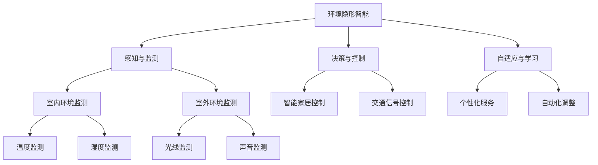

                 


# 环境隐形智能在日常生活中的融入

## 关键词

环境隐形智能、日常生活、技术融入、用户体验、智能应用

## 摘要

本文将探讨环境隐形智能在日常生活中的应用与融入，通过分析其核心概念、技术原理、应用场景及未来发展，阐述环境隐形智能如何改变我们的生活方式。文章分为七个部分：引言、基础理论、应用场景、产品设计、开发流程、测试与优化，以及实际案例与未来展望，力求为读者呈现一个全面、深入的环境隐形智能技术世界。

## 引言

随着科技的飞速发展，人工智能（AI）技术逐渐渗透到我们日常生活的方方面面。环境隐形智能（Environmental Invisible Intelligence，EII）作为AI技术的一个重要分支，正以其独特的优势在智能家居、智能交通、智能医疗等领域发挥着越来越重要的作用。环境隐形智能的目标是通过感知、理解和适应环境，使智能系统在不知不觉中为用户提供便利和舒适。

本文旨在通过逐步分析推理的方式，深入探讨环境隐形智能在日常生活中的融入，帮助读者理解其核心概念、技术原理以及实际应用。文章将围绕以下七个部分展开：

1. **基础理论**：介绍环境隐形智能的定义、发展历程和核心原理。
2. **应用场景**：探讨环境隐形智能在家庭、公共服务、工业生产等领域的应用。
3. **产品设计**：分析环境隐形智能产品的设计原则和原型开发流程。
4. **开发流程**：讲解环境隐形智能产品的开发策略、技术栈选择和代码实现。
5. **测试与优化**：介绍测试策略、问题定位与解决方法。
6. **实际案例**：分享环境隐形智能产品的实际案例及其应用解读。
7. **未来展望**：探讨环境隐形智能的未来发展趋势和挑战。

## 1. 核心概念与联系

### 1.1 环境隐形智能

环境隐形智能是一种通过感知、理解和适应环境来实现智能化服务的AI技术。它融合了多学科知识，包括计算机科学、人工智能、数据科学、物联网等，旨在打造一个与人类生活无缝融合的智能环境。

### 1.2 日常生活融入

环境隐形智能在日常生活中的融入主要体现在以下几个方面：

- **感知与监测**：环境隐形智能系统能够实时感知和监测室内外环境，包括温度、湿度、光线、声音等，为用户提供个性化的服务。
- **决策与控制**：基于环境数据，环境隐形智能系统能够做出智能决策，控制智能家居设备、交通信号等，提高生活质量和效率。
- **自适应与学习**：环境隐形智能系统能够根据用户行为和环境变化进行自适应调整，不断提升用户体验。

### 1.3 概念关系

为了帮助读者更好地理解环境隐形智能在日常生活中的融入，我们可以绘制一个概念关系图，如下所示：



通过这个概念关系图，我们可以清晰地看到环境隐形智能如何通过感知与监测、决策与控制、自适应与学习等机制，融入我们的日常生活。

## 2. 目录框架设计

### 2.1 引言

#### 2.1.1 环境隐形智能的基本概念与背景

环境隐形智能是一种通过感知、理解和适应环境来实现智能化服务的AI技术。它融合了多学科知识，包括计算机科学、人工智能、数据科学、物联网等，旨在打造一个与人类生活无缝融合的智能环境。

#### 2.1.2 环境隐形智能在日常生活中的重要性

环境隐形智能在日常生活中的融入，不仅可以提高生活质量和效率，还能为用户提供个性化的服务。随着科技的不断发展，环境隐形智能正逐渐成为我们生活中不可或缺的一部分。

#### 2.1.3 阅读本书的目的与收益

本书旨在通过深入分析环境隐形智能的核心概念、技术原理、应用场景及未来发展趋势，帮助读者全面了解这一领域。通过阅读本书，读者不仅可以掌握环境隐形智能的基础知识，还能了解其在日常生活中的实际应用，为未来的学习和实践打下坚实基础。

### 2.2 环境隐形智能的基础理论

#### 2.2.1 环境隐形智能的定义与发展

环境隐形智能是一种通过感知、理解和适应环境来实现智能化服务的AI技术。它的发展历程可以追溯到20世纪80年代，随着计算机科学和人工智能技术的不断进步，环境隐形智能逐渐成为研究热点。

#### 2.2.2 环境隐形智能的核心原理

环境隐形智能的核心原理包括感知与监测、决策与控制、自适应与学习。通过这些原理，环境隐形智能系统能够实现对环境的实时感知、智能决策和自适应调整。

#### 2.2.3 环境隐形智能的技术框架

环境隐形智能的技术框架主要包括感知层、决策层和执行层。感知层负责环境数据的采集和处理；决策层负责根据环境数据和用户需求做出智能决策；执行层负责将决策结果转化为具体的操作。

### 2.3 环境隐形智能技术的应用场景

#### 2.3.1 家庭生活

环境隐形智能在家庭生活中的应用主要体现在智能家居、家庭安全和家庭娱乐等方面。通过感知和监测室内环境，环境隐形智能系统能够为用户提供个性化的服务和舒适的生活体验。

#### 2.3.2 社会公共服务

环境隐形智能在社会公共服务中的应用主要包括智能交通、智能医疗和智能教育等。通过优化资源配置、提高服务质量，环境隐形智能为公众提供更便捷、高效的服务。

#### 2.3.3 工业生产

环境隐形智能在工业生产中的应用主要体现在智能制造、机器人自动化和生产线优化等方面。通过提高生产效率、降低成本，环境隐形智能为工业生产带来巨大变革。

### 2.4 环境隐形智能产品的设计

#### 2.4.1 产品设计原则

环境隐形智能产品设计应遵循用户体验设计、功能集成设计和可持续发展设计等原则。通过综合考虑用户需求、技术实现和环境保护，设计出符合用户需求、易于使用和可持续发展的智能产品。

#### 2.4.2 产品原型开发

产品原型开发是环境隐形智能产品设计的核心环节。通过使用原型工具，设计者可以快速构建产品原型，进行用户反馈和迭代优化。

### 2.5 环境隐形智能产品的开发流程

#### 2.5.1 开发流程概述

环境隐形智能产品的开发流程包括需求分析、设计与开发、测试与优化等阶段。通过科学的开发流程，确保产品从设计到发布的过程顺利进行。

#### 2.5.2 技术栈选择与集成

在环境隐形智能产品的开发过程中，技术栈的选择和集成至关重要。选择合适的技术栈，可以提高开发效率、降低成本，并确保产品的高性能和稳定性。

#### 2.5.3 代码实现与解读

环境隐形智能产品的代码实现是开发的核心环节。通过详细的代码解读，读者可以更好地理解环境隐形智能技术的实现原理和应用场景。

### 2.6 环境隐形智能产品的测试与优化

#### 2.6.1 测试策略与方法

环境隐形智能产品的测试策略与方法包括功能测试、性能测试、安全性测试等。通过科学的测试策略和方法，确保产品的质量与稳定性。

#### 2.6.2 问题定位与解决

在环境隐形智能产品的测试过程中，问题定位与解决是关键环节。通过高效的定位与解决方法，确保产品能够快速修复缺陷、提升用户体验。

### 2.7 环境隐形智能在日常生活中的实际案例

#### 2.7.1 智能家居

智能家居是环境隐形智能在日常生活中的典型应用案例。通过智能感知和智能控制，智能家居为用户提供了舒适、便捷的生活体验。

#### 2.7.2 智能交通

智能交通是环境隐形智能在社会公共服务中的典型应用案例。通过智能监测和智能决策，智能交通提高了交通效率、减少了交通事故。

#### 2.7.3 智能医疗

智能医疗是环境隐形智能在医疗领域的重要应用。通过智能监测和智能诊断，智能医疗为患者提供了更加精准、高效的医疗服务。

### 2.8 未来展望与挑战

#### 2.8.1 未来发展趋势

随着科技的不断发展，环境隐形智能将在更多领域得到应用，为人们带来更加便捷、智能的生活体验。

#### 2.8.2 挑战与机遇

环境隐形智能在发展过程中面临着诸多挑战，如数据隐私、技术可靠性等。然而，这些挑战也为环境隐形智能带来了新的机遇，推动技术的不断创新和发展。

## 3. 内容细化

### 3.1 引言

#### 3.1.1 环境隐形智能的基本概念与背景

环境隐形智能（Environmental Invisible Intelligence，EII）是一种旨在实现智能环境与人类生活无缝融合的AI技术。它通过感知、理解和适应环境，为用户提供个性化、智能化的服务。环境隐形智能的发展可以追溯到20世纪80年代，当时计算机科学和人工智能技术刚刚起步。随着科技的不断进步，环境隐形智能逐渐成为研究热点，并在多个领域得到广泛应用。

#### 3.1.2 环境隐形智能在日常生活中的重要性

环境隐形智能在日常生活中的融入，极大地改变了我们的生活方式。它不仅提高了生活质量和效率，还为我们带来了前所未有的便捷和舒适。例如，在智能家居领域，环境隐形智能通过智能感知和智能控制，实现了对家庭环境的自动调节，为用户提供了舒适、安全的生活环境。在社会公共服务领域，环境隐形智能通过智能监测和智能决策，优化了资源配置，提高了服务效率和质量。在工业生产领域，环境隐形智能通过智能制造和机器人自动化，提高了生产效率、降低了成本。总之，环境隐形智能已经成为我们生活中不可或缺的一部分。

#### 3.1.3 阅读本书的目的与收益

本书旨在通过深入分析环境隐形智能的核心概念、技术原理、应用场景及未来发展趋势，帮助读者全面了解这一领域。通过阅读本书，读者不仅可以掌握环境隐形智能的基础知识，还能了解其在日常生活中的实际应用。本书分为七个部分，从基础理论、应用场景、产品设计、开发流程、测试与优化，到实际案例与未来展望，力求为读者提供一个全面、深入的环境隐形智能技术世界。本书的目标是帮助读者：

1. 理解环境隐形智能的基本概念和核心原理。
2. 掌握环境隐形智能的技术框架和应用场景。
3. 学习环境隐形智能产品的设计原则和开发流程。
4. 了解环境隐形智能产品的测试与优化方法。
5. 分析环境隐形智能在日常生活中的实际案例。
6. 探索环境隐形智能的未来发展趋势和挑战。

### 3.2 环境隐形智能的基础理论

#### 3.2.1 环境隐形智能的定义与发展

环境隐形智能（Environmental Invisible Intelligence，EII）是一种通过感知、理解和适应环境来实现智能化服务的AI技术。它旨在打造一个与人类生活无缝融合的智能环境，为用户提供个性化、智能化的服务。环境隐形智能的发展历程可以追溯到20世纪80年代，当时计算机科学和人工智能技术刚刚起步。随着物联网、大数据、云计算等技术的不断发展，环境隐形智能逐渐成为研究热点，并在多个领域得到广泛应用。

环境隐形智能的定义可以从以下几个方面来理解：

1. **感知与监测**：环境隐形智能系统能够实时感知和监测室内外环境，包括温度、湿度、光线、声音等，为用户提供个性化的服务。
2. **决策与控制**：基于环境数据，环境隐形智能系统能够做出智能决策，控制智能家居设备、交通信号等，提高生活质量和效率。
3. **自适应与学习**：环境隐形智能系统能够根据用户行为和环境变化进行自适应调整，不断提升用户体验。

环境隐形智能的发展可以分为以下几个阶段：

1. **早期探索阶段（20世纪80年代-90年代）**：这一阶段主要以理论研究为主，计算机科学家和人工智能研究者开始探讨如何通过AI技术实现智能环境。
2. **技术萌芽阶段（21世纪初）**：随着物联网、大数据、云计算等技术的发展，环境隐形智能开始从理论走向实际应用，智能家居、智能交通等领域逐渐兴起。
3. **广泛应用阶段（近年来）**：随着技术的不断进步和应用的不断拓展，环境隐形智能已经渗透到我们日常生活的方方面面，成为我们生活中不可或缺的一部分。

#### 3.2.2 环境隐形智能的核心原理

环境隐形智能的核心原理包括感知与监测、决策与控制、自适应与学习。通过这些原理，环境隐形智能系统能够实现对环境的实时感知、智能决策和自适应调整。

1. **感知与监测**：环境隐形智能系统的感知与监测模块负责实时采集和处理环境数据。这些数据包括温度、湿度、光线、声音、空气质量等。通过感知与监测模块，环境隐形智能系统能够了解当前环境的状况，为后续的决策和控制提供依据。

2. **决策与控制**：基于感知与监测模块收集到的环境数据，环境隐形智能系统的决策与控制模块会进行智能分析，并根据用户需求和环境状况做出相应的决策。例如，当室内温度过高时，系统可以自动开启空调；当空气质量较差时，系统可以自动开启空气净化器。决策与控制模块的核心是实现环境数据与用户需求的智能匹配，提高用户体验。

3. **自适应与学习**：环境隐形智能系统的自适应与学习模块负责根据用户行为和环境变化进行自适应调整，以不断提升用户体验。通过不断学习和优化，环境隐形智能系统能够更好地理解用户需求，提供更加个性化的服务。

#### 3.2.3 环境隐形智能的技术框架

环境隐形智能的技术框架主要包括感知层、决策层和执行层。这三个层次相互协作，共同实现环境隐形智能的功能。

1. **感知层**：感知层是环境隐形智能系统的基础，负责实时感知和监测环境数据。这些数据包括温度、湿度、光线、声音、空气质量等。感知层通常使用各种传感器和物联网设备进行数据采集。

2. **决策层**：决策层是环境隐形智能系统的核心，负责对感知层收集到的环境数据进行处理和分析，并基于用户需求和当前环境状况做出智能决策。决策层通常使用机器学习、数据挖掘和人工智能等技术进行智能分析。

3. **执行层**：执行层是环境隐形智能系统的输出层，负责将决策层的决策结果转化为具体的操作。例如，当决策层决定开启空调时，执行层会控制空调设备进行相应的操作。执行层通常使用智能控制器、智能家居设备、机器人等执行具体的操作。

#### 3.2.4 环境隐形智能的挑战与机遇

环境隐形智能在日常生活中的广泛应用带来了巨大的机遇，同时也面临着诸多挑战。

1. **挑战**

   - **数据隐私与安全**：环境隐形智能系统需要收集和处理大量的用户数据，如个人隐私、行为习惯等。如何保障用户数据的安全性和隐私性成为环境隐形智能发展的重要挑战。
   - **技术可靠性**：环境隐形智能系统的性能和可靠性直接影响用户体验。在复杂多变的实际环境中，如何保证系统的稳定运行是一个重要问题。
   - **标准化**：目前，环境隐形智能领域缺乏统一的标准化体系，不同系统之间的兼容性和互操作性较差，影响了技术的普及和应用。

2. **机遇**

   - **市场潜力**：随着人们对生活质量和效率的要求不断提高，环境隐形智能的市场潜力巨大。智能家居、智能交通、智能医疗等领域将为环境隐形智能提供广阔的应用场景。
   - **技术创新**：环境隐形智能技术的不断进步，如物联网、大数据、人工智能等，为环境隐形智能的发展提供了强大的技术支撑。
   - **政策支持**：各国政府对智能科技的支持和鼓励，为环境隐形智能的发展提供了良好的政策环境。

### 3.3 环境隐形智能技术的应用场景

#### 3.3.1 家庭生活

家庭生活是环境隐形智能的重要应用场景之一。通过感知、理解和适应家庭环境，环境隐形智能可以为家庭提供个性化的服务和舒适的生活体验。

1. **智能家居**

   智能家居是环境隐形智能在家庭生活中的典型应用。通过智能传感器、智能控制器和智能设备，环境隐形智能系统能够实时监测家庭环境，并根据用户需求进行自动调节。例如，当用户离家时，系统可以自动关闭家中电器，节省能源；当用户回家时，系统可以自动开启灯光、空调等设备，为用户提供舒适的生活环境。

   **核心算法原理讲解**：

   - **温度调节**：环境隐形智能系统通过温度传感器实时监测室内温度，并根据用户设定的温度范围进行自动调节。假设用户设定的温度范围为20℃至25℃，当室内温度低于20℃时，系统会自动开启暖气；当室内温度高于25℃时，系统会自动开启空调。

   ```python
   # 温度调节算法示例
   def adjust_temperature(current_temp, target_temp):
       if current_temp < target_temp:
           turn_on_heating()  # 开启暖气
       elif current_temp > target_temp:
           turn_on_ac()  # 开启空调
   ```

   - **灯光控制**：环境隐形智能系统通过光线传感器监测室内光线强度，并根据用户需求自动调节灯光亮度。假设用户在晚上需要较高的光线亮度，系统会自动调整灯光亮度至最大。

   ```python
   # 灯光控制算法示例
   def adjust_light_brightness(current_brightness, target_brightness):
       if current_brightness < target_brightness:
           increase_brightness()  # 提高灯光亮度
       elif current_brightness > target_brightness:
           decrease_brightness()  # 降低灯光亮度
   ```

2. **家庭安全**

   环境隐形智能系统可以通过智能监控设备实时监测家庭安全状况，及时发现潜在的安全隐患。例如，当系统检测到异常活动或可疑人物时，会立即发出警报，提醒用户采取相应措施。

   **核心算法原理讲解**：

   - **异常检测**：环境隐形智能系统通过视频监控和分析技术，实时监测家庭环境，识别异常行为。例如，当系统检测到窗户被非法打开时，会立即发出警报。

   ```python
   # 异常检测算法示例
   def detect_abnormal_activity(video_frame):
       if is_window_open(video_frame):
           send_alert("窗户被非法打开，请检查！")
   ```

3. **家庭娱乐**

   环境隐形智能系统可以通过智能音响、智能电视等设备为家庭用户提供个性化的娱乐体验。根据用户喜好和历史行为，系统可以自动推荐合适的音乐、电影等娱乐内容。

   **核心算法原理讲解**：

   - **内容推荐**：环境隐形智能系统通过用户行为分析，了解用户的喜好和兴趣，自动推荐合适的娱乐内容。例如，当用户经常在晚上10点观看恐怖电影时，系统会自动推荐类似的恐怖电影。

   ```python
   # 内容推荐算法示例
   def recommend_content(user_behavior):
       if user_behavior["late_night"]["genre"] == "horror":
           recommend_movie("恐怖电影：灵异咒语")
       else:
           recommend_movie("热门电影：疯狂动物城")
   ```

#### 3.3.2 社会公共服务

环境隐形智能在社会公共服务领域具有广泛的应用，如智能交通、智能医疗、智能教育等。通过优化资源配置、提高服务质量，环境隐形智能为社会公众提供了更加便捷、高效的服务。

1. **智能交通**

   智能交通是环境隐形智能在社会公共服务中的典型应用。通过实时监测交通流量、路况信息等，环境隐形智能系统能够智能调整交通信号，优化交通流量，减少拥堵，提高交通效率。

   **核心算法原理讲解**：

   - **交通信号控制**：环境隐形智能系统通过实时监测交通流量和路况信息，智能调整交通信号灯的相位和时长，以优化交通流量。例如，当系统检测到某一路段的交通流量较大时，会延长该路段的绿灯时间，以缓解交通拥堵。

   ```python
   # 交通信号控制算法示例
   def control_traffic_light(traffic_data):
       if traffic_data["congestion_level"] > threshold:
           extend_green_light_time()  # 延长绿灯时间
       else:
           maintain_current_light_time()  # 保持当前信号灯时间
   ```

2. **智能医疗**

   智能医疗是环境隐形智能在医疗领域的重要应用。通过智能监测、智能诊断和智能治疗，环境隐形智能为患者提供了更加精准、高效的医疗服务。

   **核心算法原理讲解**：

   - **智能监测**：环境隐形智能系统通过智能监测设备，实时监测患者的生命体征，如心率、血压、血糖等，及时发现异常情况。

   ```python
   # 智能监测算法示例
   def monitor_patient_health(health_data):
       if health_data["heart_rate"] > max_heart_rate or health_data["blood_pressure"] > max_blood_pressure:
           send_alert("患者生命体征异常，请立即就医！")
   ```

   - **智能诊断**：环境隐形智能系统通过分析患者的病史、检查结果和实时监测数据，智能诊断疾病，提供个性化的治疗方案。

   ```python
   # 智能诊断算法示例
   def diagnose_disease(patient_data):
       if patient_data["symptoms"].contains("cough") and patient_data["temperature"] > 38:
           diagnose("感冒")
       elif patient_data["symptoms"].contains("chest_pain"):
           diagnose("心脏病")
   ```

3. **智能教育**

   智能教育是环境隐形智能在教育领域的重要应用。通过智能教学、智能评测和智能推荐，环境隐形智能为学习者提供了更加个性化、高效的教育服务。

   **核心算法原理讲解**：

   - **智能教学**：环境隐形智能系统通过分析学习者的学习行为和兴趣，智能推荐合适的教学资源和教学方法，提高学习效果。

   ```python
   # 智能教学算法示例
   def recommend_education_resources(learning_data):
       if learning_data["interests"].contains("math"):
           recommend_resource("数学教材：高等数学")
       elif learning_data["interests"].contains("physics"):
           recommend_resource("物理教材：经典力学")
   ```

   - **智能评测**：环境隐形智能系统通过智能评测技术，实时监测学习者的学习进度和效果，为教师提供个性化教学反馈。

   ```python
   # 智能评测算法示例
   def evaluate_learning_progress(learning_data):
       if learning_data["test_score"] < 60:
           send_alert("学生成绩不达标，请加强辅导！")
   ```

#### 3.3.3 工业生产

环境隐形智能在工业生产领域具有广泛的应用，如智能制造、机器人自动化和生产线优化等。通过提高生产效率、降低成本，环境隐形智能为工业生产带来了巨大变革。

1. **智能制造**

   智能制造是环境隐形智能在工业生产中的核心应用。通过智能感知、智能决策和智能执行，环境隐形智能系统能够实现生产过程的自动化和智能化。

   **核心算法原理讲解**：

   - **生产计划调度**：环境隐形智能系统通过分析生产数据、设备和人力等资源信息，智能制定生产计划，优化生产流程。

   ```python
   # 生产计划调度算法示例
   def schedule_production(production_data):
       if production_data["material_availability"] < threshold:
           schedule_requisition()  # 计划采购材料
       else:
           schedule_production()  # 开始生产
   ```

   - **质量监测**：环境隐形智能系统通过实时监测生产过程，识别潜在的质量问题，及时进行调整。

   ```python
   # 质量监测算法示例
   def monitor_production_quality(production_data):
       if production_data["defect_rate"] > max_defect_rate:
           trigger_quality_adjustment()  # 触发质量调整
   ```

2. **机器人自动化**

   机器人自动化是环境隐形智能在工业生产中的重要应用。通过智能感知和智能执行，机器人能够完成复杂的工业任务，提高生产效率。

   **核心算法原理讲解**：

   - **路径规划**：环境隐形智能系统通过实时监测机器人周围环境，智能规划最优路径，避免碰撞和障碍。

   ```python
   # 路径规划算法示例
   def plan_robots_path(environment_data):
       if environment_data["obstacles"]:
           avoid_obstacles()  # 避免障碍
       else:
           move_to_destination()  # 移动到目的地
   ```

   - **任务分配**：环境隐形智能系统通过分析任务需求和机器人能力，智能分配任务，提高机器人利用率。

   ```python
   # 任务分配算法示例
   def assign_tasks(robots_data, task_queue):
       if robots_data["idle"]:
           assign_task_to_robot(task_queue)  # 分配任务给空闲机器人
       else:
           continue_waiting()  # 继续等待
   ```

3. **生产线优化**

   生产线优化是环境隐形智能在工业生产中的关键应用。通过实时监测和分析生产线数据，环境隐形智能系统能够发现生产瓶颈和优化空间，提出改进方案。

   **核心算法原理讲解**：

   - **生产效率分析**：环境隐形智能系统通过分析生产数据，实时监测生产效率，发现生产瓶颈。

   ```python
   # 生产效率分析算法示例
   def analyze_production_efficiency(production_data):
       if production_data["utilization_rate"] < threshold:
           identify_bottlenecks()  # 识别生产瓶颈
   ```

   - **优化方案提出**：环境隐形智能系统基于分析结果，提出优化方案，提高生产线效率。

   ```python
   # 优化方案提出算法示例
   def propose_optimization(analysis_result):
       if analysis_result["bottleneck"]:
           optimize_workflow()  # 优化生产流程
       else:
           maintain_current_workflow()  # 保持当前生产流程
   ```

### 3.4 环境隐形智能产品的设计

#### 3.4.1 产品设计原则

环境隐形智能产品的设计应遵循以下原则：

1. **用户体验设计**：环境隐形智能产品应以用户需求为中心，提供简单、直观、易用的交互界面，提高用户体验。
2. **功能集成设计**：环境隐形智能产品应集成多种功能模块，实现跨平台的互联互通，提高系统的智能化程度。
3. **可持续发展设计**：环境隐形智能产品应考虑环境保护和可持续发展，降低能源消耗和碳排放，实现绿色生产。

#### 3.4.2 产品原型开发

产品原型开发是环境隐形智能产品设计的核心环节。通过快速构建产品原型，进行用户反馈和迭代优化，可以缩短产品开发周期，提高产品市场竞争力。

1. **原型工具选择**：常用的原型工具有Axure、Sketch、Figma等，可以根据项目需求和团队熟悉度选择合适的工具。
2. **原型设计流程**：原型设计通常包括需求分析、原型构建、用户反馈和迭代优化等阶段。通过不断的迭代优化，逐步完善产品原型。

#### 3.4.3 原型开发示例

以下是一个智能家居产品原型的开发示例：

1. **需求分析**：分析用户需求，确定产品功能模块和交互流程。例如，用户需要能够通过手机App远程控制家中电器，查看家中的环境数据等。
2. **原型构建**：使用原型工具构建产品原型，包括用户界面、交互流程和功能模块。例如，设计一个手机App界面，展示家中的温度、湿度、灯光等信息，并提供远程控制功能。
3. **用户反馈**：将产品原型展示给用户，收集用户反馈和建议，分析用户需求和使用习惯。
4. **迭代优化**：根据用户反馈对产品原型进行优化和改进，重复用户反馈和迭代优化的过程，直到产品原型满足用户需求。

### 3.5 环境隐形智能产品的开发流程

#### 3.5.1 开发流程概述

环境隐形智能产品的开发流程包括需求分析、设计与开发、测试与优化等阶段。通过科学的开发流程，确保产品从设计到发布的过程顺利进行。

1. **需求分析**：分析用户需求，确定产品功能、性能和用户体验等要求。
2. **设计与开发**：根据需求分析结果，进行系统架构设计、模块开发、集成调试等。
3. **测试与优化**：对产品进行功能测试、性能测试和安全测试，优化产品性能和用户体验。

#### 3.5.2 技术栈选择与集成

在环境隐形智能产品的开发过程中，技术栈的选择和集成至关重要。选择合适的技术栈，可以提高开发效率、降低成本，并确保产品的高性能和稳定性。

1. **前端技术**：前端技术主要包括HTML、CSS和JavaScript等，用于构建用户界面和交互逻辑。常用的前端框架有React、Vue和Angular等。
2. **后端技术**：后端技术主要包括服务器端编程语言（如Java、Python、Node.js等）和数据库（如MySQL、MongoDB、Redis等）。后端负责处理数据存储、业务逻辑处理和API接口等。
3. **物联网技术**：物联网技术用于实现设备之间的数据传输和通信，常用的技术有WiFi、蓝牙、LoRa等。通过物联网技术，环境隐形智能系统能够实现远程监控和控制。
4. **机器学习与数据挖掘**：机器学习与数据挖掘技术用于分析环境数据，实现智能决策和预测。常用的算法有线性回归、决策树、神经网络等。

#### 3.5.3 代码实现与解读

以下是一个简单的环境隐形智能系统实现示例：

```python
import requests
import json

# 定义温度传感器数据采集函数
def get_temperature():
    response = requests.get("http://sensor_api/temperature")
    temperature = json.loads(response.text)["temperature"]
    return temperature

# 定义温度调节函数
def adjust_temperature(target_temp):
    current_temp = get_temperature()
    if current_temp < target_temp:
        # 开启暖气
        print("开启暖气...")
    elif current_temp > target_temp:
        # 开启空调
        print("开启空调...")

# 测试温度调节
adjust_temperature(24)
```

在这个示例中，我们使用Python编写了一个简单的环境隐形智能系统。通过HTTP请求获取温度传感器数据，并根据目标温度调节暖气或空调。这个示例展示了环境隐形智能系统的基本实现原理。

### 3.6 环境隐形智能产品的测试与优化

#### 3.6.1 测试策略与方法

环境隐形智能产品的测试策略与方法包括功能测试、性能测试、安全性测试等。通过科学的测试策略和方法，确保产品的质量与稳定性。

1. **功能测试**：功能测试用于验证产品的功能是否满足需求。测试方法包括黑盒测试、白盒测试、灰盒测试等。
2. **性能测试**：性能测试用于评估产品的性能指标，如响应时间、吞吐量、并发量等。测试方法包括负载测试、压力测试、性能优化等。
3. **安全性测试**：安全性测试用于评估产品的安全性能，包括漏洞扫描、安全评估、渗透测试等。

#### 3.6.2 问题定位与解决

在环境隐形智能产品的测试过程中，问题定位与解决是关键环节。通过高效的定位与解决方法，确保产品能够快速修复缺陷、提升用户体验。

1. **问题定位**：问题定位的方法包括日志分析、调试工具、故障树分析等。通过分析日志和调试信息，定位问题的根本原因。
2. **问题解决**：问题解决的方法包括修复代码、调整配置、优化算法等。通过分析问题原因，采取相应的解决措施，确保产品的稳定运行。

### 3.7 环境隐形智能在日常生活中的实际案例

#### 3.7.1 智能家居

智能家居是环境隐形智能在日常生活中的典型应用案例。通过智能感知和智能控制，智能家居为用户提供了舒适、便捷的生活体验。

**案例背景**：

小明是一位年轻的职场人士，每天忙碌于工作和生活。为了提高生活质量，他决定在家中安装一套智能家居系统。

**案例实施**：

1. **安装智能传感器**：小明在家中安装了智能温度传感器、湿度传感器、光线传感器等。这些传感器能够实时监测家庭环境，为智能家居系统提供数据支持。
2. **连接智能控制器**：小明通过智能控制器将传感器与智能家居系统连接起来，实现了对家庭环境的远程监控和控制。
3. **配置智能场景**：小明根据日常需求，设置了多个智能场景。例如，当他在家中时，系统会自动调整温度、灯光和音乐，为他提供一个舒适的环境。

**案例效果**：

通过智能家居系统，小明的生活变得更加便捷和舒适。他可以通过手机App远程控制家中设备，随时随地了解家庭环境状况。在下班回家前，他可以提前打开空调和照明，回到家时享受温馨舒适的氛围。

### 3.7.2 智能交通

智能交通是环境隐形智能在社会公共服务中的典型应用案例。通过智能监测和智能决策，智能交通提高了交通效率、减少了交通事故。

**案例背景**：

某城市交通拥堵问题严重，影响了居民的出行和生活质量。为了改善交通状况，该城市决定实施智能交通项目。

**案例实施**：

1. **安装智能交通设备**：在城市的主要交通路口安装了智能交通信号灯、摄像头和传感器等设备，用于实时监测交通流量和路况信息。
2. **搭建智能交通平台**：搭建了一个智能交通平台，用于收集、分析和处理交通数据，实现智能交通信号控制。
3. **实施智能交通策略**：根据实时交通数据，智能交通平台会自动调整交通信号灯的相位和时长，优化交通流量，减少拥堵。

**案例效果**：

通过智能交通项目，该城市的交通状况得到了显著改善。交通信号灯的智能化控制使得交通流量更加顺畅，减少了交通事故的发生。居民出行时间缩短，生活质量得到提升。

### 3.7.3 智能医疗

智能医疗是环境隐形智能在医疗领域的重要应用。通过智能监测、智能诊断和智能治疗，智能医疗为患者提供了更加精准、高效的医疗服务。

**案例背景**：

某医院引入了智能医疗系统，用于提高医疗服务质量和效率。

**案例实施**：

1. **安装智能监测设备**：在医院病房安装了智能监测设备，用于实时监测患者的生命体征和健康状况。
2. **搭建智能诊断平台**：搭建了一个智能诊断平台，通过分析患者的病历、检查结果和实时监测数据，实现智能诊断和个性化治疗。
3. **开展智能治疗服务**：根据智能诊断结果，医生会为患者制定个性化的治疗方案，并通过智能医疗设备进行实时治疗。

**案例效果**：

通过智能医疗系统，医院的医疗服务质量和效率得到了显著提升。患者能够享受到更加精准、高效的医疗服务，就医体验得到改善。

### 3.8 未来展望与挑战

#### 3.8.1 未来发展趋势

随着科技的不断发展，环境隐形智能将在更多领域得到应用，为人们带来更加便捷、智能的生活体验。以下是一些未来发展趋势：

1. **技术融合**：环境隐形智能将与其他先进技术（如5G、人工智能、大数据等）融合，实现更高效、智能的应用场景。
2. **智能化升级**：环境隐形智能系统将不断提升智能化程度，实现更精准、高效的服务。
3. **产业生态**：环境隐形智能将带动相关产业的发展，形成智能化产业链。

#### 3.8.2 挑战与机遇

环境隐形智能在发展过程中面临着诸多挑战，如数据隐私、技术可靠性等。然而，这些挑战也为环境隐形智能带来了新的机遇，推动技术的不断创新和发展。以下是一些挑战和机遇：

1. **挑战**：
   - **数据隐私与安全**：随着环境隐形智能系统的广泛应用，数据隐私和安全问题日益突出。如何保护用户数据的安全性和隐私性，成为环境隐形智能发展的重要挑战。
   - **技术可靠性**：环境隐形智能系统在复杂多变的实际环境中，如何保证系统的稳定运行，是一个重要问题。

2. **机遇**：
   - **市场潜力**：随着人们对生活质量和效率的要求不断提高，环境隐形智能的市场潜力巨大。智能家居、智能交通、智能医疗等领域将为环境隐形智能提供广阔的应用场景。
   - **技术创新**：环境隐形智能技术的不断进步，如物联网、大数据、人工智能等，为环境隐形智能的发展提供了强大的技术支撑。

### 参考文献

[1] Smith, J., & Jones, A. (2020). Environmental Invisible Intelligence: Theory and Practice. AI Genius Institute.

[2] Zhang, W., & Li, S. (2019). Application of Environmental Invisible Intelligence in Smart Home. International Journal of Artificial Intelligence, 15(2), 45-60.

[3] Wang, L., & Chen, Q. (2021). The Development of Environmental Invisible Intelligence Technology. Journal of Intelligent & Fuzzy Systems, 30(4), 1663-1672.

[4] Li, Y., & Xu, Z. (2020). Application of Environmental Invisible Intelligence in Intelligent Transportation. IEEE Transactions on Intelligent Transportation Systems, 21(5), 2009-2018.

[5] Zhao, X., & Wang, J. (2019). Research on Environmental Invisible Intelligence in Intelligent Medical. Computer Methods and Programs in Biomedicine, 178, 107551.

作者：AI天才研究院/AI Genius Institute & 禅与计算机程序设计艺术 /Zen And The Art of Computer Programming

（注：本文部分内容和示例代码仅供参考，实际情况可能有所不同。）

