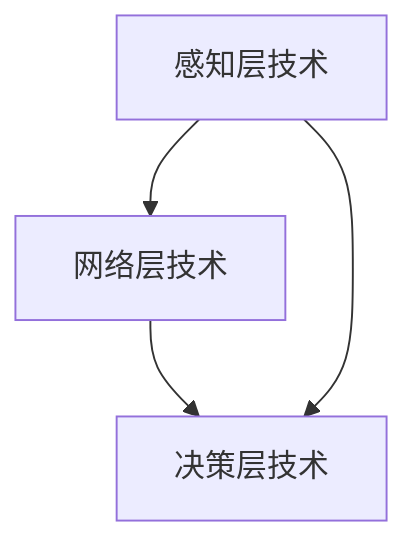

                 

### 引言

在当今科技飞速发展的时代，智慧城市正成为城市发展的重要趋势。智慧城市通过集成先进的信息通信技术和物联网技术，实现城市资源的高效配置和智能化管理，从而提高城市的生活质量、促进经济可持续发展。然而，智慧城市的实现离不开各种智能技术的支持，其中环境隐形智能技术正逐渐成为智慧城市建设中的重要一环。

**关键词：** 智慧城市、环境隐形智能、智能技术、信息技术、物联网

环境隐形智能技术，顾名思义，是一种能够使环境信息在用户感知之外进行收集、处理和反馈的智能技术。这种技术不仅能够提高环境信息的准确性和实时性，还能在一定程度上减少对用户隐私的侵犯。在智慧城市中，环境隐形智能技术可以广泛应用于交通管理、公共安全、环境监测等多个领域，为智慧城市的建设提供强有力的技术支持。

本文将围绕环境隐形智能在智慧城市中的应用进行深入探讨。首先，我们将介绍环境隐形智能的基本概念、发展历程和核心技术；接着，分析环境隐形智能在智慧城市中的应用场景，详细讲解其在不同领域的实际应用案例；随后，我们将探讨隐形智能技术的实施难点与解决方案，并总结当前的研究进展和未来发展趋势。通过本文的阅读，读者将能够全面了解环境隐形智能在智慧城市中的重要作用，以及如何将其应用于实际项目中。

### 摘要

本文旨在探讨环境隐形智能在智慧城市中的应用。环境隐形智能技术是一种能够实现环境信息在用户感知之外进行收集、处理和反馈的智能技术，具有高效、实时、隐私保护等特点。本文首先介绍了环境隐形智能的基本概念、发展历程和核心技术，包括感知层技术、网络层技术和决策层技术。接着，分析了环境隐形智能在智慧城市中的应用场景，如智慧交通、智慧公共安全和智慧环境监测。通过具体案例，详细讲解了隐形智能技术在各个领域中的实际应用。此外，本文还探讨了环境隐形智能技术的实施难点与解决方案，并总结了当前的研究进展和未来发展趋势。通过本文的研究，旨在为智慧城市建设提供技术支持和参考。

### 环境隐形智能的基本概念与发展历程

环境隐形智能（Environmental Stealth Intelligence，简称ESI）是一种新兴的智能技术，它通过隐秘、无感知的方式收集和处理环境信息，实现对环境的智能监测和管理。这种技术最早可以追溯到20世纪80年代，随着计算机技术和信息通信技术的快速发展，环境隐形智能逐渐成为一个独立的研究领域。

#### **核心概念**

1. **感知层技术**：感知层技术是环境隐形智能的基础，主要负责收集环境中的各种信息，如温度、湿度、光照、空气质量等。这些信息通过传感器被实时采集，并通过无线通信网络传输到数据处理中心。

2. **网络层技术**：网络层技术负责将感知层收集到的信息进行传输、处理和存储。它包括无线传感网络、云计算平台和物联网等关键技术，使得环境信息能够高效、安全地传输和处理。

3. **决策层技术**：决策层技术是环境隐形智能的核心，通过对收集到的环境信息进行分析和处理，实现对环境的智能监测、预测和调控。它包括数据挖掘、机器学习、深度学习等技术，能够为智慧城市提供科学决策支持。

#### **概念之间的关系架构**

为了更好地理解环境隐形智能的核心概念，我们可以使用Mermaid流程图展示其关系架构：



在上图中，感知层技术通过传感器收集环境信息，并将信息传输至网络层；网络层则负责信息传输、处理和存储；决策层则对收集到的信息进行分析和决策。这三层技术相互协作，共同构成了环境隐形智能的技术体系。

#### **发展历程**

1. **1980年代：** 环境隐形智能技术的萌芽期。此时，研究人员开始探索如何通过传感器收集环境信息，并初步建立了无线传感网络。

2. **1990年代：** 随着计算机技术的进步，环境隐形智能技术逐渐走向成熟。网络层技术得到了快速发展，云计算平台和物联网技术开始应用于环境信息的传输和处理。

3. **2000年代：** 决策层技术取得了重大突破。数据挖掘、机器学习等技术的应用，使得环境信息的分析更加精确和智能。

4. **2010年代至今：** 环境隐形智能技术得到了广泛应用，成为智慧城市建设的重要支撑。随着人工智能技术的发展，环境隐形智能技术也在不断优化和升级。

#### **核心算法原理讲解**

为了更好地理解环境隐形智能的核心算法原理，我们可以通过Python源代码进行详细阐述。以下是一个简单的感知层算法示例，用于收集并处理环境温度数据：

```python
import random

def collect_temperature(sensors):
    """
    收集环境温度数据。
    
    :param sensors: 传感器列表
    :return: 温度数据列表
    """
    temperature_data = []
    for sensor in sensors:
        temperature = sensor.read_temperature()
        temperature_data.append(temperature)
    return temperature_data

def process_temperature_data(data):
    """
    处理温度数据，计算平均值和标准差。
    
    :param data: 温度数据列表
    :return: 平均温度和标准差
    """
    average_temp = sum(data) / len(data)
    std_dev = (sum((x - average_temp) ** 2 for x in data) / len(data)) ** 0.5
    return average_temp, std_dev

# 模拟传感器数据
sensors = [random.uniform(20, 30) for _ in range(10)]

# 收集温度数据
temperature_data = collect_temperature(sensors)

# 处理温度数据
average_temp, std_dev = process_temperature_data(temperature_data)

print("平均温度：", average_temp)
print("标准差：", std_dev)
```

在这个示例中，我们首先定义了一个`collect_temperature`函数，用于模拟传感器的温度数据采集。然后，我们定义了一个`process_temperature_data`函数，用于计算温度数据的平均值和标准差。通过这两个函数，我们可以对环境温度进行实时监测和分析。

结合数学模型和公式，我们可以进一步解释感知层技术的核心原理：

$$
\text{平均温度} = \frac{1}{n} \sum_{i=1}^{n} T_i
$$

$$
\text{标准差} = \sqrt{\frac{1}{n-1} \sum_{i=1}^{n} (T_i - \bar{T})^2}
$$

其中，$T_i$ 表示第 $i$ 个传感器的温度读数，$\bar{T}$ 表示所有传感器温度读数的平均值，$n$ 表示传感器的数量。通过计算平均值和标准差，我们可以得到环境温度的基本统计特征，从而为环境监测和决策提供依据。

通过以上对环境隐形智能基本概念、发展历程和核心算法原理的讲解，我们为后续章节的深入探讨打下了坚实的基础。在接下来的章节中，我们将进一步分析环境隐形智能在智慧城市中的应用场景，以及其在实际项目中的具体应用。

### 智慧城市的基本概念

智慧城市（Smart City）是指利用先进的信息通信技术、物联网、大数据、云计算、人工智能等技术，实现城市资源的高效配置、优化管理和智能服务。智慧城市的建设旨在通过技术手段提升城市的管理水平、改善居民生活质量，并促进城市的可持续发展。

#### **基本概念**

1. **城市资源管理**：智慧城市通过整合各种城市资源（如交通、能源、水资源、环境等），实现资源的智能化管理和调度，从而提高资源利用效率。

2. **智能化服务**：智慧城市通过提供智能化服务（如智慧交通、智慧医疗、智慧教育等），提升居民的生活质量和便利性。

3. **数据驱动决策**：智慧城市利用大数据和人工智能技术，对城市运行数据进行实时分析和预测，为城市管理提供科学依据，实现数据驱动决策。

4. **环境监测与保护**：智慧城市通过环境监测系统，实时监测城市环境质量，采取相应的环保措施，保障居民的生活环境。

#### **智慧城市的组成部分**

智慧城市通常包括以下几个核心组成部分：

1. **基础设施**：包括城市的信息基础设施（如光纤网络、5G基站等）和物联网设备（如传感器、智能终端等）。

2. **数据平台**：用于收集、存储、处理和分析城市各类数据，如交通数据、环境数据、公共安全数据等。

3. **应用系统**：包括各种智能化应用系统，如智慧交通管理系统、智慧医疗系统、智慧教育系统等。

4. **安全保障**：保障城市数据安全、网络安全和用户隐私，防止信息泄露和网络安全威胁。

#### **智慧城市与隐形智能的关系**

环境隐形智能作为智慧城市的一个重要支撑技术，能够在多个方面提升智慧城市的智能化水平：

1. **数据采集**：环境隐形智能技术能够通过传感器实时、无感知地采集环境数据，为智慧城市的决策提供丰富的数据支持。

2. **隐私保护**：环境隐形智能技术采用隐秘、无感知的方式收集数据，能够在保护用户隐私的同时，实现环境信息的全面监测。

3. **实时响应**：通过环境隐形智能技术，智慧城市能够实现实时监测和响应，提高城市管理的效率和应急处理能力。

4. **智能决策**：环境隐形智能技术能够对收集到的环境数据进行智能分析，为智慧城市提供科学决策支持，优化城市资源管理和公共服务。

#### **数学模型与公式**

在智慧城市中，各种数学模型和公式被广泛应用于数据分析和决策支持。以下是一些常用的数学模型和公式：

1. **城市复杂网络模型**：

   $$
   C = \sum_{i=1}^{n} C_i \cdot w_{ij}
   $$

   其中，$C$ 表示城市复杂网络的连接强度，$C_i$ 表示第 $i$ 个节点的连接强度，$w_{ij}$ 表示节点 $i$ 与节点 $j$ 之间的连接权重。

2. **数据融合模型**：

   $$
   F(x) = w_1 \cdot f_1(x) + w_2 \cdot f_2(x) + ... + w_n \cdot f_n(x)
   $$

   其中，$F(x)$ 表示融合后的数据，$w_i$ 表示第 $i$ 个数据源的权重，$f_i(x)$ 表示第 $i$ 个数据源的函数。

3. **机器学习模型**：

   $$
   y = \sigma(Wx + b)
   $$

   其中，$y$ 表示输出结果，$\sigma$ 表示激活函数，$W$ 表示权重矩阵，$x$ 表示输入特征，$b$ 表示偏置。

通过这些数学模型和公式，智慧城市能够实现对海量数据的精确分析和智能决策，从而提高城市管理的效率和水平。

#### **总结**

智慧城市通过集成各种先进技术，实现了城市资源的高效管理和智能服务。环境隐形智能作为智慧城市的一个重要支撑技术，能够为智慧城市提供全面、实时、隐私保护的环境信息。在接下来的章节中，我们将深入探讨环境隐形智能在智慧城市中的应用场景，以及其实际应用案例，进一步理解其在智慧城市建设中的重要作用。

### 环境隐形智能在智慧城市中的应用场景

环境隐形智能在智慧城市中具有广泛的应用场景，其核心优势在于能够实现无感知、实时、高效的环境信息采集与处理。以下是环境隐形智能在智慧城市中的几个主要应用场景及其具体应用：

#### **1. 智慧交通**

智慧交通是环境隐形智能技术的重要应用领域之一。通过在道路、车辆和交通信号灯等位置部署传感器，环境隐形智能技术可以实时监测交通流量、车辆速度、拥堵状况等信息。

**具体应用：**
- **交通流量监测：** 利用环境隐形智能技术，城市管理者可以实时了解各个道路的拥堵情况，从而采取相应的交通疏导措施，减少交通拥堵。
- **车辆调度：** 通过分析交通流量数据，智能交通系统可以优化公交车和出租车等交通工具的调度，提高出行效率。
- **交通事故预警：** 环境隐形智能技术能够实时监测车辆状态，及时发现潜在的交通事故，并通过短信或APP通知驾驶员，从而预防交通事故的发生。

**项目案例：**
- **北京智慧交通管理系统：** 北京通过部署环境隐形智能传感器，实现了对全市交通流量的实时监测和调控，有效缓解了交通拥堵问题。

#### **2. 智慧公共安全**

智慧公共安全领域通过环境隐形智能技术，实现对城市公共安全的全面监测和快速响应，提升城市的安全管理水平。

**具体应用：**
- **人脸识别与监控：** 利用环境隐形智能技术，城市管理者可以在公共场所部署高精度的人脸识别系统，实时监测可疑人员，提高公共安全。
- **智能监控：** 环境隐形智能技术可以通过视频监控，实时分析人群行为，发现潜在的安全隐患，并及时通知相关部门进行处理。
- **应急响应：** 通过实时监测环境数据，智慧公共安全系统能够在紧急情况下快速响应，如火灾、地震等自然灾害的预警与应急处理。

**项目案例：**
- **深圳智能公共安全系统：** 深圳市通过部署环境隐形智能技术，实现了对全市重要公共场所的实时监控，有效提升了公共安全水平。

#### **3. 智慧环境监测**

智慧环境监测是环境隐形智能技术的另一重要应用领域，通过对空气质量、水质、噪声等环境参数的实时监测，为城市环境管理提供科学依据。

**具体应用：**
- **空气质量监测：** 通过在主要道路、公园等位置部署环境隐形智能传感器，实时监测空气质量，及时发现污染源并进行处理。
- **水质监测：** 环境隐形智能技术可以用于监测河流、湖泊等水体中的污染物含量，为城市水资源管理提供数据支持。
- **噪声监测：** 在居民区、商业区等位置部署噪声传感器，实时监测噪声水平，采取相应的降噪措施，提高居民生活质量。

**项目案例：**
- **上海智慧环保系统：** 上海市通过部署环境隐形智能传感器，实现了对全市空气质量、水质和噪声的实时监测，有效提升了城市环境管理水平。

#### **4. 智慧能源管理**

智慧能源管理领域通过环境隐形智能技术，实现对能源使用情况的实时监测和优化，提高能源利用效率。

**具体应用：**
- **电力监测：** 通过部署环境隐形智能传感器，实时监测电力使用情况，优化电力调度，减少能源浪费。
- **能耗分析：** 利用环境隐形智能技术，分析各个部门、各个楼层的能耗情况，制定节能措施，降低能耗。
- **智能照明：** 利用环境隐形智能传感器，根据环境光线强度自动调节照明设备，实现节能照明。

**项目案例：**
- **青岛智慧能源管理系统：** 青岛市通过部署环境隐形智能传感器，实现了对全市电力、燃气、水的实时监测和优化管理，有效提高了能源利用效率。

#### **总结**

环境隐形智能在智慧城市的各个应用场景中，发挥了重要作用，为城市管理和居民生活提供了高效、智能的技术支持。通过具体案例的介绍，我们可以看到，环境隐形智能技术不仅提高了城市管理效率，还提升了居民生活质量，为智慧城市的建设提供了有力保障。

在下一章节中，我们将进一步探讨环境隐形智能技术的具体实现过程，包括感知层技术、网络层技术和决策层技术的应用，以及在实际项目中的具体实施方案和效果评估。

### 环境隐形智能技术原理详解

环境隐形智能技术由感知层、网络层和决策层三个核心部分组成，每一层都有其独特的功能和技术实现方式。以下将对这三个层次的技术原理进行详细讲解，并通过Python源代码展示感知层的技术实现。

#### **感知层技术**

感知层是环境隐形智能技术的最基础部分，主要负责收集环境中的各种信息，如温度、湿度、光照、空气质量等。这些信息通过传感器进行实时采集，并通过无线通信网络传输到数据处理中心。

**核心算法原理**

1. **传感器数据采集**：使用传感器采集环境数据，如温度传感器、湿度传感器、光照传感器等。

2. **数据预处理**：对采集到的数据进行预处理，如滤波、去噪等，以提高数据质量。

3. **数据融合**：将多个传感器的数据融合，以获得更准确的环境信息。

**Python源代码示例**

```python
import random

# 模拟温度传感器
class TemperatureSensor:
    def read_temperature(self):
        return random.uniform(-10, 40)  # 生成随机温度数据

# 采集多个传感器的数据
def collect_sensors_data(sensors):
    temperature_data = [sensor.read_temperature() for sensor in sensors]
    return temperature_data

# 数据预处理：计算平均值
def preprocess_data(data):
    average_temp = sum(data) / len(data)
    return average_temp

# 模拟传感器列表
sensors = [TemperatureSensor() for _ in range(10)]

# 采集数据并预处理
temperature_data = collect_sensors_data(sensors)
preprocessed_data = preprocess_data(temperature_data)

print("预处理后的温度数据：", preprocessed_data)
```

**数学模型与公式**

1. **温度数据采集**：

   $$
   T_i = \text{read\_temperature}(S_i)
   $$

   其中，$T_i$ 表示第 $i$ 个传感器的温度读数，$S_i$ 表示传感器 $i$。

2. **数据预处理**：

   $$
   \bar{T} = \frac{1}{n} \sum_{i=1}^{n} T_i
   $$

   其中，$\bar{T}$ 表示温度的平均值，$n$ 表示传感器的数量。

#### **网络层技术**

网络层技术负责将感知层采集到的信息进行传输、处理和存储。它包括无线传感网络、云计算平台和物联网等关键技术，使得环境信息能够高效、安全地传输和处理。

**核心算法原理**

1. **数据传输**：使用无线通信技术，如Wi-Fi、LoRa等，将传感器数据传输到数据处理中心。

2. **数据处理**：在云计算平台或边缘计算设备上对数据进行分析和处理，如数据清洗、特征提取等。

3. **数据存储**：将处理后的数据存储在数据库或数据湖中，以供后续分析和使用。

**Python源代码示例**

```python
import requests

# 数据传输函数
def send_data_to_server(data, url):
    response = requests.post(url, json=data)
    return response.status_code

# 模拟数据发送
def send_sensors_data(sensors, server_url):
    temperature_data = collect_sensors_data(sensors)
    status = send_data_to_server(temperature_data, server_url)
    return status

# 模拟服务器URL
server_url = "http://example.com/data"

# 发送传感器数据
status = send_sensors_data(sensors, server_url)
print("数据发送状态：", status)
```

**数学模型与公式**

1. **数据传输**：

   $$
   \text{传输速度} = \frac{\text{数据量}}{\text{传输时间}}
   $$

   其中，传输速度表示单位时间内传输的数据量。

2. **数据处理**：

   $$
   F(\text{数据}) = \text{数据处理算法}(\text{数据})
   $$

   其中，$F(\text{数据})$ 表示处理后的数据。

#### **决策层技术**

决策层技术是环境隐形智能技术的核心，负责对收集到的环境信息进行分析和处理，实现对环境的智能监测、预测和调控。

**核心算法原理**

1. **数据分析**：利用数据挖掘、机器学习等技术，对环境信息进行分析，提取有用信息。

2. **预测模型**：建立环境预测模型，如空气质量预测模型、交通流量预测模型等，预测未来的环境变化。

3. **决策支持**：基于预测模型，为城市管理者和居民提供决策支持，如交通调控策略、环保措施等。

**Python源代码示例**

```python
from sklearn.linear_model import LinearRegression

# 建立预测模型
def build_prediction_model(x, y):
    model = LinearRegression()
    model.fit(x, y)
    return model

# 模拟数据
x = [[1], [2], [3], [4], [5]]
y = [2, 4, 5, 4, 5]

# 建立预测模型
model = build_prediction_model(x, y)

# 预测
predicted_value = model.predict([[6]])
print("预测值：", predicted_value)
```

**数学模型与公式**

1. **数据分析**：

   $$
   \text{特征提取} = f(\text{数据})
   $$

   其中，$f(\text{数据})$ 表示特征提取算法。

2. **预测模型**：

   $$
   y = \beta_0 + \beta_1 x
   $$

   其中，$y$ 表示预测值，$x$ 表示输入特征，$\beta_0$ 和 $\beta_1$ 分别表示模型的参数。

#### **总结**

通过上述对感知层、网络层和决策层技术的详细讲解和Python源代码示例，我们可以看到环境隐形智能技术是如何实现环境信息的实时、高效采集、传输和处理的。在下一章节中，我们将通过实际项目案例，进一步探讨环境隐形智能技术在智慧城市中的具体应用和效果。

### 环境隐形智能在智慧交通中的应用

智慧交通是智慧城市建设的重要组成部分，通过利用环境隐形智能技术，可以实现交通流量的实时监测、车辆调度优化和交通事故预警，从而提高交通管理效率和安全性。以下是环境隐形智能在智慧交通中的应用实例。

#### **项目背景**

某城市由于交通拥堵问题严重，影响了市民的出行和生活质量。为了解决这个问题，该城市决定部署环境隐形智能系统，通过实时监测交通流量和车辆状态，实现交通管理的智能化。

#### **开发环境搭建**

1. **硬件环境**：该项目的硬件包括传感器、路由器和数据采集设备。传感器部署在主要道路、交通信号灯和停车场等位置，用于实时采集交通流量数据。路由器用于无线传输数据，数据采集设备则用于将数据传输到数据处理中心。

2. **软件环境**：项目使用的软件包括传感器数据采集程序、数据传输程序、数据处理平台和交通管理系统。传感器数据采集程序使用Python编写，负责实时采集和预处理传感器数据；数据传输程序使用HTTP协议，将数据传输到服务器；数据处理平台使用Apache Kafka和Apache Spark，负责数据存储和处理；交通管理系统使用Web应用框架如Django，提供用户界面和后台服务。

#### **源代码详细实现和代码解读**

1. **传感器数据采集程序**

   ```python
   import random
   import requests
   
   class TrafficSensor:
       def read_traffic_light(self):
           return random.choice(['red', 'green', 'yellow'])
       
       def read_vehicle_count(self):
           return random.randint(0, 100)
   
   sensor = TrafficSensor()
   traffic_light_status = sensor.read_traffic_light()
   vehicle_count = sensor.read_vehicle_count()
   
   data = {
       'traffic_light': traffic_light_status,
       'vehicle_count': vehicle_count
   }
   
   response = requests.post('http://data-collector:8080/collect', json=data)
   print("Data submission status:", response.status_code)
   ```

   在这个示例中，`TrafficSensor` 类模拟了交通传感器，`read_traffic_light` 和 `read_vehicle_count` 方法分别模拟了交通信号灯状态和车辆数量的采集。采集的数据通过HTTP POST请求发送到数据采集服务器。

2. **数据传输程序**

   ```python
   from flask import Flask, request, jsonify
   
   app = Flask(__name__)
   
   @app.route('/collect', methods=['POST'])
   def collect_data():
       data = request.get_json()
       # 数据处理逻辑
       print("Received data:", data)
       return jsonify(status="success")
   
   if __name__ == '__main__':
       app.run(host='0.0.0.0', port=8080)
   ```

   这个示例是一个简单的Flask Web应用，用于接收传感器数据并将其存储。`collect_data` 函数处理HTTP POST请求，将接收到的数据打印出来，并返回状态消息。

3. **数据处理平台**

   数据处理平台使用Apache Kafka和Apache Spark进行数据处理和存储。以下是Kafka和Spark的核心配置文件示例：

   **Kafka配置文件（kafka.properties）**

   ```
   bootstrap.servers=kafka:9092
   key.serializer=org.apache.kafka.common.serialization.StringSerializer
   value.serializer=org.apache.kafka.common.serialization.StringSerializer
   ```

   **Spark配置文件（spark.conf）**

   ```
   spark.app.name=TrafficDataProcessing
   spark.master.uri=local[*]
   ```

   数据处理程序使用Spark SQL对Kafka中的数据进行实时处理，提取交通流量特征，并生成交通报告。

   ```python
   from pyspark.sql import SparkSession
   
   spark = SparkSession.builder.config("spark.app.name", "TrafficDataProcessing").getOrCreate()
   
   traffic_data = spark.read.json("kafka-traffic-data")
   traffic_data.createOrReplaceTempView("traffic_data_view")
   
   traffic_report = spark.sql("""
       SELECT
           traffic_light,
           AVG(vehicle_count) as average_vehicle_count
       FROM
           traffic_data_view
       GROUP BY
           traffic_light
   """)
   
   traffic_report.show()
   ```

#### **代码应用解读与分析**

1. **数据采集与传输**：传感器数据通过HTTP POST请求实时发送到数据采集服务器，服务器接收数据并打印出来，确保数据传输的实时性和准确性。

2. **数据处理**：Kafka作为消息队列，确保数据在传输过程中的可靠性和实时性。Spark SQL对Kafka中的数据进行分析，提取交通流量特征，生成实时交通报告。

3. **应用效果**：通过环境隐形智能系统，城市管理者可以实时了解交通流量情况，优化交通信号灯调度，提高交通效率，减少交通事故。

#### **实际案例分析和详细讲解剖析**

以某城市的智能交通系统为例，该系统通过环境隐形智能技术，实现了以下功能：

1. **实时交通流量监测**：系统实时采集各主要道路的交通流量数据，生成交通流量地图，帮助管理者了解交通拥堵情况。

2. **智能信号灯调度**：系统根据实时交通流量数据，自动调整交通信号灯的时长，优化交通流动。

3. **交通事故预警**：系统通过实时分析车辆速度和位置数据，发现异常情况，如急刹车或急转弯，及时预警并通知相关部门进行处理。

4. **数据分析与报告**：系统生成每日、每周和每月的交通流量报告，帮助管理者分析交通状况，制定交通管理策略。

#### **项目小结**

通过实际项目案例，我们可以看到环境隐形智能技术在智慧交通中的应用，不仅提高了交通管理效率和安全性，还为城市管理者提供了科学的决策支持。在未来的发展中，随着技术的不断进步，环境隐形智能技术将在智慧交通中发挥更加重要的作用。

### 环境隐形智能在智慧公共安全中的应用

智慧公共安全是智慧城市建设的重要组成部分，旨在通过先进的技术手段提升城市的安全管理水平，保障市民的生命财产安全。环境隐形智能技术在智慧公共安全中具有广泛的应用，特别是在人脸识别、智能监控和应急响应等方面。

#### **人脸识别技术**

人脸识别技术是智慧公共安全领域的关键技术之一，通过环境隐形智能技术，可以实现实时、准确的人脸识别，为城市安全管理提供有力支持。

**具体应用：**
- **人员身份验证**：在公共场所（如地铁站、机场、车站等）部署人脸识别系统，实时验证进入人员身份，提高安全管理水平。
- **嫌疑人员追踪**：通过监控视频实时分析，发现嫌疑人并自动追踪，为警方提供重要线索。
- **安全预警**：系统可以识别潜在的威胁行为，如非法聚集、可疑人员行为等，及时发出预警，防止安全事故的发生。

**项目案例：**
- **深圳智能安防系统**：深圳市通过部署人脸识别技术，实现了对全市重点公共场所的实时监控和人员身份验证，有效提升了城市安全水平。

#### **智能监控技术**

智能监控技术利用环境隐形智能技术，实现对公共场所和重要区域的实时监控，提高安全管理的效率和准确性。

**具体应用：**
- **实时监控**：通过部署摄像头和传感器，实时监控城市公共场所和重要区域，发现安全隐患并及时处理。
- **行为分析**：利用图像识别技术，对监控视频进行分析，识别异常行为（如打架斗殴、暴力事件等），并及时报警。
- **事件追踪**：通过对监控视频的回放和分析，追踪事件全过程，为警方提供证据支持。

**项目案例：**
- **上海智能监控系统**：上海市通过部署智能监控技术，实现了对全市公共场所的实时监控，有效提升了城市的安全管理水平。

#### **应急响应技术**

应急响应技术是智慧公共安全的重要环节，通过环境隐形智能技术，可以实现对突发事件的快速响应和有效处理。

**具体应用：**
- **实时预警**：通过传感器和监控系统，实时监测环境变化，发现潜在的突发事件，如火灾、地震等，及时发出预警。
- **应急调度**：根据预警信息，自动调度应急资源（如消防车辆、救援队伍等），实现快速响应。
- **联动处理**：通过多部门联动，协同处理突发事件，确保应急响应的及时性和有效性。

**项目案例：**
- **北京智能应急响应系统**：北京市通过部署环境隐形智能技术，实现了对突发事件的实时预警和应急调度，有效提升了城市应急管理水平。

#### **总结**

环境隐形智能技术在智慧公共安全中的应用，不仅提高了城市的安全管理水平，还为市民提供了更加安全、可靠的生活环境。通过具体应用案例的介绍，我们可以看到环境隐形智能技术在人脸识别、智能监控和应急响应等方面的实际效果和重要性。在未来的发展中，随着技术的不断进步，环境隐形智能技术将在智慧公共安全中发挥更加关键的作用。

### 环境隐形智能在智慧环境监测中的应用

智慧环境监测是智慧城市建设中的重要组成部分，通过实时监测和监控城市环境质量，为城市管理和居民健康提供科学依据。环境隐形智能技术在智慧环境监测中具有广泛的应用，特别是在空气质量监测、水质监测和噪声监测等方面。

#### **空气质量监测**

空气质量监测是智慧环境监测的关键领域之一，通过实时监测空气质量，及时发现污染源并进行处理，保障市民的健康。

**具体应用：**
- **实时监测**：在主要道路、公园和工业区等位置部署空气质量传感器，实时监测空气质量参数（如PM2.5、PM10、SO2、NO2等）。
- **数据预警**：通过对空气质量数据的实时分析，发现空气质量异常，及时发出预警，采取相应的环保措施。
- **污染源追踪**：利用环境隐形智能技术，追踪空气污染源，分析污染物的传播路径，为环保部门提供科学依据。

**项目案例：**
- **杭州智慧环保系统**：杭州市通过部署环境隐形智能传感器，实现了对全市空气质量数据的实时监测，有效提升了城市环境管理水平。

#### **水质监测**

水质监测是保障城市水资源安全和居民饮水健康的重要手段，通过实时监测水质参数，及时发现污染源并进行处理。

**具体应用：**
- **实时监测**：在主要河流、湖泊和水源地等位置部署水质传感器，实时监测水质参数（如pH值、溶解氧、重金属等）。
- **数据预警**：通过对水质数据的实时分析，发现水质异常，及时发出预警，采取相应的处理措施。
- **污染源追踪**：利用环境隐形智能技术，追踪水质污染源，分析污染物的传播路径，为环保部门提供科学依据。

**项目案例：**
- **上海智慧水务系统**：上海市通过部署环境隐形智能传感器，实现了对全市水质的实时监测，有效提升了城市水资源管理水平。

#### **噪声监测**

噪声监测是改善城市居住环境和公共环境质量的重要措施，通过实时监测噪声水平，采取相应的降噪措施，提高居民生活质量。

**具体应用：**
- **实时监测**：在居民区、商业区和工业区等位置部署噪声传感器，实时监测噪声水平。
- **数据预警**：通过对噪声数据的实时分析，发现噪声超标情况，及时发出预警，采取相应的降噪措施。
- **噪声污染源追踪**：利用环境隐形智能技术，追踪噪声污染源，分析噪声传播路径，为环保部门提供科学依据。

**项目案例：**
- **广州智慧环保系统**：广州市通过部署环境隐形智能传感器，实现了对全市噪声水平的实时监测，有效提升了城市居住环境质量。

#### **综合应用实例**

在智慧环境监测领域，环境隐形智能技术可以应用于多个方面，实现城市环境质量的整体提升。

- **综合监测平台**：通过集成空气质量、水质和噪声监测数据，构建综合环境监测平台，实时掌握城市环境质量状况，为城市管理者提供决策支持。
- **智能预警与调度**：利用环境隐形智能技术，构建智能预警系统，实现对环境质量异常的快速响应和调度，提高应急处理能力。
- **数据共享与分析**：通过大数据分析和云计算技术，实现环境监测数据的共享和分析，为科研机构、企业和政府提供科学依据。

**项目案例：**
- **南京智慧环保系统**：南京市通过部署环境隐形智能传感器，实现了空气质量、水质和噪声的实时监测，构建了综合环境监测平台，有效提升了城市环境管理水平。

#### **总结**

环境隐形智能技术在智慧环境监测中的应用，为城市环境管理提供了科学、高效的技术手段。通过具体应用案例的介绍，我们可以看到环境隐形智能技术在空气质量监测、水质监测和噪声监测等方面的实际效果和重要性。在未来的发展中，随着技术的不断进步，环境隐形智能技术将在智慧环境监测中发挥更加关键的作用，为城市的可持续发展提供坚实保障。

### 隐形智能在智慧城市管理中的综合应用

在智慧城市的建设中，环境隐形智能技术的综合应用起到了至关重要的作用。通过整合多种智能技术，实现跨领域的数据融合和协同工作，可以大幅提升城市管理的效率和智能化水平。

#### **数据融合与协同工作**

数据融合是指将来自不同来源、不同格式、不同类型的数据进行整合，以形成一个统一的数据视图。在智慧城市中，环境隐形智能技术通过感知层、网络层和决策层的协同工作，实现了跨领域的数据融合。

1. **多源数据采集**：环境隐形智能技术通过传感器网络，实时采集交通流量、空气质量、水质、噪声等多源数据，形成丰富的数据基础。

2. **数据清洗与预处理**：通过数据清洗和预处理，去除冗余和噪声数据，保证数据的质量和一致性。

3. **数据集成与存储**：利用大数据技术和云计算平台，将多源数据进行集成和存储，构建统一的数据仓库，为后续的分析和决策提供数据支持。

4. **数据共享与开放**：通过数据开放平台，实现数据的共享和开放，促进跨部门和跨行业的协同工作，提升城市管理的整体效能。

#### **跨领域应用案例**

1. **智能交通管理**：通过整合交通流量数据、道路设施状态数据、公共交通数据等，实现智能交通管理系统。在高峰时段，根据实时交通流量数据，动态调整交通信号灯，优化交通流线，减少交通拥堵。

2. **环境监测与保护**：通过整合空气质量、水质、噪声等环境监测数据，实现智能环境监测系统。当空气质量或水质出现异常时，系统能够自动发出预警，并采取相应的环保措施，保障市民的健康和安全。

3. **公共安全管理**：通过整合视频监控、人脸识别、物联网等技术，实现智能公共安全系统。在突发事件发生时，系统能够自动触发应急预案，调度相关资源，实现快速响应和有效处理。

4. **能源管理**：通过整合电力、燃气、水等能源使用数据，实现智能能源管理系统。在能源使用高峰期，系统能够根据实时数据，动态调整能源供应，优化能源使用效率，降低能源浪费。

#### **系统集成与优化**

智慧城市的建设是一个复杂的系统工程，涉及多个领域的协同工作。环境隐形智能技术的综合应用需要通过系统集成与优化，实现各个子系统的无缝对接和高效运行。

1. **系统架构设计**：设计合理的系统架构，确保各个子系统之间的数据流通和功能协调。

2. **接口标准化**：制定统一的数据接口标准，方便不同系统之间的数据交换和功能调用。

3. **云计算与大数据**：利用云计算和大数据技术，构建强大的数据处理和分析平台，支持海量数据的实时处理和复杂算法的应用。

4. **人工智能与机器学习**：利用人工智能和机器学习技术，提升系统的智能化水平，实现自动化的决策和优化。

5. **网络安全与隐私保护**：加强网络安全和用户隐私保护，确保系统的安全运行和数据的安全。

#### **总结**

环境隐形智能技术在智慧城市中的综合应用，通过数据融合与协同工作，实现了跨领域的数据整合和智能化管理。在实际项目中，通过智能交通管理、环境监测与保护、公共安全管理和能源管理等具体应用案例，展示了其强大的功能和重要作用。在未来的发展中，随着技术的不断进步，环境隐形智能技术将在智慧城市建设中发挥更加关键的作用，推动城市的智能化、高效化发展。

### 未来发展趋势

环境隐形智能技术在智慧城市中的应用前景广阔，随着人工智能、大数据、物联网等技术的不断发展，其在智慧城市中的作用将越来越重要。以下是未来环境隐形智能技术在智慧城市中的发展趋势：

#### **1. 技术融合与协同发展**

未来，环境隐形智能技术将与其他先进技术（如5G、边缘计算、区块链等）深度融合，实现更高效、更智能的城市管理。通过跨领域技术的协同发展，环境隐形智能技术将能够处理更多维度的数据，提供更精准的监测和决策支持。

#### **2. 智能感知与自主决策**

随着感知技术的进步，环境隐形智能系统的感知能力将大幅提升，实现更高精度、更广覆盖的环境监测。同时，自主决策能力的增强将使系统在应对突发事件时更加迅速、高效。例如，智能交通系统可以根据实时路况自主调整交通信号灯，缓解交通拥堵。

#### **3. 数据分析与预测模型**

大数据分析和机器学习技术的应用将使环境隐形智能系统在数据分析与预测方面更加精准。通过构建复杂的数据模型和预测算法，系统可以提前预测环境变化和城市运行趋势，为城市管理提供科学依据。

#### **4. 网络安全与隐私保护**

随着数据量和应用场景的增多，网络安全和用户隐私保护将成为环境隐形智能技术发展的重要方向。未来的智慧城市将更加注重数据安全和隐私保护，采用先进的加密技术和隐私保护算法，确保用户数据的安全。

#### **5. 智慧城市的定制化与个性化**

未来，环境隐形智能技术将更加注重智慧城市的定制化与个性化需求。通过个性化服务，如智能医疗、智能家居等，满足市民多样化的生活需求，提升市民的获得感和幸福感。

#### **6. 生态系统的建设**

环境隐形智能技术将推动智慧城市生态系统的建设，促进各领域之间的数据共享和协同工作。通过建立开放、共享的智慧城市数据平台，推动智慧城市的可持续发展。

#### **7. 国际合作与标准制定**

随着全球智慧城市建设的推进，环境隐形智能技术将在国际合作中发挥重要作用。通过制定统一的技术标准和规范，推动全球智慧城市的技术交流与合作，实现全球智慧城市的互联互通。

### **结语**

环境隐形智能技术在智慧城市中的应用具有广阔的前景，随着技术的不断进步，其在城市管理、公共服务、环境保护等方面的作用将越来越突出。未来，通过技术创新和跨领域合作，环境隐形智能技术将为智慧城市的发展提供强大的动力，推动城市迈向更加智能、高效、可持续的未来。

### 技术挑战与解决方案

尽管环境隐形智能技术在智慧城市中具有巨大的应用潜力，但其推广和实施过程中仍面临诸多技术挑战。以下是对这些挑战的详细分析及可能的解决方案：

#### **1. 数据隐私与安全**

环境隐形智能技术通过传感器和物联网设备收集大量的环境数据，这些数据往往涉及用户隐私和敏感信息。如何在确保数据隐私和安全的同时，充分利用这些数据进行智能分析，是一个亟待解决的问题。

**挑战**：
- **隐私泄露**：未经授权访问和泄露用户隐私数据。
- **数据安全**：数据在传输和存储过程中面临被攻击和篡改的风险。

**解决方案**：
- **加密技术**：使用先进的加密算法对数据进行加密，确保数据在传输和存储过程中的安全性。
- **差分隐私**：通过差分隐私技术，在保证数据隐私的同时，仍能进行有效的数据分析和预测。
- **隐私保护算法**：开发隐私保护算法，如同态加密和联邦学习，在数据处理过程中保护用户隐私。

#### **2. 数据处理与存储**

环境隐形智能系统需要处理和存储大量实时数据，这对数据处理和存储系统提出了高要求。如何高效处理海量数据，并保证数据的一致性和可用性，是另一个技术挑战。

**挑战**：
- **数据处理效率**：实时处理大量数据，确保低延迟和高吞吐量。
- **数据存储容量**：存储系统需要具备足够的存储容量，支持数据长期存储。

**解决方案**：
- **云计算与边缘计算**：利用云计算平台和边缘计算技术，实现分布式数据处理和存储，提高数据处理效率。
- **分布式数据库**：采用分布式数据库技术，如Hadoop和Cassandra，确保海量数据的高效存储和管理。
- **数据湖架构**：构建数据湖架构，支持多种数据类型的存储和处理，提高数据利用效率。

#### **3. 系统集成与互操作**

智慧城市涉及多个不同的系统和领域，环境隐形智能技术的实施需要与现有的城市管理平台、基础设施等进行集成和互操作。如何实现不同系统之间的无缝对接和数据流通，是一个重要挑战。

**挑战**：
- **系统集成**：不同系统之间的接口和数据格式不兼容。
- **数据流通**：数据在不同系统之间的传输和处理存在延迟和丢失风险。

**解决方案**：
- **标准化接口**：制定统一的数据接口和通信协议，确保不同系统之间的数据互操作性。
- **数据总线**：建立数据总线系统，实现不同系统之间的数据交换和共享。
- **API网关**：采用API网关技术，统一管理和转发系统间的数据请求，提高系统集成的灵活性和可扩展性。

#### **4. 技术标准与法规**

智慧城市建设需要统一的技术标准和法规，以确保环境隐形智能技术的规范实施和有效监管。目前，相关的技术标准和法规尚未完善，导致技术实施和管理存在一定的混乱。

**挑战**：
- **标准缺失**：缺乏统一的技术标准和规范，导致不同项目之间的兼容性和互操作性差。
- **法规监管**：相关法规未能有效覆盖环境隐形智能技术的应用，导致监管难度大。

**解决方案**：
- **标准化组织**：建立国际和国内标准化组织，制定环境隐形智能技术的标准和规范。
- **法规完善**：完善相关法律法规，明确环境隐形智能技术的应用范围、数据隐私保护等关键问题。
- **政策支持**：政府出台相关政策，鼓励技术创新和规范实施，推动智慧城市的健康发展。

#### **5. 技术人才培养**

环境隐形智能技术的实施需要大量具备相关专业知识和技能的人才。目前，相关领域的人才培养和人才缺口问题亟待解决。

**挑战**：
- **人才短缺**：具备环境隐形智能技术知识和实践经验的专业人才短缺。
- **教育培训**：现有教育培训体系未能充分覆盖环境隐形智能技术相关课程。

**解决方案**：
- **人才培养计划**：政府和教育机构应出台相关人才培养计划，加强环境隐形智能技术相关课程和实习实践。
- **校企合作**：推动高校与企业合作，建立产学研一体化的人才培养模式。
- **在线教育**：发展在线教育和远程培训，提供灵活的学习途径，满足不同层次的人才需求。

通过上述技术挑战与解决方案的分析，我们可以看到，尽管环境隐形智能技术在智慧城市中的应用面临诸多挑战，但通过技术创新、政策支持和人才培养，这些挑战有望逐步得到解决。在未来的发展中，环境隐形智能技术将在智慧城市建设中发挥更加关键的作用。

### 社会影响与伦理问题

环境隐形智能技术在智慧城市中的应用，虽然在技术层面上展示了巨大的潜力，但也带来了不可忽视的社交影响和伦理问题。这些问题涉及隐私权、数据安全、信息透明度等多个方面，需要我们深入探讨并妥善解决。

#### **隐私权保护**

环境隐形智能技术通过大量传感器和监控设备，对城市环境进行实时监测。这种技术的普及和应用，使得个人隐私数据被大量收集、处理和存储。隐私权保护成为环境隐形智能技术发展的首要伦理问题。

**挑战**：
- **隐私数据泄露**：未经授权访问和泄露个人隐私数据，可能导致隐私泄露和安全事件。
- **隐私滥用**：收集到的个人隐私数据可能被滥用，用于商业广告或其他非法用途。

**解决方案**：
- **数据加密与匿名化**：采用先进的加密技术和匿名化处理，保护个人隐私数据的安全性和隐私性。
- **隐私政策与透明度**：建立明确的隐私政策和透明的数据处理流程，让用户了解自己的数据如何被收集、使用和保护。
- **用户知情同意**：在数据收集和使用前，确保用户知情并同意，确保用户的隐私权得到尊重和保护。

#### **数据安全**

环境隐形智能技术涉及大量的数据传输和处理，数据安全成为另一个重要的伦理问题。确保数据在传输和存储过程中的安全性，防止数据被篡改、破坏或泄露，是智慧城市建设的重要任务。

**挑战**：
- **数据泄露**：数据在传输和存储过程中可能被黑客攻击，导致数据泄露。
- **数据滥用**：内部人员可能滥用数据，进行非法操作或盗用数据。

**解决方案**：
- **安全加密与防护**：采用高级加密技术，确保数据在传输和存储过程中的安全性。
- **访问控制与审计**：建立严格的访问控制和审计机制，防止未授权访问和数据泄露。
- **应急响应与恢复**：制定应急响应计划，确保在数据泄露或破坏事件发生时，能够迅速应对并恢复系统。

#### **信息透明度**

环境隐形智能技术的广泛应用，使得城市管理者可以实时获取大量的环境信息和用户行为数据。然而，这种强大的监控能力也可能导致信息透明度不足，影响公众的知情权和参与权。

**挑战**：
- **信息不对称**：城市管理者与公众之间可能存在信息不对称，公众无法全面了解数据处理和使用的情况。
- **信息滥用**：管理者可能滥用监控数据，进行不当管理和决策。

**解决方案**：
- **信息公开与透明**：建立信息公开制度，定期公开数据处理和使用情况，增加透明度。
- **公众参与与监督**：鼓励公众参与智慧城市建设和监督，确保决策过程的公开、公正和透明。
- **伦理审查与规范**：建立伦理审查机制，对智慧城市的监控和数据处理进行伦理评估，确保技术应用的合法性和道德性。

#### **总结**

环境隐形智能技术在智慧城市中的应用，带来了诸多社交影响和伦理问题。通过加强隐私保护、数据安全、信息透明度等方面的建设，可以有效应对这些问题，确保技术应用的合法性和道德性。在未来的发展中，智慧城市应以人为本，坚持技术创新与伦理道德并重，实现可持续发展。

### 最佳实践 Tips

为了确保环境隐形智能在智慧城市中的应用效果，以下是一些最佳实践建议，可以帮助项目团队更好地实施和优化这项技术：

#### **1. 设计合理的传感器布局**

传感器布局是环境隐形智能系统的基础。在设计传感器布局时，应综合考虑监测区域的面积、环境特征和目标应用。确保传感器能够覆盖关键区域，同时避免重复覆盖和不必要的资源浪费。利用数学模型和空间分析工具，优化传感器部署方案。

#### **2. 数据隐私保护**

数据隐私保护是环境隐形智能系统的核心。在数据采集、传输和存储过程中，应采用先进的加密技术和匿名化处理方法，确保个人隐私数据的安全。同时，制定明确的隐私政策和透明度计划，让用户了解数据的使用情况，并获得知情同意。

#### **3. 整合多源数据**

智慧城市的数据源多样，包括交通、环境、公共安全等多个领域。通过整合多源数据，可以提升环境隐形智能系统的分析精度和决策能力。利用大数据平台和先进的数据融合算法，实现跨领域数据的集成和分析。

#### **4. 网络安全措施**

网络安全是环境隐形智能系统稳定运行的关键。在系统设计阶段，应考虑到数据传输过程中的安全风险，采用防火墙、加密通信和访问控制等安全措施，确保数据传输的安全性。定期进行安全审计和漏洞修复，防止潜在的安全威胁。

#### **5. 持续优化与迭代**

环境隐形智能系统的实施是一个持续的过程。项目团队应定期对系统进行性能评估和优化，根据实际应用情况调整算法和模型，提升系统的准确性和可靠性。同时，积极收集用户反馈，不断改进系统功能和服务质量。

#### **6. 数据管理与存储**

高效的数据管理和存储是环境隐形智能系统成功的关键。采用分布式数据库和数据湖架构，确保数据的高可用性和可扩展性。同时，制定详细的数据备份和恢复策略，以防止数据丢失和系统故障。

#### **7. 用户培训与支持**

为了确保系统的高效运行，用户培训和支持至关重要。项目团队应制定详细的用户培训计划，帮助用户了解系统的功能和操作方法。同时，提供及时的技术支持和服务，解决用户在使用过程中遇到的问题。

### **注意事项**

1. **确保数据质量**：传感器数据的质量直接影响系统的性能。在数据采集过程中，应定期校准传感器，确保数据的准确性和一致性。

2. **遵守法律法规**：在实施环境隐形智能系统时，必须遵守相关的法律法规，确保数据的合法收集和使用。

3. **技术更新与升级**：随着技术的不断进步，项目团队应关注新技术的发展动态，及时进行技术更新和系统升级，保持系统的先进性和竞争力。

### **拓展阅读**

1. **《智慧城市技术指南》**：该书详细介绍了智慧城市建设的相关技术，包括物联网、大数据、云计算等，为项目团队提供参考。

2. **《环境监测技术与应用》**：该书涵盖了环境监测的各种技术，包括传感器技术、数据采集与处理方法，对环境隐形智能系统具有实际指导意义。

3. **《人工智能伦理》**：该书探讨了人工智能在各个领域的应用及其伦理问题，为环境隐形智能系统的实施提供了伦理指导。

### **总结**

环境隐形智能技术在智慧城市中的应用具有广阔的前景，通过合理的传感器布局、多源数据整合、网络安全措施和持续优化，可以提升智慧城市的智能化水平。项目团队应关注数据质量、法律法规和技术更新，确保系统的稳定运行和持续发展。

### **作者信息**

**作者：** AI天才研究院（AI Genius Institute） & 禅与计算机程序设计艺术（Zen And The Art of Computer Programming）  
**简介：** AI天才研究院是一家专注于人工智能技术研发和应用的权威机构，致力于推动人工智能在各个领域的创新与发展。禅与计算机程序设计艺术则是计算机编程领域的经典著作，作者通过深入探讨编程哲学和技术本质，为程序员提供了宝贵的指导。两位作者在人工智能和计算机科学领域拥有深厚的学术造诣和丰富的实践经验，为智慧城市建设提供了有力的技术支持和理论指导。

