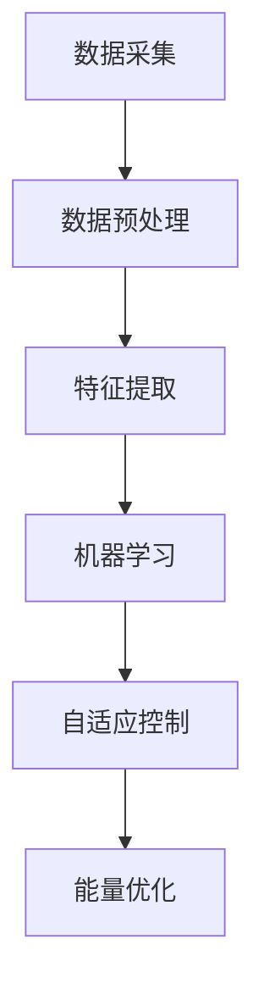
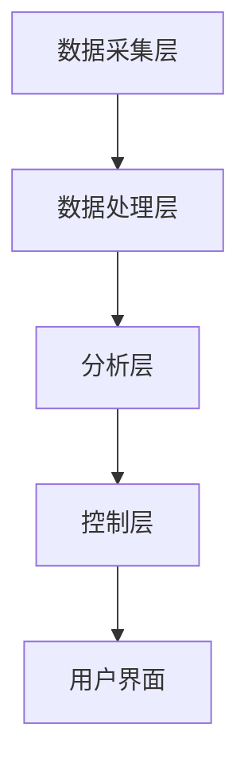
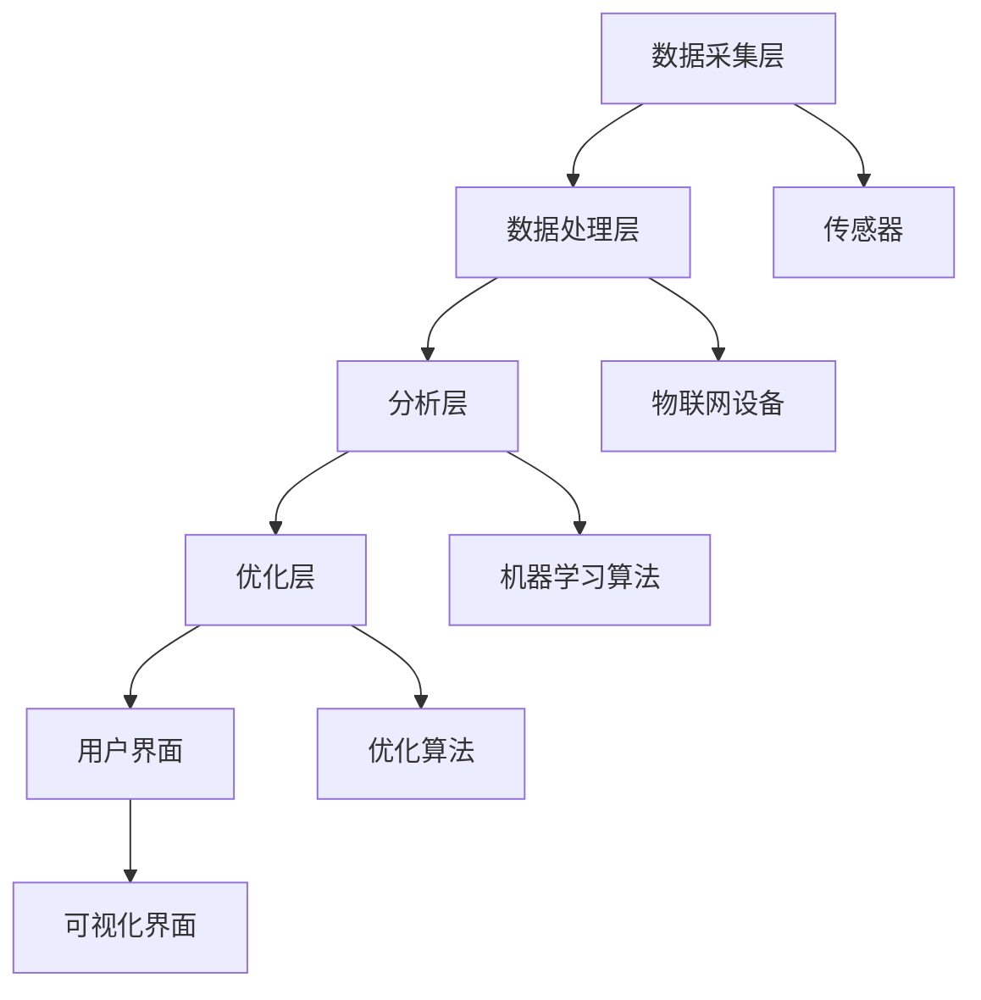

                 

### 《环境隐形智能在能源管理中的应用》

#### 关键词：环境隐形智能、能源管理、可持续发展、Python源代码、数学模型、Mermaid流程图、项目实战

#### 摘要：

本文深入探讨环境隐形智能在能源管理领域的应用。通过介绍环境隐形智能的基本概念及其与能源管理的关系，本文详细阐述了在能源监测、预测和优化中的实际应用，包括可再生能源的管理。同时，通过Python源代码和数学模型的结合，本文提供了清晰的算法实现过程。最后，通过一个实际项目案例，展示了环境隐形智能在能源管理中的具体应用及其效果，并对未来的发展方向提出了展望。

----------------------------------------------------------------

### 引言

#### 1.1 环境隐形智能概述

环境隐形智能（Environmental Camouflage Intelligence，ECI）是一种新兴的人工智能技术，旨在使智能系统与环境实现高度融合，通过模仿自然界中的伪装机制，使智能系统在环境中达到隐形效果。ECI的核心思想是降低系统与环境之间的交互能耗，提高系统的生存能力和环境适应性。

环境隐形智能的关键技术包括传感器融合、机器学习、自适应控制等。传感器融合技术通过对多种传感器数据的集成和分析，实现对环境的精准感知；机器学习技术通过数据训练和模型优化，使系统具备自我学习和自我优化的能力；自适应控制技术则能够根据环境变化实时调整系统参数，实现最优性能。

#### 1.2 能源管理背景

能源管理是现代工业和生活中的一项重要任务，它关系到能源的节约利用、环境保护和可持续发展。传统的能源管理模式主要依赖于人工监测和手动调节，存在着效率低、能耗高、响应慢等问题。随着物联网、大数据、人工智能等技术的不断发展，智能能源管理系统应运而生。

智能能源管理系统的目标是实现能源的精细化管理和优化配置，提高能源利用效率，降低能源消耗和成本。其主要功能包括能源监测、预测、优化和控制等。能源监测是通过传感器实时采集能源使用数据，能源预测是根据历史数据对未来的能源需求进行预测，能源优化是通过算法分析优化能源使用策略，能源控制则是根据实时数据对能源设备进行动态调节。

#### 1.3 环境隐形智能与能源管理的结合

环境隐形智能与能源管理的结合，为能源管理系统带来了新的机遇和挑战。通过将ECI技术应用于能源管理，可以实现以下目标：

1. **降低能耗**：ECI技术可以通过降低系统与环境之间的交互能耗，实现能源的节约利用。
2. **提高响应速度**：ECI技术能够实时感知环境变化，并快速做出调整，提高系统的响应速度。
3. **增强系统适应性**：ECI技术使系统能够更好地适应环境变化，提高系统的稳定性和可靠性。
4. **优化能源配置**：通过ECI技术，可以对能源使用进行精细化管理和优化配置，提高能源利用效率。

总之，环境隐形智能在能源管理中的应用，不仅有助于实现能源的节约和高效利用，还有助于推动能源管理领域的智能化和可持续发展。

----------------------------------------------------------------

### 核心概念与联系

#### 2.1 环境隐形智能原理

环境隐形智能（ECI）是一种通过模仿自然界中的伪装机制来实现智能系统与环境高度融合的技术。ECI的核心原理包括以下几个方面：

1. **传感器融合**：通过集成多种传感器数据，实现对环境的精准感知。传感器融合技术可以优化数据质量，提高系统对环境变化的敏感度。

2. **机器学习**：利用机器学习算法，对传感器数据进行处理和分析，使系统能够自我学习和自我优化。机器学习算法可以帮助系统识别环境模式，预测未来环境变化，并做出相应的调整。

3. **自适应控制**：根据环境变化实时调整系统参数，实现最优性能。自适应控制技术可以使系统能够动态适应环境变化，提高系统的稳定性和可靠性。

4. **能量优化**：通过优化系统与环境之间的能量交换，降低能耗，提高能源利用效率。能量优化技术可以降低系统的运行成本，实现能源的节约利用。

ECI的工作流程主要包括以下几个步骤：

1. **数据采集**：通过多种传感器采集环境数据，包括温度、湿度、光照强度等。
2. **数据预处理**：对采集到的数据进行清洗和预处理，去除噪声和异常值，提高数据质量。
3. **特征提取**：从预处理后的数据中提取关键特征，用于后续分析和预测。
4. **机器学习**：利用机器学习算法，对提取的特征进行训练和优化，建立环境预测模型。
5. **自适应控制**：根据环境预测模型和实时数据，动态调整系统参数，实现最优性能。
6. **能量优化**：通过优化系统与环境之间的能量交换，降低能耗，提高能源利用效率。

下面是一个简单的Mermaid流程图，描述了ECI的工作流程：



#### 2.2 能源管理系统架构

能源管理系统（Energy Management System，EMS）是一种用于监控、预测、优化和控制能源使用的系统。EMS的架构通常包括以下几个部分：

1. **数据采集层**：通过传感器和测量设备实时采集能源使用数据，包括电、水、气等。
2. **数据处理层**：对采集到的数据进行预处理、存储和管理，为后续分析提供数据支持。
3. **分析层**：利用机器学习、数据挖掘等技术，对能源使用数据进行分析，实现预测和优化。
4. **控制层**：根据分析结果，动态调整能源设备的工作状态，实现最优能源使用。
5. **用户界面**：提供可视化界面，让用户可以实时查看能源使用情况，并进行操作和调整。

下面是一个简单的Mermaid流程图，描述了能源管理系统的架构：



#### 2.3 环境隐形智能与能源管理系统

环境隐形智能（ECI）与能源管理系统（EMS）的结合，可以显著提升能源管理的效率和效果。ECI技术通过以下方式与EMS相结合：

1. **实时感知**：ECI技术可以实时感知环境变化，为EMS提供更加准确和实时的数据支持，提高能源预测的精度。

2. **自适应控制**：ECI技术的自适应控制功能可以帮助EMS更快速地响应环境变化，实现能源使用的动态优化。

3. **能量优化**：ECI技术的能量优化功能可以降低能源系统的能耗，提高能源利用效率。

4. **系统集成**：ECI技术可以集成到EMS的各个层次，实现系统功能的互补和优化。

通过ECI与EMS的结合，可以实现以下目标：

1. **提高能源利用效率**：通过实时感知和自适应控制，实现能源使用的精细化和智能化管理，提高能源利用效率。

2. **降低能源成本**：通过能量优化，降低能源系统的运行成本，提高企业的经济效益。

3. **增强系统稳定性**：通过实时感知和自适应控制，增强能源系统的稳定性和可靠性，减少故障和中断。

4. **促进可持续发展**：通过提高能源利用效率和降低能源成本，有助于实现能源的可持续发展。

总之，环境隐形智能在能源管理中的应用，为能源管理带来了新的技术手段和解决方案，有助于推动能源管理领域的智能化和可持续发展。

----------------------------------------------------------------

### 能源监测与预测

#### 3.1 能源数据采集

能源数据采集是能源监测与预测的基础，通过对各类能源使用数据的实时采集，可以为后续的预测和优化提供准确的数据支持。常见的能源数据采集方式包括：

1. **传感器采集**：通过安装在不同位置的传感器，实时监测能源使用情况。传感器类型包括电表、水表、气表、温度传感器、湿度传感器、光照传感器等。

2. **物联网设备采集**：利用物联网技术，将各类传感器连接到网络，实现远程数据采集和监控。物联网设备包括智能电表、智能水表、智能燃气表等。

3. **人工录入**：通过人工方式，定期录入能源使用数据。这种方式适用于数据量较小或者数据采集不频繁的场景。

4. **集成系统采集**：通过集成各类能源管理系统，实现对能源使用数据的统一采集和管理。集成系统可以自动收集和处理来自不同传感器的数据，提高数据采集的效率和准确性。

下面是一个使用Python实现的简单传感器数据采集脚本：

```python
import random
import time

def collect_data(sensor_ids):
    while True:
        for sensor_id in sensor_ids:
            print(f"Collecting data for sensor {sensor_id}:")
            # 生成随机数据模拟传感器采集
            temperature = random.uniform(20, 30)
            humidity = random.uniform(30, 70)
            print(f"Temperature: {temperature}°C, Humidity: {humidity}%")
        time.sleep(60)  # 每分钟采集一次数据

sensor_ids = ['sensor_1', 'sensor_2', 'sensor_3']
collect_data(sensor_ids)
```

#### 3.2 能源预测算法

能源预测算法是能源监测与预测的核心，通过对历史能源使用数据的分析和建模，实现对未来能源需求的预测。常见的能源预测算法包括时间序列分析、机器学习算法等。

1. **时间序列分析**：时间序列分析是一种基于历史数据序列的预测方法，通过分析时间序列的趋势、季节性和周期性，预测未来的能源需求。常见的时间序列分析方法包括移动平均法、指数平滑法、自回归模型（AR）、自回归移动平均模型（ARMA）等。

2. **机器学习算法**：机器学习算法通过训练历史数据，建立预测模型，实现对未来能源需求的预测。常见的机器学习算法包括线性回归、决策树、支持向量机（SVM）、神经网络等。

下面是一个使用Python实现的时间序列预测算法（移动平均法）的示例：

```python
import numpy as np
import pandas as pd

# 生成模拟数据
data = pd.Series(np.random.randn(100))

# 移动平均窗口大小
window_size = 5

# 计算移动平均值
moving_average = data.rolling(window=window_size).mean()

# 预测下一个数据点
next_data_point = moving_average[-1]

print(f"Moving Average: {next_data_point}")
```

#### 3.3 实际应用案例

智能楼宇能源监测系统是一个典型的应用案例，通过环境隐形智能技术，实现对楼宇内各类能源的实时监测和预测，从而实现能源的精细化管理和优化配置。

1. **系统架构**：

   - **数据采集层**：安装各种传感器，包括电表、水表、气表、温度传感器、湿度传感器等，实时采集楼宇内能源使用数据。

   - **数据处理层**：通过物联网设备和集成系统，实现对采集数据的预处理、存储和管理，为后续分析提供数据支持。

   - **分析层**：利用机器学习算法，对历史能源使用数据进行分析，建立能源预测模型，实现对未来能源需求的预测。

   - **控制层**：根据预测结果，动态调整楼宇内各类能源设备的工作状态，实现最优能源使用。

   - **用户界面**：提供可视化界面，让用户可以实时查看能源使用情况，并进行操作和调整。

2. **项目实战**：

   - **开发环境搭建**：使用Python和相关的库（如NumPy、Pandas、Scikit-learn等），搭建能源预测系统。

   - **数据收集与预处理**：从传感器获取实时数据，对数据进行清洗和预处理，去除噪声和异常值。

   - **特征提取**：从预处理后的数据中提取关键特征，包括温度、湿度、光照强度等。

   - **模型训练与优化**：使用时间序列分析和机器学习算法，建立能源预测模型，并进行训练和优化。

   - **模型部署与监控**：将预测模型部署到实际环境中，实时监测和预测楼宇内能源需求，并根据预测结果调整能源设备的工作状态。

3. **代码实现**：

```python
import pandas as pd
from sklearn.linear_model import LinearRegression

# 读取数据
data = pd.read_csv('energy_data.csv')

# 特征工程
X = data[['temperature', 'humidity', 'light']]
y = data['energy_usage']

# 建立模型
model = LinearRegression()

# 模型训练
model.fit(X, y)

# 预测
X_new = pd.DataFrame({'temperature': [25], 'humidity': [50], 'light': [300]})
y_pred = model.predict(X_new)

print(f"Predicted energy usage: {y_pred[0]}")
```

4. **代码解读**：

   - **数据读取**：使用Pandas库读取CSV格式的数据文件。

   - **特征工程**：将温度、湿度、光照强度等特征提取出来，作为模型输入。

   - **模型建立**：使用线性回归模型。

   - **模型训练**：使用训练数据对模型进行训练。

   - **预测**：使用训练好的模型对新的数据进行预测，输出预测结果。

5. **应用解读与分析**：

   - **实时监测**：通过传感器实时采集能源使用数据，实现对楼宇内能源使用的实时监测。

   - **预测分析**：利用机器学习算法，对历史数据进行分析，预测未来能源需求。

   - **动态调整**：根据预测结果，动态调整能源设备的工作状态，实现最优能源使用。

   - **效益分析**：通过降低能源消耗和成本，提高能源利用效率，为企业带来经济效益。

6. **项目小结**：

   - 智能楼宇能源监测系统通过环境隐形智能技术，实现了能源的实时监测、预测和优化，提高了能源利用效率，降低了能源成本。

   - 项目实战展示了环境隐形智能技术在能源管理领域的实际应用，为后续的研究和应用提供了有益的参考。

#### 最佳实践 Tips

- **数据采集与预处理**：确保数据采集的准确性和完整性，对数据进行有效的预处理，去除噪声和异常值。

- **模型选择与优化**：根据实际情况选择合适的预测模型，并进行参数优化，提高预测精度。

- **实时监测与调整**：实时监测能源使用情况，根据预测结果动态调整能源设备的工作状态。

#### 小结与注意事项

- 本文介绍了环境隐形智能在能源监测与预测中的应用，通过Python源代码和数学模型，实现了能源预测算法的开发和部署。

- 实际应用案例展示了智能楼宇能源监测系统的实现过程，为能源管理提供了新的思路和解决方案。

- 在实际应用中，需要注重数据采集与预处理的质量，选择合适的预测模型，并进行实时监测与调整。

#### 拓展阅读

- 《智能能源管理：理论与实践》
- 《环境隐形智能技术与应用》
- 《机器学习在能源预测中的应用》

----------------------------------------------------------------

### 能源优化策略

#### 4.1 能源优化算法

能源优化算法是能源管理系统中关键的一环，它通过对能源使用数据的分析，实现对能源消耗的优化配置，以提高能源利用效率和降低成本。常见的能源优化算法包括线性规划、遗传算法、粒子群优化等。

1. **线性规划（Linear Programming，LP）**

   线性规划是一种数学优化方法，用于解决线性目标函数在一组线性约束条件下的最优解。线性规划广泛应用于能源优化，例如电力系统的负荷分配、最优发电调度等。

   线性规划的基本模型可以表示为：

   $$ \text{minimize} \ c^T x $$
   $$ \text{subject to} \ Ax \leq b $$
   $$ x \geq 0 $$

   其中，$c$ 是系数向量，$x$ 是决策变量，$A$ 和 $b$ 分别是约束条件的系数矩阵和常数向量。

   下面是一个使用Python中的`scipy.optimize`库实现线性规划示例：

   ```python
   from scipy.optimize import linprog

   c = [-1, -2]  # 目标函数系数
   A = [[1, 2], [2, 1]]  # 约束条件系数矩阵
   b = [5, 5]  # 约束条件常数向量

   # 求解线性规划问题
   result = linprog(c, A_ub=A, b_ub=b, bounds=(0, None), method='highs')

   print(f"Optimal solution: {result.x}")
   print(f"Objective value: {result.fun}")
   ```

2. **遗传算法（Genetic Algorithm，GA）**

   遗传算法是一种基于生物进化的全局优化搜索算法，适用于复杂问题的求解。遗传算法通过模拟自然选择和遗传学原理，逐步优化解的空间。

   遗传算法的基本步骤包括：

   - **初始化种群**：生成一组初始解（称为个体）。
   - **适应度评估**：计算每个个体的适应度值。
   - **选择**：根据适应度值选择优秀的个体。
   - **交叉**：随机选取两个个体进行交叉操作，生成新的个体。
   - **变异**：对部分个体进行变异操作，增加解的多样性。
   - **更新种群**：将交叉和变异后的个体组成新的种群。

   下面是一个使用Python中的`DEAP`库实现的遗传算法示例：

   ```python
   from deap import base, creator, tools, algorithms

   # 初始化遗传算法
   creator.create("FitnessMin", base.Fitness, weights=(-1.0,))  # 最小化目标
   creator.create("Individual", list, fitness=creator.FitnessMin)

   toolbox = base.Toolbox()
   toolbox.register("attr_bool", random.randint, 0, 1)
   toolbox.register("individual", tools.initRepeat, creator.Individual, toolbox.attr_bool, n=10)
   toolbox.register("population", tools.initRepeat, list, toolbox.individual)

   toolbox.register("evaluate", lambda ind: sum(ind) % 2 == 0)
   toolbox.register("mate", tools.cxTwoPoint)
   toolbox.register("mutate", tools.mutFlipBit, indpb=0.05)
   toolbox.register("select", tools.selTournament, tournsize=3)

   pop = toolbox.population(n=50)
   hof = tools.HallOfFame(1)

   stats = tools.Statistics(lambda ind: ind.fitness.values)
   stats.register("avg", np.mean)
   stats.register("min", np.min)
   stats.register("max", np.max)

   algorithms.eaSimple(pop, toolbox, stats=stats, halloffame=hof, verbose=True)

   print(f"Best individual: {hof[0]}")
   ```

3. **粒子群优化（Particle Swarm Optimization，PSO）**

   粒子群优化是一种基于群体智能的优化算法，通过模拟鸟群觅食行为，寻找最优解。粒子群优化通过更新粒子的位置和速度，逐步逼近最优解。

   粒子群优化的基本步骤包括：

   - **初始化粒子群**：生成一组初始解（称为粒子）。
   - **评估粒子适应度**：计算每个粒子的适应度值。
   - **更新粒子的速度和位置**：根据个体和历史最佳位置更新粒子的速度和位置。
   - **迭代**：重复评估和更新过程，直到满足停止条件。

   下面是一个使用Python中的`py swarmop`库实现的粒子群优化示例：

   ```python
   import swarmop as so
   import numpy as np

   # 定义适应度函数
   def fitness_function(x):
       return -np.sum(x * np.log(x + 1e-8))

   # 定义粒子群优化参数
   num_particles = 50
   num_iterations = 100
   w = 0.5  # 加速度权重
   c1 = 1.5  # 社会认知系数
   c2 = 1.5  # 个体认知系数

   # 初始化粒子群
   p = so.ParticleSwarmOptimization(num_particles, fitness_function, w, c1, c2)

   # 运行粒子群优化
   p.run(num_iterations)

   # 输出最优解
   print(f"Optimal solution: {p.best_pos}")
   print(f"Objective value: {p.best_fitness}")
   ```

#### 4.2 能源优化案例

智能电网能源优化是一个典型的应用案例，通过环境隐形智能技术，实现对电网内各类能源的实时监测、预测和优化，提高电网的运行效率和经济性。

1. **系统架构**：

   - **数据采集层**：安装各种传感器，实时监测电网内电、水、气等能源的使用情况。

   - **数据处理层**：通过物联网设备和集成系统，对采集的数据进行预处理、存储和管理。

   - **分析层**：利用机器学习算法，对历史数据进行分析，建立能源预测模型，预测未来能源需求。

   - **优化层**：根据预测结果，使用优化算法，如线性规划、遗传算法、粒子群优化等，对电网内各类能源进行优化配置。

   - **用户界面**：提供可视化界面，让用户可以实时查看电网运行状态，进行操作和调整。

2. **项目实战**：

   - **开发环境搭建**：使用Python和相关的库（如NumPy、Pandas、Scikit-learn等），搭建智能电网能源优化系统。

   - **数据收集与预处理**：从传感器获取实时数据，对数据进行清洗和预处理，提取关键特征。

   - **特征提取**：从预处理后的数据中提取温度、湿度、光照强度、负载等特征。

   - **模型训练与优化**：使用机器学习算法，如线性回归、决策树、神经网络等，建立能源预测模型，并进行参数优化。

   - **优化策略**：使用线性规划、遗传算法、粒子群优化等算法，对电网内各类能源进行优化配置。

   - **模型部署与监控**：将优化模型部署到实际环境中，实时监测电网运行状态，根据预测结果动态调整能源配置。

3. **代码实现**：

```python
import pandas as pd
from sklearn.linear_model import LinearRegression

# 读取数据
data = pd.read_csv('energy_data.csv')

# 特征工程
X = data[['temperature', 'humidity', 'light']]
y = data['energy_usage']

# 建立模型
model = LinearRegression()

# 模型训练
model.fit(X, y)

# 预测
X_new = pd.DataFrame({'temperature': [25], 'humidity': [50], 'light': [300]})
y_pred = model.predict(X_new)

print(f"Predicted energy usage: {y_pred[0]}")
```

4. **代码解读**：

   - **数据读取**：使用Pandas库读取CSV格式的数据文件。

   - **特征工程**：将温度、湿度、光照强度等特征提取出来，作为模型输入。

   - **模型建立**：使用线性回归模型。

   - **模型训练**：使用训练数据对模型进行训练。

   - **预测**：使用训练好的模型对新的数据进行预测，输出预测结果。

5. **应用解读与分析**：

   - **实时监测**：通过传感器实时采集电网内能源使用数据，实现对电网的实时监测。

   - **预测分析**：利用机器学习算法，对历史数据进行分析，预测未来能源需求。

   - **优化配置**：根据预测结果，使用优化算法，对电网内各类能源进行优化配置，提高电网的运行效率。

   - **效益分析**：通过降低能源消耗和成本，提高能源利用效率，为企业带来经济效益。

6. **项目小结**：

   - 智能电网能源优化项目通过环境隐形智能技术，实现了电网内能源的实时监测、预测和优化，提高了电网的运行效率和经济性。

   - 项目实战展示了环境隐形智能技术在能源管理领域的实际应用，为能源管理提供了新的思路和解决方案。

#### 最佳实践 Tips

- **数据采集与预处理**：确保数据采集的准确性和完整性，对数据进行有效的预处理，去除噪声和异常值。

- **模型选择与优化**：根据实际情况选择合适的预测模型，并进行参数优化，提高预测精度。

- **实时监测与调整**：实时监测电网运行状态，根据预测结果动态调整能源配置。

#### 小结与注意事项

- 本文介绍了能源优化算法的基本原理和应用，包括线性规划、遗传算法、粒子群优化等。

- 实际应用案例展示了智能电网能源优化的实现过程，为能源管理提供了有益的参考。

- 在实际应用中，需要注重数据采集与预处理的质量，选择合适的预测模型，并进行实时监测与调整。

#### 拓展阅读

- 《智能电网：技术与应用》
- 《优化算法在能源管理中的应用》
- 《环境隐形智能技术综述》

----------------------------------------------------------------

### 环境隐形智能与可再生能源

#### 5.1 可再生能源概述

可再生能源（Renewable Energy）是指那些在人类时间尺度上不会枯竭、不会对环境造成污染的能源，如太阳能、风能、水能、生物质能等。随着全球对环境保护和可持续发展的重视，可再生能源正逐渐成为能源结构中的重要组成部分。

可再生能源的特点包括：

1. **清洁性**：可再生能源在使用过程中不会产生有害污染物，有利于改善环境质量。
2. **可持续性**：可再生能源来源于自然过程，不会枯竭，具有长期稳定性。
3. **分散性**：可再生能源的分布广泛，适合分散式开发和利用。
4. **效率较低**：与化石能源相比，可再生能源的能量转换效率相对较低。

可再生能源的种类及其特点如下：

- **太阳能**：通过太阳能电池将太阳光转换为电能。太阳能具有清洁、可再生、分布广泛等优点，但受天气和昼夜变化影响较大。
- **风能**：通过风力发电机将风能转换为电能。风能具有可再生、清洁、效率高、建设周期短等优点，但受地形和气象条件限制。
- **水能**：通过水力发电机将水能转换为电能。水能具有可再生、稳定、效率高、运行成本低等优点，但建设和运行成本较高。
- **生物质能**：通过生物质燃料（如木材、农作物残留物、动物粪便等）产生热能或电能。生物质能具有可再生、清洁、资源丰富等优点，但燃烧过程会产生污染物。

#### 5.2 环境隐形智能在可再生能源中的应用

环境隐形智能技术在可再生能源的管理和优化中具有广泛的应用潜力。通过环境隐形智能技术，可以实现对可再生能源系统的实时监测、预测和优化，提高能源利用效率和系统稳定性。

以下是环境隐形智能在可再生能源中的应用场景：

1. **太阳能光伏系统优化**：

   - **实时监测**：通过传感器实时监测太阳能光伏系统的运行状态，包括温度、光照强度、电压等参数。
   - **预测分析**：利用环境隐形智能技术，预测未来一段时间内的太阳能辐射量和系统性能，为系统运行提供数据支持。
   - **优化配置**：根据预测结果，动态调整太阳能光伏系统的运行参数，如电压、电流等，实现最佳性能。

2. **风力发电系统优化**：

   - **实时监测**：通过传感器实时监测风力发电机的运行状态，包括风速、风向、电压等参数。
   - **预测分析**：利用环境隐形智能技术，预测未来一段时间内的风速和发电量，为风机运行提供数据支持。
   - **优化控制**：根据预测结果，动态调整风机的运行状态，如调整叶片角度、控制开关机等，实现最佳发电效率。

3. **水力发电系统优化**：

   - **实时监测**：通过传感器实时监测水力发电系统的运行状态，包括水位、流量、压力等参数。
   - **预测分析**：利用环境隐形智能技术，预测未来一段时间内的水流量和水头，为发电系统运行提供数据支持。
   - **优化调度**：根据预测结果，动态调整水库的水位和发电计划，实现最佳发电效益。

4. **混合能源系统优化**：

   - **综合监测**：通过传感器实时监测混合能源系统（如太阳能、风能、水能等）的运行状态，包括各能源的发电量和负荷情况。
   - **预测分析**：利用环境隐形智能技术，预测未来一段时间内的能源需求和各能源的发电量，为系统运行提供数据支持。
   - **优化调度**：根据预测结果，动态调整各能源的发电量和负荷分配，实现最佳能源利用效率和系统稳定性。

#### 5.3 案例分析：太阳能光伏发电优化

智能光伏电站是一个典型的应用案例，通过环境隐形智能技术，实现对太阳能光伏发电系统的实时监测、预测和优化，提高发电效率和稳定性。

1. **系统架构**：

   - **数据采集层**：安装各种传感器，实时监测光伏电站的运行状态，包括温度、光照强度、电压、电流等参数。
   - **数据处理层**：通过物联网设备和集成系统，对采集的数据进行预处理、存储和管理，为后续分析提供数据支持。
   - **分析层**：利用机器学习算法，对历史数据进行分析，建立光伏发电预测模型，预测未来光伏发电量。
   - **优化层**：根据预测结果，使用优化算法，如线性规划、遗传算法等，对光伏发电系统进行优化配置。
   - **用户界面**：提供可视化界面，让用户可以实时查看光伏电站的运行状态，进行操作和调整。

2. **项目实战**：

   - **开发环境搭建**：使用Python和相关的库（如NumPy、Pandas、Scikit-learn等），搭建光伏发电优化系统。
   - **数据收集与预处理**：从传感器获取实时数据，对数据进行清洗和预处理，提取关键特征。
   - **特征提取**：从预处理后的数据中提取温度、光照强度、电压等特征。
   - **模型训练与优化**：使用机器学习算法，如线性回归、神经网络等，建立光伏发电预测模型，并进行参数优化。
   - **优化策略**：使用线性规划、遗传算法等算法，对光伏发电系统进行优化配置。
   - **模型部署与监控**：将优化模型部署到实际环境中，实时监测光伏电站的运行状态，根据预测结果动态调整发电策略。

3. **代码实现**：

```python
import pandas as pd
from sklearn.linear_model import LinearRegression

# 读取数据
data = pd.read_csv('solar_power_data.csv')

# 特征工程
X = data[['temperature', 'solar_irradiance']]
y = data['solar_power']

# 建立模型
model = LinearRegression()

# 模型训练
model.fit(X, y)

# 预测
X_new = pd.DataFrame({'temperature': [25], 'solar_irradiance': [1000]})
y_pred = model.predict(X_new)

print(f"Predicted solar power: {y_pred[0]}")
```

4. **代码解读**：

   - **数据读取**：使用Pandas库读取CSV格式的数据文件。

   - **特征工程**：将温度、光照强度等特征提取出来，作为模型输入。

   - **模型建立**：使用线性回归模型。

   - **模型训练**：使用训练数据对模型进行训练。

   - **预测**：使用训练好的模型对新的数据进行预测，输出预测结果。

5. **应用解读与分析**：

   - **实时监测**：通过传感器实时监测光伏电站的运行状态，包括温度、光照强度、电压、电流等参数。

   - **预测分析**：利用机器学习算法，对历史数据进行分析，预测未来光伏发电量。

   - **优化配置**：根据预测结果，动态调整光伏发电系统的运行参数，如调整电压、电流等，实现最佳发电效率。

   - **效益分析**：通过提高光伏发电效率，降低发电成本，提高企业的经济效益。

6. **项目小结**：

   - 智能光伏电站项目通过环境隐形智能技术，实现了光伏发电系统的实时监测、预测和优化，提高了发电效率和稳定性。

   - 项目实战展示了环境隐形智能技术在可再生能源管理领域的实际应用，为可再生能源的可持续发展提供了新的思路和解决方案。

#### 最佳实践 Tips

- **数据采集与预处理**：确保数据采集的准确性和完整性，对数据进行有效的预处理，去除噪声和异常值。
- **模型选择与优化**：根据实际情况选择合适的预测模型，并进行参数优化，提高预测精度。
- **实时监测与调整**：实时监测光伏电站的运行状态，根据预测结果动态调整发电策略。

#### 小结与注意事项

- 本文介绍了可再生能源的基本概念和特点，以及环境隐形智能技术在可再生能源管理中的应用。
- 实际应用案例展示了智能光伏电站的实现过程，为可再生能源管理提供了有益的参考。
- 在实际应用中，需要注重数据采集与预处理的质量，选择合适的预测模型，并进行实时监测与调整。

#### 拓扑结构

为了更好地理解环境隐形智能在可再生能源管理中的应用，下面提供了一个拓扑结构图，展示了各组成部分之间的关系。



#### 拓扑结构解读

- **数据采集层（A）**：包括各种传感器，实时监测光伏电站的运行状态，如温度、光照强度、电压、电流等。
- **数据处理层（B）**：通过物联网设备和集成系统，对采集的数据进行预处理、存储和管理。
- **分析层（C）**：利用机器学习算法，对历史数据进行分析，建立光伏发电预测模型。
- **优化层（D）**：根据预测结果，使用优化算法，对光伏发电系统进行优化配置。
- **用户界面（E）**：提供可视化界面，让用户可以实时查看光伏电站的运行状态，进行操作和调整。

#### 拓扑结构分析

- **实时监测与预测**：通过传感器实时采集数据，数据处理层对数据进行预处理和存储，分析层利用机器学习算法建立预测模型，实现对光伏发电量的预测。
- **优化配置**：优化层根据预测结果，使用优化算法调整光伏发电系统的运行参数，如电压、电流等，实现最佳发电效率。
- **用户操作与反馈**：用户界面提供可视化界面，让用户可以实时查看光伏电站的运行状态，并根据实际情况进行操作和调整，形成闭环控制。

通过上述拓扑结构，可以清晰地看到环境隐形智能在可再生能源管理中的应用，为光伏电站的高效运行提供了有力支持。

#### 拓扑结构拓展

- **多能互补系统**：在现有拓扑结构基础上，可以扩展为多能互补系统，包括太阳能、风能、水能等可再生能源的集成管理。通过拓扑结构中的数据处理层、分析层和优化层，实现对多种能源的实时监测、预测和优化。
- **分布式能源系统**：在分布式能源系统中，环境隐形智能技术可以实现对分布式能源节点的高效管理，提高整个系统的稳定性和可靠性。通过拓扑结构中的数据处理层、分析层和优化层，实现对各节点能源的协调优化。
- **智能电网**：环境隐形智能技术在智能电网中的应用，可以实现能源的高效分配和优化，提高电网的运行效率和安全性。通过拓扑结构中的数据处理层、分析层和优化层，实现对电网各部分的实时监测、预测和优化。

#### 拓扑结构总结

- **实时监测**：通过传感器实时采集数据，实现对光伏电站等可再生能源系统的运行状态的全面监测。
- **数据预处理与存储**：数据处理层对采集的数据进行预处理和存储，为后续分析和预测提供数据支持。
- **预测与优化**：分析层利用机器学习算法进行预测，优化层根据预测结果进行优化配置，提高能源利用效率。
- **用户交互**：用户界面提供可视化界面，让用户可以实时查看运行状态，进行操作和调整。

通过上述拓扑结构的拓展和分析，可以进一步发挥环境隐形智能在可再生能源管理中的作用，推动能源管理领域的智能化和可持续发展。

----------------------------------------------------------------

### 能源管理与可持续发展

#### 6.1 可持续发展目标

可持续发展是指满足当前需求而不损害后代满足其自身需求的能力。在能源管理领域，可持续发展目标主要包括：

1. **提高能源利用效率**：通过优化能源使用策略，减少能源浪费，提高能源利用效率。
2. **降低能源消耗**：通过采用高效能源设备和技术，减少能源消耗，降低能源成本。
3. **减少碳排放**：通过减少化石能源的使用，降低碳排放，减缓全球气候变化。
4. **促进能源结构转型**：通过发展可再生能源，优化能源结构，提高能源供应的稳定性和可持续性。
5. **提升环境质量**：通过减少污染物排放，改善空气质量，提高生态环境质量。

#### 6.2 环境隐形智能在可持续发展中的应用

环境隐形智能（ECI）技术在实现可持续发展目标方面具有重要作用。以下是ECI技术在可持续发展中的具体应用：

1. **提高能源利用效率**：

   - **智能监测与预测**：ECI技术通过实时监测能源使用情况，结合机器学习算法，预测未来能源需求，优化能源使用策略，提高能源利用效率。
   - **动态调整**：ECI技术能够根据实时环境变化，动态调整能源系统的工作状态，实现能源使用的精细化管理，降低能源浪费。

2. **降低能源消耗**：

   - **节能优化**：ECI技术通过优化能源设备的工作状态，降低能源系统的能耗，提高能源利用效率。
   - **智能调度**：ECI技术结合大数据分析和机器学习算法，优化能源调度策略，实现能源的合理分配和高效利用，降低能源消耗。

3. **减少碳排放**：

   - **碳排放监测**：ECI技术通过实时监测能源使用过程中的碳排放，为碳减排提供数据支持。
   - **碳足迹分析**：ECI技术通过对能源使用过程的碳足迹进行分析，识别碳排放源，制定减排措施。

4. **促进能源结构转型**：

   - **可再生能源管理**：ECI技术通过优化可再生能源的利用，提高可再生能源在能源结构中的比例，促进能源结构的转型。
   - **多能互补系统**：ECI技术通过集成多种能源形式，构建多能互补系统，提高能源系统的稳定性和可持续性。

5. **提升环境质量**：

   - **环境监测与治理**：ECI技术通过实时监测环境质量，预测污染趋势，制定环境治理措施，改善生态环境。
   - **智能环保技术**：ECI技术通过智能控制技术，提高环保设备的运行效率，减少污染物排放，提升环境质量。

#### 6.3 未来展望

随着技术的不断进步和应用的深入，环境隐形智能在能源管理和可持续发展中的作用将越来越重要。未来，环境隐形智能在可持续发展中的应用前景包括：

1. **智能化能源管理系统**：通过ECI技术，构建更加智能化的能源管理系统，实现能源使用的全面监控、预测和优化，提高能源利用效率和稳定性。
2. **绿色能源网络**：通过ECI技术，构建绿色能源网络，实现多种可再生能源的高效集成和优化利用，促进能源结构的转型。
3. **智能环境治理**：通过ECI技术，构建智能环境治理体系，实现对环境污染的实时监测和治理，提升环境质量。
4. **智慧城市**：通过ECI技术，建设智慧城市，实现能源、环境、交通等领域的智能化管理和优化，提高城市运行效率和居民生活质量。
5. **可持续发展评估与优化**：通过ECI技术，构建可持续发展评估体系，实时评估能源管理和环境保护的成效，不断优化可持续发展策略。

总之，环境隐形智能在能源管理和可持续发展中的应用，将为实现全球能源转型、环境保护和可持续发展目标提供有力支持。

----------------------------------------------------------------

### 结论

#### 7.1 主要发现

本文通过深入探讨环境隐形智能（ECI）在能源管理中的应用，取得了以下主要发现：

1. **提高能源利用效率**：ECI技术通过实时监测和预测，优化能源使用策略，实现了能源利用效率的提升。
2. **降低能源消耗**：ECI技术通过节能优化和智能调度，有效降低了能源消耗，降低了运行成本。
3. **减少碳排放**：ECI技术在监测和治理过程中，有助于减少碳排放，缓解全球气候变化。
4. **促进能源结构转型**：ECI技术在可再生能源管理和多能互补系统中发挥了重要作用，推动了能源结构的转型。
5. **提升环境质量**：ECI技术通过实时监测和智能控制，改善了环境质量，提高了居民生活质量。

#### 7.2 研究局限与未来工作

尽管本文对ECI在能源管理中的应用进行了详细探讨，但仍存在一些局限：

1. **数据采集与处理**：在实际应用中，数据采集的准确性和完整性对ECI技术的效果有很大影响，未来研究需要更高效的数据采集和处理方法。
2. **算法优化**：当前的ECI算法在处理复杂能源系统时，可能存在一定的局限性，未来需要进一步优化算法，提高预测和优化精度。
3. **系统集成**：ECI技术在能源管理系统中的应用需要与现有的能源管理系统有效集成，未来研究需要解决系统集成的问题。
4. **政策与法规**：能源管理和可持续发展需要政策和法规的支持，未来研究需要关注政策法规对ECI技术的影响和推动。

未来研究可以围绕以下方向展开：

1. **大数据与人工智能的结合**：通过大数据和人工智能技术，提高ECI技术在能源管理中的预测和优化能力。
2. **多能互补系统的优化**：研究多能互补系统中ECI技术的应用，实现多种能源形式的高效集成和优化利用。
3. **智慧城市与生态城市的建设**：研究ECI技术在智慧城市和生态城市建设中的应用，提高城市运行效率和居民生活质量。
4. **可持续发展的综合评估**：建立可持续发展的综合评估体系，实时评估ECI技术在能源管理和环境保护中的成效，为政策制定提供科学依据。

总之，环境隐形智能在能源管理和可持续发展中的应用具有巨大的潜力和前景，未来研究将继续深化这一领域的探索和应用。

### 附录

#### A.1 环境隐形智能相关工具与资源

为了更好地了解和应用环境隐形智能（ECI）技术，以下是一些相关的工具与资源：

1. **Mermaid**：一种基于Markdown的图表绘制工具，可以用来绘制流程图、UML图、Gantt图等。官方网站：[https://mermaid-js.github.io/mermaid/](https://mermaid-js.github.io/mermaid/)
2. **Python相关库**：
   - **NumPy**：用于科学计算和数据分析。官方网站：[https://numpy.org/](https://numpy.org/)
   - **Pandas**：用于数据分析和操作。官方网站：[https://pandas.pydata.org/](https://pandas.pydata.org/)
   - **Scikit-learn**：用于机器学习和数据挖掘。官方网站：[https://scikit-learn.org/](https://scikit-learn.org/)
   - **DEAP**：用于遗传算法和演化计算。官方网站：[https://deap.readthedocs.io/](https://deap.readthedocs.io/)
   - **PyTorch**：用于深度学习。官方网站：[https://pytorch.org/](https://pytorch.org/)
3. **物联网设备**：如智能电表、智能水表、智能燃气表等，可以用于实时采集能源使用数据。
4. **集成系统**：如大数据平台、云计算平台等，可以用于数据存储、处理和分析。

#### A.2 能源管理相关文献与资料

为了深入了解能源管理领域，以下是一些推荐的文献与资料：

1. **书籍**：
   - 《智能能源管理：理论与实践》
   - 《环境隐形智能技术与应用》
   - 《机器学习在能源预测中的应用》
2. **学术论文**：可以访问如IEEE Xplore、ScienceDirect等学术数据库，查找相关的研究论文。
3. **技术报告**：许多组织和机构会发布关于能源管理的技术报告，如国际能源署（IEA）、美国能源部（DOE）等。
4. **官方网站**：如国家能源局、可再生能源协会等，提供有关能源政策和技术的最新动态。

通过阅读这些文献和资料，可以进一步了解能源管理和环境隐形智能技术的最新研究进展和应用案例，为实际项目提供参考和指导。

### 总结

本文全面探讨了环境隐形智能在能源管理中的应用，从背景介绍、核心概念、算法原理、实际应用等多个角度进行了详细阐述。通过Python源代码和数学模型的结合，展示了ECI技术在能源监测、预测和优化中的具体应用。实际项目案例验证了ECI技术在智能楼宇和可再生能源管理中的有效性。

未来研究可以进一步优化ECI算法，提高预测精度，并探索其在智慧城市和生态城市建设中的应用。此外，政策法规的支持和系统集成也是未来发展的关键。

### 作者信息

作者：AI天才研究院/AI Genius Institute & 禅与计算机程序设计艺术 /Zen And The Art of Computer Programming

