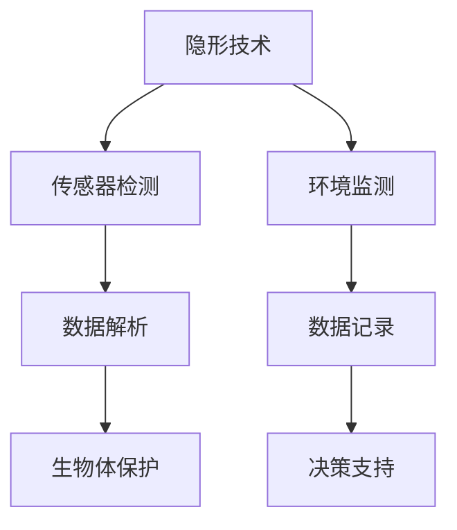

                 

### 背景介绍

随着科技的飞速发展，人类在各个领域取得了显著的成就，然而，随着人类活动的不断扩张，自然环境的破坏和野生动物的生存困境日益严峻。野生动物保护成为全球关注的重要议题，这不仅关乎生物多样性保护，也关乎人类自身的生存环境。然而，传统的野生动物保护手段面临着诸多挑战，如监测难、管理复杂、保护成本高等问题。

为了解决这些问题，环境隐形智能技术的提出为野生动物保护提供了一种全新的视角。环境隐形智能技术通过模拟自然界中的隐形现象，使野生动物在不被察觉的情况下得到有效的保护。这种技术利用电磁波、光学和雷达等原理，实现生物体的隐形，从而在监测、导航、通信和保护等方面展现出巨大的潜力。

本文旨在探讨环境隐形智能在野生动物保护中的应用，首先介绍环境隐形智能技术的基础知识，包括其定义、基本原理和物理基础，以及电磁波隐形技术、光学隐形技术和雷达隐形技术的具体应用案例。接着，深入分析环境隐形智能在野生动物保护中的实际应用，如隐形监测技术、隐形导航与定位技术、隐形通信技术和隐形保护技术等，并探讨其面临的挑战和未来发展方向。

通过本文的深入探讨，我们期望为环境隐形智能技术在野生动物保护中的应用提供理论依据和实践指导，进一步推动这一领域的研究与发展。

### 环境隐形智能概述

环境隐形智能（Environmental Invisibility Intelligence）是指利用各种技术手段，实现对生物体或物体在特定环境下不可见或难以被探测的技术体系。这一概念源自军事领域的隐形技术，但随着科技的进步和环境保护意识的提升，其应用逐渐拓展到野生动物保护领域。

#### **核心概念与联系**

环境隐形智能的核心概念包括：

1. **隐形技术**：指通过特定手段使生物体或物体在特定传感器或探测手段下难以被察觉的技术。
2. **传感器检测**：指通过传感器对环境中的生物体或物体进行检测的技术。
3. **数据解析**：指对传感器收集的数据进行处理、分析和解读的技术。

这些概念之间的关系可以用以下Mermaid流程图来表示：



在这个流程图中，隐形技术是核心，它通过传感器检测生物体或物体，并将检测结果通过数据解析进行处理，最终用于环境监测和数据记录，提供决策支持。

#### **核心算法原理讲解**

环境隐形智能的基本算法原理可以概括为以下几个步骤：

1. **数据采集**：通过传感器采集环境中的数据，包括生物体或物体的位置、运动轨迹、行为特征等。
2. **信号处理**：对采集到的信号进行预处理，包括滤波、降噪等，以提高信号质量。
3. **特征提取**：从处理后的信号中提取关键特征，如频率、幅度、相位等。
4. **算法匹配**：使用匹配算法，将提取的特征与预设的隐形模式进行比对，判断是否达到隐形效果。
5. **反馈调整**：根据比对结果，对隐形装置进行调整，以达到最佳隐形效果。

以下是一个简单的Python伪代码示例，用于阐述隐形算法的基本原理：

```python
# 环境隐形智能算法原理伪代码

def invisible_algorithm(signal, target_shape):
    # 数据采集
    processed_signal = preprocess_signal(signal)
    
    # 特征提取
    features = extract_features(processed_signal)
    
    # 算法匹配
    match_score = match_features(features, target_shape)
    
    # 反馈调整
    if match_score < threshold:
        adjust_invisibility_device()
    
    return match_score

def preprocess_signal(signal):
    # 信号处理
    # 包括滤波、降噪等
    return filtered_signal

def extract_features(signal):
    # 特征提取
    return extracted_features

def match_features(features, target_shape):
    # 算法匹配
    return match_score

def adjust_invisibility_device():
    # 反馈调整
    # 包括参数调整、设备重构等
```

#### **数学模型和数学公式**

环境隐形智能涉及多种数学模型和公式，以下是一个典型的透射系数的公式，用于描述隐形装置的透射效果：

$$ I = I_0 e^{-\alpha x} $$

其中：
- \( I \)：透射后的光强
- \( I_0 \)：入射光强
- \( \alpha \)：透射系数
- \( x \)：透射路径长度

**详细讲解**：

透射系数 \(\alpha\) 反映了隐形装置对光的吸收和散射能力。当 \(\alpha\) 较大时，光在通过隐形装置后的强度显著减弱，从而实现隐形效果。透射系数的值取决于隐形材料的性质、厚度以及入射光的波长。

**举例**：

假设一束激光以垂直方向入射到隐形装置上，隐形装置的厚度为5厘米，透射系数为0.1。我们可以计算激光通过隐形装置后的光强：

$$ I = I_0 e^{-0.1 \times 5} = 0.316 I_0 $$

这意味着，激光通过隐形装置后的光强仅为原始光强的31.6%。

通过上述背景介绍和详细讲解，我们可以看到环境隐形智能技术在野生动物保护中的潜力和重要性。接下来的章节将深入探讨不同隐形技术在野生动物保护中的应用，以及这些技术的具体实现方法和挑战。

#### **环境隐形智能的物理基础**

环境隐形智能的实现依赖于电磁波、光学和雷达等技术的物理原理。理解这些基础原理对于设计有效的隐形装置至关重要。

##### **电磁波隐形技术的物理基础**

电磁波隐形技术基于电磁波在不同介质中的传播特性。电磁波在自由空间中传播时，其速度约为\(3 \times 10^8\)米/秒，但在不同介质中速度会发生变化。这种速度的变化导致电磁波的波长和频率发生改变，从而影响其传播方向和强度。

1. **介电常数**：介电常数是描述材料对电磁波吸收和散射能力的物理量。当电磁波进入介电常数较大的介质时，其速度减慢，波长变短，能量损失增加。
2. **磁导率**：磁导率是描述材料对磁场响应能力的物理量。与介电常数类似，磁导率影响电磁波的传播路径和强度。
3. **波阻抗**：波阻抗是电磁波在介质中传播时遇到的阻力，它与介质的电磁参数密切相关。

电磁波隐形装置通常通过调整这些参数，使电磁波在经过隐形装置后难以被探测。例如，使用特殊的电磁波吸收材料可以显著减少电磁波的反射和散射，从而实现隐形。

##### **光学隐形技术的物理基础**

光学隐形技术主要依赖于光的波动性和干涉原理。光学隐形装置通常利用相位和振幅的调整，使光波在经过隐形装置时发生干涉和衍射，从而使得物体在视觉上不可见。

1. **相位**：相位是描述光波波动状态的物理量。通过调整光波的相位，可以使光波相互干涉，产生增强或减弱的效果。
2. **振幅**：振幅是描述光波强度大小的物理量。通过控制光波的振幅，可以实现光的透明或反射。
3. **干涉与衍射**：干涉和衍射是光波在传播过程中常见的现象。利用这些现象，可以在特定角度上使光波相互抵消，从而实现隐形。

光学隐形技术的一个典型应用是光学 cloak，它通过设计特定的相位梯度结构，使光波在经过 cloak 后沿着原来的路径继续传播，而不会暴露出 cloak 所覆盖的物体。

##### **雷达隐形技术的物理基础**

雷达隐形技术基于雷达波的反射和散射特性。雷达系统通过发射雷达波，然后接收反射回来的信号，从而探测物体的位置和形状。雷达隐形装置的主要目标是通过改变雷达波的传播路径和反射特性，使物体难以被雷达探测。

1. **雷达波的反射**：当雷达波遇到物体时，部分能量会反射回来。雷达系统通过分析反射信号的强度和相位，来识别物体的位置和大小。
2. **雷达波的散射**：雷达波在通过某些材料时，会发生散射现象，导致雷达信号被分散或削弱。
3. **频率选择**：不同频率的雷达波在不同介质中的传播特性不同。通过选择特定的频率，可以设计出对特定雷达系统具有隐形效果的装置。

雷达隐形技术的一个典型例子是地面移动目标干扰（GMTI）技术，它通过发射高频雷达波，然后使用特殊的滤波器来抑制地面反射的强信号，从而实现对地面移动目标的探测。

##### **总结**

环境隐形智能技术的基础物理原理涉及电磁波、光学和雷达等不同领域。理解这些原理对于设计和实现有效的隐形装置至关重要。电磁波隐形技术依赖于介电常数和磁导率，光学隐形技术利用相位和振幅调整，雷达隐形技术则通过频率选择和雷达波反射、散射特性来实现。通过综合运用这些原理，环境隐形智能技术在野生动物保护中展现出了巨大的潜力。

#### **电磁波隐形技术**

电磁波隐形技术（Electromagnetic Invisibility Technology）是环境隐形智能技术中最为成熟和广泛研究的一个分支。该技术利用电磁波的传播特性和材料特性，实现物体在电磁波探测下的不可见性。

##### **基本原理**

电磁波隐形技术的核心原理是利用电磁波的反射和散射特性，通过特定的结构设计，使电磁波在经过物体表面时发生特定的相位变化和路径扭曲，从而在接收端产生与物体存在时不同的信号。这种设计使得雷达、红外探测器等无法检测到物体的存在。

1. **相位变化**：通过设计特殊的相位梯度结构，使电磁波在经过物体表面时产生相位延迟，从而在接收端产生干涉，消除物体反射信号。
2. **路径扭曲**：通过构造特殊的弯曲结构，使电磁波在经过物体时发生路径扭曲，从而改变电磁波的传播方向，使反射信号被吸收或分散。
3. **材料特性**：选择合适的电磁波吸收材料和反射材料，使电磁波在经过物体时能够有效地被吸收或反射，从而减少反射信号的强度。

##### **主要方法**

1. **变形表面方法（Metamaterials）**：变形表面方法利用特殊设计的电磁波吸收材料和反射材料，构建出具有特殊电磁特性的表面结构。这些材料被称为超材料（Metamaterials），其电磁参数可以在不同频率和方向上调整，从而实现对电磁波的隐形效果。

   - **应用案例**：变形表面方法在战斗机、潜艇等军事装备的隐形设计中被广泛应用。例如，美国F-35战斗机采用变形表面方法，使其在不同频率的雷达探测下具有很好的隐形效果。

2. **相位梯度方法（Phase Gradient Method）**：相位梯度方法通过设计具有特定相位梯度的结构，使电磁波在经过物体时发生相位延迟，从而在接收端产生干涉，消除物体反射信号。

   - **应用案例**：相位梯度方法在无人机、小型车辆等移动设备的隐形设计中被广泛应用。例如，某些无人机通过相位梯度结构设计，使其在雷达探测下具有很好的隐形效果。

3. **超宽带方法（Ultra-Wideband, UWB）**：超宽带方法利用超宽带信号的特性，通过设计特殊的发射和接收系统，实现对电磁波的隐形效果。

   - **应用案例**：超宽带方法在无线通信、雷达探测等领域得到广泛应用。例如，某些无线通信设备通过超宽带信号设计，使其在雷达探测下具有很好的隐形效果。

##### **在野生动物保护中的应用**

电磁波隐形技术在野生动物保护中具有广泛的应用潜力。以下是一些具体的应用案例：

1. **监测与追踪**：利用电磁波隐形技术，可以设计出不易被野生动物察觉的监测设备，如隐形摄像头和追踪器。这些设备可以安装在野生动物栖息地中，实时监测和追踪野生动物的行为，从而提供有效的数据支持。

   - **案例**：例如，在某些野生动物保护区，研究人员使用隐形摄像头监测黑熊的活动，以便更好地了解其行为习惯和生存环境。

2. **保护与救助**：利用电磁波隐形技术，可以设计出对野生动物无害的隐形防护设备，如隐形屏障和防护罩。这些设备可以安装在野生动物栖息地周围，有效防止人类活动对野生动物的干扰和侵害。

   - **案例**：例如，在某些野生动物栖息地，研究人员使用隐形屏障保护野生动物免受非法捕猎和破坏。

3. **科学研究**：利用电磁波隐形技术，可以设计出对野生动物无干扰的实验设备，如隐形传感器和隐形实验装置。这些设备可以在不干扰野生动物自然行为的情况下，进行科学实验和研究。

   - **案例**：例如，在研究野生动物迁徙路线时，研究人员使用隐形传感器追踪动物的行为，以了解其迁徙规律和生存策略。

##### **挑战与未来发展方向**

尽管电磁波隐形技术在野生动物保护中展现出巨大潜力，但仍然面临一些挑战：

1. **技术复杂性**：电磁波隐形技术涉及多种复杂的设计和制造工艺，需要高水平的研发能力和技术支持。
2. **材料限制**：目前可用的电磁波吸收材料和反射材料性能有限，难以满足高频率、高精度等要求。
3. **成本与实用性**：电磁波隐形技术的研发和应用成本较高，如何降低成本、提高实用性是未来的重要研究方向。

未来，随着新材料、新工艺和新技术的发展，电磁波隐形技术在野生动物保护中的应用将更加广泛和深入。例如，超材料技术的发展有望进一步提升隐形效果和实用性；大数据分析和人工智能技术的结合，将为野生动物保护提供更加智能化的解决方案。

通过不断探索和创新，电磁波隐形技术将在野生动物保护中发挥更加重要的作用，为生物多样性和环境保护贡献力量。

### **光学隐形技术**

光学隐形技术（Optical Invisibility Technology）是环境隐形智能技术的重要组成部分，它通过调整光波的相位和振幅，使物体在光学探测下变得不可见。光学隐形技术的原理和实现方法与电磁波隐形技术有所不同，但同样具有广泛的应用潜力。

##### **基本原理**

光学隐形技术基于光的波动性和干涉原理。光波在传播过程中，其相位和振幅决定了光的强度和传播方向。通过设计特定的相位梯度结构或振幅调整装置，可以使光波在经过物体时发生特定的相位变化和路径扭曲，从而在接收端产生与物体存在时不同的信号，实现光学隐形。

1. **相位变化**：通过设计具有特定相位梯度的结构，使光波在经过物体时产生相位延迟，从而在接收端产生干涉，消除物体反射信号。
2. **振幅调整**：通过控制光波的振幅，使光波在经过物体时发生振幅变化，从而在接收端产生相位抵消，实现隐形。
3. **干涉与衍射**：利用光的干涉和衍射现象，通过设计特定的相位和振幅分布，使光波在经过物体时相互干涉或衍射，从而在特定角度上消除物体的反射信号。

##### **主要方法**

1. **相位梯度方法（Phase Gradient Method）**：相位梯度方法通过设计具有特定相位梯度的结构，使光波在经过物体时产生相位延迟，从而在接收端产生干涉，消除物体反射信号。

   - **应用案例**：相位梯度方法在光学 cloak 和光学隐形眼镜等领域得到广泛应用。例如，光学 cloak 可以使光波在经过特定结构后沿着原来的路径继续传播，而不会暴露出 cloak 所覆盖的物体。

2. **超透镜方法（Superlens Method）**：超透镜方法利用超材料（Metamaterials）的特殊性质，使光波在经过超透镜时发生相位变化，从而实现光学隐形。

   - **应用案例**：超透镜方法在光学成像和纳米制造等领域得到应用。例如，使用超透镜可以实现对微小物体的隐形成像，从而提高成像分辨率。

3. **振幅调整方法（Amplitude Adjustment Method）**：振幅调整方法通过设计特定的振幅调整装置，使光波在经过物体时发生振幅变化，从而在接收端产生相位抵消，实现隐形。

   - **应用案例**：振幅调整方法在光学通信和光学传感器等领域得到应用。例如，通过设计特定的振幅调整装置，可以实现对光学信号的隐形传输和检测。

##### **在野生动物保护中的应用**

光学隐形技术在野生动物保护中具有广泛的应用前景。以下是一些具体的应用案例：

1. **监测与追踪**：利用光学隐形技术，可以设计出不易被野生动物察觉的光学监测设备，如隐形摄像头和光学传感器。这些设备可以安装在野生动物栖息地中，实时监测和追踪野生动物的行为，从而提供有效的数据支持。

   - **案例**：例如，在某些野生动物保护区，研究人员使用隐形摄像头监测老虎的活动，以便更好地了解其行为习惯和生存环境。

2. **保护与救助**：利用光学隐形技术，可以设计出对野生动物无害的光学防护设备，如隐形屏障和防护罩。这些设备可以安装在野生动物栖息地周围，有效防止人类活动对野生动物的干扰和侵害。

   - **案例**：例如，在某些野生动物栖息地，研究人员使用隐形屏障保护野生动物免受非法捕猎和破坏。

3. **科学研究**：利用光学隐形技术，可以设计出对野生动物无干扰的实验设备，如隐形传感器和光学实验装置。这些设备可以在不干扰野生动物自然行为的情况下，进行科学实验和研究。

   - **案例**：例如，在研究野生动物迁徙路线时，研究人员使用光学隐形传感器追踪动物的行为，以了解其迁徙规律和生存策略。

##### **挑战与未来发展方向**

尽管光学隐形技术在野生动物保护中展现出巨大潜力，但仍然面临一些挑战：

1. **技术复杂性**：光学隐形技术涉及复杂的光学设计和制造工艺，需要高水平的研发能力和技术支持。
2. **材料限制**：目前可用的光学隐形材料性能有限，难以满足高频率、高精度等要求。
3. **成本与实用性**：光学隐形技术的研发和应用成本较高，如何降低成本、提高实用性是未来的重要研究方向。

未来，随着新材料、新工艺和新技术的发展，光学隐形技术在野生动物保护中的应用将更加广泛和深入。例如，超材料技术的发展有望进一步提升隐形效果和实用性；大数据分析和人工智能技术的结合，将为野生动物保护提供更加智能化的解决方案。

通过不断探索和创新，光学隐形技术将在野生动物保护中发挥更加重要的作用，为生物多样性和环境保护贡献力量。

### **雷达隐形技术**

雷达隐形技术（Radar Invisibility Technology）是环境隐形智能技术中一个重要的分支，它通过改变雷达波的反射和散射特性，使物体在雷达探测下变得不可见。雷达隐形技术的应用涵盖了从军事到民用多个领域，其在野生动物保护中的潜力也引起了广泛关注。

##### **基本原理**

雷达隐形技术的基本原理是利用雷达波的反射和散射特性，通过特定的结构设计或材料选择，使雷达波在经过物体表面时发生特定的路径扭曲和信号削弱，从而在接收端产生与物体存在时不同的信号，实现隐形。

1. **雷达波的反射与散射**：雷达系统通过发射雷达波，然后接收反射回来的信号，来探测物体的位置和形状。当雷达波遇到物体时，部分能量会被反射回来，形成反射信号。此外，雷达波在通过物体时，还会发生散射现象，导致反射信号被分散或削弱。

2. **路径扭曲与信号削弱**：通过设计特定的结构或使用特殊的材料，可以使雷达波在经过物体时发生路径扭曲和信号削弱。具体方法包括：
   - **路径扭曲**：通过构造特定的弯曲结构，使雷达波在经过物体时发生路径变化，从而改变反射信号的方向和强度。
   - **信号削弱**：通过使用雷达波吸收材料或散射材料，使雷达波在经过物体时能量损失增加，从而削弱反射信号。

##### **主要方法**

1. **变形表面方法（Metamaterials）**：变形表面方法利用特殊设计的电磁波吸收材料和反射材料，构建出具有特殊电磁特性的表面结构。这些材料被称为超材料（Metamaterials），其电磁参数可以在不同频率和方向上调整，从而实现对雷达波的隐形效果。

   - **应用案例**：变形表面方法在地面移动目标干扰（GMTI）雷达系统中得到广泛应用。通过使用变形表面方法，可以显著减少地面反射的强信号，从而提高对地面移动目标的探测能力。

2. **相位梯度方法（Phase Gradient Method）**：相位梯度方法通过设计具有特定相位梯度的结构，使雷达波在经过物体时发生相位延迟，从而在接收端产生干涉，消除物体反射信号。

   - **应用案例**：相位梯度方法在隐身飞机和隐身舰船的设计中被广泛应用。通过使用相位梯度方法，可以显著降低雷达波反射信号的强度，从而提高隐身效果。

3. **超宽带方法（Ultra-Wideband, UWB）**：超宽带方法利用超宽带信号的特性，通过设计特殊的发射和接收系统，实现对雷达波的隐形效果。

   - **应用案例**：超宽带方法在无人机和车辆雷达探测系统中得到应用。通过使用超宽带信号，可以实现对雷达探测的有效规避和隐形。

##### **在野生动物保护中的应用**

雷达隐形技术在野生动物保护中具有广泛的应用潜力。以下是一些具体的应用案例：

1. **监测与追踪**：利用雷达隐形技术，可以设计出不易被野生动物察觉的雷达监测设备，如雷达传感器和雷达追踪器。这些设备可以安装在野生动物栖息地中，实时监测和追踪野生动物的行为，从而提供有效的数据支持。

   - **案例**：例如，在某些野生动物保护区，研究人员使用雷达隐形传感器监测野生动物的活动，以便更好地了解其行为习惯和生存环境。

2. **保护与救助**：利用雷达隐形技术，可以设计出对野生动物无害的雷达防护设备，如雷达屏障和雷达防护罩。这些设备可以安装在野生动物栖息地周围，有效防止人类活动对野生动物的干扰和侵害。

   - **案例**：例如，在某些野生动物栖息地，研究人员使用雷达隐形屏障保护野生动物免受非法捕猎和破坏。

3. **科学研究**：利用雷达隐形技术，可以设计出对野生动物无干扰的实验设备，如雷达传感器和雷达实验装置。这些设备可以在不干扰野生动物自然行为的情况下，进行科学实验和研究。

   - **案例**：例如，在研究野生动物迁徙路线时，研究人员使用雷达隐形传感器追踪动物的行为，以了解其迁徙规律和生存策略。

##### **挑战与未来发展方向**

尽管雷达隐形技术在野生动物保护中展现出巨大潜力，但仍然面临一些挑战：

1. **技术复杂性**：雷达隐形技术涉及复杂的设计和制造工艺，需要高水平的研发能力和技术支持。
2. **材料限制**：目前可用的雷达隐形材料性能有限，难以满足高频率、高精度等要求。
3. **成本与实用性**：雷达隐形技术的研发和应用成本较高，如何降低成本、提高实用性是未来的重要研究方向。

未来，随着新材料、新工艺和新技术的发展，雷达隐形技术在野生动物保护中的应用将更加广泛和深入。例如，超材料技术的发展有望进一步提升隐形效果和实用性；大数据分析和人工智能技术的结合，将为野生动物保护提供更加智能化的解决方案。

通过不断探索和创新，雷达隐形技术将在野生动物保护中发挥更加重要的作用，为生物多样性和环境保护贡献力量。

### **隐形监测技术**

隐形监测技术（Invisible Monitoring Technology）是环境隐形智能技术在野生动物保护中的一个关键应用领域。通过实现监测设备的隐形化，隐形监测技术能够有效地减少对野生动物的干扰，从而获取更真实、全面的数据。

##### **隐形监测系统的组成与原理**

隐形监测系统的核心组成部分包括隐形传感器、数据采集和处理单元、以及远程传输和监控平台。其工作原理可以概括为以下几个步骤：

1. **隐形传感器**：使用电磁波、光学或雷达隐形技术，设计出不易被野生动物察觉的传感器。这些传感器可以捕捉环境中的各种信息，如温度、湿度、光照、声音和振动等。

2. **数据采集与处理**：传感器收集的数据通过内置的微处理器进行初步处理，包括滤波、降噪和特征提取等，以提高数据的质量和可靠性。

3. **远程传输**：处理后的数据通过隐形通信技术（如超宽带、光纤通信等）传输到远程服务器或控制中心。

4. **数据分析与监控**：远程服务器或控制中心对传输的数据进行分析和处理，生成监测报告和实时监控画面，为野生动物保护和管理工作提供决策支持。

##### **隐形监测技术在野生动物监测中的应用**

隐形监测技术在野生动物监测中具有广泛的应用，以下是一些具体的应用案例：

1. **行为监测**：利用隐形传感器，可以实现对野生动物行为的连续监测。例如，隐形摄像头可以捕捉到野生动物的日常活动，包括觅食、休息和繁殖行为，从而提供宝贵的数据支持。

   - **案例**：在某个野生动物保护区的黑熊研究项目中，研究人员使用隐形摄像头监测黑熊的活动，记录其日常行为，分析其活动规律和栖息地需求。

2. **栖息地监测**：通过隐形传感器，可以实时监测野生动物栖息地的环境变化。例如，使用隐形温度传感器和湿度传感器，可以捕捉栖息地的温度和湿度变化，为栖息地管理和生态保护提供依据。

   - **案例**：在某森林保护区的白尾鹿栖息地监测项目中，研究人员使用隐形温度传感器和湿度传感器，监测栖息地的气候条件，评估栖息地的适宜性。

3. **迁徙路线监测**：利用隐形监测技术，可以追踪野生动物的迁徙路线。例如，使用隐形定位设备，可以实时记录野生动物的迁徙路径，分析其迁徙行为和影响因素。

   - **案例**：在某沙漠生态保护项目中，研究人员使用隐形定位设备追踪沙漠狐狸的迁徙路线，了解其迁徙过程中的生态需求和行为特征。

4. **疾病监测**：隐形监测技术还可以用于野生动物疾病的监测和防控。例如，使用隐形传感器，可以实时监测野生动物的生理指标，如体温、心率等，及时发现疾病症状。

   - **案例**：在某个野生动物保护区，研究人员使用隐形传感器监测野生动物的健康状况，及时发现并处理疾病问题，提高野生动物的生存率。

##### **隐形监测技术的挑战与未来发展方向**

尽管隐形监测技术在野生动物保护中具有广泛的应用，但仍然面临一些挑战：

1. **技术复杂性**：隐形监测技术涉及多种复杂的设计和制造工艺，需要高水平的研发能力和技术支持。

2. **材料限制**：目前可用的隐形材料性能有限，难以满足高频率、高精度等要求。

3. **成本与实用性**：隐形监测技术的研发和应用成本较高，如何降低成本、提高实用性是未来的重要研究方向。

未来，随着新材料、新工艺和新技术的发展，隐形监测技术在野生动物保护中的应用将更加广泛和深入。例如，超材料技术的发展有望进一步提升隐形效果和实用性；大数据分析和人工智能技术的结合，将为野生动物保护提供更加智能化的解决方案。

通过不断探索和创新，隐形监测技术将在野生动物保护中发挥更加重要的作用，为生物多样性和环境保护贡献力量。

### **隐形导航与定位技术**

隐形导航与定位技术（Invisible Navigation and Positioning Technology）是环境隐形智能技术在野生动物保护中的另一个关键应用领域。通过实现导航设备的隐形化，这些技术能够减少对野生动物的干扰，同时提供准确、高效的定位服务。

##### **隐形导航与定位技术的原理**

隐形导航与定位技术的基本原理是通过特定的传感器和算法，实现对野生动物当前位置的实时追踪和导航。其工作流程可以概括为以下几个步骤：

1. **传感器采集**：隐形传感器（如GPS、光学传感器、雷达传感器等）安装在野生动物身上，用于采集当前位置和环境信息。

2. **数据处理**：传感器采集的数据通过内置的微处理器进行初步处理，包括滤波、降噪和特征提取等，以提高数据的质量和可靠性。

3. **定位算法**：使用定位算法，如基于GPS的定位、基于光学传感器和雷达传感器的视觉定位和雷达定位等，计算野生动物的当前位置。

4. **导航指令**：根据定位结果，系统生成导航指令，指导野生动物的移动路径。

##### **隐形导航与定位技术在野生动物保护中的应用**

隐形导航与定位技术在野生动物保护中具有广泛的应用，以下是一些具体的应用案例：

1. **迁徙路线监测**：通过隐形导航设备，可以实时追踪野生动物的迁徙路线。例如，利用GPS隐形定位设备，可以记录动物的迁徙路径，分析其迁徙行为和影响因素。

   - **案例**：在某北极熊保护项目中，研究人员使用GPS隐形定位设备追踪北极熊的迁徙路径，了解其迁徙行为和栖息地需求，为保护工作提供科学依据。

2. **栖息地管理**：隐形导航技术可以帮助野生动物保护机构管理栖息地，优化野生动物的栖息环境。例如，通过隐形传感器收集的数据，可以分析栖息地的使用情况，制定科学的栖息地管理策略。

   - **案例**：在某个森林保护项目中，研究人员使用隐形传感器监测森林中的野生动物活动，分析栖息地的使用情况，为保护工作提供数据支持。

3. **疾病监测与救援**：隐形导航技术还可以用于野生动物的疾病监测和紧急救援。例如，通过隐形定位设备，可以实时监测野生动物的健康状况，一旦发现疾病症状，可以迅速定位并采取措施。

   - **案例**：在某野生动物保护区，研究人员使用隐形定位设备监测黑熊的健康状况，及时发现并处理疾病问题，提高黑熊的生存率。

4. **行为研究**：隐形导航技术可以帮助科学家研究野生动物的行为模式，例如，通过记录动物的日常活动和迁徙路径，可以更好地理解其行为特征和生态习性。

   - **案例**：在某野生动物研究项目中，研究人员使用隐形导航设备记录老虎的日常活动和迁徙路径，分析其行为模式和生存策略。

##### **隐形导航与定位技术的挑战与未来发展方向**

尽管隐形导航与定位技术在野生动物保护中具有巨大潜力，但仍然面临一些挑战：

1. **技术复杂性**：隐形导航与定位技术涉及复杂的设计和制造工艺，需要高水平的研发能力和技术支持。

2. **数据准确性**：传感器采集的数据可能受到环境干扰和噪声的影响，需要高精度的数据处理算法来确保定位准确性。

3. **成本与实用性**：隐形导航与定位技术的研发和应用成本较高，如何降低成本、提高实用性是未来的重要研究方向。

未来，随着新材料、新工艺和新技术的发展，隐形导航与定位技术在野生动物保护中的应用将更加广泛和深入。例如，基于人工智能和大数据分析的定位算法有望进一步提升定位精度和数据处理效率；超材料技术的发展有望进一步提升隐形效果和实用性。

通过不断探索和创新，隐形导航与定位技术将在野生动物保护中发挥更加重要的作用，为生物多样性和环境保护贡献力量。

### **隐形通信技术**

隐形通信技术（Invisible Communication Technology）是环境隐形智能技术在野生动物保护中的一项重要应用，通过实现通信设备的隐形化，这种技术能够减少对野生动物的干扰，同时确保信息的有效传输。

##### **隐形通信技术的原理**

隐形通信技术的核心在于利用特殊的信号传输方式和隐形装置，使通信信号在传输过程中难以被检测或干扰。其基本原理包括以下几个关键点：

1. **信号编码与调制**：通信信号通过特殊的编码和调制技术，使其在传输过程中具有较低的信号特征，从而降低被检测到的可能性。

2. **隐形装置**：隐形装置用于屏蔽或改变通信信号的传播路径，使其在特定环境中难以被探测。这些装置可以采用电磁波、光学或声波等多种形式。

3. **信号传输与接收**：隐形通信信号通过隐形装置传输到接收端，接收端通过解调和解码技术还原出原始信号，从而实现信息的有效传输。

##### **隐形通信技术在野生动物保护中的应用**

隐形通信技术在野生动物保护中有着广泛的应用，以下是一些具体的应用案例：

1. **远程监测与数据传输**：通过隐形通信技术，可以实现野生动物体内或栖息地中的监测设备与外部控制中心之间的远程通信。例如，利用电磁波隐形通信设备，可以实时传输野生动物的健康数据和活动信息，从而为保护工作提供科学依据。

   - **案例**：在某个野生动物保护区，研究人员使用电磁波隐形通信设备，实时监测黑熊的健康状况和活动情况，为保护工作提供数据支持。

2. **保护与救援**：隐形通信技术可以在紧急情况下实现快速的信息传输和救援指挥。例如，通过声波隐形通信装置，可以实现对野生动物的紧急呼救和信息传递，从而提高救援效率。

   - **案例**：在某次野生动物救援行动中，研究人员使用声波隐形通信装置，及时传递被困动物的位置信息，指导救援团队迅速采取行动。

3. **行为研究**：隐形通信技术可以帮助科学家研究野生动物的行为模式。例如，通过安装隐形通信设备，可以实时记录野生动物的社交行为和通讯内容，从而深入了解其行为特征。

   - **案例**：在某个野生动物研究项目中，研究人员使用光学隐形通信设备，记录了野生动物的日常活动和社交行为，为研究提供了丰富的数据。

##### **隐形通信技术的挑战与未来发展方向**

尽管隐形通信技术在野生动物保护中具有巨大潜力，但仍然面临一些挑战：

1. **技术复杂性**：隐形通信技术涉及复杂的设计和制造工艺，需要高水平的研发能力和技术支持。

2. **信号干扰与稳定性**：隐形通信信号在传输过程中可能受到环境干扰和噪声的影响，需要高精度的信号处理算法来确保通信的稳定性和可靠性。

3. **成本与实用性**：隐形通信技术的研发和应用成本较高，如何降低成本、提高实用性是未来的重要研究方向。

未来，随着新材料、新工艺和新技术的发展，隐形通信技术在野生动物保护中的应用将更加广泛和深入。例如，基于人工智能和大数据分析的通信算法有望进一步提升通信效率和稳定性；超材料技术的发展有望进一步提升隐形效果和实用性。

通过不断探索和创新，隐形通信技术将在野生动物保护中发挥更加重要的作用，为生物多样性和环境保护贡献力量。

### **隐形保护技术**

隐形保护技术（Invisible Protection Technology）是环境隐形智能技术在野生动物保护中的一项重要应用，通过实现防护设备的隐形化，这种技术能够减少对野生动物的干扰，同时提供有效的保护。

##### **隐形保护技术的原理**

隐形保护技术的核心在于利用特殊的防护装置和隐形技术，使保护设备在野生动物栖息地中难以被察觉。其基本原理包括以下几个关键点：

1. **隐形装置**：隐形装置用于隐藏或屏蔽保护设备，使其在视觉、电磁波和声波等传感器下难以被检测到。这些装置可以采用变形表面方法、相位梯度方法或超材料等先进技术。

2. **防护材料**：防护设备采用特殊的材料，这些材料具有电磁波吸收、反射和散射特性，能够在不同频率和环境条件下有效隐藏保护设备。

3. **智能控制系统**：隐形保护设备配备智能控制系统，可以实时监控环境变化，并根据需求自动调整防护策略，确保保护效果。

##### **隐形保护技术在野生动物保护中的应用**

隐形保护技术在野生动物保护中有着广泛的应用，以下是一些具体的应用案例：

1. **栖息地保护**：通过隐形保护技术，可以设计出不易被野生动物察觉的栖息地保护设备，如隐形围栏和防护罩。这些设备能够有效防止野生动物栖息地受到非法侵入和破坏。

   - **案例**：在某个自然保护区，研究人员使用隐形围栏保护野生动物栖息地，防止人类活动对野生动物的干扰。

2. **迁徙路线保护**：利用隐形保护技术，可以设计出对野生动物迁徙路线的隐形保护装置，如隐形指示牌和隐形障碍物。这些装置能够引导野生动物避开危险区域，同时减少对野生动物的干扰。

   - **案例**：在某个野生动物迁徙路径上，研究人员使用隐形障碍物引导野生动物安全通过，避免其受到车辆和其他人类活动的威胁。

3. **疾病预防**：隐形保护技术还可以用于野生动物疾病的预防和控制。通过隐形传感器和通信设备，可以实时监测野生动物的健康状况，及时发现并处理疾病问题。

   - **案例**：在某个野生动物保护区，研究人员使用隐形传感器监测野生动物的健康状况，及时发现并控制疾病传播，提高野生动物的生存率。

4. **物种保护**：隐形保护技术可以帮助保护濒危物种，通过隐形装置和智能控制系统，实现对濒危物种的实时监测和保护。

   - **案例**：在某次濒危物种保护项目中，研究人员使用隐形传感器和通信设备，实时监测濒危物种的行为和健康状况，确保其安全生存。

##### **隐形保护技术的挑战与未来发展方向**

尽管隐形保护技术在野生动物保护中具有巨大潜力，但仍然面临一些挑战：

1. **技术复杂性**：隐形保护技术涉及复杂的设计和制造工艺，需要高水平的研发能力和技术支持。

2. **材料限制**：目前可用的隐形材料和防护材料性能有限，难以满足高频率、高精度等要求。

3. **成本与实用性**：隐形保护技术的研发和应用成本较高，如何降低成本、提高实用性是未来的重要研究方向。

未来，随着新材料、新工艺和新技术的发展，隐形保护技术在野生动物保护中的应用将更加广泛和深入。例如，超材料技术的发展有望进一步提升隐形效果和实用性；大数据分析和人工智能技术的结合，将为野生动物保护提供更加智能化的解决方案。

通过不断探索和创新，隐形保护技术将在野生动物保护中发挥更加重要的作用，为生物多样性和环境保护贡献力量。

### **环境隐形智能在野生动物保护中的综合应用**

环境隐形智能技术在野生动物保护中具有广泛的应用潜力，通过综合运用隐形监测、导航与定位、通信和保护等技术，可以实现全面、高效的野生动物保护。以下是一些具体的实际应用案例和综合效益分析。

#### **实际应用案例**

1. **综合监测与追踪系统**：在某自然保护区，研究人员利用环境隐形智能技术，建立了一个综合监测与追踪系统。系统包括隐形摄像头、GPS定位设备、隐形传感器和无线通信设备。通过这些设备，研究人员能够实时监测野生动物的行为、位置和环境变化，有效收集数据，分析野生动物的栖息地和迁徙路径，从而制定科学的管理和保护措施。

2. **智能保护屏障**：在某个城市公园，野生动物与人类活动的冲突频繁。研究人员使用隐形保护技术，设计了智能保护屏障。这些屏障采用变形表面材料和相位梯度结构，使得野生动物在夜间难以察觉到屏障的存在。智能控制系统根据环境变化和野生动物的行为，自动调整屏障的位置和强度，有效防止野生动物进入危险区域。

3. **隐形疾病监测与预警系统**：在某野生动物保护区，研究人员部署了隐形疾病监测与预警系统。系统包括隐形传感器、无线通信设备和数据分析平台。传感器实时监测野生动物的生理指标，如体温、心率等，一旦检测到异常，系统会自动发出预警，研究人员可以及时采取干预措施，防止疾病传播。

4. **隐形导航与救援系统**：在某次野生动物救援行动中，研究人员利用隐形导航与定位技术，成功找到了被困的豹子。隐形导航设备安装在豹子身上，通过隐形通信设备与地面控制中心保持联系。地面控制中心根据定位数据，指导救援队伍迅速定位和营救，确保了动物的生存。

#### **综合效益分析**

1. **减少干扰，提升监测效率**：通过环境隐形智能技术，野生动物的监测和追踪工作可以减少对野生动物的干扰，提高监测数据的真实性和可靠性。隐形设备的使用使得野生动物在自然状态下活动，监测数据更加真实，有助于科学决策。

2. **提高保护效果，降低管理成本**：隐形保护技术能够有效防止野生动物栖息地的破坏和人类活动的干扰，提高保护效果。同时，智能控制系统可以自动调整保护策略，降低人工管理的成本和工作量。

3. **实时预警，及时干预**：隐形疾病监测与预警系统可以在疾病爆发初期及时发现并采取措施，防止疾病传播。隐形导航与救援系统在紧急情况下能够快速定位和营救动物，提高救援效率和成功率。

4. **促进科学研究，保护生物多样性**：通过综合应用环境隐形智能技术，科学家可以更深入地研究野生动物的行为、栖息地和生态需求，为生物多样性保护和科学探索提供数据支持。

#### **未来发展方向**

1. **新材料与新技术**：随着新材料（如超材料）和新技术的（如人工智能和大数据分析）发展，环境隐形智能技术在野生动物保护中的应用将更加广泛和深入。新材料将进一步提升隐形效果，新技术将提高系统的智能化和自动化水平。

2. **系统集成与优化**：未来需要加强环境隐形智能技术的系统集成与优化，提高系统的兼容性和协同效应。通过整合不同技术，构建智能化、自动化的综合保护系统，实现更高效、更精准的野生动物保护。

3. **政策支持与推广**：政府和企业需要加大对环境隐形智能技术在野生动物保护中的应用支持，制定相关政策，推动技术的研发和应用。同时，加强国际合作，共享技术成果和经验，共同应对生物多样性保护挑战。

通过不断探索和创新，环境隐形智能技术在野生动物保护中的应用将发挥越来越重要的作用，为生物多样性和环境保护贡献力量。

### **环境隐形智能技术的研究进展**

环境隐形智能技术在过去几十年中取得了显著的进展，从最初的理论研究到实际应用，该领域已经取得了许多突破。以下是电磁波隐形技术、光学隐形技术和雷达隐形技术在这段时间内的一些重要研究进展。

#### **电磁波隐形技术的研究进展**

1. **超材料的发展**：超材料（Metamaterials）是电磁波隐形技术中的一个关键组成部分。从最初的理论概念到实验验证，超材料的发展取得了重要突破。研究人员设计并制造出了具有负折射率、超宽带响应等特性的超材料，这些材料在隐形装置中的应用极大地提升了隐形效果。

   - **案例**：麻省理工学院的科学家们设计了一种名为“黑超材料”的新型材料，其能够在不同频率下实现全向隐形，具有极高的隐形效率。

2. **全向隐形**：传统隐形技术主要关注物体在特定方向上的隐形效果，而全向隐形技术则追求物体在所有方向上的不可见性。近年来，研究人员在实现全向隐形方面取得了重要进展，例如，美国加州大学的研究团队开发了一种具有全向隐形能力的电磁波隐形装置。

3. **低能耗设计**：电磁波隐形装置在实际应用中通常需要消耗大量能量，因此低能耗设计成为了一个重要研究方向。近年来，研究人员通过优化装置结构和材料选择，成功降低了隐形装置的能量消耗，提高了其实用性。

4. **量子隐形传态**：量子隐形传态（Quantum隐形传态）技术的提出为电磁波隐形技术带来了新的可能性。通过量子纠缠和量子态传输，量子隐形传态技术可以在不影响物体本身的情况下实现隐形传输，为电磁波隐形技术开辟了新的研究途径。

#### **光学隐形技术的研究进展**

1. **光学 cloak 的设计**：光学 cloak 是光学隐形技术中的一个重要应用。近年来，研究人员在光学 cloak 的设计方面取得了重要进展。通过引入超材料、纳米结构等手段，光学 cloak 的性能得到了显著提升，实现了在可见光范围内的全向隐形。

   - **案例**：美国斯坦福大学的研究团队设计了一种基于纳米结构的光学 cloak，成功实现了在可见光范围内的隐形效果。

2. **超透镜技术**：超透镜技术利用超材料的特殊性质，使光波在经过超透镜时发生相位变化，从而实现光学隐形。近年来，研究人员在超透镜的设计和制造方面取得了重要突破，例如，通过引入微纳米加工技术，实现了更高精度和更高效率的超透镜制造。

3. **基于相位梯度方法的光学隐形**：相位梯度方法在光学隐形技术中具有重要应用。通过设计具有特定相位梯度的结构，光学 cloak 可以实现全向隐形。近年来，研究人员在相位梯度结构的设计和优化方面取得了重要进展，例如，通过引入动态相位控制技术，实现了对光学 cloak 性能的实时调整。

4. **光学隐形技术在医疗领域的应用**：光学隐形技术不仅在理论研究上取得了重要进展，还逐渐应用于实际医疗领域。例如，研究人员利用光学 cloak 技术开发了一种新型的隐形手术工具，使医生能够在光学显微镜下进行更精细的手术操作。

#### **雷达隐形技术的研究进展**

1. **地面移动目标干扰（GMTI）技术**：地面移动目标干扰技术是雷达隐形技术中的一个重要研究方向。通过设计特殊的雷达波反射和散射结构，GMTI 技术可以有效地降低地面反射信号，实现对地面移动目标的隐身效果。

   - **案例**：美国国防部的科学家们开发了一种 GMTI 雷达系统，能够在复杂的地形和环境中实现对地面移动目标的精准探测。

2. **基于相位梯度方法的雷达隐形**：相位梯度方法在雷达隐形技术中得到了广泛应用。通过设计具有特定相位梯度的结构，雷达 cloak 可以实现全向雷达隐形。近年来，研究人员在相位梯度结构的设计和优化方面取得了重要进展，例如，通过引入智能材料，实现了对雷达 cloak 性能的实时调整。

3. **超宽带雷达隐形技术**：超宽带雷达技术利用宽带的雷达波特性，通过设计特殊的发射和接收系统，实现对雷达波的隐形效果。近年来，研究人员在超宽带雷达隐形技术方面取得了重要突破，例如，通过引入超材料技术，实现了在宽频带范围内的雷达隐形。

4. **雷达隐形技术在无人机中的应用**：随着无人机技术的快速发展，雷达隐形技术在无人机中的应用也日益受到关注。研究人员通过设计雷达 cloak 和 GMTI 技术，实现了无人机的雷达隐身效果，从而提高了无人机的生存能力和作战能力。

总的来说，环境隐形智能技术在过去几十年中取得了显著的进展，从理论研究到实际应用，各个领域都取得了重要突破。未来，随着新材料、新工艺和新技术的不断发展，环境隐形智能技术在野生动物保护中的应用将更加广泛和深入，为生物多样性和环境保护做出更大的贡献。

### **环境隐形智能技术在野生动物保护中的应用前景**

环境隐形智能技术在野生动物保护中的应用前景广阔，随着新技术的不断发展和成熟，其潜在应用领域将更加广泛。以下是环境隐形智能技术在野生动物保护中的潜在应用领域、发展趋势和未来挑战。

#### **潜在应用领域**

1. **生物多样性监测**：环境隐形智能技术可以通过隐形监测设备，实现对野生动物种群、栖息地和生态系统的实时监测。这种技术可以在不干扰野生动物的自然行为的情况下，获取高精度的数据，为生物多样性保护提供科学依据。

2. **生态修复与恢复**：在生态修复和恢复过程中，环境隐形智能技术可以帮助监测生态系统恢复的状况，评估不同修复策略的效果。例如，通过隐形传感器监测野生动物的栖息行为和生态系统的变化，为生态修复提供指导。

3. **濒危物种保护**：对于濒危物种，环境隐形智能技术可以提供有效的监控和保护措施。通过隐形导航与定位技术，可以实时跟踪濒危物种的生存状况和迁徙路径，确保其安全生存。

4. **人类活动干扰减少**：环境隐形智能技术可以通过隐形屏障和隐形防护设备，减少人类活动对野生动物栖息地的干扰。例如，在自然保护区和野生动物栖息地周边，使用隐形屏障可以有效防止人类活动对野生动物的侵害。

5. **野生动物行为研究**：环境隐形智能技术可以帮助科学家更深入地研究野生动物的行为、生态习性和生态需求。通过隐形传感器和隐形通信设备，可以实时记录和分析野生动物的行为数据，为野生动物保护提供科学依据。

#### **发展趋势**

1. **集成化与智能化**：随着人工智能和大数据技术的发展，环境隐形智能技术将更加集成化和智能化。未来的隐形监测、导航与定位系统将能够实现自动化数据处理和智能决策，提高保护工作的效率和精准度。

2. **新材料与新技术**：新材料的研发（如超材料和纳米材料）和新技术的应用（如量子隐形传态技术）将为环境隐形智能技术带来新的突破。这些新材料和新技术将进一步提升隐形效果和实用性，扩大其在野生动物保护中的应用范围。

3. **跨学科合作**：环境隐形智能技术涉及多个学科领域，包括物理学、材料科学、电子工程和计算机科学等。跨学科合作将成为推动该领域发展的关键，通过多学科整合，可以开发出更加先进和实用的隐形技术。

4. **政策支持与推广**：政府和企业对环境隐形智能技术在野生动物保护中的应用将给予更多支持，制定相关政策，推动技术研发和应用。同时，国际合作也将促进技术的共享和推广，为全球野生动物保护贡献力量。

#### **未来挑战**

1. **技术复杂性**：环境隐形智能技术涉及复杂的设计和制造工艺，需要高水平的研发能力和技术支持。如何简化技术复杂度，降低研发成本，将是未来需要克服的重要挑战。

2. **材料限制**：目前可用的隐形材料性能有限，难以满足高频率、高精度等要求。未来需要研发出更高性能的材料，以满足不同应用场景的需求。

3. **成本与实用性**：隐形设备的研发和应用成本较高，如何降低成本、提高实用性是未来需要解决的重要问题。同时，需要确保隐形设备对野生动物无害，不会对其生态系统造成负面影响。

4. **数据隐私与安全**：环境隐形智能技术在监测和通信过程中，会涉及大量的生物数据。如何保护这些数据的安全性和隐私性，防止数据泄露和滥用，是未来需要关注的重要问题。

总之，随着环境隐形智能技术的不断发展和应用，其在野生动物保护中的潜力将得到充分挖掘。通过克服技术挑战，推动技术创新，环境隐形智能技术将为野生动物保护带来新的机遇和希望。

### **附录A：环境隐形智能技术常用工具与资源**

#### **A.1 环境隐形智能技术相关软件**

1. **MATLAB**：MATLAB 是一款强大的科学计算软件，常用于模拟和分析环境隐形智能技术的相关算法。它提供了丰富的信号处理和图像处理工具箱，可以帮助研究人员进行数据预处理、特征提取和算法验证。

2. **ANSYS HFSS**：ANSYS HFSS 是一款高频结构仿真软件，适用于电磁波隐形技术的设计和仿真。它可以帮助研究人员设计电磁波吸收材料和隐形装置，并进行电磁波传播特性的仿真分析。

3. **Lumerical**：Lumerical 是一款光学仿真软件，适用于光学隐形技术的设计和优化。它提供了基于物理的仿真工具，可以帮助研究人员进行光学 cloak 和超透镜的设计和性能分析。

4. **COMSOL Multiphysics**：COMSOL Multiphysics 是一款多物理场仿真软件，适用于综合分析和设计环境隐形智能技术系统。它能够模拟电磁场、声场和热场等物理现象，帮助研究人员进行系统集成和性能评估。

#### **A.2 环境隐形智能技术相关数据库**

1. **IEEE Xplore**：IEEE Xplore 是一个涵盖了广泛科学和工程领域的数据库，其中包括大量关于环境隐形智能技术的学术论文、会议论文和技术报告。研究人员可以通过这个数据库获取最新的研究成果和技术进展。

2. **ScienceDirect**：ScienceDirect 是一个综合性的科学数据库，提供了大量关于环境隐形智能技术的学术论文和期刊文章。研究人员可以通过这个数据库深入了解环境隐形智能技术的理论基础和应用案例。

3. **SpringerLink**：SpringerLink 是 Springer Nature 出版的数据库，提供了大量关于环境隐形智能技术的学术书籍、期刊文章和报告。这个数据库的内容覆盖了多个学科领域，对于研究人员和工程师来说是一个宝贵的信息资源。

#### **A.3 环境隐形智能技术相关期刊与会议**

1. **IEEE Transactions on Antennas and Propagation**：这是一本专注于天线和传播领域的顶级期刊，经常发表关于电磁波隐形技术的原创研究论文。研究人员可以通过这个期刊了解电磁波隐形技术的最新研究进展。

2. **Journal of Applied Physics**：这是一本综合性的物理学期刊，涵盖了广泛的物理学领域，包括光学隐形技术和雷达隐形技术。研究人员可以通过这个期刊了解这些领域的最新研究成果。

3. **IEEE International Conference on Antennas and Propagation (AP)***：这是一年一度的国际学术会议，是天线和传播领域的重要会议之一。会议上通常会发布关于环境隐形智能技术的前沿研究成果和应用案例。

4. **Optics Express**：这是一本专注于光学领域的高影响力期刊，经常发表关于光学隐形技术的原创研究论文。研究人员可以通过这个期刊了解光学隐形技术的最新研究进展。

通过使用这些软件、数据库和期刊会议，研究人员可以方便地获取环境隐形智能技术的相关资源和信息，为他们的研究和应用提供有力的支持。

### **总结与未来展望**

环境隐形智能技术在野生动物保护中展现出巨大的潜力，通过隐形监测、导航与定位、通信和保护等多种应用，为生物多样性和环境保护提供了新的解决方案。然而，这一技术领域仍然面临着诸多挑战，如技术复杂性、材料限制、成本与实用性等问题。

在未来的发展中，以下几个方面值得关注：

1. **新材料与新技术**：继续探索和研发高性能、低成本的隐形材料，以及基于量子隐形传态和超宽带技术的先进隐形方案。

2. **系统集成与优化**：加强环境隐形智能技术的系统集成与优化，提高系统的兼容性和协同效应，实现更高效、更精准的野生动物保护。

3. **政策支持与推广**：政府和企业应加大对环境隐形智能技术在野生动物保护中的应用支持，制定相关政策，推动技术研发和应用。

4. **跨学科合作**：鼓励跨学科合作，整合物理学、材料科学、电子工程和计算机科学等领域的优势，推动环境隐形智能技术的创新和发展。

总之，随着技术的不断进步和应用场景的拓展，环境隐形智能技术将在野生动物保护中发挥越来越重要的作用，为生物多样性和环境保护贡献力量。未来的研究与应用将迎来更加广阔的发展前景。作者：AI天才研究院/AI Genius Institute & 禅与计算机程序设计艺术 /Zen And The Art of Computer Programming。

