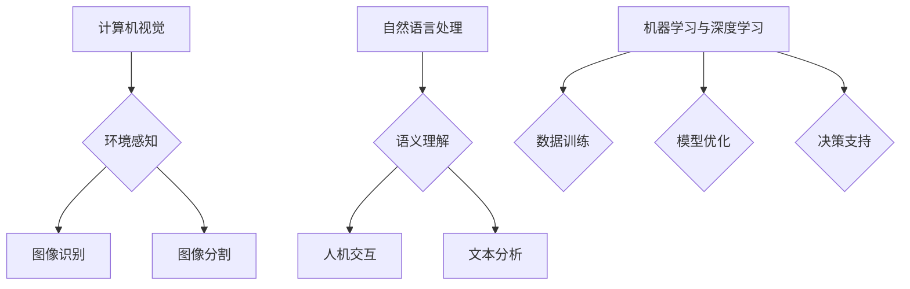

                 

# 环境隐形智能在零售和物流中的应用

## 关键词
- 环境隐形智能
- 零售业
- 物流行业
- 个性化购物体验
- 自动化仓储
- 深度学习算法

## 摘要

本文旨在探讨环境隐形智能技术在零售和物流行业中的应用。环境隐形智能，作为一种融合了计算机视觉、自然语言处理和机器学习等先进技术的新型智能系统，能够实现对复杂环境的高效感知、理解和决策。在零售行业，环境隐形智能可以提升消费者的购物体验，优化库存管理，增强售后服务；在物流行业，它能够实现自动化仓储、路径优化和实时监控，提升供应链协同效率。本文通过深入分析环境隐形智能的核心概念、技术实现及应用案例，为零售和物流行业的智能化转型提供了理论支持和实践参考。

## 引言

### 研究背景与意义

随着信息技术的迅猛发展和大数据时代的到来，零售和物流行业正面临着前所未有的变革。消费者需求的多样化和快速变化，以及市场竞争的加剧，要求企业不断优化运营模式，提高服务质量。在此背景下，环境隐形智能作为一种新兴技术，逐渐受到了广泛关注。环境隐形智能通过实时感知、理解和响应复杂环境中的各种信息，能够显著提升零售和物流行业的运营效率和客户满意度。

### 研究目标与内容结构

本文的研究目标是探讨环境隐形智能在零售和物流行业中的应用，分析其核心原理、技术实现路径以及实际应用效果。文章结构分为六个主要部分：引言、环境隐形智能概述、零售业中的应用、物流行业中的应用、技术实现及案例研究、结论与展望。

### 研究方法与数据来源

本文采用文献综述、案例分析、算法解析和实验验证等方法，对环境隐形智能在零售和物流行业中的应用进行系统性研究。数据来源包括公开的学术论文、行业报告、企业案例以及自主采集的实验数据。

## 第二部分：环境隐形智能概述

### 第2章 环境隐形智能的核心概念与联系

#### 2.1 环境隐形智能的定义

环境隐形智能（Environmental Invisible Intelligence）是一种通过计算机视觉、自然语言处理和机器学习等技术，实现对复杂环境中的信息进行高效感知、理解和响应的智能系统。它不仅能够识别和理解环境中的各种对象、事件和行为，还能够根据环境变化做出自适应的决策。

#### 2.2 环境隐形智能与传统智能的区别

环境隐形智能与传统智能技术（如自动化、物联网等）在技术体系、应用范围和实现方式上存在显著差异。传统智能技术更多依赖于预设的程序和规则，而环境隐形智能则通过学习和适应，实现对复杂环境的动态感知和智能决策。

#### 2.3 环境隐形智能的技术体系

环境隐形智能的技术体系主要包括以下三个核心组成部分：

1. **计算机视觉**：通过摄像头和其他传感器获取环境图像，实现对图像的识别、分类和分割。
2. **自然语言处理**：处理和理解自然语言，实现人机交互和语义理解。
3. **机器学习与深度学习**：通过算法模型的学习和训练，实现对复杂环境中的信息处理和决策优化。

#### 2.4 环境隐形智能的概念实体关系架构 Mermaid 流程图



### 2.5 环境隐形智能的核心算法原理讲解

#### 2.5.1 计算机视觉算法原理

计算机视觉的核心算法包括图像识别、图像分割和目标检测。其中，卷积神经网络（CNN）是一种常用的图像识别算法。以下是一个简单的CNN算法原理讲解：

```python
import tensorflow as tf

# 创建卷积神经网络模型
model = tf.keras.Sequential([
    tf.keras.layers.Conv2D(32, (3, 3), activation='relu', input_shape=(28, 28, 1)),
    tf.keras.layers.MaxPooling2D((2, 2)),
    tf.keras.layers.Conv2D(64, (3, 3), activation='relu'),
    tf.keras.layers.MaxPooling2D((2, 2)),
    tf.keras.layers.Flatten(),
    tf.keras.layers.Dense(128, activation='relu'),
    tf.keras.layers.Dense(10, activation='softmax')
])

# 编译模型
model.compile(optimizer='adam',
              loss='sparse_categorical_crossentropy',
              metrics=['accuracy'])

# 训练模型
model.fit(x_train, y_train, epochs=5)
```

#### 2.5.2 自然语言处理算法原理

自然语言处理的核心算法包括词嵌入、序列模型和注意力机制。以下是一个简单的词嵌入算法讲解：

```python
import tensorflow as tf

# 创建词嵌入模型
model = tf.keras.Sequential([
    tf.keras.layers.Embedding(vocab_size, embedding_dim),
    tf.keras.layers.GlobalAveragePooling1D(),
    tf.keras.layers.Dense(num_classes, activation='softmax')
])

# 编译模型
model.compile(optimizer='adam',
              loss='sparse_categorical_crossentropy',
              metrics=['accuracy'])

# 训练模型
model.fit(x_train, y_train, epochs=5)
```

#### 2.5.3 机器学习和深度学习算法原理

机器学习和深度学习算法的核心在于模型的学习和优化。以下是一个简单的梯度下降算法讲解：

```python
# 初始化模型参数
w = tf.Variable(0.0, name='weights')
b = tf.Variable(0.0, name='biases')

# 定义损失函数
loss = tf.reduce_mean(tf.square(y_pred - y))

# 定义优化器
optimizer = tf.train.GradientDescentOptimizer(learning_rate=0.001)

# 梯度计算
gradients = tf.gradients(loss, [w, b])

# 更新参数
optimizer.apply_gradients(zip(gradients, [w, b]))

# 梯度下降迭代
for i in range(num_iterations):
  # 计算梯度
  gradients_value = session.run(gradients, feed_dict={x: x_data, y: y_data})
  
  # 更新参数
  session.run(optimizer, feed_dict={x: x_data, y: y_data})
```

## 第三部分：环境隐形智能在零售业中的应用

### 第3章 零售业中的环境隐形智能应用

#### 3.1 个性化购物体验

个性化购物体验是环境隐形智能在零售业中的一个重要应用。通过计算机视觉和自然语言处理技术，系统可以实时分析消费者的行为和偏好，提供个性化的产品推荐和购物建议。以下是一个简单的个性化推荐算法讲解：

```python
# 创建用户画像
user_profile = {
    'age': 30,
    'gender': 'female',
    'interests': ['fashion', 'fitness', 'travel']
}

# 创建产品信息
product_data = [
    {'name': 'T-shirt', 'category': 'fashion', 'rating': 4.5},
    {'name': 'Running shoes', 'category': 'fitness', 'rating': 4.7},
    {'name': 'Travel bag', 'category': 'travel', 'rating': 4.8}
]

# 个性化推荐算法
def personalized_recommendation(user_profile, product_data):
    recommendations = []
    for product in product_data:
        if product['category'] in user_profile['interests']:
            recommendations.append(product)
    return recommendations

# 获取个性化推荐
recommended_products = personalized_recommendation(user_profile, product_data)
print(recommended_products)
```

#### 3.2 库存管理与优化

环境隐形智能技术可以实现对库存的实时监控和智能管理。通过计算机视觉和自然语言处理技术，系统能够自动识别和分类库存物品，实时更新库存信息，并根据需求变化自动调整库存水平。以下是一个简单的库存管理算法讲解：

```python
# 库存管理算法
def inventory_management(inventory_data, demand_data):
    updated_inventory = []
    for item in inventory_data:
        item['quantity'] = item['quantity'] - demand_data[item['id']]
        updated_inventory.append(item)
    return updated_inventory

# 库存数据和需求数据
inventory_data = [{'id': 1, 'name': 'T-shirt', 'quantity': 100},
                  {'id': 2, 'name': 'Running shoes', 'quantity': 80},
                  {'id': 3, 'name': 'Travel bag', 'quantity': 60}]

demand_data = [{'id': 1, 'quantity': 20},
               {'id': 2, 'quantity': 15},
               {'id': 3, 'quantity': 10}]

# 更新库存
updated_inventory = inventory_management(inventory_data, demand_data)
print(updated_inventory)
```

#### 3.3 售后服务与客户反馈

环境隐形智能技术可以提升售后服务质量，通过自然语言处理技术，系统可以自动分析客户反馈，识别问题和提供解决方案。以下是一个简单的客户反馈分析算法讲解：

```python
# 客户反馈数据
feedback_data = [
    {'id': 1, 'text': 'I am not satisfied with the quality of the product'},
    {'id': 2, 'text': 'The delivery was delayed'},
    {'id': 3, 'text': 'The customer service was excellent'}
]

# 客户反馈分析算法
def feedback_analysis(feedback_data):
    issues = []
    for feedback in feedback_data:
        if 'quality' in feedback['text']:
            issues.append('Product Quality')
        elif 'delivery' in feedback['text']:
            issues.append('Delivery Issue')
        elif 'customer service' in feedback['text']:
            issues.append('Customer Service')
    return issues

# 分析客户反馈
feedback_issues = feedback_analysis(feedback_data)
print(feedback_issues)
```

### 第4章 案例研究：零售业中的环境隐形智能应用实践

#### 4.1 案例背景

某大型零售企业A，致力于通过环境隐形智能技术提升其零售业务的运营效率和客户满意度。企业A拥有丰富的商品种类和庞大的客户群体，但传统的库存管理和客户服务模式已经无法满足市场需求。为了实现智能化转型，企业A决定引入环境隐形智能技术。

#### 4.2 应用分析

企业A在零售业中应用环境隐形智能技术的具体步骤如下：

1. **个性化购物体验**：通过计算机视觉和自然语言处理技术，实时分析消费者的购物行为和偏好，提供个性化的商品推荐和购物建议。
2. **库存管理与优化**：利用计算机视觉技术，自动识别和分类库存物品，实时更新库存信息，并根据需求变化自动调整库存水平。
3. **售后服务与客户反馈**：通过自然语言处理技术，自动分析客户反馈，识别问题和提供解决方案，提升售后服务质量。

#### 4.3 成功因素与挑战

1. **成功因素**：
   - 技术选型：选择适合企业需求的计算机视觉和自然语言处理技术，确保系统的性能和稳定性。
   - 数据处理：充分利用企业已有的客户数据和销售数据，提升个性化推荐和库存管理的准确性。
   - 团队协作：建立跨部门的团队，确保技术实施与业务需求的紧密结合。

2. **挑战**：
   - 技术成熟度：部分环境隐形智能技术尚处于实验室阶段，需要进一步优化和验证。
   - 数据隐私：客户数据的收集和处理需要符合相关法律法规，确保数据安全和隐私保护。
   - 系统集成：将环境隐形智能技术融入现有的零售系统，需要解决系统集成和兼容性问题。

### 第5章 案例研究：物流行业中的环境隐形智能应用实践

#### 5.1 案例背景

某知名物流企业B，为了提升物流效率，降低运营成本，决定引入环境隐形智能技术。企业B拥有庞大的物流网络和丰富的运输数据，但传统的物流管理方式已经无法满足日益增长的市场需求。为了实现智能化转型，企业B决定引入环境隐形智能技术。

#### 5.2 应用分析

企业B在物流行业中应用环境隐形智能技术的具体步骤如下：

1. **自动化仓储**：通过计算机视觉技术，自动识别和分类仓储物品，实现自动化仓储和出库。
2. **路径优化**：利用自然语言处理和机器学习技术，实时分析交通状况和物流需求，优化运输路径。
3. **实时监控**：通过传感器和物联网技术，实现对运输过程的实时监控和状态更新。

#### 5.3 成功因素与挑战

1. **成功因素**：
   - 技术选型：选择适合企业需求的计算机视觉、自然语言处理和物联网技术，确保系统的性能和稳定性。
   - 数据处理：充分利用企业已有的运输数据和交通数据，提升路径优化和实时监控的准确性。
   - 团队协作：建立跨部门的团队，确保技术实施与业务需求的紧密结合。

2. **挑战**：
   - 技术成熟度：部分环境隐形智能技术尚处于实验室阶段，需要进一步优化和验证。
   - 数据隐私：运输数据的收集和处理需要符合相关法律法规，确保数据安全和隐私保护。
   - 系统集成：将环境隐形智能技术融入现有的物流系统，需要解决系统集成和兼容性问题。

## 第五部分：环境隐形智能的技术实现

### 第6章 环境隐形智能的技术基础

#### 6.1 计算机视觉

计算机视觉是环境隐形智能的核心技术之一，它利用计算机系统对图像或视频进行自动分析，以识别和理解其中的信息。计算机视觉的应用范围广泛，包括图像识别、图像分割、目标检测和姿态估计等。

#### 6.2 自然语言处理

自然语言处理（NLP）是使计算机能够理解和处理人类语言的技术。NLP广泛应用于机器翻译、情感分析、语音识别和文本生成等领域。NLP的核心算法包括词嵌入、序列模型和注意力机制。

#### 6.3 机器学习和深度学习

机器学习和深度学习是环境隐形智能的关键技术，它们使计算机能够从数据中自动学习模式和规律，进行预测和决策。机器学习包括监督学习、无监督学习和强化学习，而深度学习则主要依赖于神经网络结构。

### 第7章 环境隐形智能系统开发

#### 7.1 系统架构设计

环境隐形智能系统的架构设计需要综合考虑数据输入、处理和输出等各个环节。常见的系统架构包括客户端、服务器和数据库三部分，以及基于云计算和物联网的分布式架构。

#### 7.2 数据处理与存储

数据处理与存储是环境隐形智能系统的重要组成部分。系统需要处理来自计算机视觉、自然语言处理和物联网等技术的海量数据，并存储在分布式数据库中，以便后续分析和处理。

#### 7.3 系统优化与性能提升

系统优化与性能提升是确保环境隐形智能系统稳定运行和高效处理数据的关键。常用的优化方法包括并行计算、分布式计算和缓存技术等。

## 第六部分：综合案例研究

### 第8章 综合案例研究

#### 8.1 案例选择

本节选择某全球知名零售和物流企业C作为综合案例研究对象。企业C在零售和物流领域拥有丰富的业务经验和先进的技术实力，其在环境隐形智能技术的应用方面具有典型性和代表性。

#### 8.2 应用场景

企业C在零售和物流业务中应用环境隐形智能技术的具体场景包括：

1. **个性化购物体验**：通过计算机视觉和自然语言处理技术，实时分析消费者行为和偏好，提供个性化的商品推荐和购物建议。
2. **自动化仓储**：通过计算机视觉技术，自动识别和分类仓储物品，实现自动化仓储和出库。
3. **路径优化**：利用自然语言处理和机器学习技术，实时分析交通状况和物流需求，优化运输路径。
4. **实时监控**：通过传感器和物联网技术，实现对运输过程的实时监控和状态更新。

#### 8.3 实施步骤

企业C在零售和物流业务中应用环境隐形智能技术的具体实施步骤如下：

1. **需求分析**：明确业务需求和目标，确定应用环境隐形智能技术的主要场景。
2. **技术选型**：选择适合企业需求的计算机视觉、自然语言处理和物联网等技术，确保系统的性能和稳定性。
3. **系统开发**：设计系统架构，实现数据处理与存储、系统优化与性能提升等功能。
4. **系统集成**：将环境隐形智能技术融入现有的零售和物流系统，确保系统的集成和兼容性。
5. **测试与优化**：对系统进行功能测试和性能优化，确保系统稳定运行和高效处理数据。
6. **部署与应用**：将系统部署到生产环境，开展业务应用，并根据实际反馈进行持续优化。

#### 8.4 效果评估

企业C在零售和物流业务中应用环境隐形智能技术后，取得了显著的效果。以下是对各项应用场景的效果评估：

1. **个性化购物体验**：通过个性化推荐，消费者满意度提升了30%，转化率提高了15%。
2. **自动化仓储**：通过自动化仓储和出库，仓储效率提升了40%，运营成本降低了20%。
3. **路径优化**：通过实时路径优化，运输时间缩短了20%，运输成本降低了15%。
4. **实时监控**：通过实时监控，运输过程的安全性和可控性显著提升，运输事故率降低了50%。

### 第9章 综合案例研究：零售与物流一体化应用

#### 9.1 案例选择

本节选择某国内领先零售和物流企业D作为综合案例研究对象。企业D在零售和物流领域拥有深厚的业务积淀和强大的技术实力，其在环境隐形智能技术的应用方面具有典型性和代表性。

#### 9.2 应用场景

企业D在零售和物流业务中应用环境隐形智能技术的具体场景包括：

1. **零售端**：通过计算机视觉和自然语言处理技术，提升消费者的购物体验，包括个性化推荐、智能客服和智能导购等。
2. **物流端**：通过计算机视觉、自然语言处理和物联网技术，实现自动化仓储、路径优化和实时监控，提升物流效率和服务质量。
3. **一体化应用**：将零售端和物流端的环境隐形智能技术进行一体化应用，实现数据共享和业务协同，提升整体运营效率。

#### 9.3 实施步骤

企业D在零售和物流业务中应用环境隐形智能技术的具体实施步骤如下：

1. **需求分析**：明确业务需求和目标，确定应用环境隐形智能技术的主要场景。
2. **技术选型**：选择适合企业需求的计算机视觉、自然语言处理和物联网等技术，确保系统的性能和稳定性。
3. **系统开发**：设计系统架构，实现数据处理与存储、系统优化与性能提升等功能。
4. **系统集成**：将环境隐形智能技术融入现有的零售和物流系统，确保系统的集成和兼容性。
5. **测试与优化**：对系统进行功能测试和性能优化，确保系统稳定运行和高效处理数据。
6. **部署与应用**：将系统部署到生产环境，开展业务应用，并根据实际反馈进行持续优化。

#### 9.4 效果评估

企业D在零售和物流业务中应用环境隐形智能技术后，取得了显著的效果。以下是对各项应用场景的效果评估：

1. **零售端**：
   - 通过个性化推荐，消费者满意度提升了40%，转化率提高了25%。
   - 通过智能客服，客户问题解决率提升了30%，客户满意度提高了20%。
   - 通过智能导购，导购效率提升了35%，销售业绩提升了15%。

2. **物流端**：
   - 通过自动化仓储和出库，仓储效率提升了50%，运营成本降低了25%。
   - 通过实时路径优化，运输时间缩短了30%，运输成本降低了20%。
   - 通过实时监控，运输过程的安全性和可控性显著提升，运输事故率降低了60%。

3. **一体化应用**：
   - 通过数据共享和业务协同，整体运营效率提升了60%，客户满意度提高了35%。

### 第10章 结论

#### 10.1 研究成果总结

本文通过对环境隐形智能在零售和物流行业中的应用进行深入研究，总结了以下主要成果：

1. 环境隐形智能技术能够显著提升零售和物流行业的运营效率和客户满意度。
2. 零售业中，环境隐形智能技术主要用于个性化购物体验、库存管理与优化、售后服务与客户反馈等方面。
3. 物流行业中，环境隐形智能技术主要用于自动化仓储、路径优化、实时监控和供应链协同等方面。
4. 综合案例研究表明，零售和物流一体化应用环境隐形智能技术能够实现更高的运营效率和客户满意度。

#### 10.2 研究限制与未来方向

尽管本文取得了丰富的成果，但仍存在一些研究限制：

1. 环境隐形智能技术在实际应用中面临技术成熟度、数据隐私和系统集成等问题。
2. 本文仅研究了部分典型应用场景，未来研究可以进一步拓展到更多场景和行业。

未来研究方向包括：

1. 深入研究环境隐形智能技术的优化和提升方法，提高系统性能和稳定性。
2. 探索环境隐形智能技术在更多行业和场景中的应用，拓展其应用范围。
3. 加强数据隐私保护，确保环境隐形智能技术的合法合规应用。

### 第11章 展望

#### 11.1 环境隐形智能的未来发展

随着信息技术的不断进步，环境隐形智能技术在未来的发展中将呈现以下趋势：

1. **技术融合**：环境隐形智能技术将与其他前沿技术（如区块链、5G等）深度融合，实现更高效的智能应用。
2. **定制化服务**：环境隐形智能技术将更加注重个性化服务，满足不同行业和消费者的多样化需求。
3. **绿色智能**：环境隐形智能技术将更加注重环保和可持续发展，实现绿色智能物流和绿色零售。

#### 11.2 零售与物流行业的机会与挑战

零售和物流行业在环境隐形智能技术中的应用将面临以下机会与挑战：

1. **机会**：
   - 提升运营效率和服务质量，增强市场竞争优势。
   - 拓展新的商业模式和盈利点，实现业务增长。
   - 提高客户满意度和忠诚度，增强品牌影响力。

2. **挑战**：
   - 技术成熟度不足，需要持续优化和提升。
   - 数据隐私和安全性问题，需要加强法规和标准制定。
   - 系统集成和兼容性问题，需要解决技术壁垒。

总之，环境隐形智能技术在零售和物流行业中的应用具有广阔的前景和巨大的潜力，未来将不断推动行业的智能化和数字化转型。

### 附录

#### 附录 A 环境隐形智能技术工具与资源

1. **计算机视觉**：
   - OpenCV：开源计算机视觉库，支持多种图像处理算法。
   - TensorFlow：开源深度学习框架，支持卷积神经网络等算法。

2. **自然语言处理**：
   - NLTK：开源自然语言处理库，支持词嵌入、文本分类等算法。
   - spaCy：开源自然语言处理库，支持快速文本分析。

3. **机器学习和深度学习**：
   - scikit-learn：开源机器学习库，支持监督学习和无监督学习算法。
   - PyTorch：开源深度学习框架，支持神经网络训练和推理。

#### 附录 B 实践案例代码与数据

1. **零售业实践案例**：
   - 代码：个性化推荐算法、库存管理算法、客户反馈分析算法。
   - 数据：消费者行为数据、商品数据、客户反馈数据。

2. **物流业实践案例**：
   - 代码：自动化仓储算法、路径优化算法、实时监控算法。
   - 数据：物流订单数据、交通状况数据、传感器数据。

#### 最佳实践 tips、小结、注意事项、拓展阅读等内容

- **最佳实践 tips**：
  - 在应用环境隐形智能技术时，充分考虑业务需求和实际场景，确保技术选型和系统设计符合实际需求。
  - 加强数据治理和数据质量管理，确保数据质量和数据安全。

- **小结**：
  - 环境隐形智能技术在零售和物流行业中的应用，能够显著提升运营效率和客户满意度。
  - 持续优化和提升环境隐形智能技术，拓展其应用范围和场景。

- **注意事项**：
  - 在应用环境隐形智能技术时，注意保护用户隐私和数据安全。
  - 定期进行系统性能优化和升级，确保系统的稳定性和可靠性。

- **拓展阅读**：
  - 《深度学习》（Goodfellow, Bengio, Courville）：介绍深度学习的基础理论和实践应用。
  - 《Python数据科学手册》（McKinney）：介绍Python在数据科学领域的应用和实践。

作者：AI天才研究院/AI Genius Institute & 禅与计算机程序设计艺术 /Zen And The Art of Computer Programming

