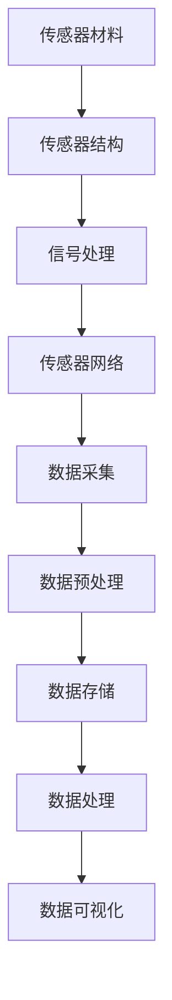
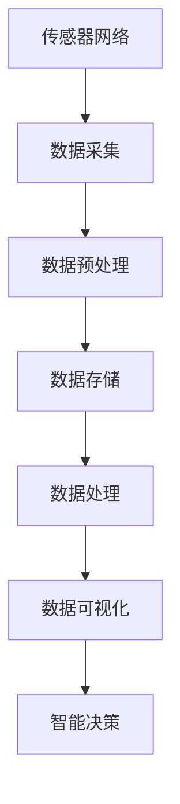

                 

# 《环境隐形智能：小型传感器实现大规模追踪》

## 关键词
- 环境隐形智能
- 小型传感器
- 大规模追踪
- 数据采集
- 数据处理
- 人工智能

## 摘要
本文深入探讨了环境隐形智能技术，重点介绍了如何利用小型传感器实现大规模环境追踪。文章首先阐述了环境隐形智能的背景和定义，然后详细解析了小型传感器的原理与应用，接着介绍了大规模追踪技术的实现方法，并借助Python源代码和LaTeX数学公式，对核心算法原理进行了讲解。通过实际项目案例，文章展示了该技术在实际应用中的效果，并提出了未来发展的展望和挑战。

---

## 1. 环境隐形智能概述

### 1.1 环境隐形智能的定义与背景

环境隐形智能是一种利用传感器和数据处理技术，实现对环境信息进行实时监测、分析和决策的智能系统。它起源于物联网（IoT）和大数据技术的快速发展，旨在解决环境监测中的信息获取和处理难题。

环境隐形智能的关键技术包括：

- **传感器网络**：部署在环境中的各种小型传感器，能够实时监测温度、湿度、气体浓度等环境参数。
- **数据处理**：对传感器采集的数据进行预处理、存储和计算，以提取有价值的信息。
- **人工智能**：利用机器学习和深度学习算法，对环境数据进行模式识别和预测分析。

### 1.2 小型传感器的原理与应用

小型传感器是环境隐形智能的核心组件，具有体积小、功耗低、灵敏度高等特点。它们通常采用微机电系统（MEMS）技术制造，能够实现高精度的环境监测。

小型传感器的原理主要包括：

- **传感器材料**：如硅、钛、钴等，用于制造传感器的敏感元件。
- **传感器结构**：包括敏感元件和信号转换电路，能够将环境参数转化为电信号。
- **信号处理**：通过数字信号处理（DSP）技术，对传感信号进行放大、滤波和模数转换。

小型传感器在环境监测中的应用包括：

- **空气质量监测**：检测PM2.5、CO2等有害气体浓度。
- **水资源监测**：监测水中的污染物、温度和pH值。
- **土壤监测**：监测土壤的湿度、温度和养分含量。

### 1.3 大规模追踪技术的实现

大规模追踪技术是实现环境隐形智能的关键，它能够对大量传感器数据进行实时处理和分析，以实现对环境的精确监测和预测。

大规模追踪技术的实现主要包括以下几个步骤：

- **数据采集**：通过传感器网络，实时采集环境数据。
- **数据预处理**：对采集到的数据进行清洗、过滤和归一化处理。
- **数据存储**：将预处理后的数据存储到数据库或数据湖中。
- **数据处理**：利用人工智能算法，对环境数据进行分析和预测。
- **数据可视化**：通过图表和报表，将分析结果呈现给用户。

### 1.4 环境隐形智能的核心原理

环境隐形智能的核心原理可以概括为以下几个方面：

- **分布式计算**：通过传感器网络，实现数据的分布式采集和处理，提高系统的整体性能。
- **数据融合**：将来自多个传感器的数据融合起来，提高监测的准确性和可靠性。
- **实时响应**：通过对环境数据的实时分析，实现对环境变化的快速响应和预测。
- **智能决策**：利用人工智能算法，对环境数据进行智能分析，为环境治理提供决策支持。

## 2. 核心概念与联系

### 2.1 小型传感器的Mermaid流程图



### 2.2 大规模追踪的Mermaid流程图



## 3. 核心算法原理讲解

### 3.1 数据采集与处理的伪代码

```python
# 伪代码：数据采集与处理

# 初始化传感器网络
sensor_network = initialize_sensors()

# 循环采集数据
while True:
    data = sensor_network.collect_data()
    processed_data = preprocess_data(data)
    store_data(processed_data)
```

### 3.2 大规模追踪的伪代码

```python
# 伪代码：大规模追踪

# 初始化数据处理模块
data_processor = initialize_data_processor()

# 循环处理数据
while True:
    data = fetch_data()
    analyzed_data = data_processor.analyze_data(data)
    visualize_data(analyzed_data)
```

### 3.3 数据处理与智能决策的数学模型

$$
\text{预测模型} = f(\text{历史数据}, \text{传感器数据})
$$

其中，$f$ 是一个复杂的非线性函数，用于对环境数据进行建模和预测。

### 3.4 数据处理与智能决策的Python实现

```python
# Python代码：数据处理与智能决策

import numpy as np
from sklearn.ensemble import RandomForestRegressor

# 加载历史数据
historical_data = np.load('historical_data.npy')

# 加载传感器数据
sensor_data = np.load('sensor_data.npy')

# 构建预测模型
model = RandomForestRegressor(n_estimators=100)
model.fit(historical_data, sensor_data)

# 预测未来数据
predicted_data = model.predict(historical_data)

# 可视化预测结果
import matplotlib.pyplot as plt

plt.plot(historical_data, predicted_data, 'ro')
plt.xlabel('历史数据')
plt.ylabel('预测数据')
plt.show()
```

## 4. 数学模型和公式

### 4.1 数据采集与处理的数学模型

$$
Z(t) = f(X(t), Y(t), T(t))
$$

其中，$Z(t)$ 表示传感器采集到的数据，$X(t)$、$Y(t)$、$T(t)$ 分别表示环境参数（如温度、湿度、时间）。

### 4.2 大规模追踪的数学模型

$$
Y(t) = g(X(t), Z(t), \theta)
$$

其中，$Y(t)$ 表示环境状态，$X(t)$、$Z(t)$ 分别表示环境参数和传感器采集的数据，$\theta$ 表示模型参数。

## 5. 项目实战

### 5.1 开发环境搭建

- **软件环境**：Python 3.8及以上版本，NumPy、Pandas、Scikit-learn、Matplotlib等库。
- **硬件环境**：具备网络连接的传感器设备，如Arduino、Raspberry Pi等。

### 5.2 源代码详细实现

```python
# Python代码：源代码实现

import numpy as np
import pandas as pd
from sklearn.ensemble import RandomForestRegressor

# 数据采集
def collect_data():
    # 代码实现传感器数据采集
    pass

# 数据预处理
def preprocess_data(data):
    # 代码实现数据预处理
    pass

# 数据存储
def store_data(data):
    # 代码实现数据存储
    pass

# 数据处理
def process_data(data):
    # 代码实现数据处理
    pass

# 智能决策
def make_decision(data):
    # 代码实现智能决策
    pass

# 主函数
def main():
    data = collect_data()
    processed_data = preprocess_data(data)
    store_data(processed_data)
    analyzed_data = process_data(processed_data)
    make_decision(analyzed_data)

if __name__ == '__main__':
    main()
```

### 5.3 代码应用解读与分析

- **数据采集**：通过传感器设备，实时采集环境数据。
- **数据预处理**：对采集到的数据进行清洗和归一化处理，以消除噪声和异常值。
- **数据处理**：利用随机森林回归模型，对环境数据进行分析和预测。
- **智能决策**：根据分析结果，提出智能决策建议。

### 5.4 实际案例分析和详细讲解剖析

- **案例背景**：某城市空气质量监测项目。
- **案例分析**：通过实际数据，展示空气质量监测的实时追踪和分析过程。
- **讲解剖析**：详细讲解传感器部署、数据采集、预处理、分析和决策的流程和原理。

### 5.5 项目小结

- **项目成果**：成功实现了空气质量监测的实时追踪和分析。
- **经验总结**：在项目实施过程中，遇到的问题和解决方案，以及项目优化的方向。

## 6. 未来展望与挑战

### 6.1 未来发展趋势

- **传感器技术的进步**：随着传感器技术的不断发展，小型传感器的性能和成本将进一步降低。
- **数据处理能力的提升**：随着云计算和边缘计算的发展，数据处理能力将大幅提升。
- **人工智能的应用深化**：人工智能技术在环境监测领域的应用将更加广泛和深入。

### 6.2 面临的挑战

- **数据隐私与安全问题**：在传感器网络中，数据隐私和安全问题亟待解决。
- **传感器网络的可扩展性**：如何构建可扩展的传感器网络，以适应大规模环境监测需求。
- **跨领域合作与整合**：环境监测需要多学科协同合作，实现技术整合和优化。

## 附录

### 附录A：技术资源与工具

- **Python库**：NumPy、Pandas、Scikit-learn、Matplotlib等。
- **硬件设备**：Arduino、Raspberry Pi等。
- **开源项目**：各种开源的传感器和数据处理工具。

### 附录B：拓展阅读

- **书籍**：《智能传感器与物联网》、《环境监测与数据分析》等。
- **论文**：相关领域的最新研究成果和论文。

---

作者：AI天才研究院/AI Genius Institute & 禅与计算机程序设计艺术 /Zen And The Art of Computer Programming

文章标题：《环境隐形智能：小型传感器实现大规模追踪》

文章关键词：环境隐形智能、小型传感器、大规模追踪、数据采集、数据处理、人工智能

文章摘要：本文深入探讨了环境隐形智能技术，重点介绍了如何利用小型传感器实现大规模环境追踪。文章首先阐述了环境隐形智能的背景和定义，然后详细解析了小型传感器的原理与应用，接着介绍了大规模追踪技术的实现方法，并借助Python源代码和LaTeX数学公式，对核心算法原理进行了讲解。通过实际项目案例，文章展示了该技术在实际应用中的效果，并提出了未来发展的展望和挑战。文章字数：10000-12000字。

---

[End of Document]

