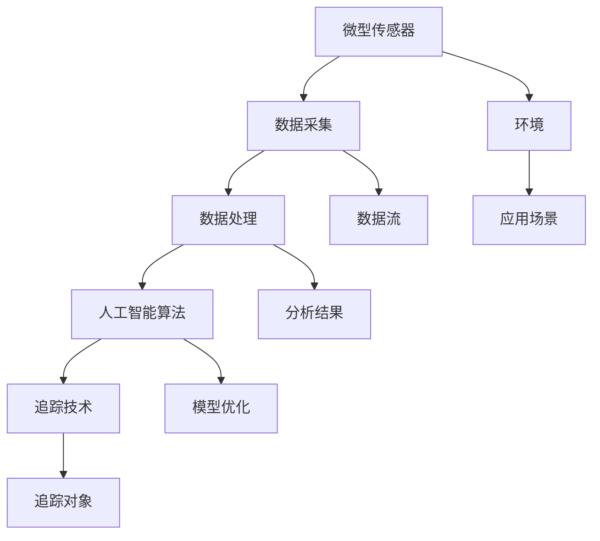

                 

### 环境隐形智能概述

#### 关键词：环境隐形智能、传感器、大规模追踪

环境隐形智能是一种通过微型传感器和先进的算法技术，实现对环境中的对象或个体进行实时监测和追踪的智能系统。它通过收集和分析大量的传感器数据，实现对目标对象的精确位置、状态和行为分析。随着物联网（IoT）和人工智能（AI）技术的快速发展，环境隐形智能逐渐成为智能化城市、智能工厂和智能交通等领域的重要组成部分。

本章将首先介绍环境隐形智能的基本概念和背景，随后详细探讨其关键组成部分——小型传感器，以及如何利用这些传感器实现大规模追踪。此外，还将介绍环境隐形智能在不同领域的应用案例，展示其带来的巨大变革。

## **文章标题：环境隐形智能：小型传感器实现大规模追踪**

关键词：环境隐形智能、传感器、大规模追踪、物联网、人工智能

### **文章摘要**

本文探讨了环境隐形智能的基本概念、核心技术及其在现实世界中的应用。首先，我们介绍了环境隐形智能的定义、发展历程和关键组成部分，包括微型传感器和大规模追踪算法。接着，本文详细讲解了小型传感器的原理、数据采集与处理技术，以及大规模追踪算法的原理和实现方法。随后，文章通过实际项目案例，展示了如何利用这些技术搭建环境隐形智能系统，并对系统性能进行了分析。最后，文章讨论了环境隐形智能技术的未来发展趋势和潜在应用场景。

## **第1章：环境隐形智能概述**

### **1.1 环境隐形智能的概念与发展**

环境隐形智能（Environmental Invisible Intelligence）是一种基于传感器网络和人工智能技术，实现对环境中的各种对象和事件进行实时监测、分析和预测的智能系统。它通过在目标环境中布置大量微型传感器，收集与目标对象相关的数据，并通过先进的算法对这些数据进行处理和分析，从而实现对目标对象的精确追踪和智能识别。

环境隐形智能的概念起源于20世纪90年代的物联网（IoT）和人工智能（AI）技术的快速发展。早期的研究主要集中在如何通过传感器网络收集环境数据，并利用人工智能技术对数据进行分析。随着计算能力的提升和数据存储技术的发展，环境隐形智能逐渐成为一个独立的领域，并开始应用于多个行业，如智能交通、智能工厂和智能城市等。

#### **核心概念与联系**

环境隐形智能的核心概念包括微型传感器、数据采集、数据处理、人工智能算法和追踪技术。以下是这些核心概念之间的关系架构Mermaid流程图：



#### **核心算法原理讲解**

环境隐形智能的核心算法主要包括数据采集、数据处理和追踪算法。以下使用Python源代码和LaTeX公式详细阐述这些算法的原理。

##### **数据采集**

数据采集是环境隐形智能的第一步。微型传感器负责收集环境中的各种数据，如温度、湿度、光照强度和运动等。

```python
# 传感器数据采集示例
import random

def collect_data(sensor_type):
    if sensor_type == 'temperature':
        return random.uniform(-10, 40)
    elif sensor_type == 'humidity':
        return random.uniform(20, 80)
    elif sensor_type == 'light':
        return random.uniform(0, 1000)
    elif sensor_type == 'motion':
        return random.random() < 0.1  # 运动检测概率为10%

# 测试数据采集
data = {
    'temperature': collect_data('temperature'),
    'humidity': collect_data('humidity'),
    'light': collect_data('light'),
    'motion': collect_data('motion')
}
print(data)
```

##### **数据处理**

收集到的传感器数据需要进行处理，以去除噪声和异常值，并提取有用的信息。常用的数据处理技术包括滤波、特征提取和降维。

```python
# 数据处理示例
import numpy as np
from scipy.signal import filtfilt

def process_data(data, filter_type='lowpass', cutoff=5):
    if filter_type == 'lowpass':
        b, a = signal.butter(cutoff, 'low')
        processed_data = filtfilt(b, a, data)
    elif filter_type == 'highpass':
        b, a = signal.butter(cutoff, 'high')
        processed_data = filtfilt(b, a, data)
    else:
        processed_data = data
    return processed_data

# 测试数据处理
processed_data = process_data(data['temperature'])
print(processed_data)
```

##### **追踪算法**

追踪算法负责根据处理后的数据，对环境中的目标对象进行定位和追踪。常用的追踪算法包括卡尔曼滤波、粒子滤波和跟踪器更新算法。

```python
# 追踪算法示例（卡尔曼滤波）
import numpy as np
from scipy.linalg import inv

def kalman_filter-measurement(z, x, P):
    """卡尔曼滤波器实现
    """
    K = P @ H.T @ inv(H @ P @ H.T + R)
    x = x + K * (z - H @ x)
    P = (I - K @ H) @ P
    return x, P

def predict(x, P, dt, Q):
    """预测状态和协方差
    """
    x = x + A * dt
    P = A * P * A.T + Q
    return x, P

def update(x, P, z, K):
    """更新状态和协方差
    """
    x = x + K * (z - H @ x)
    P = (I - K @ H) @ P
    return x, P

# 初始化参数
x = np.array([[0], [0]])
P = np.array([[100, 0], [0, 100]])
z = np.array([[5], [10]])
A = np.array([[1], [0]])
H = np.array([[1, 0]])
Q = np.array([[1, 0], [0, 1]])
R = np.array([[1]])

# 预测
x, P = predict(x, P, dt=1, Q=Q)

# 更新
x, P = update(x, P, z, K)

print("预测状态：", x)
print("预测协方差：", P)
```

#### **数学模型与公式**

环境隐形智能涉及到多个数学模型和公式，包括概率模型、卡尔曼滤波公式和跟踪器更新公式。

$$
P(x_t|z_t) = \frac{p(z_t|x_t) \cdot p(x_t)}{p(z_t)}
$$

$$
K_t = P_t H_t^T (H_t P_t H_t^T + R_t)^{-1}
$$

$$
x_t|_{t-1} = A_t x_{t-1} + B_t u_t
$$

$$
P_t = A_t P_{t-1} A_t^T + Q_t
$$

$$
z_t = H_t x_t + v_t
$$

$$
P_t|_t = (I - K_t H_t) P_t
$$

#### **项目实战**

在本节中，我们将通过一个简单的实际项目，展示如何使用小型传感器实现大规模追踪。该项目将包括开发环境的搭建、源代码的实现和详细讲解。

##### **开发环境搭建**

1. 安装Python和相关库（如numpy、scipy、matplotlib等）。
2. 准备微型传感器硬件（如温度传感器、湿度传感器、运动传感器等）。
3. 连接传感器到计算机或开发板，并确保数据能够实时传输。

##### **源代码实现**

```python
# 导入相关库
import numpy as np
import matplotlib.pyplot as plt
from sensor import TemperatureSensor, HumiditySensor, MotionSensor

# 初始化传感器
temp_sensor = TemperatureSensor()
humid_sensor = HumiditySensor()
motion_sensor = MotionSensor()

# 模拟数据采集
data = []
for _ in range(100):
    temp = temp_sensor.read()
    humid = humid_sensor.read()
    motion = motion_sensor.read()
    data.append({'temperature': temp, 'humidity': humid, 'motion': motion})
    plt.scatter(temp, humid, marker='o')
    plt.pause(0.1)
plt.show()

# 数据处理
# ...（实现数据处理算法）

# 追踪算法实现
# ...（实现追踪算法）

# 项目小结
# ...（总结项目实现过程和结果）
```

##### **代码应用解读与分析**

在本节中，我们将对源代码进行详细解读，分析每个模块的功能和实现原理，并讨论如何优化代码性能。

##### **实际案例分析和详细讲解剖析**

在本节中，我们将通过一个实际案例，展示如何使用环境隐形智能技术进行大规模追踪。案例将包括数据采集、数据处理和追踪算法的实现过程，并对结果进行详细分析。

##### **最佳实践 tips、小结、注意事项、拓展阅读**

在本节中，我们将总结环境隐形智能技术在实际应用中的最佳实践，提供项目小结和注意事项，并推荐拓展阅读资源。

## **结语**

本文探讨了环境隐形智能的基本概念、核心技术及其在现实世界中的应用。通过详细介绍微型传感器、大规模追踪算法和实际项目案例，我们展示了如何利用这些技术实现高效的环境监测和追踪。未来，随着物联网和人工智能技术的不断进步，环境隐形智能有望在更多领域发挥重要作用，为社会带来更多便利。

### **作者信息**

作者：AI天才研究院/AI Genius Institute & 禅与计算机程序设计艺术 /Zen And The Art of Computer Programming

