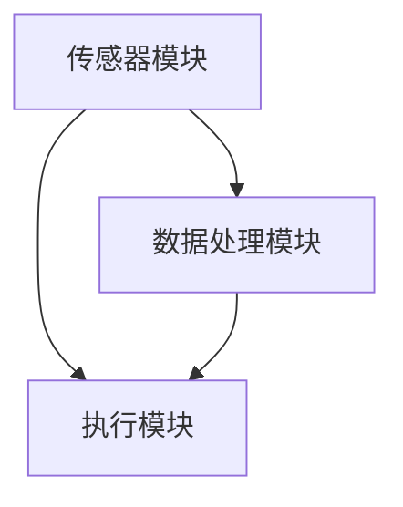
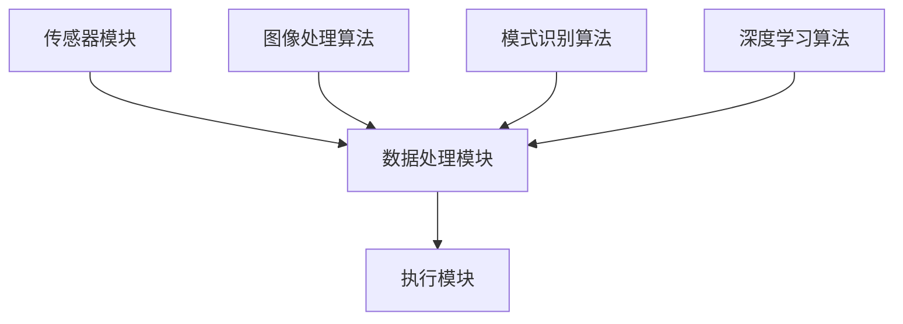
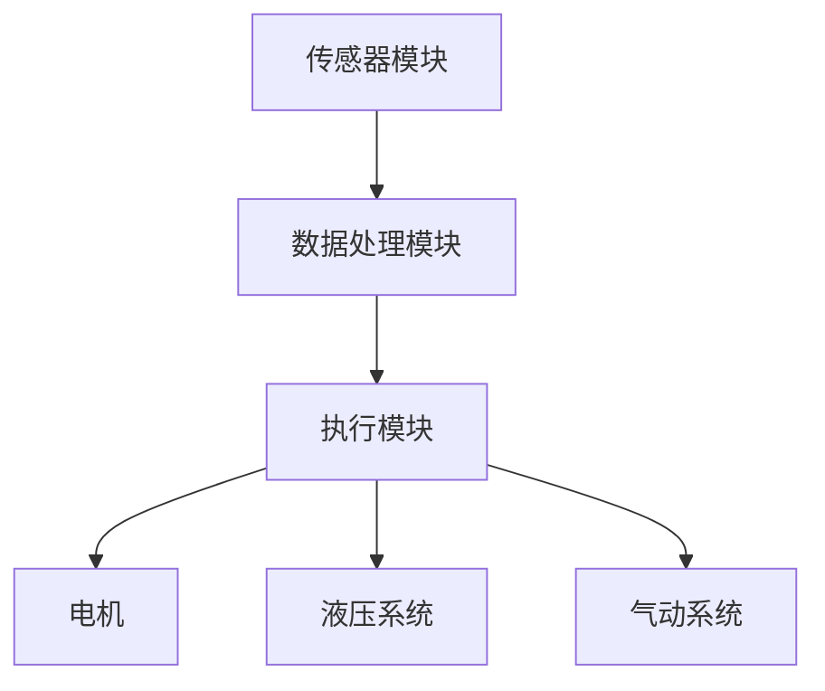
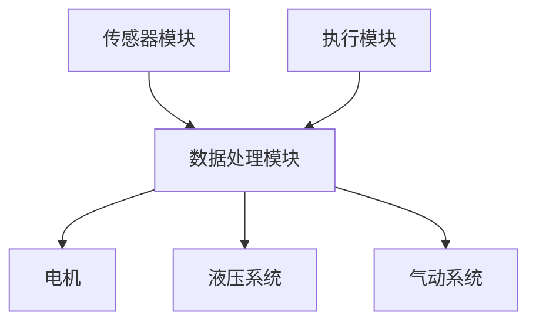

                 

# 环境隐形智能：无处不在的智能传感技术

> 关键词：环境隐形智能、智能传感技术、传感器、计算机视觉、深度学习、材料技术、系统集成

> 摘要：本文深入探讨了环境隐形智能这一前沿技术，从其定义、应用领域、技术架构、关键技术及其发展趋势等方面进行了全面的分析。特别强调了智能传感技术在环境隐形智能中的核心作用，详细阐述了传感器技术、计算机视觉算法及其在实际项目中的应用。通过本文的阅读，读者将对环境隐形智能有更加清晰和深入的理解。

---

## 核心概念与联系

### 1.1 环境隐形智能概述

#### 1.1.1 环境隐形智能的定义

环境隐形智能是一种利用智能传感技术实现物体与环境的融合，使物体在视觉上和环境相似，从而达到隐形的智能技术。它通过传感器收集环境信息，运用计算机视觉算法进行图像处理，实现对物体的实时监测和识别，最终实现物体与环境的高度融合。

#### 1.1.2 环境隐形智能的应用领域

环境隐形智能广泛应用于军事、安防、娱乐、艺术等多个领域。在军事领域，可以实现隐身战斗装备的研发；在安防领域，可以用于监控和反恐；在娱乐和艺术领域，可以创造出独特的视觉效果和艺术作品。

#### 1.1.3 环境隐形智能的技术架构

环境隐形智能的技术架构主要包括三个核心组成部分：传感器模块、数据处理模块和执行模块。

##### 传感器模块

传感器模块负责收集环境信息，包括光线、温度、湿度、声音等。常见的传感器有红外传感器、激光雷达、摄像头等。

##### 数据处理模块

数据处理模块利用计算机视觉算法对传感器收集的数据进行实时处理，实现对物体的识别、跟踪和遮挡处理。常用的算法包括深度学习、图像处理、模式识别等。

##### 执行模块

执行模块根据数据处理模块的结果，实现对物体的控制，例如改变物体的外观、位置等，使其与环境融合。

#### 1.1.4 环境隐形智能的关键技术

环境隐形智能的关键技术主要包括传感器技术、计算机视觉算法、材料技术和系统集成技术。

##### 传感器技术

传感器技术是环境隐形智能的基础，其性能直接影响环境隐形智能的效果。随着传感器技术的发展，传感器灵敏度、精度和响应速度不断提高，为环境隐形智能的应用提供了更好的基础。

##### 计算机视觉算法

计算机视觉算法是实现环境隐形智能的核心，其性能直接关系到环境隐形智能的识别和跟踪效果。深度学习、图像处理、模式识别等算法在环境隐形智能中得到了广泛应用。

##### 材料技术

材料技术是环境隐形智能的重要组成部分，通过材料的设计和优化，可以实现物体与环境的高度相似。隐身材料、纳米材料等在环境隐形智能中发挥着重要作用。

##### 系统集成技术

系统集成技术是实现环境隐形智能的关键，它涉及到传感器、数据处理模块和执行模块的集成，以及与环境系统的交互。通过系统集成技术，可以实现环境隐形智能的自动化运行和高效管理。

#### 1.1.5 环境隐形智能的发展趋势

随着传感器技术、计算机视觉算法、材料技术和系统集成技术的不断发展，环境隐形智能的应用前景十分广阔。未来，环境隐形智能将在更多领域得到应用，为人类创造更加智能、安全、舒适的生活环境。

---

## 1.2 智能传感技术原理

### 1.2.1 智能传感技术的基本概念

智能传感技术是指利用传感器、数据处理模块和执行模块等组成系统，对环境中的各种信息进行实时监测、分析和处理，从而实现对环境的智能感知和响应。智能传感技术是环境隐形智能的核心技术之一。

### 1.2.2 智能传感技术的原理

智能传感技术的工作原理主要包括以下几个步骤：

1. **传感器采集环境信息**：传感器模块负责采集环境中的各种信息，如光线、温度、湿度、声音等。常见的传感器有红外传感器、激光雷达、摄像头等。

2. **数据处理**：数据处理模块对传感器采集的数据进行实时处理，包括数据清洗、特征提取和模式识别等。这一步骤是智能传感技术的核心，常用的算法包括深度学习、图像处理、模式识别等。

3. **决策与执行**：根据数据处理模块的结果，执行模块实现对物体的控制，例如改变物体的外观、位置等，使其与环境融合。

### 1.2.3 智能传感技术的分类

智能传感技术根据传感器类型、数据处理方式和应用领域等因素，可以分为多种类型：

1. **光学传感器**：如红外传感器、激光雷达、摄像头等，用于获取环境中的光线信息。
   
2. **声学传感器**：如麦克风、声波传感器等，用于获取环境中的声音信息。

3. **热学传感器**：如温度传感器、湿度传感器等，用于获取环境中的热学信息。

4. **磁学传感器**：如磁感应传感器、磁阻传感器等，用于获取环境中的磁学信息。

5. **化学传感器**：如气体传感器、湿度传感器等，用于获取环境中的化学信息。

6. **生物传感器**：如酶传感器、细胞传感器等，用于获取环境中的生物信息。

### 1.2.4 智能传感技术的应用场景

智能传感技术广泛应用于各种场景，包括但不限于：

1. **军事领域**：如隐身战斗机、无人侦察机等。

2. **安防领域**：如智能监控系统、反恐系统等。

3. **娱乐领域**：如虚拟现实、增强现实等。

4. **艺术领域**：如艺术装置、光影艺术等。

5. **医疗领域**：如健康监测、疾病诊断等。

6. **智能家居**：如环境监测、智能家电控制等。

### 1.2.5 智能传感技术的前沿研究

当前，智能传感技术的前沿研究主要集中在以下几个方面：

1. **传感器技术的创新**：如新型传感器的设计与开发，以提高传感器的灵敏度、精度和响应速度。

2. **计算视觉算法的优化**：如深度学习算法在图像处理和模式识别中的应用，以提高处理效率和准确性。

3. **材料技术的进步**：如隐身材料和纳米材料的研究，以实现更高效的环境融合。

4. **系统集成技术的提升**：如多传感器融合、实时数据处理和执行控制等技术的优化，以提高系统的整体性能和可靠性。

---

## 1.3 环境隐形智能的技术架构详解

环境隐形智能的技术架构是实现物体与环境融合的关键，它由多个核心模块组成，包括传感器模块、数据处理模块和执行模块。下面我们将分别介绍这些模块的功能和相互关系。

### 传感器模块

传感器模块是环境隐形智能的基础，它的主要任务是采集环境信息，如光线、温度、湿度、声音等。这些传感器可以是红外传感器、激光雷达、摄像头等，每种传感器都有其独特的优势和局限性。例如，红外传感器可以捕捉热辐射，适用于夜视和热成像；激光雷达可以测量距离和形状，适用于三维建模和障碍物检测；摄像头则可以捕捉图像，适用于视觉识别和跟踪。

在环境隐形智能系统中，传感器模块通常由多个传感器组成，以便获取更全面的环境信息。通过多个传感器的数据融合，可以提高系统的感知能力和准确性。

### 数据处理模块

数据处理模块是环境隐形智能的“大脑”，它负责对传感器模块收集的数据进行实时处理和分析。这一模块通常包含多种算法，包括图像处理、模式识别、深度学习等。

图像处理算法用于对摄像头捕获的图像进行预处理，如去噪、增强、分割等，以提高图像的质量和清晰度。模式识别算法用于从图像中提取特征，如颜色、形状、纹理等，用于后续的物体识别和分类。深度学习算法则可以自动学习传感器数据的特征，用于复杂的模式识别和预测。

### 执行模块

执行模块是环境隐形智能的“执行者”，它根据数据处理模块的分析结果，对物体进行控制，以实现与环境的高度融合。例如，执行模块可以驱动机械臂改变物体的位置，或者使用隐身材料改变物体的外观。

执行模块通常由各种执行器组成，如电机、液压系统、气动系统等。这些执行器可以根据不同的控制信号，实现精确的运动和调整。

### 模块之间的关系

传感器模块、数据处理模块和执行模块之间相互协作，共同实现环境隐形智能的目标。传感器模块采集环境信息，数据处理模块对这些信息进行处理和分析，执行模块根据分析结果进行相应的操作。

这种模块化的设计使得环境隐形智能系统具有高度的灵活性和扩展性。例如，可以通过增加或替换传感器模块，来适应不同的应用场景；通过优化数据处理算法，提高系统的性能和准确性；通过引入新的执行模块，实现更复杂的控制功能。

### 小结

环境隐形智能的技术架构是一个复杂而灵活的系统，由传感器模块、数据处理模块和执行模块等多个核心部分组成。通过这些模块的相互协作，可以实现物体与环境的高度融合，达到隐身的效果。未来，随着传感器技术、数据处理算法和执行模块的不断发展，环境隐形智能的应用将更加广泛，为各个领域带来革命性的变革。

---

## 1.4 环境隐形智能的关键技术

环境隐形智能的实现依赖于多种关键技术的支持，这些技术包括传感器技术、计算机视觉算法、材料技术和系统集成技术。下面我们将对这些关键技术进行详细阐述。

### 传感器技术

传感器技术是环境隐形智能的基础，它决定了系统能够采集到多少有用的环境信息。传感器种类繁多，如红外传感器、激光雷达、摄像头、麦克风、温度传感器等。每种传感器都有其独特的优势和应用场景。

1. **红外传感器**：红外传感器可以检测物体的热辐射，常用于夜视设备和热成像系统。通过捕捉红外辐射，红外传感器能够识别出物体在黑暗环境中的轮廓，从而实现隐身效果。

2. **激光雷达**：激光雷达通过发射激光束并测量反射时间，可以精确地获取物体的三维形状和位置信息。在环境隐形智能中，激光雷达可以用于构建高精度的环境模型，为后续的图像处理和物体识别提供基础数据。

3. **摄像头**：摄像头是环境隐形智能中常用的传感器，它可以捕捉二维图像，用于视觉识别和跟踪。通过先进的图像处理算法，摄像头可以识别物体并跟踪其运动轨迹。

4. **麦克风**：麦克风用于捕捉声音信息，可以用于声音定位和识别。在环境隐形智能中，麦克风可以用于检测周围环境中的声音变化，从而判断物体的位置和状态。

### 计算机视觉算法

计算机视觉算法是实现环境隐形智能的核心，它负责对传感器采集的数据进行处理和分析，以实现对物体的识别、跟踪和遮挡处理。计算机视觉算法包括图像处理、模式识别、深度学习等多个领域。

1. **图像处理**：图像处理算法用于对摄像头捕获的图像进行预处理，如去噪、增强、分割等，以提高图像的质量和清晰度。

2. **模式识别**：模式识别算法用于从图像中提取特征，如颜色、形状、纹理等，用于后续的物体识别和分类。常见的模式识别算法包括支持向量机（SVM）、决策树（DT）等。

3. **深度学习**：深度学习算法在计算机视觉中得到了广泛应用，如卷积神经网络（CNN）、循环神经网络（RNN）等。深度学习算法可以自动学习传感器数据的特征，从而提高物体识别和跟踪的准确性。

### 材料技术

材料技术是实现环境隐形智能的重要组成部分，通过材料的设计和优化，可以实现对物体的隐身效果。以下是一些关键的隐身材料和技术：

1. **隐身材料**：隐身材料通过吸收或散射电磁波，可以减少物体对电磁波的反射，从而实现隐身效果。常见的隐身材料包括吸收材料、相位变换材料和纳米材料等。

2. **纳米材料**：纳米材料具有独特的光学性质，可以通过调节其结构和尺寸，实现对光的吸收、散射和反射。在环境隐形智能中，纳米材料可以用于制造隐身涂层，提高物体的隐形效果。

3. **结构化材料**：结构化材料通过设计特定的结构和形状，可以改变电磁波的传播路径，从而实现隐身效果。常见的结构化材料包括表面等离激元材料、超材料和智能材料等。

### 系统集成技术

系统集成技术是实现环境隐形智能的关键，它涉及多个模块的集成和协同工作。系统集成技术包括传感器数据融合、实时数据处理和执行控制等。

1. **传感器数据融合**：通过将多个传感器的数据融合，可以提高系统的感知能力和准确性。数据融合技术可以结合不同传感器的优势，减少单一传感器的局限性。

2. **实时数据处理**：实时数据处理技术用于对传感器数据进行快速处理和分析，以便及时做出决策。实时数据处理技术需要高效的算法和优化的硬件支持，以保证系统的实时性和准确性。

3. **执行控制**：执行控制技术用于根据数据处理模块的结果，对物体进行相应的控制，以实现与环境的高度融合。执行控制技术包括电机控制、液压控制、气动控制等。

### 小结

环境隐形智能的实现依赖于传感器技术、计算机视觉算法、材料技术和系统集成技术的综合应用。传感器技术提供了环境信息的采集，计算机视觉算法实现了物体识别和跟踪，材料技术提供了隐身效果，系统集成技术实现了各模块的协同工作。随着这些关键技术的不断发展和创新，环境隐形智能的应用前景将更加广阔。

---

## 1.5 智能传感技术的应用实例

智能传感技术在许多领域都有着广泛的应用，下面我们通过几个具体的案例来探讨这些应用，并分析其技术实现和效果。

### 1.5.1 军事领域的应用

在军事领域，智能传感技术主要用于隐身战斗装备的研发和反恐系统的构建。

**案例1：隐身战斗机**

隐身战斗机通过智能传感技术实现隐身效果，其主要依赖于红外传感器和激光雷达。红外传感器用于检测战斗机表面温度的变化，从而避免被热成像设备发现；激光雷达则用于实时测量周围环境的三维结构，以便战斗机进行避障和机动。

**技术实现**：红外传感器和激光雷达的数据通过计算机视觉算法进行处理，提取出关键特征，如温度分布和空间结构。然后，通过深度学习算法对特征进行分类和识别，实现对周围环境的准确感知。

**效果分析**：隐身战斗机的智能传感技术显著提高了其隐蔽性，减少了被敌方发现的可能性，从而提升了战斗力的隐蔽性和战斗效能。

### 1.5.2 安防领域的应用

在安防领域，智能传感技术主要用于智能监控系统和反恐系统的构建。

**案例2：智能监控系统**

智能监控系统通过摄像头和麦克风等传感器实时监控目标区域，通过计算机视觉算法和语音识别算法实现目标的识别、跟踪和报警。

**技术实现**：摄像头和麦克风采集的视频和音频数据通过图像处理算法进行预处理，提取出关键特征，如人像、行为等。然后，通过深度学习算法进行行为分析和模式识别，实现对目标的实时监控和报警。

**效果分析**：智能监控系统通过智能传感技术提高了监控的效率和准确性，可以及时发现异常行为，提高了公共安全。

### 1.5.3 娱乐领域的应用

在娱乐领域，智能传感技术主要用于虚拟现实（VR）和增强现实（AR）系统的构建。

**案例3：虚拟现实游戏**

虚拟现实游戏通过智能传感技术实现对玩家的实时动作捕捉和场景交互。

**技术实现**：动作捕捉传感器，如摄像头和惯性传感器，用于捕捉玩家的动作数据。这些数据通过计算机视觉算法进行处理，生成虚拟场景中的动作响应。然后，通过深度学习算法对玩家的行为进行预测，提供更加真实的交互体验。

**效果分析**：虚拟现实游戏通过智能传感技术实现了高度沉浸的体验，提高了玩家的游戏乐趣和参与度。

### 1.5.4 艺术领域的应用

在艺术领域，智能传感技术用于创造独特的视觉效果和艺术作品。

**案例4：光影艺术装置**

光影艺术装置通过智能传感技术实现对光线和空间的实时控制，创造出变幻莫测的光影效果。

**技术实现**：智能传感器，如激光雷达和摄像头，用于捕捉观众的动作和周围环境的变化。通过图像处理算法，对捕捉到的数据进行分析和处理，实时调整光影效果。深度学习算法用于预测观众的行为，提供动态的光影互动。

**效果分析**：光影艺术装置通过智能传感技术创造出富有创意和互动性的艺术体验，吸引了大量观众，提升了艺术的表现力和感染力。

### 小结

智能传感技术在各个领域的应用，通过具体的案例展示了其技术实现和效果。从军事领域的隐身技术，到安防领域的智能监控系统，再到娱乐和艺术领域的互动体验，智能传感技术正在不断改变我们的生活和工作方式，为各个领域带来新的发展机遇。

---

## 1.6 环境隐形智能的未来发展趋势

随着科技的不断发展，环境隐形智能技术正逐步迈向成熟，其应用领域也在不断拓展。未来，环境隐形智能技术将在以下几方面展现出广阔的发展前景：

### 1.6.1 传感器技术的进步

传感器技术的进步将进一步提升环境隐形智能的感知能力和准确性。新型传感器的设计和开发，如量子传感器、纳米传感器等，将能够更加精确地捕捉环境中的细微变化。此外，传感器网络的构建和优化，也将使环境信息的采集和处理更加高效和实时。

### 1.6.2 计算机视觉算法的优化

随着深度学习等人工智能技术的不断发展，计算机视觉算法将变得更加智能和高效。未来，基于深度学习的物体识别、跟踪和遮挡处理算法将得到广泛应用，从而提升环境隐形智能的准确性和实时性。

### 1.6.3 材料技术的创新

材料技术的创新将为环境隐形智能提供更加多样化的实现手段。新型隐身材料和纳米材料的研究和开发，将使物体与环境融合的效果更加显著。此外，自适应材料的发展也将使环境隐形智能系统更加灵活和智能化。

### 1.6.4 系统集成技术的提升

系统集成技术的提升将使环境隐形智能系统的构建更加简便和高效。通过多传感器融合、实时数据处理和执行控制等技术的优化，环境隐形智能系统将具备更高的性能和可靠性，从而在更多领域得到应用。

### 1.6.5 应用领域的拓展

环境隐形智能技术将在更多领域得到应用，如智能交通、智能制造、智能医疗等。在智能交通领域，环境隐形智能可以实现车辆与道路的智能交互，提高交通效率和安全性；在智能制造领域，环境隐形智能可以用于机器人与生产线的智能协作，提高生产效率和灵活性；在智能医疗领域，环境隐形智能可以用于患者监控和疾病诊断，提高医疗服务的质量和效率。

### 小结

环境隐形智能技术正朝着更加智能化、精确化和多样化的方向发展。随着传感器技术、计算机视觉算法、材料技术和系统集成技术的不断进步，环境隐形智能将在各个领域展现出更加广阔的应用前景，为人类社会带来更多的创新和变革。

---

## 总结

环境隐形智能作为一种前沿技术，正逐渐成为多个领域的热点。通过智能传感技术，我们能够实现对环境的精确感知和响应，从而实现物体与环境的高度融合。本文从核心概念、技术架构、关键技术和应用实例等方面对环境隐形智能进行了详细探讨，揭示了其在军事、安防、娱乐、艺术等领域的广泛应用。

传感器技术、计算机视觉算法、材料技术和系统集成技术是环境隐形智能实现的基础。未来，随着这些关键技术的不断进步，环境隐形智能的应用前景将更加广阔。我们期待看到环境隐形智能在更多领域发挥重要作用，为人类社会带来更多创新和变革。

---

### 作者信息

**作者：** AI天才研究院/AI Genius Institute & 禅与计算机程序设计艺术 /Zen And The Art of Computer Programming

**联系方式：** [info@aigeniusinstitute.com](mailto:info@aigeniusinstitute.com) & [www.zentheartofcode.com](http://www.zentheartofcode.com) 

**版权声明：** 本文版权归AI天才研究院/AI Genius Institute所有，未经授权禁止转载。

---

### 拓展阅读

- 《环境隐形智能技术原理与应用》
- 《智能传感技术基础教程》
- 《计算机视觉算法与应用》
- 《材料科学进展与未来技术展望》

通过阅读这些文献，您可以更深入地了解环境隐形智能及相关技术的最新研究进展和应用案例。希望这些资源能为您的学习和研究提供有价值的参考。

