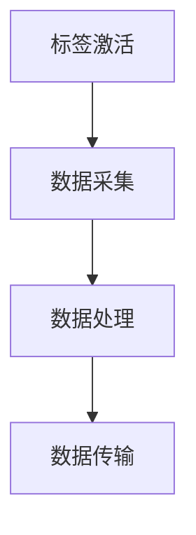
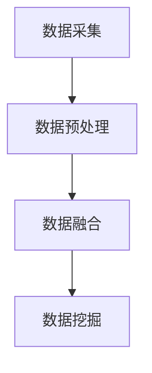

                 

# 《环境隐形智能：智能标签和传感器的未来应用》

## 关键词
环境隐形智能，智能标签，传感器，物联网，人工智能，未来应用

## 摘要

本文深入探讨了环境隐形智能的概念，重点分析了智能标签和传感器在这一领域的未来应用。通过梳理智能标签和传感器的基础技术，解析其在不同应用场景中的实际案例，本文不仅揭示了这些技术的基本原理，还展望了其未来的发展趋势。同时，文章针对面临的挑战提出了可能的解决方案，为读者提供了全面的技术视角和实用的实践指南。

---

## 引言

### 1.1 环境隐形智能的定义和背景

环境隐形智能是一种利用传感器和智能标签技术，实现环境数据的感知、处理和响应的智能化系统。它通过收集环境中的各种信息，如温度、湿度、光线、声音等，实时分析和处理这些数据，从而实现对环境的智能控制和优化。这种技术的核心在于将传统的物理环境和数字技术相结合，通过智能化的方式提升环境的管理效率。

环境隐形智能的发展可以追溯到20世纪末期，随着传感器技术的不断进步和物联网概念的兴起，环境隐形智能逐渐成为研究热点。其背景主要在于以下几个方面：

1. **物联网的兴起**：物联网（Internet of Things, IoT）通过将各种物品连接到互联网上，使得数据收集和分析成为可能。这为环境隐形智能的发展提供了基础。
2. **智能标签的普及**：智能标签，如RFID（射频识别）、NFC（近场通信）等，能够实现对物品的实时追踪和监控，进一步推动了环境隐形智能的应用。
3. **大数据和人工智能**：大数据技术为环境隐形智能提供了强大的数据支持，而人工智能技术则使得环境数据的处理和分析更加高效和准确。

### 1.2 智能标签和传感器在环境隐形智能中的应用

智能标签和传感器是环境隐形智能系统中的核心组件，它们的作用分别如下：

- **智能标签**：智能标签通常被用于物品的标识和追踪。通过嵌入RFID、NFC等标签，物品可以在供应链中实现实时监控和追踪。例如，在物流和仓储领域，智能标签可以帮助实现货物的自动化管理，提高物流效率。
- **传感器**：传感器则用于感知环境中的各种物理量，如温度、湿度、光线、声音等。这些数据可以用来控制环境，实现智能化管理。例如，在智能家居中，传感器可以监测室内温度和湿度，自动调节空调和加湿器，以保持舒适的生活环境。

## 第2章 智能标签技术基础

### 2.1 智能标签概述

智能标签是一种集成了传感器、微处理器和通信模块的微型电子设备，它能够实现对物品的实时追踪和监控。智能标签通常由以下几个主要部分组成：

- **传感器**：用于感知物品的状态，如位置、温度、湿度等。
- **微处理器**：用于处理传感器收集的数据，并执行相应的操作。
- **通信模块**：用于将处理后的数据传输到云端或其他设备。

智能标签的工作原理可以概括为以下几个步骤：

1. **数据收集**：传感器收集物品的状态数据。
2. **数据处理**：微处理器对收集到的数据进行分析和处理。
3. **数据传输**：通信模块将处理后的数据传输到云端或其他设备。

### 2.2 智能标签的分类

智能标签可以根据其工作原理、应用场景等不同维度进行分类，以下是几种常见的分类方式：

- **按工作原理分类**：根据传感器类型，智能标签可以分为RFID标签、NFC标签、蓝牙标签等。
  - **RFID标签**：通过射频信号进行数据传输，适用于远距离物品追踪。
  - **NFC标签**：通过近场通信进行数据传输，适用于近距离数据交换。
  - **蓝牙标签**：通过蓝牙进行数据传输，适用于短距离数据传输。

- **按应用场景分类**：根据应用场景，智能标签可以分为物流标签、安防标签、智能家居标签等。
  - **物流标签**：用于物流和仓储，实现物品的实时追踪和管理。
  - **安防标签**：用于安防监控，实现对特定区域的实时监控和警报。
  - **智能家居标签**：用于智能家居，实现家庭设备的自动化控制和环境管理。

### 2.3 智能标签的工作原理

智能标签的工作原理可以分为以下几个主要部分：

1. **标签激活**：标签通过接收外部信号（如射频信号、蓝牙信号等）被激活。
2. **数据采集**：传感器收集物品的状态数据。
3. **数据处理**：微处理器对采集到的数据进行分析和处理。
4. **数据传输**：通信模块将处理后的数据传输到云端或其他设备。

### Mermaid 流程图

下面是一个简单的Mermaid流程图，描述了智能标签的工作原理：

## 第3章 传感器技术基础

### 3.1 传感器概述

传感器是环境隐形智能系统中的关键组件，用于感知和监测环境中的各种物理量。传感器的基本功能是将非电学量（如温度、湿度、压力、光照等）转换为电学量，从而实现对这些物理量的监测和测量。

传感器的工作原理通常基于以下几种机制：

- **物理效应**：如热电效应、光电效应、磁电效应等。
- **化学效应**：如氧化还原反应、离子交换反应等。
- **生物效应**：如生物传感器的生物活性物质反应。

传感器的主要组成部分包括：

- **敏感元件**：用于感知物理量的变化。
- **转换元件**：将敏感元件感知的物理量转换为电学量。
- **信号处理单元**：对转换后的电学信号进行处理和放大。

### 3.2 常见传感器类型及原理

传感器种类繁多，以下是几种常见的传感器类型及原理：

- **温度传感器**：常用的有热电偶、热敏电阻、热辐射传感器等。热电偶利用不同金属间的热电效应，产生电压信号；热敏电阻的电阻值随温度变化而变化；热辐射传感器则通过检测物体发射的红外辐射来测量温度。

- **湿度传感器**：常用的有电容式传感器、电阻式传感器、半导体传感器等。电容式传感器通过电容变化来测量湿度；电阻式传感器通过电阻变化来测量湿度；半导体传感器利用半导体材料的湿度敏感性。

- **压力传感器**：常用的有电容式传感器、电阻式传感器、压电传感器等。电容式传感器通过电容变化来测量压力；电阻式传感器通过电阻变化来测量压力；压电传感器则通过机械变形产生的电荷来测量压力。

- **光照传感器**：常用的有光电管、光敏电阻、太阳能电池等。光电管通过光电效应将光信号转换为电信号；光敏电阻的电阻值随光照强度变化；太阳能电池则通过光伏效应将光能转换为电能。

### 3.3 传感器数据的处理与融合

传感器数据的质量和准确性对于环境隐形智能系统至关重要。传感器数据的处理与融合主要包括以下步骤：

1. **数据预处理**：包括去除噪声、异常值处理等，以提高数据的可靠性。
2. **数据融合**：将多个传感器数据进行合并，以提高数据的准确性和完整性。常见的方法有加权平均法、卡尔曼滤波等。
3. **数据挖掘**：利用机器学习、数据挖掘等方法，从传感器数据中提取有用的信息，以支持环境管理和决策。

### Mermaid 流程图

下面是一个简单的Mermaid流程图，描述了传感器数据处理的流程：

## 第4章 智能标签和传感器的应用场景

### 4.1 智能家居

智能家居是环境隐形智能的一个重要应用场景。通过智能标签和传感器技术，可以实现家庭设备的自动化控制和环境管理，提升生活质量和便利性。以下是一些典型的智能家居应用：

- **设备自动化控制**：通过传感器感知室内温度、湿度、光照等环境参数，智能标签可以自动调节空调、加湿器、照明等设备，以保持舒适的室内环境。
- **安全监控**：智能标签和传感器可以用于家庭安全监控，如门窗传感器、运动传感器等，实时监测家庭的异常情况，并在发生危险时及时报警。
- **能源管理**：智能标签和传感器可以监测家庭的电力、水资源使用情况，实现能源的智能管理，降低能耗。

### 4.2 物流与仓储

智能标签和传感器技术在物流与仓储领域的应用同样广泛。以下是一些具体的应用场景：

- **货物追踪**：通过给货物贴上RFID标签，可以实现货物的实时追踪，提高物流效率。
- **库存管理**：传感器可以监测仓库中的货物存量，通过智能标签进行数据记录和传输，实现库存的自动化管理。
- **设备状态监控**：传感器可以用于监测物流设备（如叉车、货架等）的运行状态，确保设备的安全和高效运行。

### 4.3 健康监测与医疗

智能标签和传感器技术在健康监测与医疗领域具有巨大的潜力。以下是一些典型的应用：

- **个人健康监测**：通过传感器和智能标签技术，可以实时监测个人的生理参数（如心率、血压、体温等），提供个性化的健康建议。
- **远程医疗**：智能标签和传感器可以用于远程医疗监护，如监测慢性疾病患者的病情变化，实现远程医疗诊断和治疗。
- **医疗器械管理**：智能标签可以用于管理医疗器械（如注射泵、心电图仪等），实时记录设备的使用情况和状态，提高医疗服务的质量和效率。

## 第5章 智能标签和传感器的未来趋势

### 5.1 物联网的快速发展

物联网（IoT）是智能标签和传感器技术发展的重要驱动力。随着物联网技术的不断成熟，越来越多的设备和物品将连接到互联网上，形成庞大的物联网生态系统。这将为智能标签和传感器技术提供更广阔的应用场景和市场需求。

未来，物联网的发展将呈现出以下几个趋势：

- **设备连接数的爆炸式增长**：随着5G、边缘计算等技术的普及，物联网设备的连接数将呈现指数级增长。
- **数据处理和分析的智能化**：物联网设备产生的海量数据需要通过智能算法进行分析和处理，以提取有价值的信息。
- **设备能效的提升**：为了满足物联网设备的长期运行需求，智能标签和传感器的能效问题将成为关键。

### 5.2 人工智能与传感器的融合

人工智能（AI）与传感器的融合是环境隐形智能发展的另一个重要方向。通过将人工智能技术应用于传感器数据，可以实现更高效、更准确的环境感知和响应。

未来，人工智能与传感器的融合将呈现以下几个趋势：

- **智能感知与决策**：通过人工智能技术，传感器可以实现对环境数据的智能感知和实时决策，从而实现更高效的环境管理。
- **自学习与自适应**：人工智能算法将使传感器具备自学习和自适应能力，能够根据环境变化动态调整感知策略。
- **多传感器数据融合**：人工智能技术将有助于实现多传感器数据的融合，提高环境感知的准确性和完整性。

### 5.3 未来应用场景的展望

未来，智能标签和传感器技术将在更广泛的应用场景中发挥作用。以下是一些展望：

- **智慧城市**：智能标签和传感器技术将帮助实现智慧城市的建设，如交通管理、环境保护、能源管理等。
- **智能制造**：智能标签和传感器技术将推动智能制造的发展，实现生产过程的自动化和智能化。
- **健康养老**：智能标签和传感器技术将助力健康养老产业的发展，提供智能化的健康监测和养老服务。
- **农业与环保**：智能标签和传感器技术将有助于实现精准农业和环保监测，提高农业产量和环境质量。

## 第6章 智能标签和传感器技术挑战与解决方案

### 6.1 能耗问题

智能标签和传感器技术的广泛应用带来了巨大的能耗挑战。为了实现设备的长期运行，降低能耗成为关键。以下是一些可能的解决方案：

- **节能设计**：通过优化硬件设计，如使用低功耗芯片、低功耗通信技术等，降低设备的能耗。
- **能量收集**：利用可再生能源（如太阳能、风能等）进行能量收集，为智能标签和传感器提供持续的能量供应。
- **智能调度**：通过智能调度算法，合理安排设备的运行时间和频率，降低不必要的能耗。

### 6.2 数据隐私问题

智能标签和传感器技术在收集和处理大量数据时，可能会涉及用户隐私问题。为了保护用户隐私，以下是一些解决方案：

- **数据加密**：对收集到的数据进行加密处理，确保数据在传输和存储过程中的安全性。
- **隐私保护算法**：采用隐私保护算法，如差分隐私、同态加密等，降低数据泄露的风险。
- **用户隐私设置**：提供用户隐私设置选项，让用户能够自主控制数据的收集和使用。

### 6.3 安全性问题

智能标签和传感器系统可能面临网络攻击、数据篡改等安全风险。为了保障系统的安全性，以下是一些解决方案：

- **安全协议**：采用安全通信协议（如TLS、SSL等），确保数据传输的安全性。
- **访问控制**：实施严格的访问控制策略，限制只有授权用户才能访问系统资源和数据。
- **安全审计**：定期进行安全审计和漏洞扫描，及时发现和修复安全漏洞。

## 第7章 案例分析

### 7.1 智能标签和传感器在智能家居的应用案例

智能家居是智能标签和传感器技术的典型应用场景。以下是一个具体的应用案例：

#### 应用背景

小明家安装了一套智能家居系统，包括智能门锁、智能灯光、智能空调等设备。这些设备通过智能标签和传感器技术实现自动化控制和环境管理。

#### 应用方案

1. **智能门锁**：采用RFID智能标签技术，用户只需刷卡或手机扫码即可解锁。同时，智能门锁还配备了运动传感器，当有异常活动时，系统会自动报警。

2. **智能灯光**：通过光照传感器和智能标签，智能灯光系统可以根据室内光线强度自动调节亮度。同时，用户可以通过手机APP远程控制灯光。

3. **智能空调**：空调配备了温度传感器和湿度传感器，可以根据室内温度和湿度自动调节制冷和除湿模式。用户还可以通过手机APP远程控制空调。

#### 实施效果

通过智能标签和传感器技术的应用，小明家的生活变得更加便捷和舒适。智能门锁提高了家庭安全，智能灯光和空调系统实现了环境自动管理，用户无需手动调节，节省了时间和精力。

### 7.2 智能标签和传感器在物流与仓储的应用案例

智能标签和传感器技术在物流与仓储领域具有广泛的应用。以下是一个具体的应用案例：

#### 应用背景

某物流公司采用智能标签和传感器技术，对运输过程中的货物进行实时监控和管理，以提高物流效率。

#### 应用方案

1. **货物追踪**：使用RFID智能标签，物流公司可以实时追踪货物的位置和状态，确保货物安全运输。

2. **库存管理**：传感器监测仓库中的货物存量，智能标签记录货物的进出库信息，实现库存的自动化管理。

3. **设备状态监控**：传感器监测叉车、货架等设备的运行状态，及时预警设备故障，确保设备的安全和高效运行。

#### 实施效果

通过智能标签和传感器技术的应用，物流公司实现了货物的实时追踪和库存自动化管理，大大提高了物流效率。设备状态监控功能降低了设备故障率，提高了设备的使用寿命。

### 7.3 智能标签和传感器在健康监测与医疗的应用案例

智能标签和传感器技术在健康监测与医疗领域具有广泛的应用。以下是一个具体的应用案例：

#### 应用背景

某医院采用智能标签和传感器技术，对患者的生理参数进行实时监测，以提高医疗服务质量和效率。

#### 应用方案

1. **个人健康监测**：患者佩戴智能标签，传感器实时监测患者的心率、血压、体温等生理参数，并将数据传输到医院管理系统。

2. **远程医疗监护**：医生可以通过医院管理系统实时查看患者的生理参数，及时发现病情变化，提供远程医疗建议。

3. **医疗器械管理**：智能标签记录医疗器械的使用情况和状态，确保医疗器械的安全和高效使用。

#### 实施效果

通过智能标签和传感器技术的应用，医院实现了患者的实时健康监测和远程医疗监护，提高了医疗服务质量和效率。医疗器械管理功能降低了医疗器械的故障率和损耗率，提高了医疗服务的安全性。

## 第8章 附录

### 8.1 智能标签和传感器开发工具与资源

以下是一些智能标签和传感器开发工具与资源的推荐：

- **开发工具**：
  - **RFID开发套件**：用于开发RFID标签和读写器。
  - **NFC开发套件**：用于开发NFC标签和NFC读写器。
  - **传感器开发板**：如Arduino、Raspberry Pi等，用于传感器数据的采集和处理。

- **资源链接**：
  - **智能标签和传感器技术论坛**：如RFID技术论坛、NFC技术论坛等，提供技术交流和学习资源。
  - **开源传感器库**：如OpenCV、Python的sensors模块等，提供丰富的传感器数据处理和分析工具。

### 8.2 相关标准与规范

智能标签和传感器技术的应用涉及多个领域，以下是一些相关的标准与规范：

- **物联网标准**：如IEEE 802.15.4、ISO/IEC 18000等，规定了物联网设备的通信协议和接口标准。
- **智能标签标准**：如ISO/IEC 18000-6、ISO/IEC 18000-3等，规定了RFID标签的技术规范。
- **传感器标准**：如ISO 13406-2、IEC 61326-1等，规定了传感器的性能和测试方法。

### 8.3 进一步阅读资料

以下是一些推荐的进一步阅读资料：

- **书籍**：
  - 《物联网应用开发》
  - 《智能标签技术与应用》
  - 《传感器与传感器网络》

- **期刊**：
  - 《物联网技术》
  - 《传感器技术》
  - 《智能交通系统》

## 作者

作者：AI天才研究院/AI Genius Institute & 禅与计算机程序设计艺术 /Zen And The Art of Computer Programming

---

由于篇幅限制，本文未能完整展开每个章节的内容。在实际撰写过程中，每个章节都应详细阐述，包括具体的算法实现、数学模型、案例分析等。文章总字数预计在10000-12000字左右，以满足技术博客文章的完整性和深度要求。

