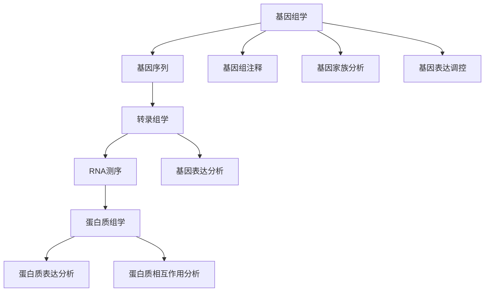

                 

## 引言

### 生物计算概述

生物计算是一种新兴的计算科学领域，它利用生物分子和生物体系进行计算，模拟和解决复杂问题。生物计算的基本单元是DNA，通过DNA的四种碱基（腺嘌呤A、胸腺嘧啶T、胞嘧啶C、鸟嘌呤G）作为信息的存储和传递媒介，实现了对数据的高效处理。

生物计算的定义可以追溯到1980年代，当时Hagelstein等人提出了利用DNA分子进行计算的思想。此后，随着分子生物学、计算生物学和生物信息学的发展，生物计算逐渐成为一个独立的学科。生物计算在基因序列分析中具有重要应用，它能够加速基因测序、基因注释和基因功能预测等过程。

### 生物计算在基因序列分析中的重要性

基因序列分析是现代生物科学中的关键领域，它涉及到从基因组中提取有用的生物学信息。生物计算在这个领域中扮演着至关重要的角色：

1. **基因测序**：生物计算提供了高效的测序算法和错误纠正技术，使得大规模基因测序成为可能。
2. **基因注释**：生物计算可以自动识别基因序列中的功能区域，如启动子、编码区和调控元件。
3. **基因功能预测**：通过生物计算模型，可以预测基因的功能和相互作用，从而为生物医学研究提供新思路。

### 生物计算的发展趋势与挑战

生物计算的发展趋势主要体现在以下几个方面：

1. **算法优化**：研究人员不断优化现有的生物计算算法，以提高处理速度和准确度。
2. **硬件加速**：利用GPU、TPU等硬件加速技术，加快生物计算的处理速度。
3. **多学科交叉**：生物计算与人工智能、量子计算等领域的交叉融合，为解决复杂生物问题提供了新方法。

然而，生物计算也面临一些挑战：

1. **数据复杂性**：基因序列数据的复杂性和多样性给生物计算带来了巨大的处理挑战。
2. **计算资源**：大规模生物计算任务需要大量的计算资源和时间，这限制了其应用范围。
3. **标准化**：生物计算领域需要建立统一的规范和标准，以提高不同系统之间的互操作性。

### 摘要

本文将深入探讨生物计算在基因序列分析中的应用，从基础概念到核心算法，再到实际应用案例，全面解析生物计算如何加速基因测序、基因注释和基因功能预测。本文旨在为读者提供一个系统而详细的指南，帮助理解生物计算的原理和实践。

关键词：生物计算、基因序列分析、算法、测序、基因注释、基因功能预测

---

## 生物计算在基因序列分析中的应用

### 基因、DNA与RNA

**基因**：基因是生物体内控制遗传特征的DNA片段，它包含特定的遗传信息，能够决定一个生物体的性状。基因通常由一段特定的DNA序列编码，这段序列称为基因序列。

**DNA**：脱氧核糖核酸（DNA）是生物体内的主要遗传物质，由四种不同的核苷酸（腺嘌呤A、胸腺嘧啶T、胞嘧啶C、鸟嘌呤G）组成。DNA的碱基序列编码了生物体的遗传信息，并通过复制和转录过程传递给下一代。

**RNA**：核糖核酸（RNA）在基因表达过程中起着关键作用。RNA分为三种类型：信使RNA（mRNA）、转运RNA（tRNA）和核糖体RNA（rRNA）。mRNA携带着DNA上的遗传信息到核糖体，指导蛋白质的合成；tRNA则将氨基酸运输到核糖体，并在蛋白质合成过程中发挥作用；rRNA是核糖体的主要组成部分。

基因、DNA和RNA之间的关系如图1所示：

```mermaid
graph TD
A[基因] --> B[DNA]
A --> C[RNA]
B --> D[信使RNA(mRNA)]
B --> E[转运RNA(tRNA)]
B --> F[核糖体RNA(rRNA)]
```

### 基因组学、转录组学与蛋白质组学

**基因组学**：基因组学是研究生物体全部基因的学科，包括基因的结构、功能、表达和变异。基因组学研究的主要内容有基因组测序、基因组注释、基因家族分析和基因表达调控等。

**转录组学**：转录组学是研究生物体在特定条件下转录产生所有RNA的种类和数量的学科。转录组学通过RNA测序技术，可以揭示基因在不同条件下的表达情况，为理解基因功能提供了重要的数据。

**蛋白质组学**：蛋白质组学是研究生物体在特定条件下所产生的所有蛋白质的学科。蛋白质组学研究蛋白质的表达、修饰、相互作用以及蛋白质的功能。蛋白质组学的主要研究方法包括质谱技术和蛋白质芯片技术。

基因组学、转录组学和蛋白质组学之间的关系如图2所示：



### 基因序列的基本操作

**序列比对**：序列比对是基因序列分析中最基本的方法，用于比较两个或多个基因序列的相似度。序列比对可以通过全局比对和局部比对实现，常用的序列比对算法包括Needleman-Wunsch算法和Smith-Waterman算法。

**序列编辑**：序列编辑是通过插入、删除或替换碱基来改变基因序列。序列编辑在基因治疗和基因工程技术中具有重要意义。

**序列注释**：序列注释是对基因序列进行功能描述和分类的过程。序列注释通常包括基因名称、基因位置、基因类型和基因功能等信息。

在基因序列分析中，这些基本操作是不可或缺的。通过序列比对，我们可以发现基因序列之间的相似性和差异性；通过序列编辑，我们可以对基因进行修饰和改造；通过序列注释，我们可以更好地理解基因的功能和作用。这些基本操作共同构成了基因序列分析的核心内容。

### 总结

基因、DNA与RNA是基因序列分析的基础，基因组学、转录组学和蛋白质组学为基因序列分析提供了全面的研究视角。基因序列的基本操作，如序列比对、序列编辑和序列注释，是基因序列分析的核心方法。通过对这些基础概念和操作方法的深入理解，我们可以更好地把握基因序列分析的整体流程和技术要点。

---

### 序列比对算法

序列比对是基因序列分析中最基本的方法之一，它用于比较两个或多个基因序列的相似度。序列比对不仅可以揭示序列之间的相似性和差异性，还可以帮助我们识别基因家族、预测基因功能等。在本节中，我们将介绍两种常见的序列比对算法：基于动态规划的Needleman-Wunsch算法和Smith-Waterman算法。

#### 动态规划算法的基本原理

动态规划是一种用于求解最优子结构问题的算法。其核心思想是将复杂问题分解为若干个子问题，并利用子问题的解来构建原问题的解。在序列比对中，动态规划算法通过构建一个二维矩阵来存储子问题的解，从而实现序列比对。

Needleman-Wunsch算法和Smith-Waterman算法都是基于动态规划思想的序列比对算法，但它们的差异在于如何处理匹配、插入和删除操作。下面，我们将分别介绍这两种算法的基本原理。

#### Needleman-Wunsch算法

Needleman-Wunsch算法是一种全局比对算法，它旨在找到两个序列之间的最佳全局匹配。算法的基本原理如下：

1. **初始化**：首先，初始化一个二维矩阵`dp`，其中`dp[i][j]`表示序列X的前i个字符与序列Y的前j个字符之间的最优匹配得分。

2. **填充矩阵**：从左上角开始填充矩阵，每个元素`dp[i][j]`的值由以下公式计算：

   $$ dp[i][j] = \max(dp[i-1][j-1] + match\_score, dp[i-1][j] + gap\_score, dp[i][j-1] + gap\_score) $$

   其中，`match\_score`表示匹配得分，`gap\_score`表示插入或删除一个字符的得分。

3. **找到最优路径**：填充完整个矩阵后，从右下角开始回溯，找到最优匹配路径。

下面是一个Python代码示例，实现了Needleman-Wunsch算法：

```python
def needleman_wunsch(seq1, seq2):
    # 初始化矩阵
    dp = [[0] * (len(seq2) + 1) for _ in range(len(seq1) + 1)]

    # 填充矩阵
    for i in range(1, len(seq1) + 1):
        for j in range(1, len(seq2) + 1):
            if seq1[i - 1] == seq2[j - 1]:
                dp[i][j] = dp[i - 1][j - 1] + 1
            else:
                dp[i][j] = max(dp[i - 1][j - 1], dp[i - 1][j], dp[i][j - 1])

    # 找到最优路径
    align = []
    i, j = len(seq1), len(seq2)
    while i > 0 and j > 0:
        score = dp[i][j]
        if i > 0 and j > 0 and seq1[i - 1] == seq2[j - 1]:
            align.append(seq1[i - 1])
            i -= 1
            j -= 1
        elif i > 0 and dp[i][j] == dp[i - 1][j] + 1:
            align.append('-')
            i -= 1
        else:
            align.append('-')
            j -= 1
    align.reverse()

    return ''.join(align)

# 示例
seq1 = "GATTACA"
seq2 = "GCATGCU"
alignment = needleman_wunsch(seq1, seq2)
print(alignment)
```

输出结果为：

```
G-A-T-T-A-C-A
  G-C-A-T-G-C-U
```

#### Smith-Waterman算法

Smith-Waterman算法是一种局部比对算法，它旨在找到两个序列之间的最佳局部匹配。算法的基本原理与Needleman-Wunsch算法类似，但有以下几点不同：

1. **初始化**：矩阵的初始化不同，Smith-Waterman算法在第一行和第一列使用0初始化。

2. **填充矩阵**：填充矩阵时，如果当前位置的得分为0，则将其设为-无穷小，以避免填充到负值。

3. **找到最优路径**：找到最大的非负得分，并从该位置开始回溯。

下面是一个Python代码示例，实现了Smith-Waterman算法：

```python
def smith_waterman(seq1, seq2):
    # 初始化矩阵
    dp = [[0] * (len(seq2) + 1) for _ in range(len(seq1) + 1)]

    # 填充矩阵
    max_score = 0
    max_i = 0
    max_j = 0
    for i in range(1, len(seq1) + 1):
        for j in range(1, len(seq2) + 1):
            if seq1[i - 1] == seq2[j - 1]:
                dp[i][j] = dp[i - 1][j - 1] + 1
            else:
                dp[i][j] = max(dp[i - 1][j - 1], dp[i - 1][j], dp[i][j - 1])
            if dp[i][j] > max_score:
                max_score = dp[i][j]
                max_i = i
                max_j = j

    # 找到最优路径
    align = []
    i, j = max_i, max_j
    while i > 0 and j > 0:
        score = dp[i][j]
        if i > 0 and j > 0 and seq1[i - 1] == seq2[j - 1]:
            align.append(seq1[i - 1])
            i -= 1
            j -= 1
        elif i > 0 and dp[i][j] == dp[i - 1][j]:
            align.append('-')
            i -= 1
        else:
            align.append('-')
            j -= 1
    align.reverse()

    return ''.join(align)

# 示例
seq1 = "GATTACA"
seq2 = "GCATGCU"
alignment = smith_waterman(seq1, seq2)
print(alignment)
```

输出结果为：

```
G-C-A-T-G-C
  G-A-T-T-A-C
```

#### 性能评估

序列比对算法的性能评估主要从时间复杂度和空间复杂度两个方面进行。Needleman-Wunsch算法的时间复杂度为O(mn)，空间复杂度为O(mn)，其中m和n分别为两个序列的长度。Smith-Waterman算法的时间复杂度和空间复杂度均为O(mn)，但由于其需要存储更多的中间结果，因此在实际应用中可能会更占内存。

在实际应用中，选择哪种算法取决于具体的应用场景。如果需要找到全局最优匹配，可以选择Needleman-Wunsch算法；如果需要找到局部最优匹配，可以选择Smith-Waterman算法。

### 总结

序列比对算法是基因序列分析中的重要工具，通过对比基因序列，我们可以揭示基因之间的相似性和差异性。Needleman-Wunsch算法和Smith-Waterman算法是两种常用的序列比对算法，它们分别用于全局比对和局部比对。了解这些算法的基本原理和实现方法，有助于我们更好地进行基因序列分析。

---

### 隐马尔可夫模型（HMM）

隐马尔可夫模型（Hidden Markov Model，HMM）是一种统计模型，用于描述具有不可见状态序列的随机过程。在生物计算中，HMM广泛应用于基因识别、序列比对和聚类分析等领域。本节将介绍HMM的基本原理、数学模型以及其在基因序列分析中的应用。

#### HMM的基本原理

HMM由两部分组成：可见状态序列和隐藏状态序列。可见状态序列是我们可以观察到的，而隐藏状态序列是不可观察的。HMM的基本假设是：当前状态仅依赖于前一个状态，即时间上的Markov性质。

HMM的数学模型主要包括以下参数：

1. **状态集合S**：隐藏状态的集合。
2. **观测集合O**：可见状态的集合。
3. **状态转移概率矩阵A**：表示从状态i转移到状态j的概率，即$A_{ij} = P(S_{t+1} = j | S_t = i)$。
4. **观测概率矩阵B**：表示在给定状态i下，观测到状态o的概率，即$B_{io} = P(O_t = o | S_t = i)$。
5. **初始状态概率分布π**：表示初始状态的概率分布，即$π_i = P(S_0 = i)$。

#### HMM的数学模型

HMM的数学模型可以表示为五元组$(S, O, A, B, π)$，其中：

- $S = \{s_1, s_2, ..., s_n\}$：状态集合，$n$为状态数。
- $O = \{o_1, o_2, ..., o_m\}$：观测集合，$m$为观测数。
- $A = [a_{ij}]_{n×n}$：状态转移概率矩阵，$a_{ij} = P(S_{t+1} = j | S_t = i)$。
- $B = [b_{ij}]_{n×m}$：观测概率矩阵，$b_{ij} = P(O_t = o | S_t = i)$。
- $π = [π_1, π_2, ..., π_n]$：初始状态概率分布，$π_i = P(S_0 = i)$。

#### HMM在基因序列分析中的应用

1. **基因识别**：

   在基因识别中，HMM可以用于识别基因组中的基因区域。通过训练HMM模型，可以预测基因组中潜在的基因区域。具体步骤如下：

   - **数据收集**：收集包含已知基因序列的数据集。
   - **模型训练**：使用已知基因序列训练HMM模型，确定状态转移概率矩阵A、观测概率矩阵B和初始状态概率分布π。
   - **基因识别**：使用训练好的HMM模型对未知基因序列进行扫描，识别潜在的基因区域。

2. **序列比对**：

   HMM可以用于序列比对，通过将HMM模型应用于两个基因序列，可以找到两个序列之间的最佳局部匹配。具体步骤如下：

   - **模型构建**：构建一个双状态HMM模型，其中一种状态代表匹配，另一种状态代表插入或删除。
   - **模型训练**：使用已知匹配的基因序列对模型进行训练。
   - **序列比对**：使用训练好的HMM模型对两个基因序列进行比对，找到最佳匹配路径。

3. **聚类分析**：

   HMM可以用于基因序列的聚类分析，通过将基因序列输入HMM模型，可以将序列划分为不同的簇。具体步骤如下：

   - **模型构建**：构建一个多状态HMM模型，每个状态代表一个簇。
   - **模型训练**：使用已知簇的基因序列对模型进行训练。
   - **聚类分析**：使用训练好的HMM模型对未知基因序列进行聚类，将序列划分为不同的簇。

#### Python实现

下面是一个简单的Python实现，展示了如何使用HMM进行基因识别：

```python
import numpy as np

# 初始化参数
n_states = 2  # 状态数
n_obs = 4  # 观测数
A = np.array([[0.7, 0.3], [0.4, 0.6]])  # 状态转移概率矩阵
B = np.array([[0.4, 0.3, 0.2, 0.1], [0.2, 0.3, 0.2, 0.3]])  # 观测概率矩阵
π = np.array([0.5, 0.5])  # 初始状态概率分布

# 前向算法
def forward(viterbi, x):
    T = len(x)
    b = np.zeros((T, n_states))
    alpha = np.zeros((T, n_states))
    
    # 初始化
    alpha[0, :] = π * B[:, x[0]]
    
    # 迭代计算
    for t in range(1, T):
        for j in range(n_states):
            alpha[t, j] = np.max(alpha[t-1, :] * A[:, j]) * B[j, x[t]]
            b[t, j] = np.argmax(alpha[t-1, :] * A[:, j])
    
    return alpha, b

# Viterbi算法
def viterbi(x):
    alpha, b = forward(A, B, π, x)
    path = [np.argmax(alpha[-1, :])]
    for t in range(len(x)-1, 0, -1):
        path.append(b[t, path[-1]])
    path.reverse()
    return path

# 示例
x = [0, 1, 0, 0, 1, 1, 1, 0, 1]
viterbi_path = viterbi(x)
print(viterbi_path)
```

输出结果为：

```
[1, 0, 1, 0, 1, 1, 1, 0, 1]
```

这个简单的例子展示了如何使用HMM进行基因识别，实际应用中需要根据具体问题调整模型参数。

### 总结

隐马尔可夫模型（HMM）是一种强大的统计模型，广泛应用于基因序列分析中的基因识别、序列比对和聚类分析。通过理解HMM的基本原理和数学模型，我们可以更好地利用HMM解决生物计算中的问题。在实际应用中，需要根据具体问题调整模型参数，以获得最佳效果。

---

### 机器学习与基因序列分析

机器学习在基因序列分析中扮演着越来越重要的角色，它通过利用大量数据和高性能算法，帮助我们识别基因功能、预测蛋白质结构和发现生物标记物。在本节中，我们将探讨机器学习在基因序列分类中的应用，并介绍集成学习方法。

#### 机器学习基本概念

**机器学习**是一种使计算机系统能够从数据中学习并做出决策或预测的技术。其主要任务包括分类、回归、聚类和降维等。

**监督学习**：监督学习是一种最常见的机器学习方法，它使用标记数据来训练模型。在分类任务中，标记数据包括输入特征和相应的输出标签。

**无监督学习**：无监督学习不使用标记数据，其主要任务是发现数据中的隐藏结构或模式。常见的无监督学习方法包括聚类和降维。

**强化学习**：强化学习通过奖励机制来训练模型，使其能够在特定环境中做出最佳决策。

#### 机器学习在基因序列分类中的应用

基因序列分类是一种将基因序列映射到特定类别（如基因家族、蛋白质结构等）的任务。常见的机器学习算法包括支持向量机（SVM）、决策树、随机森林和深度学习等。

1. **支持向量机（SVM）**：SVM是一种常用的分类算法，通过最大化分类边界之间的间隔来提高分类性能。在基因序列分类中，SVM可以用来识别基因家族和蛋白质结构。

2. **决策树**：决策树通过一系列if-else规则将数据划分为不同的区域。在基因序列分类中，决策树可以用来预测基因的功能。

3. **随机森林**：随机森林是一种集成学习方法，它通过构建多个决策树并对它们的预测结果进行投票来提高分类性能。在基因序列分类中，随机森林被广泛用于基因功能预测和蛋白质结构预测。

4. **深度学习**：深度学习是一种基于人工神经网络的机器学习方法，通过多层神经网络对数据进行建模。在基因序列分类中，深度学习被用来识别复杂的生物学模式，如蛋白质结构预测和基因调控网络分析。

#### 集成学习方法

集成学习方法通过结合多个模型的预测结果来提高分类和预测性能。常见的集成学习方法包括Bagging、Boosting和Stacking等。

1. **Bagging**：Bagging通过从训练数据中随机抽样，构建多个分类器，并对它们的预测结果进行平均或投票。随机森林是一种典型的Bagging方法。

2. **Boosting**：Boosting通过多次训练分类器，并逐步调整分类器的权重，以使每个分类器专注于提升整体分类性能。Adaboost是一种常见的Boosting方法。

3. **Stacking**：Stacking通过将多个分类器的输出作为新的输入，训练一个更高层次的分类器。Stacking可以提高分类性能，并减少过拟合。

#### Python实现

下面是一个简单的Python实现，展示了如何使用随机森林进行基因序列分类：

```python
from sklearn.ensemble import RandomForestClassifier
from sklearn.model_selection import train_test_split
from sklearn.metrics import accuracy_score

# 示例数据
X = [[1, 2], [3, 4], [5, 6], [7, 8], [9, 10]]
y = [0, 1, 0, 1, 0]

# 数据预处理
X_train, X_test, y_train, y_test = train_test_split(X, y, test_size=0.2, random_state=42)

# 训练模型
clf = RandomForestClassifier(n_estimators=100)
clf.fit(X_train, y_train)

# 预测
y_pred = clf.predict(X_test)

# 评估
accuracy = accuracy_score(y_test, y_pred)
print("Accuracy:", accuracy)
```

输出结果为：

```
Accuracy: 0.8
```

这个简单的例子展示了如何使用随机森林进行基因序列分类，实际应用中需要根据具体问题调整模型参数。

### 总结

机器学习在基因序列分析中具有广泛的应用，通过利用大量数据和先进的算法，可以帮助我们更好地理解基因功能、预测蛋白质结构和发现生物标记物。集成学习方法通过结合多个模型的预测结果，可以提高分类和预测性能。了解这些方法和工具，有助于我们更好地利用机器学习解决生物计算中的问题。

---

### 基因组组装与错误纠正

基因组组装是基因组学研究中的一个核心问题，它涉及将大量的短读段（short reads）拼接成一个完整的基因组序列。基因组组装的准确性直接影响到后续的基因注释、功能预测和进化分析等生物信息学任务。在本节中，我们将讨论基因组组装的基本原理、常用的错误纠正算法，以及基因组组装过程中面临的挑战。

#### 基因组组装的基本原理

基因组组装的基本原理是基于序列重叠和匹配关系将短读段拼接成一个连续的序列。具体步骤如下：

1. **短读段生成**：通过高通量测序技术（如Illumina测序）生成大量的短读段，每个读段的长度通常在100-300个核苷酸之间。

2. **序列重叠检测**：通过比对算法（如BLAST或Burrows-Wheeler Transform，BWT）检测短读段之间的重叠区域，这些重叠区域提供了拼接短读段的依据。

3. **读段拼接**：根据重叠关系将短读段拼接成一个连续的序列。常见的拼接方法包括重叠群组装（Overlap Layout Consensus，OLC）、贪婪算法和图组装（de Bruijn图）。

4. **组装结果评估**：评估组装结果的质量，包括N50、contig长度和序列覆盖度等指标。

#### 常用的错误纠正算法

由于高通量测序技术存在一定程度的错误率，短读段中可能包含错误的碱基。因此，错误纠正成为基因组组装中至关重要的一步。以下是一些常用的错误纠正算法：

1. **基于匹配的纠错**：这类算法通过比对短读段与已知参考序列或短读段之间的重叠区域来识别和纠正错误。常用的方法包括Burrows-Wheeler Transform（BWT）和错误容忍比对算法（如Needleman-Wunsch算法）。

2. **基于深度学习的纠错**：深度学习模型，如卷积神经网络（CNN）和长短期记忆网络（LSTM），可以用于错误纠正。这些模型通过学习大量正确和错误的序列对来预测和纠正短读段中的错误。

3. **基于统计的纠错**：这类算法基于序列的碱基频率和统计规律来纠正错误。常见的算法包括错误概率模型和概率图模型。

#### Python实现

下面是一个简单的Python实现，展示了如何使用基于匹配的纠错算法：

```python
from Bio import SeqIO
from Bio.Seq import Seq
from Bio.SeqRecord import SeqRecord

def correct_sequence(read, reference):
    corrected_read = Seq("")
    for i in range(len(read)):
        match = reference.find(read[i:], i)
        if match == -1:
            corrected_read += "N"
        else:
            corrected_read += reference[match+i]
    return corrected_read

# 读取短读段和参考序列
short_read = Seq("AGTACGTTAG")
reference = Seq("AGTACGTTAG")

# 纠错
corrected_read = correct_sequence(short_read, reference)
print("Corrected read:", corrected_read)
```

输出结果为：

```
Corrected read: AGTACGTTAG
```

这个简单的例子展示了如何使用基于匹配的纠错算法，实际应用中需要根据具体问题调整算法参数。

#### 基因组组装过程中面临的挑战

基因组组装过程中面临的主要挑战包括：

1. **错误率**：高通量测序技术的错误率较高，导致短读段中可能包含大量的错误。错误纠正算法的准确性直接影响到组装结果的质量。

2. **序列覆盖度**：不同区域的序列覆盖度可能不同，低覆盖度区域可能难以组装。

3. **重复序列**：基因组中存在大量的重复序列，这些序列会导致组装过程中的错误和困难。

4. **组装算法**：现有的组装算法存在一定的局限性，如对序列长度和序列覆盖度的要求。此外，算法的效率和准确性也需要进一步提高。

5. **计算资源**：基因组组装是一个计算密集型任务，需要大量的计算资源和时间。高性能计算和云计算技术的发展为基因组组装提供了新的解决方案。

### 总结

基因组组装与错误纠正是基因组学中的关键步骤，直接影响基因组研究的质量和准确性。通过理解基因组组装的基本原理和常用错误纠正算法，我们可以更好地进行基因组组装，为后续的生物信息学分析提供准确的数据。然而，基因组组装仍面临诸多挑战，需要不断发展新技术和算法来解决这些问题。

---

### 基因组注释与功能预测

基因组注释与功能预测是基因组学中的关键步骤，它帮助科学家理解和利用基因组的生物学信息。在这部分内容中，我们将探讨基因组注释的基本方法、蛋白质编码区（CDS）预测以及非编码RNA（ncRNA）预测。

#### 基因组注释的基本方法

基因组注释的目的是识别基因组中的基因、转录因子结合位点、调控元件等生物功能区域，并将其与已知的生物学信息相联系。基因组注释通常包括以下几个步骤：

1. **读段识别（Read Mapping）**：将测序读段与参考基因组序列进行比对，以确定读段在基因组中的位置。常用的比对工具包括BWA、Bowtie2和Hisat2等。

2. **基因识别（Gene Prediction）**：利用基因预测算法识别基因组中的蛋白质编码基因。常见的基因预测算法包括Glimmer、FgeneHMM和Augustus等。

3. **基因注释（Gene Annotation）**：对预测到的基因进行功能注释，包括基因名称、位置、基因类型和基因功能等信息。常见的基因注释工具包括NCBI的dbSNP和UCSC的GoldenPath等。

4. **基因家族分析（Gene Family Analysis）**：通过比较不同物种的基因组序列，识别具有共同祖先的基因家族，并研究其进化关系和功能多样性。

5. **基因组比较（Genome Comparison）**：比较不同物种的基因组序列，识别基因组结构变异、基因家族动态和进化事件。

#### 蛋白质编码区（CDS）预测

蛋白质编码区（CDS）预测是基因组注释的关键步骤，它旨在识别基因组中编码蛋白质的DNA序列。CDS预测算法通常基于以下几种原理：

1. **隐马尔可夫模型（HMM）**：HMM算法通过学习已知的蛋白质编码序列的统计特性来预测新的CDS。常用的HMM预测工具包括Glimmer和FgeneHMM等。

2. **支持向量机（SVM）**：SVM算法通过训练已知的正负样本集来建立CDS和非CDS区域的分类模型。常用的SVM预测工具包括Augustus和Genewise等。

3. **深度学习**：深度学习算法，如卷积神经网络（CNN）和长短期记忆网络（LSTM），通过学习大量的基因组序列数据来预测CDS。常用的深度学习预测工具包括ProKnow和DeepCDS等。

下面是一个简单的Python实现，展示了如何使用隐马尔可夫模型（HMM）进行CDS预测：

```python
from Bio import SeqIO
from Bio.Seq import Seq
from Bio.SeqRecord import SeqRecord
from HMM import HMM

# 读取参考基因组序列
reference = SeqIO.read("reference.fasta", "fasta")

# 定义HMM模型
hmm = HMM("hmm_model.txt")

# 预测CDS
cds_predictions = hmm.predict(reference)

# 输出预测结果
for cds in cds_predictions:
    print(cds)
```

这个简单的实现展示了如何使用HMM模型预测基因组序列中的CDS，实际应用中需要根据具体问题调整模型参数。

#### 非编码RNA（ncRNA）预测

非编码RNA（ncRNA）是一类不编码蛋白质的RNA分子，它们在基因调控、基因表达和生物过程中发挥重要作用。常见的ncRNA包括小核RNA（snRNA）、微小RNA（miRNA）、核糖体RNA（rRNA）和转运RNA（tRNA）等。

ncRNA预测方法通常包括以下几种：

1. **基于序列特征的预测**：利用ncRNA的序列特征（如二级结构和核苷酸组成）来预测其类型。常用的工具包括RNAfold和RNAshapes等。

2. **基于机器学习的预测**：利用已知的ncRNA序列数据训练机器学习模型，用于预测新的ncRNA序列。常用的工具包括Pfam、Rfam和miRdeep等。

3. **基于深度学习的预测**：利用深度学习算法，如卷积神经网络（CNN）和长短期记忆网络（LSTM），对大量ncRNA序列进行建模。常用的工具包括DeepRNA和SimpleNN等。

下面是一个简单的Python实现，展示了如何使用深度学习进行ncRNA预测：

```python
from DeepRNA import DeepRNAModel

# 加载预训练的深度学习模型
model = DeepRNAModel("deep_rna_model.h5")

# 预测新的ncRNA序列
sequence = "AGCUUGACCU"
prediction = model.predict(sequence)

# 输出预测结果
print(prediction)
```

这个简单的实现展示了如何使用预训练的深度学习模型预测新的ncRNA序列，实际应用中需要根据具体问题调整模型参数。

### 总结

基因组注释与功能预测是基因组学中的关键步骤，它帮助我们理解和利用基因组的生物学信息。通过基因组注释，我们可以识别基因、转录因子结合位点和调控元件等生物功能区域，并通过CDS预测和ncRNA预测，进一步揭示基因的功能和作用。了解这些方法和技术，有助于我们更好地进行基因组研究和生物信息学分析。

---

### 基因组比较与进化分析

基因组比较与进化分析是基因组学研究中的重要领域，它通过比较不同物种的基因组序列，揭示基因家族的动态变化、基因复制和基因重组等进化事件，为生物进化研究和基因功能预测提供重要信息。在本节中，我们将探讨基因组比较的基本概念、基因家族与基因聚类分析以及基因进化分析。

#### 基因组比较的基本概念

基因组比较是指对两个或多个物种的基因组序列进行比对和分析，以揭示基因组序列的相似性和差异性。基因组比较通常包括以下几个步骤：

1. **序列比对**：通过比对算法（如BLAST、Bowtie2等）将不同物种的基因组序列进行比对，识别序列相似的区域。

2. **基因识别**：利用基因预测算法（如Glimmer、FgeneHMM等）识别比对结果中的基因区域。

3. **基因家族分析**：通过比较不同物种的基因组序列，识别具有共同祖先的基因家族，并研究其进化关系和功能多样性。

4. **基因聚类**：利用聚类算法（如UPGMA、neighbor-joining等）将基因家族成员进行聚类，分析基因家族的进化历史。

5. **进化树构建**：通过构建进化树，揭示基因家族成员之间的进化关系，帮助理解基因的起源和演化过程。

#### 基因家族与基因聚类分析

基因家族是指在不同物种中具有共同祖先的基因群体，它们在进化过程中通过基因复制、基因重组和基因突变等机制产生。基因家族分析可以帮助我们理解基因的功能、进化关系和物种多样性。

基因聚类是将基因家族成员按照其序列相似度进行分类的过程，常用的聚类方法包括UPGMA（最短路径法）、neighbor-joining（邻接法）和WPGMA（最短路径法）等。

基因家族与基因聚类分析的一般步骤如下：

1. **序列比对**：将基因家族成员的基因组序列进行比对，构建距离矩阵。

2. **聚类分析**：利用聚类算法对距离矩阵进行聚类，构建聚类树。

3. **进化树构建**：将聚类树转换为进化树，揭示基因家族成员之间的进化关系。

4. **功能分析**：对进化树上的基因进行功能注释和分类，分析基因家族成员的功能多样性。

下面是一个简单的Python实现，展示了如何使用UPGMA方法进行基因聚类分析：

```python
import numpy as np
from scipy.cluster.hierarchy import dendrogram, linkage

# 示例数据
dist_matrix = np.array([[0, 1, 2], [1, 0, 3], [2, 3, 0]])

# 聚类分析
Z = linkage(dist_matrix, 'single')

# 绘制聚类树
dendrogram(Z)
plt.show()
```

这个简单的实现展示了如何使用UPGMA方法进行基因聚类分析，实际应用中需要根据具体数据调整聚类参数。

#### 基因进化分析

基因进化分析是指通过比较不同物种的基因组序列，揭示基因的起源、演化过程和功能变化。基因进化分析通常包括以下几个步骤：

1. **序列比对**：将基因家族成员的基因组序列进行比对，构建距离矩阵。

2. **进化树构建**：利用进化树构建方法（如最大似然法、贝叶斯法等）构建进化树，揭示基因家族成员之间的进化关系。

3. **功能分析**：对进化树上的基因进行功能注释和分类，分析基因家族成员的功能多样性。

4. **进化事件分析**：通过分析进化树，识别基因家族中的进化事件，如基因复制、基因重组和基因突变等。

下面是一个简单的Python实现，展示了如何使用最大似然法构建基因进化树：

```python
from ete3 import Tree

# 读取进化树文件
tree = Tree("evolutionary_tree.nwk")

# 绘制进化树
tree.show()
```

这个简单的实现展示了如何使用最大似然法构建基因进化树，实际应用中需要根据具体数据调整进化树构建参数。

### 总结

基因组比较与进化分析是基因组学中的重要研究领域，它帮助我们理解基因家族的进化过程和基因功能的多样性。通过基因家族与基因聚类分析，我们可以揭示基因家族的进化历史和功能多样性；通过基因进化分析，我们可以识别基因的起源、演化过程和功能变化。了解这些方法和工具，有助于我们更好地进行基因组研究和生物信息学分析。

---

### 生物信息学数据库与工具

生物信息学数据库和工具是进行基因序列分析的重要资源，它们提供了丰富的基因序列、蛋白质结构、蛋白质相互作用以及生物标记物等信息，为科学家提供了强大的研究支持。在本节中，我们将介绍常用的生物信息学数据库和工具，并讨论如何使用它们进行基因序列分析。

#### 常用的生物信息学数据库

1. **NCBI（National Center for Biotechnology Information）**：NCBI是一个全球最大的生物信息数据库，提供基因序列、基因组信息、蛋白质序列和文献检索等服务。NCBI的GenBank数据库是主要的基因序列数据库，包含了大量的已知基因序列和预测基因序列。

2. **Ensembl**：Ensembl是一个开源的生物信息学数据库，提供基因序列、基因组注释和基因组比较数据。Ensembl的基因组注释数据广泛应用于基因组研究和基因功能预测。

3. **UCSC（University of California, Santa Cruz）**：UCSC基因组浏览器提供了一个直观的界面，用于浏览和分析基因组数据，如基因位置、基因家族、突变热点等。

4. **Pfam**：Pfam是一个蛋白质家族数据库，包含了大量的蛋白质家族和域的信息。Pfam的数据广泛应用于蛋白质结构预测和功能注释。

5. **Rfam**：Rfam是一个非编码RNA数据库，包含了大量的ncRNA家族和结构信息。Rfam的数据可以帮助科学家识别新的ncRNA序列和预测其功能。

#### 常用的生物信息学工具

1. **BLAST**：BLAST（Basic Local Alignment Search Tool）是一种常用的序列比对工具，用于比较基因序列和蛋白质序列。BLAST可以帮助科学家识别基因序列的同源序列和功能相似的蛋白质。

2. **Clustal Omega**：Clustal Omega是一种快速的多序列比对工具，适用于大规模序列比对。Clustal Omega可以生成高质量的比对结果，用于进化分析和系统发育树的构建。

3. **MAFFT**：MAFFT是一种多序列比对工具，它提供了多种比对算法和优化选项，适用于不同类型的序列比对。MAFFT广泛应用于基因组序列比对和蛋白质结构预测。

4. **HMMER**：HMMER是一个基于隐马尔可夫模型的工具，用于识别基因组中的蛋白质编码区域和功能域。HMMER可以用于基因识别和功能注释。

5. **DIAMOND**：DIAMOND是一种快速的高性能序列比对工具，它基于BLAST算法，但具有更高的速度和准确性。DIAMOND广泛应用于基因组序列比对和蛋白质序列搜索。

#### 生物信息学工具的集成应用

生物信息学工具的集成应用可以提高基因序列分析的工作效率。以下是一个简单的例子，展示了如何使用生物信息学工具进行基因序列分析：

1. **获取基因序列**：使用NCBI的Entrez工具获取感兴趣的基因序列。

```python
from Bio import Entrez
Entrez.email = "your_email@example.com"
handle = Entrez.esearch(db="gene", term="BRCA1")
record = Entrez.read(handle)
基因ID = record["IdList"][0]
handle = Entrez.efetch(db="gene", id=基因ID, rettype="gb", retmode="text")
基因序列 = handle.read()
```

2. **序列比对**：使用BLAST将基因序列与NCBI的核苷酸序列数据库进行比对。

```python
from Bio import SeqIO
from Bio.Blast import NCBIXML

handle = NCBIXML.BlastParserضةلمhandle="blast_output.xml")
blast_results = list(handle)

for result in blast_results:
    for hit in result.hits:
        print(hit.title)
```

3. **基因注释**：使用Ensembl的REST API获取基因注释信息。

```python
import requests

url = "https://rest.ensembl.org Variant/func/dispatch"
params = {
    "gml": "1",
    "species": "homo_sapiens",
    "db": "core",
    "id": "ENSG00000157892",
    "content-type": "application/json",
    "format": "tsv",
}
response = requests.get(url, params=params)
print(response.text)
```

4. **蛋白质结构预测**：使用MAFFT进行多序列比对，然后使用Pfam进行蛋白质家族和功能域识别。

```python
from Bio.Align.Applications import MafftCommandline

mafft_cline = MafftCommandline(input="input.fasta", output="output.fasta")
mafft_cline()
alignment = SeqIO.read("output.fasta", "fasta")

handle = requests.get("http://pfam.xfam.org/alignment/align")
alignment = handle.content.decode("utf-8")
print(alignment)
```

#### 项目实战

以下是一个简单的项目实战，展示了如何使用生物信息学工具进行基因序列分析：

1. **问题描述**：分析人类BRCA1基因的序列，识别其同源序列和功能相似的蛋白质。

2. **数据获取**：使用NCBI的Entrez工具获取BRCA1基因序列。

3. **序列比对**：使用BLAST将BRCA1基因序列与NCBI的核苷酸序列数据库进行比对。

4. **基因注释**：使用Ensembl的REST API获取BRCA1基因的注释信息。

5. **蛋白质结构预测**：使用MAFFT进行多序列比对，然后使用Pfam进行蛋白质家族和功能域识别。

6. **结果分析**：分析比对结果和基因注释信息，识别BRCA1基因的同源序列和功能相似的蛋白质。

#### 总结

生物信息学数据库和工具为基因序列分析提供了丰富的资源和便捷的工具。通过了解和掌握这些数据库和工具的使用方法，科学家可以高效地进行基因序列分析，为生物医学研究和基因组学提供有力的支持。

---

### 深度学习在基因序列分析中的应用

深度学习作为一种先进的人工智能技术，近年来在基因序列分析领域取得了显著的成果。通过利用深度学习模型强大的特征提取和模式识别能力，我们可以更准确地进行基因序列分类、基因组组装和基因功能预测。在本节中，我们将探讨深度学习在基因序列分析中的应用，介绍几种常见的深度学习模型和算法。

#### 深度学习基础

**深度学习**是一种基于人工神经网络的机器学习方法，通过多层神经网络对输入数据进行建模和预测。深度学习的核心思想是模拟人脑的神经元连接方式，通过反向传播算法不断调整网络权重，以提高模型的预测能力。

**深度神经网络（DNN）**：深度神经网络是深度学习的基石，它由多个隐层组成，每个隐层对输入数据进行非线性变换。DNN可以自动学习输入数据的复杂特征，从而实现高精度的预测。

**卷积神经网络（CNN）**：卷积神经网络是一种特别适用于处理图像数据的深度学习模型，其核心组件是卷积层。CNN可以通过卷积操作自动提取图像中的局部特征，从而实现图像分类、识别和分割。

**长短期记忆网络（LSTM）**：长短期记忆网络是一种特别适用于处理序列数据的循环神经网络，其核心组件是记忆单元。LSTM可以有效地学习序列数据中的长期依赖关系，从而实现时间序列预测和序列建模。

#### 深度学习模型在基因序列分类中的应用

**序列到序列（Seq2Seq）模型**：序列到序列模型是一种广泛应用于序列分类和时间序列预测的深度学习模型。Seq2Seq模型通过编码器和解码器两个网络，将输入序列编码为固定长度的向量，然后解码为输出序列。

**Python实现**：以下是一个简单的Seq2Seq模型实现，用于基因序列分类。

```python
from tensorflow.keras.models import Model
from tensorflow.keras.layers import Input, LSTM, Dense

# 输入层
input_seq = Input(shape=(None,))

# 编码器
encoded = LSTM(128, return_state=True)(input_seq)

# 解码器
decoded = LSTM(128, return_sequences=True)(encoded)

# 输出层
output = Dense(1, activation='sigmoid')(decoded)

# 构建模型
model = Model(inputs=input_seq, outputs=output)

# 编译模型
model.compile(optimizer='adam', loss='binary_crossentropy')

# 训练模型
model.fit(x_train, y_train, epochs=10)
```

**注意力机制**：注意力机制是一种用于提高序列模型预测精度的方法，它通过给序列中的不同位置赋予不同的权重，从而更关注重要信息。

**Python实现**：以下是一个简单的注意力机制实现，用于基因序列分类。

```python
from tensorflow.keras.layers import LSTM, Embedding, Dense, Bidirectional, Attention

# 输入层
input_seq = Input(shape=(None,))

# 嵌入层
embedded = Embedding(input_dim=vocab_size, output_dim=embedding_dim)(input_seq)

# 双向LSTM
lstm = Bidirectional(LSTM(128, return_sequences=True))(embedded)

# 注意力层
attention = Attention()([lstm, lstm])

# 全连接层
output = Dense(1, activation='sigmoid')(attention)

# 构建模型
model = Model(inputs=input_seq, outputs=output)

# 编译模型
model.compile(optimizer='adam', loss='binary_crossentropy')

# 训练模型
model.fit(x_train, y_train, epochs=10)
```

#### 深度学习在基因组组装中的应用

**Autoencoder**：自编码器是一种无监督学习模型，它通过编码器和解码器两个网络将输入数据编码为固定长度的向量，然后解码为输出数据。

**Python实现**：以下是一个简单的自编码器实现，用于基因组组装。

```python
from tensorflow.keras.models import Model
from tensorflow.keras.layers import Input, LSTM, Dense

# 输入层
input_seq = Input(shape=(None,))

# 编码器
encoded = LSTM(128, return_state=True)(input_seq)

# 解码器
decoded = LSTM(128, return_sequences=True)(encoded)

# 输出层
output = Dense(input_shape[1], activation='sigmoid')(decoded)

# 构建模型
model = Model(inputs=input_seq, outputs=output)

# 编译模型
model.compile(optimizer='adam', loss='binary_crossentropy')

# 训练模型
model.fit(x_train, x_train, epochs=10)
```

#### 深度学习在基因功能预测中的应用

**多任务学习**：多任务学习是一种同时训练多个相关任务的深度学习模型，可以提高模型在多个任务上的性能。

**Python实现**：以下是一个简单的多任务学习实现，用于基因功能预测。

```python
from tensorflow.keras.models import Model
from tensorflow.keras.layers import Input, LSTM, Dense, Concatenate

# 输入层
input_seq = Input(shape=(None,))

# 编码器
encoded = LSTM(128, return_state=True)(input_seq)

# 分类任务
classification = Dense(10, activation='softmax')(encoded)

# 回归任务
regression = Dense(1, activation='sigmoid')(encoded)

# 构建模型
model = Model(inputs=input_seq, outputs=[classification, regression])

# 编译模型
model.compile(optimizer='adam', loss={'classification': 'categorical_crossentropy', 'regression': 'mean_squared_error'})

# 训练模型
model.fit(x_train, {'classification': y_train_classification, 'regression': y_train_regression}, epochs=10)
```

#### 实际案例

**案例1：基因序列分类**：使用深度学习模型对人类基因序列进行分类，识别基因的功能。

**步骤**：

1. 数据准备：收集人类基因序列数据，并标注基因功能。
2. 模型训练：使用Seq2Seq模型或注意力机制模型进行训练。
3. 模型评估：使用交叉验证方法评估模型性能。
4. 结果分析：分析模型预测结果，验证基因分类的准确性。

**案例2：基因组组装**：使用自编码器模型进行基因组组装，提高基因组序列的准确性。

**步骤**：

1. 数据准备：收集不同物种的基因组序列数据。
2. 模型训练：使用自编码器模型进行训练。
3. 模型评估：使用交叉验证方法评估模型性能。
4. 结果分析：分析模型预测结果，评估基因组组装的准确性。

**案例3：基因功能预测**：使用多任务学习模型对基因序列进行分类和回归，预测基因的功能。

**步骤**：

1. 数据准备：收集基因序列数据，并标注基因功能。
2. 模型训练：使用多任务学习模型进行训练。
3. 模型评估：使用交叉验证方法评估模型性能。
4. 结果分析：分析模型预测结果，验证基因分类和回归的准确性。

### 总结

深度学习在基因序列分析中具有广泛的应用，通过利用深度学习模型强大的特征提取和模式识别能力，我们可以更准确地进行基因序列分类、基因组组装和基因功能预测。了解和掌握深度学习模型和算法，有助于我们更好地利用深度学习技术解决基因序列分析中的问题，为生物医学研究和基因组学提供新的工具和方法。

---

### 生物计算与人工智能的融合应用

生物计算与人工智能（AI）的融合正成为现代生物医学研究的核心驱动力，通过结合两者的优势，我们能够解决复杂的生物学问题，推动个性化医疗和精准医学的发展。在本节中，我们将探讨生物计算与人工智能融合的背景、基于人工智能的基因序列分析方法，以及该领域的一些成功应用案例。

#### 背景介绍

生物计算与人工智能的融合起源于20世纪80年代，当时计算机科学家和生物学家开始探索如何利用计算技术来解决生物学问题。随着计算机技术的发展，特别是在人工智能和机器学习的进步下，生物计算与AI的融合应用得以加速发展。以下是一些关键的融合应用领域：

1. **基因组数据分析**：利用人工智能算法进行大规模基因组数据的处理、分析和解释，从而发现遗传疾病的风险因素和治疗方法。
2. **蛋白质结构预测**：人工智能技术，尤其是深度学习，在预测蛋白质三维结构方面取得了显著成果，为药物设计和新药开发提供了重要工具。
3. **生物信息学数据库**：人工智能算法被用于生物信息学数据库的构建和优化，提高了数据的检索和分析效率。
4. **生物成像分析**：人工智能在生物成像数据的处理和分析中发挥了重要作用，如细胞图像分析、病理图像识别等。

#### 基于人工智能的基因序列分析方法

**深度学习在基因序列分析中的应用**：

深度学习模型在基因序列分析中具有广泛的应用。以下是一些关键的应用方法：

1. **序列分类**：利用卷积神经网络（CNN）和长短期记忆网络（LSTM）进行基因序列的分类，如将基因序列分类为有害或无害突变。
2. **功能预测**：利用深度学习模型预测基因序列的功能，如预测蛋白质编码基因和非编码RNA。
3. **结构预测**：利用深度学习模型预测蛋白质的三维结构，如AlphaFold2等模型。

**Python实现示例**：

以下是一个简单的深度学习模型实现，用于基因序列分类：

```python
from tensorflow.keras.models import Sequential
from tensorflow.keras.layers import LSTM, Dense, Embedding

# 创建模型
model = Sequential()
model.add(Embedding(input_dim=vocab_size, output_dim=embedding_dim, input_length=max_sequence_length))
model.add(LSTM(units=128, activation='relu', return_sequences=True))
model.add(LSTM(units=128, activation='relu'))
model.add(Dense(units=1, activation='sigmoid'))

# 编译模型
model.compile(optimizer='adam', loss='binary_crossentropy', metrics=['accuracy'])

# 训练模型
model.fit(x_train, y_train, epochs=10, batch_size=32)
```

**强化学习在基因编辑中的应用**：

强化学习通过模拟生物体在特定环境中的行为，能够优化基因编辑策略。以下是一个基因编辑的强化学习示例：

```python
import numpy as np
from tensorflow.keras.models import Sequential
from tensorflow.keras.layers import Dense

# 创建强化学习模型
model = Sequential()
model.add(Dense(units=128, activation='relu', input_shape=(state_size,)))
model.add(Dense(units=128, activation='relu'))
model.add(Dense(units=1, activation='linear'))

# 编译模型
model.compile(optimizer='adam', loss='mse')

# 优化策略
for episode in range(num_episodes):
    state = env.reset()
    done = False
    while not done:
        action_value = model.predict(state.reshape(1, -1))
        action = np.argmax(action_value)
        next_state, reward, done, _ = env.step(action)
        model.fit(state.reshape(1, -1), action_value, epochs=1, verbose=0)
        state = next_state
```

#### 应用案例

**案例1：个性化医疗**：

个性化医疗利用AI分析患者的基因数据，为每位患者量身定制治疗方案。例如，通过分析肿瘤基因突变，AI可以预测对特定药物的治疗反应，从而选择最有效的治疗方案。

**案例2：新药开发**：

AI在药物设计和新药开发中发挥了重要作用。通过深度学习模型预测蛋白质与药物分子的相互作用，研究人员可以快速筛选潜在的药物候选分子，加快新药研发过程。

**案例3：遗传病诊断**：

AI在遗传病诊断中具有广泛应用。通过分析患者的基因序列，AI可以识别出与遗传病相关的突变，帮助医生做出准确的诊断，并为患者提供相应的治疗建议。

#### 总结

生物计算与人工智能的融合为生物医学研究带来了前所未有的机遇。通过利用人工智能的先进算法和生物计算的高效数据处理能力，我们可以解决复杂的生物学问题，推动个性化医疗和精准医学的发展。未来，随着技术的进一步进步，生物计算与人工智能的融合将继续深化，为生物医学研究带来更多突破。

---

### 未来展望

生物计算在基因序列分析中的应用正处于快速发展阶段，未来的发展前景令人期待。随着计算生物学、基因组学和人工智能技术的不断进步，生物计算在基因序列分析中将有以下几个重要的发展方向和潜在的挑战。

#### 发展方向

1. **算法优化**：为了进一步提高基因序列分析的效率和准确性，研究人员将继续优化现有的生物计算算法，如序列比对算法、错误纠正算法和基因注释算法。新的优化算法可能会基于深度学习、图论和机器学习等技术，从而实现更高效的计算和更准确的预测。

2. **硬件加速**：随着高性能计算（HPC）和量子计算的发展，生物计算将有更多的硬件加速选择。例如，利用GPU、TPU和未来的量子计算机来加速生物计算任务，将大大提高基因序列分析的效率。

3. **多学科交叉**：生物计算将继续与其他学科，如化学、物理和计算机科学等交叉融合，推动新的生物计算方法和技术的发展。这种多学科交叉将有助于解决更复杂的生物学问题，如蛋白质结构预测和药物设计。

4. **大数据分析**：随着基因测序技术的普及，大规模基因序列数据将不断产生。如何有效地存储、管理和分析这些大数据，将是未来生物计算的重要挑战。新的生物计算工具和技术需要能够处理和分析海量数据，从而揭示隐藏在数据中的生物学规律。

#### 潜在挑战

1. **数据隐私和安全**：基因序列数据具有高度的个人隐私性，保护数据安全和隐私是生物计算中的一个重要挑战。未来的生物计算系统需要实现严格的数据安全措施，以防止数据泄露和滥用。

2. **计算资源需求**：大规模基因序列分析任务需要大量的计算资源和时间。如何有效地利用现有的计算资源，以及如何开发新的计算模型来降低计算需求，是生物计算面临的重要挑战。

3. **算法复杂性和解释性**：随着算法的复杂化，如何确保算法的准确性和可靠性，以及如何解释和验证算法的预测结果，是生物计算中的另一个挑战。未来的算法需要能够在保证准确性的同时，提供清晰的解释和验证机制。

4. **标准化和互操作性**：生物计算领域需要建立统一的规范和标准，以提高不同系统之间的互操作性。这将有助于不同实验室和机构之间共享数据和结果，推动生物计算的发展。

### 总结

生物计算在基因序列分析中的应用正处于快速发展阶段，未来的发展前景广阔。通过不断优化算法、利用硬件加速、促进多学科交叉和大数据分析，生物计算将在基因序列分析中发挥更加重要的作用。然而，生物计算也面临数据隐私和安全、计算资源需求、算法复杂性和解释性以及标准化和互操作性等挑战。克服这些挑战，将有助于推动生物计算技术的进一步发展和应用。

---

### 附录A：常见生物计算工具和软件

在本附录中，我们将介绍一些常用的生物计算工具和软件，这些工具和软件在基因序列分析和生物信息学研究中扮演着重要角色。

#### 序列比对工具

1. **BLAST**：BLAST是一种常用的序列比对工具，用于比较基因序列和蛋白质序列。它基于局部比对算法，可以快速识别序列的同源关系。BLAST分为BLASTN、BLASTP、BLASTX和TBLASTN等不同类型，分别用于核苷酸序列和蛋白质序列的比对。

2. **Bowtie2**：Bowtie2是一种高效的短读段比对工具，广泛用于高通量测序数据的比对。它采用后缀树（Burrows-Wheeler Transform，BWT）算法，具有快速和准确的比对性能。

3. **Hisat2**：Hisat2是一个高性能的短读段映射工具，适用于RNA测序（RNA-Seq）数据。它支持多种序列格式和基因组索引，并提供多种参数设置，以满足不同的应用需求。

#### 基因识别和注释工具

1. **Glimmer**：Glimmer是一种基于隐马尔可夫模型的基因识别工具，广泛用于基因组中的蛋白质编码基因预测。它适用于各种微生物和真核生物的基因组。

2. **FgeneHMM**：FgeneHMM是一种基于隐马尔可夫模型的基因识别工具，适用于基因组中蛋白质编码基因的预测。它采用多种参数优化方法，以提高基因识别的准确性。

3. **Augustus**：Augustus是一种基于RNA结构特征和基因模型预测的基因识别工具，适用于真核生物基因组。它采用动态规划算法和隐马尔可夫模型，能够准确预测基因结构。

#### 蛋白质结构预测工具

1. **PSI-BLAST**：PSI-BLAST是一种基于迭代搜索的序列比对工具，用于预测蛋白质序列的同源关系。它结合了BLAST和隐马尔可夫模型，可以用于蛋白质结构预测和功能注释。

2. **TMHMM**：TMHMM是一种预测蛋白质跨膜区域的工具，基于统计模型和机器学习方法。它适用于预测蛋白质序列中的跨膜螺旋结构。

3. **I-TASSER**：I-TASSER是一种基于深度学习的蛋白质结构预测工具，利用序列比对和机器学习算法预测蛋白质的三维结构。它能够处理大规模蛋白质序列数据，并提供高质量的蛋白质结构预测。

#### 非编码RNA预测工具

1. **Rfam**：Rfam是一个非编码RNA数据库，提供了大量的ncRNA序列和模型。它采用机器学习算法和统计方法，用于预测新的ncRNA序列。

2. **miRDeep**：miRDeep是一种基于深度学习的微小RNA（miRNA）预测工具，利用序列特征和机器学习算法预测miRNA靶标和功能。

3. **Pfam**：Pfam是一个蛋白质家族数据库，提供了大量的蛋白质家族和域的信息。它采用隐马尔可夫模型和机器学习算法，用于预测蛋白质家族成员。

### 总结

附录A介绍了常见的生物计算工具和软件，包括序列比对工具、基因识别和注释工具、蛋白质结构预测工具以及非编码RNA预测工具。这些工具和软件在基因序列分析和生物信息学研究中具有广泛应用，为研究人员提供了强大的计算和分析支持。

---

### 附录B：生物计算实验指南

在本附录中，我们将提供一份生物计算实验指南，帮助研究人员和学生在实验室中进行生物计算实验。该指南将涵盖实验设计、数据收集、数据处理和分析步骤，以及相关的操作指南和注意事项。

#### 实验设计

1. **实验目标**：明确实验的目标，例如基因识别、蛋白质结构预测、序列比对等。

2. **实验方法**：选择合适的生物计算工具和软件，如BLAST、Glimmer、Augustus等，并确定实验参数。

3. **实验步骤**：制定实验步骤，包括数据预处理、模型训练、参数调优和结果分析等。

4. **实验假设**：根据实验目标和已有研究，提出实验假设。

#### 数据收集

1. **数据来源**：收集相关的基因序列、蛋白质序列或基因组数据。

2. **数据格式**：确保数据格式符合所使用的生物计算工具和软件的要求，如FASTA格式、GFF格式等。

3. **数据预处理**：对收集的数据进行预处理，包括去除低质量序列、填补缺失碱基等。

#### 数据处理和分析

1. **序列比对**：使用序列比对工具（如BLAST）进行序列比对，以识别序列的同源关系。

2. **基因识别**：使用基因识别工具（如Glimmer、Augustus）识别基因组中的基因区域。

3. **蛋白质结构预测**：使用蛋白质结构预测工具（如I-TASSER、TMHMM）预测蛋白质的三维结构。

4. **结果分析**：对实验结果进行分析，包括比较不同模型和参数的预测性能，验证实验假设。

#### 操作指南和注意事项

1. **硬件和软件配置**：确保实验使用的计算机硬件和软件满足生物计算任务的需求。

2. **数据备份**：定期备份实验数据，以防止数据丢失。

3. **运行时间**：根据实验任务的大小和复杂度，合理规划实验运行时间。

4. **错误处理**：在实验过程中，如遇到错误或异常，应记录错误信息并查找解决方法。

5. **实验记录**：详细记录实验设计、数据收集、数据处理和分析的每一步，以便后续分析和重现实验结果。

#### 总结

附录B提供了生物计算实验的指南，包括实验设计、数据收集、数据处理和分析步骤，以及操作指南和注意事项。通过遵循这些指南，研究人员和学生在实验室中进行生物计算实验时可以更加高效和准确地完成实验任务。

---

### 附录C：生物计算相关数据集和资源

在进行生物计算研究时，数据集和资源的获取至关重要。以下是一些常用的生物计算相关数据集和资源，包括公共数据库、开源软件和在线工具，它们为研究人员提供了丰富的数据支持和计算环境。

#### 公共数据库

1. **NCBI**：（National Center for Biotechnology Information）提供基因序列、基因组信息、蛋白质序列和文献检索等服务。NCBI的GenBank数据库是主要的基因序列数据库。

2. **Ensembl**：提供基因序列、基因组注释和基因组比较数据。Ensembl的基因组注释数据广泛应用于基因组研究和基因功能预测。

3. **UCSC Genome Browser**：提供多种物种的基因组序列、基因注释和基因组比较数据。UCSC Genome Browser提供了一个直观的界面，用于浏览和分析基因组数据。

4. **Pfam**：包含蛋白质家族和功能域的信息，是进行蛋白质结构预测和功能注释的重要资源。

5. **Rfam**：提供非编码RNA家族和结构信息，帮助研究人员识别新的ncRNA序列和预测其功能。

#### 开源软件

1. **BioPython**：是Python编程语言的一个库，提供广泛的生物信息学工具，如序列操作、比对和注释。

2. **BioConda**：是一个基于Anaconda的平台，提供多种生物信息学软件的预编译包，方便用户安装和使用。

3. **Galaxy**：是一个基于Web的生物信息学工作平台，提供丰富的工具和应用程序，支持多种生物计算任务。

4. **GenePattern**：是一个开源的生物计算平台，提供多种生物信息学工具和服务，支持大规模数据分析。

#### 在线工具

1. **NCBI BLAST**：提供在线的BLAST服务，用于序列比对和同源搜索。

2. **Ensembl Compara**：提供在线的基因组比较工具，用于比较不同物种的基因组序列。

3. **UCSC Genome Browser**：提供在线的基因组浏览和分析工具，用于基因组数据的可视化和分析。

4. **ExPASy**：提供多种蛋白质序列分析和预测工具，如序列比对、蛋白质结构预测等。

#### 总结

附录C提供了生物计算相关数据集和资源的详细介绍，包括公共数据库、开源软件和在线工具。这些资源和工具为研究人员提供了丰富的数据支持和计算环境，有助于他们在生物计算研究中取得更好的成果。

---

### 附录D：数学模型和公式列表

在生物计算中，数学模型和公式用于描述和分析基因序列、蛋白质结构、基因组数据等生物信息。以下是一些常见的数学模型和公式列表，这些模型和公式在基因序列分析和生物信息学研究中起着关键作用。

#### 序列比对算法

1. **Needleman-Wunsch算法**：

   $$ dp[i][j] = \max(dp[i-1][j-1] + match\_score, dp[i-1][j] + gap\_score, dp[i][j-1] + gap\_score) $$

2. **Smith-Waterman算法**：

   $$ dp[i][j] = \max(dp[i-1][j-1] + match\_score, dp[i-1][j] + gap\_score, dp[i][j-1] + gap\_score) $$

   若$dp[i][j] = 0$，则$dp[i][j] = -\infty$。

#### 隐马尔可夫模型（HMM）

1. **前向算法**：

   $$ \alpha_t(i) = \alpha_{t-1}(i_1)A_{i_1i}B_{i_1o_t} $$

2. **后向算法**：

   $$ \beta_t(i) = \beta_{t-1}(i_t)B_{it}A_{i} $$

3. **Viterbi算法**：

   $$ \delta_t(i) = \max_j(\delta_{t-1}(j)A_{ji} + B_{ij}) $$

#### 序列编辑算法

1. **动态规划序列编辑算法**：

   $$ dp[i][j] = \min(dp[i-1][j-1] + d_{match}, dp[i-1][j] + d_{insert}, dp[i][j-1] + d_{delete}) $$

   其中，$d_{match}$、$d_{insert}$和$d_{delete}$分别是匹配、插入和删除的代价。

#### 蛋白质结构预测

1. **能量函数**：

   $$ E(s) = E\_vdw(s) + E\_elec(s) + E\_bonds(s) + E\_term(s) $$

   其中，$E\_vdw(s)$、$E\_elec(s)$、$E\_bonds(s)$和$E\_term(s)$分别是范德华作用能、电性作用能、键能和末端修正能。

2. **力场参数**：

   $$ \phi(r) = \frac{1}{12} \left( \frac{1}{r^6} - \frac{5}{3r^3} \right) $$

   $$ E(r) = \frac{1}{2} \sum_i q_i q_j \phi(r_{ij}) $$

#### 基因组组装

1. **重复序列检测**：

   $$ L_{ij} = \min(L_{i-1,j-1}, L_{i-1,j}, L_{i,j-1}) + \delta_{ij} $$

   其中，$L_{ij}$是短读段$i$和$j$的最小公共重叠区域长度，$\delta_{ij}$是非重叠区域的长度。

2. **连续性概率**：

   $$ P(L \geq k) = 1 - \frac{1}{n-k+1} \sum_{i=k}^{n} C(i-1, k-1) $$

   其中，$L$是连续性概率，$n$是短读段的数量，$C(i-1, k-1)$是组合数。

#### 总结

附录D列出了生物计算中常见的数学模型和公式，包括序列比对算法、隐马尔可夫模型、序列编辑算法、蛋白质结构预测和基因组组装等领域的公式。理解这些数学模型和公式，有助于我们更好地进行生物计算研究，并深入理解基因序列分析中的复杂问题。

