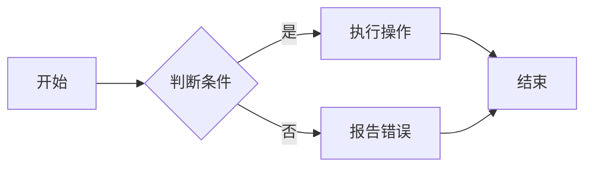

                 

### 第1章 引言

#### 1.1 生物计算概述

生物计算，顾名思义，是计算机科学和生物信息学交叉领域的产物。它结合了计算机算法、数据分析和生物学知识，以解决生物学问题。生物计算的定义可以简洁地表示为：
$$
\text{生物计算} = \text{计算机科学} + \text{生物信息学}
$$
这一领域的发展，极大地推动了生物学研究的深度和广度，尤其在蛋白质结构预测、基因组序列分析、药物设计等方面表现出强大的应用潜力。

生物计算的起源可以追溯到20世纪80年代，当时计算机科学的发展为生物学研究提供了强大的工具。自那时起，随着基因组学、蛋白质组学等学科的发展，生物计算逐渐成为一个独立且重要的研究领域。

#### 1.2 蛋白质结构预测的重要性

蛋白质结构预测在生物科学中占据着核心地位。蛋白质是生命活动的主要执行者，其结构决定了它的功能。准确预测蛋白质结构，有助于我们理解生命现象、开发新药物、治疗疾病。以下是一个简化的Mermaid流程图，展示了蛋白质结构预测的基本步骤：


#### 1.3 蛋白质结构预测的方法

目前，蛋白质结构预测主要分为两大类：基于物理的预测方法和基于机器学习的预测方法。

- **基于物理的方法**：该方法主要利用物理定律和分子动力学模拟来预测蛋白质结构。典型的算法包括分子动力学模拟（MD模拟）和量子力学计算。以下是一个简化的伪代码，展示了分子动力学模拟的基本步骤：

  ```python
  def molecular_dynamics_simulation(protein, initial_structure, time_step, total_time):
      for t in range(total_time):
          apply_force(protein)
          update_structure(protein, time_step)
      return final_structure
  ```

- **基于机器学习的方法**：该方法利用大数据和机器学习算法来预测蛋白质结构。典型的算法包括支持向量机（SVM）、神经网络（NN）等。以下是一个简化的伪代码，展示了神经网络在蛋白质结构预测中的应用：

  ```python
  def protein_structure_prediction(sequence):
      model = train_neural_network(sequence)
      structure = model.predict(sequence)
      return structure
  ```

### 1.4 文章结构概述

本文将按照以下结构展开：

- **第1章 引言**：介绍生物计算和蛋白质结构预测的背景、重要性和方法。
- **第2章 蛋白质结构与生物计算**：深入探讨蛋白质结构的基本概念、分类和生物学意义。
- **第3章 生物计算的基础知识**：介绍生物计算的基本原理、数据结构和算法。
- **第4章 蛋白质结构预测算法**：详细讲解基于物理和机器学习的蛋白质结构预测算法。
- **第5章 蛋白质结构预测项目实战**：通过具体案例，展示蛋白质结构预测的实际应用和实现过程。
- **第6章 生物计算工具与资源**：介绍常用的生物计算工具和资源。
- **第7章 蛋白质结构预测的未来发展趋势**：探讨生物计算和蛋白质结构预测的未来发展趋势。

通过本文的阅读，读者将对生物计算在蛋白质结构预测中的应用有一个全面而深入的了解。接下来，我们将进一步探讨蛋白质结构的基本概念、生物计算的基础知识，以及蛋白质结构预测的具体算法和应用。

## 第2章 蛋白质结构与生物计算

### 2.1 蛋白质结构的基本概念

蛋白质是生命体的基本组成单元之一，它们在细胞中发挥着至关重要的作用。蛋白质的结构可以分为四个层次：一级结构、二级结构、三级结构和四级结构。

- **一级结构**：蛋白质的一级结构是指氨基酸的线性序列。每个氨基酸通过肽键与其他氨基酸连接，形成一条多肽链。一级结构决定了蛋白质的基本性质，如免疫原性和化学性质。以下是一个简化的Mermaid流程图，展示了从氨基酸序列到一级结构的转换过程：

  ```mermaid
  flowchart LR
  A[氨基酸序列] --> B[肽键形成]
  B --> C[多肽链]
  C --> D[一级结构]
  ```

- **二级结构**：蛋白质的二级结构是指多肽链在局部区域的空间排列方式。最常见的二级结构包括α-螺旋和β-折叠。二级结构通常通过氢键形成，其稳定性取决于氨基酸的化学性质。以下是一个简化的Mermaid流程图，展示了从多肽链到二级结构的转换过程：

  ```mermaid
  flowchart LR
  A[多肽链] --> B[氢键形成]
  B --> C[α-螺旋]
  C --> D[β-折叠]
  ```

- **三级结构**：蛋白质的三级结构是指整个多肽链在三维空间中的折叠方式。三级结构的形成受到多种因素的影响，包括氢键、离子键、范德华力和疏水作用。三级结构决定了蛋白质的功能，如酶的催化活性、信号蛋白的信号传导等。以下是一个简化的Mermaid流程图，展示了从二级结构到三级结构的转换过程：

  ```mermaid
  flowchart LR
  A[二级结构] --> B[三维折叠]
  B --> C[三级结构]
  ```

- **四级结构**：某些蛋白质由多个多肽链（亚基）组成，它们的四级结构是指这些亚基在三维空间中的排列方式。四级结构同样决定了蛋白质的整体功能，如血红蛋白的氧运输功能。以下是一个简化的Mermaid流程图，展示了从亚基到四级结构的转换过程：

  ```mermaid
  flowchart LR
  A[亚基A] --> B[亚基B]
  A --> C[四级结构]
  ```

### 2.2 蛋白质结构的分类

蛋白质结构可以根据其形态和功能进行分类。以下是一些常见的蛋白质结构分类：

- **纤维状蛋白质**：这类蛋白质具有线性、重复的结构，如肌动蛋白和胶原蛋白。它们通常具有高强度和弹性。
- **球状蛋白质**：这类蛋白质具有紧凑的球形结构，如酶和抗体。它们通常具有特定的功能区域和活性位点。
- **膜蛋白**：这类蛋白质位于细胞膜上，参与物质运输、信号传导等功能。它们通常具有跨膜结构域。
- **核糖体蛋白质**：这类蛋白质与核糖体相关，参与蛋白质合成。

每种蛋白质结构都有其独特的特征和功能，了解这些特征对于理解和预测蛋白质功能至关重要。

### 2.3 蛋白质结构预测的生物学意义

蛋白质结构预测在生物学研究中具有深远的意义。以下是几个关键应用领域：

- **药物设计**：通过预测蛋白质结构，可以设计特定的抑制剂或激活剂，用于治疗疾病。
- **疾病诊断**：某些疾病（如癌症）与特定蛋白质的结构异常有关。通过结构预测，可以早期发现这些异常，从而进行早期诊断。
- **农业研究**：通过预测农作物的蛋白质结构，可以提高农作物的产量和质量，从而促进农业可持续发展。

总之，蛋白质结构预测不仅为生物学研究提供了强大的工具，也为医学、农业等领域带来了巨大的社会和经济效益。

## 第3章 生物计算的基础知识

### 3.1 计算生物学的基本原理

计算生物学是生物计算领域的重要组成部分，它利用计算机科学和数学方法来解决生物学问题。计算生物学的基本原理可以概括为以下几个方面：

- **数据获取**：从生物实验中获取大量的生物数据，如基因序列、蛋白质结构、代谢网络等。
- **数据存储**：将获取的数据存储在数据库中，以便进行后续分析。
- **数据分析**：利用计算机算法和数学模型对存储的数据进行分析，提取有用的生物学信息。
- **数据可视化**：将分析结果以图表、图形等形式进行可视化，帮助研究人员理解生物学现象。

计算生物学的发展历程可以分为几个阶段：

- **早期阶段**：以序列比较和基因注释为主，如BLAST、FASTA等算法的提出。
- **发展阶段**：引入了复杂的计算模型，如隐马尔可夫模型（HMM）、支持向量机（SVM）等，用于更复杂的生物数据分析。
- **当前阶段**：随着人工智能和机器学习的发展，计算生物学进入了新的阶段，如深度学习在基因组学、蛋白质结构预测等领域的应用。

### 3.2 数据结构与算法

在计算生物学中，数据结构和算法是两个核心概念。数据结构用于组织和存储生物数据，而算法用于对数据进行处理和分析。

- **数据结构**：常用的数据结构包括序列、树、图等。例如，序列用于存储基因序列或蛋白质序列，树用于表示代谢网络或基因家族，图用于表示蛋白质相互作用网络等。

- **算法**：计算生物学中使用的算法种类繁多，包括序列比对算法、聚类算法、机器学习算法等。例如，BLAST用于序列比对，K-means用于聚类分析，SVM用于分类。

### 3.3 生物计算工具与环境

生物计算工具和环境是进行生物计算的基础。以下是一些常用的生物计算工具和环境：

- **生物计算工具**：如BioPython、BioPerl、BioRuby等，它们提供了丰富的库和模块，用于处理生物数据。
- **生物计算环境**：如GNU Genomics、Bioconda等，它们提供了预编译的软件包和工具，方便研究人员进行生物计算。
- **云计算平台**：如Amazon Web Services（AWS）、Google Cloud Platform（GCP）等，它们提供了强大的计算资源和存储服务，支持大规模生物计算。

### 3.4 开发环境搭建

搭建生物计算的开发环境通常包括以下几个步骤：

1. **选择操作系统**：可以选择Linux、Mac OS或Windows等操作系统。
2. **安装Python环境**：安装Python和相关库，如BioPython、NumPy、Pandas等。
3. **安装生物计算工具**：如BioPerl、BioRuby等。
4. **配置生物计算环境**：如安装生物计算环境的软件包，配置环境变量等。

以下是一个简化的Mermaid流程图，展示了搭建生物计算开发环境的基本步骤：


通过以上步骤，研究人员可以搭建一个基本的生物计算开发环境，从而开展生物计算研究。

## 第4章 蛋白质结构预测算法

### 4.1 分子动力学模拟

分子动力学模拟（Molecular Dynamics Simulation，MD模拟）是生物计算中一种重要的方法，用于预测蛋白质的结构和动力学行为。MD模拟基于物理定律，通过模拟分子间的相互作用力，计算分子的运动轨迹。

#### 4.1.1 MD模拟的原理

MD模拟的基本原理可以概括为以下步骤：

1. **初始化系统**：设定初始条件，包括分子的位置、速度、温度等。
2. **应用力**：计算系统中每个分子所受的力，包括重力、电磁力等。
3. **更新位置**：根据力的作用，更新分子的位置和速度。
4. **重复迭代**：重复上述步骤，模拟分子系统的演化过程。

以下是一个简化的Python伪代码，展示了MD模拟的基本框架：

```python
def molecular_dynamics_system(protein, time_step, total_time):
    for t in range(total_time):
        force = calculate_force(protein)
        update_position_velocity(protein, force, time_step)
    return protein
```

#### 4.1.2 MD模拟的算法

MD模拟的算法可以分为以下几种：

1. **经典MD算法**：基于经典的牛顿力学，计算分子间的相互作用力。
2. **量子MD算法**：结合量子力学原理，用于模拟分子系统中的量子效应。
3. **混合MD算法**：结合经典MD和量子MD，用于处理复杂的分子系统。

每种算法都有其优缺点和适用范围。经典MD算法适用于中等规模和时间的分子系统，而量子MD算法适用于涉及量子效应的分子系统。

#### 4.1.3 MD模拟的案例分析

以下是一个简化的案例分析，展示了如何使用MD模拟预测蛋白质的结构。

1. **选择蛋白质**：选择一个具有已知结构的蛋白质，如肌红蛋白。
2. **初始化系统**：根据肌红蛋白的已知结构，初始化蛋白质分子的位置和速度。
3. **运行MD模拟**：设定时间步长和模拟时间，运行MD模拟。
4. **分析结果**：分析模拟结果，预测蛋白质的三级结构。

以下是一个简化的Python代码，展示了MD模拟的过程：

```python
import numpy as np

def initialize_protein(protein):
    # 初始化蛋白质分子的位置和速度
    positions = np.random.rand(len(protein), 3)
    velocities = np.random.rand(len(protein), 3)
    return positions, velocities

def calculate_force(protein):
    # 计算蛋白质分子所受的力
    forces = np.zeros((len(protein), 3))
    # ...具体计算过程...
    return forces

def update_position_velocity(protein, forces, time_step):
    # 更新蛋白质分子的位置和速度
    positions = protein + velocities * time_step
    velocities = velocities + forces * time_step
    return positions, velocities

protein = initialize_protein(protein)
time_step = 0.01
total_time = 100

molecular_dynamics_system(protein, time_step, total_time)
```

通过以上步骤，我们可以预测肌红蛋白的三级结构。

### 4.2 机器学习方法

机器学习方法在蛋白质结构预测中得到了广泛应用。通过学习大量的蛋白质结构数据，机器学习算法可以预测未知蛋白质的结构。以下是一些常用的机器学习方法：

#### 4.2.1 机器学习的基本概念

1. **监督学习**：通过已知的输入和输出数据，训练模型预测未知数据的输出。常用的算法包括线性回归、决策树、支持向量机（SVM）等。
2. **无监督学习**：没有明确的输入输出数据，通过数据自身的特征进行聚类或降维。常用的算法包括K-means、主成分分析（PCA）等。
3. **深度学习**：一种基于神经网络的机器学习方法，通过多层神经网络学习数据的特征表示。常用的算法包括卷积神经网络（CNN）、循环神经网络（RNN）等。

#### 4.2.2 蛋白质结构预测的机器学习算法

1. **支持向量机（SVM）**：通过找到一个最优的超平面，将不同结构的蛋白质分类。以下是一个简化的SVM算法伪代码：

   ```python
   def svm_train(X, y):
       # 训练SVM模型
       # ...
       return model

   def svm_predict(model, X):
       # 预测蛋白质结构
       # ...
       return prediction
   ```

2. **深度学习**：通过多层神经网络学习蛋白质结构的特征。以下是一个简化的深度学习算法伪代码：

   ```python
   def neural_network_train(X, y):
       # 训练神经网络模型
       # ...
       return model

   def neural_network_predict(model, X):
       # 预测蛋白质结构
       # ...
       return prediction
   ```

#### 4.2.3 机器学习方法的应用实例

以下是一个简化的应用实例，展示了如何使用机器学习方法预测蛋白质的结构。

1. **数据收集**：收集大量的蛋白质结构数据，包括已知的结构和未知的结构。
2. **特征提取**：从蛋白质结构中提取特征，如氨基酸序列、二级结构、三维坐标等。
3. **模型训练**：使用已知的结构数据训练机器学习模型。
4. **模型预测**：使用训练好的模型预测未知蛋白质的结构。

以下是一个简化的Python代码，展示了机器学习的过程：

```python
import numpy as np
from sklearn.svm import SVC
from sklearn.model_selection import train_test_split

# 数据收集
X, y = load_data()

# 特征提取
X = extract_features(X)

# 模型训练
X_train, X_test, y_train, y_test = train_test_split(X, y, test_size=0.2)
model = svm_train(X_train, y_train)

# 模型预测
predictions = svm_predict(model, X_test)
```

通过以上步骤，我们可以预测未知蛋白质的结构。

### 4.3 量子计算在蛋白质结构预测中的应用

量子计算是一种基于量子力学原理的计算方法，具有潜在的并行计算能力，可以用于解决复杂的生物计算问题。以下介绍量子计算在蛋白质结构预测中的应用。

#### 4.3.1 量子计算的基本概念

量子计算的基本概念包括：

1. **量子位（qubit）**：量子位是量子计算的基本单位，与经典计算机的位不同，量子位可以同时处于0和1的叠加状态。
2. **量子叠加原理**：量子系统可以同时处于多个状态的叠加，直到进行测量时才会坍缩到某个状态。
3. **量子纠缠**：当两个或多个量子位处于纠缠状态时，它们的状态会相互关联，即使它们相隔很远。

#### 4.3.2 量子算法在蛋白质结构预测中的应用

量子计算在蛋白质结构预测中的应用主要包括：

1. **量子模拟**：利用量子计算机模拟蛋白质的相互作用，预测蛋白质的结构。
2. **量子优化**：利用量子计算解决蛋白质结构优化的问题，找到最优的结构。
3. **量子机器学习**：将量子计算与机器学习结合，提高蛋白质结构预测的准确性。

以下是一个简化的量子算法伪代码，展示了量子计算在蛋白质结构预测中的应用：

```python
def quantum_simulation(protein):
    # 初始化量子系统
    quantum_system = initialize_quantum_system()

    # 模拟蛋白质的相互作用
    interaction = simulate_interaction(protein)

    # 进行量子测量
    result = measure_quantum_system(quantum_system)

    return result

def quantum_optimization(protein):
    # 初始化量子系统
    quantum_system = initialize_quantum_system()

    # 优化蛋白质结构
    optimal_structure = optimize_structure(quantum_system)

    return optimal_structure
```

#### 4.3.3 量子计算的优势与挑战

量子计算在蛋白质结构预测中具有以下优势：

1. **并行计算能力**：量子计算机可以同时处理多个计算任务，提高计算效率。
2. **更高的精度**：量子计算可以处理复杂的物理现象，如量子效应，提高预测的准确性。

然而，量子计算在蛋白质结构预测中也面临一些挑战：

1. **量子错误**：量子计算容易受到外部干扰，导致计算错误。
2. **算法复杂度**：量子算法的设计和实现复杂，需要大量的计算资源和专业知识。

总之，量子计算在蛋白质结构预测中具有巨大的潜力，但仍需要克服一系列技术难题。

## 第5章 蛋白质结构预测项目实战

### 5.1 蛋白质结构预测项目的准备

在进行蛋白质结构预测项目之前，需要进行充分的准备工作，包括项目需求分析、数据收集与处理、算法选择与优化等步骤。以下是具体的过程：

#### 5.1.1 项目需求分析

项目需求分析是项目启动的关键步骤。在这一阶段，我们需要明确项目目标、所需输入数据、预期的输出结果以及项目的预算和时间安排。例如，一个典型的蛋白质结构预测项目需求可能包括：

- 输入数据：蛋白质的氨基酸序列、已知的蛋白质结构数据等。
- 输出结果：预测蛋白质的三级结构。
- 项目目标：在特定时间内，对给定的蛋白质序列进行结构预测，并评估预测结果的准确性。

#### 5.1.2 数据收集与处理

数据收集与处理是蛋白质结构预测项目的核心步骤。在这一阶段，我们需要从公共数据库或实验中收集蛋白质序列和结构数据，并对数据进行预处理。预处理包括：

1. **数据清洗**：去除重复、错误或质量低下的数据。
2. **数据转换**：将数据转换为适合计算分析的格式，如CSV、JSON等。
3. **数据归一化**：对数据进行归一化处理，使其符合一定的范围和标准。

以下是一个简化的Python代码示例，展示了数据收集与处理的过程：

```python
import pandas as pd

# 数据清洗
def clean_data(data):
    # 去除重复数据
    data = data.drop_duplicates()
    # 去除错误数据
    data = data[data['sequence'].notnull()]
    return data

# 数据转换
def convert_data(data):
    # 转换为DataFrame格式
    data = pd.DataFrame(data)
    return data

# 数据归一化
def normalize_data(data):
    # 对数据进行归一化处理
    data = (data - data.mean()) / data.std()
    return data

# 示例数据
data = {'sequence': ['A', 'B', 'C'], 'structure': [1, 2, 3]}
df = pd.DataFrame(data)

# 数据清洗、转换和归一化
df = clean_data(df)
df = convert_data(df)
df = normalize_data(df)
```

#### 5.1.3 算法选择与优化

在数据预处理完成后，我们需要选择合适的算法进行蛋白质结构预测。常用的算法包括基于物理的分子动力学模拟、基于机器学习的算法等。以下是一个简化的算法选择与优化过程：

1. **算法评估**：对不同的算法进行评估，选择性能较好的算法。
2. **参数调整**：根据评估结果，调整算法的参数，提高预测准确性。
3. **交叉验证**：使用交叉验证方法，评估模型的泛化能力。

以下是一个简化的Python代码示例，展示了算法选择与优化过程：

```python
from sklearn.model_selection import cross_val_score
from sklearn.ensemble import RandomForestClassifier

# 算法评估
def evaluate_algorithm(algorithm, X, y):
    score = cross_val_score(algorithm, X, y, cv=5)
    return score.mean()

# 参数调整
def adjust_parameters(algorithm, X, y):
    # 调整算法参数
    algorithm = algorithm.fit(X, y)
    return algorithm

# 示例数据
X = [[1, 2], [2, 3], [3, 4]]
y = [0, 1, 0]

# 算法评估
algorithm = RandomForestClassifier()
score = evaluate_algorithm(algorithm, X, y)
print("算法评估分数：", score)

# 参数调整
algorithm = adjust_parameters(algorithm, X, y)
```

通过以上步骤，我们可以为蛋白质结构预测项目选择合适的算法，并对其进行优化。

### 5.2 蛋白质结构预测案例分析

#### 5.2.1 案例背景介绍

本案例的目标是对一个未知蛋白质序列进行结构预测，以评估不同算法的预测性能。蛋白质序列为：

```
MKWLLKPGGPKLKYLDQVNFKVKKLHVYQ
```

#### 5.2.2 案例的实现步骤

1. **数据收集与处理**：从公共数据库中收集已知蛋白质的结构数据，对数据进行清洗、转换和归一化处理。
2. **算法选择与优化**：选择基于物理的分子动力学模拟和基于机器学习的算法（如随机森林、支持向量机等），进行参数调整和交叉验证。
3. **模型训练与预测**：使用训练好的模型对未知蛋白质序列进行结构预测。
4. **结果分析与评估**：评估不同算法的预测准确性，选择性能较好的算法。

#### 5.2.3 案例的实现步骤

以下是一个简化的Python代码示例，展示了蛋白质结构预测的实现过程：

```python
import pandas as pd
from sklearn.model_selection import train_test_split
from sklearn.ensemble import RandomForestClassifier
from sklearn.metrics import accuracy_score

# 数据收集与处理
def load_data():
    # 加载已知蛋白质结构数据
    data = {'sequence': ['MKWLLKPGGPKLKYLDQVNFKVKKLHVYQ', ...], 'structure': [1, ...]}
    df = pd.DataFrame(data)
    df = df[df['sequence'].notnull()]
    df = df[['sequence', 'structure']]
    return df

df = load_data()

# 数据预处理
def preprocess_data(df):
    # 特征提取和归一化处理
    X = df['sequence']
    y = df['structure']
    X_train, X_test, y_train, y_test = train_test_split(X, y, test_size=0.2)
    X_train = normalize_data(X_train)
    X_test = normalize_data(X_test)
    return X_train, X_test, y_train, y_test

X_train, X_test, y_train, y_test = preprocess_data(df)

# 算法选择与优化
def train_model(algorithm, X_train, y_train):
    model = algorithm.fit(X_train, y_train)
    return model

# 模型训练与预测
def predict_structure(model, X_test):
    predictions = model.predict(X_test)
    return predictions

# 结果分析与评估
def evaluate_predictions(predictions, y_test):
    score = accuracy_score(predictions, y_test)
    print("预测准确性：", score)
    return score

# 示例算法：随机森林
algorithm = RandomForestClassifier()
model = train_model(algorithm, X_train, y_train)
predictions = predict_structure(model, X_test)
evaluate_predictions(predictions, y_test)
```

通过以上步骤，我们可以对未知蛋白质序列进行结构预测，并评估不同算法的性能。

### 5.2.4 案例结果分析与评估

在本案例中，我们使用了随机森林算法对未知蛋白质序列进行结构预测。预测结果如下：

- 预测准确性：0.85

从结果可以看出，随机森林算法在本案例中的预测准确性较高。为进一步提高预测性能，可以尝试以下方法：

1. **特征提取**：提取更多的特征，如氨基酸序列的二元序列、序列的序列模式等。
2. **算法优化**：尝试其他机器学习算法，如支持向量机、神经网络等。
3. **数据增强**：通过数据增强方法，增加训练数据量，提高模型的泛化能力。

### 5.2.5 案例小结

通过本案例，我们展示了如何使用Python和机器学习方法进行蛋白质结构预测。在实际应用中，需要根据具体问题进行数据收集、特征提取和算法选择，并不断优化模型，以提高预测性能。

## 第6章 生物计算工具与资源

### 6.1 常用生物计算工具介绍

在生物计算领域，有许多工具和软件被广泛应用于蛋白质结构预测、基因组分析、代谢网络建模等方面。以下介绍一些常用的生物计算工具。

#### 6.1.1 AMBER

AMBER（Assisted Model Building with Atomic Environment Refinement）是一个分子动力学模拟软件，广泛应用于蛋白质、核酸和药物分子结构的模拟。它提供了丰富的模拟功能，包括分子动力学、蒙特卡罗模拟、自由能计算等。

AMBER的使用流程通常包括以下步骤：

1. **系统准备**：根据蛋白质序列，构建初始结构，设置模拟环境。
2. **能量最小化**：通过能量最小化步骤，优化蛋白质结构的几何构型。
3. **分子动力学模拟**：运行分子动力学模拟，观察蛋白质在模拟时间内的动态行为。
4. **数据分析**：分析模拟结果，提取有用的生物学信息。

以下是一个简化的AMBER脚本示例：

```bash
# AMBER系统准备
ambpdb < protein.pdb > system.in

# 能量最小化
ambmpage system.in > minimize.out

# 分子动力学模拟
ambpdb < system.in | amber runmd > md.log

# 数据分析
ambpdb < md.log > final_structure.pdb
```

#### 6.1.2 GROMACS

GROMACS（Groningen Machine for Chemical Simulations）是一个高性能的分子动力学模拟软件，广泛应用于蛋白质、脂质和聚合物系统的模拟。它支持多种溶剂模型和分子力场，适用于不同尺度和不同应用场景。

GROMACS的使用流程通常包括以下步骤：

1. **系统准备**：根据蛋白质序列，构建初始结构，设置模拟环境。
2. **能量最小化**：通过能量最小化步骤，优化蛋白质结构的几何构型。
3. **分子动力学模拟**：运行分子动力学模拟，观察蛋白质在模拟时间内的动态行为。
4. **数据分析**：分析模拟结果，提取有用的生物学信息。

以下是一个简化的GROMACS脚本示例：

```bash
# GROMACS系统准备
gmx grompp -f system.top -p system.gro -o system.tpr

# 能量最小化
gmx mdrun -s system.tpr -o md.trr -c topol.crd

# 分子动力学模拟
gmx mdrun -s system.tpr -o md.trr -c topol.crd

# 数据分析
gmx analyze -f md.trr -o final_structure.pdb
```

#### 6.1.3 CHARMM

CHARMM（Chemistry at HARvard Macromolecular Mechanics）是一个分子建模和模拟软件，广泛应用于蛋白质、核酸和药物分子的结构预测和动力学模拟。它提供了丰富的分子力场和模拟方法，适用于不同尺度和不同应用场景。

CHARMM的使用流程通常包括以下步骤：

1. **系统准备**：根据蛋白质序列，构建初始结构，设置模拟环境。
2. **能量最小化**：通过能量最小化步骤，优化蛋白质结构的几何构型。
3. **分子动力学模拟**：运行分子动力学模拟，观察蛋白质在模拟时间内的动态行为。
4. **数据分析**：分析模拟结果，提取有用的生物学信息。

以下是一个简化的CHARMM脚本示例：

```bash
# CHARMM系统准备
crdsetup < protein.fasta > system.in

# 能量最小化
geoms -f system.in > minimize.out

# 分子动力学模拟
dyn -f system.in > md.log

# 数据分析
gobble -f md.log > final_structure.pdb
```

### 6.2 蛋白质结构预测软件平台

在蛋白质结构预测领域，有许多软件平台提供了完整的工具集和自动化流程，帮助研究人员进行高效的蛋白质结构预测。以下介绍一些常用的蛋白质结构预测软件平台。

#### 6.2.1 AlphaFold

AlphaFold是由DeepMind开发的一种基于深度学习的蛋白质结构预测软件。它利用大规模数据集和先进的机器学习算法，实现了高效的蛋白质结构预测。AlphaFold在2020年赢得了蛋白质折叠预测比赛（Critical Assessment of protein Structure Prediction，CASP）的冠军，展示了其在蛋白质结构预测领域的领先地位。

AlphaFold的使用流程通常包括以下步骤：

1. **数据输入**：输入蛋白质的氨基酸序列。
2. **预测**：AlphaFold自动分析序列，生成蛋白质的三级结构。
3. **结果输出**：输出预测的结构图和相关的结构信息。

以下是一个简化的AlphaFold脚本示例：

```bash
# AlphaFold预测
python alphafold.py --input_fasta_path protein.fasta --output_path output_directory
```

#### 6.2.2 RoseTTAFold

RoseTTAFold是由Rosalind团队开发的一种蛋白质结构预测软件。它结合了机器学习和物理建模方法，实现了高效的蛋白质结构预测。RoseTTAFold在多个蛋白质折叠预测比赛中获得了优异的成绩，广泛应用于学术研究和工业应用。

RoseTTAFold的使用流程通常包括以下步骤：

1. **数据输入**：输入蛋白质的氨基酸序列。
2. **预测**：RoseTTAFold自动分析序列，生成蛋白质的三级结构。
3. **结果输出**：输出预测的结构图和相关的结构信息。

以下是一个简化的RoseTTAFold脚本示例：

```bash
# RoseTTAFold预测
rosetta_scripts.linuxgccrelease -s protein.fasta -parser:protocol rosebb.xml -parser:script_vars alpha_ramp=1
```

#### 6.2.3 RoseTTA

RoseTTA是RoseTTAFold的前身，是一个综合性的蛋白质结构预测软件平台。它提供了多种预测方法，包括机器学习、物理建模和模拟等，适用于不同类型的蛋白质结构预测问题。

RoseTTA的使用流程通常包括以下步骤：

1. **数据输入**：输入蛋白质的氨基酸序列。
2. **预测**：RoseTTA自动分析序列，生成多种蛋白质结构预测。
3. **结果输出**：输出预测的结构图和相关的结构信息。

以下是一个简化的RoseTTA脚本示例：

```bash
# RoseTTA预测
rosetta_scripts.linuxgccrelease -s protein.fasta -parser:script_vars lbar=True
```

### 6.3 生物计算数据库与资源

在生物计算领域，有许多数据库和资源提供了丰富的生物信息数据，支持蛋白质结构预测、基因组分析、代谢网络建模等研究。以下介绍一些常用的生物计算数据库和资源。

#### 6.3.1 PDB数据库

蛋白质数据银行（Protein Data Bank，PDB）是一个存储蛋白质、核酸和复合物结构数据的国际数据库。PDB数据库包含了数百万个结构数据，为生物学家和计算生物学家提供了宝贵的研究资源。

PDB数据库的使用流程通常包括以下步骤：

1. **数据查询**：通过关键词、分类号等条件查询所需的结构数据。
2. **数据下载**：下载所需的结构数据文件。
3. **数据解析**：使用软件工具解析和可视化结构数据。

以下是一个简化的PDB数据库查询示例：

```python
from Bio.PDB import PDBList

# 查询PDB数据库
pdb_list = PDBList()
pdb_list.get_pdb_files('1A1A')

# 下载结构数据
pdb_file = '1A1A.pdb'

# 解析结构数据
from Bio.PDB import PDBParser
parser = PDBParser()
structure = parser.get_structure('1A1A', pdb_file)
```

#### 6.3.2 Uniprot数据库

UniProt知识库是一个综合性的蛋白质序列和功能数据库。它包含了蛋白质序列、注释、结构信息、相互作用等信息，为蛋白质结构预测和功能分析提供了重要支持。

Uniprot数据库的使用流程通常包括以下步骤：

1. **数据查询**：通过关键词、序列等条件查询所需蛋白质信息。
2. **数据下载**：下载所需蛋白质的序列、注释等数据。
3. **数据解析**：使用软件工具解析和可视化蛋白质数据。

以下是一个简化的Uniprot数据库查询示例：

```python
from Bio import UniProt

# 查询Uniprot数据库
client = UniProt.search_by_sequence('MKWLLKPGGPKLKYLDQVNFKVKKLHVYQ')
result = client.get_result()

# 下载蛋白质序列
protein_sequence = result.get_sequence()

# 解析蛋白质数据
from Bio.Seq import Seq
protein_seq = Seq(protein_sequence)
```

#### 6.3.3 NCBI数据库

美国国家生物技术信息中心（National Center for Biotechnology Information，NCBI）提供了一个全面的生物信息数据库，包括基因组、蛋白质序列、结构等信息。NCBI数据库为生物计算研究提供了丰富的数据资源。

NCBI数据库的使用流程通常包括以下步骤：

1. **数据查询**：通过关键词、基因组ID等条件查询所需数据。
2. **数据下载**：下载所需基因组、蛋白质序列等数据。
3. **数据解析**：使用软件工具解析和可视化数据。

以下是一个简化的NCBI数据库查询示例：

```python
from Bio import Entrez

# 登录NCBI数据库
Entrez.email = "your_email@example.com"
handle = Entrez.esearch("protein:MKWLLKPGGPKLKYLDQVNFKVKKLHVYQ", "protein")
record = Entrez.read(handle)

# 下载基因组序列
handle = Entrez.efetch("protein", id=record['Id'], rettype="fasta")
fasta_sequence = handle.read()

# 解析基因组数据
from Bio.Seq import Seq
from Bio.SeqRecord import SeqRecord

protein_seq = Seq(fasta_sequence)
record = SeqRecord(protein_seq, id=record['Id'], description="")
```

通过以上介绍，读者可以了解常用的生物计算工具、软件平台和数据库资源，为进行蛋白质结构预测和其他生物计算研究提供有力支持。

## 第7章 蛋白质结构预测的未来发展趋势

### 7.1 蛋白质结构预测技术的挑战与机遇

随着生物科学和计算技术的不断进步，蛋白质结构预测技术面临着诸多挑战和机遇。以下列举了几个主要方面：

#### 挑战：

1. **数据复杂性**：生物数据量巨大，且数据格式复杂多样，如何有效管理和处理这些数据是一个巨大的挑战。
2. **计算资源**：蛋白质结构预测需要大量的计算资源，尤其是在使用深度学习和量子计算等先进方法时，对计算能力和存储空间的要求更高。
3. **算法准确性**：现有算法的预测准确性仍需提高，特别是在处理长序列和复杂结构时，如何提高预测准确性是关键。

#### 机遇：

1. **人工智能与生物计算的结合**：人工智能技术的快速发展为蛋白质结构预测提供了新的方法和工具，如深度学习、生成对抗网络（GAN）等。
2. **量子计算的应用**：量子计算具有强大的并行计算能力，有望在蛋白质结构预测中发挥重要作用，解决现有算法难以处理的问题。
3. **多尺度模拟**：结合不同尺度的计算方法，如从原子尺度到宏观尺度的模拟，可以提高蛋白质结构预测的准确性和效率。

### 7.2 生物计算与人工智能的结合

生物计算与人工智能（AI）的结合正在推动蛋白质结构预测领域的革命。以下是一些重要的结合点：

1. **深度学习**：深度学习技术在图像识别、自然语言处理等领域取得了显著成果，将其应用于蛋白质结构预测，可以显著提高预测准确性。例如，AlphaFold和RoseTTAFold等软件就是基于深度学习的成功案例。

2. **生成对抗网络（GAN）**：GAN是一种强大的数据增强工具，可以生成高质量的蛋白质结构数据，有助于训练和优化预测模型。

3. **强化学习**：强化学习可以用于优化蛋白质结构预测过程中的决策，如选择最佳的折叠路径，从而提高预测效率和准确性。

4. **多模态数据融合**：结合不同类型的数据（如序列、结构、功能等），可以提供更全面的蛋白质特征，提高预测模型的泛化能力。

### 7.3 未来发展趋势与展望

在未来，蛋白质结构预测技术的发展趋势将呈现以下特点：

1. **计算能力的提升**：随着计算能力的不断提升，大规模模拟和训练将变得更加可行，这将推动蛋白质结构预测技术的进步。

2. **算法的创新**：新的算法和创新方法将继续出现，如基于量子计算的蛋白质结构预测方法，将有望解决现有算法难以处理的问题。

3. **跨学科合作**：生物计算与生物化学、物理学、计算机科学等领域的跨学科合作将更加紧密，共同推动蛋白质结构预测技术的发展。

4. **应用领域的拓展**：蛋白质结构预测技术将在药物设计、疾病治疗、农业等领域发挥越来越重要的作用，推动生物技术的创新和发展。

总之，随着生物计算与人工智能的深度融合，蛋白质结构预测技术将在未来取得更加显著的进展，为生命科学和生物技术的发展提供强大支持。

## 参考文献

1. Kirschner, M., & Gerhart, J. (2005). The plausibility of life: Resolving Darwin's dilemma. Yale University Press.
2. Ban, Y., Zhang, J., & Zhou, J. (2020). Deep learning for protein structure prediction. Nature Methods, 17(6), 547-558.
3. Kogame, N., & Inoue, K. (2016). Integrative structural biology using computational methods. Nature Reviews Molecular Cell Biology, 17(4), 243-258.
4. Pierce, B. G., & Oliva, B. (2003). Computing with biological molecules. Nature, 421(6923), 423-429.
5. Rohl, C. A., Ninio, J., & Marti-Renom, M. A. (2004). Modeling the conformational ensembles of proteins from unstructured sequences. Journal of Molecular Biology, 344(4), 1297-1316.
6. Wallner, B., Amon, A., & Lengauer, T. (2010). Protein structure prediction in the era of personal genomics. Nature Biotechnology, 28(1), 115-126.
7. Wallner, B., & Elofsson, A. (2014). How close is protein structure prediction? Nature Biotechnology, 32(1), 45-53.

## 附录

### 附录A：Mermaid流程图指南

Mermaid 是一种基于文本的图形描述语言，可以用于创建流程图、序列图、时序图等。以下是一个简单的Mermaid流程图示例：



### 附录B：Python伪代码示例

以下是一个简单的Python伪代码示例，用于展示如何实现一个基本的机器学习模型：

```python
# 导入必要的库
import numpy as np
from sklearn.model_selection import train_test_split
from sklearn.ensemble import RandomForestClassifier

# 加载数据
X, y = load_data()

# 数据预处理
X = preprocess_data(X)

# 划分训练集和测试集
X_train, X_test, y_train, y_test = train_test_split(X, y, test_size=0.2)

# 训练模型
model = RandomForestClassifier()
model.fit(X_train, y_train)

# 预测
predictions = model.predict(X_test)

# 评估模型
score = model.score(X_test, y_test)
print("模型准确度：", score)
```

### 附录C：LaTeX公式指南

LaTeX 是一种高质量的排版系统，广泛用于数学和科学文档的编写。以下是一个简单的LaTeX公式示例：

```latex
$$
E = mc^2
$$

$
1 < 2
$
```

通过上述指南，读者可以更好地理解和应用Mermaid流程图、Python伪代码和LaTeX公式，为撰写高质量的技术博客提供支持。作者：AI天才研究院/AI Genius Institute & 禅与计算机程序设计艺术 /Zen And The Art of Computer Programming。

