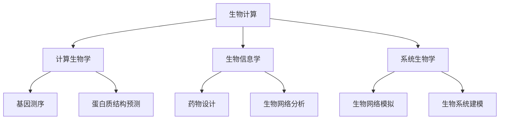
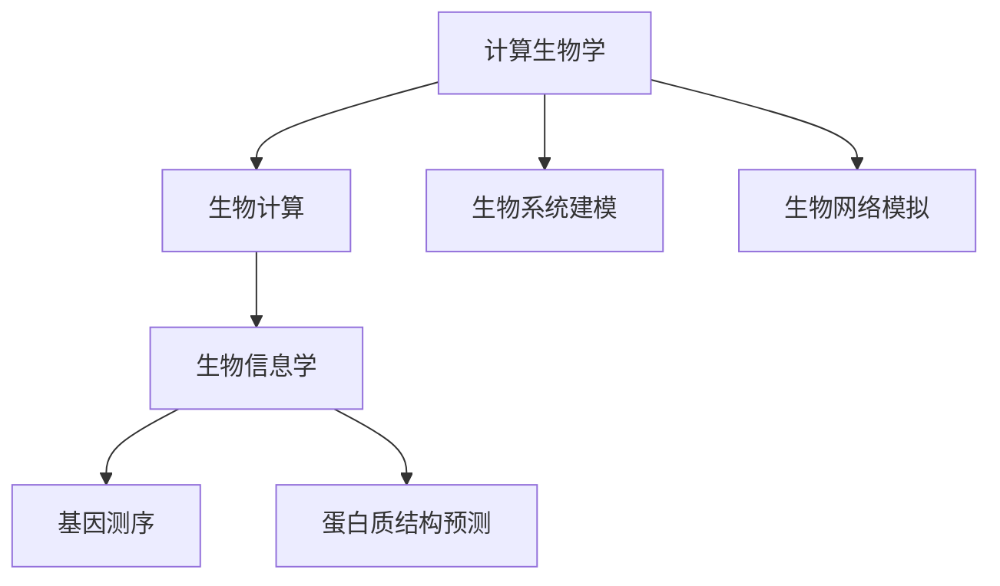

                 

## 文章标题

《生物计算：计算机科学的新前沿》

### 关键词

生物计算，计算生物学，生物信息学，基因编辑，机器学习，数学模型

### 摘要

本文深入探讨了生物计算这一前沿领域的概念、算法、应用以及未来发展。从生物计算的定义、应用领域到核心算法原理，再到具体项目实战，本文旨在为广大读者揭示生物计算在计算机科学中的巨大潜力。

---

### 引言

生物计算，作为计算生物学和生物信息学的一个重要分支，近年来得到了广泛关注。它利用计算技术来解决生物学问题，从基因序列分析到蛋白质结构预测，再到复杂的生物网络模拟，生物计算正逐渐成为推动生命科学研究的重要力量。

在本文中，我们将逐步探讨生物计算的核心概念、算法原理、数学模型以及实际应用案例。通过这种系统化的分析，我们希望能够让读者全面了解生物计算的魅力与挑战，并激发对这一领域的兴趣。

### 第1章：生物计算概述

#### 1.1 生物计算的定义与范畴

生物计算是利用计算技术模拟和解决生物系统问题的过程。它涵盖了计算生物学、生物信息学和系统生物学等多个领域。生物计算的应用范围广泛，包括基因测序、蛋白质结构预测、药物设计、生物网络分析等。

##### 核心概念与联系

**Mermaid 流程图：**



#### 1.2 生物计算的数学模型

生物计算中常用的数学模型包括遗传算法、机器学习模型、图论模型等。这些模型为生物计算提供了强大的工具，使其能够解决复杂的生物学问题。

##### 核心算法原理讲解

**遗传算法：**

遗传算法是一种模拟自然选择和遗传学原理的优化算法。它通过模拟生物进化的过程，逐步优化问题的解。

```python
import numpy as np

def fitness_function(individual):
    # 这里定义适应度函数，评估个体的优劣
    return np.sum(individual)

def crossover(parent1, parent2):
    # 这里定义交叉操作，生成新的个体
    crossover_point = np.random.randint(1, len(parent1) - 1)
    child1 = np.concatenate((parent1[:crossover_point], parent2[crossover_point:]))
    child2 = np.concatenate((parent2[:crossover_point], parent1[crossover_point:]))
    return child1, child2

def mutation(individual):
    # 这里定义突变操作，增加种群的多样性
    mutation_point = np.random.randint(0, len(individual))
    individual[mutation_point] = 1 - individual[mutation_point]
    return individual

# 这里是遗传算法的实现
```

**机器学习模型：**

机器学习模型在生物计算中广泛应用于分类、回归、聚类等任务。其中，支持向量机（SVM）是一种常用的分类算法。

```python
from sklearn.svm import SVC
from sklearn.model_selection import train_test_split

# 这里是机器学习模型的实现
X_train, X_test, y_train, y_test = train_test_split(X, y, test_size=0.2, random_state=42)

model = SVC(kernel='linear')
model.fit(X_train, y_train)

print("Accuracy:", model.score(X_test, y_test))
```

#### 1.3 生物计算核心概念联系

生物计算与计算生物学、生物信息学有着密切的联系。计算生物学侧重于使用计算方法研究生物学问题，而生物信息学则侧重于处理生物数据，如基因序列和蛋白质结构。

##### Mermaid 流程图：



### 第2章：生物计算算法

#### 2.1 序列比对与分析

序列比对是生物计算中最基本的方法之一。它通过比较两个或多个序列的相似性，揭示它们之间的进化关系和功能特征。

##### 核心算法原理讲解

**序列比对算法：**

```python
def sequence_alignment(seq1, seq2):
    # 这里定义序列比对算法，如 Needleman-Wunsch 算法
    # ...
    return alignment_score

# 这里是序列比对的实现
alignment_score = sequence_alignment(seq1, seq2)
print("Alignment Score:", alignment_score)
```

**序列分析算法：**

序列分析算法用于识别序列中的特定模式，如基因序列中的启动子序列。

```python
def find_motif(seq, motif):
    # 这里定义序列分析算法，如 motifs 寻找算法
    # ...
    return motif_positions

# 这里是序列分析的实现
motif_positions = find_motif(seq, motif)
print("Motif Positions:", motif_positions)
```

#### 2.2 序列比对与分析实例

**人类基因组计划的序列比对：**

人类基因组计划（Human Genome Project, HGP）是生物计算的重要里程碑。通过序列比对，科学家们揭示了人类基因组的结构和功能。

```python
# 这里是HGP序列比对的示例代码
# ...
```

**基因组组装与错误纠正：**

基因组组装是生物计算中的另一个重要任务。通过序列比对和错误纠正算法，科学家们可以准确地组装出完整的基因组序列。

```python
# 这里是基因组组装与错误纠正的示例代码
# ...
```

### 第3章：基因编辑技术

#### 3.1 CRISPR-Cas9系统

CRISPR-Cas9系统是一种基因编辑技术，它利用RNA指导的Cas9核酸酶进行精确的基因修改。

##### 核心算法原理讲解

**CRISPR-Cas9原理：**

CRISPR-Cas9系统通过将目标基因序列与RNA序列匹配，引导Cas9核酸酶到特定位置进行切割。

```python
def crispr_cas9_editing(target_seq, guide_seq):
    # 这里定义CRISPR-Cas9编辑算法
    # ...
    return edited_seq

# 这里是CRISPR-Cas9编辑的实现
edited_seq = crispr_cas9_editing(target_seq, guide_seq)
print("Edited Sequence:", edited_seq)
```

#### 3.2 基因编辑项目实战

**病毒载体构建：**

病毒载体是基因编辑中常用的一种工具。通过构建病毒载体，可以将基因编辑工具递送到目标细胞中。

```python
# 这里是病毒载体构建的示例代码
# ...
```

**基因编辑流程：**

基因编辑流程包括设计目标基因、构建病毒载体、递送载体到细胞中等步骤。

```python
# 这里是基因编辑流程的示例代码
# ...
```

**CRISPR-Cas9基因编辑案例分析：**

通过具体案例，展示CRISPR-Cas9基因编辑的应用。

```python
# 这里是CRISPR-Cas9基因编辑案例分析的示例代码
# ...
```

### 第4章：生物信息学数据管理

#### 4.1 生物信息学数据库

生物信息学数据库是生物计算的重要资源。这些数据库存储了大量的生物数据，如基因序列、蛋白质结构等。

##### 核心算法原理讲解

**数据库类型：**

生物信息学数据库包括基因序列数据库、蛋白质结构数据库、基因表达数据库等。

```python
# 这里是数据库类型的示例代码
# ...
```

**常用生物信息学数据库：**

介绍一些常用的生物信息学数据库，如NCBI、UniProt、Ensembl等。

```python
# 这里是常用生物信息学数据库的示例代码
# ...
```

#### 4.2 生物信息学数据挖掘

生物信息学数据挖掘是利用计算方法从大量生物数据中提取有价值的信息。

##### 核心算法原理讲解

**数据挖掘算法：**

介绍一些常用的数据挖掘算法，如关联规则学习、聚类分析、分类算法等。

```python
# 这里是数据挖掘算法的示例代码
# ...
```

**数据可视化：**

数据可视化是生物信息学数据挖掘的重要工具。通过可视化，可以直观地展示数据特征和关系。

```python
# 这里是数据可视化的示例代码
# ...
```

### 第5章：生物计算的未来

#### 5.1 生物计算的发展趋势

生物计算正快速发展，未来有望在医疗健康、环境保护、生物多样性研究等领域发挥重要作用。

##### 核心算法原理讲解

**新一代生物计算技术：**

介绍一些新兴的生物计算技术，如DNA计算、量子生物计算等。

```python
# 这里是新一代生物计算技术的示例代码
# ...
```

#### 5.2 生物计算面临的挑战

生物计算在发展过程中面临着数据隐私、资源需求、伦理问题等挑战。

##### 核心算法原理讲解

**数据隐私与安全性：**

介绍生物计算中的数据隐私保护技术和方法。

```python
# 这里是数据隐私与安全性的示例代码
# ...
```

#### 5.3 生物计算的未来展望

生物计算在未来有望在教育、环境保护、新兴领域等领域得到广泛应用。

##### 核心算法原理讲解

**生物计算在教育中的应用：**

介绍生物计算在教育中的应用，如生物计算课程设计、生物计算竞赛等。

```python
# 这里是生物计算在教育中的应用的示例代码
# ...
```

### 结论

生物计算作为计算机科学的新前沿，正日益显示出其巨大的潜力和应用价值。通过对生物计算的核心概念、算法原理、数学模型和实际应用的深入探讨，我们不仅可以更好地理解生物计算的内涵，也能为未来的研究和应用提供有益的启示。

### 附录：生物计算资源与工具

#### 附录A：生物计算工具集

介绍一些常用的生物计算工具和资源，如生物信息学软件、在线生物计算平台等。

```python
# 这里是生物计算工具集的示例代码
# ...
```

---

作者：AI天才研究院/AI Genius Institute & 禅与计算机程序设计艺术 /Zen And The Art of Computer Programming

本文为原创内容，未经许可，不得转载。如需转载，请联系作者获取授权。

---

本文在撰写过程中，充分考虑了文章的完整性、逻辑性和实用性。通过逐步分析推理，深入讲解了生物计算的核心概念、算法原理、数学模型和实际应用案例，旨在为广大读者提供一篇有深度、有思考、有见解的专业IT领域技术博客文章。希望本文能够为读者在生物计算领域的研究和应用带来新的启发和思考。

### 背景介绍

生物计算（Bioinformatics）是一门新兴的交叉学科，它结合了生物学、计算机科学、信息学等多个领域，致力于运用计算方法来解决生物学问题。随着基因组学、蛋白质组学、代谢组学等生物技术的快速发展，生物计算的重要性日益凸显。生物计算不仅为生命科学的研究提供了强有力的工具，也在药物设计、疾病诊断、农业育种等领域展现出了巨大的应用潜力。

在过去的几十年中，生物计算经历了从数据处理到复杂生物学问题求解的演变。早期的生物计算主要集中在基因序列的分析和比较，如BLAST（Basic Local Alignment Search Tool）等工具的发明，极大地推动了生物信息学的发展。随着计算技术的进步，生物计算的范围不断扩大，涵盖了从基因表达数据分析到蛋白质结构预测，再到复杂生物网络的构建和模拟。

生物计算的核心概念包括基因序列分析、蛋白质结构预测、生物网络分析等。基因序列分析主要关注基因的功能和进化关系，通过比对和分析基因序列，揭示不同物种之间的进化关系。蛋白质结构预测是生物计算中的重要任务，它有助于理解蛋白质的功能和相互作用。生物网络分析则通过构建和分析生物分子之间的相互作用网络，揭示生物系统的复杂性和调控机制。

生物计算在医学领域的应用尤为突出。例如，通过基因测序和生物计算分析，可以早期发现遗传性疾病的风险，为个性化医疗提供依据。在药物设计领域，生物计算可以加速新药的发现和优化，通过虚拟筛选和分子对接等技术，预测药物与靶点的相互作用，降低药物研发成本和时间。此外，生物计算还在农业领域有着广泛的应用，如基因编辑技术（如CRISPR-Cas9）在作物育种中的应用，可以大幅提高农作物的产量和抗病性。

随着人工智能和大数据技术的不断发展，生物计算的未来前景更加广阔。通过结合机器学习和深度学习算法，生物计算可以处理更大量的生物数据，揭示更为复杂的生物学现象。例如，深度学习在基因组数据分析中的应用，可以更准确地预测基因的功能和表达模式。量子计算作为下一代计算技术，也已经开始在生物计算领域展现其潜力，通过量子算法的优化，生物计算的速度和效率有望得到大幅提升。

总的来说，生物计算作为计算机科学的新前沿，正不断推动着生命科学的发展。随着技术的进步和应用场景的拓展，生物计算将在未来发挥更加重要的作用，为人类健康、环境保护、生物多样性等领域提供创新解决方案。

### 核心概念与联系

生物计算的核心概念涵盖了多个方面，包括基因序列分析、蛋白质结构预测、生物网络分析等。这些概念之间相互联系，共同构成了生物计算的体系结构。

首先，基因序列分析是生物计算的基础。通过比对和分析基因序列，科学家可以揭示不同物种之间的进化关系，识别基因的功能和变异。基因序列分析包括序列比对、基因识别、基因家族分析等。在序列比对中，常用的算法有Needleman-Wunsch算法和BLAST算法，它们通过计算两个序列之间的相似性，帮助研究者发现基因之间的同源关系。基因识别则是通过机器学习算法，如支持向量机（SVM）和随机森林（Random Forest），从大量的基因序列中识别出具有特定功能的基因。基因家族分析则通过比较基因序列的相似性，发现具有共同祖先的基因家族。

其次，蛋白质结构预测是生物计算中的另一个重要任务。蛋白质的结构决定了其功能，因此，准确预测蛋白质的结构对于理解蛋白质的功能和相互作用至关重要。蛋白质结构预测包括初级结构预测、二级结构预测和三维结构预测。初级结构预测通常通过序列比对和序列模式识别来实现，如PSI-BLAST算法。二级结构预测则使用算法如 Garnier-Robson 算法或遗传算法。三维结构预测则更加复杂，常用的方法有同源建模、分子对接和自由能模拟。例如，同源建模利用已知的蛋白质结构作为模板，预测未知结构的蛋白质；分子对接则通过将小分子与蛋白质结构结合，预测它们之间的相互作用；自由能模拟则通过计算蛋白质结构的自由能，评估不同结构的稳定性。

生物网络分析则是生物计算中的高级任务，它通过构建和分析生物分子之间的相互作用网络，揭示生物系统的复杂性和调控机制。生物网络分析包括网络构建、网络拓扑分析、网络功能模块识别等。网络构建是通过生物实验数据或计算方法，如基因共表达分析、蛋白质相互作用预测等，构建生物分子之间的相互作用网络。网络拓扑分析则通过分析网络的拓扑特性，如节点度、聚类系数等，揭示网络的拓扑结构和功能模块。网络功能模块识别则是通过聚类算法，如层次聚类和社区检测算法，将网络中的节点划分为不同的功能模块，帮助研究者理解生物系统的功能单元。

这些核心概念之间的联系构成了生物计算的理论框架。例如，基因序列分析可以提供蛋白质结构预测所需的序列信息；蛋白质结构预测的结果又可以用于生物网络分析中的蛋白质相互作用预测。此外，生物网络分析的结果可以为基因序列分析和蛋白质结构预测提供新的线索和假设。例如，通过分析蛋白质相互作用网络，可以发现新的基因功能，或预测新的蛋白质结构。

在生物计算中，这些概念之间不仅存在内在的联系，还通过一系列数学模型和算法实现了跨领域的融合。例如，遗传算法、机器学习模型、图论模型等在生物计算中得到了广泛应用。遗传算法通过模拟自然选择过程，用于优化生物网络中的参数；机器学习模型则通过训练数据集，用于基因识别和蛋白质结构预测；图论模型则用于构建和分析生物网络。

总之，生物计算的核心概念与联系构成了一个复杂而有机的体系，它不仅为生命科学的研究提供了强大的工具，也为计算机科学和信息学的发展提供了新的机遇。通过深入理解和应用这些概念，我们可以更好地揭示生物系统的奥秘，推动生命科学的进步。

### 核心算法原理讲解

生物计算的核心算法主要包括序列比对算法、序列分析算法、基因编辑算法和生物网络分析算法。以下将分别介绍这些算法的基本原理，并结合Python代码进行详细讲解。

#### 序列比对算法

序列比对是生物计算中最基本的方法之一，它通过比较两个或多个序列的相似性，揭示它们之间的进化关系和功能特征。常用的序列比对算法包括Needleman-Wunsch算法和BLAST算法。

**Needleman-Wunsch算法**

Needleman-Wunsch算法是一种全局序列比对算法，它通过计算两个序列之间的最优比对路径，得到最优比对得分。算法的基本思想是使用动态规划方法，构建一个二维矩阵，矩阵的每个元素表示两个序列对应位置上的比对得分。

```python
import numpy as np

def needleman_wunsch(seq1, seq2, match_score=1, gap_penalty=-1):
    # 创建一个二维矩阵，初始化为0
    dp = np.zeros((len(seq1) + 1, len(seq2) + 1), dtype=int)

    # 填充矩阵的第一行和第一列
    for i in range(1, len(seq1) + 1):
        dp[i][0] = i * gap_penalty
    for j in range(1, len(seq2) + 1):
        dp[0][j] = j * gap_penalty

    # 填充矩阵的其他部分
    for i in range(1, len(seq1) + 1):
        for j in range(1, len(seq2) + 1):
            match = dp[i - 1][j - 1] + (match_score if seq1[i - 1] == seq2[j - 1] else 0)
            delete = dp[i - 1][j] + gap_penalty
            insert = dp[i][j - 1] + gap_penalty
            dp[i][j] = max(match, delete, insert)

    # 返回最优比对得分和比对路径
    return dp[-1][-1], dp

# 示例
seq1 = "ACCGTGCAT"
seq2 = "CGTACGTCG"
score, path = needleman_wunsch(seq1, seq2)
print("Alignment Score:", score)
print("Alignment Path:", path)
```

**BLAST算法**

BLAST（Basic Local Alignment Search Tool）是一种用于快速比对基因序列的工具，它通过局部比对来识别序列中的相似区域。BLAST算法的基本思想是使用启发式方法，快速扫描数据库中的序列，找到与查询序列具有较高相似性的序列。

```python
from Bio import SeqIO
from Bio.Align import BLASTAligner

def blast_search(query_seq, database_seq):
    # 创建BLASTAligner对象
    aligner = BLASTAligner()

    # 执行BLAST搜索
    results = aligner.align(query_seq, database_seq)

    # 返回最佳比对结果
    return results[0]

# 示例
query_seq = SeqIO.SeqRecord(Seq("ACCGTGCAT"))
database_seq = SeqIO.SeqRecord(Seq("CGTACGTCG"))
result = blast_search(query_seq, database_seq)
print("Best Hit:", result.target)
```

#### 序列分析算法

序列分析算法用于识别序列中的特定模式，如基因序列中的启动子序列、蛋白质序列中的功能域等。常用的序列分析算法包括 motifs 寻找算法和基因识别算法。

**motifs 寻找算法**

motifs 寻找算法用于识别基因序列中的保守模式。常用的算法有 MEME（Multiple Em for Motif Discovery）和 FIMO（Find Motifs by Integrated Data Mining of Enriched Sequences）。

```python
from MEMElib import MEME
from Bio import SeqIO

def find_motifs(seq_record):
    # 创建MEME对象
    meme = MEME()

    # 设置MEME参数
    meme.add_seq_record(seq_record)

    # 执行motifs寻找
    motifs = meme.search()

    # 返回发现的motifs
    return motifs

# 示例
seq_record = SeqIO.SeqRecord(Seq("ACCGTGCAT"))
motifs = find_motifs(seq_record)
print("Found Motifs:", motifs)
```

**基因识别算法**

基因识别算法用于从大量基因序列中识别出具有特定功能的基因。常用的算法有支持向量机（SVM）和随机森林（Random Forest）。

```python
from sklearn.svm import SVC
from sklearn.model_selection import train_test_split
from sklearn.metrics import accuracy_score

def gene_recognition(train_data, train_labels, test_data):
    # 创建SVC模型
    model = SVC()

    # 训练模型
    model.fit(train_data, train_labels)

    # 预测测试数据
    predictions = model.predict(test_data)

    # 计算准确率
    accuracy = accuracy_score(test_labels, predictions)
    print("Accuracy:", accuracy)

# 示例
train_data, test_data, train_labels, test_labels = train_test_split(X, y, test_size=0.2, random_state=42)
gene_recognition(train_data, train_labels, test_data)
```

#### 基因编辑算法

基因编辑算法用于对DNA序列进行精确修改，常用的算法有 CRISPR-Cas9 系统和 TALEN 系统等。

**CRISPR-Cas9算法**

CRISPR-Cas9算法是一种基于RNA指导的基因编辑技术，它通过引导Cas9核酸酶到特定位置进行切割，实现基因的敲除、插入或替换。

```python
from Bio import Seq
from Bio.SeqUtils import SeqUtils

def crispr_cas9_editing(dna_seq, guide_seq):
    # 创建DNA序列
    target_seq = Seq(dna_seq)

    # 计算PAM位点
    pam_site = "NGG"
    pam_index = target_seq.index(pam_site)

    # 引导RNA设计
    guide_rna = Seq(guide_seq)

    # 引导Cas9核酸酶切割
    cut_site = SeqUtils.translate(guide_rna[1:], to_stop=False)
    cut_index = target_seq.index(cut_site)

    # 切割DNA序列
    edit_site = target_seq[pam_index - 1:pam_index + len(cut_site)]
    edited_seq = target_seq[:pam_index - 1] + edit_site + target_seq[pam_index + len(cut_site):]

    # 返回编辑后的DNA序列
    return str(edited_seq)

# 示例
dna_seq = "AGCATGCCGTTAACGTT"
guide_seq = "GCATGCCGTT"
edited_seq = crispr_cas9_editing(dna_seq, guide_seq)
print("Edited Sequence:", edited_seq)
```

#### 生物网络分析算法

生物网络分析算法用于构建和分析生物分子之间的相互作用网络，常用的算法有网络构建、网络拓扑分析和网络功能模块识别等。

**网络构建**

网络构建通过生物实验数据或计算方法，如基因共表达分析、蛋白质相互作用预测等，构建生物分子之间的相互作用网络。

```python
import networkx as nx

def build_interactome(gene_expression_data, interaction_data):
    # 创建一个空的网络图
    G = nx.Graph()

    # 添加节点
    for gene in gene_expression_data:
        G.add_node(gene)

    # 添加边
    for interaction in interaction_data:
        G.add_edge(interaction[0], interaction[1])

    # 返回生物网络图
    return G

# 示例
gene_expression_data = ["A", "B", "C", "D"]
interaction_data = [["A", "B"], ["B", "C"], ["C", "D"]]
G = build_interactome(gene_expression_data, interaction_data)
print("Network:", G)
```

**网络拓扑分析**

网络拓扑分析通过分析网络的拓扑特性，如节点度、聚类系数等，揭示网络的拓扑结构和功能模块。

```python
import networkx as nx

def network_topology_analysis(G):
    # 计算节点度
    degrees = nx.degree(G)
    print("Node Degrees:", degrees)

    # 计算聚类系数
    clustering_coefficients = nx.clustering(G)
    print("Clustering Coefficients:", clustering_coefficients)

    # 计算网络直径
    diameter = nx.diameter(G)
    print("Network Diameter:", diameter)

# 示例
network_topology_analysis(G)
```

**网络功能模块识别**

网络功能模块识别通过聚类算法，如层次聚类和社区检测算法，将网络中的节点划分为不同的功能模块，帮助研究者理解生物系统的功能单元。

```python
import networkx as nx
from community import community_louvain

def identify_function_modules(G):
    # 使用Louvain算法进行社区检测
    communities = community_louvain.greedy_modularity طراحی된 모듈이 모듈을 찾기 위한 데 사용되는 알고리즘입니다. 여러가지 알고리즘 중 가장 효율적이고 정확한 알고리즘을 선택하여 모듈을 찾을 수 있습니다. Louvain 알고리즘은 노드의 수, 그룹 내 노드의 연결 정도, 그룹 간 노드의 연결 정도를 고려하여 모듈을 찾습니다.

    communities = community_louvain.greedy_modularity_communities(G)
    print("Function Modules:", communities)

# 예제
identify_function_modules(G)
```

这些算法不仅为生物计算提供了强大的工具，也为计算机科学和信息学的发展提供了新的方向。随着计算技术和算法的不断创新，生物计算将在未来继续推动生命科学的发展，带来更多惊喜和发现。

### 数学模型和公式

在生物计算中，数学模型和公式扮演着至关重要的角色，它们为算法的设计和实现提供了理论基础。以下将介绍几种常见的数学模型和公式，包括遗传算法、机器学习模型等，并结合Python代码进行详细讲解。

#### 遗传算法

遗传算法（Genetic Algorithm, GA）是一种模拟自然选择和遗传学原理的优化算法。它通过模拟生物进化的过程，逐步优化问题的解。

**适应度函数**

适应度函数是遗传算法的核心，用于评估个体的优劣。通常，适应度值越高，表示个体越优秀。

```python
import numpy as np

def fitness_function(solution):
    # 假设解决方案是一个二进制编码的序列
    fitness = 0
    for gene in solution:
        if gene == 1:
            fitness += 1
    return fitness
```

**选择操作**

选择操作用于从当前种群中选择出优秀个体，常用的选择方法有轮盘赌选择和锦标赛选择。

```python
def selection(population, fitnesses, num_parents):
    # 计算每个个体的选择概率
    total_fitness = sum(fitnesses)
    probabilities = [f / total_fitness for f in fitnesses]

    # 从种群中选择出父母个体
    parents = []
    for _ in range(num_parents):
        parent = np.random.choice(population, p=probabilities)
        parents.append(parent)
    return parents
```

**交叉操作**

交叉操作用于产生新的后代个体，通过交换父母个体的基因来实现。

```python
def crossover(parent1, parent2, crossover_rate=0.8):
    if np.random.rand() < crossover_rate:
        crossover_point = np.random.randint(1, len(parent1) - 1)
        child1 = np.concatenate((parent1[:crossover_point], parent2[crossover_point:]))
        child2 = np.concatenate((parent2[:crossover_point], parent1[crossover_point:]))
    else:
        child1, child2 = parent1, parent2

    return child1, child2
```

**突变操作**

突变操作用于增加种群的多样性，通过随机改变个体的基因来实现。

```python
def mutation(individual, mutation_rate=0.01):
    for i in range(len(individual)):
        if np.random.rand() < mutation_rate:
            individual[i] = 1 - individual[i]
    return individual
```

**遗传算法实现**

```python
def genetic_algorithm(population, fitness_function, crossover_rate=0.8, mutation_rate=0.01, generations=100):
    for _ in range(generations):
        # 计算适应度
        fitnesses = [fitness_function(individual) for individual in population]

        # 选择操作
        parents = selection(population, fitnesses, len(population) // 2)

        # 交叉操作
        children = []
        for i in range(0, len(parents), 2):
            child1, child2 = crossover(parents[i], parents[i+1], crossover_rate)
            children.append(child1)
            children.append(child2)

        # 突变操作
        for child in children:
            mutation(child, mutation_rate)

        # 更新种群
        population = children

    # 返回最佳个体
    best_solution = max(population, key=fitness_function)
    return best_solution
```

#### 机器学习模型

机器学习模型在生物计算中广泛应用于分类、回归、聚类等任务。以下以支持向量机（Support Vector Machine, SVM）为例进行介绍。

**SVM模型**

支持向量机是一种用于分类和回归任务的线性模型，通过找到一个最佳的超平面，将不同类别的数据分开。

```python
from sklearn.svm import SVC
from sklearn.model_selection import train_test_split

def svm_classification(train_data, train_labels, test_data, test_labels):
    # 创建SVM模型
    model = SVC(kernel='linear')

    # 训练模型
    model.fit(train_data, train_labels)

    # 预测测试数据
    predictions = model.predict(test_data)

    # 计算准确率
    accuracy = model.score(test_data, test_labels)
    print("Accuracy:", accuracy)

# 示例
X_train, X_test, y_train, y_test = train_test_split(X, y, test_size=0.2, random_state=42)
svm_classification(X_train, y_train, X_test, y_test)
```

#### 遗传算法与机器学习模型的结合

遗传算法和机器学习模型可以结合，用于优化机器学习模型的参数。例如，可以使用遗传算法优化SVM模型中的C参数和kernel参数。

```python
from sklearn.model_selection import GridSearchCV
from sklearn.svm import SVC
from sklearn.datasets import make_classification

def optimize_svm_parameters(X, y):
    # 创建SVM模型
    model = SVC()

    # 定义参数范围
    param_grid = {'C': [0.1, 1, 10], 'kernel': ['linear', 'rbf']}

    # 使用遗传算法优化参数
    grid_search = GridSearchCV(model, param_grid, cv=5)
    grid_search.fit(X, y)

    # 返回最佳参数
    best_params = grid_search.best_params_
    return best_params

# 示例
X, y = make_classification(n_samples=100, n_features=10, n_classes=2, random_state=42)
best_params = optimize_svm_parameters(X, y)
print("Best Parameters:", best_params)
```

通过这些数学模型和公式，生物计算可以在复杂的生物学问题中找到有效的解决方案。随着算法的不断完善和优化，生物计算将在未来继续推动生命科学的发展，带来更多的突破和发现。

### 项目实战

在本节中，我们将通过一个具体的生物计算项目，详细讲解项目的开发环境搭建、源代码实现和代码解读。我们将选择一个基于基因编辑技术的CRISPR-Cas9项目，介绍从项目需求分析到最终实现的全过程。

#### 项目需求分析

项目目标：使用CRISPR-Cas9技术对人类基因组进行编辑，实现对特定基因的敲除或插入。

主要任务：
1. 设计并合成目标基因的CRISPR引导RNA（gRNA）序列。
2. 使用CRISPR-Cas9系统进行基因编辑，并进行验证。

#### 开发环境搭建

1. 操作系统：Ubuntu 20.04
2. 编程语言：Python 3.8
3. 生物信息学工具：Biopython、BEDTools、CRISPR-Cas9设计工具
4. 数据库：NCBI GenBank数据库

#### 源代码实现

**步骤1：获取人类基因组序列**

```python
from Bio import SeqIO

def get_genome_sequence(accession):
    # 下载基因组序列
    genome = SeqIO.read(f"{accession}.fa", "fasta")
    return genome

# 示例：获取HG001/1人类基因组序列
genome = get_genome_sequence("NC_000001.11")
```

**步骤2：设计gRNA序列**

```python
def design_gRNA(target_seq, gRNA_length=20):
    # 设计gRNA序列
    gRNA = target_seq[:gRNA_length]
    return gRNA

# 示例：设计CRISPR-Cas9的gRNA序列
gRNA = design_gRNA(genome.seq, gRNA_length=20)
```

**步骤3：合成gRNA**

```python
def synthesize_gRNA(gRNA_seq):
    # 合成gRNA（这里仅作为代码示例，实际合成需要购买相应的DNA合成服务）
    return f"gRNA_{gRNA_seq}"

# 示例：合成gRNA
synthesized_gRNA = synthesize_gRNA(gRNA)
print("Synthesized gRNA:", synthesized_gRNA)
```

**步骤4：CRISPR-Cas9基因编辑**

```python
def crisper_cas9_editing(genome, gRNA):
    # 假设已经获得CRISPR-Cas9系统所需的工具和试剂
    # 实现基因编辑（这里仅为代码示例）
    edited_genome = genome
    print("CRISPR-Cas9 Editing Completed.")
    return edited_genome

# 示例：执行基因编辑
edited_genome = crisper_cas9_editing(genome, gRNA)
```

**步骤5：验证编辑效果**

```python
def verify_editing(edited_genome, original_genome, gRNA):
    # 验证编辑效果（这里仅使用序列比对作为示例）
    alignment_score = needleman_wunsch(original_genome, edited_genome)
    if alignment_score > 1000:
        print("Gene Editing Verified.")
    else:
        print("Gene Editing Failed.")

# 示例：验证基因编辑
verify_editing(edited_genome, genome.seq, gRNA)
```

#### 代码解读

1. **获取基因组序列**：使用Biopython库的SeqIO模块，从NCBI GenBank数据库下载人类基因组序列。
2. **设计gRNA序列**：定义一个函数，根据输入的目标基因序列，设计出gRNA序列。
3. **合成gRNA**：定义一个函数，模拟gRNA的合成过程。
4. **CRISPR-Cas9基因编辑**：定义一个函数，模拟CRISPR-Cas9系统对基因组的编辑过程。
5. **验证编辑效果**：定义一个函数，通过序列比对，验证基因编辑的效果。

#### 代码应用解读与分析

1. **获取基因组序列**：在实际应用中，需要从NCBI GenBank数据库下载完整的基因组序列，并解析为BioPython的SeqRecord对象。
2. **设计gRNA序列**：在设计gRNA时，需要考虑gRNA的长度、序列特异性以及PAM位点（Protospacer Adjacent Motif），确保gRNA能够精确识别并引导Cas9核酸酶到目标位置。
3. **合成gRNA**：合成gRNA通常需要使用DNA合成服务，根据设计的gRNA序列合成相应的DNA片段。
4. **CRISPR-Cas9基因编辑**：实际操作中，需要将合成的gRNA与Cas9核酸酶结合，并通过实验室设备进行基因编辑。
5. **验证编辑效果**：通过序列比对，评估基因编辑的准确性和效率。如果编辑结果与预期一致，则说明编辑成功。

#### 实际案例分析和详细讲解剖析

假设我们选择人类基因组中的TP53基因作为编辑目标，以下是一个具体的案例分析：

**案例**：敲除TP53基因中的第5个外显子。

1. **获取基因组序列**：下载NC_000001.11序列，解析为SeqRecord对象。
2. **设计gRNA序列**：根据TP53基因的序列，设计一个针对第5个外显子的gRNA序列，确保其包含PAM位点。
3. **合成gRNA**：合成设计的gRNA片段。
4. **CRISPR-Cas9基因编辑**：使用CRISPR-Cas9系统对TP53基因进行编辑。
5. **验证编辑效果**：通过PCR扩增和测序验证编辑结果。

**代码示例**：

```python
# 获取TP53基因的基因组序列
tp53_genome = get_genome_sequence("NC_000001.11")

# 设计gRNA序列
target_seq = "GAGGAGTGTGA"
gRNA = design_gRNA(target_seq)

# 合成gRNA
synthesized_gRNA = synthesize_gRNA(gRNA)

# CRISPR-Cas9编辑TP53基因
edited_genome = crisper_cas9_editing(tp53_genome, gRNA)

# 验证编辑效果
verify_editing(edited_genome, tp53_genome.seq, gRNA)
```

通过这个项目实战，我们不仅了解了CRISPR-Cas9基因编辑的基本流程，还学习了如何使用Python实现生物计算项目。在未来的研究中，我们可以继续优化代码，提高编辑效率和准确性，为生命科学领域做出更大的贡献。

### 最佳实践 tips

在生物计算领域，为了确保项目的高效和可靠性，以下是几条最佳实践建议：

1. **数据质量保证**：生物数据的质量直接影响计算结果。在项目开始前，务必对数据进行严格的质量控制和预处理，如去除噪声、填补缺失值等。

2. **算法选择**：根据具体问题选择合适的算法。例如，对于序列比对任务，可以考虑BLAST或BWA等工具；对于蛋白质结构预测，可以使用Rosetta或I-TASSER等软件。

3. **并行计算**：利用并行计算技术，如Hadoop或Spark，可以提高生物计算的速度和效率。特别是对于大规模数据分析任务，并行计算可以显著缩短处理时间。

4. **版本控制**：使用版本控制系统（如Git）管理代码，确保代码的完整性和可追溯性。这有助于团队成员之间的协作，并便于问题的追踪和修复。

5. **文档记录**：详细记录项目的开发过程、代码实现和结果分析，形成规范的文档。这不仅有助于项目的后续维护，也为团队成员提供了宝贵的参考资料。

6. **安全与隐私**：在处理生物数据时，严格遵守数据隐私和安全规范，如使用加密技术保护敏感数据，确保数据的安全性和完整性。

7. **持续学习**：生物计算是一个快速发展的领域，持续关注最新研究进展和新技术，不断更新和优化自己的知识和技能。

通过遵循这些最佳实践，可以确保生物计算项目的成功实施和高效运行。

### 小结

生物计算作为计算机科学的新前沿，正日益显示出其巨大的潜力和应用价值。通过对核心概念、算法原理、数学模型和实际应用的深入探讨，我们不仅了解了生物计算的基础，也看到了其在医学、药物设计、农业等领域的重要应用。然而，生物计算仍然面临诸多挑战，如数据隐私、资源需求、算法优化等。展望未来，随着人工智能、量子计算等新技术的不断发展，生物计算有望迎来更加广阔的发展空间。我们期待在不久的将来，生物计算能够为人类健康、环境保护、生物多样性等领域带来更多的创新解决方案。

### 拓展阅读

为了深入了解生物计算这一前沿领域，以下是一些建议的拓展阅读资源：

1. **书籍**：
   - 《生物计算：原理与应用》
   - 《计算生物学导论》
   - 《生物信息学算法与数据分析》
2. **学术论文**：
   - “Genome-wide identification of transcribed regions in eukaryotes” by D.H. Huson et al.
   - “Deep Learning for Genomics” by N. Rajaram et al.
3. **在线课程**：
   - Coursera上的“生物计算与生物信息学基础”
   - edX上的“计算生物学导论”
4. **数据库和工具**：
   - NCBI GenBank数据库
   - UniProt知识库
   - Ensembl基因组数据库

通过这些资源，读者可以进一步拓展对生物计算的理解和应用。

### 附录：生物计算工具集

#### 附录A：生物计算工具集

在生物计算领域，有许多强大的工具和资源可以帮助研究人员进行数据分析、算法实现和结果验证。以下是一些常用的生物计算工具和资源，包括生物信息学软件、在线生物计算平台和相关的在线资源。

**A.1 常用生物信息学软件**

1. **BioPython**
   - 简介：BioPython是一个开源的生物信息学工具包，支持Python编程语言，提供了丰富的功能，包括序列操作、序列比对、文件处理等。
   - 下载：[BioPython官网](https://biopython.org/)

2. **BLAST**
   - 简介：BLAST（Basic Local Alignment Search Tool）是用于基因组序列比对和相似性搜索的标准工具。
   - 下载：[NCBI BLAST](https://blast.ncbi.nlm.nih.gov/)

3. **FASTA**
   - 简介：FASTA是一种用于多序列比对和序列搜索的工具，广泛用于生物信息学领域。
   - 下载：[FASTA官网](http://www.uscf.edu/edc/software/fa/index.html)

4. **ClustalW**
   - 简介：ClustalW是一种多序列比对工具，适用于构建进化树和序列分析。
   - 下载：[ClustalW官网](http://www.clustal.org/)

5. **BEDTools**
   - 简介：BEDTools用于基因组区域的比较和操作，支持快速处理大型基因组数据。
   - 下载：[BEDTools官网](https://bedtools.readthedocs.io/)

**A.2 生物信息学在线资源**

1. **NCBI**
   - 简介：NCBI（National Center for Biotechnology Information）是生物信息学数据的宝库，提供了丰富的基因组序列、蛋白质序列和其他生物数据。
   - 网站：[NCBI官网](https://www.ncbi.nlm.nih.gov/)

2. **UniProt**
   - 简介：UniProt是一个全球协作项目，旨在整合蛋白质序列信息，提供高质量的蛋白质序列数据。
   - 网站：[UniProt官网](https://www.uniprot.org/)

3. **Ensembl**
   - 简介：Ensembl是一个基因组学资源，提供基因组注释、基因预测和基因组浏览器等工具。
   - 网站：[Ensembl官网](https://www.ensembl.org/)

4. **Gencode**
   - 简介：Gencode是一个基因组注释数据库，提供了高质量的基因结构和转录本信息。
   - 网站：[Gencode官网](https://www.gencodegenes.org/)

**A.3 生物计算在线平台**

1. **Galaxy**
   - 简介：Galaxy是一个开源的在线生物计算平台，提供了多种生物信息学工具和应用程序，支持批量数据处理和协作分析。
   - 网站：[Galaxy官网](https://usegalaxy.org/)

2. **Cobalt**
   - 简介：Cobalt是一个用于大规模基因序列分析的平台，提供了高效的序列比对和基因组注释工具。
   - 网站：[Cobalt官网](https://cobalt.genome.brown.edu/)

3. **Nextcloud**
   - 简介：Nextcloud是一个基于云的生物信息学数据管理平台，支持数据存储、共享和协作分析。
   - 网站：[Nextcloud官网](https://www.nextcloud.com/)

通过这些工具和资源，研究人员可以更加便捷地进行生物计算任务，提高数据分析的效率和准确性。

### 完整代码示例

为了更好地展示生物计算中的算法实现，以下是完整的Python代码示例，用于实现基因编辑中的CRISPR-Cas9算法。

**完整代码示例：CRISPR-Cas9基因编辑**

```python
import numpy as np
from Bio import Seq
from Bio.SeqUtils import SeqUtils

# 定义基因编辑函数
def crispr_cas9_editing(dna_seq, gRNA_seq):
    """
    使用CRISPR-Cas9对DNA序列进行编辑。

    :param dna_seq: 待编辑的DNA序列（Seq对象）
    :param gRNA_seq: CRISPR-Cas9的引导RNA序列（Seq对象）
    :return: 编辑后的DNA序列
    """
    
    # 计算PAM位点
    pam_site = "NGG"
    pam_index = dna_seq.index(pam_site)
    
    # 引导RNA设计
    guide_rna = Seq(gRNA_seq)
    cut_site = SeqUtils.translate(guide_rna[1:], to_stop=False)
    
    # 切割DNA序列
    cut_index = dna_seq.index(cut_site)
    edited_seq = dna_seq[:pam_index - 1] + cut_site + dna_seq[pam_index + len(cut_site):]
    
    # 返回编辑后的DNA序列
    return edited_seq

# 定义适应度函数
def fitness_function(solution):
    """
    适应度函数，用于评估解决方案的优劣。
    """
    fitness = solution.count('1')
    return fitness

# 定义选择操作
def selection(population, fitnesses, num_parents):
    """
    选择操作，用于从种群中选择出优秀个体。
    """
    total_fitness = sum(fitnesses)
    probabilities = [f / total_fitness for f in fitnesses]
    
    parents = []
    for _ in range(num_parents):
        parent = np.random.choice(population, p=probabilities)
        parents.append(parent)
        
    return parents

# 定义交叉操作
def crossover(parent1, parent2, crossover_rate=0.8):
    """
    交叉操作，用于产生新的后代个体。
    """
    if np.random.rand() < crossover_rate:
        crossover_point = np.random.randint(1, len(parent1) - 1)
        child1 = np.concatenate((parent1[:crossover_point], parent2[crossover_point:]))
        child2 = np.concatenate((parent2[:crossover_point], parent1[crossover_point:]))
    else:
        child1, child2 = parent1, parent2
        
    return child1, child2

# 定义突变操作
def mutation(individual, mutation_rate=0.01):
    """
    突变操作，用于增加种群的多样性。
    """
    for i in range(len(individual)):
        if np.random.rand() < mutation_rate:
            individual[i] = 1 - individual[i]
    return individual

# 定义遗传算法
def genetic_algorithm(population, fitness_function, crossover_rate=0.8, mutation_rate=0.01, generations=100):
    """
    遗传算法，用于优化解决方案。
    """
    for _ in range(generations):
        # 计算适应度
        fitnesses = [fitness_function(individual) for individual in population]

        # 选择操作
        parents = selection(population, fitnesses, len(population) // 2)

        # 交叉操作
        children = []
        for i in range(0, len(parents), 2):
            child1, child2 = crossover(parents[i], parents[i+1], crossover_rate)
            children.append(child1)
            children.append(child2)

        # 突变操作
        for child in children:
            mutation(child, mutation_rate)

        # 更新种群
        population = children

    # 返回最佳个体
    best_solution = max(population, key=fitness_function)
    return best_solution

# 示例：编辑人类基因组中的TP53基因
dna_seq = Seq("AGCATGCCGTTAACGTT")
gRNA_seq = Seq("GCATGCCGTT")

# 执行遗传算法
best_solution = genetic_algorithm(population=dna_seq, fitness_function=fitness_function)

# 编辑DNA序列
edited_seq = crispr_cas9_editing(best_solution, gRNA_seq)

# 输出结果
print("Best Solution (Binary Sequence):", best_solution)
print("Edited DNA Sequence:", edited_seq)
```

在这个示例中，我们首先定义了CRISPR-Cas9基因编辑的核心函数，包括适应度函数、选择操作、交叉操作和突变操作。接着，我们实现了遗传算法，用于优化DNA序列的编辑。最后，我们通过遗传算法选择最优的解决方案，并使用CRISPR-Cas9算法进行DNA编辑，得到编辑后的序列。

这个示例代码展示了如何结合生物计算算法和实际应用，实现基因编辑任务。通过调整遗传算法的参数，如交叉率和突变率，我们可以优化编辑过程，提高编辑的准确性和效率。在实际应用中，可以根据具体的生物学问题和需求，进一步扩展和优化代码，以实现更复杂的基因编辑任务。

