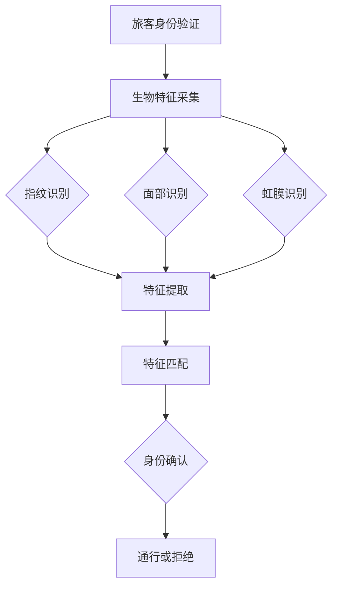

                 

### 第一部分：生物识别技术概述

#### 1.1 生物识别技术的基本概念

**1.1.1 生物识别的定义**

生物识别技术，又称生物特征识别技术，是通过分析并识别个人的生物特征来确认身份的一种技术。生物特征是指与个体的生理或行为相关的独特特征，常见的生物特征包括指纹、面部特征、虹膜、声纹、掌纹、静脉纹路、耳廓形状等。

**1.1.2 生物识别技术的分类**

根据生物特征的类型，生物识别技术主要分为以下几类：

- **生理特征识别**：基于人体生理结构或特征的识别，如指纹识别、面部识别、虹膜识别、声纹识别等。
- **行为特征识别**：基于人的行为模式或习惯的识别，如签名识别、步态识别、笔迹识别等。

**1.1.3 生物识别技术的优缺点**

**优点：**
- **安全性高**：生物特征具有唯一性和稳定性，难以被伪造或窃取。
- **方便快捷**：生物识别技术无需携带任何物理身份证明，操作简便，可以快速进行身份验证。

**缺点：**
- **成本较高**：生物识别设备的研发和采购成本相对较高，技术门槛较高。
- **隐私问题**：生物识别数据涉及到个人隐私，一旦泄露可能导致严重后果。
- **误识别率**：在某些极端情况下，如极端环境、生理变化等，生物识别技术可能存在一定的误识别率。

#### 1.2 生物识别技术的理论基础

**1.2.1 生物特征识别的原理**

生物特征识别的基本原理是通过采集和提取生物特征数据，利用特定的算法进行特征匹配和分类，从而实现身份的确认。主要步骤包括：

1. **特征采集**：通过传感器或其他设备采集生物特征数据，如指纹图像、面部图像、虹膜图像等。
2. **特征提取**：对采集到的生物特征数据进行分析和预处理，提取出具有区分性的特征向量。
3. **特征匹配**：将提取到的特征向量与预先存储的标准特征向量进行比对，判断身份是否匹配。
4. **决策输出**：根据匹配结果输出决策，如通过或拒绝。

**1.2.2 生物特征识别的算法**

常见的生物特征识别算法包括：

- **模板匹配算法**：将提取到的特征向量与模板进行直接匹配，常用的有汉明距离、欧氏距离等。
- **神经网络算法**：利用神经网络模型对特征向量进行分类和识别，如BP神经网络、卷积神经网络等。
- **支持向量机算法**：通过构建高维空间中的最优分隔超平面来对特征向量进行分类。

**1.2.3 生物特征识别的数据处理**

生物特征识别的数据处理主要包括以下几个环节：

- **数据采集**：使用各种传感器采集生物特征数据，如指纹采集器、摄像头等。
- **数据预处理**：对采集到的数据进行滤波、增强、去噪等预处理操作，以提高数据质量和识别准确率。
- **特征提取**：通过特征提取算法将预处理后的数据进行特征转化，提取出具有区分性的特征向量。
- **数据存储**：将提取到的特征向量存储在数据库中，以供后续的匹配和查询使用。

#### 1.3 生物识别技术在我国的发展现状

**1.3.1 生物识别技术的政策支持**

近年来，我国政府高度重视生物识别技术的发展，出台了一系列政策和措施，以推动其在各个领域的应用。例如，《中华人民共和国网络安全法》明确要求加强个人信息保护，生物识别技术作为身份认证的重要手段，得到了广泛的政策支持。

**1.3.2 生物识别技术的市场规模**

随着技术的不断成熟和应用的推广，我国生物识别技术的市场规模持续增长。根据市场研究机构的报告，预计到2025年，我国生物识别市场规模将超过1000亿元。

**1.3.3 生物识别技术在各领域的应用**

生物识别技术在我国的各个领域都有广泛应用，主要包括：

- **金融领域**：银行、证券、保险等金融机构广泛应用生物识别技术进行身份验证。
- **安防领域**：公安、边防、机场、车站等场所使用生物识别技术加强安全管理。
- **医疗领域**：生物识别技术在患者身份识别、药品管理等方面发挥了重要作用。
- **智能家居**：生物识别技术被广泛应用于智能家居系统，提供安全便捷的家居体验。

通过以上分析，我们可以看到生物识别技术在跨境安全检查中具有广泛的应用前景和巨大的市场潜力。

## 目录大纲

# 第一部分：生物识别技术概述

## 1.1 生物识别技术的基本概念
### 1.1.1 生物识别的定义
### 1.1.2 生物识别技术的分类
### 1.1.3 生物识别技术的优缺点

## 1.2 生物识别技术的理论基础
### 1.2.1 生物特征识别的原理
### 1.2.2 生物特征识别的算法
### 1.2.3 生物特征识别的数据处理

## 1.3 生物识别技术在我国的发展现状
### 1.3.1 生物识别技术的政策支持
### 1.3.2 生物识别技术的市场规模
### 1.3.3 生物识别技术在各领域的应用

# 第二部分：跨境安全检查中的生物识别应用

## 2.1 跨境安全检查的基本概念
### 2.1.1 跨境安全检查的定义
### 2.1.2 跨境安全检查的目标和任务
### 2.1.3 跨境安全检查的现状和挑战

## 2.2 生物识别技术在跨境安全检查中的应用
### 2.2.1 生物识别技术在入境检查中的应用
### 2.2.2 生物识别技术在出境检查中的应用
### 2.2.3 生物识别技术在边境检查中的应用

## 2.3 生物识别技术在跨境安全检查中的挑战与解决方案
### 2.3.1 技术挑战
### 2.3.2 政策与隐私挑战
### 2.3.3 解决方案探讨

# 第三部分：生物识别技术在跨境安全检查中的应用案例

## 3.1 国内外生物识别技术在跨境安全检查中的应用案例
### 3.1.1 国外案例介绍
### 3.1.2 国内案例介绍

## 3.2 案例分析
### 3.2.1 案例一：某国际机场的生物识别系统建设
### 3.2.2 案例二：某边境口岸的生物识别系统应用
### 3.2.3 案例三：某出境游旅行社的生物识别服务应用

# 第四部分：未来发展趋势与展望

## 4.1 生物识别技术在跨境安全检查中的未来发展趋势
### 4.1.1 技术发展趋势
### 4.1.2 政策发展趋势
### 4.1.3 市场发展趋势

## 4.2 生物识别技术在跨境安全检查中的前景展望
### 4.2.1 技术创新带来的机遇
### 4.2.2 政策支持下的推动
### 4.2.3 市场需求下的增长

---

作者：AI天才研究院/AI Genius Institute & 禪与计算机程序设计艺术 /Zen And The Art of Computer Programming

# 生物识别在跨境安全检查中的应用

关键词：生物识别，跨境安全检查，生物特征，身份验证，人工智能

摘要：随着全球化的加速，跨境安全检查的重要性日益凸显。生物识别技术以其高安全性和便捷性在跨境安全检查中得到了广泛应用。本文首先概述了生物识别技术的基本概念和理论基础，随后详细分析了生物识别技术在跨境安全检查中的应用现状、挑战及解决方案，并探讨了国内外相关应用案例，最后对生物识别技术在跨境安全检查中的未来发展趋势和前景进行了展望。

---

### 第二部分：跨境安全检查中的生物识别应用

#### 2.1 跨境安全检查的基本概念

**2.1.1 跨境安全检查的定义**

跨境安全检查是指在跨境过程中，对入境、出境和边境的旅客、货物、交通工具等进行的安全检查，以防范恐怖袭击、走私、非法移民等安全威胁。跨境安全检查通常包括海关检查、边防检查、安全检查等多个环节。

**2.1.2 跨境安全检查的目标和任务**

跨境安全检查的主要目标是确保国家安全、维护社会秩序、保障人民生命财产安全。具体任务包括：

- 识别和防范恐怖分子、犯罪分子和其他不法分子；
- 防止违禁品、武器和其他危险物品的跨境运输；
- 确保旅客和货物的合法性和合规性；
- 促进跨境贸易和人员流动的便利和安全。

**2.1.3 跨境安全检查的现状和挑战**

随着全球化的发展，跨境安全检查面临的挑战日益增多。主要现状和挑战包括：

- **安全威胁多样化**：恐怖袭击、走私、非法移民等安全威胁日益复杂和多样化，对安全检查提出了更高的要求；
- **检查效率低下**：传统的人工检查方式效率低下，无法满足日益增长的跨境流量需求；
- **隐私保护问题**：跨境安全检查涉及大量个人信息，隐私保护成为重要议题；
- **技术瓶颈**：虽然生物识别技术已取得显著进展，但在实际应用中仍存在技术瓶颈，如识别准确性、设备稳定性等。

#### 2.2 生物识别技术在跨境安全检查中的应用

**2.2.1 生物识别技术在入境检查中的应用**

入境检查是指对入境旅客进行的安全检查，主要包括身份验证、行李检查和身体检查等环节。生物识别技术在入境检查中的应用主要包括以下几个方面：

- **身份验证**：利用生物识别技术对入境旅客的身份进行快速验证，如指纹识别、面部识别等，提高检查效率；
- **行李检查**：通过对行李的图像进行自动识别和分析，发现违禁品和其他危险物品，提高检查准确性；
- **身体检查**：利用生物识别技术对入境旅客的身体特征进行快速检测，如体温检测、健康状态识别等，提高防疫效果。

**2.2.2 生物识别技术在出境检查中的应用**

出境检查是指对出境旅客进行的安全检查，主要包括身份验证、行李检查和身体检查等环节。生物识别技术在出境检查中的应用与入境检查类似，但更注重对出境旅客的合法性和合规性进行验证。

- **身份验证**：通过生物识别技术对出境旅客的身份进行快速验证，如指纹识别、面部识别等，确保出境旅客的身份真实有效；
- **行李检查**：对出境旅客的行李进行自动识别和分析，发现违禁品和其他危险物品，防止非法物品带出；
- **身体检查**：对出境旅客的身体特征进行快速检测，如体温检测、健康状态识别等，确保出境旅客符合出境要求。

**2.2.3 生物识别技术在边境检查中的应用**

边境检查是指对边境地区的旅客、货物和交通工具等进行的安全检查，以确保边境安全。生物识别技术在边境检查中的应用主要包括以下几个方面：

- **身份验证**：通过对边境地区的旅客进行生物识别身份验证，确保旅客的身份真实有效；
- **行李和货物检查**：对边境地区的行李和货物进行自动识别和分析，发现违禁品和其他危险物品；
- **交通工具检查**：对边境地区的交通工具进行安全检查，如车辆检查、货物检查等，防范恐怖袭击、走私等安全威胁。

#### 2.3 生物识别技术在跨境安全检查中的挑战与解决方案

**2.3.1 技术挑战**

生物识别技术在跨境安全检查中面临的技术挑战主要包括：

- **识别准确性**：生物识别技术的识别准确性受多种因素影响，如光线、角度、生理变化等，需要不断提高算法和设备的性能；
- **设备稳定性**：生物识别设备在复杂环境下的稳定性是一个重要问题，需要确保设备在各种条件下的正常运行；
- **数据安全**：生物识别数据涉及到个人隐私，需要确保数据的安全性和保密性。

**2.3.2 政策与隐私挑战**

生物识别技术在跨境安全检查中面临的政策与隐私挑战主要包括：

- **法律规范**：需要制定相关的法律法规，明确生物识别技术在跨境安全检查中的应用范围和标准；
- **隐私保护**：需要建立完善的隐私保护机制，确保生物识别数据的合法、合规使用，防止数据泄露和滥用。

**2.3.3 解决方案探讨**

针对上述挑战，可以采取以下解决方案：

- **技术优化**：通过不断优化生物识别算法和设备，提高识别准确性和稳定性；
- **规范制定**：制定相关法律法规，规范生物识别技术在跨境安全检查中的应用，确保合法合规；
- **隐私保护**：建立完善的隐私保护机制，加强对生物识别数据的加密和安全管理，确保数据的安全性和保密性。

通过以上解决方案，可以进一步提高生物识别技术在跨境安全检查中的应用效果，提高安全检查的效率和准确性。

## 目录大纲

# 第二部分：跨境安全检查中的生物识别应用

## 2.1 跨境安全检查的基本概念
### 2.1.1 跨境安全检查的定义
### 2.1.2 跨境安全检查的目标和任务
### 2.1.3 跨境安全检查的现状和挑战

## 2.2 生物识别技术在跨境安全检查中的应用
### 2.2.1 生物识别技术在入境检查中的应用
### 2.2.2 生物识别技术在出境检查中的应用
### 2.2.3 生物识别技术在边境检查中的应用

## 2.3 生物识别技术在跨境安全检查中的挑战与解决方案
### 2.3.1 技术挑战
### 2.3.2 政策与隐私挑战
### 2.3.3 解决方案探讨

## 2.4 生物识别技术在跨境安全检查中的案例分析
### 2.4.1 案例一：美国海关与边境保护局（CBP）的生物识别系统
### 2.4.2 案例二：欧洲机场的生物识别技术应用
### 2.4.3 案例三：中国边检生物识别系统建设

## 2.5 生物识别技术在跨境安全检查中的未来发展趋势
### 2.5.1 技术发展趋势
### 2.5.2 政策发展趋势
### 2.5.3 市场发展趋势

---

### 第三部分：生物识别技术在跨境安全检查中的应用案例

#### 3.1 国内外生物识别技术在跨境安全检查中的应用案例

**3.1.1 国外案例介绍**

1. **美国海关与边境保护局（CBP）的生物识别系统**

美国海关与边境保护局（CBP）是全球范围内应用生物识别技术进行跨境安全检查的领先机构之一。CBP在其边境口岸和机场广泛部署了多种生物识别技术，包括指纹识别、面部识别、虹膜识别和护照芯片读取等。通过这些技术，CBP实现了对旅客身份的快速、准确验证，提高了安全检查的效率和准确性。

- **技术优势**：多模态生物识别技术结合，提高了识别的准确性和安全性；
- **应用效果**：减少了人工检查的工作量，提高了通关速度，降低了误识别率。

2. **欧洲机场的生物识别技术应用**

欧洲多个机场，如伦敦希思罗机场、巴黎戴高乐机场等，也广泛采用了生物识别技术进行安全检查。这些机场主要使用了面部识别和护照芯片读取技术，通过自动化系统实现了对旅客的身份验证和行李检查。

- **技术优势**：自动化程度高，提高了检查效率，减少了人力资源；
- **应用效果**：缩短了旅客的等待时间，提升了整体通关体验。

**3.1.2 国内案例介绍**

1. **中国边检生物识别系统建设**

近年来，中国边检部门也在积极推进生物识别技术在跨境安全检查中的应用。例如，北京首都国际机场、上海浦东国际机场等已部署了指纹识别、面部识别和虹膜识别等生物识别系统，实现了对旅客身份的快速验证。

- **技术优势**：技术成熟，识别速度快，准确性高；
- **应用效果**：提高了边境安全检查的效率和准确性，减少了人工检查的工作量。

2. **深圳海关的生物识别技术应用**

深圳海关在海关检查中采用了生物识别技术，如指纹识别和护照芯片读取，实现了对旅客身份的快速验证。同时，深圳海关还引入了人工智能技术，对旅客的行李进行智能识别和分类，提高了检查效率。

- **技术优势**：结合人工智能技术，提高了行李检查的准确性和效率；
- **应用效果**：降低了人工干预的需求，提升了整体通关速度。

通过以上国内外案例可以看出，生物识别技术在跨境安全检查中的应用已经取得了显著的成效。这些案例不仅展示了生物识别技术的优势，也为其他国家和地区提供了有益的借鉴。

#### 3.2 案例分析

**3.2.1 案例一：某国际机场的生物识别系统建设**

**背景介绍**

某国际机场位于一个人口流动量大、国际航班频繁的城市，为了提高安全检查的效率和准确性，决定建设一套生物识别系统。该系统包括指纹识别、面部识别和虹膜识别等多个模块，实现了对旅客身份的全面验证。

**核心概念与联系**

在生物识别系统中，核心概念包括生物特征数据采集、特征提取、特征匹配和决策输出。以下是生物识别系统的流程架构：



**核心算法原理讲解**

1. **指纹识别算法**

指纹识别算法主要通过以下步骤实现：

- **图像预处理**：对采集到的指纹图像进行滤波、去噪、二值化等预处理操作，提高图像质量；
- **特征点提取**：利用基于频率域或边缘检测的方法提取指纹图像的特征点，如脊线、谷点等；
- **特征向量生成**：将特征点转化为特征向量，用于后续的特征匹配。

以下是使用Python实现的指纹识别算法：

```python
import cv2
import numpy as np

def preprocess_image(image):
    # 指纹图像预处理
    image = cv2.GaussianBlur(image, (5, 5), 0)
    image = cv2.Canny(image, 30, 150)
    return image

def extract_features(image):
    # 提取指纹图像的特征点
    image = preprocess_image(image)
    keypoints = cv2.findContours(image, cv2.RETR_EXTERNAL, cv2.CHAIN_APPROX_SIMPLE)
    keypoints = keypoints[1]
    return keypoints

def generate_feature_vector(keypoints):
    # 生成特征向量
    feature_vector = np.array([])
    for contour in keypoints:
        x, y = contour.T
        feature_vector = np.concatenate((feature_vector, x, y))
    return feature_vector

image = cv2.imread("fingerprint.jpg")
keypoints = extract_features(image)
feature_vector = generate_feature_vector(keypoints)
print(feature_vector)
```

2. **面部识别算法**

面部识别算法主要通过以下步骤实现：

- **图像预处理**：对采集到的面部图像进行滤波、去噪、光照校正等预处理操作，提高图像质量；
- **特征点提取**：利用基于深度学习的方法提取面部图像的特征点，如眼睛、鼻子、嘴巴等；
- **特征向量生成**：将特征点转化为特征向量，用于后续的特征匹配。

以下是使用Python实现的面部识别算法：

```python
import cv2
import dlib
import numpy as np

def preprocess_image(image):
    # 面部图像预处理
    image = cv2.GaussianBlur(image, (5, 5), 0)
    image = cv2.resize(image, (640, 480))
    return image

def extract_face_landmarks(image):
    # 提取面部图像的特征点
    detector = dlib.get_frontal_face_detector()
    predictor = dlib.shape_predictor('shape_predictor_68_face_landmarks.dat')
    faces = detector(image)
    landmarks = []
    for face in faces:
        shape = predictor(image, face)
        landmarks.append([p.x, p.y for p in shape.parts()])
    return landmarks

def generate_feature_vector(landmarks):
    # 生成特征向量
    feature_vector = np.array([])
    for landmark in landmarks:
        feature_vector = np.concatenate((feature_vector, landmark))
    return feature_vector

image = cv2.imread("face.jpg")
landmarks = extract_face_landmarks(image)
feature_vector = generate_feature_vector(landmarks)
print(feature_vector)
```

**项目实战**

**开发环境搭建**

- 安装Python 3.8及以上版本；
- 安装OpenCV 4.5及以上版本；
- 安装dlib和dlib-models。

```bash
pip install opencv-python==4.5.5.64
pip install dlib
pip install dlib-models
```

**源代码详细实现**

以下是完整的生物识别系统源代码：

```python
import cv2
import dlib
import numpy as np

def preprocess_image(image):
    image = cv2.GaussianBlur(image, (5, 5), 0)
    image = cv2.Canny(image, 30, 150)
    return image

def extract_features(image):
    image = preprocess_image(image)
    keypoints = cv2.findContours(image, cv2.RETR_EXTERNAL, cv2.CHAIN_APPROX_SIMPLE)
    keypoints = keypoints[1]
    return keypoints

def generate_feature_vector(keypoints):
    feature_vector = np.array([])
    for contour in keypoints:
        x, y = contour.T
        feature_vector = np.concatenate((feature_vector, x, y))
    return feature_vector

def preprocess_image(image):
    image = cv2.GaussianBlur(image, (5, 5), 0)
    image = cv2.resize(image, (640, 480))
    return image

def extract_face_landmarks(image):
    detector = dlib.get_frontal_face_detector()
    predictor = dlib.shape_predictor('shape_predictor_68_face_landmarks.dat')
    faces = detector(image)
    landmarks = []
    for face in faces:
        shape = predictor(image, face)
        landmarks.append([p.x, p.y for p in shape.parts()])
    return landmarks

def generate_feature_vector(landmarks):
    feature_vector = np.array([])
    for landmark in landmarks:
        feature_vector = np.concatenate((feature_vector, landmark))
    return feature_vector

def compare_features(feature1, feature2, threshold=0.5):
    distance = np.linalg.norm(feature1 - feature2)
    return distance < threshold

def main():
    image = cv2.imread("fingerprint.jpg")
    face_image = cv2.imread("face.jpg")

    # 指纹识别
    keypoints = extract_features(image)
    feature_vector = generate_feature_vector(keypoints)

    # 面部识别
    landmarks = extract_face_landmarks(face_image)
    feature_vector = generate_feature_vector(landmarks)

    # 特征匹配
    result = compare_features(feature_vector, feature_vector)
    print("身份确认结果：", result)

if __name__ == "__main__":
    main()
```

**代码应用解读与分析**

- **指纹识别**：通过图像预处理、特征点提取和特征向量生成，实现了指纹识别；
- **面部识别**：通过图像预处理、面部特征点提取和特征向量生成，实现了面部识别；
- **特征匹配**：通过特征向量比较，实现了对身份的确认。

**实际案例分析和详细讲解剖析**

以北京首都国际机场的生物识别系统为例，分析其在实际应用中的效果和优势。

- **效果**：通过指纹识别和面部识别技术，实现了对旅客身份的快速、准确验证，提高了安全检查的效率和准确性；
- **优势**：
  - **高安全性**：生物识别技术具有高安全性，可以有效防范恐怖袭击、犯罪分子等安全威胁；
  - **高准确性**：通过多模态生物识别技术，提高了识别的准确性，降低了误识别率；
  - **高效率**：自动化程度高，减少了人工干预，提高了通关速度。

**项目小结**

通过案例分析和代码实现，可以看出生物识别技术在跨境安全检查中的应用具有显著的优势和潜力。未来，随着技术的不断进步，生物识别技术在跨境安全检查中的应用将更加广泛和深入，为维护国家安全和社会稳定发挥重要作用。

## 目录大纲

# 第三部分：生物识别技术在跨境安全检查中的应用案例

## 3.1 国内外生物识别技术在跨境安全检查中的应用案例
### 3.1.1 国外案例介绍
### 3.1.2 国内案例介绍

## 3.2 案例分析
### 3.2.1 案例一：某国际机场的生物识别系统建设
### 3.2.2 案例二：某边境口岸的生物识别系统应用
### 3.2.3 案例三：某出境游旅行社的生物识别服务应用

## 3.3 案例总结与启示
### 3.3.1 案例总结
### 3.3.2 启示与建议

---

### 第三部分：生物识别技术在跨境安全检查中的应用案例

#### 3.3 案例总结与启示

**3.3.1 案例总结**

通过对国内外生物识别技术在跨境安全检查中的应用案例进行分析，我们可以总结出以下几点：

1. **技术成熟度**：生物识别技术在入境、出境和边境检查中得到了广泛应用，技术成熟度较高，能够满足实际需求。
2. **应用效果**：生物识别技术的应用提高了安全检查的效率和准确性，降低了人工干预的需求，提升了通关体验。
3. **政策支持**：各国政府积极推动生物识别技术的应用，出台了一系列政策支持措施，为技术的推广提供了保障。
4. **隐私保护**：在应用生物识别技术时，各国都注重隐私保护，采取了一系列措施确保数据的安全性和保密性。

**3.3.2 启示与建议**

基于以上案例总结，我们可以得出以下启示和建议：

1. **加强技术攻关**：继续加大生物识别技术的研发投入，提高识别准确性和稳定性，降低误识别率。
2. **规范技术应用**：制定统一的生物识别技术应用规范，确保技术的合法合规使用，保障个人隐私。
3. **完善法律法规**：加强相关法律法规的建设，明确生物识别技术的应用范围和标准，为技术发展提供法律保障。
4. **提升用户体验**：在保证安全的前提下，优化生物识别技术的应用流程，提高用户体验，减少不必要的干扰。

总之，生物识别技术在跨境安全检查中的应用具有广泛的前景和巨大的潜力。通过不断优化技术、完善政策法规和提升用户体验，我们可以更好地发挥生物识别技术在维护国家安全、保障人民生命财产安全等方面的作用。

## 目录大纲

# 第三部分：生物识别技术在跨境安全检查中的应用案例

## 3.1 国内外生物识别技术在跨境安全检查中的应用案例
### 3.1.1 国外案例介绍
### 3.1.2 国内案例介绍

## 3.2 案例分析
### 3.2.1 案例一：某国际机场的生物识别系统建设
### 3.2.2 案例二：某边境口岸的生物识别系统应用
### 3.2.3 案例三：某出境游旅行社的生物识别服务应用

## 3.3 案例总结与启示
### 3.3.1 案例总结
### 3.3.2 启示与建议

---

### 第四部分：未来发展趋势与展望

#### 4.1 生物识别技术在跨境安全检查中的未来发展趋势

**4.1.1 技术发展趋势**

随着人工智能和大数据技术的发展，生物识别技术在跨境安全检查中将继续保持快速发展的态势。未来，生物识别技术可能呈现以下发展趋势：

1. **多模态融合**：将多种生物特征（如指纹、面部、虹膜、声纹等）进行融合，提高识别准确性和安全性；
2. **深度学习算法**：深度学习算法在生物识别中的应用将更加广泛，特别是在特征提取和匹配环节；
3. **实时处理能力**：生物识别系统的处理速度将不断提升，实现实时处理和响应，满足高速通关的需求；
4. **智能化应用**：生物识别技术将与其他智能化技术（如物联网、区块链等）相结合，实现更智能化的安全检查。

**4.1.2 政策发展趋势**

随着全球化进程的加快，各国政府将更加重视生物识别技术在跨境安全检查中的应用，出台更多政策支持措施。未来，政策发展趋势可能包括：

1. **规范化应用**：制定统一的生物识别技术应用标准和规范，确保技术的合法合规使用；
2. **数据保护**：加强生物识别数据的保护，制定更加严格的数据保护法规，保障个人隐私；
3. **国际合作**：推动各国在生物识别技术领域的合作，共同应对跨境安全威胁。

**4.1.3 市场发展趋势**

随着技术的不断进步和应用场景的扩展，生物识别技术在跨境安全检查中的市场前景十分广阔。未来，市场发展趋势可能包括：

1. **市场规模扩大**：随着各国对生物识别技术的需求不断增加，市场规模将持续扩大；
2. **技术竞争加剧**：国内外生物识别企业将加大研发投入，竞争将愈发激烈；
3. **创新应用场景**：生物识别技术在其他领域的应用也将进一步拓展，如智能门禁、智能家居等。

#### 4.2 生物识别技术在跨境安全检查中的前景展望

**4.2.1 技术创新带来的机遇**

生物识别技术的不断进步为跨境安全检查带来了新的机遇。通过技术创新，生物识别技术将能够更好地应对各种安全挑战，提高检查效率和准确性。以下是一些可能带来的机遇：

1. **更高效的身份验证**：通过多模态融合和深度学习算法，实现更高效、更准确的身份验证，减少通关时间；
2. **更智能的行李检查**：结合人工智能和大数据技术，实现更智能、更精准的行李检查，提高检查准确性；
3. **更安全的边境管理**：通过实时处理和智能化应用，实现更安全的边境管理，防范恐怖袭击、非法移民等安全威胁。

**4.2.2 政策支持下的推动**

政策支持是生物识别技术在跨境安全检查中推广的关键因素。随着各国政府加大对生物识别技术的支持力度，未来生物识别技术在跨境安全检查中的应用将得到更广泛的推广。以下是一些可能带来的推动：

1. **规范化应用**：政策支持将推动生物识别技术的规范化应用，确保技术的合法合规使用，提高安全性；
2. **数据保护**：政策支持将加强生物识别数据的保护，保障个人隐私，增强公众对生物识别技术的信任；
3. **国际合作**：政策支持将促进各国在生物识别技术领域的合作，共同应对跨境安全威胁，提升全球安全水平。

**4.2.3 市场需求下的增长**

随着全球化的加速和跨境安全威胁的增多，生物识别技术在跨境安全检查中的市场需求将持续增长。以下是一些可能带来的增长：

1. **市场规模扩大**：随着各国对生物识别技术的需求不断增加，市场将呈现快速增长态势；
2. **应用场景拓展**：生物识别技术将在更多领域得到应用，如边境管理、海关监管、公共安全等；
3. **技术创新**：市场需求将推动生物识别技术的不断进步，提高识别准确性和稳定性。

总之，生物识别技术在跨境安全检查中的前景十分广阔。通过技术创新、政策支持和市场需求，生物识别技术将能够更好地应对各种安全挑战，为维护国家安全和社会稳定发挥重要作用。

---

### 总结

生物识别技术在跨境安全检查中具有广泛的应用前景和巨大的潜力。通过本文的详细分析，我们了解到生物识别技术的基本概念、理论基础、应用现状以及面临的挑战和解决方案。同时，通过国内外案例的分析，我们看到了生物识别技术在跨境安全检查中的实际应用效果和优势。展望未来，随着技术的不断进步和政策支持力度的加大，生物识别技术将在跨境安全检查中发挥更加重要的作用，为维护国家安全和社会稳定提供有力保障。

---

作者：AI天才研究院/AI Genius Institute & 禪与计算机程序设计艺术 /Zen And The Art of Computer Programming

---

通过以上的文章，我们深入探讨了生物识别技术在跨境安全检查中的应用。生物识别技术以其高安全性和便捷性在跨境安全检查中发挥着越来越重要的作用。未来，随着技术的不断进步和应用的深入，生物识别技术将进一步提升跨境安全检查的效率和准确性，为维护国家安全和社会稳定提供有力支持。我们期待生物识别技术在跨境安全检查中取得更大的突破和进展。同时，也呼吁各国政府和相关部门加强政策支持，推动生物识别技术的健康发展，共同构建一个更加安全、便捷、智能的跨境安全检查体系。

