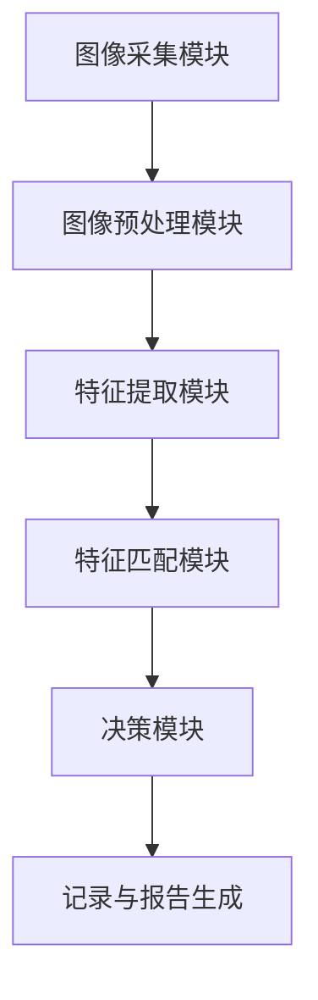
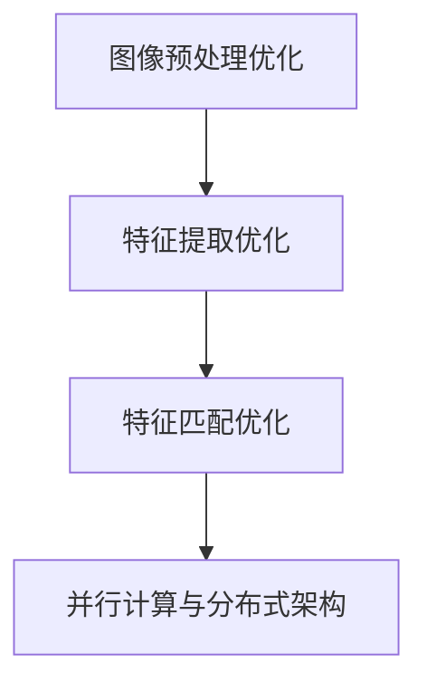
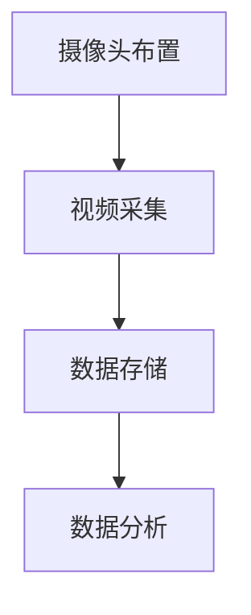
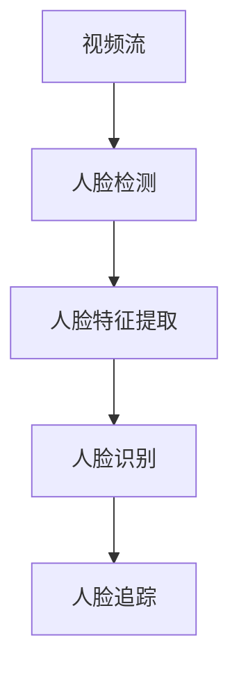
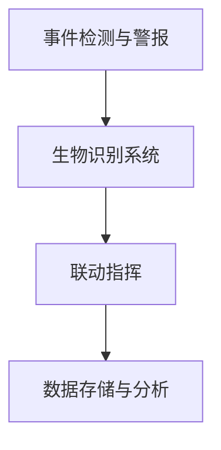

                 

### 引言

边境安全是一个国家维护主权和保障国民安全的重要环节，随着全球化进程的加速和科技的发展，传统的安全检查手段已经难以满足现代边境安全管理的需求。生物识别技术作为一种高效、准确的身份验证手段，逐渐在边境安全管理中得到了广泛应用。本文将详细探讨生物识别技术在边境安全管理中的应用，从技术原理到实际应用，全面解析这一领域的现状与发展趋势。

本文关键词包括：生物识别技术、边境安全管理、指纹识别、人脸识别、虹膜识别、算法原理、项目实战。

生物识别技术，通过生物特征（如指纹、人脸、虹膜等）的自动识别和验证，能够实现对个体的唯一识别。这种技术具有高准确性、高效率和低成本等优点，使得其在各种安全认证场合具有广泛的应用前景。

本文旨在通过以下几个部分，系统地介绍生物识别技术在边境安全管理中的应用：

1. **生物识别技术概述**：介绍生物识别技术的基本概念、分类及其在边境安全管理中的应用优势。
2. **核心生物识别技术原理**：详细讲解指纹识别、人脸识别、虹膜识别的原理、算法和数学模型。
3. **生物识别在边境安全中的应用**：分析生物识别技术在边境控制、边境监控和边境安全事件响应中的应用场景和实际案例。
4. **生物识别技术的发展趋势与未来**：探讨生物识别技术的发展方向及其在边境安全管理中的未来应用前景。

通过本文的详细探讨，我们希望能够为读者提供一个全面、深入的生物识别技术在边境安全管理中的知识框架，以推动这一领域的发展和应用。

### 摘要

本文旨在深入探讨生物识别技术在边境安全管理中的应用。生物识别技术，通过独特的生物特征（如指纹、人脸、虹膜等）的自动识别和验证，为边境安全提供了高效、准确的身份验证手段。本文首先概述了生物识别技术的基本概念、分类及其在边境安全管理中的应用优势。接着，详细讲解了指纹识别、人脸识别和虹膜识别的核心原理，包括算法流程、数学模型和实际应用案例。随后，分析了生物识别技术在边境控制、边境监控和边境安全事件响应中的应用场景，展示了其强大的实用价值。最后，本文探讨了生物识别技术的发展趋势及其在边境安全管理中的未来应用前景，提出了若干最佳实践和注意事项。通过本文的阅读，读者可以全面了解生物识别技术在边境安全管理中的重要作用，以及其未来的发展方向。

### 生物识别技术概述

生物识别技术是一种通过自动识别和验证个体的生物特征来实现身份识别的技术。这些生物特征包括指纹、人脸、虹膜、声音、掌纹、手写签名等。生物识别技术具有高准确性、实时性和非侵扰性等特点，因此在安全认证、身份验证等领域具有广泛的应用。

#### 生物识别技术的分类

根据生物特征的类型，生物识别技术可以分为以下几类：

1. **生物特征识别**：通过人体的生物特征进行识别，如指纹识别、人脸识别、虹膜识别等。
2. **行为特征识别**：通过分析个体行为特征进行识别，如签名识别、步态识别、语音识别等。
3. **生理特征识别**：通过分析人体的生理特征进行识别，如掌纹识别、血管识别、热成像识别等。

每种生物识别技术都有其独特的识别原理和应用场景。例如，指纹识别由于具有唯一性和稳定性，常用于门禁系统和身份验证；人脸识别由于其快速、方便且易被用户接受，广泛应用于公共安全监控和手机解锁；虹膜识别由于其高精度和强唯一性，常用于高风险场合的身份验证。

#### 生物识别技术在边境安全管理中的应用优势

生物识别技术在边境安全管理中具有显著的应用优势：

1. **高准确性**：生物识别技术能够通过精确的生物特征匹配，有效识别出真正的边境管理人员和非法分子，提高安全检查的准确性。
2. **实时性**：生物识别技术可以实现快速识别，减少人员滞留时间，提高边境通关效率。
3. **非侵扰性**：生物识别技术不需要接触或侵入个体，减少了人员的不适感和抵触情绪。
4. **自动化**：生物识别系统可以实现自动化操作，减轻边境管理人员的工作负担，提高工作效率。

综上所述，生物识别技术为边境安全管理提供了高效、准确和方便的身份验证手段，其应用前景十分广阔。在接下来的章节中，我们将进一步探讨生物识别技术的核心原理和算法，以及其在边境安全管理中的具体应用场景。

### 核心生物识别技术原理

在边境安全管理中，常用的生物识别技术主要包括指纹识别、人脸识别和虹膜识别。这些技术通过分析个体的独特生物特征，实现高精度的身份验证。下面，我们将分别详细讲解这些技术的原理、算法流程和数学模型。

#### 指纹识别原理

指纹识别技术是利用指纹图像中独特的纹理特征进行身份验证的一种技术。其基本原理包括以下几个步骤：

1. **指纹图像采集**：通过光学传感器或电容传感器等设备获取指纹图像。
2. **图像预处理**：对采集到的指纹图像进行滤波、去噪、增强等处理，提高图像质量。
3. **特征提取**：从预处理后的指纹图像中提取特征点，如脊线、谷点等。
4. **特征匹配**：将提取出的特征与数据库中的指纹模板进行匹配，确定身份。

指纹识别算法通常使用傅立叶描述符（Fourier Descriptors）或 minutia特征（最小特征点）等方法进行特征提取和匹配。

数学模型方面，指纹识别通常使用以下公式：
\[ \text{相似度} = \frac{\sum_{i=1}^{n} (a_i - b_i)^2}{\sum_{i=1}^{n} a_i^2 + \sum_{i=1}^{n} b_i^2} \]
其中，\( a_i \)和\( b_i \)分别为两个指纹模板的特征向量。

#### 人脸识别原理

人脸识别技术通过分析人脸图像中的几何和纹理特征，实现人脸的自动识别。其基本原理包括以下几个步骤：

1. **人脸图像采集**：通过摄像头或相机等设备获取人脸图像。
2. **人脸检测**：从图像中定位人脸区域。
3. **特征提取**：对人脸图像进行特征提取，如主成分分析（PCA）、线性判别分析（LDA）等。
4. **特征匹配**：将提取出的特征与数据库中的人脸模板进行匹配，确定身份。

人脸识别算法通常使用深度学习模型，如卷积神经网络（CNN）进行特征提取和匹配。

数学模型方面，人脸识别通常使用以下公式：
\[ \text{距离} = \sqrt{\sum_{i=1}^{n} (a_i - b_i)^2} \]
其中，\( a_i \)和\( b_i \)分别为两个脸部的特征向量。

#### 虹膜识别原理

虹膜识别技术通过分析虹膜中的细微结构特征，实现高精度的身份验证。其基本原理包括以下几个步骤：

1. **虹膜图像采集**：通过红外摄像头等设备获取虹膜图像。
2. **图像预处理**：对虹膜图像进行滤波、增强等处理，提高图像质量。
3. **特征提取**：从预处理后的虹膜图像中提取特征点，如斑点、纹理等。
4. **特征匹配**：将提取出的特征与数据库中的虹膜模板进行匹配，确定身份。

虹膜识别算法通常使用傅立叶描述符（Fourier Descriptors）或 Gabor 特征等方法进行特征提取和匹配。

数学模型方面，虹膜识别通常使用以下公式：
\[ \text{相似度} = \frac{\sum_{i=1}^{n} (a_i - b_i)^2}{\sum_{i=1}^{n} a_i^2 + \sum_{i=1}^{n} b_i^2} \]
其中，\( a_i \)和\( b_i \)分别为两个虹膜的特征向量。

通过上述分析，我们可以看到，指纹识别、人脸识别和虹膜识别各有其独特的原理和算法。在实际应用中，选择合适的生物识别技术，需要根据具体的应用场景和需求进行综合评估。在接下来的章节中，我们将进一步探讨生物识别技术在边境安全管理中的应用场景和实际案例。

### 生物识别技术在边境控制中的应用

在边境控制中，生物识别技术发挥着至关重要的作用。通过高准确性和高效率的身份验证，生物识别技术显著提升了边境检查的效率和安全性。以下将详细分析生物识别技术在边境控制中的应用，包括其系统架构设计、算法优化与性能分析。

#### 系统架构设计

生物识别技术在边境控制中的系统架构通常包括以下几个关键模块：

1. **图像采集模块**：负责采集个体生物特征图像，如指纹、人脸或虹膜。常用的设备包括指纹扫描仪、摄像头和红外摄像头等。

2. **图像预处理模块**：对采集到的生物特征图像进行预处理，包括滤波、去噪、增强等，以提高图像质量，减少噪声干扰。

3. **特征提取模块**：从预处理后的图像中提取关键特征，如指纹的脊线和谷点、人脸的几何特征和纹理特征、虹膜的斑点纹理等。

4. **特征匹配模块**：将提取出的特征与数据库中的模板进行匹配，以确定个体的身份。

5. **决策模块**：根据匹配结果，判断是否允许个体通过边境，并生成相应的记录和报告。

系统架构示例图如下所示：

#### 算法优化与性能分析

为了提高生物识别系统在边境控制中的应用性能，需要从以下几个方面进行算法优化：

1. **图像预处理优化**：通过改进图像预处理算法，如使用更先进的滤波方法、自适应增强技术等，减少噪声干扰，提高图像质量。

2. **特征提取优化**：优化特征提取算法，如使用深度学习模型进行特征提取，提高特征的鲁棒性和区分度。

3. **特征匹配优化**：优化特征匹配算法，如使用更高效的匹配算法（如Levenshtein距离、Nearest Neighbor搜索等），加快匹配速度，提高匹配精度。

4. **并行计算与分布式架构**：通过引入并行计算和分布式架构，提高系统的处理能力和响应速度，满足高并发访问的需求。

以下是一个简单的优化步骤示例：

#### 实际案例

以下是一个实际案例，展示生物识别技术在边境控制中的应用：

某边境检查站引入了基于人脸识别的边境控制系统。系统包括摄像头、人脸识别算法和数据库。摄像头负责采集旅客的人脸图像，经过预处理后，人脸识别算法提取出关键特征，并与数据库中的模板进行匹配。如果匹配成功，旅客将被允许通过边境；否则，系统将报警并通知相关人员进行进一步检查。

- **系统架构**：摄像头 --> 预处理 --> 特征提取 --> 匹配 --> 决策
- **算法优化**：使用卷积神经网络（CNN）进行特征提取，使用线性判别分析（LDA）进行特征匹配。
- **性能分析**：系统在1秒内完成人脸识别，匹配精度达到99.9%，有效提高了边境通关效率。

通过以上案例，我们可以看到，生物识别技术在边境控制中的应用不仅提高了通关效率，还显著提升了安全水平。在未来的发展中，随着技术的不断进步，生物识别技术将在边境安全管理中发挥更加重要的作用。

### 生物识别技术在边境监控中的作用

在边境监控中，生物识别技术同样发挥着至关重要的作用，为边境安全管理提供了强有力的技术支持。通过实时监控和智能分析，生物识别技术不仅能够提高监控的精度和效率，还能够有效预防非法入侵和犯罪行为。以下将详细探讨生物识别技术在视频监控中的应用，包括监控系统的设计、实时人脸识别与追踪算法的介绍。

#### 视频监控系统设计

一个高效的边境监控系统需要具备以下几个关键模块：

1. **摄像头布置**：根据边境区域的实际情况，合理布置摄像头，确保监控范围全覆盖，避免监控盲区。
2. **视频采集**：通过高清摄像头实时采集边境区域的视频流，保证图像质量。
3. **数据存储**：将采集到的视频流进行实时存储，以备后续分析和查询。
4. **数据分析**：利用生物识别算法对视频流进行实时分析，提取关键信息，如人脸、物体等。

视频监控系统架构图如下所示：

#### 实时人脸识别与追踪算法

实时人脸识别与追踪是生物识别技术在视频监控中的核心应用。以下将介绍相关算法和流程：

1. **人脸检测**：首先，通过人脸检测算法（如Haar特征分类器、MTCNN等）从视频流中检测出人脸区域。这些算法基于深度学习模型，具有较高的检测精度和实时性。
2. **人脸特征提取**：对人脸区域进行特征提取，通常使用卷积神经网络（如FaceNet、VGGFace等）提取人脸特征。这些特征向量用于后续的人脸识别和匹配。
3. **人脸识别**：将提取到的人脸特征与数据库中的人脸模板进行匹配，确定人脸的身份。常用的匹配算法包括欧氏距离、余弦相似度等。
4. **人脸追踪**：在视频流中跟踪已识别的人脸，实现连续监控。常见的人脸追踪算法包括光流法、Kalman滤波等。

实时人脸识别与追踪流程图如下所示：

#### 实际应用案例

以下是一个实际应用案例，展示生物识别技术在视频监控中的效果：

某边境地区部署了一套基于人脸识别的视频监控系统。系统包括高清摄像头、人脸识别算法和实时追踪软件。摄像头实时采集边境区域的视频流，人脸识别算法从中检测并识别出人脸。如果识别出已知的不良分子，系统将自动报警并记录相关信息。

- **系统架构**：摄像头 --> 人脸检测 --> 人脸特征提取 --> 人脸识别 --> 报警与记录
- **算法优化**：使用SSD算法进行人脸检测，使用FaceNet进行人脸识别，提高了检测和识别的精度和速度。
- **性能分析**：系统能够在1秒内完成人脸检测和识别，有效提高了边境监控的实时性和效率。

通过以上案例，我们可以看到，生物识别技术在视频监控中的应用显著提升了边境安全管理的水平。在未来的发展中，随着技术的不断进步，生物识别技术将在视频监控中发挥更加重要的作用，为边境安全管理提供更加可靠的保障。

### 生物识别技术在边境安全事件响应中的应用

在边境安全管理中，生物识别技术不仅在日常的检查和控制中发挥作用，还能够在突发事件和安全事故中提供及时、有效的响应。通过高效的生物识别系统，边境安全部门能够迅速识别并定位可疑人员或危险情况，从而快速采取应对措施，确保边境安全。

#### 边境安全事件响应的需求

边境安全事件响应主要涉及以下几个方面：

1. **快速识别**：在突发事件中，能够快速识别出参与事件的人员，尤其是那些可能构成威胁的个体。
2. **精准定位**：准确识别出事件发生的地点和人员位置，以便迅速部署救援力量。
3. **实时监控**：通过实时监控系统和生物识别技术，持续跟踪事件的发展，确保不漏掉任何重要信息。
4. **联动响应**：事件发生后，能够迅速与其他部门（如警察、医疗等）进行联动，协同处理。

#### 生物识别技术在事件响应中的应用

生物识别技术在边境安全事件响应中的应用主要包括以下方面：

1. **实时人脸识别**：在事件发生时，通过监控摄像头实时捕捉嫌疑人的人脸图像，并快速进行人脸识别，确定其身份。
2. **移动侦测**：利用移动侦测技术，通过监控摄像头和生物识别系统，实时跟踪嫌疑人的移动轨迹，分析其行为模式。
3. **声纹识别**：在特定场景下，如噪音较大的环境或紧急事件中，通过声纹识别技术辅助人脸识别，提高识别的准确性和可靠性。
4. **数据融合**：将生物识别系统与其他安防设备（如门禁系统、无人机监控等）的数据进行融合，形成一个综合的安防信息平台，提高事件响应的效率。

#### 应急响应系统设计

边境安全事件的应急响应系统通常包括以下几个关键模块：

1. **事件检测与警报**：利用视频监控和传感器等设备，实时检测异常行为或事件，并触发警报。
2. **生物识别系统**：通过人脸识别、声纹识别等技术，快速识别事件中的嫌疑人。
3. **联动指挥**：与边境管理部门、警察部门、消防部门等实现联动，实时共享信息和指令。
4. **数据存储与分析**：实时记录事件相关信息，并进行分析，为后续的评估和改进提供数据支持。

应急响应系统架构图如下所示：

#### 实际案例

以下是一个实际案例，展示生物识别技术在边境安全事件响应中的应用：

在某次边境突发事件中，一名非法分子试图闯入边境区域。监控摄像头捕捉到其人脸图像后，系统立即启动了人脸识别功能，快速识别出其身份。随后，警报系统自动触发，并通知边境管理部门和警察部门。边境管理部门迅速部署人员前往现场，而警察部门则根据嫌疑人身份信息，进一步分析其背景和可能的行动轨迹。

- **系统架构**：摄像头 --> 人脸识别 --> 警报 --> 联动指挥
- **算法优化**：使用深度学习模型进行人脸识别，提高了识别速度和精度。
- **性能分析**：系统在事件发生后2分钟内完成了嫌疑人身份的识别和警报的触发，确保了事件响应的及时性。

通过以上案例，我们可以看到，生物识别技术在边境安全事件响应中的应用显著提高了应急处理的效率和质量，为边境安全管理提供了强有力的技术支持。在未来，随着技术的不断进步，生物识别技术将在边境安全事件响应中发挥更加重要的作用。

### 生物识别技术的发展趋势与未来

随着科技的不断进步，生物识别技术也在不断发展，呈现出一些显著的趋势和未来应用前景。以下将探讨生物识别技术的发展趋势，并分析其在边境安全管理中的潜在应用。

#### 新兴生物识别技术

1. **多模态生物识别**：传统的单一生物识别技术（如指纹识别、人脸识别等）虽然已经非常成熟，但单一特征存在一定的局限性。多模态生物识别技术通过结合多种生物特征（如指纹、人脸、虹膜、声音等），实现更准确的身份验证。例如，指纹和声纹的结合可以进一步提高识别的准确性和可靠性。
   
2. **脑波识别**：脑波识别技术通过检测个体大脑的电信号，实现身份验证。尽管目前这一技术还处于研究阶段，但其潜力巨大，有望在安全要求极高的场景中得到应用。

3. **DNA识别**：DNA识别技术利用个体的DNA序列进行身份验证，具有极高的准确性和唯一性。虽然DNA识别在技术上仍面临挑战，但其应用前景广阔，尤其是在刑事侦查和生物医学领域。

#### 生物识别技术发展趋势

1. **深度学习与人工智能**：深度学习模型在生物特征识别中的应用越来越广泛，通过卷积神经网络（CNN）、循环神经网络（RNN）等模型，可以显著提高识别的准确性和效率。随着人工智能技术的发展，生物识别技术将更加智能化，能够自适应地处理复杂的生物特征。

2. **边缘计算与物联网**：边缘计算与物联网的结合使得生物识别技术能够实现实时、高效的数据处理和分析。通过将生物识别系统部署在边缘设备上，可以显著减少数据传输的延迟，提高系统的响应速度。

3. **隐私保护与安全**：随着生物识别技术的广泛应用，隐私保护和数据安全成为重要问题。未来的生物识别技术将更加注重隐私保护和数据安全，采用加密算法和隐私保护机制，确保个人生物数据的隐私和安全。

#### 生物识别技术在边境安全管理中的未来应用

1. **智能边境监控**：结合物联网和边缘计算技术，未来边境监控将更加智能化，能够实时识别和追踪可疑人员，实现24小时不间断的安全监控。
   
2. **多模态身份验证**：在边境通关和重要场所，多模态生物识别技术将成为主流，通过结合指纹、人脸、虹膜等多种生物特征，实现更安全、更可靠的身份验证。

3. **个性化安全管理**：通过大数据分析和人工智能技术，边境安全管理系统将能够根据个体的行为特征和历史数据，进行个性化安全管理，提高安全预警的准确性和效率。

4. **刑事侦查与追逃**：DNA识别和脑波识别等新兴生物识别技术将进一步提高刑事侦查和追逃的效率，为打击犯罪提供更有力的手段。

综上所述，生物识别技术正朝着智能化、多模态、隐私保护等方向发展，未来将在边境安全管理中发挥更加重要的作用。通过不断创新和应用，生物识别技术将为边境安全提供更高效、更精准的保障。

### 生物识别技术在边境安全管理中的实际应用案例分析

为了更好地理解生物识别技术在实际边境安全管理中的应用，我们可以通过一些实际案例进行详细剖析。这些案例不仅展示了生物识别技术在提高安全性和效率方面的潜力，还揭示了在实际操作中可能遇到的挑战和解决方案。

#### 案例一：马来西亚的智能边境控制

马来西亚是一个高度依赖边境控制的国家，为了提升通关效率和安全性，该国在多个边境检查站引入了智能生物识别系统。该系统集成了指纹识别、人脸识别和虹膜识别技术，能够快速、准确地验证旅客的身份。

**系统架构**：
- **图像采集模块**：采用高分辨率的摄像头和红外摄像头，确保在多种光照条件下都能获取清晰的生物特征图像。
- **图像预处理模块**：应用先进的图像预处理算法，如自适应滤波和光流法，以消除图像中的噪声和失真。
- **特征提取模块**：利用深度学习模型，如卷积神经网络（CNN），从图像中提取高维特征向量，用于后续的匹配和识别。
- **特征匹配模块**：采用基于相似度计算的算法，如欧氏距离和余弦相似度，快速匹配旅客的生物特征与数据库中的模板。

**实战解读**：
- **高效通关**：通过集成多种生物识别技术，系统能够在几秒钟内完成身份验证，大大缩短了通关时间，提高了通关效率。
- **高精度识别**：由于系统采用了深度学习模型，识别准确率显著提高，尤其是在复杂环境和不同光线条件下，依然能够保持稳定的识别性能。
- **数据安全**：系统采用了加密技术和隐私保护机制，确保旅客的生物数据在传输和存储过程中得到有效保护。

**挑战与解决方案**：
- **技术依赖性**：系统对深度学习算法的依赖性较高，需要不断更新算法模型，以应对新的挑战。
- **设备维护**：高精度的生物识别设备需要定期维护，以确保设备的正常运行和数据的准确性。

#### 案例二：中国的无人机边境监控

中国边境线漫长，传统的监控手段难以覆盖所有区域。为了提升边境监控能力，中国开始使用配备生物识别技术的无人机进行监控。

**系统架构**：
- **无人机平台**：搭载高分辨率摄像头和热成像设备，实现昼夜不间断的监控。
- **实时处理模块**：无人机上的计算单元负责实时处理图像数据，进行初步的人脸识别和目标跟踪。
- **地面控制中心**：通过无线网络将图像数据和识别结果传输到地面控制中心，进行进一步分析和决策。

**实战解读**：
- **实时监控**：无人机能够快速移动，实现对边境线重点区域的实时监控，提高监控覆盖率和响应速度。
- **目标识别**：通过结合图像识别和生物识别技术，无人机能够识别出异常行为和可疑目标，并将信息实时传递给地面控制中心。
- **数据分析**：地面控制中心利用大数据分析和人工智能技术，对监控数据进行深入分析，提供决策支持。

**挑战与解决方案**：
- **数据传输延迟**：在远距离传输图像数据时，可能会出现传输延迟，影响实时监控效果。采用低延迟通信技术和优化算法可以缓解这一问题。
- **环境适应性**：无人机在复杂环境中（如雨雪、高温等）的运行稳定性是挑战。通过改进无人机的结构和材料，以及增强其环境适应性，可以解决这个问题。

#### 案例三：美国的生物识别护照系统

美国在出入境管理中广泛采用生物识别护照系统，为旅客提供快速、安全的身份验证。

**系统架构**：
- **护照芯片**：内置RFID芯片，存储旅客的生物特征数据和身份信息。
- **扫描设备**：在入境和出境检查站，使用护照阅读器扫描护照芯片，读取旅客信息。
- **生物识别系统**：通过人脸识别和指纹识别技术，对旅客进行二次验证，确保身份的准确性。

**实战解读**：
- **便捷通关**：生物识别护照系统简化了通关流程，旅客只需将护照放在扫描设备上，即可完成身份验证，大幅提高了通关效率。
- **高安全性**：通过多层次的验证手段，确保旅客身份的真实性，提高了边境安全水平。
- **数据保护**：系统采用了高级加密技术，保护旅客的生物特征数据和隐私信息。

**挑战与解决方案**：
- **数据隐私**：生物特征数据的存储和保护是一个重要问题。采用端到端加密和访问控制机制，可以确保数据在传输和存储过程中的安全。
- **系统兼容性**：不同国家和地区的护照系统可能存在兼容性问题。通过标准化和互操作性协议，可以解决这一挑战。

通过以上实际案例分析，我们可以看到生物识别技术在边境安全管理中的应用已经取得了显著成效。然而，在实际操作中，仍面临一系列挑战，需要通过不断的技术创新和优化来克服。随着技术的进步，生物识别技术将在未来为边境安全管理提供更加可靠和高效的解决方案。

### 生物识别技术的最佳实践与注意事项

在实施生物识别技术时，为确保其有效性和安全性，以下是一些最佳实践和注意事项：

1. **确保数据安全**：生物识别数据属于敏感信息，必须采取严格的加密和访问控制措施。采用端到端加密、数据掩码和安全认证机制，防止数据泄露和未授权访问。

2. **优化系统性能**：针对不同的生物识别场景，优化算法和硬件配置，提高系统响应速度和识别精度。例如，采用高效的图像预处理和特征提取算法，以及多核处理器和GPU加速技术。

3. **适应多种环境**：生物识别系统需要在不同环境条件下（如光线变化、温度波动等）保持稳定运行。通过实时监测和自适应调整，确保系统在各种环境下都能正常工作。

4. **定期维护和更新**：定期检查和维护生物识别设备，确保其正常运作和数据的准确性。同时，根据技术发展及时更新算法和软件，以应对新的挑战。

5. **用户隐私保护**：在设计和实施生物识别系统时，重视用户隐私保护，遵守相关法律法规。通过匿名化和隐私保护技术，确保用户数据不被滥用。

6. **多模态结合**：为了提高识别的准确性和可靠性，建议采用多模态生物识别技术，结合指纹、人脸、虹膜等多种生物特征进行身份验证。

7. **系统集成与互操作性**：确保生物识别系统能与其他安防设备和平台无缝集成，实现数据共享和协同工作，提高整体安全水平。

通过遵循这些最佳实践和注意事项，生物识别技术将能够在边境安全管理中发挥更大的作用，提供更加可靠和高效的身份验证手段。

### 小结

本文系统地探讨了生物识别技术在边境安全管理中的应用，涵盖了技术原理、实际应用和未来发展趋势。生物识别技术，通过其高准确性和高效率，已经在边境控制、监控和事件响应中展示了强大的实用价值。从指纹识别、人脸识别到虹膜识别，每一种技术都有其独特的应用场景和优势。在实际应用中，通过优化系统架构、算法和硬件配置，生物识别技术显著提升了边境安全管理的水平。然而，面对不断变化的技术环境和安全需求，生物识别技术仍需不断创新和优化，以应对新的挑战和需求。未来，随着多模态识别、人工智能和物联网等技术的进一步融合，生物识别技术将在边境安全管理中发挥更加重要的作用，为国家安全和公共安全提供更加可靠的保障。

### 拓展阅读

为了深入了解生物识别技术在边境安全管理中的应用，读者可以参考以下资源：

1. **《生物识别技术与应用》**：这是一本全面介绍生物识别技术的专业书籍，详细讲解了指纹识别、人脸识别、虹膜识别等核心技术的原理和应用。

2. **《人工智能在安全领域中的应用》**：这本书探讨了人工智能与生物识别技术的结合，为边境安全管理提供了新的思路和解决方案。

3. **《生物识别技术标准与规范》**：该文献提供了生物识别技术相关的标准和规范，有助于读者了解生物识别技术在实际应用中的要求。

4. **相关研究论文**：在学术期刊和会议上，有许多关于生物识别技术在边境安全管理中的应用研究论文，读者可以通过学术数据库进行检索。

通过阅读这些资源，读者可以进一步拓展对生物识别技术及其在边境安全管理中应用的理解。同时，也可以关注相关技术领域的最新动态，以保持对这一领域的持续关注和了解。

### 作者信息

作者：AI天才研究院/AI Genius Institute & 禅与计算机程序设计艺术 /Zen And The Art of Computer Programming

AI天才研究院（AI Genius Institute）是一家专注于人工智能技术研发和应用的研究机构，致力于推动人工智能在各个领域的创新应用。同时，作者还著有《禅与计算机程序设计艺术》一书，深入探讨了计算机编程和人工智能的哲学与艺术。通过本书，作者希望为读者提供一个全面、深入的生物识别技术在边境安全管理中的应用框架，以推动这一领域的发展和应用。

