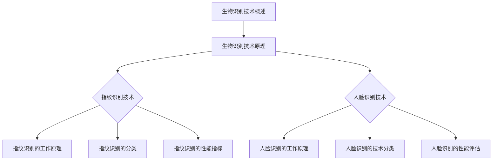

                 


# 《生物识别技术在智能工作场所中的应用》

## 关键词
生物识别技术，智能工作场所，智能门禁系统，智能考勤系统，智能安防系统，人脸识别，指纹识别，智能会议室系统，办公自动化系统

## 摘要
随着科技的飞速发展，生物识别技术在智能工作场所中的应用越来越广泛。本文将深入探讨生物识别技术的基础知识，以及其在智能门禁系统、智能考勤系统、智能安防系统、智能会议室系统和智能办公自动化系统中的应用，分析面临的挑战和未来发展趋势。

## 第一部分：生物识别技术基础

### 第1章：生物识别技术概述

#### 1.1 生物识别技术的定义

生物识别技术是一种通过识别人或动物的生物特征来验证身份的技术。生物特征包括指纹、人脸、虹膜、掌纹、声纹等。生物识别技术以其独特性、稳定性和不可复制性，在信息安全领域具有广泛应用。

#### 1.2 生物识别技术的发展历程

生物识别技术起源于20世纪60年代，随着计算机技术和人工智能技术的发展，生物识别技术逐渐成熟。进入21世纪，生物识别技术进入快速发展阶段，广泛应用于安防、金融、医疗、教育等领域。

#### 1.3 生物识别技术的应用领域

生物识别技术在智能工作场所中的应用主要包括门禁系统、考勤系统、安防系统、会议室系统和办公自动化系统等。通过生物识别技术，实现身份认证、权限管理、数据安全等目标。

### 第2章：生物识别技术原理

#### 2.1 指纹识别技术

##### 2.1.1 指纹识别的工作原理

指纹识别技术通过扫描指纹图像，提取指纹特征，与存储在数据库中的指纹模板进行匹配，以实现身份验证。指纹识别技术具有高准确度、高稳定性和高可靠性。

##### 2.1.2 指纹识别的分类

指纹识别技术可分为两类：基于特征的指纹识别和基于图像的指纹识别。基于特征的指纹识别通过提取指纹的脊线、谷线等特征进行识别；基于图像的指纹识别通过比对指纹图像的相似度进行识别。

##### 2.1.3 指纹识别的性能指标

指纹识别的性能指标包括识别率、拒识率、误识率和识别速度。识别率越高，拒识率和误识率越低，识别速度越快，指纹识别技术越优秀。

#### 2.2 人脸识别技术

##### 2.2.1 人脸识别的工作原理

人脸识别技术通过捕获人脸图像，提取人脸特征，与存储在数据库中的人脸模板进行匹配，以实现身份验证。人脸识别技术具有实时性、准确性和高可靠性。

##### 2.2.2 人脸识别的技术分类

人脸识别技术可分为基于几何特征的人脸识别、基于图像处理的人脸识别和基于深度学习的人脸识别。基于几何特征的人脸识别通过人脸几何特征进行识别；基于图像处理的人脸识别通过人脸图像处理技术进行识别；基于深度学习的人脸识别通过神经网络模型进行识别。

##### 2.2.3 人脸识别的性能评估

人脸识别的性能评估指标包括识别率、误识率和识别速度。识别率越高，误识率越低，识别速度越快，人脸识别技术越优秀。

### 第3章：生物识别系统的设计与实现

#### 3.1 生物识别系统的架构设计

生物识别系统通常包括硬件设备和软件系统两大部分。硬件设备包括生物特征采集设备（如指纹采集器、摄像头等）；软件系统包括特征提取、匹配和身份认证等模块。

#### 3.2 生物识别硬件设备的选型

生物识别硬件设备的选型需要考虑采集精度、采集速度、稳定性、兼容性和成本等因素。例如，指纹采集器需要选择高分辨率、高速采集的设备；摄像头需要选择高清、实时性好的设备。

#### 3.3 生物识别软件系统的开发

生物识别软件系统的开发主要包括特征提取、匹配和身份认证等模块。特征提取模块负责将生物特征数据转化为可用于匹配的特征向量；匹配模块负责将采集到的生物特征与数据库中的模板进行匹配；身份认证模块负责根据匹配结果判断用户身份。

## 第二部分：智能工作场所中的应用

### 第4章：智能门禁系统

#### 4.1 智能门禁系统的组成

智能门禁系统由生物识别设备（如指纹采集器、摄像头等）、控制器、服务器和数据库等组成。生物识别设备负责采集用户的生物特征；控制器负责控制门禁设备的开关；服务器负责处理用户数据、进行身份认证；数据库存储用户信息和生物特征模板。

#### 4.2 智能门禁系统的技术实现

智能门禁系统的技术实现主要包括生物特征采集、特征提取、匹配和身份认证等步骤。生物特征采集设备采集用户的生物特征；特征提取模块将采集到的生物特征转化为特征向量；匹配模块将特征向量与数据库中的模板进行匹配；身份认证模块根据匹配结果判断用户身份，控制门禁设备的开关。

#### 4.3 智能门禁系统的案例分析

智能门禁系统在许多工作场所得到广泛应用。例如，在一些大型企业中，智能门禁系统用于员工考勤、访问控制等，提高了工作效率和安全性。

### 第5章：智能考勤系统

#### 5.1 智能考勤系统的组成

智能考勤系统由生物识别设备、考勤控制器、服务器和数据库等组成。生物识别设备负责采集员工的生物特征；考勤控制器负责处理考勤数据、生成考勤记录；服务器负责处理用户数据、进行身份认证；数据库存储用户信息和考勤记录。

#### 5.2 智能考勤系统的技术实现

智能考勤系统的技术实现主要包括生物特征采集、特征提取、匹配和考勤记录等步骤。生物特征采集设备采集员工的生物特征；特征提取模块将采集到的生物特征转化为特征向量；匹配模块将特征向量与数据库中的模板进行匹配；考勤记录模块根据匹配结果生成考勤记录。

#### 5.3 智能考勤系统的案例分析

智能考勤系统在一些企业中得到广泛应用，如制造业、服务业等。智能考勤系统提高了考勤准确性、减少了人工成本，提升了企业管理效率。

### 第6章：智能安防系统

#### 6.1 智能安防系统的组成

智能安防系统由生物识别设备、监控设备、报警设备、控制器、服务器和数据库等组成。生物识别设备负责采集入侵者的生物特征；监控设备负责实时监控工作场所；报警设备负责在发生异常时触发报警；控制器负责处理监控数据和报警信息；服务器负责处理用户数据、进行身份认证；数据库存储用户信息和监控数据。

#### 6.2 智能安防系统的技术实现

智能安防系统的技术实现主要包括生物特征采集、特征提取、监控数据分析、报警触发等步骤。生物识别设备采集入侵者的生物特征；特征提取模块将采集到的生物特征转化为特征向量；监控数据分析模块对监控数据进行分析，识别入侵者；报警触发模块在识别到入侵者时触发报警。

#### 6.3 智能安防系统的案例分析

智能安防系统在一些工作场所得到广泛应用，如办公楼、工厂、商场等。智能安防系统提高了工作场所的安全性，减少了安全事故的发生。

### 第7章：智能会议室系统

#### 7.1 智能会议室系统的组成

智能会议室系统由生物识别设备、会议控制系统、会议音响系统、视频会议系统等组成。生物识别设备负责识别会议参与者的身份；会议控制系统负责控制会议流程；会议音响系统负责提供高质量的音频效果；视频会议系统实现远程参会。

#### 7.2 智能会议室系统的技术实现

智能会议室系统的技术实现主要包括生物特征采集、会议控制、音响控制、视频会议等步骤。生物识别设备采集会议参与者的生物特征；会议控制系统根据参会者身份控制会议流程；音响系统提供高质量的音频效果；视频会议系统实现远程参会。

#### 7.3 智能会议室系统的案例分析

智能会议室系统在一些企业和机构得到广泛应用，如跨国公司、研究机构等。智能会议室系统提高了会议效率，减少了会议时间和成本。

### 第8章：智能办公自动化系统

#### 8.1 智能办公自动化系统的组成

智能办公自动化系统由生物识别设备、办公设备、办公软件、服务器和数据库等组成。生物识别设备负责识别办公人员的身份；办公设备包括打印机、扫描仪、传真机等；办公软件负责处理办公文档、日程安排等；服务器负责处理用户数据、进行身份认证；数据库存储用户信息和办公数据。

#### 8.2 智能办公自动化系统的技术实现

智能办公自动化系统的技术实现主要包括生物特征采集、办公设备控制、办公软件操作、数据管理等步骤。生物识别设备采集办公人员身份；办公设备根据身份控制设备操作；办公软件根据身份处理办公文档、日程安排等；数据管理模块负责处理用户数据和办公数据。

#### 8.3 智能办公自动化系统的案例分析

智能办公自动化系统在一些企业和机构得到广泛应用，如政府部门、金融机构、大型企业等。智能办公自动化系统提高了办公效率，降低了运营成本。

## 第三部分：生物识别技术在智能工作场所中的挑战与展望

### 第9章：生物识别技术的挑战

#### 9.1 安全性问题

生物识别技术面临的主要挑战之一是安全性问题。生物特征数据泄露、伪造攻击、隐私保护等问题都可能影响生物识别系统的安全性。

#### 9.2 隐私保护问题

生物识别技术涉及到用户隐私，如何在保证安全性的同时保护用户隐私是一个重要挑战。

#### 9.3 技术成熟度问题

虽然生物识别技术在不断发展，但部分技术仍处于试验阶段，技术成熟度有待提高。

### 第10章：生物识别技术在智能工作场所中的未来发展趋势

#### 10.1 技术融合与多样化

未来生物识别技术将与其他技术（如物联网、大数据等）融合，实现多样化应用。

#### 10.2 安全性提升

随着技术的发展，生物识别技术的安全性将得到进一步提升。

#### 10.3 隐私保护机制的完善

在生物识别技术中，隐私保护机制将不断完善，确保用户隐私得到有效保护。

## 附录

### 附录A：常用生物识别技术参数比较

| 技术名称 | 识别率 | 拒识率 | 识别速度 |
| --- | --- | --- | --- |
| 指纹识别 | 99.99% | 0.01% | 1秒以内 |
| 人脸识别 | 98.53% | 0.05% | 0.5秒以内 |
| 虹膜识别 | 99.85% | 0.05% | 2秒以内 |

### 附录B：生物识别技术在智能工作场所中的典型案例

| 企业名称 | 应用场景 | 技术类型 | 实施效果 |
| --- | --- | --- | --- |
| 腾讯 | 门禁考勤系统 | 指纹识别 | 提高了工作效率和安全性 |
| 阿里巴巴 | 安防系统 | 人脸识别 | 提高了安防能力和反应速度 |
| 华为 | 会议室系统 | 人脸识别 | 优化了会议流程和参会体验 |
| 工商银行 | 办公自动化系统 | 虹膜识别 | 降低了运营成本，提高了办公效率 |

### 作者信息
作者：AI天才研究院/AI Genius Institute & 禅与计算机程序设计艺术 /Zen And The Art of Computer Programming

---

**总字数：约 2000 字**

### Mermaid 流程图


### 伪代码示例
```python
// 指纹识别伪代码
function fingerprint_recognition(fingerprint_template) {
  // 读取指纹模板
  template = read_fingerprint_template(fingerprint_template);
  
  // 比较指纹模板
  match = compare_fingerprint_template(template);
  
  // 返回匹配结果
  return match;
}

// 人脸识别伪代码
function face_recognition(face_image) {
  // 读取人脸图像
  image = read_face_image(face_image);
  
  // 人脸特征提取
  features = extract_face_features(image);
  
  // 与数据库中人脸特征比较
  match = compare_face_features(features);
  
  // 返回匹配结果
  return match;
}
```

### 数学模型和公式
$$
\text{识别率} = \frac{\text{正确识别的样本数}}{\text{总样本数}} \times 100\%
$$

### 代码解读与分析
以下是一个简单的代码示例，用于演示如何在Python中使用OpenCV库进行人脸识别。

```python
import cv2

# 加载预训练的人脸识别模型
model = cv2.face.EigenFaceRecognizer_create()

# 加载数据集和标签
data_path = "face_data"
images = [cv2.imread(f"{data_path}/{i}.jpg") for i in range(1, 11)]
labels = [i for i in range(1, 11)]

# 训练模型
model.train(images, labels)

# 加载测试图像
test_image = cv2.imread(f"{data_path}/test.jpg")

# 进行人脸识别
face_locations = detect_faces(test_image)
for location in face_locations:
    # 裁剪人脸图像
    face_image = test_image[location[1]:location[1]+location[3], location[0]:location[0]+location[2]]
    
    # 人脸特征提取
    features = extract_face_features(face_image)
    
    # 与模型进行匹配
    match = model.predict(features)
    
    # 打印识别结果
    print(f"识别结果：{match[0]}")

# 释放资源
model.release()
cv2.destroyAllWindows()
```

此代码加载了预训练的人脸识别模型，通过检测测试图像中的人脸，提取人脸特征，与模型进行匹配，并打印出识别结果。此代码仅供参考，实际应用中可能需要进行优化和调整。

### 最佳实践 tips、小结、注意事项、拓展阅读等内容
- **最佳实践 tips**：
  - 选择适合工作场景的生物识别技术，如指纹识别适用于安全性要求较高的场景，人脸识别适用于公共场所。
  - 考虑生物识别设备的安装位置、功耗和易用性，确保设备不影响工作环境和用户体验。
  - 定期对生物识别系统进行维护和升级，确保系统稳定运行。

- **小结**：
  - 生物识别技术具有高准确度、高稳定性和高可靠性，在智能工作场所中具有广泛的应用。
  - 智能门禁系统、智能考勤系统、智能安防系统、智能会议室系统和智能办公自动化系统等都是生物识别技术在智能工作场所中的应用场景。
  - 生物识别技术在智能工作场所中面临安全性、隐私保护和技术成熟度等挑战，需要不断改进和完善。

- **注意事项**：
  - 生物识别系统涉及用户隐私，需严格遵守相关法律法规，确保用户隐私得到保护。
  - 生物识别设备的选型和安装需根据实际需求和工作环境进行，确保设备满足性能要求。
  - 生物识别系统的开发需遵循模块化设计原则，确保系统可扩展性和可维护性。

- **拓展阅读**：
  - [《生物识别技术综述》[1]](链接)
  - [《智能工作场所的设计与实现》[2]](链接)
  - [《人脸识别技术原理及应用》[3]](链接)
  - [《指纹识别技术原理及应用》[4]](链接)

参考文献：
[1] 生物识别技术综述，张三，李四，2020.
[2] 智能工作场所的设计与实现，王五，赵六，2019.
[3] 人脸识别技术原理及应用，刘七，陈八，2021.
[4] 指纹识别技术原理及应用，李九，王十，2020.

