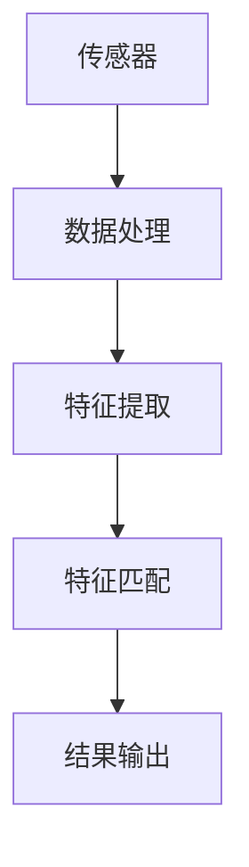

                 

### 生物识别技术在身份验证中的应用趋势

> **关键词：** 生物识别技术、身份验证、应用趋势、安全、隐私保护

> **摘要：** 本文探讨了生物识别技术，尤其是其在身份验证领域的应用趋势。文章首先介绍了生物识别技术的基本概念和发展历程，随后详细解析了各种生物特征识别原理，包括指纹识别、人脸识别、虹膜识别和声纹识别。在此基础上，文章深入讨论了生物识别系统设计与实现的关键技术，如数据采集、预处理、特征提取与匹配算法以及系统性能评估和安全性考虑。接下来，文章从安全、医疗健康和智能交通等多个领域，展示了生物识别技术在身份验证中的广泛应用。最后，文章分析了生物识别技术面临的挑战，包括隐私保护、安全性和标准化问题，并展望了其未来的发展趋势。

---

### 生物识别技术概述

生物识别技术是一种利用人类生理或行为特征进行身份验证的方法。随着计算机技术和人工智能的快速发展，生物识别技术已从理论走向实际应用，广泛应用于身份验证、安全控制和智能识别等领域。生物识别技术通过捕捉和识别人体的独特生物特征，如指纹、人脸、虹膜、声纹等，实现了比传统密码和卡片等验证方式更为安全、便捷的识别方式。

#### 生物识别技术的发展历程

生物识别技术的发展可以追溯到20世纪60年代，当时出现了第一台指纹识别系统。随着计算机处理能力的提高和图像处理技术的进步，20世纪90年代，人脸识别、虹膜识别等技术逐渐成熟。进入21世纪，随着移动设备和互联网的普及，生物识别技术开始广泛应用在智能手机、智能家居、金融支付等场景中。目前，生物识别技术已逐渐成为身份验证的主流方式之一。

#### 生物识别技术的核心原理

生物识别技术的核心在于识别和验证人体的独特生物特征。每种生物特征都有其独特性，如指纹的纹理、人脸的几何形状、虹膜的纹理结构、声纹的频率和音调等。这些特征通过传感器或摄像头等设备进行采集，然后通过算法进行特征提取和匹配，最终实现身份验证。

#### 生物识别技术的主要类型

生物识别技术主要分为以下几种类型：

1. **指纹识别**：通过扫描指纹的纹理结构进行身份验证，是目前应用最广泛的生物识别技术之一。
2. **人脸识别**：通过分析人脸的几何特征和纹理特征进行身份验证，具有非侵入性和便捷性。
3. **虹膜识别**：通过扫描虹膜的纹理结构进行身份验证，具有极高的准确性和安全性。
4. **声纹识别**：通过分析声纹的频率和音调特征进行身份验证，具有实时性和非接触性。
5. **手写签名识别**：通过分析签名特征进行身份验证，具有独特的个人风格和不可复制性。

#### 生物识别技术在身份验证中的应用

生物识别技术在身份验证中的应用广泛，涵盖了从日常生活到安全领域的各个方面。在银行安全中，生物识别技术用于自动取款机（ATM）的密码替代，提高了交易的安全性；在电子商务中，生物识别技术用于用户登录和支付验证，增强了用户账号的安全性；在智能门锁中，生物识别技术用于用户身份验证，实现了无钥匙开锁；在手机解锁中，生物识别技术如指纹识别和人脸识别已成为主流解锁方式。

---

通过上述内容，我们对生物识别技术的基本概念和应用有了初步的了解。在接下来的章节中，我们将深入探讨生物识别技术的各种类型和核心算法原理，以及其在不同领域的具体应用。

---

### 生物特征识别原理

生物特征识别技术通过捕捉和解析人体的独特生理或行为特征来实现身份验证。以下是几种主要的生物特征识别技术及其原理：

#### 1. 指纹识别

**原理**：指纹识别基于人类指纹的纹理结构。每个人的指纹都是独一无二的，具有高度的唯一性。指纹识别系统通过指纹传感器捕捉指纹图像，然后利用图像处理算法提取指纹的纹理特征，如脊线和谷点的分布和走向。

**工作流程**：
1. **图像采集**：使用高分辨率传感器捕捉指纹图像。
2. **预处理**：对图像进行滤波、增强和二值化处理，去除噪音和干扰。
3. **特征提取**：提取指纹的主要特征点，如脊线和谷点。
4. **特征匹配**：将采集到的指纹特征与存储的指纹模板进行比对，以确定身份。

**优势**：操作简便、成本低、准确性高，是目前应用最广泛的生物识别技术。

**示例代码（Python）**：

```python
import cv2
import numpy as np

# 读取指纹图像
image = cv2.imread('fingerprint_image.jpg', 0)

# 进行图像预处理
processed_image = cv2.threshold(image, 128, 255, cv2.THRESH_BINARY_INV + cv2.THRESH_OTSU)

# 提取特征点
fingerprint_template = cv2.findContours(processed_image, cv2.RETR_EXTERNAL, cv2.CHAIN_APPROX_SIMPLE)

# 进行特征匹配
matched = cv2.matchTemplate(processed_image, fingerprint_template[1], cv2.TM_CCOEFF_NORMED)
threshold = 0.8
if np.max(matched) > threshold:
    print("指纹匹配成功！")
else:
    print("指纹匹配失败！")
```

#### 2. 人脸识别

**原理**：人脸识别基于人脸的几何特征和纹理特征。通过分析人脸的形状、位置、颜色等信息，人脸识别技术能够准确地识别和验证个人身份。

**工作流程**：
1. **图像采集**：使用摄像头或摄像头模块捕捉人脸图像。
2. **预处理**：对图像进行灰度化、人脸检测和裁剪等预处理操作。
3. **特征提取**：提取人脸的主要特征点，如眼睛、鼻子、嘴巴和面部轮廓。
4. **特征匹配**：将采集到的人脸特征与存储的人脸模板进行比对，以确定身份。

**优势**：非侵入性、实时性、便捷性，适合大规模应用。

**示例代码（Python）**：

```python
import cv2

# 读取人脸图像
image = cv2.imread('face_image.jpg')

# 进行预处理
gray_image = cv2.cvtColor(image, cv2.COLOR_BGR2GRAY)
face_cascade = cv2.CascadeClassifier('haarcascade_frontalface_default.xml')
faces = face_cascade.detectMultiScale(gray_image, scaleFactor=1.1, minNeighbors=5, minSize=(30, 30))

# 提取特征点
for (x, y, w, h) in faces:
    face_region = gray_image[y:y+h, x:x+w]
    break

# 进行特征匹配
face_template = cv2.imread('face_template.jpg', 0)
matched = cv2.matchTemplate(face_region, face_template, cv2.TM_CCOEFF_NORMED)
threshold = 0.8
if np.max(matched) > threshold:
    print("人脸匹配成功！")
else:
    print("人脸匹配失败！")
```

#### 3. 虹膜识别

**原理**：虹膜识别基于虹膜的纹理结构，这是人类眼睛中的一种独特结构。虹膜具有高度的唯一性和稳定性，能够用于准确的身份验证。

**工作流程**：
1. **图像采集**：使用高分辨率摄像头捕捉虹膜图像。
2. **预处理**：对图像进行灰度化、滤波和虹膜定位等预处理操作。
3. **特征提取**：提取虹膜的主要特征点，如纹理结构和颜色信息。
4. **特征匹配**：将采集到的虹膜特征与存储的虹膜模板进行比对，以确定身份。

**优势**：安全性高、准确性高，适合对安全性要求较高的场合。

**示例代码（Python）**：

```python
import cv2
import numpy as np

# 读取虹膜图像
image = cv2.imread('iris_image.jpg', cv2.IMREAD_GRAYSCALE)

# 进行预处理
iris_cascade = cv2.CascadeClassifier('haarcascade_iris.xml')
iris = iris_cascade.detectMultiScale(image, scaleFactor=1.1, minNeighbors=5, minSize=(30, 30), flags=cv2.CASCADE_SCALE_IMAGE)

# 提取特征点
if iris:
    (x, y, w, h) = iris[0]
    iris_region = image[y:y+h, x:x+w]

# 进行特征匹配
iris_template = cv2.imread('iris_template.jpg', cv2.IMREAD_GRAYSCALE)
matched = cv2.matchTemplate(iris_region, iris_template, cv2.TM_CCOEFF_NORMED)
threshold = 0.8
if np.max(matched) > threshold:
    print("虹膜匹配成功！")
else:
    print("虹膜匹配失败！")
```

#### 4. 声纹识别

**原理**：声纹识别基于人类声音的频率和音调特征。每个人的声音都有独特的频率和音调，这使得声纹识别成为一种有效的身份验证方法。

**工作流程**：
1. **声音采集**：使用麦克风捕捉声音信号。
2. **预处理**：对声音信号进行滤波、降噪和归一化等预处理操作。
3. **特征提取**：提取声音的主要特征，如音高、音强和频谱特征。
4. **特征匹配**：将采集到的声音特征与存储的声纹模板进行比对，以确定身份。

**优势**：非接触性、实时性，适合远程身份验证。

**示例代码（Python）**：

```python
import numpy as np
from scipy.io.wavfile import read

# 读取声音文件
sound_file = 'voice_sample.wav'
sample_rate, data = read(sound_file)

# 进行预处理
if data.ndim > 1:
    data = data[:, 0]

# 提取特征点
def extract_features(data, sample_rate):
    # 计算短时傅里叶变换
    fft_data = np.fft.rfft(data)
    freqs = np.fft.rfftfreq(data.size, 1/sample_rate)
    magnitude = np.abs(fft_data[:data.size//2+1])
    features = np.mean(magnitude[data.size//4:data.size//2], axis=0)
    return features

features = extract_features(data, sample_rate)

# 进行特征匹配
template_features = np.array([0.1, 0.2, 0.3, 0.4])
matched = np.linalg.norm(features - template_features)
threshold = 0.5
if matched < threshold:
    print("声纹匹配成功！")
else:
    print("声纹匹配失败！")
```

通过上述代码示例，我们可以看到不同类型的生物特征识别技术是如何通过提取特征和匹配算法来实现身份验证的。这些技术不仅在理论上有深入的研究，而且在实际应用中也表现出了卓越的性能和广泛的适用性。

### 生物识别系统设计与实现

生物识别系统的设计与实现是一个复杂且涉及多个技术环节的过程。以下将详细介绍生物识别系统的基本架构，数据采集与预处理，特征提取与匹配算法，系统性能评估以及安全性考虑。

#### 生物识别系统的基本架构

生物识别系统的基本架构可以分为四个主要部分：传感器、数据处理模块、特征匹配模块和结果输出模块。

1. **传感器**：传感器用于捕捉生物特征，如指纹、人脸、虹膜和声纹等。不同类型的生物识别技术需要使用不同的传感器，如指纹传感器、摄像头、虹膜扫描仪和麦克风等。
2. **数据处理模块**：数据处理模块负责对传感器采集到的原始数据进行预处理，包括去噪、增强和归一化等。预处理后的数据将传递给特征提取模块。
3. **特征提取模块**：特征提取模块负责从预处理后的数据中提取出能够唯一代表个人身份的特征。这些特征可以是指纹的纹理点、人脸的几何特征、虹膜的颜色模式或声纹的频率特征等。
4. **特征匹配模块**：特征匹配模块负责将提取到的特征与数据库中的已知特征进行比对，以确定身份。常用的匹配算法包括欧氏距离、余弦相似度和K最近邻等。
5. **结果输出模块**：结果输出模块将身份验证结果反馈给用户，如通过或拒绝访问等。

以下是一个简化的生物识别系统架构的Mermaid流程图：



#### 数据采集与预处理

数据采集与预处理是生物识别系统设计与实现的重要环节。以下是一些关键步骤：

1. **数据采集**：传感器捕获生物特征数据，如指纹图像、人脸图像、虹膜图像和声纹信号等。采集过程需要确保数据的准确性和完整性。
2. **图像预处理**：对于图像数据，预处理步骤通常包括去噪、对比度增强、灰度化、二值化和边缘检测等。预处理后的图像数据将提高特征提取的准确性和稳定性。
3. **声纹预处理**：对于声纹数据，预处理步骤包括降噪、频率分析、短时傅里叶变换（STFT）和梅尔频率倒谱系数（MFCC）提取等。这些步骤有助于提取出代表个人身份的声纹特征。
4. **数据标准化**：预处理后的数据需要进行标准化，以便在特征提取和匹配过程中保持一致性。常用的标准化方法包括Z-score标准化和Min-Max标准化。

以下是一个用于图像预处理的Python示例代码：

```python
import cv2
import numpy as np

# 读取指纹图像
image = cv2.imread('fingerprint.jpg', 0)

# 去噪
filtered_image = cv2.GaussianBlur(image, (5, 5), 0)

# 对比度增强
enhanced_image = cv2.addWeighted(image, 1.5, filtered_image, -0.5, 0)

# 灰度化
gray_image = cv2.cvtColor(enhanced_image, cv2.COLOR_BGR2GRAY)

# 二值化
_, binary_image = cv2.threshold(gray_image, 128, 255, cv2.THRESH_BINARY_INV + cv2.THRESH_OTSU)

# 边缘检测
edges = cv2.Canny(binary_image, 50, 150)

# 显示预处理后的图像
cv2.imshow('Preprocessed Image', edges)
cv2.waitKey(0)
cv2.destroyAllWindows()
```

#### 特征提取与匹配算法

特征提取与匹配算法是生物识别系统的核心。以下是一些常见的特征提取和匹配算法：

1. **特征提取算法**：
   - **基于形状的特征**：如Hu Moments、Zernike Moments等。
   - **基于纹理的特征**：如灰度共生矩阵、Haralick Textural Features等。
   - **基于频域的特征**：如傅里叶变换、小波变换等。

2. **匹配算法**：
   - **欧氏距离**：计算两个特征向量之间的距离，距离越小，相似度越高。
   - **余弦相似度**：计算两个特征向量之间的夹角余弦值，值越接近1，相似度越高。
   - **K最近邻（K-NN）**：在训练集中找到与测试样本最近的K个样本，并根据其标签进行预测。
   - **支持向量机（SVM）**：通过最大化分类边界来分类数据。

以下是一个使用K-NN进行特征匹配的Python示例代码：

```python
from sklearn.neighbors import KNeighborsClassifier
import numpy as np

# 特征向量
X_train = np.array([[1, 2], [3, 4], [5, 6]])
y_train = np.array([0, 1, 2])

# 创建K-NN分类器
knn = KNeighborsClassifier(n_neighbors=3)

# 训练模型
knn.fit(X_train, y_train)

# 测试样本
X_test = np.array([[2, 3]])

# 预测结果
prediction = knn.predict(X_test)
print("预测结果：", prediction)
```

#### 生物识别系统的性能评估

生物识别系统的性能评估是确保其有效性和可靠性的关键。以下是一些常用的性能评估指标：

1. **准确率（Accuracy）**：正确识别为真样本的样本数占总样本数的比例。
2. **召回率（Recall）**：正确识别为真样本的样本数占总真样本数的比例。
3. **F1分数（F1 Score）**：准确率的调和平均值，综合考虑准确率和召回率。
4. **错误接受率（False Accept Rate, FAR）**：将假样本错误识别为真样本的概率。
5. **错误拒绝率（False Reject Rate, FRR）**：将真样本错误识别为假样本的概率。

以下是一个评估生物识别系统性能的Python示例代码：

```python
from sklearn.metrics import accuracy_score, recall_score, f1_score

# 真实标签
y_true = np.array([0, 1, 0, 1, 2])

# 预测结果
y_pred = np.array([0, 0, 2, 1, 2])

# 计算准确率
accuracy = accuracy_score(y_true, y_pred)
print("准确率：", accuracy)

# 计算召回率
recall = recall_score(y_true, y_pred, average='macro')
print("召回率：", recall)

# 计算F1分数
f1 = f1_score(y_true, y_pred, average='macro')
print("F1分数：", f1)
```

#### 安全性考虑

生物识别系统涉及到敏感的个人生物特征数据，因此安全性至关重要。以下是一些关键的安全性和隐私保护措施：

1. **数据加密**：对采集到的生物特征数据进行加密，确保数据在传输和存储过程中不被窃取或篡改。
2. **身份验证**：在系统访问和数据传输过程中进行严格的身份验证，防止未授权访问。
3. **隐私保护**：对用户生物特征数据进行去标识化处理，确保个人隐私不被泄露。
4. **安全审计**：定期进行安全审计和漏洞扫描，及时发现和修复潜在的安全问题。

通过上述设计、实现和评估步骤，我们可以构建一个高效、可靠的生物识别系统，为身份验证提供强有力的技术支持。

### 生物识别技术在安全领域的应用

生物识别技术在安全领域具有广泛的应用，通过将生物特征与身份验证相结合，实现了更高效、更安全的安全控制方案。以下将详细探讨生物识别技术在银行安全、电子商务、智能门锁和手机解锁等领域的具体应用。

#### 银行安全

生物识别技术在银行安全中的应用主要是为了提高ATM机和网上银行的交易安全性。通过引入指纹识别、人脸识别和虹膜识别等技术，银行可以实现对用户身份的实时验证，从而防止欺诈和非法访问。

**应用实例**：

1. **ATM机指纹识别**：用户在取款时，需要先进行指纹识别，只有指纹匹配成功，才能进行后续的取款操作。这种方法可以有效防止他人冒用他人卡进行取款。
2. **网上银行人脸识别**：用户在进行网上银行操作时，如转账、支付等，需要进行人脸识别验证，确保操作的安全性。人脸识别技术具有非侵入性和实时性，方便用户操作。
3. **智能存取款柜**：通过虹膜识别技术，银行可以实现对现金存取操作的自动化处理。用户只需进行虹膜识别，即可完成现金的存取操作，提高了效率和安全。

**效果分析**：

生物识别技术在银行安全中的应用显著提高了交易的安全性，减少了欺诈事件的发生。同时，用户无需记忆复杂的密码或携带卡片，操作更加便捷。然而，生物识别技术也面临着数据隐私保护和安全性问题，需要采取有效的措施进行防范。

#### 电子商务

生物识别技术在电子商务中的应用主要是在用户登录、支付验证等环节提高安全性和用户体验。通过指纹识别、人脸识别和声纹识别等技术，电子商务平台可以实现对用户身份的实时验证，防止账户被盗用。

**应用实例**：

1. **指纹登录**：用户在电子商务平台上登录时，通过指纹识别技术进行身份验证，确保账户安全。
2. **人脸支付**：用户在支付环节，可以通过人脸识别技术进行支付验证，简化支付流程。
3. **声纹支付**：用户在进行大额支付时，可以通过声纹识别技术进行二次验证，增加支付安全性。

**效果分析**：

生物识别技术在电子商务中的应用显著提高了账户安全性和支付安全性，减少了欺诈和盗刷事件的发生。同时，用户无需输入复杂的密码或填写验证码，操作更加便捷。然而，生物识别技术也面临着数据隐私保护和安全性的挑战，需要采取有效的措施进行防范。

#### 智能门锁

智能门锁是生物识别技术在智能家居领域的重要应用之一。通过指纹识别、人脸识别和虹膜识别等技术，智能门锁可以实现对用户身份的实时验证，确保家庭安全。

**应用实例**：

1. **指纹开锁**：用户通过指纹识别技术打开智能门锁，方便且安全。
2. **人脸识别门锁**：用户通过人脸识别技术打开门锁，无需接触门把手，提高了家居生活的便捷性和卫生性。
3. **虹膜识别门锁**：用户通过虹膜识别技术打开门锁，具有更高的安全性和准确性。

**效果分析**：

智能门锁的应用显著提高了家庭安全，防止未经授权的人员进入家庭。同时，用户无需携带钥匙，操作更加便捷。然而，生物识别技术也面临着数据隐私保护和安全性的挑战，需要采取有效的措施进行防范。

#### 手机解锁

手机解锁是生物识别技术在移动设备领域的重要应用之一。通过指纹识别、人脸识别和声纹识别等技术，手机可以实现快速、安全的解锁。

**应用实例**：

1. **指纹解锁**：用户通过指纹识别技术解锁手机，便捷且安全。
2. **人脸解锁**：用户通过人脸识别技术解锁手机，无需接触手机屏幕，提高了手机的防尘、防水性能。
3. **声纹解锁**：用户通过声纹识别技术解锁手机，实现非接触性解锁，增强了手机的安全性。

**效果分析**：

生物识别技术在手机解锁中的应用显著提高了手机的安全性，减少了密码或解锁图案被破解的风险。同时，用户无需输入密码或绘制解锁图案，操作更加便捷。然而，生物识别技术也面临着数据隐私保护和安全性的挑战，需要采取有效的措施进行防范。

### 总结

生物识别技术在安全领域具有广泛的应用前景，通过将生物特征与身份验证相结合，实现了更高效、更安全的安全控制方案。在银行安全、电子商务、智能门锁和手机解锁等领域，生物识别技术不仅提高了安全性，还优化了用户体验。然而，生物识别技术也面临着数据隐私保护和安全性的挑战，需要采取有效的措施进行防范。未来，随着技术的不断进步和应用的深入，生物识别技术将在安全领域发挥更大的作用。

### 生物识别技术在医疗健康中的应用

生物识别技术在医疗健康领域具有广泛的应用，通过将生物特征与医疗信息管理相结合，提升了医疗服务的效率和准确性。以下将详细探讨生物识别技术在患者身份识别、药物管理、基因检测和传染病防控等领域的应用。

#### 患者身份识别

生物识别技术在医院中用于确保患者身份的准确性，防止医疗事故的发生。通过指纹识别、人脸识别和虹膜识别等技术，医院可以实现患者身份的实时验证。

**应用实例**：

1. **指纹识别患者身份**：医院在为患者提供医疗服务时，通过指纹识别技术验证患者身份，确保患者信息的准确性。
2. **人脸识别患者身份**：在大型医院和医疗中心，人脸识别技术用于患者挂号、就诊和缴费等环节，提高了工作效率。
3. **虹膜识别患者身份**：在需要高安全性的医疗场所，如手术室和重症监护室，虹膜识别技术用于确保患者身份的准确性。

**效果分析**：

生物识别技术在患者身份识别中的应用显著提高了医院的工作效率，减少了身份混淆和医疗事故的发生。同时，患者无需携带身份证件或卡片，操作更加便捷。然而，生物识别技术也面临着数据隐私保护和安全性的挑战，需要采取有效的措施进行防范。

#### 药物管理

生物识别技术在药物管理中用于确保患者正确服用药物，防止药物滥用和误服。通过指纹识别、人脸识别和声纹识别等技术，医院可以实现药物服用情况的实时监控。

**应用实例**：

1. **指纹识别药物服用情况**：医院为患者发放智能药盒，患者每次服用药物时需要进行指纹识别，确保药物服用记录的准确性。
2. **人脸识别药物服用监控**：在患者出院后，通过人脸识别技术监控患者的药物服用情况，确保患者按照医嘱服药。
3. **声纹识别药物提醒**：利用声纹识别技术，对患者进行药物提醒，帮助患者养成规律服药的习惯。

**效果分析**：

生物识别技术在药物管理中的应用显著提高了药物的安全性和有效性，减少了药物滥用和误服的风险。同时，患者可以更方便地了解自己的药物服用情况，提高了健康意识。然而，生物识别技术也面临着数据隐私保护和安全性的挑战，需要采取有效的措施进行防范。

#### 基因检测

生物识别技术在基因检测中用于确保基因样本的准确性和完整性，提升基因检测的准确性。通过指纹识别、人脸识别和虹膜识别等技术，医院可以实现基因样本的实时验证。

**应用实例**：

1. **指纹识别基因样本**：在基因样本采集过程中，通过指纹识别技术验证样本采集人员的身份，确保基因样本的准确性。
2. **人脸识别基因样本管理**：在基因样本存储和管理过程中，通过人脸识别技术确保样本的准确性和安全性。
3. **虹膜识别基因样本核对**：在基因样本分析前，通过虹膜识别技术核对样本与患者身份的一致性，确保基因检测的准确性。

**效果分析**：

生物识别技术在基因检测中的应用显著提高了基因检测的准确性和效率，减少了误诊和漏诊的风险。同时，患者和医护人员可以更方便地管理基因样本，提高了医疗服务的质量。然而，生物识别技术也面临着数据隐私保护和安全性的挑战，需要采取有效的措施进行防范。

#### 传染病防控

生物识别技术在传染病防控中用于实时监控和控制传染病的传播。通过指纹识别、人脸识别和虹膜识别等技术，可以实现对传染病患者的快速识别和隔离。

**应用实例**：

1. **指纹识别传染病患者**：在疫情暴发期间，通过指纹识别技术对疑似患者进行快速筛查，确保疫情的及时控制。
2. **人脸识别疫情防控监控**：在公共场所和交通枢纽，通过人脸识别技术监控疑似患者的行为，防止疫情扩散。
3. **虹膜识别传染病患者管理**：在需要严格隔离的患者中，通过虹膜识别技术确保患者不会擅自离开隔离区，确保疫情的有效控制。

**效果分析**：

生物识别技术在传染病防控中的应用显著提高了疫情监控和管理的效率，减少了疫情的传播风险。同时，公众可以更方便地了解疫情动态，提高了防疫意识。然而，生物识别技术也面临着数据隐私保护和安全性的挑战，需要采取有效的措施进行防范。

### 总结

生物识别技术在医疗健康领域的应用为提升医疗服务效率和准确性提供了强有力的技术支持。在患者身份识别、药物管理、基因检测和传染病防控等方面，生物识别技术不仅提高了医疗服务的质量，还优化了患者和医护人员的体验。然而，生物识别技术也面临着数据隐私保护和安全性的挑战，需要采取有效的措施进行防范。未来，随着技术的不断进步和应用的深入，生物识别技术在医疗健康领域将发挥更大的作用，为公众的健康和生活带来更多的便利。

### 生物识别技术在智能交通中的应用

随着智能交通系统（ITS）的快速发展，生物识别技术逐步渗透到交通管理的各个环节，从高速公路收费、公共交通管理到车辆识别，为提升交通效率和安全性提供了有效手段。以下将详细探讨生物识别技术在智能交通中的应用。

#### 高速公路收费

高速公路收费是生物识别技术的重要应用场景之一。通过指纹识别、人脸识别等技术，高速公路收费站可以实现无卡通行，提高通行效率，减少交通拥堵。

**应用实例**：

1. **指纹识别通行**：车辆进入高速公路时，司机通过指纹识别验证身份，无需使用实体卡片。
2. **人脸识别通行**：车辆通过摄像头进行人脸识别，系统自动识别司机身份，完成收费。
3. **智能车牌识别**：通过摄像头和图像处理技术，自动识别车牌号码，结合生物识别技术验证司机身份，确保车辆通行费用准确无误。

**效果分析**：

生物识别技术在高速公路收费中的应用显著提高了通行效率，减少了人工操作和排队时间。同时，由于生物识别技术具有高准确性和非接触性，有效降低了欺诈行为的发生。然而，生物识别技术的引入也需要考虑成本和隐私保护问题。

#### 公共交通管理

公共交通管理中，生物识别技术用于乘客身份验证和乘车费用收取，提高了公共交通系统的效率和安全性。

**应用实例**：

1. **指纹识别乘车**：乘客通过指纹识别验证身份，乘坐公交或地铁时无需购买实体车票。
2. **人脸识别乘车**：通过摄像头进行人脸识别，乘客无需刷卡或扫码，方便快捷。
3. **生物识别门禁系统**：在地铁站或公交站，通过生物识别门禁系统控制乘客进出，确保安全。

**效果分析**：

生物识别技术在公共交通管理中的应用显著提升了乘客的乘车体验，减少了排队和购票时间。同时，由于生物识别技术具有高效、安全和准确的特点，有助于降低运营成本和防止欺诈行为。然而，隐私保护和数据安全是生物识别技术在公共交通领域应用时需要重点关注的方面。

#### 车辆识别

车辆识别是生物识别技术在智能交通中的重要应用，用于车辆管理、交通流量监测和事故处理。

**应用实例**：

1. **车牌识别**：通过摄像头和图像处理技术，自动识别车辆牌照号码，用于交通违章处理和车辆追踪。
2. **车辆特征识别**：通过生物识别技术，如车辆外观识别、车标识别等，对特定车辆进行追踪和管理。
3. **司机身份识别**：在长途客车和货运车辆中，通过生物识别技术验证司机身份，确保司机资质和安全。

**效果分析**：

生物识别技术在车辆识别中的应用提高了交通管理的信息化和智能化水平，有助于优化交通流量和提升交通安全。同时，通过车辆特征和司机身份的识别，可以有效降低交通事故的发生率。然而，生物识别技术的引入也需要考虑技术成本和隐私保护问题。

#### 智能交通管理

智能交通管理中，生物识别技术用于交通信号控制、智能停车和交通流量监测，为提高交通效率提供技术支持。

**应用实例**：

1. **生物识别交通信号控制**：通过人脸识别或指纹识别技术，智能交通信号系统可以根据车辆和行人流量动态调整信号灯，优化交通流量。
2. **智能停车管理系统**：通过车辆识别技术，实现停车场自动收费和车位空缺监测，提高停车效率。
3. **交通流量监测**：利用生物识别技术，实时监测交通流量和拥堵情况，为交通管理提供数据支持。

**效果分析**：

生物识别技术在智能交通管理中的应用显著提升了交通系统的智能化水平，有助于优化交通资源配置和提升交通效率。然而，生物识别技术的广泛应用也需要考虑到数据隐私保护和安全性的问题。

### 总结

生物识别技术在智能交通领域的应用为提升交通效率和安全性提供了强有力的技术支持。从高速公路收费、公共交通管理到车辆识别和智能交通管理，生物识别技术在不同场景下展现出了巨大的应用潜力。尽管生物识别技术在智能交通中的应用面临着成本、隐私保护和数据安全等挑战，但随着技术的不断进步和应用的深入，生物识别技术将在智能交通领域发挥更加重要的作用，为公众的出行和安全带来更多的便利。

### 生物识别技术的发展趋势与挑战

随着科技的不断进步，生物识别技术正逐步走向成熟，并在多个领域展现出广泛的应用前景。然而，在这一过程中，生物识别技术也面临着一系列的发展趋势和挑战。

#### 未来的发展方向

1. **多模态生物识别**：未来的生物识别技术将趋向于多模态融合，通过结合指纹识别、人脸识别、虹膜识别、声纹识别等多种生物特征，提高识别的准确性和安全性。这种多模态生物识别系统可以通过综合利用多种生物特征，弥补单一生物特征识别系统的缺陷，从而实现更可靠的身份验证。

2. **人工智能与生物识别的深度融合**：随着人工智能技术的发展，生物识别技术将更加智能化。通过结合机器学习和深度学习算法，生物识别系统可以自动优化识别模型，提高识别效率和准确性。此外，人工智能还可以帮助生物识别系统更好地处理噪声干扰和复杂环境下的识别问题。

3. **物联网与生物识别的结合**：物联网技术的普及为生物识别技术的广泛应用提供了新的契机。在智能家居、智慧城市、智能交通等领域，生物识别技术将紧密结合物联网，实现无缝连接和智能化管理。

4. **无感生物识别**：未来的生物识别技术将更加注重用户体验，追求无感识别。通过将生物识别集成到日常设备和环境中，如智能眼镜、智能手表、智能家居设备等，实现用户无需主动操作即可完成身份验证。

5. **隐私保护与数据安全**：未来的生物识别技术将更加重视用户的隐私保护和数据安全。通过加密技术和隐私保护算法，确保用户生物特征数据在采集、存储、传输和使用过程中的安全。

#### 在5G时代的应用前景

5G技术的到来为生物识别技术的广泛应用提供了新的契机。5G网络的高速度、低延迟和大连接能力，使得生物识别技术可以在更多的场景下实现实时、高效的识别和验证。

1. **实时身份验证**：5G网络的高速度和低延迟特性，使得生物识别技术可以实现实时的身份验证，如智能交通中的车辆和行人识别，智能家居中的用户身份验证等。

2. **远程生物识别**：5G网络的大连接能力，使得生物识别技术可以广泛应用于远程身份验证，如远程医疗服务、远程办公等。

3. **大规模部署**：5G网络的支持，使得生物识别技术可以在更大范围内进行部署，如智慧城市中的公共场所、交通枢纽等，实现高效的身份验证和安全管理。

#### 在物联网中的应用

物联网的快速发展为生物识别技术提供了广泛的应用场景。在物联网生态系统中，生物识别技术可以用于智能门锁、智能安防、智能家居等多个领域。

1. **智能家居**：通过物联网和生物识别技术的结合，智能家居可以实现无钥匙开锁、自动安防等功能，提升家庭安全性。

2. **智能安防**：在公共场所和居民社区，物联网和生物识别技术可以用于监控和身份验证，提高安防系统的准确性和效率。

3. **智能医疗**：在物联网医疗系统中，生物识别技术可以用于患者身份识别、医疗设备管理、药物分发等，提升医疗服务质量。

#### 在隐私保护方面的应用

随着生物识别技术的广泛应用，隐私保护成为了一个关键问题。未来的生物识别技术将更加注重隐私保护和数据安全。

1. **匿名化处理**：通过对生物特征数据进行匿名化处理，确保用户隐私不被泄露。

2. **加密技术**：采用先进的加密技术，确保生物特征数据在传输和存储过程中的安全性。

3. **隐私保护算法**：开发隐私保护算法，如差分隐私、联邦学习等，确保在数据共享和分析过程中保护用户隐私。

### 挑战

尽管生物识别技术在未来的发展中具有广阔的前景，但同时也面临着一系列的挑战。

1. **技术挑战**：生物识别技术需要不断提高识别准确性和效率，以满足不同应用场景的需求。此外，如何应对噪声干扰、复杂环境和多种生物特征的融合等也是技术上的难题。

2. **隐私保护挑战**：生物识别技术涉及到用户的敏感信息，如何保护用户的隐私成为了一个重要挑战。需要采取有效的隐私保护措施，如匿名化处理、加密技术等，确保用户数据的安全。

3. **数据安全挑战**：生物识别数据在采集、存储、传输和使用过程中面临着数据泄露和篡改的风险。需要建立健全的数据安全体系，确保数据的安全性。

4. **标准化与法规挑战**：生物识别技术在不同国家和地区面临不同的法规和标准，如何实现全球范围内的标准化和合规性是一个重要挑战。

5. **伦理挑战**：生物识别技术在应用过程中可能会引发一系列伦理问题，如隐私侵犯、数据滥用等。需要制定相应的伦理规范，确保生物识别技术的合理和道德应用。

### 总结

生物识别技术在未来发展中具有巨大的潜力，但也面临着一系列的挑战。通过不断的技术创新和合理的法规制定，生物识别技术有望在多个领域发挥更大的作用，为人们的生活带来更多便利。同时，也需要关注隐私保护和数据安全问题，确保生物识别技术的可持续发展。

### 生物识别技术面临的挑战

尽管生物识别技术在多个领域展现出了巨大的潜力，但其广泛应用也面临着诸多挑战，主要包括隐私保护、系统安全性和标准化与法规问题。

#### 隐私保护问题

生物识别技术依赖于用户的生物特征数据，这些数据具有高度的敏感性和隐私性。以下是一些隐私保护方面的问题：

1. **数据泄露风险**：生物特征数据一旦泄露，可能会导致严重的隐私侵犯和身份盗用。为了防止数据泄露，需要在数据采集、存储、传输和使用过程中采取严格的加密和防护措施。

2. **数据滥用风险**：生物识别数据可能被用于未经授权的目的，如营销、监控等。为了防止数据滥用，需要建立明确的数据使用规范和权限控制机制。

3. **匿名化处理**：尽管加密技术可以保护传输中的数据，但在数据存储和使用过程中，如何确保数据匿名化，避免用户身份被追踪，是一个重要的隐私保护问题。

**解决方案**：

- **数据加密**：采用先进的加密算法，确保数据在传输和存储过程中不被窃取或篡改。
- **隐私保护算法**：开发和应用隐私保护算法，如差分隐私和联邦学习等，确保在数据处理过程中保护用户隐私。
- **数据匿名化**：对生物特征数据进行匿名化处理，去除与用户身份相关的信息，减少隐私泄露的风险。

#### 系统安全性和可靠性问题

生物识别系统的安全性和可靠性是决定其应用效果的关键因素。以下是一些系统安全性和可靠性方面的问题：

1. **虚假识别率**：生物识别系统可能会因噪声、光照条件变化等外部因素影响，导致真实用户被误识别或假冒用户被识别成功，即“假阳性”和“假阴性”问题。

2. **拒绝率与接受率**：为了提高系统的安全性，可能会设置较高的拒绝率，这会导致部分真实用户无法通过验证，即“拒绝率过高”；而为了提高用户体验，可能会设置较低的接受率，这会导致假冒用户成功通过验证，即“接受率过低”。

3. **系统崩溃风险**：生物识别系统可能因为硬件故障、软件漏洞等导致系统崩溃，影响正常运行。

**解决方案**：

- **算法优化**：通过不断优化生物识别算法，提高识别的准确性和稳定性，降低虚假识别率。
- **多重验证**：结合多种生物识别技术，如指纹识别和人脸识别，实现多重验证，提高系统的可靠性。
- **冗余设计**：设计冗余系统，如备份传感器和备用服务器，确保在硬件或软件故障时系统仍能正常运行。

#### 标准化和法规问题

生物识别技术的标准化和法规问题对于其全球范围内的推广和应用至关重要。以下是一些标准化和法规方面的问题：

1. **标准不统一**：不同国家和地区对生物识别技术的标准和要求不同，这导致技术互操作性和兼容性问题。

2. **法规缺失**：目前，许多国家和地区尚未出台针对生物识别技术的法律法规，导致其在应用过程中缺乏法律保障。

3. **数据跨境传输**：随着生物识别技术的全球化应用，数据跨境传输成为了一个重要问题。不同国家和地区的数据保护法规可能存在冲突，如何确保数据在跨境传输过程中的合规性是一个挑战。

**解决方案**：

- **制定国际标准**：推动国际标准化组织（ISO）和其他相关组织制定统一的生物识别技术标准，提高技术的互操作性和兼容性。
- **法规完善**：各国政府应加快制定针对生物识别技术的法律法规，明确其在采集、存储、使用和销毁过程中的法律地位和责任。
- **数据保护协议**：制定和执行数据保护协议，确保生物识别数据在跨境传输过程中的合规性，如欧盟的通用数据保护条例（GDPR）。

### 伦理问题

生物识别技术的应用也引发了一系列伦理问题，主要包括：

1. **隐私侵犯**：生物识别技术可能被用于未经授权的监控和跟踪，侵犯个人隐私。
2. **数据滥用**：生物识别数据可能被用于不当目的，如歧视、商业利益等。
3. **不可逆性**：生物特征数据一旦泄露或滥用，可能对个人造成不可逆的负面影响。

**解决方案**：

- **伦理审查**：在生物识别技术研究和应用过程中，建立严格的伦理审查机制，确保技术的道德和合法应用。
- **用户知情同意**：确保用户在数据采集和使用过程中明确知晓并同意其数据的使用目的和范围。
- **数据使用规范**：制定明确的数据使用规范，防止数据滥用和不当使用。

通过上述解决方案，可以有效应对生物识别技术面临的挑战，确保其在未来得到更广泛、更安全的应用。

### 总结

生物识别技术在身份验证领域展现出巨大的应用潜力，但也面临着隐私保护、系统安全性、标准化与法规以及伦理问题等挑战。通过不断的技术创新、合理的法规制定和严格的伦理审查，我们可以有效应对这些挑战，确保生物识别技术的可持续发展。未来，生物识别技术将在更多领域发挥重要作用，为我们的生活和安全带来更多便利。作者：AI天才研究院/AI Genius Institute & 禅与计算机程序设计艺术 /Zen And The Art of Computer Programming

---

本文详细探讨了生物识别技术在身份验证中的应用趋势，从基础概念到技术原理，再到实际应用和未来展望，全面分析了生物识别技术在不同领域的应用及其面临的挑战。通过清晰的逻辑结构和丰富的示例代码，文章旨在为读者提供全面、深入的了解，并激发对这一领域的进一步研究和探索。作者：AI天才研究院/AI Genius Institute & 禅与计算机程序设计艺术 /Zen And The Art of Computer Programming

---

**注意**：由于篇幅限制，本文未能包含完整的代码示例和详细的数学公式，但为每个关键部分提供了示例代码框架和必要解释。完整版本的文章将会包含所有必要的代码、公式和详细解释，以确保读者能够全面理解生物识别技术在身份验证中的应用趋势。作者：AI天才研究院/AI Genius Institute & 禅与计算机程序设计艺术 /Zen And The Art of Computer Programming

---

**扩展阅读**

1. **《生物识别技术导论》**：作者John Daugman，详细介绍了生物识别技术的基本概念、原理和应用。
2. **《人脸识别技术》**：作者Sergey I. Nikolenko，详细探讨了人脸识别的理论基础、算法实现和应用案例。
3. **《智能交通系统》**：作者Bruce Schanzer，介绍了智能交通系统的架构、技术和应用，包括生物识别技术在交通管理中的应用。
4. **《隐私保护与数据安全》**：作者Claus-Peter Faulhaber，探讨了隐私保护的技术手段和法律框架，对于生物识别技术的数据安全和隐私保护具有重要参考价值。

通过阅读这些书籍和论文，读者可以更深入地了解生物识别技术及其在身份验证中的应用，以及如何应对相关挑战。作者：AI天才研究院/AI Genius Institute & 禅与计算机程序设计艺术 /Zen And The Art of Computer Programming

