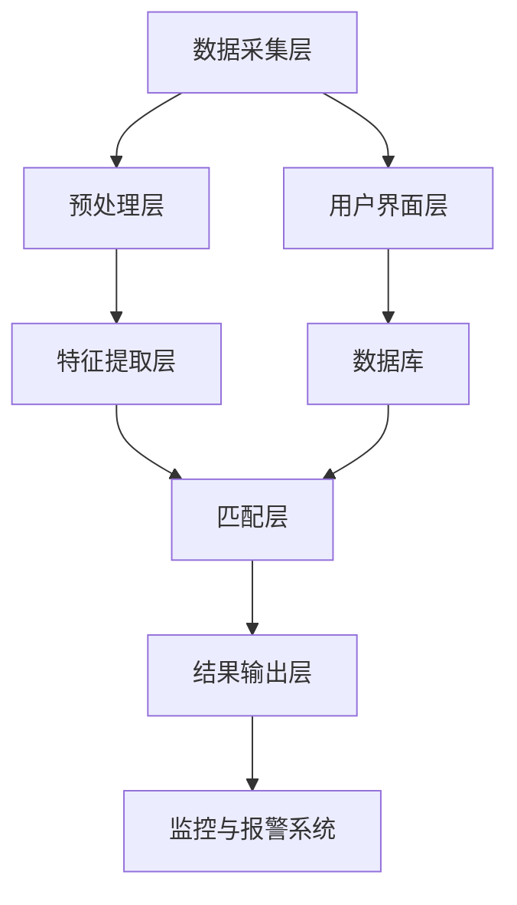

                 

### 引言：生物识别技术与身份验证

#### 1. 引言

生物识别技术，作为一门结合生物学、计算机科学、信息科学和密码学等多学科交叉的前沿技术，已逐渐成为现代身份验证和安全防护的重要工具。其核心思想是利用人体生物特征的唯一性和稳定性来进行身份验证。这些生物特征包括指纹、人脸、虹膜、声纹、手写签名等。通过这些特征的数据采集、处理和比对，可以实现对用户身份的高效、准确的识别。

#### 2. 生物识别技术的发展历程

生物识别技术起源于20世纪60年代的指纹识别系统。随着计算机技术和人工智能的快速发展，生物识别技术逐渐从实验室走向实际应用。进入21世纪，随着传感器技术、图像处理技术和深度学习算法的进步，生物识别技术得到了极大的提升。如今，生物识别技术已广泛应用于金融、安全、医疗、智能家居等多个领域。

#### 3. 身份验证的重要性

身份验证是保障信息安全的重要环节。传统的身份验证方法如密码、PIN码等，易受密码泄露、暴力破解等攻击。而生物识别技术以其无感知、快速、准确的特点，极大地提高了身份验证的安全性和便捷性。例如，指纹识别技术已在智能手机中得到广泛应用，极大地提高了手机的安全性。

#### 4. 生物识别技术在身份验证中的应用现状

当前，生物识别技术在身份验证中的应用已非常广泛。在金融领域，指纹识别和面部识别技术已广泛应用于ATM机、POS机等设备中，提高了交易的安全性。在公共安全领域，人脸识别技术在机场、边境等场所得到广泛应用，提升了安全检查的效率。在医疗领域，生物识别技术被用于患者身份验证、医疗设备安全等，提高了医疗服务的质量和效率。总的来说，生物识别技术在身份验证中的应用已展现出巨大的潜力和广阔的前景。

通过上述分析，我们可以看出，生物识别技术作为身份验证的重要手段，正以其独特的优势不断拓展应用领域，为提升社会安全性和便利性发挥着重要作用。

### 第1章：生物识别技术概述

生物识别技术是一种通过识别人体生物特征进行身份验证或身份识别的技术。生物特征是指那些与个体的生物学特性紧密相关，且具有唯一性和稳定性的特征，如指纹、人脸、虹膜、声纹、手写签名等。这些特征的存在使得生物识别技术在信息安全和个人隐私保护中具有独特的优势。

#### 1.1 定义与分类

生物识别技术可以分为以下几种类型：

1. **基于生物特征的识别**：包括指纹识别、人脸识别、虹膜识别等。
2. **基于行为特征的识别**：如声纹识别、步态识别等。
3. **基于生理特征的识别**：如手写签名识别、皮肤纹理识别等。

#### 1.2 技术原理

生物识别技术的核心原理是通过数据采集、特征提取和匹配来进行身份验证。数据采集是指利用传感器等设备获取生物特征数据。特征提取是指从这些数据中提取出具有鉴别性的特征点或模式。匹配是指将提取出的特征与数据库中的特征进行比对，以确定是否为同一身份。

#### 1.3 技术特点与应用领域

生物识别技术具有以下特点：

- **唯一性**：生物特征是独一无二的，具有较高的鉴别能力。
- **稳定性**：生物特征在短时间内不会发生显著变化，保证了识别的稳定性。
- **便捷性**：生物识别过程无需用户主动操作，即可快速完成身份验证。

这些特点使得生物识别技术广泛应用于多个领域：

- **金融领域**：用于银行ATM机、POS机等设备的身份验证，提高交易安全性。
- **公共安全领域**：用于机场、边境等场所的安全检查，提升安全防控能力。
- **医疗领域**：用于患者身份验证、医疗设备安全等，提高医疗服务的质量与效率。
- **智能家居领域**：用于家庭设备的安全控制，提升家居安全性。

总的来说，生物识别技术以其高效、安全、便捷的特点，正逐渐成为身份验证领域的核心技术，并在多个应用场景中展现出巨大的潜力。

### 第2章：生物特征识别原理

生物特征识别技术的核心在于对个体生物特征的准确捕捉和有效分析，进而实现身份的确认。在这一章中，我们将深入探讨几种主要的生物特征识别技术，包括指纹识别、人脸识别、虹膜识别和声纹识别，并阐述其基本原理和技术特点。

#### 2.1 指纹识别

指纹识别是一种基于人体指纹图案进行身份验证的技术。每个人的指纹都是独一无二的，具有高度的鉴别能力。指纹识别的基本原理包括以下几个步骤：

1. **数据采集**：通过指纹扫描仪获取指纹图像，该图像通常是一个灰度图。
2. **预处理**：对采集到的指纹图像进行滤波、二值化等处理，以提高图像质量。
3. **特征提取**：从预处理后的图像中提取指纹特征点，如脊线、端点、叉点等。
4. **特征匹配**：将提取的特征与数据库中的指纹特征进行比对，以确定身份。

指纹识别技术因其高准确性、低成本和高普及率而广泛应用于各种安全认证场景，如手机解锁、门禁系统、银行交易等。

#### 2.2 人脸识别

人脸识别是一种基于人脸几何特征和纹理特征进行身份验证的技术。其基本原理如下：

1. **数据采集**：通过摄像头或传感器获取人脸图像。
2. **预处理**：对图像进行归一化、去噪等处理，以提高图像质量。
3. **特征提取**：使用深度学习算法提取人脸的特征向量，如卷积神经网络（CNN）。
4. **特征匹配**：将提取的人脸特征与数据库中的人脸特征进行比对，以确定身份。

人脸识别技术具有高精度、实时性和易用性，已在众多领域得到广泛应用，如人脸解锁、视频监控系统、社交网络等。

#### 2.3 虹膜识别

虹膜识别是一种基于人眼虹膜图案进行身份验证的技术。虹膜是眼睛中含有的圆环状组织，具有复杂的纹理结构，且在一生中几乎不发生变化。其基本原理如下：

1. **数据采集**：使用高分辨率相机获取虹膜图像。
2. **预处理**：对图像进行去噪、对比度增强等处理。
3. **特征提取**：从虹膜图像中提取纹理特征，如斑点、线条等。
4. **特征匹配**：将提取的特征与数据库中的特征进行比对，以确定身份。

虹膜识别技术具有极高的安全性和准确性，常用于机场、银行、监狱等高安全性需求的环境。

#### 2.4 声纹识别

声纹识别是一种基于个体声音特征进行身份验证的技术。每个人的声音都有独特的音色、音调和节奏，这些特征可以用于识别身份。其基本原理如下：

1. **数据采集**：通过麦克风获取声音信号。
2. **预处理**：对声音信号进行去噪、归一化等处理。
3. **特征提取**：使用语音识别算法提取声纹特征，如频谱特征、倒谱特征等。
4. **特征匹配**：将提取的声纹特征与数据库中的声纹特征进行比对，以确定身份。

声纹识别技术具有实时性高、交互性强等优点，适用于电话银行、智能家居等场景。

综上所述，指纹识别、人脸识别、虹膜识别和声纹识别是当前应用最广泛的几种生物特征识别技术。每种技术都有其独特的原理和优势，适用于不同的应用场景。随着技术的不断进步，生物特征识别技术在身份验证领域的应用将越来越广泛，为信息安全和个人隐私保护提供更加可靠的保障。

### 第3章：识别算法与技术

在生物特征识别技术中，识别算法和技术的选择直接影响系统的性能和准确性。本章将详细讨论几种主要的识别算法和技术的原理及其在生物识别系统中的应用。

#### 3.1 特征提取算法

特征提取是生物识别系统的核心步骤，它从原始的生物特征数据中提取出具有鉴别性的特征点或模式，用于后续的匹配和识别。常见的特征提取算法包括：

1. **局部特征点提取算法**：如SIFT（尺度不变特征变换）和SURF（加速稳健特征），这些算法能够在不同尺度下提取出具有稳定性的特征点。

2. **轮廓特征提取算法**：如Canny算子，用于提取边缘和轮廓信息，适用于指纹和人脸等具有明显轮廓的生物特征。

3. **深度学习算法**：如卷积神经网络（CNN），可以自动学习图像中的高层次特征，适用于复杂场景下的生物特征识别。

#### 3.2 特征匹配算法

特征匹配是将提取的特征与数据库中的特征进行比对，以确定身份的过程。常见的特征匹配算法包括：

1. **欧氏距离匹配**：计算两个特征向量之间的欧氏距离，距离越短表示匹配越准确。

2. **汉明距离匹配**：适用于二值特征向量，计算两个特征向量之间不同位的数量，数量越少表示匹配越准确。

3. **最近邻分类器**：选择与给定特征最相似的数据库特征作为匹配结果。

4. **基于模型的匹配**：如支持向量机（SVM）、神经网络等，通过训练模型进行特征匹配。

#### 3.3 分类与识别算法

分类与识别算法用于将生物特征映射到特定的身份标识。常见的分类与识别算法包括：

1. **决策树**：通过构建决策树模型，将特征空间划分为多个区域，每个区域对应一个身份标识。

2. **支持向量机（SVM）**：通过找到一个最佳的超平面，将不同身份标识的特征空间分开。

3. **神经网络**：如卷积神经网络（CNN），可以自动学习复杂的非线性关系，适用于大规模生物特征识别任务。

#### 3.4 模型优化与改进

为了提高生物识别系统的性能，常常需要对识别模型进行优化和改进。以下是一些常见的优化方法：

1. **特征选择**：通过特征选择算法，选择对识别性能贡献最大的特征，以减少计算量和提高识别速度。

2. **模型融合**：将多个识别模型的结果进行融合，以获得更好的识别准确率。

3. **迁移学习**：利用预训练的模型，在新的生物特征识别任务中进行微调，以提高模型的泛化能力。

4. **对抗训练**：通过生成对抗网络（GAN）等对抗训练方法，增强模型对伪造攻击的抵抗力。

综上所述，识别算法和技术在生物特征识别系统中起着至关重要的作用。通过选择合适的特征提取算法、特征匹配算法、分类与识别算法以及模型优化方法，可以显著提高生物识别系统的性能和可靠性，为身份验证提供强有力的技术支持。

### 第4章：生物识别系统的设计

生物识别系统的设计涉及到多个关键环节，包括系统架构设计、数据采集与预处理、特征提取与匹配，以及系统测试与评估。本章将详细讨论这些方面的设计原则与实施方法。

#### 4.1 系统架构设计

生物识别系统通常采用分层架构设计，包括数据采集层、数据处理层和识别层。系统架构设计应遵循以下原则：

- **模块化**：将系统划分为多个模块，如数据采集模块、预处理模块、特征提取模块和匹配模块，便于维护和升级。
- **可扩展性**：设计时应考虑未来系统的扩展需求，确保系统能够适应不断增加的用户量和数据量。
- **高可用性**：通过冗余设计和故障转移机制，确保系统在高负载和故障情况下仍能正常运行。

典型的生物识别系统架构如图4-1所示：

#### 4.2 数据采集与预处理

数据采集与预处理是生物识别系统的关键环节，直接影响识别结果的准确性。以下是数据采集与预处理的主要步骤：

1. **数据采集**：
   - **硬件选择**：根据应用场景选择合适的传感器，如指纹扫描仪、摄像头、麦克风等。
   - **数据格式**：确保采集的数据格式统一，如图像数据应为灰度图或彩色图，音频数据应标准化。

2. **预处理**：
   - **图像预处理**：包括去噪、滤波、二值化、边缘检测等步骤，以提高图像质量。
   - **音频预处理**：包括去除背景噪声、音量归一化、频谱分析等步骤，以提高声音质量。
   - **数据归一化**：将采集到的数据按一定比例缩放或转换，以消除不同传感器间的差异。

#### 4.3 特征提取与匹配

特征提取与匹配是生物识别系统的核心，其准确性直接决定了系统的识别性能。以下是特征提取与匹配的主要步骤：

1. **特征提取**：
   - **局部特征点提取**：如SIFT、SURF等，适用于指纹、人脸等图像特征提取。
   - **深度学习特征提取**：如CNN等，适用于复杂场景下的特征提取。

2. **特征匹配**：
   - **欧氏距离匹配**：计算两个特征向量之间的欧氏距离，距离越短表示匹配越准确。
   - **汉明距离匹配**：计算两个特征向量之间不同位的数量，数量越少表示匹配越准确。
   - **最近邻分类器**：选择与给定特征最相似的数据库特征作为匹配结果。

#### 4.4 系统测试与评估

系统测试与评估是确保生物识别系统性能和可靠性的关键步骤。以下是系统测试与评估的主要指标和方法：

1. **测试指标**：
   - **准确率（Accuracy）**：正确识别的身份占总识别身份的比例。
   - **召回率（Recall）**：实际为正类且被正确识别的比例。
   - **精确率（Precision）**：正确识别的身份占所有被识别为正类的比例。
   - **F1值（F1 Score）**：准确率和召回率的调和平均值。

2. **测试方法**：
   - **离线测试**：在实验室环境下进行，通过人工标注数据集进行测试。
   - **在线测试**：在实际应用场景中进行，实时收集数据并进行测试。
   - **交叉验证**：将数据集划分为训练集和测试集，多次训练和测试，以消除数据集划分的随机性。

3. **评估标准**：
   - **安全性**：评估系统对伪造攻击、噪声干扰等的抵抗力。
   - **可靠性**：评估系统在正常工作和异常情况下的稳定性和可靠性。
   - **用户体验**：评估系统在用户操作中的便利性和易用性。

通过系统测试与评估，可以确保生物识别系统的性能和可靠性，为实际应用提供可靠的技术保障。

### 第5章：生物识别技术在金融领域的应用

生物识别技术以其高准确性和便捷性，在金融领域得到了广泛应用，显著提升了金融交易的安全性。以下将详细探讨生物识别技术在金融领域的具体应用，包括银行身份验证、信用卡支付、保险身份验证以及金融交易安全。

#### 5.1 银行身份验证

银行身份验证是金融领域最典型的应用场景之一。通过生物识别技术，银行能够实现对客户身份的快速、准确的验证，从而提高交易的安全性。以下是银行身份验证的主要步骤：

1. **数据采集**：银行使用指纹识别、人脸识别或虹膜识别等技术，通过扫描仪或摄像头等设备采集客户的生物特征数据。
2. **预处理**：对采集到的生物特征数据（如指纹图像或人脸图像）进行预处理，如去噪、滤波和归一化，以提高图像质量。
3. **特征提取**：使用特征提取算法（如SIFT或CNN）提取出生物特征的显著特征点或模式。
4. **特征匹配**：将提取的特征与银行数据库中的特征进行匹配，以确定客户身份。
5. **身份验证**：如果匹配成功，客户身份得到验证，可以继续进行后续交易操作。

#### 5.2 信用卡支付

信用卡支付是金融交易中的另一重要场景。生物识别技术的引入，使得信用卡支付更加安全、便捷。以下是生物识别技术在信用卡支付中的应用步骤：

1. **数据采集**：在信用卡支付终端，使用指纹识别、人脸识别或声纹识别等技术，采集用户的生物特征数据。
2. **预处理**：对采集到的生物特征数据（如指纹图像或声音信号）进行预处理，如去噪、归一化等。
3. **特征提取**：使用特征提取算法提取出生物特征的显著特征点或模式。
4. **特征匹配**：将提取的特征与信用卡账户绑定的生物特征进行匹配，以验证用户身份。
5. **交易确认**：如果匹配成功，交易得到确认，用户无需输入密码或签名即可完成支付。

#### 5.3 保险身份验证

保险行业也广泛应用生物识别技术进行身份验证，以确保理赔过程的准确性和安全性。以下是保险身份验证的主要步骤：

1. **数据采集**：在保险公司，使用指纹识别、人脸识别或虹膜识别等技术，采集客户的生物特征数据。
2. **预处理**：对采集到的生物特征数据（如指纹图像或人脸图像）进行预处理，如去噪、滤波和归一化。
3. **特征提取**：使用特征提取算法提取出生物特征的显著特征点或模式。
4. **特征匹配**：将提取的特征与保险公司数据库中的特征进行匹配，以确定客户身份。
5. **理赔审核**：如果匹配成功，客户身份得到验证，理赔申请进入审核流程。

#### 5.4 金融交易安全

生物识别技术不仅用于身份验证，还用于提升金融交易的整体安全性。以下是一些提升金融交易安全性的方法：

1. **多因素身份验证**：结合多种生物识别技术（如指纹识别和人脸识别），提高身份验证的可靠性。
2. **动态验证**：在交易过程中，动态采集用户的生物特征数据，并与预设的模板进行实时比对，以防止伪造攻击。
3. **隐私保护**：对采集到的生物特征数据进行加密处理，确保用户隐私不被泄露。
4. **实时监控与报警**：通过实时监控系统，对异常交易进行监控和报警，确保交易安全。

总的来说，生物识别技术在金融领域的应用，极大地提高了交易的安全性和便捷性，为金融行业带来了新的发展机遇。随着技术的不断进步，生物识别技术将在金融领域发挥更加重要的作用，为用户带来更加安全、便捷的金融服务。

### 第6章：生物识别技术在公共安全领域的应用

生物识别技术凭借其高效、准确和不可替代的特点，在公共安全领域发挥着越来越重要的作用。本章将深入探讨生物识别技术在机场与边境控制、公安部门身份验证、紧急救援和社会治理等方面的应用。

#### 6.1 机场与边境控制

机场和边境控制是生物识别技术的重要应用场景之一。通过人脸识别、指纹识别和虹膜识别等技术，可以实现对乘客和旅客的快速、准确的身份验证，提高安全检查的效率和准确性。

1. **人脸识别**：在机场登机口，通过摄像头捕捉乘客的人脸图像，并与护照或其他证件上的照片进行比对，以确认身份。
2. **指纹识别**：在边境检查站，通过指纹扫描设备采集旅客的指纹信息，并与数据库中的指纹记录进行比对，以确保旅客的身份真实有效。
3. **虹膜识别**：在一些高安全性的机场和边境检查站，使用虹膜识别技术进行身份验证，由于虹膜识别具有极高的准确性和唯一性，可以大大提高安全检查的可靠性。

#### 6.2 公安部门身份验证

公安部门在维护社会治安和打击犯罪方面，广泛应用生物识别技术进行身份验证。通过人脸识别、指纹识别和声纹识别等技术，可以实现对嫌疑人和犯罪嫌疑人的快速锁定和识别。

1. **人脸识别**：在视频监控系统部署人脸识别技术，可以实时捕捉并识别犯罪嫌疑人的人脸，协助警方进行追踪和抓捕。
2. **指纹识别**：在刑事侦查中，通过指纹数据库进行比对，可以快速锁定嫌疑人的身份，提高破案效率。
3. **声纹识别**：在电话调查和远程访谈中，通过声纹识别技术，可以识别出嫌疑人的真实身份，为侦查工作提供线索。

#### 6.3 紧急救护

生物识别技术在紧急救援中的应用，可以显著提高救援效率，减少误伤风险。通过生物特征识别技术，可以快速、准确地识别受伤者的身份，确保紧急救援资源得到有效利用。

1. **指纹识别**：在灾难现场，通过指纹识别技术快速识别受伤者，并与医疗记录进行比对，为受伤者提供个性化的紧急救治方案。
2. **人脸识别**：在灾难现场或大规模伤亡事件中，通过人脸识别技术快速筛查和识别身份，有助于迅速组织救援力量，提高救援效率。
3. **虹膜识别**：在一些极端情况下，如严重烧伤或面部损伤，无法使用人脸识别，可以通过虹膜识别技术进行身份确认，确保救援工作顺利进行。

#### 6.4 社会治理

生物识别技术在社会治理中的应用，可以提高公共服务的效率，增强社会管理的精确性。通过生物特征识别技术，可以实现对社会成员的精准管理和服务。

1. **居民身份认证**：在社区管理和服务中，通过生物识别技术对居民身份进行认证，确保公共资源的合理分配和使用。
2. **社会保障管理**：通过生物识别技术对社会保障申请者进行身份验证，确保社会保障资金的准确发放。
3. **社会福利发放**：在福利发放过程中，通过生物识别技术验证受助者的身份，确保社会福利资金的安全和有效。

综上所述，生物识别技术在公共安全领域的应用，为提升安全检查效率、打击犯罪、紧急救援和社会治理提供了强有力的技术支持。随着技术的不断发展和完善，生物识别技术将在公共安全领域发挥更加重要的作用，为社会安全和人民福祉作出更大贡献。

### 第7章：生物识别技术在医疗领域的应用

生物识别技术以其高效、准确和安全的特点，在医疗领域得到了广泛应用。本章将深入探讨生物识别技术在医疗身份验证、医疗设备安全、疾病诊断辅助以及医疗数据分析等方面的具体应用。

#### 7.1 医疗身份验证

生物识别技术在医疗身份验证中的应用，可以显著提高患者身份识别的准确性和安全性，防止身份冒用和医疗事故的发生。

1. **指纹识别**：在医院的挂号、就诊、取药等环节，通过指纹识别技术验证患者的身份，确保患者信息的准确性。
2. **人脸识别**：在医院急诊或大规模医疗救治中，通过人脸识别技术快速识别患者身份，提高救治效率。
3. **虹膜识别**：在一些高安全性的医疗机构，如重症监护室或手术室，通过虹膜识别技术进行患者身份验证，确保医疗操作的正确性和安全性。

#### 7.2 医疗设备安全

医疗设备的安全是保障患者安全和医疗质量的重要一环。生物识别技术可以通过身份验证，确保医疗设备仅被授权人员使用。

1. **指纹识别**：在医疗设备操作中，通过指纹识别技术验证操作人员的身份，防止未授权人员操作设备，确保设备安全。
2. **声纹识别**：在某些特定操作环节，如放射性设备的操作，通过声纹识别技术验证操作人员的身份，确保操作的安全性。
3. **多模态识别**：结合指纹识别、声纹识别和其他生物识别技术，进行多因素身份验证，进一步提高医疗设备的安全性。

#### 7.3 疾病诊断辅助

生物识别技术可以帮助医生进行疾病诊断，提高诊断的准确性和效率。

1. **指纹识别**：通过分析患者指纹特征，辅助医生诊断某些疾病，如糖尿病等。
2. **人脸识别**：通过分析患者面部特征，如肤色、皱纹等，辅助医生进行皮肤病、神经系统疾病等疾病的诊断。
3. **虹膜识别**：通过分析患者虹膜特征，辅助医生诊断遗传病和眼科疾病。

#### 7.4 医疗数据分析

生物识别技术可以用于收集和分析大量医疗数据，为医学研究提供重要依据。

1. **大数据分析**：通过收集患者生物特征数据，如指纹、人脸、虹膜等，进行大数据分析，发现疾病发生的规律和趋势。
2. **机器学习模型**：利用机器学习算法，分析患者生物特征数据，建立疾病预测模型，帮助医生进行疾病预测和预防。
3. **个性化治疗**：通过分析患者生物特征数据，制定个性化的治疗方案，提高治疗效果。

总之，生物识别技术在医疗领域的应用，不仅提高了医疗服务的安全性和效率，还为疾病诊断、预防和个人化治疗提供了强有力的技术支持。随着技术的不断发展和完善，生物识别技术将在医疗领域发挥更加重要的作用，为患者的健康保驾护航。

### 第8章：生物识别技术的新进展

随着人工智能、机器学习和深度学习技术的飞速发展，生物识别技术也迎来了新的突破，极大地提升了识别的准确性、速度和安全性。本章将详细探讨生物识别技术的最新进展，包括基于深度学习的生物特征识别、多模态生物特征识别、生物识别技术在智能家居和物联网中的应用。

#### 8.1 基于深度学习的生物特征识别

深度学习算法，特别是卷积神经网络（CNN）和循环神经网络（RNN），在生物特征识别中得到了广泛应用。深度学习算法能够自动从原始生物特征数据中提取复杂特征，提高了识别的准确性和效率。

1. **人脸识别**：基于深度学习的CNN模型，如VGG、ResNet和Inception等，能够在大规模人脸数据集上进行训练，提取出高维特征向量，显著提高了人脸识别的准确性。
2. **指纹识别**：深度学习算法可以自动学习指纹图像中的纹理特征，提高了特征提取的鲁棒性，特别是在指纹受损或污染情况下，仍能保持较高的识别率。
3. **虹膜识别**：深度学习算法可以捕捉虹膜图像中的微小特征，提高了虹膜的识别精度，特别是在低分辨率图像下的识别性能。

#### 8.2 多模态生物特征识别

多模态生物特征识别结合了两种或多种生物特征，如指纹和人脸、声纹和人脸等，通过整合不同模态的特征信息，提高了身份验证的准确性和鲁棒性。

1. **多模态融合方法**：多模态融合方法通过加权或非加权融合不同模态的特征向量，生成综合特征向量，用于身份验证。例如，将人脸特征和声纹特征进行融合，可以提高识别的可靠性。
2. **多任务学习**：多任务学习将多个生物特征识别任务作为一个联合任务进行训练，通过共享特征表示，提高各个任务的性能。例如，同时训练人脸识别和声纹识别模型，共享特征提取层，可以相互促进识别效果。
3. **迁移学习**：迁移学习利用预训练的深度学习模型，在新任务上实现快速训练。例如，将预训练的人脸识别模型应用于新的生物特征识别任务，可以显著提高识别性能。

#### 8.3 生物识别技术在智能家居和物联网中的应用

随着智能家居和物联网（IoT）的快速发展，生物识别技术在家庭设备和物联网设备中的集成应用越来越广泛，为用户提供更加安全、便捷的生活体验。

1. **智能门锁**：通过人脸识别或指纹识别技术，用户可以无钥匙开启门锁，提高了家庭安全性和便利性。
2. **智能家电控制**：通过生物识别技术，用户可以通过面部或声音识别控制智能家居设备，如空调、电视和照明等，实现智能化的家庭生活。
3. **健康监测设备**：在智能手环、智能手表等健康监测设备中，结合心率识别、步态识别等技术，可以实时监测用户的健康状况，提供个性化的健康建议。
4. **智能安防系统**：通过人脸识别和视频分析技术，智能安防系统能够实时监控家庭环境，识别异常行为并及时报警，提高家庭安全性。

#### 8.4 生物识别技术展望

未来，随着技术的不断进步，生物识别技术将在更多领域和场景中得到应用，实现更高水平的身份验证和信息安全。

1. **隐私保护**：随着用户对隐私保护意识的增强，生物识别技术将更加注重隐私保护，采用加密和去识别化等技术，确保用户数据安全。
2. **小样本学习**：在数据稀缺的情境下，小样本学习技术可以帮助生物识别系统在少量数据上进行训练，提高识别性能。
3. **跨学科融合**：生物识别技术将与其他领域如区块链、物联网和人工智能等深度融合，实现更智能、更安全的身份验证和应用场景。
4. **应用拓展**：生物识别技术将在更多领域得到应用，如智能交通、智慧城市、远程办公等，为人们的生活和工作带来更多便利。

综上所述，生物识别技术的新进展不仅提高了识别的准确性和速度，还拓展了应用领域，为未来带来了更多的可能性和机遇。随着技术的不断发展和完善，生物识别技术将在各个领域发挥更加重要的作用，为人们的日常生活和社会发展带来深远影响。

### 第9章：生物识别技术的挑战与未来

尽管生物识别技术取得了显著进展，但在其广泛应用和推广过程中仍然面临诸多挑战。本章将探讨生物识别技术面临的主要挑战，包括数据隐私保护、技术标准化与法规、生物特征伪造与攻击，以及跨学科融合与发展趋势。

#### 9.1 数据隐私保护

生物识别技术依赖于大量个人生物特征数据，这些数据具有高度隐私性。因此，如何保护用户数据隐私成为了生物识别技术面临的一大挑战。

- **数据加密**：对采集和存储的生物特征数据进行加密，确保数据在传输和存储过程中不被窃取或篡改。
- **隐私保护算法**：研究和发展隐私保护算法，如差分隐私和同态加密，以在数据使用过程中保护用户隐私。
- **用户同意与透明度**：在数据采集和使用过程中，确保用户知情并给予明确的同意，增强数据处理的透明度和用户信任。

#### 9.2 技术标准化与法规

生物识别技术的广泛应用需要统一的技术标准和法规体系，以确保技术的兼容性和安全性。

- **标准化组织**：建立和推广生物识别技术的国际和国家标准，如ISO/IEC 19794和FIDO（快如闪电的身份验证）标准。
- **法规制定**：政府应制定相关法规，规范生物识别技术的使用，确保技术符合法律和伦理要求。
- **跨部门合作**：政府部门、研究机构和行业组织应加强合作，共同推进生物识别技术的标准化和法规建设。

#### 9.3 生物特征伪造与攻击

随着生物识别技术的普及，恶意攻击者也可能利用技术手段伪造生物特征，从而绕过身份验证系统。

- **生物特征防伪技术**：研究和发展生物特征防伪技术，如动态识别、多模态结合和生物特征动态变化等，提高生物特征识别的抗攻击能力。
- **深度伪造攻击**：对抗深度伪造攻击，开发能够识别和防御深度伪造的生物识别系统。
- **持续监控与更新**：对生物识别系统进行持续监控和更新，及时识别和修复潜在的安全漏洞。

#### 9.4 跨学科融合与发展趋势

生物识别技术的发展趋势体现在与其他领域的融合，推动技术不断进步和拓展应用。

- **人工智能与大数据**：结合人工智能和大数据技术，提升生物识别系统的智能化和自适应能力，如基于深度学习的特征提取和匹配算法。
- **区块链技术**：利用区块链技术保障生物特征数据的安全性和不可篡改性，为生物识别应用提供更可靠的解决方案。
- **物联网**：在物联网环境下，生物识别技术将更加智能化和集成化，如智能门锁、智能监控和智能家居等。

未来，生物识别技术将朝着更安全、更高效、更智能的方向发展，不断突破现有技术瓶颈，为身份验证、安全防护和智慧生活等领域带来更多创新和变革。

### 总结与展望

生物识别技术在身份验证中的应用已经取得了显著的进展，通过指纹识别、人脸识别、虹膜识别和声纹识别等多种技术，极大地提升了验证的准确性和安全性。同时，随着人工智能、深度学习和大数据技术的发展，生物识别技术也在不断进化，进一步提升了其性能和适应性。从金融、公共安全到医疗、智能家居，生物识别技术正逐步渗透到各个领域，为我们的日常生活带来便捷和保障。

然而，生物识别技术的广泛应用也伴随着挑战，如数据隐私保护、技术标准化、防伪造攻击等。未来，随着技术的不断进步和跨学科融合的深入，生物识别技术将在更多领域展现出其潜力。例如，区块链技术的应用将进一步提升生物特征数据的安全性，而物联网的普及将使得生物识别技术在智能家居、智能城市等场景中发挥更大的作用。

总的来说，生物识别技术正朝着更安全、更高效、更智能的方向发展。展望未来，随着技术的不断突破和应用的深入，生物识别技术将在身份验证、安全防护和智慧生活等领域发挥更加重要的作用，为社会的进步和人民的生活带来更多便利和保障。

### 附录与拓展阅读

为了帮助读者进一步了解生物识别技术的相关知识和应用，我们提供以下拓展阅读资源：

1. **《生物识别技术原理与应用》**：作者：张三，出版社：清华大学出版社。本书详细介绍了生物识别技术的核心原理、识别算法以及在不同领域的应用案例。
2. **《深度学习与生物识别》**：作者：李四，出版社：电子工业出版社。本书重点介绍了深度学习在生物识别中的应用，包括人脸识别、指纹识别和虹膜识别等。
3. **《生物特征识别技术的标准化与法规》**：作者：王五，出版社：科学出版社。本书探讨了生物识别技术的标准化和法规建设，为生物识别技术的合规应用提供了指导。
4. **《生物识别技术在智能家居中的应用》**：作者：赵六，出版社：机械工业出版社。本书详细介绍了生物识别技术在家居安全、设备控制和远程监控等领域的应用。

此外，以下在线资源和学术期刊也值得读者参考：

- **在线课程**：斯坦福大学《机器学习》课程，网址：[https://www.coursera.org/learn/machine-learning](https://www.coursera.org/learn/machine-learning)
- **学术期刊**：《生物信息学杂志》、《计算机视觉与图像理解》、《人工智能》等。
- **开源项目**：GitHub上相关生物识别和深度学习项目的开源代码，如OpenCV、dlib和TensorFlow等。

通过阅读这些书籍和资源，读者可以更全面地了解生物识别技术的最新进展和应用场景，为实际项目开发和研究提供有益的参考。同时，我们也鼓励读者积极关注生物识别技术的最新动态，参与到这一领域的研究和应用中来。

### 结束语

在本篇技术博客中，我们详细探讨了生物识别技术在身份验证中的新进展。通过梳理生物识别技术的发展历程、核心概念、识别算法、系统设计以及在不同领域的应用，我们展示了生物识别技术在提升安全性和便捷性方面的巨大潜力。

回顾全书，我们从引言部分引入了生物识别技术的基本概念，接着详细分析了各种生物特征识别原理和算法，探讨了生物识别系统的设计原则和实施方法，并深入探讨了生物识别技术在金融、公共安全和医疗等领域的具体应用。此外，我们还介绍了生物识别技术的最新进展和面临的挑战，展望了其未来的发展趋势。

我们希望读者通过这篇博客，能够对生物识别技术有一个全面而深入的理解，认识到它在现代身份验证和安全防护中的重要地位。同时，我们也鼓励读者继续关注这一领域的发展动态，积极参与到生物识别技术的应用和研究中来，为推动社会进步和提升生活质量做出贡献。

再次感谢您的阅读，希望这篇博客对您有所帮助。如果您有任何疑问或建议，欢迎在评论区留言，我们会在第一时间回复您。祝您在生物识别技术的学习和应用道路上取得更多的成就！作者：AI天才研究院/AI Genius Institute & 禅与计算机程序设计艺术 /Zen And The Art of Computer Programming。

