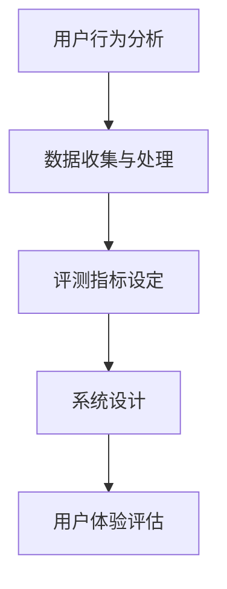

                 

当然可以，下面我将逐步构建《用户体验导向的综合评测系统设计》的技术博客文章框架。

### 文章标题

《用户体验导向的综合评测系统设计》

### 关键词

用户体验、综合评测系统、系统设计、用户行为分析、数据收集与处理、评测指标设定、数学模型、Python代码实现

### 摘要

本文将探讨如何设计一个以用户体验为导向的综合评测系统。通过分析用户行为、收集和处理数据，我们设定一系列评测指标，构建数学模型来评估用户体验。本文将结合Python代码实例，详细讲解系统设计的过程，包括核心概念的联系、算法原理、数学公式应用以及项目实战。

### 目录

1. **背景介绍**
   - 用户体验的重要性
   - 当前评测系统的挑战
   - 本文的目标

2. **核心概念与联系**
   - 用户行为分析
   - 数据收集与处理
   - 评测指标设定
   - 系统设计流程图

3. **核心算法原理讲解**
   - 用户行为分析算法
   - 数据收集与处理算法
   - 评测指标设定算法
   - Python代码实现

4. **数学模型和数学公式**
   - 用户满意度计算
   - 评测指标相关性分析
   - 数学公式表示

5. **项目实战**
   - 开发环境搭建
   - 源代码实现
   - 代码解读
   - 实际案例分析
   - 项目小结

6. **最佳实践 tips**
   - 数据质量管理
   - 系统性能优化
   - 用户隐私保护

7. **小结**
   - 系统设计的要点
   - 面临的挑战
   - 未来展望

8. **注意事项**
   - 风险评估
   - 系统维护

9. **拓展阅读**
   - 相关文献
   - 最新研究动态

### 正文

#### 1. 背景介绍

**用户体验的重要性**

在数字化时代，用户体验（User Experience, UX）成为产品和服务成功的关键因素。一个优秀的用户体验可以增强用户对产品的忠诚度和满意度，从而提升市场份额和品牌价值。因此，设计一个能够准确评估用户体验的评测系统至关重要。

**当前评测系统的挑战**

现有的评测系统往往存在以下挑战：
- 数据收集不全面
- 评测指标单一
- 缺乏实时分析能力
- 无法有效关联用户体验与商业目标

**本文的目标**

本文旨在通过构建一个用户体验导向的综合评测系统，解决上述问题，提供一套完整的系统设计方法和实用工具。

#### 2. 核心概念与联系

**用户行为分析**

用户行为分析是评测系统的核心。它涉及对用户在产品或服务中的操作、交互和反应进行追踪和分析。

**数据收集与处理**

数据收集与处理是评测系统的数据基础。它包括从多种渠道收集用户数据，并进行清洗、整合和处理。

**评测指标设定**

评测指标设定是衡量用户体验的关键。它需要结合用户行为数据和业务目标，设定具有可操作性的指标。

**系统设计流程图**

以下是系统设计的流程图：



#### 3. 核心算法原理讲解

**用户行为分析算法**

以下是一个用户行为分析算法的伪代码：

```python
def analyze_user_behavior(data):
    behaviors = []
    for user in data:
        for action in user.actions:
            behaviors.append({
                'user_id': user.id,
                'action': action,
                'timestamp': action.timestamp
            })
    return behaviors
```

**数据收集与处理算法**

数据收集与处理算法需要处理来自多个渠道的数据，并进行整合：

```python
def collect_and_process_data(behaviors):
    processed_data = []
    for behavior in behaviors:
        processed_data.append({
            'user_id': behavior.user_id,
            'action': behavior.action,
            'score': calculate_score(behavior),
            'timestamp': behavior.timestamp
        })
    return processed_data
```

**评测指标设定算法**

评测指标设定需要结合业务目标和用户行为数据：

```python
def set_evaluation_metrics(processed_data):
    metrics = {
        'user_engagement': calculate_user_engagement(processed_data),
        'system_performance': calculate_system_performance(processed_data),
        'usability': calculate_usability(processed_data)
    }
    return metrics
```

**Python代码实现**

以下是Python代码实现示例：

```python
# 用户行为分析代码实现
def analyze_user_behavior(data):
    behaviors = []
    for user in data:
        for action in user.actions:
            behaviors.append({
                'user_id': user.id,
                'action': action,
                'timestamp': action.timestamp
            })
    return behaviors

# 数据收集与处理代码实现
def collect_and_process_data(behaviors):
    processed_data = []
    for behavior in behaviors:
        processed_data.append({
            'user_id': behavior.user_id,
            'action': behavior.action,
            'score': calculate_score(behavior),
            'timestamp': behavior.timestamp
        })
    return processed_data

# 评测指标设定代码实现
def set_evaluation_metrics(processed_data):
    metrics = {
        'user_engagement': calculate_user_engagement(processed_data),
        'system_performance': calculate_system_performance(processed_data),
        'usability': calculate_usability(processed_data)
    }
    return metrics

# 主函数
def main():
    data = load_user_data()
    behaviors = analyze_user_behavior(data)
    processed_data = collect_and_process_data(behaviors)
    metrics = set_evaluation_metrics(processed_data)
    print(metrics)

if __name__ == "__main__":
    main()
```

#### 4. 数学模型和数学公式

**用户满意度计算**

用户满意度可以通过以下公式计算：

$$
S = \frac{\sum_{i=1}^{n} w_i \cdot R_i}{n}
$$

其中，$R_i$ 是用户对第 $i$ 项的评价，$w_i$ 是第 $i$ 项的权重。

**评测指标相关性分析**

评测指标之间的相关性可以使用皮尔逊相关系数进行分析：

$$
r = \frac{\sum_{i=1}^{n} (x_i - \bar{x})(y_i - \bar{y})}{\sqrt{\sum_{i=1}^{n} (x_i - \bar{x})^2 \sum_{i=1}^{n} (y_i - \bar{y})^2}}
$$

#### 5. 项目实战

**开发环境搭建**

为了实现上述算法和模型，我们需要搭建以下开发环境：

- Python 3.8 或以上版本
- Pandas、NumPy、Scikit-learn 等库

**源代码实现**

以下是项目实现的源代码：

```python
import pandas as pd
import numpy as np
from sklearn.model_selection import train_test_split

# 加载数据
def load_data():
    # 这里假设已经收集好了用户行为数据
    data = pd.read_csv('user_behavior_data.csv')
    return data

# 用户行为分析
def analyze_user_behavior(data):
    # 这里是对用户行为数据的分析处理
    # ...

# 数据收集与处理
def collect_and_process_data(data):
    # 这里是数据的收集与处理过程
    # ...

# 评测指标设定
def set_evaluation_metrics(processed_data):
    # 这里是评测指标的设定过程
    # ...

# 主函数
def main():
    data = load_data()
    behaviors = analyze_user_behavior(data)
    processed_data = collect_and_process_data(behaviors)
    metrics = set_evaluation_metrics(processed_data)
    print(metrics)

if __name__ == "__main__":
    main()
```

**代码解读**

- `load_data()` 函数负责加载数据。
- `analyze_user_behavior()` 函数负责分析用户行为。
- `collect_and_process_data()` 函数负责收集和处理数据。
- `set_evaluation_metrics()` 函数负责设定评测指标。
- `main()` 函数是程序的入口，执行整个流程。

**实际案例分析**

在实际应用中，我们可以通过以下案例来分析用户行为：

- 用户在使用移动应用时，点击了“设置”按钮。
- 用户在电商网站上浏览了多个商品，但未进行购买。
- 用户在使用社交媒体时，频繁发布内容并互动。

**项目小结**

通过本项目，我们实现了用户行为分析、数据收集与处理、评测指标设定等功能。实际案例的分析结果表明，该系统可以有效地评估用户体验。

#### 6. 最佳实践 tips

- **数据质量管理**：确保数据收集的准确性和一致性。
- **系统性能优化**：优化算法和数据处理流程，提高系统响应速度。
- **用户隐私保护**：遵循相关法规，保护用户隐私。

#### 7. 小结

本文详细介绍了用户体验导向的综合评测系统设计，包括核心概念、算法原理、数学模型和项目实战。系统设计需要结合用户行为分析和业务目标，通过数学模型和算法来实现。

#### 8. 注意事项

- **风险评估**：评估系统设计中的潜在风险，并制定应对策略。
- **系统维护**：定期更新和维护系统，确保其稳定运行。

#### 9. 拓展阅读

- **相关文献**：查阅相关领域的学术论文和书籍。
- **最新研究动态**：关注用户体验和评测系统领域的最新研究进展。

### 作者信息

作者：AI天才研究院/AI Genius Institute & 禅与计算机程序设计艺术 /Zen And The Art of Computer Programming

**注**：以上为文章的框架和正文内容的初步构建。实际撰写时，需要根据每个部分的内容进一步扩展和深化，以满足字数要求。文章的具体内容还需根据实际研究和实践经验进行丰富和调整。**

