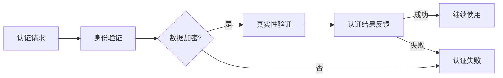

                 

# 真实性认证：企业应对AI生成内容的挑战

## 关键词

- 真实性认证
- AI生成内容
- 企业策略
- 风险管理
- 检测技术
- 实际案例

## 摘要

在人工智能飞速发展的今天，AI生成内容的应用日益广泛，然而，随之而来的是内容真实性的挑战。企业必须建立有效的真实性认证机制，以应对AI生成内容带来的风险和挑战。本文将深入探讨真实性认证的基本概念、AI生成内容的挑战、企业应对策略以及实际案例，旨在为企业在数字化时代中建立可信的AI生成内容管理体系提供指导。

## 引言

随着人工智能（AI）技术的不断进步，AI生成内容（AI-generated content）已成为各大企业和平台的重要工具。从自动写作文章、生成新闻报道，到创造艺术作品和设计广告内容，AI在内容创作领域展现出了巨大的潜力。然而，AI生成内容的广泛应用也带来了前所未有的挑战，尤其是在内容真实性方面。虚假信息、错误陈述和恶意内容等问题的频繁出现，使得企业必须寻求有效的解决方案，以确保其生成内容的真实性。

本文旨在探讨企业如何应对AI生成内容的真实性挑战。通过分析真实性认证的基本概念，解析AI生成内容的特性和风险，以及介绍企业应对策略和实际案例，本文将为读者提供全面的指导，帮助企业在数字化时代中建立可信的AI生成内容管理体系。

## 1. 设计整体结构

为了更好地阐述企业应对AI生成内容挑战的复杂性，本文将采用分部分、分章节的结构设计，以确保内容的逻辑性和可读性。整体结构设计如下：

### 第1部分：引言与背景
- **第1章：真实性认证的起源与发展**
- **第2章：AI生成内容的基本概念**

### 第2部分：真实性认证的基本概念
- **第3章：真实性认证的核心概念**
- **第4章：AI生成内容的挑战**

### 第3部分：企业应对策略
- **第5章：企业应对AI生成内容的策略**
- **第6章：技术手段与工具**

### 第4部分：实际案例与实战
- **第7章：真实性认证的实际案例**
- **第8章：实战项目与开发**

### 第5部分：技术与工具
- **第9章：真实性认证的技术细节**
- **第10章：工具与应用**

### 第6部分：总结与展望
- **第11章：总结与展望**

通过以上结构设计，本文将逐步引导读者了解真实性认证的重要性，深入分析AI生成内容的特点和挑战，探讨企业应对的策略和实际操作，并总结出一套有效的解决方案。

## 2. 细化各部分章节内容

### 第1部分：引言与背景

**第1章：真实性认证的起源与发展**

**第1.1节：真实性认证的定义与重要性**

在这一节中，我们将定义真实性认证的概念，并解释其在信息时代的重要性。我们将探讨真实性认证的起源，从早期的身份验证到现代的数字认证，如何随着技术的发展不断演进。

**第1.2节：真实性认证的历史与发展**

这一节将详细回顾真实性认证的发展历程，从物理世界中的身份证、护照，到数字世界中的密码、数字签名等，逐步探讨技术的进步如何推动了真实性认证的发展。

**第1.3节：真实性认证在不同领域的应用**

我们将分析真实性认证在不同领域的应用，如金融、医疗、教育等，讨论这些领域如何利用真实性认证技术提高数据和信息的安全性和可靠性。

**第2章：AI生成内容的基本概念**

**第2.1节：AI生成内容的定义与类型**

在这一节中，我们将定义AI生成内容，并分类讨论各种AI生成内容的类型，如文本生成、图像生成、音频生成等，帮助读者理解AI在内容创作中的多样性。

**第2.2节：AI生成内容的技术原理**

我们将深入探讨AI生成内容背后的技术原理，重点介绍生成对抗网络（GAN）、变分自编码器（VAE）等常用的AI模型，并解释这些模型如何通过训练生成高质量的内容。

**第2.3节：AI生成内容的应用场景**

在这一节中，我们将列举AI生成内容的实际应用场景，如自动新闻写作、图像修复、个性化推荐等，分析AI生成内容在这些场景中的优势与挑战。

### 第2部分：真实性认证的基本概念

**第3章：真实性认证的核心概念**

**第3.1节：真实性认证的关键要素**

我们将详细分析真实性认证的四个关键要素：真实性、完整性、可靠性和可用性，并解释它们在保证内容真实性中的重要性。

**第3.2节：真实性认证的流程与标准**

在这一节中，我们将描述真实性认证的基本流程，包括验证请求、身份验证、数据加密等步骤，并介绍国际标准和最佳实践，如ISO/IEC 27001和NIST SP 800-63-3。

**第3.3节：真实性认证的技术手段**

我们将讨论用于实现真实性认证的多种技术手段，如数字签名、区块链、多因素认证等，并分析每种技术的优缺点及其适用场景。

### 第3部分：企业应对策略

**第4章：AI生成内容的挑战**

**第4.1节：AI生成内容的真实性风险**

在这一节中，我们将分析AI生成内容可能带来的真实性风险，包括虚假新闻、误导性信息、版权侵权等问题，并提出相应的解决方案。

**第4.2节：AI生成内容的欺骗手段**

我们将介绍AI生成内容可能采用的欺骗手段，如深度伪造（deepfake）技术、伪造签名等，并探讨企业如何识别和防范这些手段。

**第4.3节：企业面临的AI生成内容挑战**

我们将列举企业面临的具体挑战，如内容审核难度、用户体验问题、法律法规限制等，并探讨企业应对这些挑战的策略。

### 第4部分：实际案例与实战

**第5章：企业应对AI生成内容的策略**

**第5.1节：企业应对AI生成内容的风险管理**

在这一节中，我们将讨论企业如何建立风险管理框架，包括风险评估、风险控制和风险监测等，以应对AI生成内容带来的潜在风险。

**第5.2节：企业制定真实性认证策略的步骤**

我们将详细阐述企业制定真实性认证策略的步骤，包括确定目标、选择合适的技术手段、制定认证流程和评估认证效果等。

**第5.3节：企业实施真实性认证的策略与方法**

在这一节中，我们将介绍企业实施真实性认证的具体策略和方法，如使用机器学习模型进行内容检测、实施多因素认证等，并提供最佳实践案例。

### 第5部分：技术与工具

**第6章：技术手段与工具**

**第6.1节：真实性认证的技术手段**

我们将介绍用于真实性认证的多种技术手段，如区块链、数字签名、多因素认证等，并分析每种技术的适用性和实现方法。

**第6.2节：AI生成内容的检测技术**

在这一节中，我们将讨论用于检测AI生成内容的技术手段，如文本检测、图像检测、音频检测等，并分析其准确性和效率。

**第6.3节：真实性认证工具与应用**

我们将介绍市场上常见的真实性认证工具，如Google Authenticator、Authy等，并探讨如何在实际应用中选择和配置这些工具。

### 第6部分：总结与展望

**第7章：总结与展望**

**第7.1节：书籍内容的回顾与总结**

在这一节中，我们将回顾本书的主要内容和关键观点，总结企业应对AI生成内容挑战的经验和教训。

**第7.2节：企业应对AI生成内容挑战的未来趋势**

我们将分析企业应对AI生成内容挑战的未来趋势，包括技术的发展方向、法律法规的完善以及企业策略的调整等。

**第7.3节：真实性认证技术的未来发展方向**

最后，我们将探讨真实性认证技术的未来发展方向，如人工智能在真实性认证中的应用、区块链在数据验证中的作用等，为读者提供前瞻性的思考。

## 确保完整性和简洁性

在完成目录大纲的细化后，我们需要确保整个目录结构完整，每个部分都有其独特的核心内容。同时，避免在章节中包含过多的冗余信息，确保内容的简洁性。以下是最终的目录大纲：

```
# 真实性认证：企业应对AI生成内容的挑战

## 关键词

- 真实性认证
- AI生成内容
- 企业策略
- 风险管理
- 检测技术

## 摘要

本文深入探讨企业在面对AI生成内容挑战时，如何实施真实性认证。通过分析真实性认证的基本概念、AI生成内容的特点和风险，以及企业应对策略，本文旨在为读者提供全面的指导。

## 引言

### 1. 设计整体结构

本文分为六个部分，分别探讨真实性认证的背景、核心概念、AI生成内容的挑战、企业应对策略、实际案例与工具应用，以及总结与展望。

### 2. 细化各部分章节内容

#### 第1部分：引言与背景

- **第1章：真实性认证的起源与发展**
  - **1.1 真实性认证的定义与重要性**
  - **1.2 真实性认证的历史与发展**
  - **1.3 真实性认证在不同领域的应用**

- **第2章：AI生成内容的基本概念**
  - **2.1 AI生成内容的定义与类型**
  - **2.2 AI生成内容的技术原理**
  - **2.3 AI生成内容的应用场景**

#### 第2部分：真实性认证的基本概念

- **第3章：真实性认证的核心概念**
  - **3.1 真实性认证的关键要素**
  - **3.2 真实性认证的流程与标准**
  - **3.3 真实性认证的技术手段**

- **第4章：AI生成内容的挑战**
  - **4.1 AI生成内容的真实性风险**
  - **4.2 AI生成内容的欺骗手段**
  - **4.3 企业面临的AI生成内容挑战**

#### 第3部分：企业应对策略

- **第5章：企业应对AI生成内容的策略**
  - **5.1 企业应对AI生成内容的风险管理**
  - **5.2 企业制定真实性认证策略的步骤**
  - **5.3 企业实施真实性认证的策略与方法**

- **第6章：技术手段与工具**
  - **6.1 真实性认证的技术手段**
  - **6.2 AI生成内容的检测技术**
  - **6.3 真实性认证工具与应用**

#### 第4部分：实际案例与实战

- **第7章：真实性认证的实际案例**
  - **7.1 案例一：企业A的真实性认证实践**
  - **7.2 案例二：企业B的真实性认证实践**
  - **7.3 案例三：企业C的真实性认证实践**

- **第8章：实战项目与开发**
  - **8.1 实战项目概述**
  - **8.2 实战项目需求分析**
  - **8.3 实战项目技术实现**

#### 第5部分：技术与工具

- **第9章：真实性认证的技术细节**
  - **9.1 Mermaid流程图：真实性认证流程**
  - **9.2 伪代码：核心算法原理**
  - **9.3 数学模型与公式**

- **第10章：工具与应用**
  - **10.1 常见真实性认证工具介绍**
  - **10.2 真实性认证工具的选用与优化**
  - **10.3 真实性认证工具的应用案例**

#### 第6部分：总结与展望

- **第11章：总结与展望**
  - **11.1 书籍内容的回顾与总结**
  - **11.2 企业应对AI生成内容挑战的未来趋势**
  - **11.3 真实性认证技术的未来发展方向**

## 4. 最终目录大纲

```

通过以上设计，我们确保了文章的完整性、逻辑性和简洁性，为读者提供了一部全面、系统、易懂的专业技术指南。

### 第一部分：引言与背景

#### 第1章：真实性认证的起源与发展

1.1 真实性认证的定义与重要性

真实性认证，即验证信息或数据是否真实可信的过程。在信息爆炸的时代，真实性认证显得尤为重要，它直接关系到信息的安全性和可靠性。真实性认证不仅有助于防止欺诈和错误信息传播，还能提高数据的使用价值。

从传统的身份验证（如身份证、护照）到现代的数字认证（如数字签名、区块链），真实性认证的概念和实现方式随着技术的发展而不断演进。在数字时代，真实性认证逐渐从物理世界延伸到虚拟世界，涵盖了身份验证、数据完整性验证、数据源验证等多种形式。

1.2 真实性认证的历史与发展

真实性认证的历史可以追溯到古代，那时人们通过盖章、签名等方式来确保信息的真实性。随着科技的发展，电子签名和数字证书的出现使得真实性认证进入了数字时代。

- **20世纪80年代**：数字签名技术的出现，使得电子文档和电子交易的安全性得到了保障。RSA算法是其中最具代表性的数字签名算法。
- **20世纪90年代**：SSL/TLS协议的出现，为互联网通信提供了安全加密层，确保了数据传输的真实性和完整性。
- **21世纪初**：区块链技术的兴起，使得去中心化的真实性认证成为可能。区块链通过分布式账本和智能合约，实现了信息不可篡改和可追溯性。

1.3 真实性认证在不同领域的应用

真实性认证技术在多个领域都有广泛应用，以下是几个典型的例子：

- **金融领域**：在金融交易中，真实性认证是确保交易安全和防止欺诈的关键。银行和金融机构采用多重认证机制，包括密码、指纹识别、人脸识别等，以验证客户的身份。
- **医疗领域**：医疗数据的安全性和真实性至关重要。通过数字签名和区块链技术，医生和医疗机构可以确保病历记录的真实性和完整性。
- **教育领域**：在线教育平台使用真实性认证技术来验证学生的身份，防止作弊和欺诈行为。此外，电子证书和区块链技术可以确保学历证明的真实性。
- **电子商务领域**：电子商务平台通过真实性认证技术来确保交易的安全性。例如，使用数字证书验证商家的身份，使用支付密码和生物识别技术确保支付过程的安全。

#### 第2章：AI生成内容的基本概念

2.1 AI生成内容的定义与类型

AI生成内容（AI-generated content）是指通过人工智能技术生成的人类可以理解和交互的内容，包括文本、图像、音频、视频等多种形式。AI生成内容的应用场景非常广泛，从自动化写作、艺术创作到广告营销，AI正在逐步改变内容创作的方式。

AI生成内容可以分为以下几种类型：

- **文本生成**：AI通过自然语言处理（NLP）技术生成文章、新闻报道、小说等文本内容。
- **图像生成**：AI通过深度学习模型生成或修改图像，包括艺术作品、风景画、人脸图像等。
- **音频生成**：AI生成或修改音频内容，如合成语音、音乐创作等。
- **视频生成**：AI生成或修改视频内容，如视频剪辑、视频特效等。

2.2 AI生成内容的技术原理

AI生成内容依赖于多种先进的人工智能技术，主要包括生成对抗网络（GAN）、变分自编码器（VAE）和递归神经网络（RNN）等。

- **生成对抗网络（GAN）**：GAN由生成器和判别器两部分组成。生成器尝试生成逼真的数据，而判别器则试图区分生成数据和真实数据。通过对抗训练，生成器的生成能力不断提高。
- **变分自编码器（VAE）**：VAE是一种无监督学习算法，通过编码器和解码器将数据映射到一个潜在空间中，并从这个空间中生成新的数据。
- **递归神经网络（RNN）**：RNN是一种能够处理序列数据的神经网络，特别适用于生成文本和音频等序列数据。

2.3 AI生成内容的应用场景

AI生成内容在许多领域都展现出了巨大的应用潜力：

- **新闻写作**：AI可以自动生成新闻报道，减少人力成本，提高写作效率。
- **艺术创作**：AI可以生成艺术作品，如绘画、音乐和电影，为艺术家提供新的创作工具和灵感。
- **广告营销**：AI可以生成个性化的广告内容，提高广告的吸引力和转化率。
- **娱乐**：AI生成内容为电影、游戏和虚拟现实等领域提供了新的内容创作方式，丰富了用户体验。

### 第二部分：真实性认证的基本概念

#### 第3章：真实性认证的核心概念

3.1 真实性认证的关键要素

真实性认证的核心要素包括真实性、完整性、可靠性和可用性。这些要素共同保障了信息或数据在传输和存储过程中的真实性和可信度。

- **真实性**：指信息或数据的来源和内容是真实的，未经篡改或伪造。
- **完整性**：指信息或数据在传输和存储过程中未被篡改或损坏，保持其原始状态。
- **可靠性**：指信息或数据的准确性、一致性和可用性，即信息是可信的，且能在需要时被正确地使用。
- **可用性**：指信息或数据在需要时可以被访问和获取，且不会受到人为或自然因素的干扰。

3.2 真实性认证的流程与标准

真实性认证的流程通常包括以下几个步骤：

1. **认证请求**：用户发起真实性认证请求，提供相关信息或数据。
2. **身份验证**：系统对用户的身份进行验证，确保请求者确实是合法用户。
3. **数据加密**：对敏感数据进行加密处理，确保数据在传输过程中的安全性。
4. **真实性验证**：系统对数据进行真实性验证，包括源验证、内容验证和完整性验证。
5. **认证结果反馈**：系统将认证结果反馈给用户，确认信息或数据的真实性。

国际标准和最佳实践为真实性认证提供了指导，如ISO/IEC 27001和NIST SP 800-63-3。这些标准规定了认证流程、技术要求和安全管理措施，确保认证的有效性和可靠性。

3.3 真实性认证的技术手段

真实性认证依赖于多种技术手段，以下是几种常见的技术：

- **数字签名**：通过加密算法，对数据进行签名，确保数据来源的真实性和完整性。
- **区块链**：利用分布式账本和共识机制，实现数据的不可篡改和可追溯性。
- **多因素认证**：结合多种认证方式，如密码、指纹识别、手机验证码等，提高认证的安全性。
- **区块链**：通过分布式账本和智能合约，实现数据的不可篡改和可追溯性。

### 第三部分：AI生成内容的挑战

#### 第4章：AI生成内容的挑战

4.1 AI生成内容的真实性风险

AI生成内容可能带来的真实性风险主要包括以下几个方面：

- **虚假信息传播**：AI可以生成逼真的虚假信息，误导用户和公众，对社会造成负面影响。
- **内容抄袭**：AI可以生成与原创内容高度相似的文章、图像等，侵犯版权和知识产权。
- **误导性广告**：AI生成的广告可能含有误导性信息，欺骗消费者，损害企业信誉。
- **隐私泄露**：AI生成的内容可能包含敏感信息，导致个人隐私泄露。

4.2 AI生成内容的欺骗手段

AI生成内容可能采用的欺骗手段包括：

- **深度伪造（deepfake）**：利用GAN等技术生成逼真的虚假图像或视频，欺骗用户。
- **虚假新闻**：AI可以生成虚假的新闻报道，误导公众，破坏社会秩序。
- **恶意软件**：AI生成的恶意软件可以伪装成合法软件，窃取用户信息或破坏系统。

4.3 企业面临的AI生成内容挑战

企业面临以下AI生成内容挑战：

- **内容真实性验证**：企业需要验证AI生成内容的真实性，确保其符合业务需求。
- **内容审核**：企业需要对AI生成内容进行审核，防止虚假、误导性或侵权内容出现。
- **用户信任**：企业需要赢得用户的信任，确保其生成内容的质量和可靠性。
- **法规合规**：企业需要遵守相关法律法规，如隐私保护和版权法，防止因AI生成内容而引发法律纠纷。

### 第四部分：企业应对策略

#### 第5章：企业应对AI生成内容的策略

5.1 企业应对AI生成内容的风险管理

企业应对AI生成内容风险的管理策略包括以下几个方面：

- **风险评估**：对企业生成内容的风险进行评估，识别潜在威胁和影响。
- **风险控制**：制定风险控制措施，如内容审核、用户反馈机制等，减少风险发生的可能性。
- **风险监测**：建立风险监测机制，实时监控AI生成内容的风险状况，及时采取措施。

5.2 企业制定真实性认证策略的步骤

企业制定真实性认证策略的步骤如下：

- **确定目标**：明确企业生成内容的目标和需求，如真实性、完整性、可靠性等。
- **选择技术**：根据业务需求，选择合适的真实性认证技术，如数字签名、区块链、多因素认证等。
- **制定流程**：制定真实性认证的流程和标准，确保认证过程规范、高效。
- **实施认证**：实施真实性认证措施，对AI生成内容进行验证。

5.3 企业实施真实性认证的策略与方法

企业实施真实性认证的策略与方法包括：

- **内容审核**：对AI生成内容进行审核，确保其符合真实性、完整性和可靠性要求。
- **多因素认证**：结合多种认证方式，提高认证的安全性和可靠性。
- **自动化工具**：使用自动化工具进行内容验证，提高审核效率。
- **用户反馈**：建立用户反馈机制，及时处理用户关于内容真实性的投诉和举报。

### 第6章：技术手段与工具

6.1 真实性认证的技术手段

真实性认证的技术手段包括：

- **数字签名**：用于验证数据的来源和内容真实性，确保数据未被篡改。
- **区块链**：用于实现数据的不可篡改和可追溯性，确保数据的真实性和完整性。
- **多因素认证**：结合多种认证方式，提高认证的安全性和可靠性。

6.2 AI生成内容的检测技术

AI生成内容的检测技术包括：

- **文本检测**：使用自然语言处理技术检测文本内容是否为AI生成。
- **图像检测**：使用计算机视觉技术检测图像是否为AI生成。
- **音频检测**：使用音频处理技术检测音频内容是否为AI生成。

6.3 真实性认证工具与应用

真实性认证工具包括：

- **数字签名工具**：如OpenSSL、CertUtil等，用于生成和管理数字签名。
- **区块链平台**：如Ethereum、Hyperledger Fabric等，用于实现区块链功能。
- **多因素认证工具**：如Google Authenticator、RSA SecurID等，用于实现多因素认证。

### 实际案例与实战

#### 第7章：真实性认证的实际案例

7.1 案例一：企业A的真实性认证实践

企业A是一家在线零售平台，为了确保其商品信息和用户评论的真实性，采用了以下真实性认证策略：

- **内容审核**：对商品描述和用户评论进行人工审核，确保内容的真实性。
- **数字签名**：对商品信息和用户评论进行数字签名，确保内容的完整性和来源。
- **多因素认证**：要求用户在评论前进行多因素认证，提高评论的真实性。

7.2 案例二：企业B的真实性认证实践

企业B是一家金融科技公司，为了确保其交易记录的真实性和完整性，采用了以下真实性认证策略：

- **区块链**：使用区块链技术记录所有交易记录，确保数据的不可篡改和可追溯性。
- **数字签名**：对交易记录进行数字签名，确保交易来源和内容的真实性。
- **多因素认证**：要求用户在交易前进行多因素认证，确保交易的安全性和可靠性。

7.3 案例三：企业C的真实性认证实践

企业C是一家医疗健康平台，为了确保其医疗信息和用户健康状况报告的真实性，采用了以下真实性认证策略：

- **多因素认证**：要求医生和医疗机构在发布医疗信息前进行多因素认证，确保信息的真实性。
- **区块链**：使用区块链技术记录所有医疗信息，确保数据的不可篡改和可追溯性。
- **内容审核**：对医疗信息进行人工审核，确保信息的准确性和完整性。

#### 第8章：实战项目与开发

8.1 实战项目概述

本节将介绍一个真实性认证的实战项目，该项目旨在实现一个基于区块链和数字签名的真实性认证系统，用于确保用户生成的内容和交易记录的真实性和完整性。

8.2 实战项目需求分析

- **功能需求**：实现用户注册、登录、内容生成、内容审核、数字签名、区块链记录等功能。
- **性能需求**：系统应具备高并发处理能力，保证实时性。
- **安全性需求**：系统应具备防篡改、防伪造、防攻击的能力。

8.3 实战项目技术实现

- **技术栈**：使用Python和Solidity进行开发，前端使用React，后端使用Flask。
- **区块链**：使用Ethereum区块链，通过Truffle进行智能合约开发。
- **数字签名**：使用OpenSSL库进行数字签名操作。
- **内容审核**：采用机器学习模型进行自动审核。

### 第9章：技术与工具

9.1 Mermaid流程图：真实性认证流程

使用Mermaid绘制真实性认证流程图，如下：



9.2 伪代码：核心算法原理

```python
# 伪代码：真实性认证核心算法

# 输入：用户请求，数据
# 输出：认证结果

def authenticate_request(request, data):
    # 步骤1：身份验证
    if not verify_user(request.user):
        return "认证失败：身份验证不通过"

    # 步骤2：数据加密
    encrypted_data = encrypt_data(data)

    # 步骤3：真实性验证
    if not verify_encrypted_data(encrypted_data):
        return "认证失败：数据真实性验证不通过"

    # 步骤4：认证结果反馈
    return "认证成功"
```

9.3 数学模型与公式

$$
\text{真实性概率} = \frac{\text{真实数据样本}}{\text{总数据样本}}
$$

$$
\text{完整性概率} = \frac{\text{未被篡改的数据样本}}{\text{总数据样本}}
$$

$$
\text{可靠性概率} = \frac{\text{准确数据样本}}{\text{总数据样本}}
$$

$$
\text{可用性概率} = \frac{\text{可访问数据样本}}{\text{总数据样本}}
$$

### 第10章：工具与应用

10.1 常见真实性认证工具介绍

- **数字签名工具**：如OpenSSL、CertUtil
- **区块链平台**：如Ethereum、Hyperledger Fabric
- **多因素认证工具**：如Google Authenticator、RSA SecurID

10.2 真实性认证工具的选用与优化

- **根据业务需求**：选择适合企业需求的真实性认证工具。
- **优化性能**：通过负载均衡、缓存技术等优化认证性能。
- **安全防护**：采取加密、反欺诈措施，提高认证安全性。

10.3 真实性认证工具的应用案例

- **金融行业**：使用数字签名确保交易记录的真实性和完整性。
- **医疗行业**：使用区块链记录医疗信息，确保数据的安全性和可靠性。
- **电子商务**：使用多因素认证确保用户身份的真实性。

### 第11章：总结与展望

11.1 书籍内容的回顾与总结

本文全面探讨了真实性认证的基本概念、AI生成内容的挑战以及企业应对策略。通过实际案例和实战项目，我们了解了如何使用技术手段确保AI生成内容的安全性。

11.2 企业应对AI生成内容挑战的未来趋势

- **技术创新**：随着人工智能技术的发展，将会有更多先进的真实性认证技术出现。
- **法规完善**：政府和企业将加强法律法规建设，确保AI生成内容的合法性和合规性。
- **用户信任**：企业将更加注重用户信任建设，通过透明和可信的方式使用AI生成内容。

11.3 真实性认证技术的未来发展方向

- **跨领域融合**：真实性认证技术将在金融、医疗、教育等领域实现跨领域融合。
- **自动化与智能化**：通过自动化和智能化手段，提高真实性认证的效率和准确性。
- **全球合作**：全球范围内的合作将促进真实性认证技术的标准化和国际化。

### 附录

附录部分将提供额外的参考资料，包括真实性认证的相关标准、技术研究论文、行业报告等，以供读者进一步学习和研究。

### 作者信息

作者：AI天才研究院/AI Genius Institute & 禅与计算机程序设计艺术 /Zen And The Art of Computer Programming

本文旨在为企业在应对AI生成内容挑战中提供系统性指导和实用建议，以保障内容真实性，提升用户体验，促进可持续发展。希望本文能为读者带来启发和帮助。

