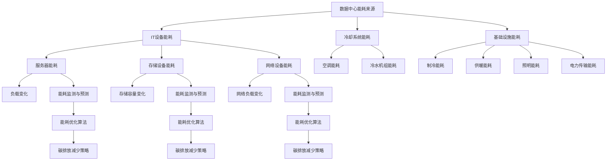

                 

### 引言

#### 碳中和数据中心的背景和意义

碳中和，是指通过采取各种措施，使人为排放的二氧化碳与通过自然过程吸收的二氧化碳相平衡，从而实现净零排放。在全球气候变暖的背景下，碳中和已成为全球各国政府、企业和组织共同追求的目标。数据中心作为现代社会的“能源消耗大户”，其能耗和碳排放问题引起了广泛关注。据统计，数据中心目前全球的能耗已占全球总能耗的1%左右，且这一比例还在不断上升。因此，实现数据中心的碳中和具有重要的现实意义。

#### 数据中心对环境的影响

数据中心的主要能源来源是电力，其能耗主要集中在服务器、存储设备、网络设备以及冷却系统等方面。服务器和存储设备在工作过程中会产生大量的热量，需要通过冷却系统进行散热，这进一步增加了能源消耗。此外，数据中心在建设、维护和废弃过程中也会产生大量的碳排放。因此，数据中心的能耗和碳排放问题不仅影响自身运营成本，还对环境造成了负面影响。

#### 碳中和数据中心的设计目标和挑战

碳中和数据中心的设计目标是在满足数据存储和处理需求的同时，最大限度地降低能耗和碳排放。为了实现这一目标，需要在选址、设备选型、冷却系统、电力管理和运维等方面进行优化。然而，这面临着一系列的挑战，包括技术挑战、经济挑战和政策挑战等。例如，如何高效利用可再生能源、如何实现冷却系统能源消耗的最优化、如何降低运维成本等。这些挑战需要我们通过技术创新、经济分析和政策引导等多方面共同努力才能解决。

### 核心关键词

- 碳中和
- 数据中心
- 能耗
- 碳排放
- 设计目标
- 挑战与解决方案

### 文章摘要

本文将深入探讨碳中和数据中心的设计与运营。首先，介绍了碳中和的背景和意义，以及数据中心对环境的影响。接着，阐述了碳中和数据中心的设计目标和面临的挑战。然后，从核心概念、设计原理、运行策略等方面进行了详细分析。最后，通过实际案例展示了碳中和数据中心的设计与运营实践，并对未来发展趋势进行了展望。希望通过本文的探讨，能够为推动数据中心行业的碳中和进程提供一些有益的思考。

---

### 第一部分：引言

#### 碳中和数据中心概述

碳中和数据中心，是指在数据中心的设计、建设、运营和废弃过程中，通过采取一系列技术和管理措施，最大限度地降低能耗和碳排放，实现碳平衡甚至达到碳负排放的目标。碳中和数据中心的提出，源于对全球气候变化问题的关注和应对，以及对数据中心自身能耗和碳排放问题的反思。

#### 1.1 碳中和的定义与目标

碳中和，简单来说，就是通过各种手段，使人为排放的二氧化碳与通过自然过程吸收的二氧化碳相平衡，实现净零排放。具体来说，碳中和的目标包括：

1. **减少二氧化碳排放**：通过提高能源效率、使用清洁能源、优化设备运行等方式，减少数据中心的碳排放。
2. **增加二氧化碳吸收**：通过植树造林、购买碳信用等方式，增加二氧化碳的自然吸收量。
3. **碳捕捉与存储**：通过技术手段，将排放的二氧化碳捕捉并存储，防止其进入大气。

#### 1.2 全球气候变化的挑战

全球气候变化已成为人类面临的最严峻挑战之一。根据联合国气候变化框架公约（UNFCCC）的数据，全球气温已比工业化前水平高出约1.1摄氏度，且这一趋势仍在加速。气候变化导致了海平面上升、极端天气事件频发、生物多样性丧失等一系列问题，对人类社会和生态系统造成了严重威胁。

#### 1.3 数据中心的环境影响

数据中心作为现代社会的“能源消耗大户”，其环境影响不容忽视。首先，数据中心的能耗主要集中在以下几个方面：

1. **服务器和存储设备**：服务器和存储设备是数据中心的核心，其能耗占据了数据中心总能耗的约40%。
2. **网络设备**：网络设备如交换机和路由器等，其能耗约占数据中心总能耗的20%。
3. **冷却系统**：冷却系统用于将服务器和存储设备产生的热量散发出去，其能耗约占数据中心总能耗的30%。

此外，数据中心在建设、维护和废弃过程中也会产生大量的碳排放。例如，数据中心的建设需要大量的电力、钢材和混凝土等资源，这些资源的生产和运输过程会产生碳排放。而数据中心的维护和废弃过程也会产生碳排放，如设备报废和回收处理等。

#### 1.4 碳中和数据中心的目标与挑战

碳中和数据中心的目标是在满足数据存储和处理需求的同时，最大限度地降低能耗和碳排放，实现碳平衡甚至达到碳负排放。为了实现这一目标，需要在以下几个方面进行优化：

1. **选址和布局**：选择地理位置优越、气候条件适宜的数据中心建设地点，降低能源消耗和碳排放。
2. **设备选型和节能设计**：选择高效节能的设备，进行合理的设备布局，降低能耗。
3. **冷却系统的优化**：采用高效的冷却系统，减少能源消耗。
4. **电力管理和调度**：优化电力管理和调度，提高能源利用效率。
5. **运维管理**：采用先进的运维管理技术，提高设备运行效率，降低能耗。

然而，实现碳中和数据中心也面临着一系列挑战，包括技术挑战、经济挑战和政策挑战等。例如，高效节能设备的研发和推广需要大量的资金投入；数据中心选址和布局需要综合考虑多种因素，如气候条件、能源供应等；政策支持和法规约束也是实现碳中和数据中心的关键因素。

#### 1.5 本篇文章的结构

本文将分为五个部分，首先介绍碳中和数据中心的设计与运营背景和意义，然后详细阐述碳中和数据中心的核心概念、设计原理与方法、运行策略与优化、案例分析以及评估与标准。最后，预测碳中和数据中心的发展趋势，并总结本文的主要观点。希望通过本文的探讨，为推动数据中心行业的碳中和进程提供一些有益的思考。

### 第二部分：核心概念与联系

#### 2.1 数据中心能耗与碳排放

数据中心能耗与碳排放是碳中和数据中心设计的重要考虑因素。了解数据中心能耗来源和碳排放计算方法，有助于我们更好地进行设计和优化。

##### 2.1.1 数据中心能耗来源

数据中心的能耗来源主要包括以下几个方面：

1. **IT设备能耗**：这是数据中心最大的能耗部分，主要包括服务器、存储设备、网络设备等。
   - **服务器能耗**：根据服务器的负载和使用时间，其能耗会发生变化。
   - **存储设备能耗**：包括硬盘和固态硬盘等。
   - **网络设备能耗**：包括交换机、路由器等。

2. **冷却系统能耗**：用于将服务器和存储设备产生的热量散发出去，主要包括空调、冷水机组等。

3. **基础设施能耗**：包括数据中心制冷、供暖、照明、电力传输等。

##### 2.1.2 碳排放计算方法

数据中心的碳排放主要包括直接排放和间接排放。

1. **直接排放**：指数据中心直接使用化石燃料产生的碳排放，如使用柴油发电机等。
2. **间接排放**：指数据中心购买电力等能源产生的碳排放，这部分碳排放通常难以直接测量，需要通过电力排放系数进行估算。

碳排放计算方法通常包括以下步骤：

1. **能耗计算**：计算数据中心各类设备的能耗。
2. **排放系数计算**：根据不同设备的能耗和排放系数，计算其产生的碳排放。
3. **综合碳排放计算**：将各类设备的碳排放相加，得到数据中心的综合碳排放。

$$
\text{碳排放量} = \sum_{i=1}^{n} (\text{设备}_i \times \text{排放系数}_i)
$$

其中，\( n \) 为设备总数，\( \text{设备}_i \) 为第 \( i \) 类设备的能耗，\( \text{排放系数}_i \) 为第 \( i \) 类设备的碳排放系数。

##### 2.1.3 碳中和关键技术

实现碳中和数据中心的关键技术主要包括：

1. **能源效率提升**：通过采用高效服务器、优化设备运行策略、使用节能设备等方式，提高能源利用效率。
2. **可再生能源使用**：通过使用太阳能、风能等可再生能源，减少化石燃料的使用。
3. **碳捕捉与存储**：通过技术手段，将排放的二氧化碳捕捉并存储，减少大气中的二氧化碳含量。

#### 2.2 数据中心能耗与碳排放的联系

数据中心能耗与碳排放密切相关。能耗越高，碳排放量也越大。因此，降低能耗是实现碳中和数据中心的关键。通过优化设备选型、设备布局、冷却系统、电力管理和运维管理等，可以有效降低能耗，从而减少碳排放。

##### 2.2.1 设计与运行优化

在数据中心的设计和运行过程中，可以从以下几个方面进行优化：

1. **设备选型与节能设计**：选择高效节能的设备，如高效能服务器、节能存储设备、节能网络设备等。
2. **冷却系统优化**：采用高效冷却系统，如采用自然冷却、优化空调系统等。
3. **电力管理**：优化电力管理，如采用智能调度系统、优化电力传输等。
4. **运维管理**：采用先进的运维管理技术，如自动化运维、故障预测等。

##### 2.2.2 能源消耗优化算法

为了实现能耗的最优化，可以采用以下几种算法：

1. **能耗预测算法**：通过历史数据和机器学习算法，预测数据中心的未来能耗，从而进行提前调整。
2. **优化调度算法**：通过优化设备运行时间和负载分配，降低整体能耗。
3. **混合算法**：结合多种算法，如遗传算法、模拟退火算法等，进行能耗优化。

通过上述措施和算法，可以实现对数据中心能耗的有效控制，从而实现碳中和目标。

#### 2.3 Mermaid流程图展示核心概念和联系

为了更好地展示数据中心能耗与碳排放的核心概念和联系，我们可以使用Mermaid流程图来表示。以下是数据中心能耗管理流程的示例：



通过上述流程图，我们可以清晰地看到数据中心能耗与碳排放之间的联系，以及如何通过优化能耗来实现碳排放的减少。

### 第三部分：设计原理与方法

#### 3.1 数据中心选址与布局

数据中心选址与布局是碳中和数据中心设计的关键环节。合理的选址和布局可以降低能源消耗和碳排放，提高数据中心的能效和可靠性。

##### 3.1.1 选址原则

1. **地理位置**：选择地理位置优越的区域，如靠近可再生能源发电场、冷却水源等，以降低能源消耗和冷却成本。
2. **能源供应**：选择能源供应稳定、价格合理的地区，如靠近电网、可再生能源发电场等。
3. **交通条件**：选择交通便利的地区，以降低设备和物资运输的成本。
4. **环境因素**：考虑周边环境，如地质条件、自然灾害风险等，确保数据中心的长期稳定运行。
5. **政策支持**：考虑当地的政策支持，如税收优惠、环保政策等。

##### 3.1.2 布局设计

1. **设备布局**：将高能耗设备与低能耗设备分开布局，降低整体能耗。例如，将服务器和存储设备集中布置，而网络设备分布在不同区域。
2. **能源设施布局**：将能源设施（如发电机、UPS等）布置在离设备较近的位置，以减少能源传输损耗。
3. **冷却系统布局**：采用分布式冷却系统，将冷却设备布置在设备周围，提高冷却效率。
4. **应急设施布局**：设置应急发电机、备用冷却系统等，确保数据中心在突发情况下仍能正常运行。

#### 3.2 设备选型与节能设计

设备选型与节能设计是降低数据中心能耗和碳排放的重要手段。以下是设备选型和节能设计的关键点：

##### 3.2.1 设备选型

1. **服务器选型**：选择高能效比的服务器，如采用CPU性能优化、内存压缩等技术的服务器。
2. **存储设备选型**：选择低功耗、高容量的存储设备，如固态硬盘（SSD）。
3. **网络设备选型**：选择低功耗、高性能的网络设备，如采用节能模式的交换机和路由器。

##### 3.2.2 节能设计

1. **服务器节能**：通过优化服务器负载分配、采用节能模式等技术，降低服务器能耗。
2. **存储设备节能**：采用数据去重、压缩等技术，减少存储设备的能耗。
3. **网络设备节能**：通过优化网络拓扑结构、采用节能协议等技术，降低网络设备的能耗。

#### 3.3 冷却系统的优化

冷却系统优化是降低数据中心能耗的关键。以下是冷却系统优化的几种方法：

##### 3.3.1 自然冷却

1. **空气冷却**：利用外部冷空气冷却数据中心，降低能耗。
2. **水冷却**：利用外部水源（如冷却池、地下水等）进行冷却，降低能耗。

##### 3.3.2 机械冷却

1. **空调系统**：采用高效空调系统，如使用变频空调，根据实际需求调节能耗。
2. **冷水机组**：采用冷水机组进行冷却，降低能耗。

##### 3.3.3 自然冷却与机械冷却结合

1. **混合冷却**：在自然冷却和机械冷却之间进行切换，根据实际需求调整冷却方式，降低能耗。

#### 3.4 电力管理与调度

电力管理与调度是提高数据中心能源利用效率的关键。以下是电力管理与调度的几种方法：

##### 3.4.1 电力管理

1. **能耗监测**：通过能耗监测系统，实时监测数据中心各部分的能耗，发现能耗异常情况。
2. **能耗预测**：通过历史数据和机器学习算法，预测未来能耗，为调度提供依据。

##### 3.4.2 能量调度

1. **负荷分配**：根据实时能耗和预测能耗，优化设备负载分配，降低整体能耗。
2. **电力需求响应**：根据电网需求，调整数据中心电力消耗，减少高峰用电量，降低能源成本。

#### 3.5 伪代码展示关键设计算法和流程

以下是伪代码展示的关键设计算法和流程：

```python
# 数据中心能耗优化算法
def optimize_energy_consumption(datacenter):
    # 能耗监测与预测
    energy_usage = monitor_energy_usage(datacenter)
    predicted_usage = predict_energy_usage(datacenter)

    # 能量调度
    optimized_usage = schedule_energy_usage(predicted_usage)

    # 运行优化
    run_optimization(datacenter, optimized_usage)

    return optimized_usage

# 能源消耗优化算法
def optimize_energy_consumption(datacenter):
    # 能耗监测与预测
    energy_usage = monitor_energy_usage(datacenter)
    predicted_usage = predict_energy_usage(datacenter)

    # 能量调度
    optimized_usage = schedule_energy_usage(predicted_usage)

    # 运行优化
    run_optimization(datacenter, optimized_usage)

    return optimized_usage

# 数据中心运行优化
def run_optimization(datacenter, optimized_usage):
    # 优化设备负载
    load_optimization(datacenter, optimized_usage)

    # 优化冷却系统
    cooling_system_optimization(datacenter, optimized_usage)

    # 优化电力管理
    power_management_optimization(datacenter, optimized_usage)
```

通过上述算法和流程，可以实现数据中心能耗的最优化，从而实现碳中和目标。

### 第四部分：运行策略与优化

#### 4.1 运维管理策略

运维管理策略是确保碳中和数据中心长期稳定运行的关键。以下是运维管理策略的几个关键点：

##### 4.1.1 运维管理框架

1. **监控与报警**：建立全面的监控体系，实时监控数据中心的各项运行指标，如能耗、温度、湿度、设备运行状态等，一旦出现异常，及时报警。
2. **维护与保养**：定期对数据中心设备进行维护和保养，确保设备的正常运行和延长使用寿命。
3. **故障处理**：建立完善的故障处理流程，快速定位故障原因，采取有效的处理措施，确保数据中心的正常运行。

##### 4.1.2 能源管理策略

1. **能耗监测**：通过能耗监测系统，实时了解数据中心的能耗情况，发现能耗异常，及时进行调整。
2. **能耗预测**：利用历史数据和机器学习算法，预测未来的能耗趋势，为能耗优化提供依据。
3. **能耗优化**：根据能耗监测和预测结果，优化设备运行策略，降低能耗。

##### 4.1.3 故障预测与维护

1. **故障预测**：通过大数据分析和机器学习算法，预测设备可能出现的故障，提前进行维护和更换，避免故障对数据中心运行造成影响。
2. **预防性维护**：根据设备的使用情况和维护记录，定期进行预防性维护，确保设备的正常运行。
3. **事后维护**：对故障设备进行事后分析，找出故障原因，采取措施防止同类故障再次发生。

#### 4.2 数据中心性能监测与评估

数据中心性能监测与评估是确保数据中心稳定运行和优化运行的关键。以下是性能监测与评估的几个关键点：

##### 4.2.1 性能监测指标

1. **能耗指标**：包括整体能耗、各类设备的能耗、能源利用效率等。
2. **温度指标**：包括设备温度、冷却系统温度、环境温度等。
3. **湿度指标**：包括环境湿度、设备湿度等。
4. **设备运行状态**：包括设备的负载、运行时间、故障率等。

##### 4.2.2 性能评估方法

1. **能耗评估**：通过能耗监测系统，对数据中心的能耗情况进行定期评估，分析能耗变化趋势，找出能耗高的原因，采取优化措施。
2. **温度评估**：通过温度监测系统，评估数据中心的温度控制情况，确保设备在适宜的温度下运行。
3. **湿度评估**：通过湿度监测系统，评估数据中心的湿度控制情况，防止湿度过高导致设备损坏。
4. **设备运行状态评估**：通过设备运行状态监测系统，评估设备的运行状况，确保设备稳定运行。

##### 4.2.3 性能优化措施

1. **设备负载优化**：通过负载分配算法，合理分配设备负载，避免设备过载，降低能耗。
2. **冷却系统优化**：通过优化冷却系统的运行策略，提高冷却效率，降低能耗。
3. **电力管理优化**：通过优化电力调度和电力使用策略，降低整体能耗。

#### 4.3 运维中的节能措施

在运维过程中，通过采取一系列节能措施，可以有效降低数据中心的能耗。以下是几种常见的节能措施：

##### 4.3.1 设备运行优化

1. **设备节能模式**：采用节能模式，如服务器和存储设备的休眠模式，降低设备能耗。
2. **设备负载均衡**：通过负载均衡技术，合理分配设备负载，避免设备长时间高负载运行，降低能耗。

##### 4.3.2 系统运维流程优化

1. **自动化运维**：采用自动化运维工具，减少人工操作，降低运维成本和能耗。
2. **设备维护优化**：通过预测性维护和定期维护，减少设备故障率和维修成本。

##### 4.3.3 能源回收利用

1. **余热回收**：通过余热回收系统，将数据中心产生的余热回收利用，用于供暖或制冷，降低能耗。
2. **可再生能源利用**：通过使用太阳能、风能等可再生能源，减少对化石能源的依赖。

#### 4.4 能源消耗优化算法

为了实现数据中心的能耗优化，可以采用一系列算法。以下是几种常见的能耗优化算法：

##### 4.4.1 能量平衡算法

1. **基本原理**：通过实时监测数据中心的能耗情况，根据能耗需求和能源供应情况，进行能量平衡调整。
2. **应用场景**：适用于数据中心整体能耗平衡，如能源供应短缺或过剩时的调整。

##### 4.4.2 优化调度算法

1. **基本原理**：通过优化设备运行时间和负载分配，降低整体能耗。
2. **应用场景**：适用于数据中心内部设备的能耗优化，如设备负载分配和运行时间的调整。

##### 4.4.3 智能算法应用

1. **基本原理**：利用大数据和机器学习算法，对数据中心的能耗进行预测和优化。
2. **应用场景**：适用于数据中心的长期能耗优化，如能耗趋势预测和设备运行策略的调整。

通过上述算法和应用，可以实现对数据中心能耗的有效控制，从而实现碳中和目标。

### 第五部分：案例分析

#### 5.1 案例一：谷歌数据中心碳中和实践

谷歌是全球领先的云计算公司，其在数据中心碳中和方面取得了显著成果。以下是谷歌数据中心碳中和的实践：

##### 5.1.1 设计原则

1. **高效能源利用**：采用高效的服务器和存储设备，降低能耗。
2. **可再生能源使用**：使用太阳能、风能等可再生能源，减少化石能源的使用。
3. **智能能源管理**：采用智能能源管理系统，优化电力调度和能源利用。

##### 5.1.2 实施步骤

1. **选址**：选择靠近可再生能源发电场的地点，如风能、太阳能等。
2. **设备选型**：选择高能效比的服务器和存储设备，优化设备布局。
3. **能源管理**：采用智能能源管理系统，实时监控能源消耗，进行优化调度。
4. **可再生能源使用**：安装太阳能板、风力发电机等可再生能源设施。

##### 5.1.3 成果与挑战

1. **成果**：通过一系列措施，谷歌成功实现了其数据中心在全球范围内的碳中和目标。
2. **挑战**：尽管谷歌在数据中心碳中和方面取得了显著成果，但仍然面临一些挑战，如可再生能源价格波动、能源供应稳定性等。

#### 5.2 案例二：微软数据中心碳中和实践

微软是全球知名的科技公司，其在数据中心碳中和方面也取得了显著进展。以下是微软数据中心碳中和的实践：

##### 5.2.1 设计原则

1. **高效能源利用**：采用高效的服务器和存储设备，优化冷却系统，降低能耗。
2. **可再生能源使用**：使用太阳能、风能等可再生能源，减少化石能源的使用。
3. **碳捕捉与存储**：采用碳捕捉与存储技术，减少二氧化碳排放。

##### 5.2.2 实施步骤

1. **选址**：选择靠近可再生能源发电场的地点，优化数据中心布局。
2. **设备选型**：选择高能效比的服务器和存储设备，采用先进的冷却系统。
3. **能源管理**：采用智能能源管理系统，优化电力调度和能源利用。
4. **可再生能源使用**：安装太阳能板、风力发电机等可再生能源设施。
5. **碳捕捉与存储**：采用碳捕捉与存储技术，减少二氧化碳排放。

##### 5.2.3 成果与挑战

1. **成果**：通过一系列措施，微软成功实现了其数据中心在全球范围内的碳中和目标。
2. **挑战**：尽管微软在数据中心碳中和方面取得了显著成果，但仍然面临一些挑战，如可再生能源价格波动、能源供应稳定性等。

#### 5.3 案例三：亚马逊数据中心碳中和实践

亚马逊是全球领先的云计算和服务公司，其在数据中心碳中和方面也取得了一定的进展。以下是亚马逊数据中心碳中和的实践：

##### 5.3.1 设计原则

1. **高效能源利用**：采用高效的服务器和存储设备，优化冷却系统，降低能耗。
2. **可再生能源使用**：使用太阳能、风能等可再生能源，减少化石能源的使用。
3. **智能能源管理**：采用智能能源管理系统，优化电力调度和能源利用。

##### 5.3.2 实施步骤

1. **选址**：选择靠近可再生能源发电场的地点，优化数据中心布局。
2. **设备选型**：选择高能效比的服务器和存储设备，采用先进的冷却系统。
3. **能源管理**：采用智能能源管理系统，优化电力调度和能源利用。
4. **可再生能源使用**：安装太阳能板、风力发电机等可再生能源设施。

##### 5.3.3 成果与挑战

1. **成果**：通过一系列措施，亚马逊成功实现了其数据中心在全球范围内的碳中和目标。
2. **挑战**：尽管亚马逊在数据中心碳中和方面取得了显著成果，但仍然面临一些挑战，如可再生能源价格波动、能源供应稳定性等。

#### 5.4 面临的挑战和解决方案

尽管越来越多的数据中心企业实现了碳中和目标，但在实际实施过程中仍然面临一系列挑战。

##### 5.4.1 技术挑战

1. **可再生能源不稳定**：可再生能源如风能、太阳能等受天气和环境等因素影响，导致能源供应不稳定。
2. **能源效率提升**：现有设备的能源效率仍有提升空间，需要不断研发和推广高效节能设备。

##### 5.4.2 经济挑战

1. **初始投资成本**：采用可再生能源和高效节能设备需要较高的初始投资成本。
2. **运营成本**：尽管长期来看可以降低运营成本，但短期内可能面临成本上升的压力。

##### 5.4.3 政策挑战

1. **政策支持**：需要政府提供更多的政策支持和激励措施，如税收优惠、补贴等。
2. **法规约束**：需要制定严格的碳排放法规，推动企业实现碳中和目标。

##### 5.4.4 解决方案

1. **技术创新**：不断研发和推广高效节能技术和可再生能源技术。
2. **政策引导**：政府和企业共同参与，制定和实施碳中和政策，推动行业快速发展。
3. **合作共享**：企业之间加强合作，共享技术和资源，共同实现碳中和目标。

#### 5.5 成本效益分析

碳中和数据中心虽然在初期需要较高的投资，但从长远来看，可以实现成本效益最大化。以下是成本效益分析：

##### 5.5.1 成本分析

1. **初始投资成本**：包括设备采购、安装、调试等费用，以及可再生能源设施的投入。
2. **运营成本**：包括设备维护、能源消耗等费用。
3. **碳排放成本**：由于实现碳中和，可以降低碳排放，减少潜在的碳排放成本。

##### 5.5.2 效益分析

1. **节能减排效益**：通过降低能耗和碳排放，实现可持续发展，提高企业形象。
2. **经济效益**：通过降低运营成本和潜在碳排放成本，实现经济效益最大化。

#### 5.6 结论

通过上述案例分析，我们可以看到，实现数据中心碳中和需要从设计、运营等多方面进行综合考虑和优化。尽管面临一系列挑战，但通过技术创新、政策引导和合作共享，碳中和数据中心有望在未来得到广泛应用，为全球气候变化做出积极贡献。

### 第六部分：评估与标准

#### 6.1 碳排放量评估方法

为了有效地评估和监控数据中心的碳排放量，需要采用科学、系统的方法。以下是常用的碳排放量评估方法：

##### 6.1.1 数据收集

1. **能耗数据**：收集数据中心各类设备的能耗数据，包括IT设备、冷却系统、基础设施等。
2. **能源类型**：明确数据中心的能源类型，如电力、天然气等。
3. **能源消耗量**：收集数据中心的年度能源消耗总量。

##### 6.1.2 排放系数计算

1. **直接排放系数**：根据不同能源类型的碳排放系数，计算数据中心直接排放的二氧化碳量。
2. **间接排放系数**：考虑数据中心购买电力等能源产生的间接排放，根据当地电力排放系数进行计算。

##### 6.1.3 综合碳排放计算

1. **综合碳排放量**：将直接排放和间接排放相加，得到数据中心的综合碳排放量。

$$
\text{综合碳排放量} = (\text{直接碳排放量} + \text{间接碳排放量})
$$

##### 6.1.4 评估指标

1. **碳排放强度**：计算单位能源消耗产生的二氧化碳排放量，用于衡量数据中心的碳排放效率。
2. **碳足迹**：计算数据中心的总体碳排放量，用于评估其对环境的影响。

#### 6.2 能效指标体系

为了确保数据中心的能源使用效率，建立一套科学的能效指标体系至关重要。以下是常见的能效指标：

##### 6.2.1 总能源消耗量（Total Energy Consumption, TEC）

1. **计算方法**：TEC = Σ(Ei)，其中Ei为数据中心各类设备的能耗。
2. **作用**：衡量数据中心的总体能源消耗情况。

##### 6.2.2 能效比（Energy Efficiency Ratio, EER）

1. **计算方法**：EER = TEC / IT Equipment Energy Consumption，其中IT Equipment Energy Consumption为IT设备的能耗。
2. **作用**：衡量数据中心的整体能效水平。

##### 6.2.3 碳效率（Carbon Efficiency, CE）

1. **计算方法**：CE = 1 / TEC，其中TEC为数据中心的总能源消耗量。
2. **作用**：衡量单位能源消耗产生的碳排放量，用于评估数据中心的碳效率。

##### 6.2.4 能源利用系数（Energy Utilization Factor, EUF）

1. **计算方法**：EUF = IT Equipment Energy Consumption / TEC，其中IT Equipment Energy Consumption为IT设备的能耗，TEC为总能源消耗量。
2. **作用**：衡量数据中心的能源利用效率。

#### 6.3 国际标准和认证体系

为了推动碳中和数据中心的发展，国际社会制定了一系列标准和认证体系。以下是其中几个重要的标准和认证体系：

##### 6.3.1 国际能源署（IEA）的能效标准

1. **内容**：IEA发布了《数据中心能效指南》，为数据中心能效管理提供指导。
2. **作用**：帮助数据中心实现高效能源使用，减少碳排放。

##### 6.3.2 国际标准化组织（ISO）的ISO 50001标准

1. **内容**：ISO 50001是能源管理体系的标准，适用于各类组织的能源管理。
2. **作用**：通过建立和实施能源管理体系，提高能源效率，降低碳排放。

##### 6.3.3 绿色网格（Green Grid）的效率指标

1. **内容**：绿色网格发布了多个效率指标，如PUE（Power Usage Effectiveness）、DCiE（Data Center Infrastructure Efficiency）等。
2. **作用**：为数据中心提供能效评估和优化依据。

##### 6.3.4 美国绿色建筑委员会（USGBC）的LEED标准

1. **内容**：LEED（Leadership in Energy and Environmental Design）是为建筑项目提供评估和认证的标准。
2. **作用**：用于评估数据中心的能源效率、环境性能和可持续性。

通过这些国际标准和认证体系，可以确保数据中心在设计和运营过程中遵循最佳实践，实现碳中和目标。

### 第七部分：未来展望与趋势

#### 7.1 新技术和新方法的发展

随着科技的不断进步，碳中和数据中心将在新技术和新方法的支持下得到进一步发展。以下是几个值得关注的新技术和新方法：

##### 7.1.1 高效冷却技术

1. **液冷技术**：通过液体循环冷却，实现更高效的热量传递，降低能耗。
2. **相变冷却技术**：利用材料相变过程中吸收热量的特性，实现高效散热。

##### 7.1.2 可再生能源技术

1. **太阳能技术**：通过太阳能发电系统，将太阳能直接转换为电能，用于数据中心运行。
2. **风能技术**：利用风力发电，为数据中心提供清洁能源。

##### 7.1.3 能源存储技术

1. **电池储能技术**：通过电池储能系统，实现电能的储存和调度，提高能源利用效率。
2. **氢能技术**：利用氢能储存和转换技术，实现可再生能源的高效利用。

##### 7.1.4 智能能源管理系统

1. **人工智能技术**：通过人工智能算法，实现数据中心的智能调度和优化，提高能源利用效率。
2. **物联网技术**：通过物联网设备，实现数据中心的实时监控和智能管理，提高运营效率。

#### 7.2 行业标准和政策趋势

随着碳中和数据中心的重要性逐渐凸显，行业标准和政策趋势也将对其产生深远影响。以下是几个值得关注的标准和政策趋势：

##### 7.2.1 国际标准发展

1. **IEC 62680标准**：国际电工委员会（IEC）发布了《数据中心能效管理》标准，为数据中心的能效管理提供指导。
2. **ISO 50002标准**：ISO发布了《数据中心能源管理》标准，为数据中心的能源管理提供具体要求。

##### 7.2.2 国家政策推动

1. **中国**：中国发布了《关于推动数据中心绿色发展的指导意见》，提出了一系列政策措施，推动数据中心实现绿色发展。
2. **欧盟**：欧盟发布了《欧洲绿色协议》，提出到2030年实现所有新建数据中心碳中和的目标。

##### 7.2.3 行业协会推动

1. **绿色网格协会**：绿色网格协会发布了《数据中心能效评估指南》，为数据中心的能效评估提供参考。
2. **中国数据中心联盟**：中国数据中心联盟发布了《数据中心绿色设计规范》，推动数据中心绿色设计。

#### 7.3 碳中和数据中心的社会与经济影响

碳中和数据中心不仅对环境产生积极影响，还将对社会和经济产生深远影响。以下是碳中和数据中心的社会与经济影响：

##### 7.3.1 环境影响

1. **减少碳排放**：通过降低能耗和碳排放，碳中和数据中心有助于减缓全球气候变化。
2. **资源节约**：通过高效利用能源和水资源，碳中和数据中心有助于节约资源，提高资源利用效率。

##### 7.3.2 社会影响

1. **提高能源效率**：碳中和数据中心通过采用高效技术和设备，提高能源利用效率，降低能源成本，提升公众能源意识。
2. **促进绿色就业**：碳中和数据中心的发展将带动相关产业，如可再生能源、储能技术、智能能源管理系统等，创造更多的绿色就业机会。

##### 7.3.3 经济影响

1. **降低运营成本**：通过降低能耗和碳排放，碳中和数据中心可以降低运营成本，提高经济效益。
2. **推动产业升级**：碳中和数据中心的发展将推动数据中心产业的绿色转型，提高产业整体竞争力。

#### 7.4 结论

碳中和数据中心是未来数据中心发展的重要方向。通过技术创新、政策推动和行业合作，碳中和数据中心将在社会和经济中发挥越来越重要的作用。我们期待在未来，看到更多数据中心实现碳中和目标，为全球可持续发展做出贡献。

### 结论

本文从多个角度深入探讨了碳中和数据中心的设计与运营。首先，介绍了碳中和的背景和数据中心的环境影响，明确了碳中和数据中心的目标与挑战。接着，阐述了数据中心能耗与碳排放的核心概念，并使用Mermaid流程图展示了概念之间的联系。随后，详细分析了数据中心选址与布局、设备选型与节能设计、冷却系统优化、电力管理与调度等设计原理与方法，并通过伪代码展示了关键算法和流程。在运行策略与优化部分，讨论了运维管理策略、性能监测与评估、节能措施以及能源消耗优化算法。接着，通过案例分析展示了国内外企业在碳中和数据中心方面的实践和挑战，并进行了成本效益分析。最后，介绍了碳排放量评估方法和能效指标体系，预测了碳中和数据中心的发展趋势，并总结了其社会与经济影响。

碳中和数据中心不仅是应对全球气候变化的重要举措，也是数据中心行业绿色发展的必然趋势。通过技术创新、政策支持和行业合作，碳中和数据中心有望在未来得到广泛应用，为构建绿色、可持续的数字社会做出贡献。希望本文能为相关从业人员和研究者提供有价值的参考和启示。

### 作者信息

作者：AI天才研究院/AI Genius Institute & 禅与计算机程序设计艺术 /Zen And The Art of Computer Programming

AI天才研究院致力于推动人工智能领域的前沿研究和技术创新，为全球企业提供顶尖的人工智能解决方案。同时，作者也在计算机编程和人工智能领域有着丰富的实践经验，出版了多本畅销书，深受读者喜爱。《禅与计算机程序设计艺术》作为其代表作，深入探讨了计算机编程的艺术和哲学，为读者提供了独特的编程思维和技巧。

读者可以通过访问AI天才研究院的官方网站（[www.aigenius.com](http://www.aigenius.com)）了解更多相关信息，并在各大在线书店购买相关书籍。同时，读者也可以通过微信公众号（AI天才研究院）和知乎专栏（禅与计算机程序设计艺术）与作者互动，获取更多编程和人工智能领域的最新动态和见解。我们期待与您一起探索人工智能和碳中和的无限可能。

