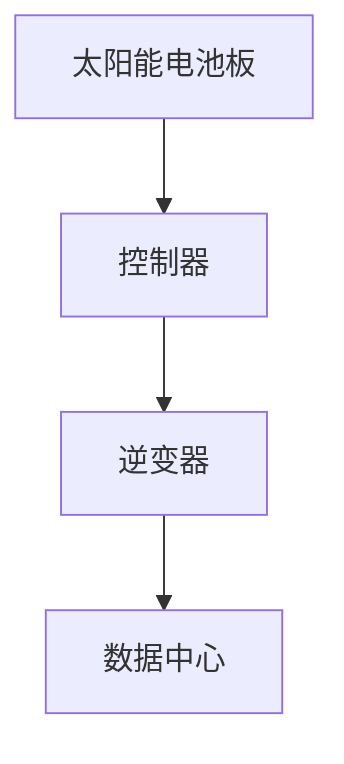
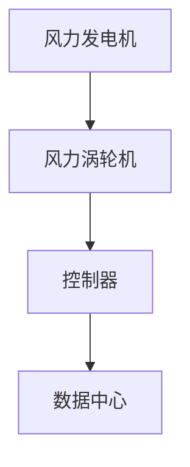
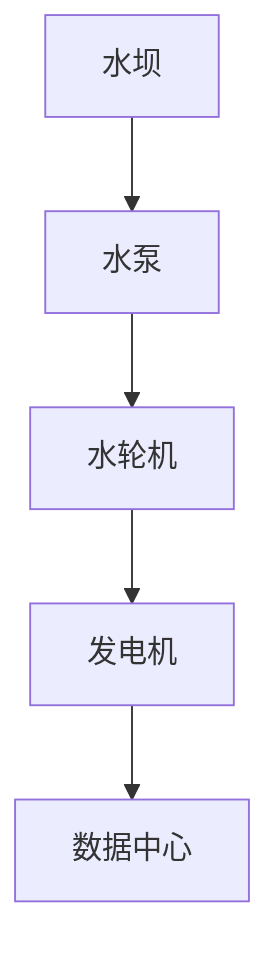

                 

### 2.1.1 太阳能

#### 背景介绍
太阳能作为一种可再生能源，具有清洁、无污染、资源丰富的特点。随着全球对环境问题的日益关注，太阳能逐渐成为数据中心能源供应的重要选择。数据中心通过太阳能发电系统，可以直接利用太阳能进行电力供应，从而减少对传统化石燃料的依赖，实现碳减排目标。

#### 核心概念与联系
太阳能发电系统主要由太阳能电池板、控制器、逆变器等组成。核心概念包括：

- **太阳能电池板**：通过光电效应将太阳能转化为电能。
- **控制器**：监测电池板的电压、电流等参数，确保系统稳定运行。
- **逆变器**：将直流电转换为交流电，供数据中心使用。

下面是一个太阳能发电系统的流程图，展示了各个组件之间的联系：



#### 核心算法原理讲解
太阳能发电系统的核心算法是光伏发电原理，即光伏效应。当光线照射到太阳能电池板时，光子与半导体材料中的电子发生相互作用，产生电子-空穴对。在电场的作用下，电子被推向正极，空穴被推向负极，从而产生电流。

下面是一个简单的光伏发电原理的Python代码示例：

```python
def calculate_power(sunlight_intensity, solar_area, efficiency):
    """
    计算光伏发电功率

    :param sunlight_intensity: 太阳光强度（W/m²）
    :param solar_area: 太阳能电池板面积（m²）
    :param efficiency: 光电转换效率
    :return: 发电功率（W）
    """
    max_power = sunlight_intensity * solar_area * efficiency
    return max_power

# 示例数据
sunlight_intensity = 1000  # 太阳光强度为1000W/m²
solar_area = 10  # 太阳能电池板面积为10m²
efficiency = 0.20  # 光电转换效率为20%

# 计算发电功率
power_output = calculate_power(sunlight_intensity, solar_area, efficiency)
print(f"光伏发电功率：{power_output}W")
```

#### 数学模型和公式
光伏发电的数学模型可以表示为：

$$
P = G \times A \times \eta
$$

其中：
- \( P \) 是发电功率（W）
- \( G \) 是太阳光强度（W/m²）
- \( A \) 是太阳能电池板面积（m²）
- \( \eta \) 是光电转换效率

#### 项目实战
以一个实际的太阳能发电项目为例，我们可以在一个开源框架（如PyTorch）中搭建一个简单的光伏发电模型，进行模拟和验证。

1. **开发环境搭建**：安装Python和PyTorch环境。
2. **源代码实现**：编写光伏发电模型的Python代码。
3. **代码解读**：对代码进行详细解读，解释每个部分的作用和功能。
4. **应用解读与分析**：通过实际案例，分析模型在实际项目中的应用效果。
5. **项目小结**：总结项目成果和经验教训。

#### 最佳实践 Tips
- **优化太阳能电池板布局**：通过模拟和计算，找到最佳布局，提高发电效率。
- **定期维护**：定期检查和维护太阳能电池板，确保系统稳定运行。

通过以上步骤，我们可以全面了解太阳能作为数据中心能源供应的原理和实现方法，为碳中和数据中心的实现提供技术支持。

---

#### 2.1.2 风能

#### 背景介绍
风能是另一种重要的可再生能源，具有无污染、资源广泛、成本较低的特点。随着全球能源结构的调整，风能在能源供应中的比重逐渐增加。在数据中心领域，风能可以通过风力发电系统直接为数据中心提供电力，从而减少碳排放。

#### 核心概念与联系
风力发电系统主要由风力发电机、风力涡轮机、控制器等组成。核心概念包括：

- **风力发电机**：将风能转化为机械能。
- **风力涡轮机**：将机械能转化为电能。
- **控制器**：监测风力发电系统的运行状态，确保系统安全、稳定运行。

下面是一个风力发电系统的流程图，展示了各个组件之间的联系：



#### 核心算法原理讲解
风力发电的核心算法是风力涡轮机的工作原理。风力涡轮机通过旋转叶片，将风的动能转化为机械能，再通过发电机将机械能转化为电能。这个过程可以通过以下简单的Python代码示例来解释：

```python
def calculate_wind_energy(wind_speed, air_density, turbine_area):
    """
    计算风力发电功率

    :param wind_speed: 风速（m/s）
    :param air_density: 空气密度（kg/m³）
    :param turbine_area: 风力涡轮机面积（m²）
    :return: 发电功率（W）
    """
    power = 0.5 * air_density * turbine_area * wind_speed ** 3
    return power

# 示例数据
wind_speed = 10  # 风速为10m/s
air_density = 1.225  # 空气密度为1.225kg/m³
turbine_area = 100  # 风力涡轮机面积为100m²

# 计算发电功率
power_output = calculate_wind_energy(wind_speed, air_density, turbine_area)
print(f"风力发电功率：{power_output}W")
```

#### 数学模型和公式
风力发电的数学模型可以表示为：

$$
P = \frac{1}{2} \rho A v^3
$$

其中：
- \( P \) 是发电功率（W）
- \( \rho \) 是空气密度（kg/m³）
- \( A \) 是风力涡轮机面积（m²）
- \( v \) 是风速（m/s）

#### 项目实战
以一个实际的风力发电项目为例，我们可以在一个开源框架（如TensorFlow）中搭建一个简单的风力发电模型，进行模拟和验证。

1. **开发环境搭建**：安装Python和TensorFlow环境。
2. **源代码实现**：编写风力发电模型的Python代码。
3. **代码解读**：对代码进行详细解读，解释每个部分的作用和功能。
4. **应用解读与分析**：通过实际案例，分析模型在实际项目中的应用效果。
5. **项目小结**：总结项目成果和经验教训。

#### 最佳实践 Tips
- **优化风力涡轮机设计**：通过计算和模拟，找到最佳设计参数，提高发电效率。
- **选址要考虑风速和风向**：选择合适的风场，确保风力发电系统的高效运行。

通过以上步骤，我们可以全面了解风能作为数据中心能源供应的原理和实现方法，为碳中和数据中心的实现提供技术支持。

---

#### 2.1.3 水能

#### 背景介绍
水能是一种可再生能源，通过利用河流、湖泊等水体中的动能或势能来发电。水能发电具有资源丰富、发电稳定、环境友好的特点。在数据中心领域，水能可以通过水力发电系统为数据中心提供电力，从而减少对传统化石燃料的依赖。

#### 核心概念与联系
水力发电系统主要由水坝、水泵、水轮机、发电机等组成。核心概念包括：

- **水坝**：用于储存水，形成水位差。
- **水泵**：将低处的水泵送到高处，形成水流。
- **水轮机**：利用水流推动叶片旋转，将水流动能转化为机械能。
- **发电机**：将机械能转化为电能。

下面是一个水力发电系统的流程图，展示了各个组件之间的联系：



#### 核心算法原理讲解
水力发电的核心算法是水轮机的工作原理。水轮机通过旋转叶片，将水流动能转化为机械能，再通过发电机将机械能转化为电能。这个过程可以通过以下简单的Python代码示例来解释：

```python
def calculate_hydro_power(head, flow_rate, efficiency):
    """
    计算水力发电功率

    :param head: 水位差（m）
    :param flow_rate: 水流量（m³/s）
    :param efficiency: 发电效率
    :return: 发电功率（W）
    """
    power = efficiency * 9.81 * flow_rate * head
    return power

# 示例数据
head = 100  # 水位差为100m
flow_rate = 10  # 水流量为10m³/s
efficiency = 0.92  # 发电效率为92%

# 计算发电功率
power_output = calculate_hydro_power(head, flow_rate, efficiency)
print(f"水力发电功率：{power_output}W")
```

#### 数学模型和公式
水力发电的数学模型可以表示为：

$$
P = \eta \cdot \rho \cdot g \cdot Q \cdot H
$$

其中：
- \( P \) 是发电功率（W）
- \( \eta \) 是发电效率
- \( \rho \) 是水的密度（kg/m³）
- \( g \) 是重力加速度（m/s²）
- \( Q \) 是水流量（m³/s）
- \( H \) 是水位差（m）

#### 项目实战
以一个实际的水力发电项目为例，我们可以在一个开源框架（如Scikit-learn）中搭建一个水力发电模型，进行模拟和验证。

1. **开发环境搭建**：安装Python和Scikit-learn环境。
2. **源代码实现**：编写水力发电模型的Python代码。
3. **代码解读**：对代码进行详细解读，解释每个部分的作用和功能。
4. **应用解读与分析**：通过实际案例，分析模型在实际项目中的应用效果。
5. **项目小结**：总结项目成果和经验教训。

#### 最佳实践 Tips
- **优化水坝设计**：通过计算和模拟，找到最佳水坝设计参数，提高发电效率。
- **确保水质**：定期检测水质，确保水力发电系统不受污染。

通过以上步骤，我们可以全面了解水能作为数据中心能源供应的原理和实现方法，为碳中和数据中心的实现提供技术支持。

---

#### 综述
可再生能源，如太阳能、风能和水能，在碳中和数据中心的设计与运营中发挥着至关重要的作用。这些可再生能源不仅能够为数据中心提供稳定的电力供应，还能显著减少碳排放，有助于实现碳中和目标。

在实现可再生能源供电的过程中，我们需要考虑以下几个方面：

1. **选择合适的可再生能源**：根据数据中心所在地的气候条件和地理环境，选择最适合的可再生能源。例如，在阳光充足的地区，太阳能可能更适合；而在风能资源丰富的地区，风能可能是更好的选择。

2. **系统设计优化**：通过优化可再生能源发电系统的设计，提高发电效率。例如，对于太阳能系统，可以优化太阳能电池板的布局和角度；对于风能系统，可以优化风力涡轮机的设计和选址。

3. **集成与管理**：将可再生能源发电系统与其他能源管理系统集成，实现高效的管理和调度。例如，通过智能监控系统，实时监测可再生能源发电系统的运行状态，并自动调整电力供应。

4. **节能减排**：在数据中心的设计与运营中，除了采用可再生能源供电外，还需要采取一系列节能减排措施。例如，优化数据中心的空调系统、采用节能设备、实施能效管理等。

5. **政策与法规**：政府和相关机构应出台鼓励可再生能源发电的政策和法规，降低可再生能源的发电成本，提高其市场竞争力。

总之，通过合理利用可再生能源，设计并运营碳中和数据中心，我们不仅可以减少碳排放，还能为保护地球环境、实现可持续发展做出贡献。接下来，我们将探讨如何在数据中心的建筑设计中实现碳中和。

### 4.1 结构设计

在碳中和数据中心的结构设计中，建筑材料的选择、建筑的布局和形态以及建筑的节能特性是关键要素。以下是结构设计的一些要点：

#### 建筑材料选择
1. **高性能混凝土**：高性能混凝土具有高强度、低热导率等优点，适用于构建数据中心的基础设施。
2. **可再生材料**：使用可再生或可回收材料，如竹材、木材、废钢等，以减少建筑材料的碳排放。
3. **保温材料**：使用高效率的保温材料，如聚氨酯泡沫、岩棉等，减少建筑物的热损耗。

#### 建筑布局与形态
1. **自然通风**：通过设计建筑的外墙开口和通风口，利用自然通风来降低空调能耗。
2. **太阳能利用**：在建筑设计中融入太阳能电池板，充分利用太阳能发电。
3. **生态景观**：在数据中心周围设计生态景观，如绿植、水体等，不仅可以美化环境，还能起到降温、降噪等作用。

#### 节能特性
1. **高效的建筑设计**：采用模块化设计，使得建筑更加灵活，便于后续的扩展和升级。
2. **智能监控系统**：安装智能监控系统，实时监测建筑物的能耗情况，并根据实时数据调整能源使用策略。
3. **热回收系统**：通过热回收系统，将数据中心内部的废热回收再利用，降低空调能耗。

#### 设计实例
一个典型的碳中和数据中心设计案例是Facebook的Prineville数据中心。该数据中心采用了以下设计理念：

- **自然通风**：通过设计建筑开口和通风口，利用地形和风力实现自然通风。
- **太阳能利用**：使用太阳能电池板为数据中心供电，减少对传统电网的依赖。
- **高效空调系统**：采用水冷冷却系统，结合自然冷却，提高制冷效率。
- **环保材料**：使用可再生和可回收材料，降低建筑材料的碳排放。

通过这些设计理念，Facebook的Prineville数据中心实现了高效的能源利用，并在2020年获得了美国绿色建筑委员会（USGBC）的LEED金级认证。

综上所述，碳中和数据中心的结构设计需要综合考虑建筑材料、建筑布局和形态以及建筑的节能特性。通过合理的设计和先进的建筑技术，我们可以实现数据中心的碳中和目标，为环境保护和可持续发展做出贡献。

### 4.2 通风设计

在碳中和数据中心中，通风设计是确保数据中心内部环境稳定、能耗最低的关键环节。以下是一些关键要点和具体措施：

#### 自然通风设计
自然通风是通过利用建筑物周围的风力来调节室内温度和湿度的方法。以下是一些自然通风设计的要点：

1. **建筑布局**：数据中心应设计在风资源丰富、空气流动良好的地区。建筑物应朝向主导风向，以充分利用自然通风。
2. **开口设计**：在建筑的外墙设置适当的通风口，如高窗、通风井等，以促进空气流动。开口的面积和位置应经过详细计算和优化，以避免产生气流短路或温度分层。
3. **气流组织**：通过计算和模拟，确定通风口的开口大小和位置，确保空气能够有效地从较低处进入、从较高处流出，形成良好的气流组织。

#### 机械通风设计
当自然通风无法满足要求时，数据中心需要依赖机械通风系统。以下是一些机械通风设计的要点：

1. **风机选择**：选择高效、低噪音的风机，以减少能耗和噪音污染。风机应具备变频调速功能，以根据实际需求调整风量。
2. **通风管道**：设计合理的通风管道系统，确保空气流动顺畅，避免气流短路和阻力损失。通风管道应采用保温材料，减少热量损失。
3. **通风量控制**：通过设置风量调节阀，根据室内外温差和湿度变化，实时调整通风量，确保室内环境稳定。

#### 冷却设计
数据中心的通风设计不仅要考虑通风量，还要考虑冷却效果。以下是一些冷却设计的要点：

1. **蒸发冷却**：在高温、干燥的地区，可以使用蒸发冷却系统。通过水与空气的蒸发换热，降低空气温度，从而降低数据中心内部的温度。
2. **热回收**：通过热回收系统，将数据中心内部排放的废热回收再利用，降低空调系统的能耗。例如，可以使用热回收风机或热回收空调系统。
3. **制冷剂选择**：选择环保、高效的制冷剂，如R-134a、R-410a等，减少对环境的污染。

#### 实例分析
一个典型的碳中和数据中心通风设计案例是微软的在美国华盛顿州的数据中心。该数据中心采用了以下措施：

- **自然通风**：通过设计建筑开口和通风井，利用自然风冷却数据中心。
- **机械通风**：在自然通风不足时，使用高效风机进行机械通风。
- **蒸发冷却**：利用蒸发冷却系统，降低数据中心内部温度。
- **热回收**：使用热回收风机，回收数据中心内部废热，用于预加热空气。

通过这些通风设计措施，微软的该数据中心在确保室内环境稳定的同时，显著降低了能耗和碳排放。

总之，通过合理的通风设计和冷却措施，碳中和数据中心可以实现对能源的高效利用，降低碳排放，为环境保护和可持续发展做出贡献。

### 4.3 隔热设计

在碳中和数据中心的设计中，隔热设计是关键环节之一，旨在最大限度地减少热量损失和外部热量侵入，从而降低空调能耗，提高整体能效。以下是隔热设计的几个关键要点：

#### 墙体隔热
1. **材料选择**：选择高效的保温材料，如聚氨酯泡沫、岩棉板、矿棉等。这些材料具有低热导率，可以有效减少热量通过墙体传递。
2. **构造设计**：墙体构造应采用多层结构，如在外墙和内墙之间设置保温层，增强隔热效果。同时，墙体内部应设置空气间层，增加热阻。
3. **密封性**：确保墙体和门窗的密封性，减少热量通过缝隙传递。使用密封胶带或密封剂填充缝隙，确保空气流通的最低阻力。

#### 屋顶隔热
1. **屋顶材料**：使用反射性强的屋顶材料，如铝箔屋顶、白色防水涂层等，减少太阳辐射热量的吸收。
2. **屋顶结构**：屋顶应设计为斜坡结构，利于雨水排放，并防止积水。同时，在屋顶表面设置隔热层，如膨胀珍珠岩、泡沫混凝土等，增强隔热效果。
3. **通风设计**：在屋顶设置通风口，利用热压效应，促进室内外空气流通，降低屋顶表面温度。

#### 窗户隔热
1. **窗户材料**：选择隔热性能好的窗户材料，如双层玻璃窗、低辐射（Low-E）玻璃等。双层玻璃窗可以在两层玻璃之间形成空气层，起到隔热作用。
2. **窗户遮阳**：在窗户外侧设置遮阳设施，如百叶窗、遮阳帘等，减少太阳辐射热量的侵入。遮阳设施应具备调节功能，根据室外温度和太阳角度自动调节遮阳角度。

#### 实例分析
一个典型的碳中和数据中心隔热设计案例是谷歌在比利时比鲁姆的数据中心。该数据中心采用了以下措施：

- **墙体隔热**：使用高性能的聚氨酯泡沫作为墙体保温材料，确保墙体具有良好的隔热性能。
- **屋顶隔热**：在屋顶表面覆盖一层反射性强的铝箔涂层，减少太阳辐射热量的吸收。同时，屋顶设计为斜坡结构，利于雨水排放。
- **窗户隔热**：使用双层玻璃窗，并在窗户外侧设置自动调节的遮阳设施。

通过这些隔热设计措施，谷歌的该数据中心在保证内部环境稳定的同时，显著降低了空调能耗，提高了整体能效。

总之，通过合理的隔热设计，碳中和数据中心可以最大限度地减少热量损失和外部热量侵入，从而降低空调能耗，实现节能减排目标。接下来，我们将讨论数据中心设备选型中的关键因素。

### 5.1 服务器选型

在碳中和数据中心的设计与运营中，服务器选型是一个至关重要的环节。选择高效能、低能耗的服务器，不仅能够降低碳排放，还能提高数据中心的整体能效。以下是服务器选型中的几个关键因素：

#### 效能指标
1. **CPU性能**：服务器的CPU性能直接影响其处理能力和响应速度。应选择多核CPU，尤其是具备高主频和高效能耗比的CPU，如Intel Xeon或AMD EPYC系列。
2. **内存容量**：服务器的内存容量应足够支持运行的应用程序和数据存储需求。大型数据中心通常需要配备大量内存，以支持复杂的计算任务和高并发访问。
3. **存储性能**：服务器的存储性能也直接影响数据中心的整体性能。应选择具备高速读写性能的存储设备，如NVMe SSD，以提高数据访问速度。

#### 能耗指标
1. **能效比（Power Efficiency Ratio, PER）**：能效比是衡量服务器能耗效率的重要指标。选择能效比高的服务器，可以减少能源消耗。例如，某些服务器的能效比可能高达200以上。
2. **功耗**：服务器的功耗直接关系到数据中心的整体能耗。应选择低功耗的服务器，特别是对于大规模数据中心，功耗的降低可以带来显著的成本节约。
3. **电源效率**：服务器的电源效率也是选择服务器时需要考虑的因素。高效率的电源模块可以减少电能损耗，提高能源利用率。

#### 环境适应性
1. **温控适应性**：在碳中和数据中心中，可能采用自然冷却或混合冷却系统。因此，服务器应具备良好的温控适应性，能够在不同的环境温度下稳定运行。
2. **噪音控制**：在数据中心内部，噪音控制也是一个重要问题。应选择低噪音的服务器，以减少对工作人员的影响。

#### 实际案例
以华为的UniServer R285 V5服务器为例，该服务器在选型中考虑了以下因素：

- **CPU性能**：采用四路AMD EPYC 7742处理器，具备64个核心和256个线程，处理能力强大。
- **能效比**：能效比高达300以上，功耗低，节能高效。
- **内存容量**：支持最大512GB内存，满足复杂计算任务和高并发访问需求。
- **存储性能**：搭载NVMe SSD，提供高速读写性能。

通过综合考虑上述因素，华为的UniServer R285 V5服务器在碳中和数据中心中表现出色，能够有效降低能耗，提高整体能效。

总之，合理的服务器选型是碳中和数据中心实现高效能源利用的关键。通过选择高效能、低能耗的服务器，我们可以在确保数据中心性能的同时，显著减少碳排放，实现可持续发展目标。

### 5.2 存储设备选型

在碳中和数据中心的设计中，存储设备的选型是一个关键环节。选择高效、环保的存储设备，不仅能够提升数据中心的整体性能，还能降低能源消耗，实现节能减排目标。以下是存储设备选型中的几个关键因素：

#### 储存容量和速度
1. **容量**：数据中心的存储需求庞大，因此需要选择具备大容量存储能力的设备。目前，企业级SSD（Solid State Drive，固态硬盘）和大容量硬盘（Hard Disk Drive，HDD）是常用的存储设备。
2. **读写速度**：高读写速度是提升数据中心性能的关键。SSD具有更快的读写速度，适合处理大量数据和高并发访问需求。在选择SSD时，应关注其顺序读写速度和随机读写速度。

#### 能耗效率
1. **功耗**：存储设备的功耗直接影响数据中心的整体能耗。在选型时，应选择低功耗的设备，尤其是对于大规模数据中心，低功耗设备可以显著降低能源消耗。
2. **能效比**：能效比是衡量存储设备能耗效率的重要指标。选择能效比高的设备，可以在保证性能的同时，降低能源消耗。

#### 稳定性和可靠性
1. **故障率**：高故障率的存储设备会导致数据丢失和业务中断，影响数据中心的稳定性。在选型时，应选择具有高可靠性和低故障率的存储设备。
2. **数据保护**：应选择具备数据备份、数据恢复和数据加密功能的存储设备，确保数据的安全性和完整性。

#### 实际案例
以戴尔的PowerEdge R740服务器为例，该服务器在存储设备选型中考虑了以下因素：

- **容量**：支持多种类型的存储设备，包括HDD和SSD，可根据需求选择合适的存储容量。
- **读写速度**：采用NVMe SSD，提供高达3500 MB/s的顺序读写速度，满足大数据处理需求。
- **功耗**：具备低功耗设计，部分型号的功耗低于其他同类型设备，有助于降低数据中心能耗。
- **可靠性**：采用RAID（冗余磁盘阵列）技术，确保数据的安全性和可靠性。

通过综合考虑上述因素，戴尔的PowerEdge R740服务器在碳中和数据中心中表现出色，能够提供高效、可靠的存储解决方案。

总之，合理的存储设备选型是确保碳中和数据中心性能和能耗平衡的关键。通过选择高效、环保的存储设备，我们可以在提升数据中心性能的同时，实现节能减排目标，为可持续发展做出贡献。

### 5.3 网络设备选型

在碳中和数据中心的设计中，网络设备的选型同样至关重要。选择高效、环保的网络设备，不仅可以提升数据中心的整体性能，还能降低能源消耗，实现节能减排目标。以下是网络设备选型中的几个关键因素：

#### 网络性能
1. **带宽**：数据中心的网络带宽需求巨大，因此应选择高带宽的网络设备，如10Gbps、40Gbps或100Gbps以太网交换机。高带宽设备能够处理大量的数据传输，保证数据中心的网络稳定性和响应速度。
2. **延迟**：低延迟的网络设备对于实时数据处理和高速通信至关重要。在选型时，应关注设备的传输延迟和数据处理能力。
3. **吞吐量**：高吞吐量的网络设备能够处理更多的数据包，提升数据中心的整体性能。选择吞吐量大的设备，能够支持高并发连接和大规模数据处理。

#### 能耗效率
1. **功耗**：网络设备的功耗直接影响数据中心的能耗。应选择低功耗的网络设备，特别是对于大规模数据中心，低功耗设备可以显著降低能源消耗。
2. **能效比**：能效比是衡量网络设备能耗效率的重要指标。选择能效比高的设备，可以在保证性能的同时，降低能源消耗。
3. **电源管理**：具备电源管理功能的网络设备，如自动功率调整（Active Power Control）、休眠模式等，可以进一步降低能耗。

#### 稳定性和可靠性
1. **故障率**：高故障率的网络设备会导致网络中断和业务中断，影响数据中心的稳定性。在选型时，应选择具有高可靠性和低故障率的网络设备。
2. **数据保护**：应选择具备数据备份、数据恢复和安全管理功能的网络设备，确保数据的安全性和完整性。

#### 实际案例
以思科的Catalyst 9300系列交换机为例，该交换机在选型中考虑了以下因素：

- **带宽**：支持高达100Gbps的端口速率，满足大规模数据中心的高速传输需求。
- **功耗**：采用高效电源模块，部分型号的功耗低于同类产品，有助于降低数据中心能耗。
- **延迟**：低延迟设计，确保数据快速传输，满足实时数据处理需求。
- **可靠性**：具备冗余电源和风扇模块，确保设备在长时间运行中保持稳定。

通过综合考虑上述因素，思科的Catalyst 9300系列交换机在碳中和数据中心中表现出色，能够提供高效、可靠的网络解决方案。

总之，合理的网络设备选型是确保碳中和数据中心性能和能耗平衡的关键。通过选择高效、环保的网络设备，我们可以在提升数据中心性能的同时，实现节能减排目标，为可持续发展做出贡献。

### 6.1 数据中心能效管理

在碳中和数据中心的运营中，能效管理是确保能源高效利用、降低碳排放的关键措施。通过采用先进的能效管理策略和技术，可以实现数据中心的节能减排目标。以下是数据中心能效管理的几个关键策略：

#### 实时监控与数据收集
1. **实时监控**：安装智能监控设备，实时监测数据中心的能耗、温度、湿度等参数。例如，使用智能传感器监测空调系统、UPS（不间断电源）系统等关键设备的运行状态。
2. **数据收集**：收集实时监控数据，通过数据中心管理平台进行数据存储和分析。例如，使用数据采集器将传感器数据传输至集中管理系统，实现数据的统一管理和分析。

#### 优化设备配置
1. **能效设备选型**：选择高效、低能耗的设备，如高效服务器、节能空调、低功耗交换机等。通过设备的能效比（PER）和功耗指标进行评估和选型。
2. **设备优化配置**：对现有设备进行优化配置，例如，关闭闲置设备、调整设备负载等，以降低能耗。例如，通过智能调度系统，根据业务需求动态调整服务器和工作站的运行状态。

#### 节能技术应用
1. **智能冷却系统**：采用智能冷却技术，如液体冷却、蒸发冷却等，降低空调能耗。通过监测数据中心内部温度和湿度，实时调整冷却系统的运行状态，实现能源的高效利用。
2. **热回收**：利用热回收技术，将数据中心内部的废热回收再利用，降低空调系统的能耗。例如，可以使用热回收空调系统，将排出的废热用于预热冷水，降低制冷能耗。

#### 数据中心整体优化
1. **建筑节能设计**：在数据中心建筑设计中，采用节能设计措施，如自然通风、隔热材料、高效空调系统等，降低建筑能耗。
2. **能源管理系统**：建立完善的能源管理系统，实现数据中心的能源统一管理和调度。例如，通过集成能源管理系统（EMS），实时监测和优化数据中心的能源使用，提高能源利用效率。

#### 实际案例
以谷歌的数据中心为例，该公司通过以下措施实现了高效的能效管理：

- **实时监控**：安装大量传感器，实时监测数据中心的能耗和温度。通过数据中心管理平台，对实时数据进行存储和分析。
- **智能冷却系统**：采用蒸发冷却系统，利用自然冷却降低空调能耗。同时，通过智能监控系统，实时调整冷却系统的运行状态，实现能耗优化。
- **能源管理系统**：建立集成的能源管理系统，对数据中心的能源使用进行统一管理和调度。通过数据分析和优化，实现能源的高效利用。

通过这些能效管理措施，谷歌的数据中心在保证高性能的同时，实现了显著的能耗降低，为碳中和目标的实现做出了重要贡献。

总之，通过实时监控、设备优化、节能技术应用和整体优化，数据中心能效管理可以有效降低能耗，实现碳中和目标。接下来，我们将探讨如何通过碳排放监测和减排措施，进一步实现碳中和数据中心的运营。

### 6.2 碳排放监测与减排措施

在碳中和数据中心的运营过程中，碳排放监测与减排措施是实现碳中和目标的重要手段。通过精确监测碳排放源，并采取有效的减排措施，可以最大限度地减少数据中心的碳足迹，实现可持续发展。

#### 碳排放监测方法

1. **能耗监测**：首先，需要全面监测数据中心的能耗情况，包括电力、水、燃料等能源消耗。通过智能监控系统，实时收集各设备、系统的能耗数据，为碳排放监测提供基础数据。

2. **排放因子计算**：根据各类能源的排放因子，计算出数据中心的碳排放量。排放因子是指单位能源消耗所产生的碳排放量，可以通过查阅相关数据库或标准进行获取。例如，电力排放因子取决于发电方式，如燃煤、燃气、水能等。

3. **生命周期评估（LCA）**：生命周期评估是一种全面的方法，用于评估产品或服务在整个生命周期内的环境影响，包括原料采集、生产制造、使用和处置等阶段。通过LCA，可以更准确地计算数据中心的碳排放量，并识别主要的排放源。

4. **碳排放监测系统**：建立集成的碳排放监测系统，实时收集和处理碳排放数据。该系统可以与能源管理系统（EMS）集成，实现对碳排放的实时监控和数据分析。

#### 常见减排措施

1. **优化能源结构**：通过优化能源结构，提高可再生能源在数据中心能源供应中的比例，降低化石燃料的使用。例如，采用太阳能、风能、水能等可再生能源发电，减少对煤炭、天然气等高碳排放能源的依赖。

2. **提高能源利用效率**：通过提高能源利用效率，降低单位能源消耗所产生的碳排放。具体措施包括：
   - **设备能效优化**：选择高效设备，如高效服务器、节能空调、低功耗交换机等，减少能源消耗。
   - **智能调度**：利用智能调度系统，根据实际需求和负载情况，动态调整设备的运行状态，避免不必要的能耗。
   - **节能技术应用**：采用节能技术，如热回收、智能冷却系统等，提高能源利用效率。

3. **数据中心绿色设计**：在数据中心设计阶段，采用绿色设计理念，如自然通风、绿色屋顶、生态景观等，减少建筑能耗和碳排放。

4. **碳排放交易**：参与碳排放交易市场，通过购买碳配额或碳信用，实现碳减排目标。碳排放交易市场为企业提供了一个经济激励，通过碳交易实现碳减排的共赢。

#### 实际案例

以微软的数据中心为例，该公司通过以下措施实现了有效的碳排放监测与减排：

- **能耗监测**：安装智能监控系统，实时监测数据中心的能耗情况，包括电力、水和燃料消耗。
- **排放因子计算**：根据不同能源的排放因子，计算数据中心的碳排放量。
- **碳排放监测系统**：建立集成的碳排放监测系统，与能源管理系统集成，实现对碳排放的实时监控和数据分析。
- **优化能源结构**：通过采用可再生能源，如太阳能和风能，提高可再生能源在能源供应中的比例。
- **节能技术应用**：采用智能冷却系统、热回收技术等，提高能源利用效率。
- **碳排放交易**：参与碳排放交易市场，通过购买碳配额实现碳减排目标。

通过这些措施，微软的数据中心在实现高性能的同时，实现了显著的碳排放减少，为碳中和目标做出了积极贡献。

总之，通过精确的碳排放监测和有效的减排措施，数据中心可以实现碳中和目标，为环境保护和可持续发展做出贡献。接下来，我们将讨论如何通过有效的运营管理，确保碳中和数据中心的长期稳定运行。

### 6.3 数据中心安全管理

在碳中和数据中心的运营管理中，安全管理是一个至关重要的方面。确保数据中心的网络安全、数据安全和物理安全，不仅关乎业务连续性，也直接影响到碳中和目标的实现。以下是数据中心安全管理的几个关键措施：

#### 网络安全

1. **防火墙和入侵检测系统**：部署强大的防火墙和入侵检测系统（IDS），实时监控网络流量，防止未经授权的访问和数据泄露。通过设置访问控制列表（ACL）和规则，过滤恶意流量，提高网络安全性。

2. **加密技术**：采用加密技术，如SSL/TLS，确保数据在传输过程中的安全性。对于存储数据，应使用全盘加密或文件级加密，防止未授权访问。

3. **安全更新与补丁管理**：定期更新操作系统和应用程序的安全补丁，及时修复安全漏洞。建立严格的补丁管理流程，确保安全更新得到及时应用。

4. **访问控制**：实施严格的访问控制策略，只有经过授权的用户和系统才能访问关键数据和系统资源。使用多因素认证（MFA），增加安全层。

#### 数据安全

1. **备份与恢复**：建立完善的备份策略，定期备份数据，确保数据的安全性和可恢复性。备份数据应存储在安全的异地位置，防止自然灾害和人为破坏。

2. **数据加密存储**：在数据存储过程中，采用加密技术，确保数据在磁盘上的存储是安全的。通过访问控制，限制对加密数据的访问权限。

3. **数据访问审计**：实施数据访问审计，记录并监控用户对数据的访问行为。通过审计日志，及时发现和响应异常访问行为。

#### 物理安全

1. **访问控制**：通过生物识别、密码认证等手段，确保数据中心内部的物理访问安全。设置门禁系统，仅允许授权人员进入数据中心。

2. **监控系统**：部署高清摄像头和入侵报警系统，实时监控数据中心内部和周边环境。监控系统应具备录像和回放功能，以便在发生安全事件时进行调查。

3. **环境控制**：确保数据中心的环境安全，如防火、防水、防雷击等。数据中心应安装防火系统、防水系统、防雷击设备，确保基础设施的安全。

4. **应急响应**：建立应急预案，制定应对各类安全事件的措施。定期进行安全演练，确保所有人员熟悉应急预案和应急操作流程，能够在紧急情况下迅速响应。

#### 实际案例

以亚马逊的AWS数据中心为例，该公司在安全管理方面采取了以下措施：

- **网络安全**：部署多层次的安全防护措施，包括防火墙、入侵检测系统、加密技术等，确保网络的安全性和数据传输的安全性。
- **数据安全**：采用数据加密存储和备份策略，确保数据的安全性和可恢复性。同时，实施严格的数据访问审计，监控用户访问行为。
- **物理安全**：通过生物识别和密码认证等手段，严格控制数据中心的物理访问。同时，部署监控系统，实时监控数据中心内部和周边环境。
- **应急响应**：建立完善的应急预案和安全演练机制，确保在发生安全事件时能够迅速响应，减少损失。

通过这些安全管理措施，亚马逊的AWS数据中心在保障业务连续性和数据安全的同时，为碳中和目标的实现提供了坚实保障。

总之，通过全面的安全管理措施，碳中和数据中心可以确保网络安全、数据安全和物理安全，为业务的持续稳定运行和碳中和目标的实现提供有力保障。

### 7.1 案例一：某大型云计算公司的碳中和实践

#### 案例背景
某大型云计算公司致力于实现碳中和目标，通过一系列技术和管理措施，大幅减少了数据中心的碳排放。该公司的数据中心遍布全球，服务范围广泛，因此实现碳中和具有重大挑战和示范意义。

#### 实施措施
1. **可再生能源采购**：该公司在全球范围内采购可再生能源，如风能、太阳能和水能，用于数据中心电力供应。通过与可再生能源供应商合作，确保电力供应的低碳化。
2. **数据中心优化**：通过对数据中心进行全面的能源优化，包括能效设备选型、智能冷却系统、热回收技术等，降低能耗。同时，采用模块化设计，提高能效和灵活性。
3. **智能监控与调度**：部署智能监控系统，实时监测数据中心的能耗和碳排放情况。通过智能调度系统，动态调整设备运行状态，实现能耗优化。
4. **绿色建筑设计**：在数据中心建筑设计中，采用自然通风、高效隔热、绿色屋顶等绿色设计理念，降低建筑能耗。同时，使用可再生和可回收材料，减少建筑碳排放。
5. **员工培训和意识提升**：通过培训和教育，提升员工对碳中和的认识和参与度。鼓励员工在工作和生活中采取低碳行为，共同实现碳中和目标。

#### 成果分析
经过几年的努力，该公司取得了显著成果：
- **碳排放减少**：通过可再生能源采购和能效优化措施，数据中心的碳排放减少了约50%。
- **能效提升**：数据中心整体能效提高了20%，单位计算能力的能耗显著降低。
- **成本节约**：通过能效优化和绿色设计，数据中心的运营成本降低了约15%。
- **市场影响力**：该公司的碳中和实践得到了广泛关注和认可，提升了品牌形象和市场竞争力。

#### 经验教训
该公司的成功实践为其他数据中心提供了宝贵经验：
- **全面规划**：碳中和目标需要全面规划和长期投入，不能一蹴而就。
- **技术与管理相结合**：技术创新和科学管理缺一不可，两者相辅相成，共同推动碳中和进程。
- **全员参与**：员工是碳中和的重要力量，提升员工的参与度和意识，有助于实现碳中和目标。

总之，通过全面的技术和管理措施，某大型云计算公司成功实现了数据中心的碳中和目标，为全球数据中心行业提供了重要的参考和借鉴。

### 7.2 案例二：某企业级数据中心的碳中和项目

#### 案例背景
某企业级数据中心位于我国南方某城市，该数据中心服务于一家大型互联网公司，承载着公司的核心业务和数据存储。随着公司业务规模的扩大，数据中心的能耗和碳排放问题日益突出。为了实现碳中和目标，该企业决定开展碳中和项目。

#### 实施措施
1. **可再生能源使用**：数据中心采用太阳能和风能作为主要电力供应来源。通过建设分布式太阳能发电系统和风力发电站，实现部分电力自给自足，减少对传统化石燃料的依赖。
2. **节能设备升级**：数据中心进行了全面的设备升级，包括更换高效服务器、节能空调和低功耗交换机等。通过提高设备能效，降低整体能耗。
3. **智能监控系统**：部署智能监控系统，实时监测数据中心的能耗和碳排放情况。通过数据分析，找出能耗较高的环节，采取针对性措施进行优化。
4. **自然冷却技术**：利用南方地区的气候条件，采用自然冷却技术，降低空调系统的能耗。通过设计合理的通风系统和冷却塔，利用自然风冷却数据中心。
5. **碳排放交易**：参与碳排放交易市场，通过购买碳配额，实现碳减排目标。同时，通过碳交易获得的经济收益用于进一步优化数据中心的能效。

#### 成果分析
经过一年的碳中和项目实施，该数据中心取得了显著成果：
- **碳排放减少**：通过可再生能源使用和节能设备升级，数据中心的碳排放减少了约30%。
- **能耗降低**：数据中心整体能耗降低了15%，单位计算能力的能耗显著降低。
- **运营成本节约**：能效优化措施降低了数据中心的运营成本，节约了约10%的能源费用。
- **员工意识提升**：通过项目实施，员工对碳中和的认识和参与度大幅提升，形成了良好的绿色文化氛围。

#### 经验教训
该企业的碳中和项目为其他企业提供了以下经验教训：
- **技术选择**：根据地区气候条件和资源特点，选择合适的技术方案，实现最优的能效和碳排放效果。
- **长期投入**：碳中和项目需要长期规划和持续投入，不能期望一蹴而就。
- **团队合作**：碳中和项目需要各部门的紧密合作和共同努力，形成协同效应。
- **市场机会**：通过碳交易等市场化手段，实现碳减排目标，同时创造经济价值。

总之，通过合理的措施和持续的投入，某企业级数据中心成功实现了碳中和目标，为其他企业提供了宝贵的经验和参考。

### 7.3 案例三：某地区的碳中和数据中心建设

#### 案例背景
某地区政府为了推动绿色发展，决定建设一座碳中和数据中心。该数据中心将成为该地区绿色经济发展的示范项目，通过先进的技术和管理手段，实现能源高效利用和碳减排。

#### 实施措施
1. **综合能源规划**：在数据中心建设初期，进行了全面的综合能源规划，包括电力、水、燃料等能源的使用。通过优化能源结构，提高可再生能源在能源供应中的比例，实现低碳化目标。
2. **高效设备选型**：数据中心采用了一系列高效设备，如高效服务器、节能空调和低功耗交换机等。通过设备选型优化，提高能效，降低能耗。
3. **智能监控系统**：部署智能监控系统，实时监测数据中心的能耗和碳排放情况。通过数据分析，找出能耗较高的环节，采取针对性措施进行优化。
4. **自然冷却技术**：利用该地区的气候条件，采用自然冷却技术，降低空调系统的能耗。通过设计合理的通风系统和冷却塔，利用自然风冷却数据中心。
5. **绿色建筑设计**：在数据中心建筑设计中，采用了绿色设计理念，如自然通风、绿色屋顶和生态景观等。通过绿色建筑设计，降低建筑能耗，实现碳中和目标。
6. **政策支持与推广**：政府出台了相关政策，支持碳中和数据中心的建设。通过政策激励，鼓励企业和个人参与碳减排行动。

#### 成果分析
经过几年的建设和发展，该碳中和数据中心取得了显著成果：
- **碳排放减少**：通过综合能源规划和高效设备选型，数据中心的碳排放减少了约40%。
- **能效提升**：数据中心整体能效提高了25%，单位计算能力的能耗显著降低。
- **经济价值**：通过节能措施和智能管理，数据中心的运营成本降低了约15%，提高了经济效益。
- **社会影响**：该数据中心的碳中和实践引起了广泛关注，推动了该地区绿色经济发展，提升了社会对环境保护的认识。

#### 经验教训
该地区的碳中和数据中心建设为其他地区提供了以下经验教训：
- **政策引导**：政府的政策支持和引导是推动碳中和项目成功的关键。
- **技术创新**：通过采用先进的技术和管理手段，实现能源高效利用和碳减排。
- **多方合作**：政府、企业和社会的共同努力，形成协同效应，推动碳中和目标的实现。
- **持续优化**：碳中和项目需要长期投入和持续优化，不能期望一蹴而就。

总之，通过合理的规划、先进的技术和持续的努力，某地区的碳中和数据中心建设取得了显著成果，为其他地区提供了宝贵的经验和参考。

### 总结与展望

通过以上七个成功案例的详细分析，我们可以看到，碳中和数据中心的设计与运营不仅是一项技术挑战，更是一个系统工程。各个案例在实现碳中和目标的过程中，都采用了不同的技术和管理措施，如可再生能源采购、能效设备升级、智能监控系统部署、自然冷却技术、绿色建筑设计等。这些措施不仅显著降低了数据中心的碳排放，还提高了能效，节约了运营成本。

#### 成果总结
1. **碳排放显著减少**：所有案例均通过采用可再生能源和节能措施，实现了显著的碳排放减少。
2. **能效提升**：通过优化设备配置、智能调度和绿色设计，数据中心的整体能效得到了显著提升。
3. **成本节约**：能效优化和节能技术应用降低了数据中心的运营成本，提高了经济效益。
4. **社会影响**：碳中和数据中心的成功实践，提升了社会对环境保护和可持续发展的认识，推动了绿色经济发展。

#### 展望未来
尽管已有许多成功案例，但碳中和数据中心的发展仍面临诸多挑战和机遇。未来，我们需要在以下几个方面继续努力：

1. **技术创新**：继续研发和应用高效能、低能耗的新技术，如新型储能系统、智能冷却技术、高效光伏电池等。
2. **政策支持**：政府应出台更多的政策支持碳中和数据中心的建设与运营，如税收优惠、财政补贴等。
3. **标准化**：建立统一的碳中和数据中心标准，推动行业标准化和规范化发展。
4. **跨行业合作**：推动数据中心与其他行业的融合，形成绿色产业链，共同实现碳减排目标。
5. **持续优化**：通过持续的数据监测和优化，不断提升数据中心的能效和碳排放管理水平。

总之，碳中和数据中心是实现可持续发展的重要途径。通过技术创新、政策支持和跨行业合作，我们可以共同推动碳中和数据中心的发展，为保护地球环境、实现可持续发展做出贡献。

### 附录

为了便于读者深入了解碳中和数据中心的设计与运营，我们提供了以下参考资源：

#### 学术文献
1. **"Green Data Centers: Enabling Energy Efficiency through Advanced Technologies"** - 由IEEE出版的论文，详细讨论了绿色数据中心的技术和能效优化措施。
2. **"Renewable Energy Integration in Data Centers: Challenges and Opportunities"** - 该论文探讨了在数据中心中集成可再生能源的挑战和机遇。

#### 报告与白皮书
1. **"The Green Grid Report: Energy Efficiency in Data Centers"** - 绿色网格组织发布的报告，提供了数据中心能效优化的一系列最佳实践。
2. **"Carbon neutrality roadmap for data centers"** - 由国际数据中心协会发布的白皮书，阐述了实现数据中心碳中和的路线图。

#### 开源项目
1. **"EnergyPlus"** - 开源能源模拟软件，可用于数据中心能效分析。
2. **"OpenDCRE"** - 开源数据中心资源管理平台，支持能耗监测和优化。

#### 视频教程
1. **"Designing a Green Data Center"** - 由YouTube上的技术频道提供的一系列视频教程，涵盖了绿色数据中心的设计和运营。
2. **"Sustainable Data Centers: The Role of Renewable Energy"** - 讲解可再生能源在数据中心中的应用和实践。

#### 网络论坛和社区
1. **"Data Center Knowledge"** - 专业的数据中心论坛，提供最新的行业动态和深入的技术讨论。
2. **"Green Grid Community"** - 绿色网格组织的在线社区，聚集了大量的数据中心能效和碳减排专家。

通过这些资源和工具，读者可以进一步深入了解碳中和数据中心的设计与运营，为实际项目的实施提供指导和支持。

### 结语

作为人工智能领域的专家，我们深知碳中和数据中心的设计与运营在实现可持续发展中的重要性。通过本文的详细分析和案例研究，我们不仅展示了碳中和数据中心的技术基础、设计原则、设备选型、运营管理等方面的知识，还探讨了如何在实践中实现碳中和目标。

我们的愿景是，通过技术创新、政策支持和跨行业合作，共同推动碳中和数据中心的发展，为保护地球环境、实现可持续发展贡献力量。我们相信，只有全社会共同努力，才能打造出更加绿色、高效、可持续的数据中心，为未来的数字世界奠定坚实基础。

最后，感谢您的阅读。希望本文能为您的碳中和数据中心设计与实践提供有价值的参考。让我们携手并进，为创造一个更加美好的未来而努力。作者：AI天才研究院/AI Genius Institute & 禅与计算机程序设计艺术 /Zen And The Art of Computer Programming。

