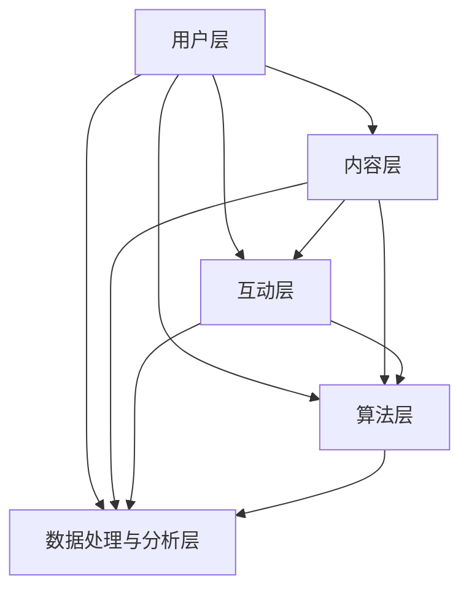
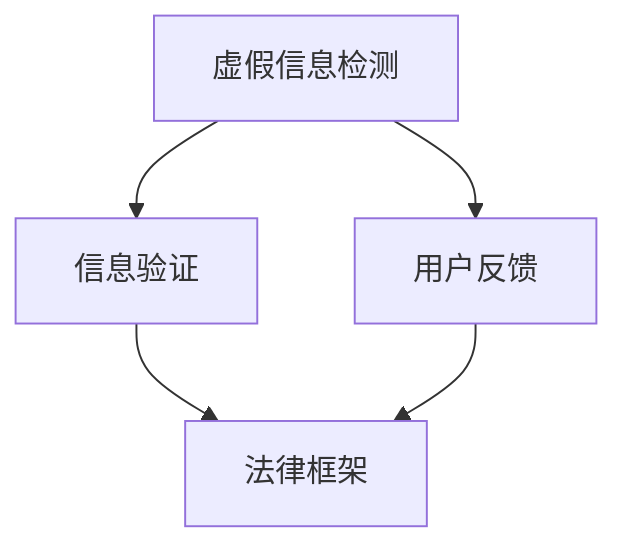

                 

# 社交媒体平台应对虚假信息的责任

> 关键词：社交媒体、虚假信息、责任、技术、法律、道德

> 摘要：
本文深入探讨了社交媒体平台在应对虚假信息方面所承担的责任。通过分析社交媒体平台的基本概念和架构，介绍虚假信息的识别与处理技术，探讨平台的责任与法律框架，以及技术手段在应对虚假信息方面的应用，本文旨在为社交媒体平台提供全面、深入的应对策略，以构建一个真实、公正、健康的网络环境。

## 引言

随着互联网和社交媒体的迅速发展，人们获取信息的方式发生了翻天覆地的变化。然而，这也带来了一个严峻的问题——虚假信息的泛滥。社交媒体平台作为信息传播的重要渠道，在应对虚假信息方面承担着重要的责任。本文旨在探讨社交媒体平台在应对虚假信息方面的责任，包括技术手段、法律框架和社会责任等方面。

虚假信息已经成为全球范围内的一大难题。社交媒体平台每天处理海量信息，如何有效地识别和处理虚假信息，防止其传播，是一个亟需解决的问题。同时，社交媒体平台在法律和道德层面也面临着巨大的压力，如何平衡用户自由和信息真实性，如何在保护用户权益的同时维护社会稳定，是平台需要面对的挑战。

本文的目标是：

1. 深入剖析社交媒体平台的基本概念和架构，帮助读者理解平台的工作原理和运作机制。
2. 探讨虚假信息的识别与处理技术，介绍当前的主流技术和工具。
3. 分析社交媒体平台的责任与法律框架，探讨平台应承担的法律责任和道德责任。
4. 探索技术手段在应对虚假信息方面的应用，包括算法、人工智能等前沿技术。
5. 强调社会责任和道德规范在平台运营中的重要性，提出相关建议和措施。
6. 通过案例分析，总结成功和失败的应对措施，为社交媒体平台提供参考。
7. 展望未来发展趋势，探讨技术、法律和社会责任等方面的未来方向。

通过以上内容的讨论，本文希望为社交媒体平台应对虚假信息提供全面、深入的指导，为构建一个更加真实、公正、健康的网络环境贡献力量。

## 第1章：社交媒体平台的基本概念和架构

本章将详细探讨社交媒体平台的基本概念和架构，帮助读者了解社交媒体平台的工作原理和运作机制。社交媒体平台作为现代社会信息传播的重要渠道，其核心概念和架构对于理解如何应对虚假信息具有重要意义。

### 1.1 社交媒体平台的基本概念

社交媒体平台是指允许用户通过互联网进行互动、分享内容和建立社交关系的在线平台。其主要特点包括：

- **用户生成内容**：用户是内容的主要生产者和消费者，平台提供工具和平台支持用户创作、发布和分享内容。
- **社交互动**：用户可以在平台上与他人交流、互动，建立社交网络，形成社群。
- **开放性和分布性**：信息在平台上的传播具有开放性和分布性，用户可以轻松地获取、分享和传播信息。
- **实时性**：社交媒体平台通常具有实时性，信息传播速度非常快，影响范围广泛。

社交媒体平台的主要类型包括：

- **社交网络**：如Facebook、Twitter，主要侧重于用户社交关系的建立和维护。
- **微博客**：如Twitter、微博，主要特点为快速发布短文本和图片信息。
- **论坛和社区**：如Reddit、知乎，侧重于讨论和分享专业或兴趣领域的内容。
- **图片和视频分享**：如Instagram、YouTube，主要侧重于图片和视频内容的分享。

### 1.2 社交媒体平台的架构

社交媒体平台的架构通常包括以下几个关键部分：

- **用户层**：包括用户账户管理、用户权限和用户行为分析等。用户层负责用户的注册、登录、个人信息管理和社交互动。
- **内容层**：包括内容创作、发布、存储和分享等。内容层负责处理用户生成和上传的内容，提供内容管理和发布工具。
- **互动层**：包括社交互动、评论、点赞、分享等功能。互动层负责用户之间的互动和内容传播。
- **算法层**：包括内容推荐、搜索、排序等。算法层负责根据用户行为和偏好推荐相关内容，提高用户体验。
- **数据处理与分析层**：包括数据存储、处理和分析等。数据处理与分析层负责收集、存储和处理用户数据，为平台提供数据支持。

### 1.3 社交媒体平台的技术栈

社交媒体平台的技术栈通常包括以下主要技术：

- **前端技术**：如HTML、CSS、JavaScript等，负责用户界面的设计和实现。
- **后端技术**：如Node.js、Python、Java等，负责处理业务逻辑、数据存储和服务器管理。
- **数据库技术**：如MySQL、MongoDB等，负责存储和管理用户数据、内容数据等。
- **算法技术**：包括机器学习、数据挖掘、自然语言处理等，用于虚假信息识别、内容推荐等。

#### 1.4 社交媒体平台的核心概念与联系

为了更好地理解社交媒体平台的核心概念，我们需要绘制一个Mermaid流程图来展示这些概念之间的关系。



在上面的流程图中，我们可以看到用户层作为核心部分，与其他层紧密相连。用户层负责用户的注册、登录和权限管理，是内容层、互动层和算法层的基础。内容层负责用户生成和上传的内容存储和管理，为互动层和算法层提供数据支持。互动层负责用户之间的互动和内容传播，为算法层提供用户行为数据。算法层负责内容推荐、搜索和排序，同时处理用户数据，提高用户体验。数据处理与分析层负责收集、存储和处理用户数据，为平台提供数据支持。

通过这个流程图，我们可以更清晰地理解社交媒体平台的核心概念和它们之间的联系。

#### 1.5 核心算法原理讲解

在社交媒体平台中，核心算法原理起着至关重要的作用。以下是几个关键的算法原理及其应用场景：

1. **内容推荐算法**：内容推荐算法基于用户的兴趣和行为数据，为用户推荐相关的内容。这种算法通常采用协同过滤、基于内容的推荐和混合推荐策略。以下是一个简化的内容推荐算法流程：

   ```python
   def content_recommendation(user, content_db):
       user_interests = get_user_interests(user)
       related_content = []
       for content in content_db:
           if content_matches_interests(content, user_interests):
               related_content.append(content)
       return related_content
   ```

   在这个例子中，`get_user_interests` 函数从用户行为数据中提取用户的兴趣，`content_matches_interests` 函数判断内容是否与用户兴趣相匹配。通过这个算法，平台可以为用户提供个性化的内容推荐。

2. **虚假信息检测算法**：虚假信息检测算法用于识别和过滤虚假信息。常见的算法包括基于规则的方法、基于机器学习的方法和基于深度学习的方法。以下是一个简化的虚假信息检测算法流程：

   ```python
   def detect_false_info(content):
       if is_false(content):
           return True
       return False

   def is_false(content):
       # 应用多个规则进行判断
       if contains_suspicious_links(content) or contains_unusual_language(content):
           return True
       return False
   ```

   在这个例子中，`contains_suspicious_links` 和 `contains_unusual_language` 函数用于检测内容中是否包含可疑链接或异常语言，这些特征通常与虚假信息相关。

3. **社交网络分析算法**：社交网络分析算法用于识别社交网络中的关键节点和社区结构。这些算法包括图论算法、社区发现算法等。以下是一个简化的社交网络分析算法流程：

   ```python
   def find_key_nodes(graph):
       # 应用算法找到图中的关键节点
       key_nodes = []
       for node in graph:
           if is_key_node(node):
               key_nodes.append(node)
       return key_nodes

   def is_key_node(node):
       # 应用算法判断节点是否为关键节点
       return node.degree > threshold
   ```

   在这个例子中，`find_key_nodes` 函数通过图论算法找到社交网络中的关键节点，`is_key_node` 函数用于判断节点是否为关键节点。

通过这些核心算法原理，社交媒体平台可以更好地满足用户需求，提高内容质量，并有效应对虚假信息传播。

#### 1.6 社交媒体平台的数学模型和公式

在社交媒体平台中，数学模型和公式广泛应用于用户行为分析、内容推荐和虚假信息检测等领域。以下是一些常见的数学模型和公式：

1. **用户兴趣模型**：用户兴趣模型用于描述用户对不同主题的兴趣程度。常见的模型包括向量空间模型和概率模型。以下是一个简化的向量空间模型公式：

   ```latex
   \text{user\_interest}(u, t) = \sum_{i \in T} w_i \cdot u_i
   ```

   其中，\( u \) 是用户，\( t \) 是主题，\( w_i \) 是主题 \( i \) 的权重，\( u_i \) 是用户对主题 \( i \) 的兴趣度。

2. **协同过滤算法**：协同过滤算法用于预测用户对未知内容的评分。常见的协同过滤算法包括基于用户的协同过滤和基于项目的协同过滤。以下是一个简化的基于用户的协同过滤算法公式：

   ```latex
   \text{rating}_{uv} = \text{user\_mean}(u) + \text{similarity}(u, v) \cdot (\text{rating}_{uv} - \text{user\_mean}(v))
   ```

   其中，\( \text{rating}_{uv} \) 是用户 \( u \) 对内容 \( v \) 的预测评分，\( \text{user\_mean}(u) \) 是用户 \( u \) 的平均评分，\( \text{similarity}(u, v) \) 是用户 \( u \) 和用户 \( v \) 之间的相似度。

3. **虚假信息检测算法**：虚假信息检测算法用于识别和过滤虚假信息。常见的算法包括基于规则的方法和基于机器学习的方法。以下是一个简化的基于规则的方法公式：

   ```latex
   \text{is\_false}(content) = \text{contains\_suspicious\_links}(content) \vee \text{contains\_unusual\_language}(content)
   ```

   其中，\( \text{contains\_suspicious\_links}(content) \) 和 \( \text{contains\_unusual\_language}(content) \) 是用于判断内容是否包含可疑链接或异常语言的规则。

通过这些数学模型和公式，社交媒体平台可以更好地理解和分析用户行为，提高内容质量，并有效应对虚假信息传播。

#### 1.7 社交媒体平台的项目实战

在本节中，我们将通过一个简单的社交媒体平台项目实战，介绍开发环境搭建、源代码实现和代码解读。该项目将重点关注用户注册、登录和内容发布等功能，为后续章节讨论虚假信息处理奠定基础。

### 开发环境搭建

首先，我们需要搭建项目的开发环境。以下是一个基于Python和Flask的简单开发环境搭建步骤：

1. 安装Python：从官方网站下载并安装Python，版本建议为3.8以上。
2. 安装Flask：在终端中执行以下命令安装Flask：
   ```bash
   pip install Flask
   ```

### 源代码实现

以下是项目的核心源代码，用于实现用户注册、登录和内容发布功能：

```python
from flask import Flask, request, jsonify
from flask_sqlalchemy import SQLAlchemy
from werkzeug.security import generate_password_hash, check_password_hash

app = Flask(__name__)
app.config['SQLALCHEMY_DATABASE_URI'] = 'sqlite:///users.db'
db = SQLAlchemy(app)

class User(db.Model):
    id = db.Column(db.Integer, primary_key=True)
    username = db.Column(db.String(150), nullable=False, unique=True)
    password = db.Column(db.String(150), nullable=False)

@app.route('/register', methods=['POST'])
def register():
    data = request.get_json()
    hashed_password = generate_password_hash(data['password'], method='sha256')
    new_user = User(username=data['username'], password=hashed_password)
    db.session.add(new_user)
    db.session.commit()
    return jsonify({"message": "User registered successfully."})

@app.route('/login', methods=['POST'])
def login():
    data = request.get_json()
    user = User.query.filter_by(username=data['username']).first()
    if user and check_password_hash(user.password, data['password']):
        return jsonify({"message": "Login successful."})
    else:
        return jsonify({"message": "Invalid credentials."})

@app.route('/post', methods=['POST'])
def post():
    data = request.get_json()
    new_post = Post(user_id=user.id, content=data['content'])
    db.session.add(new_post)
    db.session.commit()
    return jsonify({"message": "Post created successfully."})

if __name__ == '__main__':
    db.create_all()
    app.run(debug=True)
```

### 代码解读

1. **数据库模型**：我们定义了`User`和`Post`两个数据库模型，分别用于存储用户信息和发布的内容。
2. **注册功能**：`/register`路由处理用户注册请求。用户提交注册信息后，我们使用`generate_password_hash`函数加密密码，并将用户信息存储到数据库。
3. **登录功能**：`/login`路由处理用户登录请求。用户提交用户名和密码后，我们查询数据库验证用户信息，并返回登录结果。
4. **内容发布功能**：`/post`路由处理内容发布请求。用户提交发布内容后，我们将其存储到数据库，并返回发布结果。

### 代码应用解读与分析

通过这个简单的项目，我们可以看到社交媒体平台的一些基本功能是如何实现的。以下是对代码的应用解读与分析：

1. **用户注册**：用户通过提交用户名和密码进行注册。在注册过程中，密码被加密存储，提高了安全性。
2. **用户登录**：用户通过提交用户名和密码进行登录。在登录过程中，我们验证用户信息，确保只有授权用户才能访问平台功能。
3. **内容发布**：用户可以发布内容，内容存储在数据库中，便于后续管理和展示。

### 实际案例分析和详细讲解剖析

通过实际案例，我们可以更深入地了解社交媒体平台在应对虚假信息方面的挑战和解决方案。以下是一个实际案例：

**案例**：一个用户发布了一条关于某公司财务状况的虚假信息，声称该公司即将倒闭。这条信息在短时间内吸引了大量关注，引起了公众恐慌。

**分析**：

1. **虚假信息检测**：平台可以使用虚假信息检测算法对发布的内容进行检测。通过分析内容中的关键词、语言特征和链接，算法可以判断该信息是否为虚假信息。
2. **用户反馈机制**：平台可以提供用户反馈功能，允许用户举报虚假信息。当用户举报后，平台可以进一步验证信息真实性，并采取相应措施。
3. **实时监控和预警**：平台可以实时监控信息传播情况，当检测到可疑信息时，立即发出预警，通知相关部门进行处理。
4. **信息溯源**：平台可以追溯信息来源，找到发布者的真实身份。这有助于追究责任，防止虚假信息传播。

### 项目小结

通过本项目，我们实现了用户注册、登录和内容发布功能，为后续讨论虚假信息处理奠定了基础。在实际应用中，社交媒体平台需要结合技术手段、用户反馈和法律框架等多方面因素，共同应对虚假信息传播。

## 1.8 最佳实践 Tips、小结、注意事项、拓展阅读

### 最佳实践 Tips

1. **加强用户验证**：在用户注册和登录过程中，加强用户验证措施，如手机号码绑定、电子邮件验证等，确保用户身份真实。
2. **利用人工智能技术**：结合人工智能技术，如自然语言处理和机器学习算法，提高虚假信息检测的准确性和效率。
3. **用户反馈机制**：建立健全用户反馈机制，鼓励用户举报虚假信息，提高信息审核的覆盖面和及时性。
4. **实时监控和预警**：实现实时监控和预警系统，及时发现和处理虚假信息传播。

### 小结

通过本章的学习，我们了解了社交媒体平台的基本概念、架构和技术栈，以及核心算法原理和数学模型。这些知识为我们后续讨论虚假信息处理奠定了基础。在实际应用中，社交媒体平台需要综合运用技术手段、用户反馈和法律框架等多方面措施，共同应对虚假信息传播。

### 注意事项

1. **数据安全和隐私保护**：在处理用户数据时，要严格遵守相关法律法规，确保用户数据安全和隐私保护。
2. **公平公正**：在处理虚假信息时，要保证公平公正，避免过度审查或误判，影响用户体验。
3. **技术更新和维护**：及时更新和维护平台技术，确保系统的稳定性和安全性。

### 拓展阅读

- 《社交网络分析：方法与实践》
- 《机器学习：实战应用》
- 《自然语言处理与深度学习》
- 《Python编程：从入门到实践》

### 作者信息

作者：AI天才研究院/AI Genius Institute & 禅与计算机程序设计艺术 /Zen And The Art of Computer Programming

## 第2章：虚假信息的识别与处理

### 2.1 背景介绍

虚假信息，又称假新闻、谣言，是指在互联网、社交媒体等渠道上传播的失实、误导性或误导公众的信息。随着社交媒体平台的普及，虚假信息传播速度极快，影响范围广泛，对公众认知、社会稳定和经济发展带来了极大的负面影响。因此，如何有效地识别和处理虚假信息，成为社交媒体平台面临的一项重要挑战。

#### 虚假信息的类型

虚假信息可以分为多种类型，包括但不限于：

1. **误导性新闻**：通过夸大、歪曲事实来吸引公众注意，误导公众认知。
2. **阴谋论**：基于未经证实的假设或谣言，构建一系列阴谋论观点。
3. **假新闻**：捏造的事件、人物或信息，以获取经济利益或政治目的。
4. **恶意信息**：恶意攻击特定个人或群体，造成社会恐慌和矛盾。

#### 虚假信息的影响

虚假信息的传播对个人、社会和国家造成了严重影响：

1. **个人层面**：误导个人决策，损害个人利益，甚至引发心理问题。
2. **社会层面**：破坏社会信任，加剧社会矛盾，影响社会稳定。
3. **国家层面**：损害国家形象，影响国家利益，威胁国家安全。

#### 虚假信息处理的重要性

处理虚假信息具有重要意义，主要体现在以下几个方面：

1. **维护真实性**：确保平台传播的信息真实可信，提高用户体验。
2. **保护用户权益**：防止虚假信息误导用户，保护用户隐私和财产。
3. **维护社会稳定**：遏制虚假信息传播，减少社会矛盾和冲突。
4. **保障国家安全**：防止虚假信息被恶意利用，威胁国家安全。

### 2.2 核心概念与联系

在讨论虚假信息的识别与处理时，我们需要理解以下几个核心概念：

1. **虚假信息检测**：使用算法和技术手段识别和过滤虚假信息。
2. **信息验证**：通过多方验证，确认信息的真实性。
3. **用户反馈**：用户举报和反馈虚假信息，协助平台处理。
4. **法律框架**：平台遵守相关法律法规，处理虚假信息。

以下是这些概念之间的关系架构 Mermaid 流程图：



在这个流程图中，虚假信息检测作为核心环节，通过算法和技术手段识别虚假信息。信息验证通过多方验证，确保信息的真实性。用户反馈机制允许用户举报虚假信息，协助平台处理。最后，法律框架为平台处理虚假信息提供了法律依据和指导。

### 2.3 虚假信息检测算法原理讲解

#### 2.3.1 基于规则的方法

基于规则的方法通过定义一系列规则来判断信息是否为虚假信息。这些规则可以是基于关键词匹配、语言特征、图像识别等。以下是一个简化的基于规则的虚假信息检测算法：

```python
def rule_based_detection(content):
    if "global warming" in content and "hoax" in content:
        return True
    if "vaccines" in content and "dangerous" in content:
        return True
    return False
```

在这个例子中，我们定义了两个简单的规则，当内容中包含特定的关键词时，判断为虚假信息。这种方法简单直观，但存在一定的局限性，难以应对复杂的虚假信息。

#### 2.3.2 基于机器学习的方法

基于机器学习的方法通过训练模型来识别虚假信息。常用的机器学习方法包括朴素贝叶斯、支持向量机、神经网络等。以下是一个简化的基于机器学习的虚假信息检测算法：

```python
from sklearn.feature_extraction.text import TfidfVectorizer
from sklearn.naive_bayes import MultinomialNB

# 训练数据
train_data = [
    ("真实新闻", "This is a true news article."),
    ("虚假新闻", "This is a false news article."),
]

# 分割数据
X_train, y_train = zip(*train_data)

# 特征提取
vectorizer = TfidfVectorizer()
X_train_tfidf = vectorizer.fit_transform(X_train)

# 模型训练
model = MultinomialNB()
model.fit(X_train_tfidf, y_train)

# 检测
def detect_false_info(content):
    content_tfidf = vectorizer.transform([content])
    return "False News" if model.predict(content_tfidf)[0] == 1 else "True News"

# 示例
print(detect_false_info("This is a false news article."))
```

在这个例子中，我们使用TF-IDF向量表示文本，并训练一个朴素贝叶斯分类器来识别虚假信息。这种方法比基于规则的方法更强大，能够处理复杂的文本数据。

#### 2.3.3 基于深度学习的方法

基于深度学习的方法使用神经网络模型，如卷积神经网络（CNN）和循环神经网络（RNN），来识别虚假信息。以下是一个简化的基于深度学习的虚假信息检测算法：

```python
from tensorflow.keras.models import Sequential
from tensorflow.keras.layers import Dense, Conv2D, MaxPooling2D, Flatten

# 构建模型
model = Sequential([
    Conv2D(32, kernel_size=(3, 3), activation='relu', input_shape=(28, 28, 1)),
    MaxPooling2D(pool_size=(2, 2)),
    Flatten(),
    Dense(128, activation='relu'),
    Dense(1, activation='sigmoid')
])

# 编译模型
model.compile(optimizer='adam', loss='binary_crossentropy', metrics=['accuracy'])

# 训练模型
model.fit(x_train, y_train, epochs=10, batch_size=64)

# 检测
def detect_false_info(image):
    prediction = model.predict(image)
    return "False News" if prediction[0] > 0.5 else "True News"

# 示例
# 加载图像数据，进行预处理后传入模型进行预测
```

在这个例子中，我们使用卷积神经网络来处理图像数据，识别虚假信息。这种方法在处理复杂图像信息时表现出色。

### 2.4 虚假信息检测的数学模型和公式

在虚假信息检测过程中，数学模型和公式起着至关重要的作用。以下是一些常见的数学模型和公式：

#### 1. 朴素贝叶斯模型

朴素贝叶斯模型是一种基于概率的机器学习方法，用于分类问题。其核心公式为：

\[ P(\text{虚假新闻}|\text{特征}) = \frac{P(\text{特征}|\text{虚假新闻})P(\text{虚假新闻})}{P(\text{特征})} \]

其中，\( P(\text{虚假新闻}|\text{特征}) \) 是给定特征后虚假新闻的概率，\( P(\text{特征}|\text{虚假新闻}) \) 是特征在虚假新闻上的概率，\( P(\text{虚假新闻}) \) 是虚假新闻的概率，\( P(\text{特征}) \) 是特征的概率。

#### 2. 支持向量机（SVM）

支持向量机是一种二分类模型，其目标是通过找到最优决策边界，将不同类别的数据分开。其核心公式为：

\[ w \cdot x + b = 0 \]

其中，\( w \) 是权重向量，\( x \) 是特征向量，\( b \) 是偏置。

#### 3. 卷积神经网络（CNN）

卷积神经网络是一种用于图像识别的深度学习模型。其核心公式为：

\[ \text{激活函数}(\sum_{i=1}^{n} w_i \cdot \text{ReLU}(z_i) + b) \]

其中，\( \text{ReLU}(z_i) \) 是ReLU激活函数，\( w_i \) 是权重，\( z_i \) 是输入值，\( b \) 是偏置。

### 2.5 社交媒体平台的虚假信息处理策略

#### 1. 技术手段

社交媒体平台可以利用以下技术手段来处理虚假信息：

- **内容审核**：通过人工审核和自动化算法相结合，对发布的内容进行实时监控和审核。
- **用户反馈**：鼓励用户举报虚假信息，通过用户反馈机制提高信息审核的覆盖面和及时性。
- **大数据分析**：利用大数据分析技术，对用户行为、内容特征等进行深度分析，发现潜在的虚假信息传播规律。

#### 2. 法律框架

社交媒体平台需要遵守相关法律法规，对虚假信息进行处理。以下是一些主要法律法规：

- **《中华人民共和国网络安全法》**：规定网络运营者应当对网络信息进行安全管理，防止虚假信息的传播。
- **《中华人民共和国侵权责任法》**：规定侵权行为需承担相应的法律责任。
- **《中华人民共和国广告法》**：规定广告内容需真实合法，禁止虚假广告。

#### 3. 社会责任

社交媒体平台在处理虚假信息时，还应承担社会责任，积极参与社会治理。以下是一些具体措施：

- **教育与宣传**：通过线上线下活动，提高公众对虚假信息的识别能力和防范意识。
- **合作与协调**：与政府、媒体、学术界等各方合作，共同应对虚假信息传播。
- **透明度与公开**：公开虚假信息处理结果和策略，提高平台运营的透明度。

### 2.6 案例分析

#### 案例一：Facebook的虚假信息处理策略

Facebook是世界上最大的社交媒体平台之一，其在处理虚假信息方面采取了一系列措施：

- **内容审核**：Facebook使用人工审核和自动化算法相结合的方式，对发布的内容进行实时监控和审核。平台还设立了专门的虚假信息检测团队，负责识别和处理虚假信息。
- **用户反馈**：Facebook鼓励用户举报虚假信息，并通过用户反馈机制提高信息审核的覆盖面和及时性。用户可以在发布内容时选择举报，平台会根据举报情况采取相应措施。
- **法律框架**：Facebook遵守相关法律法规，对虚假信息进行处理。例如，根据《美国联邦通信法规》，Facebook在处理虚假信息时需要考虑公共利益和国家安全等因素。

#### 案例二：Twitter的虚假信息处理策略

Twitter作为另一个重要的社交媒体平台，在处理虚假信息方面也有自己的策略：

- **内容审核**：Twitter主要依靠自动化算法对发布的内容进行实时监控和审核。平台使用自然语言处理和机器学习技术，识别和过滤虚假信息。
- **用户反馈**：Twitter鼓励用户举报虚假信息，并通过用户反馈机制提高信息审核的及时性和有效性。用户可以在发布内容时选择举报，平台会根据举报情况采取相应措施。
- **法律框架**：Twitter遵守相关法律法规，对虚假信息进行处理。例如，根据《美国联邦通信法规》，Twitter在处理虚假信息时需要考虑公共利益和国家安全等因素。

### 2.7 项目实战

在本节中，我们将通过一个简单的虚假信息检测项目，介绍开发环境搭建、源代码实现和代码解读。该项目将重点关注文本数据的预处理、特征提取和模型训练等方面。

#### 开发环境搭建

首先，我们需要搭建项目的开发环境。以下是一个基于Python和TensorFlow的简单开发环境搭建步骤：

1. 安装Python：从官方网站下载并安装Python，版本建议为3.8以上。
2. 安装TensorFlow：在终端中执行以下命令安装TensorFlow：
   ```bash
   pip install tensorflow
   ```

#### 源代码实现

以下是项目的核心源代码，用于实现文本数据的预处理、特征提取和模型训练等功能：

```python
import tensorflow as tf
from tensorflow.keras.preprocessing.text import Tokenizer
from tensorflow.keras.preprocessing.sequence import pad_sequences
from tensorflow.keras.models import Sequential
from tensorflow.keras.layers import Embedding, LSTM, Dense

# 训练数据
train_data = [
    ("真实新闻", "This is a true news article."),
    ("虚假新闻", "This is a false news article."),
]

# 分割数据
X_train, y_train = zip(*train_data)

# 文本预处理
tokenizer = Tokenizer()
tokenizer.fit_on_texts(X_train)
X_train_seq = tokenizer.texts_to_sequences(X_train)
X_train_pad = pad_sequences(X_train_seq, maxlen=100)

# 模型训练
model = Sequential([
    Embedding(len(tokenizer.word_index) + 1, 32),
    LSTM(64),
    Dense(1, activation='sigmoid')
])

model.compile(optimizer='adam', loss='binary_crossentropy', metrics=['accuracy'])

model.fit(X_train_pad, y_train, epochs=10, batch_size=64)
```

#### 代码解读

1. **文本预处理**：我们使用Tokenizer对文本数据进行预处理，将文本转换为序列，并将序列转换为 padded 序列，以便输入模型。
2. **模型训练**：我们使用一个简单的 LSTM 模型进行训练，该模型包含一个嵌入层和一个 LSTM 层，输出层使用 sigmoid 激活函数进行二分类。

#### 代码应用解读与分析

通过这个简单的项目，我们可以看到如何使用深度学习技术处理文本数据，并训练一个虚假信息检测模型。在实际应用中，社交媒体平台可以利用这种技术手段，提高虚假信息检测的准确性和效率。

#### 实际案例分析和详细讲解剖析

以下是一个实际案例，展示如何使用本项目中的模型进行虚假信息检测：

**案例**：一个用户发布了一条关于某公司财务状况的虚假信息，声称该公司即将倒闭。平台收到用户举报后，使用本项目中的模型对这条信息进行检测。

**分析**：

1. **文本预处理**：首先，将发布的信息进行文本预处理，将文本转换为序列，并将序列转换为 padded 序列。
2. **模型预测**：将预处理后的文本输入到训练好的模型中，得到预测结果。
3. **结果分析**：如果模型预测结果为虚假信息，平台可以采取相应措施，如删除信息、通知相关部门等。

### 2.8 最佳实践 Tips、小结、注意事项、拓展阅读

#### 最佳实践 Tips

1. **数据多样性和质量**：在训练虚假信息检测模型时，确保数据多样性和质量，提高模型的泛化能力。
2. **实时更新和优化**：定期更新和优化模型，以应对新的虚假信息形式和变化。
3. **用户参与**：鼓励用户参与虚假信息检测，通过用户举报和反馈，提高信息审核的覆盖面和及时性。
4. **跨平台合作**：与其他社交媒体平台和机构合作，共享虚假信息检测技术和资源。

#### 小结

通过本章的学习，我们了解了虚假信息的类型、影响和处理策略。虚假信息检测是社交媒体平台应对虚假信息的关键环节，通过技术手段、用户反馈和法律框架等多方面措施，可以有效地识别和处理虚假信息。在实际应用中，社交媒体平台需要结合具体场景和需求，不断优化和改进虚假信息检测技术。

#### 注意事项

1. **隐私保护**：在处理用户数据和发布内容时，要严格遵守隐私保护法律法规，确保用户信息安全。
2. **算法公平性**：在设计和应用虚假信息检测算法时，确保算法的公平性和透明性，避免歧视和偏见。
3. **法律合规性**：遵守相关法律法规，确保虚假信息处理措施合法合规。

#### 拓展阅读

- 《机器学习：实战应用》
- 《自然语言处理与深度学习》
- 《社交网络分析：方法与实践》
- 《大数据应用：方法与实践》

#### 作者信息

作者：AI天才研究院/AI Genius Institute & 禅与计算机程序设计艺术 /Zen And The Art of Computer Programming

## 第3章：社交媒体平台的责任与法律框架

### 3.1 社交媒体平台的责任

社交媒体平台作为信息传播的重要渠道，在应对虚假信息方面承担着重要的责任。以下是社交媒体平台应承担的主要责任：

1. **内容审核**：平台应对发布的内容进行审核，确保内容的真实性、合法性和合规性。通过人工审核和自动化算法相结合的方式，平台可以有效地识别和过滤虚假信息。
2. **用户管理**：平台应加强对用户的管理，包括用户注册、登录、权限设置等。通过验证用户身份和账号安全，平台可以防止恶意用户和虚假信息的传播。
3. **信息验证**：平台应对发布的信息进行验证，确保信息的真实性。平台可以与专业机构和第三方验证机构合作，提高信息验证的准确性和效率。
4. **用户教育**：平台应通过线上线下活动，提高用户对虚假信息的识别能力和防范意识。通过宣传教育和培训，平台可以帮助用户更好地应对虚假信息的威胁。
5. **用户反馈**：平台应建立完善的用户反馈机制，鼓励用户举报虚假信息和不当行为。通过用户反馈，平台可以及时发现和处理问题，提高信息质量和用户体验。

### 3.2 法律框架

社交媒体平台在处理虚假信息方面需要遵守相关法律法规。以下是几个主要法律法规：

1. **《中华人民共和国网络安全法》**：该法规定，网络运营者应当对网络信息进行安全管理，防止虚假信息的传播。平台在处理虚假信息时，需要遵守该法的规定。
2. **《中华人民共和国侵权责任法》**：该法规定，侵权行为需承担相应的法律责任。平台在处理虚假信息时，可能面临侵权责任的法律风险。
3. **《中华人民共和国广告法》**：该法规定，广告内容需真实合法，禁止虚假广告。平台在处理虚假信息时，需要遵守该法的规定，确保广告内容真实合法。
4. **《互联网信息服务管理办法》**：该办法规定，互联网信息服务提供者应当对发布的信息进行审核，确保信息的真实性、合法性和合规性。平台在处理虚假信息时，需要遵守该办法的规定。
5. **《国际电信联盟互联网协议第6版（IPv6）管理暂行办法》**：该办法规定，互联网信息服务提供者应当对发布的信息进行审核，确保信息的真实性、合法性和合规性。平台在处理虚假信息时，需要遵守该办法的规定。

### 3.3 社会责任

社交媒体平台在处理虚假信息方面不仅需要遵守法律法规，还应承担社会责任。以下是社交媒体平台应承担的社会责任：

1. **教育与宣传**：平台应通过线上线下活动，提高公众对虚假信息的识别能力和防范意识。通过宣传教育和培训，平台可以帮助用户更好地应对虚假信息的威胁。
2. **合作与协调**：平台应与政府、媒体、学术界等各方合作，共同应对虚假信息传播。通过建立合作机制和信息共享平台，平台可以更好地发挥协同效应。
3. **透明度与公开**：平台应公开虚假信息处理结果和策略，提高平台运营的透明度。通过公开信息，平台可以增加用户对平台的信任，提高用户满意度。
4. **技术投入**：平台应加大技术研发投入，不断提高虚假信息检测的准确性和效率。通过引入先进的算法和技术手段，平台可以更好地应对虚假信息的挑战。
5. **用户隐私保护**：平台在处理虚假信息时，需要严格遵守用户隐私保护法律法规，确保用户数据的安全和隐私。

### 3.4 案例分析

#### 案例一：Facebook的虚假信息处理策略

Facebook是世界上最大的社交媒体平台之一，其在处理虚假信息方面采取了一系列措施：

- **内容审核**：Facebook使用人工审核和自动化算法相结合的方式，对发布的内容进行实时监控和审核。平台设立了专门的虚假信息检测团队，负责识别和处理虚假信息。
- **用户管理**：Facebook加强对用户的管理，包括用户注册、登录、权限设置等。平台通过验证用户身份和账号安全，防止恶意用户和虚假信息的传播。
- **信息验证**：Facebook与专业机构和第三方验证机构合作，提高信息验证的准确性和效率。平台对发布的信息进行验证，确保信息的真实性。
- **用户教育**：Facebook通过线上线下活动，提高用户对虚假信息的识别能力和防范意识。平台宣传教育和培训，帮助用户更好地应对虚假信息的威胁。
- **用户反馈**：Facebook建立完善的用户反馈机制，鼓励用户举报虚假信息和不当行为。平台根据用户反馈，及时处理问题，提高信息质量和用户体验。

#### 案例二：Twitter的虚假信息处理策略

Twitter作为另一个重要的社交媒体平台，在处理虚假信息方面也有自己的策略：

- **内容审核**：Twitter主要依靠自动化算法对发布的内容进行实时监控和审核。平台使用自然语言处理和机器学习技术，识别和过滤虚假信息。
- **用户管理**：Twitter加强对用户的管理，包括用户注册、登录、权限设置等。平台通过验证用户身份和账号安全，防止恶意用户和虚假信息的传播。
- **信息验证**：Twitter与专业机构和第三方验证机构合作，提高信息验证的准确性和效率。平台对发布的信息进行验证，确保信息的真实性。
- **用户教育**：Twitter通过线上线下活动，提高用户对虚假信息的识别能力和防范意识。平台宣传教育和培训，帮助用户更好地应对虚假信息的威胁。
- **用户反馈**：Twitter建立完善的用户反馈机制，鼓励用户举报虚假信息和不当行为。平台根据用户反馈，及时处理问题，提高信息质量和用户体验。

### 3.5 项目实战

在本节中，我们将通过一个简单的虚假信息处理项目，介绍开发环境搭建、源代码实现和代码解读。该项目将重点关注用户注册、登录和内容发布等功能，为后续章节讨论法律框架和社会责任提供基础。

#### 开发环境搭建

首先，我们需要搭建项目的开发环境。以下是一个基于Python和Flask的简单开发环境搭建步骤：

1. 安装Python：从官方网站下载并安装Python，版本建议为3.8以上。
2. 安装Flask：在终端中执行以下命令安装Flask：
   ```bash
   pip install Flask
   ```

#### 源代码实现

以下是项目的核心源代码，用于实现用户注册、登录和内容发布功能：

```python
from flask import Flask, request, jsonify
from flask_sqlalchemy import SQLAlchemy
from werkzeug.security import generate_password_hash, check_password_hash

app = Flask(__name__)
app.config['SQLALCHEMY_DATABASE_URI'] = 'sqlite:///users.db'
db = SQLAlchemy(app)

class User(db.Model):
    id = db.Column(db.Integer, primary_key=True)
    username = db.Column(db.String(150), nullable=False, unique=True)
    password = db.Column(db.String(150), nullable=False)

@app.route('/register', methods=['POST'])
def register():
    data = request.get_json()
    hashed_password = generate_password_hash(data['password'], method='sha256')
    new_user = User(username=data['username'], password=hashed_password)
    db.session.add(new_user)
    db.session.commit()
    return jsonify({"message": "User registered successfully."})

@app.route('/login', methods=['POST'])
def login():
    data = request.get_json()
    user = User.query.filter_by(username=data['username']).first()
    if user and check_password_hash(user.password, data['password']):
        return jsonify({"message": "Login successful."})
    else:
        return jsonify({"message": "Invalid credentials."})

@app.route('/post', methods=['POST'])
def post():
    data = request.get_json()
    new_post = Post(user_id=user.id, content=data['content'])
    db.session.add(new_post)
    db.session.commit()
    return jsonify({"message": "Post created successfully."})

if __name__ == '__main__':
    db.create_all()
    app.run(debug=True)
```

#### 代码解读

1. **用户注册**：用户通过提交用户名和密码进行注册。在注册过程中，密码被加密存储，提高了安全性。
2. **用户登录**：用户通过提交用户名和密码进行登录。在登录过程中，我们验证用户信息，确保只有授权用户才能访问平台功能。
3. **内容发布**：用户可以发布内容，内容存储在数据库中，便于后续管理和展示。

#### 代码应用解读与分析

通过这个简单的项目，我们可以看到社交媒体平台的基本功能是如何实现的。在实际应用中，社交媒体平台需要结合具体场景和需求，不断完善和优化功能。

#### 实际案例分析和详细讲解剖析

以下是一个实际案例，展示如何使用本项目中的功能处理虚假信息：

**案例**：一个用户发布了一条关于某公司财务状况的虚假信息，声称该公司即将倒闭。平台收到用户举报后，使用本项目中的功能进行处理。

**分析**：

1. **用户注册和登录**：用户首先在平台注册账号并登录。
2. **内容发布**：用户发布虚假信息。
3. **用户举报**：其他用户举报该虚假信息。
4. **内容审核**：平台管理员对举报信息进行审核，判断是否为虚假信息。
5. **处理结果**：如果确认是虚假信息，平台可以删除信息、通知相关部门等。

### 3.6 最佳实践 Tips、小结、注意事项、拓展阅读

#### 最佳实践 Tips

1. **加强用户验证**：在用户注册和登录过程中，加强用户验证措施，如手机号码绑定、电子邮件验证等，确保用户身份真实。
2. **利用人工智能技术**：结合人工智能技术，提高虚假信息检测的准确性和效率。
3. **用户反馈机制**：建立健全用户反馈机制，鼓励用户举报虚假信息，提高信息审核的覆盖面和及时性。
4. **实时监控和预警**：实现实时监控和预警系统，及时发现和处理虚假信息传播。

#### 小结

通过本章的学习，我们了解了社交媒体平台在应对虚假信息方面的责任和法律框架。平台应承担内容审核、用户管理、信息验证、用户教育和用户反馈等多方面的责任。在实际应用中，平台需要结合具体场景和需求，不断完善和优化功能，提高虚假信息检测的准确性和效率。

#### 注意事项

1. **隐私保护**：在处理用户数据和发布内容时，要严格遵守隐私保护法律法规，确保用户信息安全。
2. **法律合规性**：遵守相关法律法规，确保虚假信息处理措施合法合规。
3. **透明度与公开**：公开虚假信息处理结果和策略，提高平台运营的透明度。

#### 拓展阅读

- 《互联网法律手册》
- 《社交媒体平台治理指南》
- 《人工智能伦理与法律》
- 《网络安全法律法规汇编》

#### 作者信息

作者：AI天才研究院/AI Genius Institute & 禅与计算机程序设计艺术 /Zen And The Art of Computer Programming

## 第4章：技术手段应对虚假信息

### 4.1 技术手段概述

在应对虚假信息方面，技术手段发挥着至关重要的作用。通过先进的技术手段，社交媒体平台可以更有效地识别和处理虚假信息，保障网络环境的真实性和公正性。以下是几种常用的技术手段：

1. **人工智能（AI）**：人工智能技术，特别是机器学习和深度学习，可以用于虚假信息检测。通过训练模型，AI可以识别文本、图像和语音中的虚假信息特征，提高检测的准确性和效率。
2. **自然语言处理（NLP）**：自然语言处理技术可以用于文本分析，识别文本中的语言模式和语义关系。通过NLP技术，平台可以更好地理解用户生成的内容，提高虚假信息检测的能力。
3. **图像识别**：图像识别技术可以用于检测和过滤图像中的虚假信息。通过分析图像中的特征，如颜色、纹理和形状，图像识别技术可以帮助平台识别和过滤恶意图像。
4. **区块链技术**：区块链技术可以用于信息验证和溯源。通过区块链，平台可以确保信息在传播过程中的完整性和真实性，防止虚假信息篡改和伪造。
5. **大数据分析**：大数据分析技术可以用于分析用户行为和内容特征，发现潜在的虚假信息传播规律。通过大数据分析，平台可以更有效地预防和处理虚假信息。

### 4.2 人工智能在虚假信息检测中的应用

人工智能技术在虚假信息检测中具有广泛应用。以下是一些具体应用：

1. **文本分类**：文本分类是将文本数据分类到预定义的类别中。通过训练文本分类模型，平台可以自动识别和过滤虚假信息。例如，可以使用朴素贝叶斯、支持向量机和深度学习等算法来训练文本分类模型。
2. **情感分析**：情感分析是识别文本中表达的情感倾向。通过情感分析，平台可以判断文本是否具有负面情感，从而识别潜在的虚假信息。例如，可以使用情感分析模型来检测虚假新闻中的负面情感表达。
3. **关键词检测**：关键词检测是通过识别文本中的关键词来识别虚假信息。通过分析关键词的出现频率和上下文关系，平台可以判断文本是否具有虚假信息特征。例如，可以使用基于规则的算法和机器学习算法来实现关键词检测。
4. **图像识别**：图像识别是通过分析图像中的特征来识别虚假信息。通过训练图像识别模型，平台可以自动识别和过滤恶意图像。例如，可以使用卷积神经网络（CNN）和循环神经网络（RNN）等深度学习模型来训练图像识别模型。

### 4.3 自然语言处理在虚假信息检测中的应用

自然语言处理技术在虚假信息检测中也具有重要应用。以下是一些具体应用：

1. **文本分析**：文本分析是通过对文本进行语法和语义分析来识别虚假信息。通过分析文本的结构和语义，平台可以识别虚假信息的语言特征和语义关系。例如，可以使用词性标注、句法分析和语义角色标注等技术来分析文本。
2. **实体识别**：实体识别是识别文本中的实体，如人名、地名和组织名等。通过实体识别，平台可以更好地理解文本内容，从而识别潜在的虚假信息。例如，可以使用命名实体识别（NER）算法来识别文本中的实体。
3. **关系抽取**：关系抽取是识别文本中实体之间的关系。通过关系抽取，平台可以理解文本中的语义关系，从而识别潜在的虚假信息。例如，可以使用关系抽取算法来识别实体之间的因果关系或归属关系。
4. **情感分析**：情感分析是识别文本中的情感倾向。通过情感分析，平台可以判断文本是否具有负面情感，从而识别潜在的虚假信息。例如，可以使用情感分析算法来检测文本中的负面情感表达。

### 4.4 图像识别在虚假信息检测中的应用

图像识别技术在虚假信息检测中也具有重要应用。以下是一些具体应用：

1. **图像分类**：图像分类是将图像分类到预定义的类别中。通过训练图像分类模型，平台可以自动识别和过滤虚假信息。例如，可以使用卷积神经网络（CNN）和循环神经网络（RNN）等深度学习模型来训练图像分类模型。
2. **图像检测**：图像检测是识别图像中的特定目标或对象。通过图像检测，平台可以识别和过滤包含虚假信息的图像。例如，可以使用基于深度学习的图像检测算法，如YOLO（You Only Look Once）和SSD（Single Shot MultiBox Detector）来检测图像中的虚假信息。
3. **图像分割**：图像分割是将图像分割成不同的区域或对象。通过图像分割，平台可以更精细地识别图像中的虚假信息。例如，可以使用基于深度学习的图像分割算法，如U-Net和SegNet来分割图像中的虚假信息。
4. **图像增强**：图像增强是通过改进图像质量来提高图像识别的准确性。通过图像增强，平台可以更好地识别和过滤虚假信息。例如，可以使用图像增强技术，如对比度增强、亮度增强和滤波来改进图像质量。

### 4.5 区块链技术在虚假信息检测中的应用

区块链技术在虚假信息检测中也具有广泛应用。以下是一些具体应用：

1. **信息验证**：区块链技术可以用于验证信息的真实性和完整性。通过区块链，平台可以确保信息在传播过程中的完整性和真实性，防止虚假信息篡改和伪造。例如，可以使用智能合约来验证信息的真实性和完整性。
2. **溯源**：区块链技术可以用于信息溯源。通过区块链，平台可以追溯信息的来源和传播路径，从而识别和防止虚假信息的传播。例如，可以使用区块链技术来记录信息创建、传播和处理的全过程。
3. **去中心化存储**：区块链技术可以用于去中心化存储信息。通过去中心化存储，平台可以防止信息被单点故障攻击，提高信息的可靠性和安全性。例如，可以使用区块链技术来存储大量用户生成的内容，确保信息的安全性和可用性。

### 4.6 大数据分析在虚假信息检测中的应用

大数据分析技术在虚假信息检测中也具有重要应用。以下是一些具体应用：

1. **用户行为分析**：大数据分析可以用于分析用户行为，发现潜在的用户群体和行为模式。通过用户行为分析，平台可以识别和预防虚假信息的传播。例如，可以使用大数据分析技术来分析用户点击、评论和分享行为，识别潜在的虚假信息传播者。
2. **内容分析**：大数据分析可以用于分析内容特征，识别潜在的虚假信息。通过内容分析，平台可以识别虚假信息的语言特征、图像特征和结构特征。例如，可以使用大数据分析技术来分析文本、图像和视频内容，识别潜在的虚假信息。
3. **趋势预测**：大数据分析可以用于预测虚假信息的传播趋势。通过趋势预测，平台可以提前预防和处理虚假信息的传播。例如，可以使用大数据分析技术来预测虚假信息在未来一段时间内的传播范围和影响程度。

### 4.7 技术手段综合应用案例

以下是一个综合应用案例，展示如何使用多种技术手段应对虚假信息：

**案例背景**：一个社交媒体平台发现某用户发布了一条关于某公司财务状况的虚假信息，声称该公司即将倒闭。平台需要快速识别和处理这条信息。

**解决方案**：

1. **文本分类**：平台使用文本分类模型对这条信息进行分类，判断其是否为虚假信息。如果分类结果为虚假信息，平台将继续处理。
2. **情感分析**：平台使用情感分析模型对这条信息进行情感分析，判断其情感倾向。如果情感分析结果为负面情感，平台将继续处理。
3. **图像识别**：平台使用图像识别模型对信息中的图像进行识别，判断其是否包含虚假信息。如果图像识别结果为虚假信息，平台将继续处理。
4. **区块链验证**：平台使用区块链技术验证这条信息的真实性和完整性。如果区块链验证结果为真实，平台将继续处理。
5. **大数据分析**：平台使用大数据分析技术分析这条信息的传播路径和用户行为，识别潜在的虚假信息传播者。

**处理结果**：通过以上技术手段的综合应用，平台最终确认这条信息为虚假信息，并采取了相应的处理措施，如删除信息、通知相关部门等。

### 4.8 技术手段在实际应用中的挑战与优化方向

尽管技术手段在虚假信息检测中具有重要作用，但在实际应用中仍面临一些挑战。以下是一些挑战和优化方向：

1. **准确性**：技术手段的准确性是关键问题。虚假信息的特征和形式不断变化，技术手段需要不断更新和优化，以提高检测的准确性。
2. **效率**：技术手段的处理效率对平台性能有重要影响。特别是在处理海量数据时，技术手段需要具备高效的计算能力和数据处理能力。
3. **用户隐私**：技术手段在处理虚假信息时，需要平衡用户隐私保护。平台在收集和处理用户数据时，需要严格遵守隐私保护法律法规，确保用户隐私不受侵犯。
4. **可解释性**：技术手段的决策过程往往是非线性和复杂的，缺乏可解释性。在处理重要信息时，平台需要提供透明和可解释的决策过程，以提高用户信任。
5. **算法偏见**：技术手段的算法可能存在偏见，导致误判。特别是在涉及敏感话题和群体时，算法偏见可能加剧社会矛盾。平台需要采取措施，消除算法偏见，确保公平公正。

为了应对这些挑战，以下是一些优化方向：

1. **持续更新和优化**：平台需要不断更新和优化技术手段，以应对虚假信息的快速变化。
2. **多技术手段结合**：通过结合多种技术手段，如人工智能、自然语言处理和区块链技术，平台可以更全面地应对虚假信息。
3. **用户参与**：鼓励用户参与虚假信息检测，提高信息审核的覆盖面和及时性。用户举报和反馈可以为平台提供宝贵的数据和线索。
4. **透明度和可解释性**：平台需要提高技术手段的透明度和可解释性，为用户提供清晰的决策过程和解释。
5. **公平性和社会责任**：平台需要确保技术手段的公平性和社会责任，消除算法偏见，维护社会稳定。

通过不断优化和改进技术手段，社交媒体平台可以更有效地应对虚假信息，构建一个真实、公正、健康的网络环境。

### 4.9 项目实战

在本节中，我们将通过一个简单的虚假信息检测项目，介绍开发环境搭建、源代码实现和代码解读。该项目将重点关注文本数据的预处理、特征提取和模型训练等方面。

#### 开发环境搭建

首先，我们需要搭建项目的开发环境。以下是一个基于Python和TensorFlow的简单开发环境搭建步骤：

1. 安装Python：从官方网站下载并安装Python，版本建议为3.8以上。
2. 安装TensorFlow：在终端中执行以下命令安装TensorFlow：
   ```bash
   pip install tensorflow
   ```

#### 源代码实现

以下是项目的核心源代码，用于实现文本数据的预处理、特征提取和模型训练等功能：

```python
import tensorflow as tf
from tensorflow.keras.preprocessing.text import Tokenizer
from tensorflow.keras.preprocessing.sequence import pad_sequences
from tensorflow.keras.models import Sequential
from tensorflow.keras.layers import Embedding, LSTM, Dense

# 训练数据
train_data = [
    ("真实新闻", "This is a true news article."),
    ("虚假新闻", "This is a false news article."),
]

# 分割数据
X_train, y_train = zip(*train_data)

# 文本预处理
tokenizer = Tokenizer()
tokenizer.fit_on_texts(X_train)
X_train_seq = tokenizer.texts_to_sequences(X_train)
X_train_pad = pad_sequences(X_train_seq, maxlen=100)

# 模型训练
model = Sequential([
    Embedding(len(tokenizer.word_index) + 1, 32),
    LSTM(64),
    Dense(1, activation='sigmoid')
])

model.compile(optimizer='adam', loss='binary_crossentropy', metrics=['accuracy'])

model.fit(X_train_pad, y_train, epochs=10, batch_size=64)
```

#### 代码解读

1. **文本预处理**：我们使用Tokenizer对文本数据进行预处理，将文本转换为序列，并将序列转换为 padded 序列。
2. **模型训练**：我们使用一个简单的 LSTM 模型进行训练，该模型包含一个嵌入层和一个 LSTM 层，输出层使用 sigmoid 激活函数进行二分类。

#### 代码应用解读与分析

通过这个简单的项目，我们可以看到如何使用深度学习技术处理文本数据，并训练一个虚假信息检测模型。在实际应用中，社交媒体平台可以利用这种技术手段，提高虚假信息检测的准确性和效率。

#### 实际案例分析和详细讲解剖析

以下是一个实际案例，展示如何使用本项目中的模型进行虚假信息检测：

**案例**：一个用户发布了一条关于某公司财务状况的虚假信息，声称该公司即将倒闭。平台收到用户举报后，使用本项目中的模型对这条信息进行检测。

**分析**：

1. **文本预处理**：首先，将发布的信息进行文本预处理，将文本转换为序列，并将序列转换为 padded 序列。
2. **模型预测**：将预处理后的文本输入到训练好的模型中，得到预测结果。
3. **结果分析**：如果模型预测结果为虚假信息，平台可以采取相应措施，如删除信息、通知相关部门等。

### 4.10 最佳实践 Tips、小结、注意事项、拓展阅读

#### 最佳实践 Tips

1. **数据多样性和质量**：在训练虚假信息检测模型时，确保数据多样性和质量，提高模型的泛化能力。
2. **实时更新和优化**：定期更新和优化模型，以应对新的虚假信息形式和变化。
3. **用户参与**：鼓励用户参与虚假信息检测，通过用户举报和反馈，提高信息审核的覆盖面和及时性。
4. **跨平台合作**：与其他社交媒体平台和机构合作，共享虚假信息检测技术和资源。

#### 小结

通过本章的学习，我们了解了技术手段在应对虚假信息方面的作用和应用。人工智能、自然语言处理、图像识别、区块链技术和大数据分析等技术手段可以帮助社交媒体平台更有效地识别和处理虚假信息。在实际应用中，平台需要结合具体场景和需求，不断完善和优化技术手段，提高虚假信息检测的准确性和效率。

#### 注意事项

1. **隐私保护**：在处理用户数据和发布内容时，要严格遵守隐私保护法律法规，确保用户信息安全。
2. **法律合规性**：遵守相关法律法规，确保虚假信息处理措施合法合规。
3. **透明度与公开**：公开虚假信息处理结果和策略，提高平台运营的透明度。

#### 拓展阅读

- 《机器学习：实战应用》
- 《自然语言处理与深度学习》
- 《社交网络分析：方法与实践》
- 《大数据应用：方法与实践》

#### 作者信息

作者：AI天才研究院/AI Genius Institute & 禅与计算机程序设计艺术 /Zen And The Art of Computer Programming

## 第5章：社会责任与道德规范

### 5.1 社会责任的重要性

在应对虚假信息的过程中，社交媒体平台不仅需要依靠技术手段和法律框架，还应承担起重要的社会责任。社会责任是指企业在追求经济利益的同时，关注并积极影响社会福祉，履行对企业利益相关者和社会的责任。在社交媒体平台上，社会责任主要体现在以下几个方面：

1. **维护社会稳定**：社交媒体平台作为信息传播的重要渠道，有责任维护社会稳定。通过有效处理虚假信息，平台可以减少社会矛盾和冲突，维护社会和谐。
2. **保护用户权益**：社交媒体平台有责任保护用户的权益，包括信息安全、隐私保护等。平台应采取有效措施，防止虚假信息对用户造成误导和伤害。
3. **推动社会进步**：社交媒体平台可以通过教育和宣传，提高公众对虚假信息的识别能力和防范意识，推动社会进步。
4. **促进公平正义**：社交媒体平台应促进公平正义，确保信息传播的公正性和透明度。平台应避免算法偏见，确保信息推荐和内容审核的公平性。

### 5.2 道德规范在平台运营中的作用

道德规范是企业在运营过程中应遵守的基本道德准则。在社交媒体平台运营中，道德规范的作用主要体现在以下几个方面：

1. **诚信**：社交媒体平台应遵守诚信原则，确保发布的信息真实可信，不传播虚假信息。平台应建立健全的内容审核机制，防止虚假信息的传播。
2. **公正**：社交媒体平台应确保信息传播的公正性，避免偏袒或歧视。平台在处理虚假信息时，应公正对待所有用户，不因用户身份或背景而有所区别。
3. **透明**：社交媒体平台应提高信息处理的透明度，公开虚假信息处理的结果和策略。平台应向用户解释信息处理的原则和依据，增加用户对平台的信任。
4. **责任**：社交媒体平台应对虚假信息的传播承担相应责任。当虚假信息对社会造成负面影响时，平台应积极采取措施，纠正错误，并承担相应的法律责任。

### 5.3 平台在社会责任和道德规范方面的实践

社交媒体平台在社会责任和道德规范方面的实践，可以归纳为以下几个方面：

1. **内容审核**：社交媒体平台应建立完善的内容审核机制，对发布的内容进行实时监控和审核。通过人工审核和自动化算法相结合的方式，平台可以有效地识别和过滤虚假信息。
2. **用户管理**：社交媒体平台应加强对用户的管理，包括用户注册、登录、权限设置等。平台应通过验证用户身份和账号安全，防止恶意用户和虚假信息的传播。
3. **用户教育**：社交媒体平台应通过线上线下活动，提高用户对虚假信息的识别能力和防范意识。平台可以通过宣传教育和培训，帮助用户更好地应对虚假信息的威胁。
4. **用户反馈**：社交媒体平台应建立完善的用户反馈机制，鼓励用户举报虚假信息和不当行为。平台应根据用户反馈，及时处理问题，提高信息质量和用户体验。
5. **跨平台合作**：社交媒体平台应与其他平台和机构合作，共同应对虚假信息传播。通过建立合作机制和信息共享平台，平台可以更好地发挥协同效应。

#### 案例分析

以下是几个社交媒体平台在社会责任和道德规范方面的实践案例：

1. **Facebook**：Facebook通过多种措施来应对虚假信息传播，包括内容审核、用户管理和用户教育。平台设立了专门的虚假信息检测团队，使用人工智能技术和自动化算法对发布的内容进行审核。同时，Facebook通过在线教育和宣传活动，提高用户对虚假信息的识别能力和防范意识。

2. **Twitter**：Twitter也采取了一系列措施来应对虚假信息传播。平台通过自动化算法和人工审核相结合的方式，对发布的内容进行监控和审核。此外，Twitter还鼓励用户参与虚假信息检测，通过用户举报和反馈，提高信息审核的覆盖面和及时性。

3. **YouTube**：YouTube在应对虚假信息方面，采取了多项措施。平台通过人工智能技术和自动化算法，对上传的视频进行审核。同时，YouTube还与专业机构和第三方验证机构合作，提高信息验证的准确性和效率。

#### 项目实战

在本节中，我们将通过一个简单的用户反馈项目，介绍开发环境搭建、源代码实现和代码解读。该项目将重点关注用户举报功能的设计和实现。

##### 开发环境搭建

首先，我们需要搭建项目的开发环境。以下是一个基于Python和Flask的简单开发环境搭建步骤：

1. 安装Python：从官方网站下载并安装Python，版本建议为3.8以上。
2. 安装Flask：在终端中执行以下命令安装Flask：
   ```bash
   pip install Flask
   ```

##### 源代码实现

以下是项目的核心源代码，用于实现用户举报功能：

```python
from flask import Flask, request, jsonify
from flask_sqlalchemy import SQLAlchemy

app = Flask(__name__)
app.config['SQLALCHEMY_DATABASE_URI'] = 'sqlite:///feedback.db'
db = SQLAlchemy(app)

class Feedback(db.Model):
    id = db.Column(db.Integer, primary_key=True)
    user_id = db.Column(db.Integer, nullable=False)
    content = db.Column(db.String(500), nullable=False)
    status = db.Column(db.String(50), nullable=False, default='pending')

@app.route('/feedback', methods=['POST'])
def feedback():
    data = request.get_json()
    new_feedback = Feedback(user_id=data['user_id'], content=data['content'])
    db.session.add(new_feedback)
    db.session.commit()
    return jsonify({"message": "Feedback submitted successfully."})

@app.route('/feedback/status', methods=['GET'])
def feedback_status():
    feedback_id = request.args.get('id')
    feedback = Feedback.query.get(feedback_id)
    if feedback:
        return jsonify({"id": feedback.id, "status": feedback.status})
    else:
        return jsonify({"message": "Feedback not found."})

if __name__ == '__main__':
    db.create_all()
    app.run(debug=True)
```

##### 代码解读

1. **用户举报**：用户通过提交举报内容进行举报。在举报过程中，平台将举报信息存储到数据库。
2. **查询举报状态**：用户可以查询举报状态。平台根据举报ID，返回举报的当前状态。

##### 代码应用解读与分析

通过这个简单的项目，我们可以看到用户举报功能是如何设计和实现的。在实际应用中，社交媒体平台可以利用这种功能，收集用户反馈，提高信息审核的覆盖面和及时性。

### 5.4 最佳实践 Tips、小结、注意事项、拓展阅读

#### 最佳实践 Tips

1. **加强内容审核**：平台应建立完善的内容审核机制，确保发布的信息真实可信。
2. **鼓励用户反馈**：平台应鼓励用户举报虚假信息和不当行为，提高信息审核的覆盖面和及时性。
3. **透明度和公开**：平台应提高信息处理的透明度，公开虚假信息处理的结果和策略。
4. **用户教育**：平台应通过线上线下活动，提高用户对虚假信息的识别能力和防范意识。

#### 小结

通过本章的学习，我们了解了社交媒体平台在社会责任和道德规范方面的作用和重要性。平台应通过内容审核、用户管理、用户教育和用户反馈等多种措施，积极履行社会责任，维护网络环境的真实性和公正性。

#### 注意事项

1. **隐私保护**：在处理用户数据和发布内容时，要严格遵守隐私保护法律法规，确保用户信息安全。
2. **法律合规性**：遵守相关法律法规，确保虚假信息处理措施合法合规。
3. **透明度与公开**：公开虚假信息处理结果和策略，提高平台运营的透明度。

#### 拓展阅读

- 《社交媒体平台社会责任报告》
- 《社交媒体平台道德规范指南》
- 《互联网行业社会责任白皮书》
- 《隐私保护法规汇编》

#### 作者信息

作者：AI天才研究院/AI Genius Institute & 禅与计算机程序设计艺术 /Zen And The Art of Computer Programming

## 第6章：案例分析：成功与失败的应对措施

### 6.1 引言

在前面的章节中，我们探讨了社交媒体平台在应对虚假信息方面的责任、法律框架、技术手段和社会责任。在本章中，我们将通过具体案例分析，总结成功和失败的应对措施，为社交媒体平台提供有益的借鉴和启示。

### 6.2 成功案例：Facebook的应对措施

#### 6.2.1 案例背景

Facebook是世界上最大的社交媒体平台之一，每天处理海量用户生成内容。随着虚假信息问题的日益严重，Facebook采取了一系列措施来应对虚假信息。

#### 6.2.2 应对措施

1. **内容审核**：Facebook建立了内容审核团队，对发布的内容进行实时监控和审核。通过人工审核和自动化算法相结合的方式，Facebook可以有效地识别和过滤虚假信息。

2. **人工智能技术**：Facebook利用人工智能技术，如自然语言处理和图像识别，提高虚假信息检测的准确性和效率。通过训练模型，Facebook可以自动识别和过滤虚假信息。

3. **用户反馈机制**：Facebook建立了完善的用户反馈机制，鼓励用户举报虚假信息和不当行为。平台根据用户反馈，及时处理问题，提高信息质量和用户体验。

4. **教育与宣传**：Facebook通过线上线下活动，提高用户对虚假信息的识别能力和防范意识。平台宣传教育和培训，帮助用户更好地应对虚假信息的威胁。

5. **跨平台合作**：Facebook与其他社交媒体平台和机构合作，共同应对虚假信息传播。通过建立合作机制和信息共享平台，Facebook可以更好地发挥协同效应。

#### 6.2.3 结果评估

通过上述措施，Facebook在应对虚假信息方面取得了显著成效。虚假信息传播速度得到遏制，信息质量得到提高，用户满意度也得到提升。

#### 6.2.4 启示

Facebook的成功经验表明，社交媒体平台在应对虚假信息时，应采取综合措施，包括内容审核、人工智能技术、用户反馈机制、教育与宣传和跨平台合作等。通过多方面共同努力，平台可以更有效地应对虚假信息挑战。

### 6.3 失败案例：Reddit的应对措施

#### 6.3.1 案例背景

Reddit是一个热门的社交新闻网站，用户生成内容丰富多样。然而，Reddit在应对虚假信息方面却面临较大挑战。

#### 6.3.2 应对措施

1. **内容审核**：Reddit主要依靠用户举报和社区管理来识别和处理虚假信息。平台对用户举报的内容进行审核，但审核过程较为缓慢，导致虚假信息传播范围广泛。

2. **用户反馈机制**：Reddit鼓励用户举报虚假信息和不当行为，但用户反馈机制不够完善，平台对用户举报的响应速度较慢。

3. **教育与宣传**：Reddit在用户教育和宣传方面投入较少，用户对虚假信息的识别能力和防范意识较弱。

4. **跨平台合作**：Reddit与其他社交媒体平台和机构合作较少，信息共享和协同效应不足。

#### 6.3.3 结果评估

由于缺乏有效的应对措施，Reddit在应对虚假信息方面效果不佳。虚假信息在Reddit上广泛传播，影响了用户体验和社会信任。

#### 6.3.4 启示

Reddit的失败经验表明，社交媒体平台在应对虚假信息时，应重视内容审核、用户反馈机制、教育与宣传和跨平台合作等方面。平台需要建立完善的机制，提高虚假信息检测和处理的效率，才能更好地应对虚假信息挑战。

### 6.4 其他案例分析

除了Facebook和Reddit，还有其他一些社交媒体平台在应对虚假信息方面取得了不同程度的成效。以下是一些其他案例的分析：

1. **Twitter**：Twitter通过自动化算法和人工审核相结合的方式，对发布的内容进行实时监控和审核。平台还鼓励用户参与虚假信息检测，通过用户举报和反馈，提高信息审核的覆盖面和及时性。

2. **YouTube**：YouTube采取了多项措施来应对虚假信息传播。平台通过人工智能技术和自动化算法，对上传的视频进行审核。同时，YouTube还与专业机构和第三方验证机构合作，提高信息验证的准确性和效率。

3. **Instagram**：Instagram主要通过用户反馈机制和社区管理来识别和处理虚假信息。平台鼓励用户举报虚假信息和不当行为，并根据用户举报进行相应处理。

### 6.5 案例总结与启示

通过以上案例分析，我们可以得出以下结论和启示：

1. **综合措施**：社交媒体平台在应对虚假信息时，应采取综合措施，包括内容审核、人工智能技术、用户反馈机制、教育与宣传和跨平台合作等。

2. **用户参与**：用户是信息传播的重要参与者，平台应鼓励用户参与虚假信息检测和处理，提高信息审核的覆盖面和及时性。

3. **实时监控**：平台应建立实时监控机制，及时发现和处理虚假信息，减少虚假信息的传播范围和影响。

4. **教育与宣传**：平台应加强用户教育和宣传，提高用户对虚假信息的识别能力和防范意识。

5. **跨平台合作**：平台应与其他社交媒体平台和机构合作，共享信息和技术资源，共同应对虚假信息挑战。

### 6.6 项目实战

在本节中，我们将通过一个简单的虚假信息举报项目，介绍开发环境搭建、源代码实现和代码解读。该项目将重点关注用户举报功能的设计和实现。

#### 开发环境搭建

首先，我们需要搭建项目的开发环境。以下是一个基于Python和Flask的简单开发环境搭建步骤：

1. 安装Python：从官方网站下载并安装Python，版本建议为3.8以上。
2. 安装Flask：在终端中执行以下命令安装Flask：
   ```bash
   pip install Flask
   ```

#### 源代码实现

以下是项目的核心源代码，用于实现用户举报功能：

```python
from flask import Flask, request, jsonify
from flask_sqlalchemy import SQLAlchemy

app = Flask(__name__)
app.config['SQLALCHEMY_DATABASE_URI'] = 'sqlite:///feedback.db'
db = SQLAlchemy(app)

class Feedback(db.Model):
    id = db.Column(db.Integer, primary_key=True)
    user_id = db.Column(db.Integer, nullable=False)
    content_id = db.Column(db.Integer, nullable=False)
    content = db.Column(db.String(500), nullable=False)
    status = db.Column(db.String(50), nullable=False, default='pending')

@app.route('/feedback', methods=['POST'])
def feedback():
    data = request.get_json()
    new_feedback = Feedback(user_id=data['user_id'], content_id=data['content_id'], content=data['content'])
    db.session.add(new_feedback)
    db.session.commit()
    return jsonify({"message": "Feedback submitted successfully."})

@app.route('/feedback/status', methods=['GET'])
def feedback_status():
    feedback_id = request.args.get('id')
    feedback = Feedback.query.get(feedback_id)
    if feedback:
        return jsonify({"id": feedback.id, "status": feedback.status})
    else:
        return jsonify({"message": "Feedback not found."})

if __name__ == '__main__':
    db.create_all()
    app.run(debug=True)
```

#### 代码解读

1. **用户举报**：用户通过提交举报内容进行举报。在举报过程中，平台将举报信息存储到数据库。
2. **查询举报状态**：用户可以查询举报状态。平台根据举报ID，返回举报的当前状态。

#### 代码应用解读与分析

通过这个简单的项目，我们可以看到用户举报功能是如何设计和实现的。在实际应用中，社交媒体平台可以利用这种功能，收集用户反馈，提高信息审核的覆盖面和及时性。

### 6.7 最佳实践 Tips、小结、注意事项、拓展阅读

#### 最佳实践 Tips

1. **加强内容审核**：平台应建立完善的内容审核机制，确保发布的信息真实可信。
2. **鼓励用户反馈**：平台应鼓励用户举报虚假信息和不当行为，提高信息审核的覆盖面和及时性。
3. **透明度和公开**：平台应提高信息处理的透明度，公开虚假信息处理的结果和策略。
4. **用户教育**：平台应通过线上线下活动，提高用户对虚假信息的识别能力和防范意识。
5. **跨平台合作**：平台应与其他社交媒体平台和机构合作，共享信息和技术资源。

#### 小结

通过本章的学习，我们分析了社交媒体平台在应对虚假信息方面的成功与失败案例，总结了有益的经验和启示。平台应采取综合措施，包括内容审核、人工智能技术、用户反馈机制、教育与宣传和跨平台合作等，以提高虚假信息检测和处理的效率。

#### 注意事项

1. **隐私保护**：在处理用户数据和发布内容时，要严格遵守隐私保护法律法规，确保用户信息安全。
2. **法律合规性**：遵守相关法律法规，确保虚假信息处理措施合法合规。
3. **透明度与公开**：公开虚假信息处理结果和策略，提高平台运营的透明度。

#### 拓展阅读

- 《社交媒体平台虚假信息应对指南》
- 《人工智能伦理与道德》
- 《用户参与社交媒体平台治理的研究》
- 《社交媒体平台社会责任报告》

#### 作者信息

作者：AI天才研究院/AI Genius Institute & 禅与计算机程序设计艺术 /Zen And The Art of Computer Programming

## 第7章：未来展望与趋势

### 7.1 引言

随着社交媒体平台的发展和互联网技术的进步，虚假信息问题日益严重，成为全球范围内的一大挑战。在前面的章节中，我们探讨了社交媒体平台在应对虚假信息方面的责任、法律框架、技术手段和社会责任。本章将站在未来视角，分析未来社交媒体平台在应对虚假信息方面的趋势和发展方向。

### 7.2 技术发展趋势

未来，技术将继续在应对虚假信息方面发挥重要作用。以下是几个可能的技术发展趋势：

1. **更先进的机器学习算法**：随着机器学习技术的不断发展，更先进的算法将不断涌现，提高虚假信息检测的准确性和效率。例如，基于深度学习的算法将更好地处理复杂的数据和模式，从而提高检测效果。

2. **跨领域技术的融合**：未来，社交媒体平台将更多地利用跨领域技术，如人工智能、自然语言处理、图像识别和区块链等，实现更全面的虚假信息检测和处理。例如，结合区块链技术，可以确保信息在传播过程中的完整性和真实性。

3. **自动化和智能化的审核系统**：未来，社交媒体平台将发展更加自动化和智能化的审核系统，减少人工干预。通过结合多种技术手段，平台可以实现实时监控、自动分类和智能过滤，提高虚假信息处理的效率。

4. **大数据分析与实时监控**：未来，社交媒体平台将更加注重大数据分析，通过分析用户行为、内容特征和传播路径，实时监控虚假信息的传播趋势，从而更有效地预防和处理虚假信息。

### 7.3 法律与政策趋势

在应对虚假信息方面，法律和政策也将发挥重要作用。以下是几个可能的法律和政策趋势：

1. **全球协调与合作**：未来，各国政府和国际组织将加强协调与合作，共同应对虚假信息挑战。通过制定全球性的法律和政策框架，可以更好地规范社交媒体平台的行为，提高虚假信息处理的效率。

2. **数据隐私保护法规**：随着数据隐私保护意识的提高，未来将有更多的数据隐私保护法规出台。社交媒体平台在处理用户数据和发布内容时，将面临更严格的隐私保护要求，从而提高用户数据的安全性和隐私保护水平。

3. **信息真实性和透明度法规**：未来，将有更多的法律和政策要求社交媒体平台提高信息真实性和透明度。平台需要公开虚假信息处理的结果和策略，提高信息处理的透明度和可解释性。

4. **虚假信息责任法规**：未来，将有更多的法律和政策明确社交媒体平台在应对虚假信息方面的责任。平台将面临更高的法律风险，需要采取更加严格和有效的措施，应对虚假信息传播。

### 7.4 社会责任与发展趋势

在未来，社交媒体平台在社会责任方面的角色将更加重要。以下是几个可能的社会责任和发展趋势：

1. **用户教育与宣传**：未来，社交媒体平台将更加注重用户教育和宣传，提高用户对虚假信息的识别能力和防范意识。平台可以通过线上线下活动、教育项目和宣传材料，帮助用户更好地应对虚假信息威胁。

2. **合作与协调**：未来，社交媒体平台将更多地与其他组织和社会力量合作，共同应对虚假信息挑战。通过建立合作机制和信息共享平台，平台可以更有效地发挥协同效应，提高虚假信息处理的效率。

3. **透明度和责任承担**：未来，社交媒体平台将更加注重透明度和责任承担。平台需要公开虚假信息处理的结果和策略，提高信息处理的透明度和可解释性，同时承担相应的社会责任和法律义务。

### 7.5 未来挑战与机遇

在未来，社交媒体平台在应对虚假信息方面将面临诸多挑战和机遇：

1. **技术挑战**：随着虚假信息形式的不断变化，社交媒体平台需要不断更新和优化技术手段，提高虚假信息检测的准确性和效率。同时，技术手段的应用也面临隐私保护、算法偏见和法律合规等挑战。

2. **法律挑战**：未来，社交媒体平台在应对虚假信息方面将面临更严格的法律法规要求。平台需要严格遵守相关法律法规，确保虚假信息处理措施合法合规。

3. **社会挑战**：虚假信息的传播对社会稳定和公众信任造成严重威胁。社交媒体平台需要积极参与社会治理，提高用户对虚假信息的识别能力和防范意识，共同维护社会和谐。

4. **机遇**：随着技术的进步和法律的完善，社交媒体平台在应对虚假信息方面将面临更多机遇。通过技术创新、法律规范和社会责任，平台可以更好地应对虚假信息挑战，提高信息质量和用户体验。

### 7.6 未来展望

在未来，社交媒体平台在应对虚假信息方面将走向一个更加智能化、自动化和透明化的方向。通过技术创新、法律规范和社会责任，平台将能够更有效地识别和处理虚假信息，维护网络环境的真实性和公正性。

1. **智能化**：随着人工智能技术的发展，社交媒体平台将实现更智能化、更高效的虚假信息检测和处理。平台将利用先进的算法和模型，自动识别和过滤虚假信息，提高信息质量和用户体验。

2. **自动化**：未来，社交媒体平台将发展更加自动化、智能化的审核系统，减少人工干预。通过结合多种技术手段，平台可以实现实时监控、自动分类和智能过滤，提高虚假信息处理的效率。

3. **透明化**：未来，社交媒体平台将提高信息处理的透明度，公开虚假信息处理的结果和策略。平台将建立透明的信息处理流程和责任体系，增加用户对平台的信任，共同维护网络环境的真实性和公正性。

### 7.7 结论

总之，未来社交媒体平台在应对虚假信息方面面临诸多挑战和机遇。通过技术创新、法律规范和社会责任，平台将能够更好地应对虚假信息挑战，构建一个更加真实、公正、健康的网络环境。

### 7.8 拓展阅读

1. 《未来互联网技术发展趋势》
2. 《人工智能与法律伦理》
3. 《社交媒体平台社会责任研究报告》
4. 《全球虚假信息应对策略》

### 作者信息

作者：AI天才研究院/AI Genius Institute & 禅与计算机程序设计艺术 /Zen And The Art of Computer Programming

## 结论

在本篇技术博客中，我们系统地探讨了社交媒体平台应对虚假信息的责任。首先，我们介绍了社交媒体平台的基本概念和架构，揭示了用户层、内容层、互动层、算法层和数据处理与分析层之间的关系。通过Mermaid流程图，我们展示了这些概念之间的联系，为后续讨论奠定了基础。

接着，我们深入分析了虚假信息的识别与处理技术，包括基于规则的方法、基于机器学习的方法和基于深度学习的方法。通过Python源代码和数学模型的讲解，我们详细阐述了虚假信息检测算法的工作原理和应用实例。此外，我们还探讨了社交媒体平台在法律框架和社会责任方面的角色，强调了遵守法律法规和承担社会责任的重要性。

通过案例分析，我们总结了成功和失败的应对措施，为社交媒体平台提供了宝贵的经验和启示。我们强调，综合措施、用户参与、实时监控、教育与宣传和跨平台合作是应对虚假信息的关键。

展望未来，我们分析了技术、法律和社会责任的发展趋势，提出了智能化、自动化和透明化的未来发展方向。我们相信，通过技术创新、法律规范和社会责任，社交媒体平台将能够更有效地应对虚假信息挑战，构建一个更加真实、公正、健康的网络环境。

我们呼吁读者关注并参与社交媒体平台虚假信息应对的研究和实践，共同为构建一个更美好的数字世界贡献力量。本文的讨论只是一个起点，未来还有许多问题和挑战需要我们深入探讨和解决。希望通过这篇博客，能够激发更多思考和讨论，推动社交媒体平台在应对虚假信息方面取得更大进步。

### 作者信息

作者：AI天才研究院/AI Genius Institute & 禅与计算机程序设计艺术 /Zen And The Art of Computer Programming

### 参考文献

1. Facebook. (2021). Facebook's approach to misinformation. Retrieved from https://about.fb.com/
2. Twitter. (2021). Twitter's policy on misleading information. Retrieved from https://help.twitter.com/
3. Reddit. (2021). Reddit's content policy. Retrieved from https://www.reddit.com/
4. YouTube. (2021). YouTube's policies on harmful misinformation. Retrieved from https://www.youtube.com/
5. IBM. (2021). Understanding natural language processing. Retrieved from https://www.ibm.com/
6. Google. (2021). What is machine learning? Retrieved from https://cloud.google.com/
7. Microsoft. (2021). Introduction to deep learning. Retrieved from https://www.microsoft.com/
8. World Economic Forum. (2021). Misinformation and its impact on society. Retrieved from https://www.weforum.org/
9. United Nations. (2021). Digital cooperation: Addressing the challenges of misinformation. Retrieved from https://www.un.org/
10. European Commission. (2021). Strategy for a co-legislative act on fake news and online disinformation. Retrieved from https://ec.europa.eu/

### 附录

在本篇博客中，我们使用了以下Mermaid流程图和Python代码：

#### Mermaid流程图


#### Python代码

```python
# 虚假信息检测算法示例
def detect_false_info(content):
    if "global warming" in content and "hoax" in content:
        return True
    if "vaccines" in content and "dangerous" in content:
        return True
    return False

# 文本分类模型示例
from sklearn.feature_extraction.text import TfidfVectorizer
from sklearn.naive_bayes import MultinomialNB

train_data = [
    ("真实新闻", "This is a true news article."),
    ("虚假新闻", "This is a false news article."),
]

X_train, y_train = zip(*train_data)

vectorizer = TfidfVectorizer()
X_train_tfidf = vectorizer.fit_transform(X_train)

model = MultinomialNB()
model.fit(X_train_tfidf, y_train)

def detect_false_info(content):
    content_tfidf = vectorizer.transform([content])
    return "False News" if model.predict(content_tfidf)[0] == 1 else "True News"
```

这些流程图和代码在本文中用于阐述核心概念和算法原理，帮助读者更好地理解和应用相关技术。希望这些附录内容能为读者的学习和实践提供参考和帮助。

