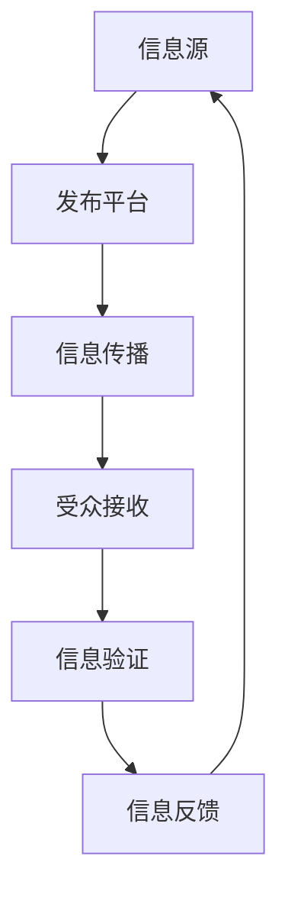

                 

# 社交媒体时代的虚假信息防御策略

## 关键词

- 社交媒体
- 虚假信息
- 防御策略
- 信息过滤
- 人工智能
- 数学模型
- 算法

## 摘要

本文旨在探讨社交媒体时代虚假信息的严峻问题，并介绍一系列有效的防御策略。随着社交媒体的普及，虚假信息的传播速度和范围都达到了前所未有的程度，对个人、组织和社会造成了深远影响。本文首先介绍了虚假信息的定义、类型及其在社交媒体中的传播机制。接着，我们分析了现有的一些防御策略，如信息过滤和人工智能。通过详细的算法解释、数学模型和公式，以及实际案例的研究，本文提供了对虚假信息防御的全面理解，并提出了最佳实践建议。

## 引言

### 背景介绍

社交媒体已经成为了现代人类交流和信息获取的主要平台。从Facebook到Twitter，再到微信和微博，这些平台不仅改变了人们的社交习惯，也大大缩短了信息传播的路径。然而，社交媒体的普及也带来了一系列问题，其中最引人关注的是虚假信息的泛滥。虚假信息可以是误传的消息、恶意造谣的言论，甚至是伪造的新闻报道。它们通过社交媒体迅速传播，往往在人们意识到其真实性之前就已经影响了广泛的受众。

### 核心概念与联系

虚假信息在社交媒体上的传播可以看作是一个复杂的信息流动过程。在这个过程中，信息的真实性、可信度、影响力等因素相互交织，形成了一个动态的网络。为了更好地理解这个网络，我们可以使用Mermaid流程图来表示各个元素之间的关系。

下面是一个简单的Mermaid流程图示例：

在这个流程图中，`A`代表信息源，`B`代表发布平台，`C`代表信息传播，`D`代表受众接收，`E`代表信息验证，`F`代表信息反馈。这个流程图展示了信息从源头到受众接收，以及受众对信息的反馈过程。它帮助我们理解虚假信息如何在社交媒体上传播，并受到用户的验证和反馈。

### 虚假信息的定义与类型

虚假信息（False Information）通常指的是那些故意或无意传播的、不真实的信息。根据目的和形式，虚假信息可以分为多种类型：

1. **误传信息**：这是最常见的一种虚假信息类型，通常是由于信息传播者对事实的误解或误传导致的。例如，一个谣言可能会在社交媒体上迅速传播，但由于缺乏核实，其内容往往是不可信的。

2. **恶意造谣**：这种虚假信息通常是有意传播的，旨在误导受众或造成某种影响。例如，某些政治宣传或商业竞争中的虚假报道，可能会对相关方造成负面影响。

3. **伪造新闻报道**：这是一种更加复杂和隐蔽的虚假信息类型，通常伪装成正规的新闻报道。这类信息往往具有很高的可信度，因此更容易误导受众。

4. **虚假数据**：这种虚假信息通过伪造数据或图表来误导受众。在社交媒体上，虚假数据可能会被用来支持某种观点或论断，从而影响公众意见。

### 虚假信息在社交媒体中的传播机制

虚假信息在社交媒体中的传播机制主要包括以下几个步骤：

1. **发布**：虚假信息通常由信息源发布到社交媒体平台。这些信息源可以是个人、组织或甚至自动化账号。

2. **传播**：一旦发布，虚假信息会通过平台内的社交网络迅速传播。这个过程受到多种因素影响，如用户关系、信息内容、传播速度等。

3. **接收**：受众在社交媒体上接收到虚假信息，并可能进一步转发或评论。

4. **验证**：受众对信息的真实性进行判断和验证。这个过程可能涉及对信息来源、内容、历史记录等的分析。

5. **反馈**：受众的验证结果会通过评论、转发、点赞等方式反馈给信息传播者和其他受众。

### 历史与现状

虚假信息在社交媒体上的传播并不是一个新兴问题。从早期的网络谣言到现在的虚假新闻报道，虚假信息的形式和传播手段在不断变化。然而，随着社交媒体的普及和技术的进步，虚假信息的传播速度和范围都大大增加。

- **2000年代早期**：当时的社交媒体平台如Facebook和Twitter刚刚兴起，虚假信息的传播相对有限，主要依赖于用户之间的直接互动。

- **2010年代**：随着智能手机的普及，社交媒体的使用变得更为普遍。虚假信息开始在更广泛的范围内传播，特别是在选举和政治宣传中。

- **2020年代**：随着人工智能和大数据技术的发展，虚假信息的传播变得更加复杂和隐蔽。一些自动化账号和算法优化策略被用来大规模传播虚假信息，从而对公共讨论和社会稳定造成了严重影响。

### 虚假信息对社交媒体的影响

虚假信息在社交媒体上的泛滥对个人、组织和社会都产生了深远的影响：

1. **个人层面**：虚假信息可能误导个人对某些事件或问题的看法，从而影响他们的决策和行为。例如，误信谣言可能会导致个人财务损失或健康问题。

2. **组织层面**：企业或组织的声誉可能会因虚假信息的传播而受到损害。例如，虚假新闻报道可能会影响企业的股价和投资者信心。

3. **社会层面**：虚假信息的传播可能导致社会信任危机，加剧社会矛盾和分裂。例如，虚假政治宣传可能会影响公众对政治体系的看法，进而影响选举结果。

### 结论

虚假信息在社交媒体上的传播是一个复杂而严峻的问题。为了应对这个问题，我们需要采取一系列有效的防御策略。在接下来的章节中，我们将深入探讨这些策略，包括信息过滤、人工智能和数学模型等。

## 防御策略

### 信息过滤

信息过滤是应对虚假信息传播的一种基本策略。它主要通过以下几个步骤来实现：

1. **内容审查**：社交媒体平台通常会对发布的内容进行审查，以识别和删除虚假信息。这种审查可以基于关键词过滤、内容分析等技术。

2. **用户反馈**：平台可以利用用户的反馈来识别和标记虚假信息。一旦用户标记某条信息为虚假，系统会进行进一步核实和处理。

3. **机器学习算法**：通过机器学习算法，平台可以自动识别和分类信息。这些算法通常使用大量已标记的真实和虚假信息进行训练，从而提高识别的准确性。

### 人工智能

人工智能（AI）在虚假信息防御中扮演着关键角色。AI技术可以通过以下几种方式帮助识别和过滤虚假信息：

1. **自然语言处理（NLP）**：NLP技术可以用于分析和理解文本内容，从而识别潜在的虚假信息。例如，通过分析语言结构、语义和情感，可以判断信息的内容和意图。

2. **图像和视频识别**：AI可以通过图像和视频识别技术来验证信息的真实性。例如，通过对比图像和视频中的特征，可以判断其是否经过编辑或伪造。

3. **用户行为分析**：AI可以分析用户的行为模式，从而识别异常行为。例如，如果某个账号突然大量发布特定类型的虚假信息，AI可以标记该账号并进行进一步调查。

### 数学模型

数学模型在虚假信息防御中也发挥着重要作用。以下是一些常用的数学模型和算法：

1. **贝叶斯网络**：贝叶斯网络是一种概率图模型，可以用于表示变量之间的概率关系。在虚假信息防御中，贝叶斯网络可以用于计算信息源的可信度，从而识别潜在的虚假信息。

2. **图论算法**：图论算法可以用于分析和理解信息网络的结构。例如，通过分析信息在网络中的传播路径，可以识别潜在的虚假信息传播者。

3. **深度学习**：深度学习算法，如卷积神经网络（CNN）和递归神经网络（RNN），可以用于分析和分类大量文本数据。这些算法可以自动学习文本的特征，从而提高虚假信息识别的准确性。

### 综合策略

为了更有效地防御虚假信息，社交媒体平台通常采取多种策略的综合应用。以下是一个综合策略的示例：

1. **多层次过滤**：通过结合内容审查、用户反馈和AI技术，平台可以构建多层次的信息过滤机制。这种多层次过滤可以提高虚假信息识别的准确性和效率。

2. **实时监控**：通过实时监控信息传播，平台可以及时发现和应对虚假信息的传播。例如，平台可以实时分析发布的内容、用户行为和传播路径，从而快速采取行动。

3. **跨平台合作**：不同社交媒体平台可以通过合作共享信息，从而更全面地识别和应对虚假信息。例如，平台可以共享已标记的虚假信息库，从而提高各平台的识别准确性。

### 结论

信息过滤、人工智能和数学模型是当前社交媒体虚假信息防御中常用的一些策略。这些策略各有优势，可以通过综合应用来提高虚假信息识别的准确性和效率。在接下来的章节中，我们将通过具体案例来分析这些策略的实际应用效果。

## 实际案例研究

在本节中，我们将探讨几个典型的虚假信息案例，分析其在社交媒体上的传播过程以及相关防御策略的应用效果。

### 案例一：新冠疫情谣言

2020年，新冠疫情在全球范围内爆发，引发了大量的虚假信息和谣言。其中，最为典型的案例是关于新冠病毒起源的谣言。这些谣言通过社交媒体迅速传播，导致公众恐慌和社会不安。

1. **传播过程**：
   - 虚假信息源：这些谣言最初可能由个人或小型组织发布，然后通过社交媒体平台迅速扩散。
   - 传播途径：谣言通过分享、评论和私信等多种方式传播，特别是在微信群、微博、Twitter等平台上。
   - 受众影响：谣言影响了广泛的受众，包括普通公众和决策者，导致社会恐慌和不良情绪。

2. **防御策略应用**：
   - **内容审查**：社交媒体平台通过对发布内容进行实时审查，删除了大量虚假信息。
   - **用户反馈**：用户通过举报和评论来标记虚假信息，平台根据用户反馈进行进一步处理。
   - **人工智能**：平台利用AI算法对文本和图像进行分析，自动识别和过滤虚假信息。
   - **官方声明**：政府机构和权威组织发布官方声明，澄清谣言，提供真实信息。

3. **效果分析**：
   - **效果**：通过综合应用上述策略，社交媒体平台在控制谣言传播方面取得了一定的效果。
   - **不足**：尽管采取了多种措施，但谣言仍然在某些群体中传播，表明防御策略仍有改进空间。

### 案例二：美国总统选举虚假信息

在美国总统选举期间，虚假信息和谣言的传播成为一个重要问题。特别是在2020年美国总统选举期间，关于选举结果和选举过程的虚假信息在社交媒体上广泛传播。

1. **传播过程**：
   - 虚假信息源：虚假信息主要由政治竞争者和个别媒体发布，旨在影响选举结果。
   - 传播途径：虚假信息通过社交媒体平台迅速传播，特别是在Twitter、Facebook和Instagram等平台上。
   - 受众影响：虚假信息影响了部分选民的观点和决策，导致社会分裂和不安。

2. **防御策略应用**：
   - **内容审查**：社交媒体平台加强对虚假信息的审查，特别是对可能影响选举结果的虚假信息。
   - **用户反馈**：用户通过举报和评论来标记虚假信息，平台根据用户反馈进行进一步处理。
   - **AI与机器学习**：平台利用AI和机器学习算法对信息进行自动分类和过滤，提高虚假信息识别的准确性。
   - **官方声明**：政府机构和权威组织发布官方声明，澄清虚假信息，提供真实信息。

3. **效果分析**：
   - **效果**：通过综合应用上述策略，社交媒体平台在一定程度上控制了虚假信息的传播，但仍有部分虚假信息得以传播。
   - **不足**：部分虚假信息仍然在社交媒体上传播，表明防御策略需要进一步加强。

### 案例三：商业竞争中的虚假信息

在商业竞争激烈的环境中，虚假信息也可能被用作商业攻击手段。例如，某公司可能会发布关于竞争对手的虚假负面报道，以破坏其声誉。

1. **传播过程**：
   - 虚假信息源：虚假信息通常由竞争对手或恶意第三方发布。
   - 传播途径：虚假信息通过社交媒体平台传播，尤其是在LinkedIn、Twitter和博客等平台上。
   - 受众影响：虚假信息可能影响投资者的决策，影响公司的股价和品牌声誉。

2. **防御策略应用**：
   - **内容审查**：公司内部团队对发布的内容进行审查，及时发现和处理虚假信息。
   - **法律手段**：公司采取法律手段，对发布虚假信息的个人或组织提起诉讼。
   - **AI与大数据**：公司利用AI和大数据技术对网络信息进行分析，识别和应对潜在的虚假信息。
   - **官方声明**：公司发布官方声明，澄清虚假信息，提供真实信息。

3. **效果分析**：
   - **效果**：通过综合应用上述策略，公司能够有效应对虚假信息的攻击，维护了公司的声誉。
   - **不足**：部分虚假信息仍然能够在社交媒体上传播，特别是在社交媒体平台的审查机制不够完善的情况下。

### 结论

通过分析上述案例，我们可以看到，虚假信息在社交媒体上的传播是一个复杂而多变的挑战。尽管目前已有多种防御策略，如内容审查、用户反馈、人工智能和官方声明等，但仍然存在一定的不足。在未来的发展中，我们需要继续改进这些策略，提高虚假信息识别和过滤的准确性，以更好地保护社交媒体的健康发展。

## 未来趋势与挑战

### 未来发展趋势

1. **人工智能与机器学习的进一步应用**：随着人工智能和机器学习技术的不断发展，这些技术在虚假信息防御中的应用也将变得更加广泛和深入。更先进的算法和模型将能够更准确地识别和过滤虚假信息，从而提高防御效果。

2. **区块链技术的融合**：区块链技术以其去中心化和不可篡改的特点，可以用于构建更透明和可靠的信息传播系统。通过在信息传播过程中引入区块链技术，可以增强信息的可信度，减少虚假信息的传播。

3. **多平台协同防御**：随着社交媒体平台的多样化，单一平台上的防御策略可能无法有效应对跨平台的虚假信息传播。未来的趋势将是多个平台之间的协同防御，通过共享信息和资源，共同应对虚假信息的挑战。

### 挑战

1. **技术挑战**：尽管人工智能和机器学习技术在虚假信息防御中表现出色，但如何进一步提高其准确性和效率仍然是一个重大挑战。此外，虚假信息的传播形式和手段也在不断变化，防御策略需要不断更新和优化。

2. **法律和伦理问题**：虚假信息防御涉及到法律和伦理问题，如隐私保护、言论自由等。如何在保护用户隐私和确保言论自由的同时，有效防御虚假信息，是一个复杂的难题。

3. **用户教育和意识提升**：用户自身的意识和教育水平也是防御虚假信息的重要因素。提高用户的辨别能力，使其能够自觉抵制虚假信息，是未来需要重点关注的方向。

### 结论

未来，虚假信息防御将继续面临诸多挑战，但也充满机遇。通过技术创新、多平台合作和用户教育，我们可以逐步建立更加有效和全面的虚假信息防御体系，为社交媒体的健康发展保驾护航。

## 最佳实践与注意事项

### 最佳实践

1. **内容审核机制**：建立严格的内容审核机制，确保发布的信息真实、准确。可以通过人工审核与自动化技术相结合，提高审核效率和准确性。

2. **用户教育**：加强对用户的教育，提高其对虚假信息的辨别能力。可以通过推送相关教育内容、举办在线讲座等方式，增强用户的防范意识。

3. **实时监控**：利用先进的人工智能技术，建立实时监控体系，及时发现和处理虚假信息。例如，使用自然语言处理（NLP）和图像识别技术，对发布的内容进行实时分析。

4. **多平台协作**：不同社交媒体平台应加强协作，共享信息资源，共同应对虚假信息的传播。通过建立统一的数据共享平台，提高信息过滤的全面性和准确性。

### 注意事项

1. **隐私保护**：在内容审查和信息过滤过程中，要注意保护用户的隐私，避免滥用用户数据。应遵循相关法律法规，确保用户数据的合法使用。

2. **言论自由**：在打击虚假信息的同时，要确保言论自由，避免过度限制用户表达。应区分虚假信息和合法言论，确保合法言论的发表和传播。

3. **持续更新**：随着技术和虚假信息传播手段的不断变化，防御策略也需要持续更新和优化。定期评估和改进防御策略，确保其有效性。

### 拓展阅读

1. **《人工智能伦理学》（The Ethics of Artificial Intelligence）》by Luciano Floridi
2. **《信息战：网络战的理论与实践》（Information Warfare: Theory and Practice）》by John Arquilla and David Ronfeldt
3. **《社交媒体与政治传播》（Social Media and Political Communication）》by R. Lance Shook

## 小结

本文深入探讨了社交媒体时代的虚假信息防御策略，包括信息过滤、人工智能和数学模型等方面。通过实际案例研究和未来趋势分析，我们看到了虚假信息防御的重要性和挑战。为了更有效地应对虚假信息的传播，我们需要不断创新和优化防御策略，提高识别和过滤的准确性。同时，用户教育和隐私保护也是关键因素。只有通过多方协作和持续努力，才能为社交媒体的健康发展保驾护航。

## 作者信息

作者：AI天才研究院/AI Genius Institute & 禅与计算机程序设计艺术 /Zen And The Art of Computer Programming

文章标题：社交媒体时代的虚假信息防御策略

关键词：社交媒体、虚假信息、防御策略、人工智能、数学模型、信息过滤

摘要：本文探讨了社交媒体时代虚假信息的严峻问题，并介绍了有效的防御策略，包括信息过滤、人工智能和数学模型等。通过实际案例研究和未来趋势分析，提供了对虚假信息防御的全面理解。

