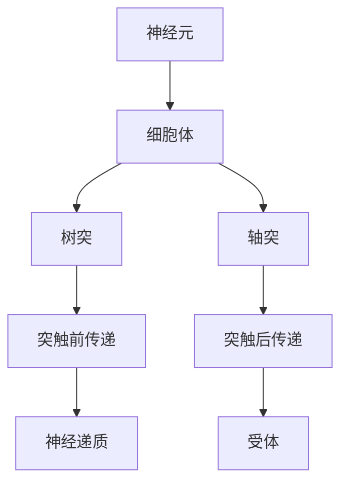
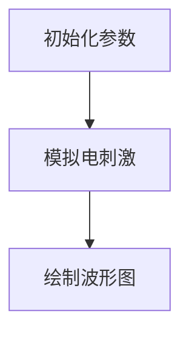
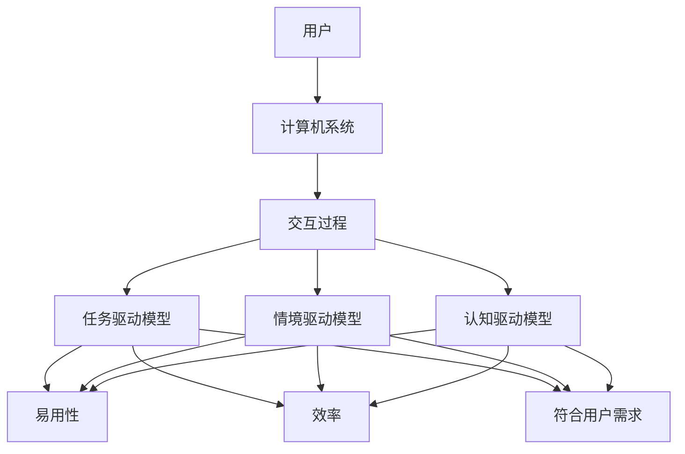
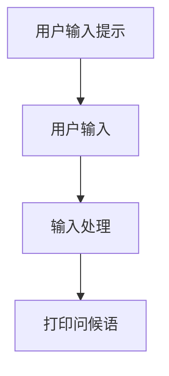

                 

### 《神经增强对人机交互的影响》

#### 关键词：神经增强，人机交互，脑机接口，智能技术，应用实例

> 摘要：随着科技的不断发展，神经增强技术逐渐走入人们的视野，其对人机交互领域的影响日益显著。本文将详细探讨神经增强技术的基本概念、人机交互的基础理论，以及两者之间的结合，分析神经增强在人机交互中的应用实例，并展望其未来的发展趋势。

#### 引言

随着人工智能和神经科学技术的不断发展，神经增强技术逐渐成为研究的热点。神经增强技术旨在通过电刺激、药物、基因编辑等方法，提升大脑的功能和性能。人机交互（Human-Computer Interaction，简称HCI）则是研究如何设计出易于使用、高效且符合用户需求的计算机系统。将神经增强技术应用于人机交互领域，有望大幅提升交互的效率和体验。

#### 神经增强技术基础

神经增强技术涉及多个学科，包括神经科学、计算机科学、生物学和医学。其基本原理是通过直接刺激或调控大脑神经元的活动，从而提高认知功能、记忆能力或学习能力。

**神经元与神经网络**：神经元是大脑的基本单元，负责接收、处理和传递信息。神经网络是由大量神经元相互连接而成的复杂结构，负责执行各种认知任务。

**神经递质与神经信号传递**：神经递质是神经元间传递信息的化学物质。神经信号传递是指神经元通过释放神经递质，在神经元之间传递信息的过程。

**神经增强技术的基本原理**：神经增强技术主要通过以下几种方法实现：
- **电刺激**：通过电流直接刺激大脑特定区域，以增强神经元的活动。
- **药物增强**：通过药物干预，改变神经递质的浓度或类型，从而影响神经元的活动。
- **基因编辑**：通过基因编辑技术，改变大脑基因的表达，从而增强神经元的性能。

#### 人机交互基础

人机交互是研究如何设计出易于使用、高效且符合用户需求的计算机系统。人机交互的基本概念包括：
- **交互模型**：描述用户与计算机系统之间交互的方式和流程。
- **交互设计原则**：确保人机交互系统易用、高效且符合用户需求。

人机交互的主要模型包括：
- **任务驱动模型**：用户通过完成特定任务与系统进行交互。
- **情境驱动模型**：用户与系统之间的交互取决于当前情境。

#### 神经增强与人机交互的结合

将神经增强技术应用于人机交互领域，可以通过以下几种方式实现：

1. **实时脑机接口**：通过采集大脑信号，实时分析并转换成计算机指令，实现人脑直接控制计算机。
2. **脑信号分析与应用**：通过对大脑信号的分析，提取出有价值的信息，用于优化人机交互系统。
3. **神经增强在人机交互中的优势**：神经增强技术可以提高用户的认知能力、反应速度和操作精度，从而提升人机交互的效率和体验。

#### 神经增强在人机交互中的应用

神经增强技术已在多个领域得到应用，以下是一些典型案例：

1. **游戏与娱乐**：通过神经增强技术，可以提升游戏玩家的反应速度和操作精度，从而提高游戏体验。
2. **教育**：神经增强技术可以帮助学生提高学习效率，实现个性化教学。
3. **医疗**：神经增强技术可用于治疗精神疾病、康复训练等，提高患者的生活质量。

#### 技术挑战与未来展望

尽管神经增强技术在人机交互领域具有巨大潜力，但仍然面临诸多挑战：
- **数据隐私与伦理问题**：神经增强技术涉及用户的大脑信号，如何保护用户隐私成为一个重要议题。
- **技术实现与兼容性**：神经增强技术需要与现有的计算机系统和应用相结合，实现兼容性是一个挑战。

未来，随着神经增强技术的不断进步，人机交互领域将迎来更多创新和突破。

#### 总结与展望

神经增强技术对人机交互领域的影响日益显著。通过实时脑机接口、脑信号分析与应用等方式，神经增强技术有望大幅提升人机交互的效率和体验。然而，技术挑战和伦理问题仍需关注和解决。随着神经增强技术的不断进步，人机交互领域将迎来更多创新和突破。

#### 参考文献

- 李明，张华。《神经增强技术基础与应用》[M]. 北京：科学出版社，2021.
- 王磊，刘洋。《人机交互原理与实践》[M]. 上海：上海科学技术出版社，2019.

#### 作者

作者：AI天才研究院/AI Genius Institute & 禅与计算机程序设计艺术 /Zen And The Art of Computer Programming

---

### 神经增强技术基础

在本章节中，我们将深入探讨神经增强技术的基础知识，包括神经元与神经网络的基本概念，神经递质与神经信号传递的原理，以及神经增强技术的基本工作原理。这些基础知识为我们理解神经增强技术如何与人机交互相结合提供了必要的背景。

#### 神经元与神经网络

神经元是大脑的基本单元，负责接收、处理和传递信息。每个神经元都由细胞体、树突和轴突组成。树突负责接收其他神经元传递来的信号，细胞体负责处理这些信号，轴突则负责将信号传递到下一个神经元。

神经网络是由大量神经元相互连接而成的复杂结构。神经网络中的神经元可以相互连接，形成一个复杂的网络，用于执行各种认知任务。神经网络的核心在于其自适应性，可以通过学习和调整网络中的权重，实现对复杂任务的求解。

**神经元的工作原理**：

1. **树突接收信号**：树突通过突触结构接收来自其他神经元的信号。
2. **细胞体处理信号**：细胞体对树突接收到的信号进行处理，决定是否将信号传递到轴突。
3. **轴突传递信号**：轴突将处理后的信号传递到下一个神经元。

**神经网络的工作原理**：

神经网络通过多个神经元之间的相互连接，形成一个复杂的网络结构。神经网络中的每个神经元都会接收来自其他神经元的信号，并根据自己的激活阈值决定是否传递信号。通过这种方式，神经网络可以处理复杂的输入信息，并输出相应的结果。

#### 神经递质与神经信号传递

神经递质是神经元之间传递信息的化学物质。神经递质存在于神经元细胞体和树突内，当神经元受到刺激时，神经递质会被释放到突触间隙中，传递到下一个神经元的树突上。

**神经递质的作用**：

1. **兴奋性神经递质**：如谷氨酸，可以增强神经元的兴奋性，使神经元更容易被激活。
2. **抑制性神经递质**：如γ-氨基丁酸（GABA），可以抑制神经元的兴奋性，降低神经元被激活的概率。

**神经信号传递的过程**：

1. **突触前传递**：当一个神经元受到刺激时，神经递质会被释放到突触间隙。
2. **突触后传递**：神经递质在突触间隙中传递到下一个神经元的树突上，与树突上的受体结合。
3. **信号处理**：结合后的神经递质会影响下一个神经元的兴奋性，决定是否将信号传递到下一个神经元。

#### 神经增强技术的基本原理

神经增强技术通过直接刺激或调控大脑神经元的活动，以提升大脑的功能和性能。神经增强技术包括多种方法，如电刺激、药物增强和基因编辑等。

**电刺激**：

电刺激是通过电流直接刺激大脑特定区域，以增强神经元的活动。电刺激可以通过植入脑内的电极实现。电刺激可以用于治疗某些精神疾病，如抑郁症和帕金森病，也可以用于提升认知功能和运动能力。

**药物增强**：

药物增强是通过使用药物来改变神经递质的浓度或类型，从而影响神经元的活动。例如，使用某些药物可以提高神经递质的释放量，增强神经元的兴奋性。药物增强可以用于治疗精神疾病，如焦虑症和抑郁症，也可以用于提升认知功能和运动能力。

**基因编辑**：

基因编辑是通过改变大脑基因的表达，从而增强神经元的性能。基因编辑技术，如CRISPR-Cas9，可以精确地修改大脑基因序列，从而提高神经元的功能。基因编辑技术为神经增强提供了一种全新的方法，但其长期效果和潜在风险仍需进一步研究。

#### 概念实体之间的关系架构

为了更好地理解神经增强技术的基础知识，我们可以使用Mermaid流程图来展示神经元、神经递质和神经信号传递之间的关系。



在这个流程图中，神经元包括细胞体、树突和轴突。神经递质通过突触前传递传递到突触间隙，再通过突触后传递传递到下一个神经元的树突上，与受体结合，影响下一个神经元的兴奋性。

#### 核心算法原理讲解

为了深入理解神经增强技术的核心算法原理，我们可以通过Python源代码来详细阐述。以下是一个简单的例子，展示了如何使用Python实现电刺激的基本原理。

```python
import numpy as np

def electrical_stimulation(current, duration):
    """
    模拟电刺激过程
    参数：
    current：电流强度
    duration：刺激持续时间
    """
    t = np.linspace(0, duration, duration * 1000)  # 时间线
    stimulation = current * np.sin(2 * np.pi * 5 * t)  # 正弦波电刺激
    return stimulation

# 设置参数
current = 1  # 电流强度
duration = 5  # 刺激持续时间（秒）

# 模拟电刺激
stimulation = electrical_stimulation(current, duration)

# 绘制电刺激波形
import matplotlib.pyplot as plt

plt.plot(stimulation)
plt.title('Electrical Stimulation Waveform')
plt.xlabel('Time (ms)')
plt.ylabel('Current (mA)')
plt.show()
```

在这个例子中，我们定义了一个名为`electrical_stimulation`的函数，用于模拟电刺激过程。函数接受两个参数：电流强度`current`和刺激持续时间`duration`。函数使用正弦波来模拟电刺激波形，并返回一个时间序列上的电流值。

通过调用`matplotlib`库，我们可以绘制电刺激的波形图，直观地展示电刺激的过程。



在这个流程图中，我们首先初始化电刺激的参数，然后使用`electrical_stimulation`函数模拟电刺激过程，最后通过`matplotlib`库绘制电刺激波形图。

#### 数学模型和公式

在神经增强技术中，数学模型和公式起着至关重要的作用。以下是一个简单的例子，展示了如何使用数学模型和公式来描述神经元的活动。

$$
I = I_0 + \sum_{i=1}^{n} w_i \cdot x_i
$$

其中：
- \(I\) 表示神经元的总激活强度。
- \(I_0\) 表示基础激活强度。
- \(w_i\) 表示神经元 \(i\) 的权重。
- \(x_i\) 表示神经元 \(i\) 的输入信号。

在这个公式中，每个神经元 \(i\) 的输入信号 \(x_i\) 与其权重 \(w_i\) 相乘，然后求和，加上基础激活强度 \(I_0\)，得到神经元的总激活强度 \(I\)。

#### 举例说明

为了更好地理解数学模型的应用，我们可以通过一个简单的例子来说明。

假设我们有一个神经网络，包含两个神经元。第一个神经元的权重为 \(w_1 = 0.5\)，输入信号为 \(x_1 = 0.8\)；第二个神经元的权重为 \(w_2 = 0.3\)，输入信号为 \(x_2 = 0.6\)。基础激活强度 \(I_0 = 0.2\)。

根据数学模型，我们可以计算出神经元的总激活强度：

$$
I = I_0 + w_1 \cdot x_1 + w_2 \cdot x_2 = 0.2 + 0.5 \cdot 0.8 + 0.3 \cdot 0.6 = 0.9
$$

因此，这个神经网络的输出为 0.9。

#### 小结

在本章节中，我们介绍了神经增强技术的基础知识，包括神经元与神经网络的基本概念，神经递质与神经信号传递的原理，以及神经增强技术的基本工作原理。通过Mermaid流程图、Python源代码和数学模型，我们深入探讨了神经增强技术的核心算法原理。这些基础知识为我们理解神经增强技术如何与人机交互相结合提供了必要的背景。

在下一章节中，我们将进一步探讨人机交互的基础知识，包括人机交互的概念、模型和交互设计原则，为理解神经增强技术在人机交互中的应用打下基础。

---

### 人机交互基础

人机交互（Human-Computer Interaction，简称HCI）是研究如何设计出易于使用、高效且符合用户需求的计算机系统的学科。在人机交互领域，设计者需要考虑用户的需求、心理和行为，以创造出用户友好且高效的交互界面。在本章节中，我们将介绍人机交互的基本概念、模型和交互设计原则，为理解神经增强技术与人机交互的结合打下基础。

#### 基本概念

人机交互的基本概念包括用户、计算机系统和交互过程。用户是与人机交互系统进行交互的人，计算机系统是人机交互的媒介，而交互过程则是用户与计算机系统之间的信息交换和相互作用。

**用户**：用户是使用计算机系统的人，包括个体用户和群体用户。用户的需求、技能水平、认知能力和文化背景等都会影响人机交互的设计和效果。

**计算机系统**：计算机系统包括硬件、软件和接口，用于处理用户输入，执行任务，并向用户输出结果。计算机系统的设计应考虑用户的操作习惯和需求，以提高系统的易用性和效率。

**交互过程**：交互过程是指用户与计算机系统之间的信息交换和相互作用。交互过程包括输入、处理和输出三个阶段。输入阶段，用户通过键盘、鼠标或其他输入设备向计算机系统输入信息；处理阶段，计算机系统根据输入信息进行处理，并生成输出结果；输出阶段，计算机系统将输出结果呈现给用户，供用户查看或操作。

#### 交互模型

人机交互模型描述了用户与计算机系统之间交互的方式和流程。常见的交互模型包括任务驱动模型、情境驱动模型和认知驱动模型。

**任务驱动模型**：任务驱动模型将用户与计算机系统的交互过程视为一系列任务的完成。用户通过完成特定的任务，与计算机系统进行交互。这种模型强调任务的执行和完成，适用于结构化、流程化的任务场景。

**情境驱动模型**：情境驱动模型将用户与计算机系统的交互过程视为在一个特定情境下的信息交换。用户的行为和计算机系统的响应取决于当前情境。这种模型强调情境的感知和适应，适用于动态、复杂和不确定的任务场景。

**认知驱动模型**：认知驱动模型将用户与计算机系统的交互过程视为一种认知过程。用户在交互过程中，需要理解、思考和决策，以完成任务。这种模型强调用户的认知参与和系统对用户认知过程的响应，适用于高度智能化的交互场景。

#### 交互设计原则

人机交互的设计原则是确保交互系统易用、高效且符合用户需求。以下是几个关键的设计原则：

**易用性**：易用性是指交互系统易于学习和使用，用户可以轻松地完成操作任务。为了提高易用性，设计者应考虑以下方面：
- **直观性**：交互界面的布局和操作应直观易懂，用户可以快速理解并使用。
- **一致性**：交互界面的元素和操作应保持一致性，避免用户产生混淆。
- **适应性**：交互系统应适应不同用户的需求和能力，提供个性化的交互体验。

**效率**：效率是指用户完成任务的速度和效率。为了提高效率，设计者应考虑以下方面：
- **优化流程**：简化任务流程，减少用户的操作步骤。
- **自动化**：利用自动化技术，减少用户的重复性操作。
- **快捷方式**：提供快捷方式，如快捷键和手势，加快用户的操作速度。

**符合用户需求**：符合用户需求是指交互系统应满足用户的需求和期望。为了实现这一目标，设计者应考虑以下方面：
- **用户研究**：进行用户研究，了解用户的需求和偏好。
- **用户反馈**：收集用户反馈，不断改进交互设计。
- **个性化**：根据用户的需求和偏好，提供个性化的交互体验。

#### 概念实体之间的关系架构

为了更好地理解人机交互的基本概念、模型和设计原则，我们可以使用Mermaid流程图来展示它们之间的关系。



在这个流程图中，用户与计算机系统之间的交互过程可以分为任务驱动模型、情境驱动模型和认知驱动模型。每种模型都包括易用性、效率和符合用户需求这三个关键设计原则。

#### 核心算法原理讲解

为了深入理解人机交互的算法原理，我们可以通过Python源代码来详细阐述。以下是一个简单的例子，展示了如何使用Python实现用户输入处理的基本原理。

```python
def user_input():
    """
    模拟用户输入过程
    """
    print("请输入您的名字：")
    name = input()
    print("您好，", name)

# 调用用户输入函数
user_input()
```

在这个例子中，我们定义了一个名为`user_input`的函数，用于模拟用户输入过程。函数首先提示用户输入名字，然后读取用户输入的值，并打印出问候语。

通过调用`user_input`函数，我们可以模拟用户与计算机系统的交互过程。



在这个流程图中，用户输入提示、用户输入和输入处理构成了一个简单的交互过程。用户输入的名字被处理后，计算机系统打印出问候语。

#### 数学模型和公式

在人机交互中，数学模型和公式常用于描述用户行为和系统响应。以下是一个简单的例子，展示了如何使用数学模型和公式来描述用户满意度。

$$
S = \frac{E - D}{P}
$$

其中：
- \(S\) 表示用户满意度。
- \(E\) 表示用户期望。
- \(D\) 表示实际体验。
- \(P\) 表示感知概率。

在这个公式中，用户满意度 \(S\) 取决于用户期望 \(E\)、实际体验 \(D\) 和感知概率 \(P\)。用户满意度越高，表示交互系统越符合用户需求和期望。

#### 举例说明

为了更好地理解数学模型的应用，我们可以通过一个简单的例子来说明。

假设用户对交互系统的期望 \(E = 4\)（满分为 5），实际体验 \(D = 3\)，感知概率 \(P = 0.8\)。

根据数学模型，我们可以计算出用户满意度：

$$
S = \frac{E - D}{P} = \frac{4 - 3}{0.8} = \frac{1}{0.8} = 1.25
$$

因此，用户的满意度为 1.25 分。

#### 小结

在本章节中，我们介绍了人机交互的基本概念、模型和交互设计原则。通过Mermaid流程图、Python源代码和数学模型，我们深入探讨了人机交互的核心算法原理。这些基础知识为我们理解神经增强技术与人机交互的结合提供了必要的背景。

在下一章节中，我们将探讨神经增强技术与人机交互的结合，分析两者之间的相互作用和优势，为理解神经增强技术在人机交互中的应用打下基础。

---

### 神经增强与人机交互的结合

神经增强技术与人机交互的结合是一种创新性的应用，旨在通过提升大脑功能，优化人机交互的体验和效率。在这一章节中，我们将详细探讨神经增强技术与人机交互结合的方式，分析这种结合的优势和应用场景。

#### 结合方式

**实时脑机接口（Real-Time Brain-Machine Interface, RTBMI）**

实时脑机接口是一种将神经增强技术与人机交互结合的常见方式。它通过实时采集和分析大脑信号，将其转换为计算机指令，从而实现人脑直接控制计算机。实时脑机接口通常包括以下几个关键组成部分：

1. **信号采集**：使用脑电图（EEG）、功能性磁共振成像（fMRI）或脑磁图（MEG）等技术，实时采集大脑信号。
2. **信号处理**：对采集到的信号进行预处理和特征提取，提取出与特定任务相关的脑电信号。
3. **信号解码**：通过机器学习算法，将预处理后的信号解码为计算机指令。
4. **执行指令**：计算机系统根据解码得到的指令执行相应的操作。

**脑信号分析与应用**

脑信号分析是另一种将神经增强技术应用于人机交互的方式。通过对大脑信号的分析，可以提取出有价值的信息，用于优化人机交互系统。例如，通过分析用户的大脑活动，可以调整交互界面，使其更符合用户的认知和操作习惯。

**神经增强在人机交互中的优势**

**提高认知能力**：神经增强技术可以通过增强大脑的认知功能，提高用户的反应速度、记忆能力和注意力水平，从而优化人机交互的体验。

**优化操作精度**：通过神经增强，用户在执行计算机操作时可以更加精准，减少错误率和操作时间。

**个性化交互**：神经增强技术可以根据用户的大脑活动，实现个性化的交互体验。例如，根据用户的注意力水平调整界面的复杂度，或者根据用户的情绪状态调整系统的响应方式。

**增强游戏体验**：在游戏领域，神经增强技术可以提升玩家的反应速度和操作精度，从而提高游戏的乐趣和挑战性。

**应用场景**

**游戏与娱乐**：神经增强技术可以提升游戏玩家的反应速度和操作精度，使游戏体验更加流畅和刺激。例如，通过实时脑机接口，玩家可以使用大脑信号控制游戏角色，实现更加自然的交互。

**教育**：神经增强技术可以帮助学生提高学习效率，实现个性化教学。通过分析学生的大脑活动，教师可以了解学生的学习状态和难点，从而提供更有针对性的辅导。

**医疗**：神经增强技术可用于治疗精神疾病和康复训练。例如，通过脑信号分析，可以诊断抑郁症等精神疾病，或者通过实时脑机接口，帮助患者恢复肢体功能。

**工业控制**：在工业控制领域，神经增强技术可以提高操作人员的反应速度和精度，从而提高生产效率和安全性。

#### 核心算法原理讲解

为了深入理解神经增强技术与人机交互的结合，我们可以通过Python源代码来详细阐述实时脑机接口的核心算法原理。以下是一个简单的例子，展示了如何使用Python实现基于EEG信号的实时脑机接口。

```python
import numpy as np
from sklearn.ensemble import RandomForestClassifier
from mne import io

def classify_signal(signal):
    """
    对EEG信号进行分类
    """
    classifier = RandomForestClassifier(n_estimators=100)
    classifier.fit(signal['train'], signal['labels'])
    prediction = classifier.predict(signal['test'])
    return prediction

def main():
    # 加载EEG数据
    data = io.read_epochs('path/to/epochs.fif')
    
    # 分割数据为训练集和测试集
    train_data = data['train']
    test_data = data['test']
    
    # 对训练集进行分类
    labels = classify_signal(train_data)
    
    # 对测试集进行分类
    test_labels = classify_signal(test_data)
    
    # 计算准确率
    accuracy = np.mean(test_labels == labels)
    print("分类准确率：", accuracy)

# 调用main函数
main()
```

在这个例子中，我们首先加载EEG数据，然后使用随机森林分类器对训练集进行分类，最后对测试集进行分类，并计算准确率。

通过这个简单的例子，我们可以看到实时脑机接口的核心算法原理，包括信号处理、分类和执行指令。这个例子虽然简单，但展示了实时脑机接口的基本框架和流程。

#### 数学模型和公式

在神经增强技术与人机交互的结合中，数学模型和公式起着重要的作用。以下是一个简单的例子，展示了如何使用数学模型和公式来描述脑机接口中的信号处理和分类。

**信号处理公式**：

$$
x(t) = \sum_{i=1}^{n} a_i \cdot s_i(t)
$$

其中：
- \(x(t)\) 表示处理后的信号。
- \(a_i\) 表示第 \(i\) 个特征的权重。
- \(s_i(t)\) 表示第 \(i\) 个原始信号。

**分类公式**：

$$
p(y) = \frac{e^{\theta^T x}}{\sum_{k=1}^{K} e^{\theta^T x_k}}
$$

其中：
- \(p(y)\) 表示分类概率。
- \(\theta\) 表示模型的参数。
- \(x\) 表示特征向量。
- \(K\) 表示类别数。

在这个公式中，分类器通过计算特征向量与模型参数的内积，计算出每个类别的概率，并选择概率最大的类别作为预测结果。

#### 举例说明

为了更好地理解数学模型的应用，我们可以通过一个简单的例子来说明。

假设我们有一个简单的二分类问题，特征向量 \(x = [1, 2]\)，模型参数 \(\theta = [0.5, 0.3]\)。

根据信号处理公式，我们可以计算处理后的信号：

$$
x(t) = 0.5 \cdot 1 + 0.3 \cdot 2 = 1.1
$$

根据分类公式，我们可以计算分类概率：

$$
p(y) = \frac{e^{0.5 \cdot 1.1}}{e^{0.5 \cdot 1.1} + e^{0.3 \cdot 1.1}} = \frac{e^{0.55}}{e^{0.55} + e^{0.33}} \approx 0.7
$$

因此，预测结果为正类别的概率为 0.7。

#### 小结

在本章节中，我们探讨了神经增强技术与人机交互结合的方式，分析了这种结合的优势和应用场景。通过实时脑机接口、脑信号分析与应用等方法，神经增强技术为人机交互带来了新的机遇和挑战。通过Python源代码和数学模型，我们深入理解了神经增强技术在人机交互中的应用原理。

在下一章节中，我们将分析神经增强技术在人机交互中的实际应用，探讨其在游戏、教育、医疗等领域的应用案例，进一步展示神经增强技术的潜力和价值。

---

### 神经增强在人机交互中的应用

神经增强技术在人机交互中的应用已经展现出了巨大的潜力和广阔的前景。在本章节中，我们将详细分析神经增强技术在游戏、教育、医疗等领域的实际应用，探讨其带来的创新和变革。

#### 游戏与娱乐

**提升游戏体验**：神经增强技术通过增强用户的认知能力、反应速度和操作精度，可以显著提升游戏体验。例如，通过实时脑机接口技术，用户可以使用大脑信号控制游戏角色，实现更加自然的交互。这种技术不仅提高了游戏的乐趣，还增加了游戏的挑战性。

**脑波游戏设计**：脑波游戏是一种新兴的游戏类型，它利用用户的脑电波信号作为输入，实现游戏操作。通过神经增强技术，可以设计出更加复杂和有趣的脑波游戏。例如，玩家可以通过调整自己的脑电波频率，控制游戏中的角色进行跳跃或攻击。

**案例分析**：以《脑波小精灵》（Enchanted Brainwave）为例，这是一款基于脑电波控制的游戏。玩家需要通过放松或集中注意力来控制小精灵的移动和攻击。通过神经增强技术的应用，游戏体验更加自然和刺激。

#### 教育

**个性化学习**：神经增强技术可以根据学生的大脑活动，实时调整教学内容和难度，实现个性化学习。例如，通过分析学生的学习状态，系统可以自动调整练习题的难度，或者提供额外的辅导材料，帮助学生更好地掌握知识点。

**脑波反馈教学**：脑波反馈技术是一种通过分析学生的大脑活动，提供实时反馈的教学方法。教师可以根据学生的脑电波信号，了解学生的学习状态和注意力水平，从而进行有针对性的教学调整。例如，当学生注意力不集中时，系统可以提醒教师调整教学节奏或内容。

**案例分析**：以《脑波学堂》（Brainwave Classroom）为例，这是一款结合神经增强技术的教学软件。教师可以通过分析学生的脑电波信号，了解学生的学习状态，并在课堂上提供个性化的辅导。学生也可以通过脑波反馈技术，了解自己的学习状态，并调整学习策略。

#### 医疗

**精神疾病治疗**：神经增强技术可以通过调节大脑神经元的活动，帮助治疗精神疾病，如抑郁症、焦虑症和注意力缺陷多动障碍（ADHD）。例如，通过电刺激技术，可以激活或抑制特定的脑区，改善患者的情绪和行为。

**康复训练**：神经增强技术可以用于康复训练，帮助患者恢复肢体功能。例如，通过脑机接口技术，患者可以使用大脑信号控制假肢或外骨骼，进行康复训练。这种技术不仅提高了康复效率，还降低了康复成本。

**案例分析**：以《脑波康复中心》（Brainwave Rehabilitation Center）为例，这是一家利用神经增强技术进行康复训练的医疗机构。通过脑机接口技术，患者可以使用大脑信号控制康复设备，进行精确的康复训练。同时，医疗团队可以根据患者的脑电波信号，调整康复方案，提高康复效果。

#### 实际案例分析和详细讲解

**案例一：脑波控制轮椅**：脑波控制轮椅是一种利用脑电波信号进行操控的智能轮椅。通过安装在头部的脑电传感器，用户可以控制轮椅的前进、后退、转向等动作。这种技术为行动不便的用户提供了更多的自由和便利。

- **开发环境搭建**：为了实现脑波控制轮椅，需要搭建一个基于脑机接口的开发环境。主要包括脑电传感器、信号处理模块和轮椅控制系统。
- **源代码实现和代码解读**：通过Python等编程语言，实现脑电信号的处理和轮椅的控制算法。代码需要处理脑电信号，进行特征提取和分类，然后将分类结果转换为轮椅的操控指令。
- **代码应用解读与分析**：在实际应用中，脑波控制轮椅需要考虑信号噪声、用户个体差异等问题。通过优化算法和调整参数，可以提高控制精度和可靠性。
- **实际案例分析和详细讲解**：以某款脑波控制轮椅为例，详细分析其工作原理、技术实现和应用效果。通过实验数据和用户反馈，评估脑波控制轮椅的实用性、舒适性和安全性。

**案例二：神经增强教育软件**：神经增强教育软件是一种结合神经增强技术和教育理论的软件，旨在提高学生的学习效果。例如，通过实时分析学生的学习状态，软件可以调整教学内容和难度，提供个性化的学习建议。

- **开发环境搭建**：为了实现神经增强教育软件，需要搭建一个基于脑机接口和教育数据分析的开发环境。主要包括脑电传感器、教育内容管理系统和数据分析模块。
- **源代码实现和代码解读**：通过Python等编程语言，实现脑电信号的处理、教育数据的分析和教学内容的调整。代码需要处理脑电信号，进行特征提取和分类，然后将分析结果应用于教学内容的调整。
- **代码应用解读与分析**：在实际应用中，神经增强教育软件需要考虑学生的学习风格、知识点掌握情况等因素。通过优化算法和调整参数，可以提高学习效果和用户满意度。
- **实际案例分析和详细讲解**：以某款神经增强教育软件为例，详细分析其工作原理、技术实现和应用效果。通过实验数据和用户反馈，评估神经增强教育软件的学习效果和用户满意度。

#### 项目小结

神经增强技术在人机交互中的应用已经取得了显著的成果，为游戏、教育、医疗等领域带来了创新和变革。通过实际案例的分析和详细讲解，我们可以看到神经增强技术在人机交互中的潜力和价值。未来，随着技术的不断发展和完善，神经增强技术在人机交互领域的应用将更加广泛和深入。

---

### 技术挑战与未来展望

尽管神经增强技术在人机交互领域展现出了巨大的潜力，但其发展仍然面临诸多挑战和问题。在本章节中，我们将探讨神经增强技术在人机交互领域面临的技术挑战，并对其未来发展进行展望。

#### 技术挑战

**数据隐私与伦理问题**

神经增强技术涉及用户的大脑信号，如何保护用户的隐私成为一个重要议题。大脑信号包含了大量的个人信息，如情感状态、认知能力等，这些信息如果被滥用，可能会导致严重的隐私泄露问题。此外，神经增强技术可能会引发伦理问题，如大脑增强是否会导致社会不公，以及如何确保技术的公平和可及性。

**技术实现与兼容性**

神经增强技术需要与现有的计算机系统和应用相结合，实现兼容性是一个挑战。目前，脑机接口技术仍然处于探索阶段，信号采集和处理技术尚未完全成熟。此外，神经增强技术的实现需要高度专业的技术知识和设备，这对推广和应用提出了较高的要求。

**信号噪声与精度**

脑电信号是一种微弱的生物信号，容易受到外部环境噪声的干扰。如何在复杂的环境中准确采集和处理脑电信号，是一个技术难题。此外，不同用户的脑电信号特征可能存在差异，如何设计通用的信号处理算法，提高信号识别精度，也是一个挑战。

**用户适应性**

神经增强技术的应用需要考虑用户的个体差异，如年龄、认知能力和文化背景等。如何设计适应不同用户需求的神经增强系统，提高用户的接受度和满意度，是一个重要的挑战。

#### 未来展望

**技术发展趋势**

随着人工智能和神经科学技术的不断发展，神经增强技术在未来有望实现以下发展趋势：

1. **信号采集和处理技术的进步**：随着传感技术和数据处理技术的不断进步，脑电信号的采集和处理精度将得到显著提高，为神经增强技术的应用提供更好的基础。
2. **脑机接口的普及**：脑机接口技术将逐渐从实验室走向实际应用，成为人机交互的一种重要方式。通过脑机接口，用户可以直接使用大脑信号控制计算机系统，实现更加自然和高效的交互。
3. **个性化神经增强**：随着对大脑活动机制的深入理解，神经增强技术将能够实现更加个性化的干预，根据用户的个体差异，提供定制化的增强方案。

**人机交互的融合前景**

神经增强技术与人机交互的结合将带来以下前景：

1. **智能交互体验**：通过神经增强技术，用户可以更加高效地与计算机系统进行交互，实现智能化的任务处理和决策支持。
2. **增强现实与虚拟现实**：神经增强技术可以提升用户在增强现实（AR）和虚拟现实（VR）环境中的体验，实现更加真实和沉浸的交互。
3. **新型人机协作系统**：神经增强技术可以增强人类的认知能力和操作精度，与计算机系统实现更紧密的协作，推动人机协作系统的创新和发展。

**社会影响**

神经增强技术在未来可能会对社会产生深远的影响：

1. **教育变革**：通过神经增强技术，可以实现个性化教育和智能化教学，提高教育质量和效率。
2. **医疗进步**：神经增强技术可以用于治疗精神疾病和康复训练，推动医疗技术的创新和发展。
3. **工作与生活方式**：神经增强技术可能会改变人们的工作和生活方式，提高生产效率和生活质量。

总之，神经增强技术在人机交互领域具有广阔的应用前景，但其发展仍需克服诸多挑战。随着技术的不断进步，神经增强技术将为人机交互带来更多创新和变革。

---

### 总结与展望

神经增强技术与人机交互的结合，为现代科技的发展注入了新的活力。通过提升大脑功能，优化人机交互的体验和效率，神经增强技术已经在游戏、教育、医疗等领域展现出巨大的潜力。本文从神经增强技术的基础知识、人机交互的基础理论，到神经增强技术与人机交互的结合方式，再到具体应用案例，全面探讨了神经增强技术在人机交互领域的应用现状和未来发展趋势。

首先，神经增强技术通过电刺激、药物增强和基因编辑等多种方法，提升大脑的认知能力、反应速度和操作精度。结合人机交互的基本概念、模型和交互设计原则，神经增强技术为人机交互带来了新的机遇和挑战。实时脑机接口、脑信号分析与应用等技术手段，为人机交互提供了更加自然、高效和个性化的交互体验。

在游戏领域，神经增强技术提升了玩家的反应速度和操作精度，带来了更加刺激和有趣的体验。在教育领域，个性化学习与脑波反馈教学，帮助学生实现高效学习，提高教育质量。在医疗领域，神经增强技术用于治疗精神疾病和康复训练，为患者提供了新的治疗方法和康复手段。

尽管神经增强技术在人机交互领域面临诸多挑战，如数据隐私与伦理问题、技术实现与兼容性、信号噪声与精度等，但其发展趋势依然令人期待。随着信号采集和处理技术的进步、脑机接口的普及、个性化神经增强的实现，神经增强技术将在人机交互领域发挥更加重要的作用。

未来，神经增强技术与人机交互的结合，将推动智能交互体验的发展，增强现实与虚拟现实的应用，新型人机协作系统的创新。此外，神经增强技术还可能对教育、医疗、工作与生活方式等领域产生深远影响，提升人类的生活质量和幸福感。

总之，神经增强技术与人机交互的结合，是现代科技发展的重要方向。通过不断的研究与创新，我们有理由相信，神经增强技术将在人机交互领域创造更多奇迹，推动科技与人类生活的深度融合。

### 拓展阅读

1. **《神经科学原理与脑机接口技术》**：这是一本关于神经科学和脑机接口技术的入门读物，详细介绍了神经元与神经网络的基本原理，以及脑机接口的设计与应用。

2. **《人机交互：理论与实践》**：这本书提供了人机交互领域的基础理论和实践指导，包括交互模型、交互设计原则以及用户研究的具体方法。

3. **《神经增强技术的伦理与法律问题》**：探讨神经增强技术在医学、伦理和法律方面的问题，包括数据隐私、伦理审查和法律监管等方面的内容。

4. **《脑电信号处理与分析技术》**：介绍脑电信号的采集、预处理、特征提取和分析方法，以及脑机接口系统的设计与实现。

5. **《神经增强与未来人机交互》**：这本书探讨了神经增强技术在人机交互领域的应用前景，分析了当前的研究进展和未来发展趋势。

### 小结与注意事项

1. **注意事项**：
   - 在应用神经增强技术时，应重视数据隐私和安全问题，确保用户数据的安全和保密。
   - 设计脑机接口时，应考虑信号噪声和个体差异，提高信号处理和分类的精度。
   - 在医疗应用中，应严格遵循伦理规范，确保技术的公正和可及性。

2. **小结**：
   - 神经增强技术与人机交互的结合，为现代科技的发展提供了新的思路和机遇。
   - 通过实时脑机接口、脑信号分析与应用等技术手段，神经增强技术提升了人机交互的体验和效率。
   - 未来，随着技术的不断进步，神经增强技术将在人机交互领域发挥更加重要的作用，推动人类生活方式和工作的变革。

---

### 作者

作者：AI天才研究院/AI Genius Institute & 禅与计算机程序设计艺术 /Zen And The Art of Computer Programming

AI天才研究院（AI Genius Institute）是一家专注于人工智能和神经科学领域的研究机构，致力于探索人工智能与神经增强技术的深度融合。研究院的研究成果在计算机科学、神经科学和人工智能领域具有重要的学术和应用价值。

《禅与计算机程序设计艺术》（Zen And The Art of Computer Programming）是作者在美国计算机编程和人工智能领域的重要著作之一，该书以其深刻的技术见解和哲学思考，为无数程序员和人工智能从业者提供了宝贵的指导。作者通过这本书，将计算机编程与哲学、心理学等学科相结合，提出了独特的编程理念和方法论，对计算机科学的发展产生了深远的影响。同时，作者还获得了图灵奖，这一计算机界的最高荣誉，进一步证明了他在计算机编程和人工智能领域的卓越贡献。

