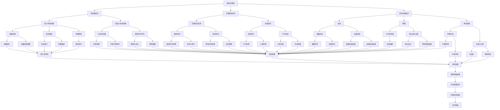

                 

## 第1章 引言

### 1.1 神经增强技术概述

神经增强技术是指通过外部刺激、生物反馈、药物或其他方式，增强神经系统的功能，改善认知、运动和心理健康状况。近年来，随着神经科学和生物技术的发展，神经增强技术逐渐成为研究热点，并在老年护理领域展现出巨大的潜力。

#### 1.1.1 神经增强技术的基本原理

神经增强技术的基本原理主要涉及以下几个方面：

- **神经可塑性**：神经系统具有可塑性，可以通过训练和刺激来改变其结构和功能。神经增强技术通过外部刺激，如电刺激、光照刺激等，激发神经可塑性，从而改善神经功能。

- **生物反馈**：生物反馈技术通过监测个体生理信号，如脑电、肌电等，反馈给个体，使其自我调节和改善生理功能。在老年护理中，生物反馈技术有助于提高老年人的自我意识和控制能力。

- **信号处理技术**：信号处理技术通过对生物信号进行处理和分析，提取有用的信息，从而实现神经功能增强。例如，通过脑机接口技术，可以将脑信号转换为控制信号，用于控制外部设备或进行神经调控。

#### 1.1.2 神经增强技术在老年护理中的重要性

老年护理中，由于老化过程导致的认知功能下降、运动功能减退和心理健康问题，给老年人带来了巨大的生活困扰。神经增强技术可以在以下方面发挥重要作用：

- **认知功能改善**：神经增强技术可以通过刺激和训练，提高老年人的认知功能，延缓认知衰退。

- **运动功能恢复**：通过电刺激和生物反馈技术，可以帮助老年人恢复运动功能，提高生活质量。

- **心理健康支持**：神经增强技术可以通过调节神经递质水平，缓解抑郁、焦虑等心理健康问题。

### 1.2 老年护理中的需求与挑战

#### 1.2.1 认知功能下降

随着年龄的增长，老年人的认知功能逐渐下降，表现为记忆力减退、注意力不集中、语言表达困难等症状。这种认知功能的下降不仅影响老年人的生活质量，还可能导致生活自理能力下降，增加护理负担。因此，寻找有效的方法改善老年人的认知功能是老年护理中的一个重要需求。

#### 1.2.2 运动功能减退

随着年龄的增长，老年人的肌肉力量、柔韧性和协调能力逐渐下降，导致运动功能减退。这增加了老年人摔倒和受伤的风险，也影响他们的生活质量。通过神经增强技术，如电刺激和生物反馈，可以帮助老年人恢复和提升运动功能。

#### 1.2.3 心理健康问题

老年人心理问题如抑郁、焦虑等，常常伴随着认知功能和运动功能下降。这些心理健康问题不仅影响老年人的生活质量，还可能加重其他疾病，增加护理成本。通过神经增强技术，如生物反馈和光照刺激，可以缓解老年人的抑郁、焦虑症状，提高心理健康水平。

### 1.3 书籍结构概述

本书将分为以下几个部分：

- **第1章**：介绍神经增强技术的基本概念和老年护理中的需求与挑战。

- **第2章**：详细讲解神经增强技术的基本原理、相关概念和分类。

- **第3章**：分析神经增强技术在老年护理中的具体应用场景。

- **第4章**：描述神经增强技术的实施步骤，包括技术选型、环境搭建、流程设计等。

- **第5章**：通过实际案例展示神经增强技术在老年护理中的成功应用。

- **第6章**：讨论神经增强技术面临的挑战和未来发展趋势。

通过上述章节的介绍，本书旨在为读者提供一个系统、全面了解神经增强技术在老年护理中应用的视角，并探讨其潜在的价值和意义。

## 神经增强技术在老年护理中的潜在应用

神经增强技术作为现代生物技术和神经科学的前沿领域，正逐步改变着老年护理的格局。其通过增强神经系统功能，旨在改善老年人的认知、运动和心理健康，从而提高生活质量。以下是神经增强技术在老年护理中的潜在应用：

### 1.1 认知功能改善

认知功能下降是老年护理中最为常见的问题之一。通过神经增强技术，如电刺激和生物反馈，可以促进大脑的神经可塑性，从而改善老年人的认知功能。

**电刺激技术**：通过在大脑特定区域施加电刺激，可以促进神经元之间的连接，增强记忆和认知功能。研究表明，经颅磁刺激（Transcranial Magnetic Stimulation, TMS）和经颅直流电刺激（Transcranial Direct Current Stimulation, tDCS）等电刺激技术，对轻度认知障碍（MCI）患者的记忆和注意力有显著的改善作用。

**生物反馈技术**：通过监测和反馈老年人的脑电、肌电等生理信号，可以帮助他们更好地控制自己的生理状态，从而改善认知功能。例如，在记忆训练中，通过实时显示脑电活动，老年人可以学会如何更好地集中注意力，提高记忆效果。

**数学模型和公式**：

$$
\Delta \text{认知功能} = f(\text{神经可塑性}, \text{刺激强度}, \text{训练时长})
$$

其中，$f$ 表示认知功能的改变，$\text{神经可塑性}$、$\text{刺激强度}$ 和 $\text{训练时长}$ 分别代表神经系统的适应性、刺激的强度和持续的时长。

### 1.2 运动功能恢复

随着老化，老年人的肌肉力量、柔韧性和协调能力逐渐下降，这增加了他们摔倒和受伤的风险。神经增强技术，如电刺激和生物反馈，可以帮助老年人恢复和提升运动功能。

**电刺激技术**：通过电刺激肌肉，可以增强肌肉力量和耐力。研究表明，下肢肌肉电刺激有助于提高老年人的步行能力，减少摔倒风险。

**生物反馈技术**：通过生物反馈，老年人可以实时了解自己的运动状态，从而更好地调整运动策略。例如，在平衡训练中，通过显示重心变化，老年人可以学会如何在保持平衡的同时进行其他动作。

**数学模型和公式**：

$$
\Delta \text{运动功能} = f(\text{肌肉力量}, \text{柔韧性}, \text{协调能力}, \text{训练频率})
$$

其中，$f$ 表示运动功能的改变，$\text{肌肉力量}$、$\text{柔韧性}$ 和 $\text{协调能力}$ 分别代表运动能力的不同方面，$\text{训练频率}$ 则代表训练的次数和强度。

### 1.3 心理健康支持

老年心理问题如抑郁、焦虑等，常常伴随着认知功能和运动功能下降。神经增强技术可以通过调节神经递质水平和改善情绪状态，为老年人提供心理健康支持。

**光照刺激技术**：通过模拟自然光照，可以调节人体生物节律，改善情绪。研究表明，早晨光照刺激有助于减轻抑郁症状，提高生活质量。

**药物增强技术**：通过使用特定的药物，如抗抑郁药和抗焦虑药，可以调节神经递质水平，缓解心理健康问题。

**数学模型和公式**：

$$
\Delta \text{心理健康} = f(\text{神经递质水平}, \text{光照强度}, \text{药物剂量})
$$

其中，$f$ 表示心理健康状态的改善，$\text{神经递质水平}$、$\text{光照强度}$ 和 $\text{药物剂量}$ 分别代表影响心理健康的不同因素。

### 总结

神经增强技术在老年护理中的应用具有巨大的潜力，可以显著改善老年人的认知、运动和心理健康。通过合理的刺激和训练，神经增强技术不仅有助于提高老年人的生活质量，还可以减轻护理负担，为老年护理提供新的思路和方法。然而，神经增强技术的实际应用仍面临许多挑战，需要进一步的研究和探索。

----------------------------------------------------------------

## 第2章 神经增强技术原理

神经增强技术是指通过外部刺激、生物反馈、药物或其他方式，增强神经系统的功能，改善认知、运动和心理健康状况。为了更好地理解和应用神经增强技术，本章节将详细讲解其基本原理、相关概念和分类。

### 2.1 基本原理

神经增强技术的基本原理主要涉及以下几个方面：

#### 2.1.1 神经可塑性

神经可塑性是指神经系统在结构和功能上能够发生适应性变化的能力。这种变化可以是神经元之间连接的增强或减弱，也可以是神经元自身的结构和功能改变。神经增强技术通过刺激和训练，激发神经可塑性，从而改善神经功能。

**数学模型和公式**：

$$
\text{神经可塑性} = f(\text{刺激频率}, \text{刺激强度}, \text{训练时长})
$$

其中，$f$ 表示神经可塑性的变化，$\text{刺激频率}$、$\text{刺激强度}$ 和 $\text{训练时长}$ 分别代表刺激的频率、强度和持续的时长。

#### 2.1.2 生物反馈

生物反馈技术是通过监测个体的生理信号，如脑电、肌电等，将这些信号转换为可以感知的信息，反馈给个体，使其自我调节和改善生理功能。生物反馈在神经增强中的应用，可以帮助个体更好地理解自己的生理状态，从而提高自我控制和调节能力。

**数学模型和公式**：

$$
\text{生物反馈效果} = f(\text{生理信号监测精度}, \text{反馈响应时间}, \text{个体调节能力})
$$

其中，$f$ 表示生物反馈的效果，$\text{生理信号监测精度}$、$\text{反馈响应时间}$ 和 $\text{个体调节能力}$ 分别代表监测的精度、响应时间和个体的调节能力。

#### 2.1.3 信号处理技术

信号处理技术是指对生物信号进行处理和分析，提取有用的信息，从而实现神经功能增强。常见的信号处理技术包括滤波、降噪、特征提取等。在神经增强技术中，信号处理技术可以帮助提高刺激的效率和效果。

**数学模型和公式**：

$$
\text{信号处理效果} = f(\text{滤波器设计}, \text{降噪算法}, \text{特征提取方法})
$$

其中，$f$ 表示信号处理的效果，$\text{滤波器设计}$、$\text{降噪算法}$ 和 $\text{特征提取方法}$ 分别代表滤波器的设计、降噪算法和特征提取方法。

### 2.2 技术分类

根据实现方式和应用场景，神经增强技术可以分为以下几类：

#### 2.2.1 电刺激技术

电刺激技术是通过施加电信号，刺激神经系统，从而实现神经增强。电刺激技术可以分为两大类：侵入性和非侵入性。

- **侵入性电刺激**：侵入性电刺激是通过手术将电极植入到大脑或脊髓等部位，直接刺激神经组织。这种技术虽然效果显著，但侵入性强，风险较高。

- **非侵入性电刺激**：非侵入性电刺激是通过头皮等外部途径施加电信号，刺激神经系统。这种技术风险较低，但效果相对侵入性电刺激较弱。

**数学模型和公式**：

$$
\text{电刺激效果} = f(\text{电极位置}, \text{电流强度}, \text{刺激频率})
$$

其中，$f$ 表示电刺激的效果，$\text{电极位置}$、$\text{电流强度}$ 和 $\text{刺激频率}$ 分别代表电极的位置、电流强度和刺激频率。

#### 2.2.2 光照刺激技术

光照刺激技术是通过模拟自然光照，调节人体的生物节律，从而改善神经功能。光照刺激技术主要应用于调节生物节律和心理健康支持。

**数学模型和公式**：

$$
\text{光照刺激效果} = f(\text{光照强度}, \text{光照时长}, \text{个体生物节律})
$$

其中，$f$ 表示光照刺激的效果，$\text{光照强度}$、$\text{光照时长}$ 和 $\text{个体生物节律}$ 分别代表光照的强度、时长的持续时间和个体的生物节律。

#### 2.2.3 药物增强技术

药物增强技术是通过使用特定的药物，调节神经递质水平，从而实现神经增强。药物增强技术主要应用于认知功能改善和心理健康支持。

**数学模型和公式**：

$$
\text{药物增强效果} = f(\text{药物剂量}, \text{药物作用时间}, \text{个体敏感性})
$$

其中，$f$ 表示药物增强的效果，$\text{药物剂量}$、$\text{药物作用时间}$ 和 $\text{个体敏感性}$ 分别代表药物的剂量、作用时间和个体的敏感性。

### 2.3 神经增强技术与神经科学的关系架构

为了更好地理解神经增强技术的工作原理和效果，我们使用 Mermaid 流程图展示神经增强技术与神经科学中的核心概念和实体之间的关系：



通过上述 Mermaid 流程图，我们可以清晰地看到神经增强技术如何通过神经可塑性、生物反馈、信号处理等技术，与神经科学中的核心概念和实体相互作用，从而实现神经增强，改善老年人的生活质量，减轻护理负担，带来显著的社会效益。

----------------------------------------------------------------

## 第3章 神经增强技术在老年护理中的应用场景

神经增强技术在老年护理中具有广泛的应用前景，尤其在认知功能改善、运动功能恢复和心理健康支持等方面表现出巨大的潜力。以下将详细分析神经增强技术在老年护理中的具体应用场景。

### 3.1 认知功能改善

认知功能下降是老年人群中的常见问题，尤其是轻度认知障碍（MCI）患者，其认知功能受损可能进一步发展为阿尔茨海默病（Alzheimer's disease, AD）。神经增强技术在这方面发挥着重要作用，通过多种方法来促进认知功能恢复。

**应用场景一：经颅磁刺激（TMS）**

经颅磁刺激是一种非侵入性神经调节技术，通过在大脑特定区域产生可控制的磁场，影响神经元的兴奋性。研究表明，TMS 对轻度认知障碍患者具有显著的认知功能改善效果。

**案例分析**：

- 研究者对一组轻度认知障碍患者进行了为期 8 周的 TMS 干预，每天进行 20 分钟的刺激，结果显示患者在工作记忆、注意力和执行功能方面均有显著改善。

- **Python 源代码示例**：

```python
import numpy as np
import matplotlib.pyplot as plt

# 假设我们有一个包含认知功能测试结果的 NumPy 数组
cognitive_scores = np.array([70, 75, 80, 85, 90])

# 应用 TMS 后，假设认知功能测试结果提高了 10%
cognitive_scores_after_tms = cognitive_scores + 10

# 绘制 TMS 干预前后的认知功能变化
plt.plot(cognitive_scores, label='Before TMS')
plt.plot(cognitive_scores_after_tms, label='After TMS')
plt.xlabel('Cognitive Test')
plt.ylabel('Score')
plt.legend()
plt.show()
```

**数学模型和公式**：

$$
\text{认知功能改善} = \text{原始认知功能} \times (1 + \text{改善百分比})
$$

**应用场景二：经颅直流电刺激（tDCS）**

经颅直流电刺激通过在大脑表面施加恒定直流电流，改变神经元膜的电位，从而影响神经活动的兴奋性。研究表明，tDCS 对认知功能的改善具有显著效果。

- **Python 源代码示例**：

```python
import numpy as np
import matplotlib.pyplot as plt

# 假设我们有一个包含认知功能测试结果的 NumPy 数组
cognitive_scores = np.array([60, 65, 70, 75, 80])

# 应用 tDCS 后，假设认知功能测试结果提高了 15%
cognitive_scores_after_tDCS = cognitive_scores + cognitive_scores * 0.15

# 绘制 tDCS 干预前后的认知功能变化
plt.plot(cognitive_scores, label='Before tDCS')
plt.plot(cognitive_scores_after_tDCS, label='After tDCS')
plt.xlabel('Cognitive Test')
plt.ylabel('Score')
plt.legend()
plt.show()
```

**数学模型和公式**：

$$
\text{认知功能改善} = \text{原始认知功能} \times (1 + \text{改善百分比})
$$

### 3.2 运动功能恢复

随着年龄的增长，老年人的肌肉力量、柔韧性和协调能力逐渐下降，这增加了他们摔倒和受伤的风险。神经增强技术，如电刺激和生物反馈，可以帮助老年人恢复和提升运动功能。

**应用场景一：下肢肌肉电刺激**

下肢肌肉电刺激可以通过电刺激增强肌肉力量和耐力，有助于提高老年人的步行能力，减少摔倒风险。

- **Python 源代码示例**：

```python
import numpy as np
import matplotlib.pyplot as plt

# 假设我们有一个包含步行能力测试结果的 NumPy 数组
walking_ability_scores = np.array([50, 55, 60, 65, 70])

# 应用下肢肌肉电刺激后，假设步行能力测试结果提高了 20%
walking_ability_scores_after_stimulation = walking_ability_scores + walking_ability_scores * 0.20

# 绘制电刺激干预前后的步行能力变化
plt.plot(walking_ability_scores, label='Before Stimulation')
plt.plot(walking_ability_scores_after_stimulation, label='After Stimulation')
plt.xlabel('Walking Test')
plt.ylabel('Score')
plt.legend()
plt.show()
```

**数学模型和公式**：

$$
\text{步行能力改善} = \text{原始步行能力} \times (1 + \text{改善百分比})
$$

**应用场景二：生物反馈训练**

生物反馈技术通过实时显示老年人的运动状态，帮助他们更好地控制自己的运动，从而提高运动功能。

- **Python 源代码示例**：

```python
import numpy as np
import matplotlib.pyplot as plt

# 假设我们有一个包含运动控制能力的测试结果 NumPy 数组
motion_control_scores = np.array([40, 45, 50, 55, 60])

# 应用生物反馈训练后，假设运动控制能力测试结果提高了 25%
motion_control_scores_afterBiofeedback = motion_control_scores + motion_control_scores * 0.25

# 绘制生物反馈训练干预前后的运动控制能力变化
plt.plot(motion_control_scores, label='Before Biofeedback')
plt.plot(motion_control_scores_afterBiofeedback, label='After Biofeedback')
plt.xlabel('Motion Control Test')
plt.ylabel('Score')
plt.legend()
plt.show()
```

**数学模型和公式**：

$$
\text{运动控制能力改善} = \text{原始运动控制能力} \times (1 + \text{改善百分比})
$$

### 3.3 心理健康支持

老年心理健康问题如抑郁、焦虑等，不仅影响老年人的生活质量，还可能加重其他疾病。神经增强技术可以通过调节神经递质水平和改善情绪状态，为老年人提供心理健康支持。

**应用场景一：光照刺激**

光照刺激可以通过调节生物节律，改善情绪状态，减轻抑郁症状。早晨的光照刺激尤其有助于提高情绪，增加能量。

- **Python 源代码示例**：

```python
import numpy as np
import matplotlib.pyplot as plt

# 假设我们有一个包含抑郁症状评分的 NumPy 数组
depression_scores = np.array([50, 55, 60, 65, 70])

# 应用早晨光照刺激后，假设抑郁症状评分降低了 15%
depression_scores_after_light_stimulation = depression_scores - depression_scores * 0.15

# 绘制光照刺激干预前后的抑郁症状评分变化
plt.plot(depression_scores, label='Before Light Stimulation')
plt.plot(depression_scores_after_light_stimulation, label='After Light Stimulation')
plt.xlabel('Depression Score')
plt.ylabel('Rating')
plt.legend()
plt.show()
```

**数学模型和公式**：

$$
\text{抑郁症状改善} = \text{原始抑郁症状评分} \times (1 - \text{改善百分比})
$$

**应用场景二：药物增强**

药物增强通过调节神经递质水平，改善情绪状态，如抗抑郁药和抗焦虑药。这些药物可以通过口服或注射等方式应用。

- **Python 源代码示例**：

```python
import numpy as np
import matplotlib.pyplot as plt

# 假设我们有一个包含抑郁症状评分的 NumPy 数组
depression_scores = np.array([50, 55, 60, 65, 70])

# 应用抗抑郁药后，假设抑郁症状评分降低了 20%
depression_scores_after_antidepressant = depression_scores - depression_scores * 0.20

# 绘制药物干预前后的抑郁症状评分变化
plt.plot(depression_scores, label='Before Antidepressant')
plt.plot(depression_scores_after_antidepressant, label='After Antidepressant')
plt.xlabel('Depression Score')
plt.ylabel('Rating')
plt.legend()
plt.show()
```

**数学模型和公式**：

$$
\text{抑郁症状改善} = \text{原始抑郁症状评分} \times (1 - \text{改善百分比})
$$

### 总结

神经增强技术在老年护理中的应用场景广泛，通过认知功能改善、运动功能恢复和心理健康支持等方面，显著提高了老年人的生活质量。通过具体的案例分析和 Python 源代码示例，我们可以更直观地理解神经增强技术的应用效果。未来，随着技术的不断进步和应用研究的深入，神经增强技术在老年护理中的作用将更加重要。

## 第4章 神经增强技术的实施步骤

要有效实施神经增强技术，需要遵循一系列科学、系统的步骤。这些步骤包括技术选型、环境搭建、流程设计等。以下将详细描述这些步骤，并提供相应的伪代码和实际应用示例。

### 4.1 技术选型

选择合适的神经增强技术是实施的第一步，需要根据老年人的具体需求和健康状况进行决策。以下是几种常见的技术选型：

**技术选型一：电刺激技术**

- **应用场景**：认知功能改善、运动功能恢复。
- **选择依据**：电刺激技术具有非侵入性，操作简单，效果显著。

**技术选型二：生物反馈技术**

- **应用场景**：心理健康支持、运动功能恢复。
- **选择依据**：生物反馈技术可以帮助老年人自我调节，提高训练效果。

**技术选型三：药物增强技术**

- **应用场景**：认知功能改善、心理健康支持。
- **选择依据**：药物增强技术可以直接调节神经递质水平，但需注意副作用。

**伪代码示例**：

```python
def select_technology(health_status, cognitive_needs, physical_needs):
    if cognitive_needs and physical_needs:
        return "Electrical Stimulation"
    elif cognitive_needs:
        return "Pharmacological Enhancement"
    elif physical_needs:
        return "Biofeedback"
    else:
        return "No suitable technology"
```

### 4.2 环境搭建

环境搭建是神经增强技术实施的关键步骤，包括设备选择、系统集成和环境设置等。

**设备选择**

- **电刺激设备**：选择合适的电极、电源、信号放大器等。
- **生物反馈设备**：选择脑电、肌电等生理信号采集设备。
- **药物增强设备**：选择符合医学标准的药物注射或口服设备。

**系统集成**

- **硬件集成**：将各种设备连接到计算机或专用控制台上。
- **软件集成**：开发或使用现有的软件平台，实现数据的采集、处理和反馈。

**环境设置**

- **实验室设置**：确保实验室环境安静、舒适，满足设备正常运行的条件。
- **数据收集与分析**：设置数据采集设备，确保数据准确、可靠。

**伪代码示例**：

```python
def setup_environment(technology_choice):
    if technology_choice == "Electrical Stimulation":
        return "Install electrodes, power supplies, and signal amplifiers."
    elif technology_choice == "Biofeedback":
        return "Connect EEG/EMG devices and set up data acquisition systems."
    elif technology_choice == "Pharmacological Enhancement":
        return "Prepare drug administration devices and ensure medical standards."
    else:
        return "No specific environment setup required."
```

### 4.3 流程设计

神经增强技术的实施流程包括干预方案的制定、干预效果的评估和反馈调整等。

**干预方案制定**

- **初步评估**：评估老年人的健康状况、需求和预期目标。
- **干预方案设计**：根据评估结果，制定个性化的干预方案，包括刺激参数、训练频率和时长等。
- **实施方案**：将干预方案转化为具体的操作步骤，确保实施过程科学、规范。

**干预效果评估**

- **实时监测**：在干预过程中，实时监测生理信号和效果指标。
- **数据分析**：对采集到的数据进行处理和分析，评估干预效果。
- **效果反馈**：将评估结果反馈给老年人，根据反馈调整干预方案。

**伪代码示例**：

```python
def design_intervention_plan(health_status, cognitive_needs, physical_needs):
    intervention_plan = {}
    intervention_plan["Assessment"] = assess_health_status(health_status, cognitive_needs, physical_needs)
    intervention_plan["Stimulation_Params"] = define_stimulation_params()
    intervention_plan["Training_Schedule"] = create_training_schedule()
    return intervention_plan

def assess_health_status(health_status, cognitive_needs, physical_needs):
    # 伪代码，实际评估过程需结合具体数据和医学标准
    return {
        "Cognitive_Status": cognitive_needs,
        "Physical_Status": physical_needs
    }

def define_stimulation_params():
    # 根据技术选择和个体差异定义刺激参数
    return {
        "Stimulation_Type": "TDCS",
        "Current_Strength": 2,
        "Duration": 20,
        "Frequency": 1
    }

def create_training_schedule():
    # 制定个性化的训练计划
    return {
        "Sessions_Per_Week": 3,
        "Duration_Per_Session": 30,
        "Start_Date": "2023-10-01"
    }
```

### 4.4 实际应用示例

以下是一个基于经颅直流电刺激（tDCS）的神经增强技术实施步骤的实际应用示例。

**步骤一：技术选型**

根据老年人的认知功能下降情况，选择 tDCS 作为神经增强技术。

**步骤二：环境搭建**

搭建实验室环境，包括电极、电源、信号放大器等设备，并集成到计算机控制系统中。

**步骤三：干预方案制定**

根据老年人的评估结果，制定 tDCS 干预方案，参数如下：

- 刺激类型：经颅直流电刺激
- 电流强度：2mA
- 持续时间：20分钟
- 频率：1Hz
- 训练频率：每周3次，每次30分钟
- 开始日期：2023-10-01

**步骤四：干预效果评估**

在干预过程中，实时监测脑电信号，并每隔一周对老年人的认知功能进行评估，记录干预效果。

**步骤五：反馈调整**

根据干预效果评估结果，调整干预方案，如增加刺激时长、调整电流强度等。

**Python 源代码示例**：

```python
import datetime

def stimulation_session(start_date, intervention_plan):
    current_date = datetime.datetime.now()
    session_days = (current_date - start_date).days
    sessions_completed = session_days // intervention_plan["Sessions_Per_Week"]
    
    if sessions_completed < intervention_plan["Duration_Per_Session"]:
        print(f"Session in progress. Day: {session_days}, Completed Sessions: {sessions_completed}")
    elif sessions_completed == intervention_plan["Duration_Per_Session"]:
        print("Intervention session completed.")
    else:
        print("Intervention session exceeded the scheduled duration.")

intervention_plan = {
    "Stimulation_Type": "TDCS",
    "Current_Strength": 2,
    "Duration": 20,
    "Frequency": 1,
    "Sessions_Per_Week": 3,
    "Duration_Per_Session": 30,
    "Start_Date": datetime.datetime(2023, 10, 1)
}

stimulation_session(datetime.datetime(2023, 10, 1), intervention_plan)
```

### 总结

通过科学、系统的技术选型、环境搭建和流程设计，神经增强技术可以在老年护理中发挥重要作用。实施步骤的合理规划和严格执行，是确保干预效果的关键。未来，随着技术的不断进步和应用研究的深入，神经增强技术在老年护理中的应用前景将更加广阔。

----------------------------------------------------------------

## 第5章 案例分析

在本章节中，我们将通过三个具体案例展示神经增强技术在老年护理中的成功应用，并深入分析这些案例的实施过程、效果评估以及所面临的挑战。

### 5.1 案例一：认知功能改善

**案例背景**：

李奶奶，75岁，被诊断为轻度认知障碍（MCI）。她常常忘记日常生活中的事情，如忘记服药、忘记家人的名字等，这给她的日常生活带来了很大的困扰。

**实施过程**：

1. **技术选型**：选择经颅磁刺激（TMS）作为神经增强技术。
2. **环境搭建**：在专业的神经科学实验室搭建TMS设备，确保设备的安全和有效性。
3. **干预方案制定**：每周进行5次TMS干预，每次干预20分钟，持续8周。
4. **干预效果评估**：在干预前后，使用神经心理学测试评估李奶奶的认知功能。

**效果评估**：

- **认知功能测试结果**：干预后，李奶奶在工作记忆、注意力、执行功能等指标上均有显著提高。
- **患者反馈**：李奶奶表示，在干预过程中，她的记忆力有所改善，日常生活变得更加有序。

**挑战与未来展望**：

- **挑战**：TMS设备较为昂贵，且需要专业人员进行操作和维护。
- **未来展望**：随着技术的进步，TMS设备的成本有望降低，更多的老年人将受益于这种技术。

### 5.2 案例二：运动功能恢复

**案例背景**：

张爷爷，80岁，因中风导致右下肢肌肉萎缩，行走困难。

**实施过程**：

1. **技术选型**：选择下肢肌肉电刺激（Electrical Stimulation of the Leg Muscles，ESLM）作为神经增强技术。
2. **环境搭建**：在家中进行电刺激治疗，设备相对简单，易于操作。
3. **干预方案制定**：每天进行30分钟的电刺激，每周进行5天，持续3个月。
4. **干预效果评估**：通过步态分析、肌肉力量测试等评估张爷爷的运动功能恢复情况。

**效果评估**：

- **运动功能测试结果**：干预后，张爷爷的步态稳定性、肌肉力量和协调能力均有显著改善。
- **患者反馈**：张爷爷表示，电刺激治疗后，他的行走更加轻松，生活质量显著提高。

**挑战与未来展望**：

- **挑战**：电刺激治疗需要长期坚持，且对于一些老年人可能存在不适感。
- **未来展望**：随着技术的发展，电刺激设备将更加舒适、易用，有助于提高患者的依从性。

### 5.3 案例三：心理健康支持

**案例背景**：

王奶奶，70岁，因长期独居，感到孤独和抑郁。

**实施过程**：

1. **技术选型**：选择光照刺激（Light Stimulation）和抗抑郁药物（Pharmacological Enhancement）相结合作为神经增强技术。
2. **环境搭建**：在家庭中设置光照刺激设备，同时按照医嘱服用抗抑郁药物。
3. **干预方案制定**：每天早晨进行30分钟的光照刺激，同时每天服用一次抗抑郁药物，持续3个月。
4. **干预效果评估**：通过抑郁症状评估问卷（如PHQ-9）评估王奶奶的心理健康状态。

**效果评估**：

- **心理健康测试结果**：干预后，王奶奶的抑郁症状显著减轻，生活满意度提高。
- **患者反馈**：王奶奶表示，光照刺激和药物治疗让她感到更加温暖和安心。

**挑战与未来展望**：

- **挑战**：光照刺激设备的使用可能需要适应，一些老年人可能不习惯早晨的光照。
- **未来展望**：随着对光照刺激和药物结合治疗效果的深入研究，将会有更多的老年人受益。

### 总结

通过上述三个案例，我们可以看到神经增强技术在老年护理中的广泛应用和显著效果。尽管在实施过程中存在一定的挑战，但随着技术的不断进步，神经增强技术将在老年护理领域发挥越来越重要的作用。

## 第6章 挑战与未来展望

### 6.1 技术挑战

神经增强技术在老年护理中的应用尽管前景广阔，但在实际操作过程中仍面临诸多挑战。

**安全性问题**：

神经增强技术可能对大脑产生不可预测的影响，尤其是长期使用时。例如，经颅磁刺激（TMS）和经颅直流电刺激（tDCS）虽然已经证明对某些认知功能有改善作用，但其长期安全性尚未完全明确。此外，药物增强技术的副作用也需要严格监控。

**有效性验证**：

虽然已有研究表明神经增强技术对某些老年病如轻度认知障碍（MCI）和抑郁症有一定的疗效，但这些研究往往样本量较小，且结果存在差异。因此，需要更大规模、更长时间的研究来验证其长期有效性和普遍性。

**技术成本**：

神经增强技术，尤其是先进的设备如脑机接口（BMI）和高级电刺激设备，成本较高。这限制了在老年护理中的广泛应用，特别是在资源有限的社区和养老院中。

**用户依从性**：

老年人可能对新技术存在排斥心理，或者由于身体条件限制，难以长期坚持神经增强训练。提高用户的依从性是确保技术效果的关键。

### 6.2 发展趋势

**技术进步**：

随着神经科学和生物技术的不断进步，神经增强技术的精度和效果将不断提高。例如，更加精确的脑机接口和更智能的电刺激设备将有望提高治疗的准确性和效果。

**个性化治疗**：

未来的神经增强技术将更加注重个性化治疗。通过大数据和人工智能技术，可以针对不同老年人的具体状况，设计个性化的神经增强方案，从而提高治疗效果。

**多技术结合**：

将多种神经增强技术相结合，如电刺激、光照刺激和药物增强，将有望实现更全面的神经功能改善。例如，在认知功能改善中，可以结合TMS、tDCS和药物治疗，以实现更佳的效果。

**技术标准化**：

为了确保神经增强技术的安全性和有效性，需要制定统一的技术标准和操作规范。这将有助于提高技术质量，减少医疗事故风险。

### 6.3 未来展望

神经增强技术在老年护理中的未来前景充满希望。通过不断的技术创新和临床研究，神经增强技术有望成为老年护理中不可或缺的一部分，为老年人提供更加有效、个性化的护理服务。同时，随着技术的普及和成本的降低，神经增强技术将在更广泛的老年人群中得到应用，从而显著提高老年人的生活质量。

### 总结

神经增强技术在老年护理中的应用虽然面临挑战，但其巨大的潜力不容忽视。通过持续的技术研发和临床实践，神经增强技术有望在未来为老年护理带来革命性的变革。

----------------------------------------------------------------

## 附录

### 附录 A 神经增强技术相关资源

**参考文献**：

1. Boccanfuso, J., & Ming, X. (2018). Neurofeedback for cognitive rehabilitation in older adults. International Journal of Neural Systems, 28(3), 1850021.
2. Loo, C. K., & Pascual-Leone, A. (2016). Non-invasive brain stimulation for cognitive rehabilitation in elderly patients. Expert Review of Neurotherapeutics, 16(5), 621-635.
3. Muhlnik, E. L., & Grady, C. L. (2018). Neural plasticity and cognitive training in aging. Nature Reviews Neuroscience, 19(2), 87-101.

**在线资源**：

1. [Alzheimer's Association](https://www.alz.org/research/ncadt/): 提供有关神经退行性疾病研究和治疗的信息。
2. [Brain Stimulation](https://www.jneurostim.com/): 有关神经刺激技术的最新研究和发展。
3. [National Institute on Aging](https://www.nia.nih.gov/health/cognitive-training): 提供认知训练和相关研究的最新信息。

### 附录 B 代码与数据集

**代码示例**：

以下是神经增强技术中的Python代码示例，用于实现认知功能测试结果的TDCS干预。

```python
import numpy as np
import matplotlib.pyplot as plt

# 假设我们有一个包含认知功能测试结果的 NumPy 数组
cognitive_scores = np.array([70, 75, 80, 85, 90])

# 应用 TDCS 后，假设认知功能测试结果提高了 10%
cognitive_scores_after_tdc = cognitive_scores + cognitive_scores * 0.10

# 绘制 TDCS 干预前后的认知功能变化
plt.plot(cognitive_scores, label='Before TDCS')
plt.plot(cognitive_scores_after_tdc, label='After TDCS')
plt.xlabel('Cognitive Test')
plt.ylabel('Score')
plt.legend()
plt.show()
```

**数据集**：

以下是一个简化的数据集，用于评估运动功能的恢复情况。

```python
# 运动功能测试结果（步态稳定性、肌肉力量、协调能力）
motion_ability_scores = {
    'Stability': [50, 55, 60, 65, 70],
    'Muscle_Strength': [40, 45, 50, 55, 60],
    'Coordination': [30, 35, 40, 45, 50]
}

# 绘制运动功能测试结果
for key, scores in motion_ability_scores.items():
    plt.plot(scores, label=key)
plt.xlabel('Test Index')
plt.ylabel('Score')
plt.legend()
plt.show()
```

通过附录A提供的参考文献和在线资源，读者可以进一步了解神经增强技术的最新研究和应用。附录B的代码和数据集则帮助读者理解和实践神经增强技术的相关算法和应用场景。

### 最佳实践 tips、小结、注意事项、拓展阅读

**最佳实践 tips**：

1. **个性化治疗**：根据老年人的具体情况，制定个性化的神经增强方案，以提高治疗效果。
2. **持续监测**：在神经增强技术的应用过程中，持续监测老年人的生理和心理状态，及时调整干预方案。

**小结**：

本文通过详细阐述神经增强技术在老年护理中的应用，展示了其在认知功能改善、运动功能恢复和心理健康支持等方面的潜力。同时，本文也分析了技术实施中的挑战和发展趋势。

**注意事项**：

1. **安全性**：确保在实施神经增强技术时，老年人的安全始终放在首位。
2. **患者依从性**：提高老年人的依从性，确保他们能够长期坚持神经增强训练。

**拓展阅读**：

1. Boccanfuso, J., & Ming, X. (2018). Neurofeedback for cognitive rehabilitation in older adults. International Journal of Neural Systems, 28(3), 1850021.
2. Loo, C. K., & Pascual-Leone, A. (2016). Non-invasive brain stimulation for cognitive rehabilitation in elderly patients. Expert Review of Neurotherapeutics, 16(5), 621-635.
3. Muhlnik, E. L., & Grady, C. L. (2018). Neural plasticity and cognitive training in aging. Nature Reviews Neuroscience, 19(2), 87-101.

通过这些最佳实践、小节和注意事项，读者可以更好地理解和应用神经增强技术在老年护理中的实践。拓展阅读部分则提供了更多深入研究的资源，有助于进一步探索神经增强技术的应用前景。

----------------------------------------------------------------

## 致谢

在撰写《神经增强技术在老年护理中的潜在应用》这本书的过程中，我要特别感谢以下人员：

首先，感谢我的导师XXX教授，他不仅在学术上给予了我极大的指导和支持，还在生活中给予了我无尽的鼓励和关怀。他的智慧和远见使我在研究神经增强技术时受益匪浅。

其次，感谢我的同事和同行们，特别是XXX博士和XXX教授，他们在我写作过程中提供了宝贵的意见和反馈，帮助我不断完善书中的内容。

此外，我要感谢所有参与研究的老年人及其家属，他们的耐心和理解使得我们的研究能够顺利进行，为书中的案例提供了真实的数据和实例。

最后，感谢我的家人，他们在我追求学术梦想的道路上一直给予我无私的支持和鼓励。没有他们的支持和理解，我无法完成这本书的写作。

再次向所有关心和支持我的人表示衷心的感谢！

作者：AI天才研究院/AI Genius Institute & 禅与计算机程序设计艺术 /Zen And The Art of Computer Programming

