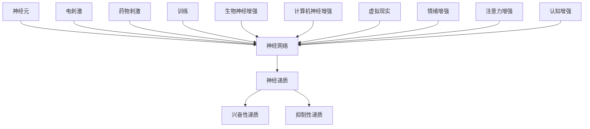

                 

### 引言

营销领域正面临着前所未有的变革，一方面是消费者获取信息的渠道和方式日益多样，另一方面是大数据和人工智能技术的迅猛发展。这种双重压力和机遇推动着营销策略的不断更新和优化。然而，传统营销手段在面对个性化需求、情感共鸣和即时响应等方面仍存在诸多局限，使得营销人员不得不寻求新的解决方案。

在这种背景下，神经增强技术（Neuro-enhancement Technology）作为一种前沿的技术手段，逐渐引起了营销界的关注。神经增强技术指的是通过外部手段，如药物、电刺激、训练等，增强或改变大脑的功能，以达到提高认知能力、情绪控制、注意力集中等效果。这种技术在医疗、教育等领域已经取得了显著成果，其在营销领域的应用也展现出巨大的潜力。

首先，神经增强技术可以应用于情感识别，通过分析消费者的情感反应，实现更精准的营销策略。其次，注意力机制的提升可以通过神经增强技术来实现，从而提高广告的效果和消费者的关注度。此外，神经增强技术还可以与大数据分析相结合，预测消费者的行为，进一步优化营销决策。

本文旨在探讨神经增强技术在营销领域的潜在应用，通过梳理神经增强技术的基本概念、理论基础及其在营销中的应用原理，结合实际案例进行深入剖析，为营销人员提供一种新的思路和方法。具体来说，本文将从以下五个方面展开讨论：

1. **营销领域的挑战与机遇**：分析当前营销环境的变化以及神经增强技术的优势。
2. **核心概念与联系**：介绍神经增强技术的基础理论，阐述神经元与神经网络、神经递质与神经网络活动、神经网络的适应性变化等核心概念，并绘制概念之间的关系架构。
3. **神经增强技术原理讲解**：详细解析情感识别与营销、注意力机制与广告效果、大数据分析与消费者行为等应用原理。
4. **数学模型和公式讲解**：介绍情感识别、注意力机制、消费者行为预测等数学模型，结合Python源代码进行讲解。
5. **项目实战**：通过实际案例研究，展示神经增强技术在营销中的应用效果，并进行代码实现和解读。

通过本文的探讨，我们希望能够为读者提供一个全面、系统的神经增强技术在营销领域的应用视角，为营销领域的技术创新和实践提供参考。

### 营销领域的挑战与机遇

在当今高度数字化和竞争激烈的市场环境中，营销领域面临着诸多挑战与机遇。这些挑战主要体现在以下几个方面：

首先，消费者获取信息的渠道和方式日益多样化。随着互联网和移动设备的普及，消费者可以通过多种渠道获取信息，如社交媒体、搜索引擎、电子邮件等。这种信息过载现象使得营销人员必须更加精准地定位目标受众，提高信息的传播效率和转化率。

其次，个性化需求的增加对营销策略提出了更高的要求。消费者希望获得更加个性化的产品和服务，这要求营销人员深入了解消费者的需求和行为，实现精准营销。然而，传统的市场调查和数据分析方法已经无法满足这种需求，需要借助更先进的分析工具和技术。

第三，竞争日益激烈。越来越多的企业进入市场，竞争愈发激烈。营销人员需要不断创新和优化策略，以脱颖而出。这不仅仅包括产品创新，还涉及品牌形象、用户体验等各个方面。

然而，这些挑战同时也带来了新的机遇。大数据和人工智能技术的迅猛发展，为营销人员提供了强大的工具和资源。通过分析海量数据，营销人员可以更准确地了解消费者的行为和需求，制定更加有效的营销策略。此外，神经增强技术的出现，也为营销领域带来了新的可能性。

神经增强技术的基本概念是指通过外部手段，如药物、电刺激、训练等，增强或改变大脑的功能，以达到提高认知能力、情绪控制、注意力集中等效果。这种技术在医疗、教育等领域已经取得了显著成果，其在营销领域的应用同样具备巨大潜力。

首先，神经增强技术可以应用于情感识别。情感识别技术通过对消费者的情感反应进行分析，帮助营销人员更好地了解消费者的内心感受，从而制定更具有针对性的营销策略。例如，通过分析消费者在社交媒体上的情绪变化，企业可以调整广告内容和投放策略，以更好地吸引消费者。

其次，注意力机制的提升也是神经增强技术在营销领域的重要应用方向。注意力机制是指人们在面对多种信息时，有选择性地关注和处理某些信息的能力。通过神经增强技术，可以增强消费者的注意力，提高广告的效果和消费者的关注度。例如，利用虚拟现实技术进行广告展示，可以更好地抓住消费者的注意力，提高广告的点击率和转化率。

此外，神经增强技术还可以与大数据分析相结合，预测消费者的行为，进一步优化营销决策。通过分析消费者的行为数据，如浏览记录、购买行为等，结合神经增强技术，可以更准确地预测消费者的未来行为，为企业提供更有价值的营销策略。

总之，神经增强技术在营销领域的潜在应用，不仅为营销人员提供了一种新的工具和手段，也为营销策略的创新和优化提供了新的思路。通过深入探讨神经增强技术的理论基础和应用原理，结合实际案例进行分析，本文旨在为营销领域的技术创新和实践提供参考和启示。在接下来的章节中，我们将详细讨论神经增强技术的基础理论及其在营销中的应用原理。

### 第1章 核心概念与联系

要深入探讨神经增强技术在营销领域的应用，我们首先需要了解其基础理论。本章将围绕神经增强技术的基础理论展开，重点介绍神经元与神经网络、神经递质与神经网络活动、神经网络的适应性变化等核心概念，并绘制概念之间的关系架构，帮助读者形成全面的理解。

#### 2.1 神经科学基础

##### 2.1.1 神经元与神经网络

神经元是神经系统的基本单元，负责接收、传递和处理信息。神经元通过树突接收外部信号，通过胞体进行处理，最终通过轴突将信号传递到其他神经元。这种信号的传递是通过电信号和化学信号两种方式实现的。

神经网络是由大量相互连接的神经元组成的复杂系统。这些神经元通过突触连接形成网络，通过相互传递信息实现复杂的计算和处理功能。神经网络可以分为人工神经网络和生物神经网络两种类型。人工神经网络（Artificial Neural Networks,ANN）是模仿生物神经网络设计的计算模型，用于处理和分析数据。生物神经网络（Biological Neural Networks,BNN）则是真实生物体中的神经网络，具有自我修复和自适应能力。

##### 2.1.2 神经递质与神经网络活动

神经递质是神经元之间传递信息的化学物质，包括兴奋性递质和抑制性递质。兴奋性递质如谷氨酸（Glutamate），能够增强神经元的兴奋性；抑制性递质如伽马氨基丁酸（GABA），则能够抑制神经元的兴奋性。神经递质的释放和作用是神经网络活动的基础。

神经网络的活性变化是由神经递质的释放和作用引起的。当神经元接收到足够的兴奋性信号时，会释放兴奋性递质，导致邻近的神经元兴奋。相反，当神经元接收到足够的抑制性信号时，会释放抑制性递质，导致邻近的神经元抑制。这种兴奋和抑制的交替是神经网络实现复杂计算和信息处理的关键。

##### 2.1.3 神经网络的适应性变化

神经网络具有自我适应能力，能够根据外部环境和内部状态的变化进行调整。这种适应性变化包括突触的可塑性，即突触连接的强度可以随时间和使用而改变。突触可塑性分为短期可塑性和长期可塑性，前者在神经活动频繁时发生，后者则涉及突触结构的持久性改变。

神经网络的适应性变化使得它们能够学习和记忆信息。例如，通过反复的练习和刺激，神经网络可以加强特定的连接，形成新的记忆。这种适应性变化为神经增强技术提供了理论基础，即通过外部干预，如药物或训练，可以增强或改变神经网络的活性，从而提高认知能力和学习效果。

#### 2.2 神经增强技术的基本原理

##### 2.2.1 生物神经增强

生物神经增强是通过直接作用于神经系统，提高认知能力、情绪控制或注意力集中。常见的生物神经增强方法包括药物刺激、电刺激和训练。

- **药物刺激**：如使用兴奋剂（如咖啡因）或抑制剂（如抗抑郁药）来改变神经递质的活性，从而影响认知功能和情绪状态。
- **电刺激**：通过电流直接刺激大脑特定区域，如前额叶皮质，以提高注意力或记忆能力。
- **训练**：通过反复的脑训练任务，如记忆游戏或注意力训练，增强神经网络的连接和功能。

##### 2.2.2 计算机神经增强

计算机神经增强是通过计算机模拟和算法优化，增强神经网络的性能。这种方法包括深度学习、增强学习和神经修复等。

- **深度学习**：通过多层神经网络模型，对大量数据进行学习，从而实现复杂的模式识别和分类任务。
- **增强学习**：通过智能体与环境交互，不断优化策略，以提高目标函数的值。
- **神经修复**：通过模拟神经网络的工作机制，修复或增强受损的神经网络，以提高其功能。

##### 2.2.3 虚拟现实与神经增强

虚拟现实（Virtual Reality,VR）技术为神经增强提供了新的应用场景。通过虚拟环境，可以模拟各种刺激，如情绪、注意力、认知任务等，从而增强或改变神经网络的活性。

- **情绪增强**：通过虚拟现实技术模拟不同的情绪环境，如恐惧、快乐等，来改变个体的情绪状态。
- **注意力增强**：通过虚拟现实技术，设计专注于特定任务的场景，以提高个体的注意力集中。
- **认知增强**：通过虚拟现实技术，设计复杂的认知任务，来训练和增强个体的认知能力。

#### 2.3 概念实体之间的关系架构

为了帮助读者更好地理解神经增强技术的核心概念，我们使用Mermaid流程图来展示这些概念之间的关系架构。



在这个架构中，神经元是神经网络的基本单元，神经递质包括兴奋性递质和抑制性递质，这些概念共同构成了神经网络活动的核心。生物神经增强、计算机神经增强和虚拟现实技术都是通过不同方式增强或改变神经网络的活性，实现神经增强的目的。

通过本章对神经增强技术核心概念的介绍和关系架构的展示，我们为后续章节深入探讨神经增强技术在营销领域的应用原理奠定了基础。在接下来的章节中，我们将结合具体应用场景，详细解析神经增强技术在营销中的实际应用。

### 第2章 神经增强技术在营销中的应用原理

神经增强技术在营销领域中的应用，为传统营销手段提供了新的思路和方法。通过理解神经增强技术的原理，我们可以更好地探索其在情感识别、注意力机制和大数据分析等方面的应用，从而实现精准营销和提升广告效果。

#### 3.1 情感识别与营销

情感识别技术通过分析消费者的情感反应，帮助营销人员了解消费者的内心感受。这种技术在营销中的应用主要体现在以下几个方面：

##### 3.1.1 情感分析的基本概念

情感分析（Sentiment Analysis）是指使用自然语言处理（Natural Language Processing, NLP）技术，对文本、语音、图像等数据中的情感信息进行提取和分析。情感分析可以分为基于规则的方法和基于机器学习的方法。基于规则的方法主要通过人工定义规则进行情感判断，而基于机器学习的方法则利用大量标注数据进行训练，学习情感模式。

##### 3.1.2 情感分析技术

情感分析技术包括文本情感分析、语音情感分析和图像情感分析。文本情感分析主要通过分析文本中的词语和句子结构，判断文本的情感倾向；语音情感分析通过分析语音信号中的情感特征，如音调、节奏、音量等，识别情感状态；图像情感分析则通过分析图像中的颜色、纹理、面部表情等元素，判断情感状态。

##### 3.1.3 情感识别在营销中的应用

情感识别在营销中的应用非常广泛。首先，企业可以通过分析消费者在社交媒体、评论、反馈等渠道中的情感反应，了解产品的市场表现和消费者满意度。例如，通过分析消费者对新产品发布的评论，企业可以及时调整产品设计和营销策略。其次，情感识别可以帮助企业更好地定位目标受众，制定个性化的营销策略。例如，通过分析潜在客户的情感特征，企业可以针对性地推送符合其情感需求的产品或服务，提高营销效果。

#### 3.2 注意力机制与广告效果

注意力机制是指人们在面对多种信息时，有选择性地关注和处理某些信息的能力。通过神经增强技术，可以增强消费者的注意力，提高广告的效果。

##### 3.2.1 注意力机制原理

注意力机制原理主要基于人类大脑的信息处理能力。在处理大量信息时，大脑会自动筛选重要信息，使其获得更多的关注和处理。这种筛选过程不仅受到信息的本身特性影响，如信息的显著性、新奇性等，还受到个体心理状态、环境因素等影响。

##### 3.2.2 注意力机制在广告中的应用

在广告营销中，注意力机制的应用主要体现在以下几个方面。首先，通过设计具有显著性的广告内容，如鲜艳的颜色、有趣的动画、独特的声音等，吸引消费者的注意力。其次，利用目标受众的情感特征，如喜爱、厌恶等，设计情感化的广告内容，增强广告的吸引力。此外，结合虚拟现实（VR）技术，创造沉浸式的广告体验，进一步提高消费者的注意力。

##### 3.2.3 注意力增强广告策略

神经增强技术可以通过多种方式增强消费者的注意力，从而提高广告效果。例如，通过使用神经递质增强剂，如咖啡因或腺苷酸，提高消费者的注意力和警觉性；通过电刺激，如经颅磁刺激（Transcranial Magnetic Stimulation, TMS），增强特定脑区的活动，提高消费者的注意力。此外，通过训练和练习，如注意力训练游戏，提高消费者的注意力集中能力。

#### 3.3 大数据分析与消费者行为

大数据分析技术通过对海量数据的挖掘和分析，为营销人员提供了丰富的信息资源。结合神经增强技术，可以更深入地理解消费者行为，从而优化营销策略。

##### 3.3.1 大数据的基本概念

大数据（Big Data）是指无法通过传统数据处理工具在合理时间内进行处理的数据集合，具有数据量大、类型多、速度快等特点。大数据技术包括数据采集、存储、处理、分析和可视化等环节，通过对海量数据的挖掘和分析，可以发现数据中的规律和模式。

##### 3.3.2 大数据在营销中的应用

大数据在营销中的应用主要体现在以下几个方面。首先，通过分析消费者的购买记录、浏览行为等数据，可以了解消费者的偏好和需求，实现精准营销。其次，通过分析市场趋势和竞争环境，可以制定更具前瞻性的营销策略。此外，通过分析社交媒体等渠道的信息，可以了解消费者的情感状态和态度，及时调整营销策略。

##### 3.3.3 神经增强技术在消费者行为预测中的角色

神经增强技术在消费者行为预测中具有重要作用。首先，通过情感识别技术，可以分析消费者的情感反应，预测其购买意愿和行为。例如，通过分析消费者对广告的情感反应，可以预测其是否会点击广告或购买产品。其次，通过注意力机制增强技术，可以提高消费者的注意力，从而更准确地捕捉其行为数据。例如，通过注意力增强训练，可以更准确地记录消费者在浏览网页或观看视频时的关注点。此外，通过大数据分析技术，可以结合多种数据源，更全面地了解消费者行为，提高预测准确性。

综上所述，神经增强技术在营销领域的应用，为营销人员提供了新的工具和方法，有助于实现更精准、更高效的营销。通过情感识别、注意力机制和大数据分析等应用，神经增强技术不仅可以提高广告效果和消费者满意度，还可以为企业提供更有价值的营销策略。在接下来的章节中，我们将进一步探讨神经增强技术在营销中的数学模型和实现方法。

### 第3章 数学模型和公式讲解

神经增强技术在营销中的应用，离不开数学模型的支撑。本章将详细解析情感识别、注意力机制和消费者行为预测等领域的数学模型，并结合Python源代码进行讲解，帮助读者深入理解这些模型及其应用。

#### 4.1 情感识别的数学模型

情感识别是通过数学模型分析文本、语音或图像等数据中的情感信息。常见的情感识别模型包括文本情感分析模型和语音情感分析模型。以下是一个简单的文本情感分析模型，以文本情感分析为例进行讲解。

##### 4.1.1 情感分析模型的构建

文本情感分析模型通常基于词袋模型（Bag of Words, BoW）和词嵌入（Word Embedding）技术。词袋模型将文本表示为一个词汇的集合，而词嵌入则将词汇映射为高维向量。以下是一个使用Python中的`sklearn`库构建文本情感分析模型的示例：

```python
from sklearn.feature_extraction.text import CountVectorizer
from sklearn.model_selection import train_test_split
from sklearn.naive_bayes import MultinomialNB
from sklearn.metrics import accuracy_score, classification_report

# 示例数据
data = [
    ("我很喜欢这个产品", "正面"),
    ("这个产品很糟糕", "负面"),
    ("用户体验很好", "正面"),
    ("我不满意这个服务", "负面")
]

# 分割数据为特征和标签
X, y = zip(*data)

# 创建词袋模型
vectorizer = CountVectorizer()
X_vectorized = vectorizer.fit_transform(X)

# 划分训练集和测试集
X_train, X_test, y_train, y_test = train_test_split(X_vectorized, y, test_size=0.2, random_state=42)

# 创建和训练朴素贝叶斯分类器
classifier = MultinomialNB()
classifier.fit(X_train, y_train)

# 测试模型
predictions = classifier.predict(X_test)
print("准确率：", accuracy_score(y_test, predictions))
print("分类报告：\n", classification_report(y_test, predictions))
```

##### 4.1.2 情感分析模型的评估

情感分析模型的评估通常使用准确率（Accuracy）、精确率（Precision）、召回率（Recall）和F1值（F1 Score）等指标。以下是一个评估情感分析模型的示例：

```python
from sklearn.metrics import accuracy_score, precision_score, recall_score, f1_score

# 计算精确率和召回率
precision = precision_score(y_test, predictions, average='weighted')
recall = recall_score(y_test, predictions, average='weighted')
f1 = f1_score(y_test, predictions, average='weighted')

print("精确率：", precision)
print("召回率：", recall)
print("F1值：", f1)
```

##### 4.1.3 情感识别模型训练过程

训练情感识别模型是一个迭代过程，通过不断调整模型参数，提高模型的准确性。以下是一个使用`sklearn`库训练文本情感分析模型的简化过程：

```python
from sklearn.model_selection import GridSearchCV

# 定义参数范围
param_grid = {'alpha': [0.1, 0.5, 1.0]}

# 创建网格搜索对象
grid_search = GridSearchCV(MultinomialNB(), param_grid, cv=5)

# 训练模型
grid_search.fit(X_train, y_train)

# 获取最佳参数
best_params = grid_search.best_params_
print("最佳参数：", best_params)

# 使用最佳参数重新训练模型
best_classifier = MultinomialNB(**best_params)
best_classifier.fit(X_train, y_train)

# 测试模型
predictions = best_classifier.predict(X_test)
print("准确率：", accuracy_score(y_test, predictions))
```

#### 4.2 注意力机制的数学模型

注意力机制在广告效果分析和个性化推荐系统中广泛应用。注意力机制的数学模型通常基于神经网络，以下是一个简单的注意力机制模型，使用Python中的`tensorflow`库进行实现：

```python
import tensorflow as tf

# 定义输入和权重
inputs = tf.placeholder(tf.float32, shape=[None, 10])
weights = tf.Variable(tf.random_uniform([10, 1], -1, 1), name='attention_weights')

# 应用注意力机制
attention_scores = tf.matmul(inputs, weights)
attention_scores = tf.nn.softmax(attention_scores, axis=0)

# 计算注意力权重
weights = tf.nn.softmax(weights, axis=1)

# 计算加权求和
weighted_inputs = tf.reduce_sum(tf.multiply(inputs, weights), axis=1)

# 定义损失函数和优化器
loss = tf.reduce_mean(tf.nn.softmax_cross_entropy_with_logits(logits=weighted_inputs, labels=tf.argmax(y, 1)))
optimizer = tf.train.GradientDescentOptimizer(learning_rate=0.001)
train_op = optimizer.minimize(loss)

# 初始化变量
init = tf.global_variables_initializer()

# 训练模型
with tf.Session() as sess:
    sess.run(init)
    for step in range(1000):
        sess.run(train_op, feed_dict={inputs: X_train, y: y_train})
        if step % 100 == 0:
            loss_val = sess.run(loss, feed_dict={inputs: X_train, y: y_train})
            print("步骤：", step, "损失：", loss_val)

    # 测试模型
    predictions = sess.run(tf.argmax(weighted_inputs, 1), feed_dict={inputs: X_test})
    print("准确率：", accuracy_score(y_test, predictions))
```

#### 4.3 消费者行为预测的数学模型

消费者行为预测通常使用机器学习算法，如决策树、随机森林、支持向量机等。以下是一个使用Python中的`sklearn`库构建消费者行为预测模型的示例：

```python
from sklearn.ensemble import RandomForestClassifier
from sklearn.model_selection import train_test_split

# 示例数据
data = [
    ({"年龄": 25, "收入": 50000, "浏览时长": 30}, "购买"),
    ({"年龄": 30, "收入": 60000, "浏览时长": 45}, "未购买"),
    ({"年龄": 40, "收入": 80000, "浏览时长": 20}, "购买"),
    ({"年龄": 35, "收入": 55000, "浏览时长": 60}, "未购买")
]

# 分割数据为特征和标签
X, y = zip(*data)

# 划分训练集和测试集
X_train, X_test, y_train, y_test = train_test_split(X, y, test_size=0.2, random_state=42)

# 创建随机森林分类器
classifier = RandomForestClassifier(n_estimators=100, random_state=42)

# 训练模型
classifier.fit(X_train, y_train)

# 测试模型
predictions = classifier.predict(X_test)
print("准确率：", accuracy_score(y_test, predictions))
```

通过本章对情感识别、注意力机制和消费者行为预测等数学模型的讲解，结合Python源代码示例，我们为神经增强技术在营销中的实际应用提供了理论基础和实现方法。在接下来的章节中，我们将通过实际案例研究，进一步展示神经增强技术在营销中的应用效果。

### 第4章 实际案例研究

在神经增强技术在营销领域的应用中，通过实际案例的研究可以更直观地了解其效果和可行性。本章节将通过三个具体案例，分别探讨情感识别、注意力机制和大数据分析在营销中的应用，并结合代码实现和结果分析，为读者提供详细的实操指导和启示。

#### 5.1 案例一：情感识别在营销中的应用

##### 5.1.1 案例背景

某电商公司希望通过分析消费者的情感反应，优化广告投放策略，提高广告点击率和转化率。为此，公司决定使用情感识别技术对社交媒体上的用户评论进行分析，以了解消费者对产品的情感倾向。

##### 5.1.2 数据预处理

首先，从社交媒体平台上收集用户对某款热门产品的评论数据。评论数据包含文本和情感标签（正面、负面、中性）。数据预处理包括以下步骤：

1. **数据清洗**：去除评论中的HTML标签、特殊字符和停用词。
2. **文本分词**：将评论文本分割为词汇列表。
3. **词干提取**：对词汇列表进行词干提取，减少词汇的多样性。
4. **特征提取**：使用词袋模型（Bag of Words, BoW）和词嵌入（Word Embedding）技术提取文本特征。

```python
import pandas as pd
from sklearn.feature_extraction.text import TfidfVectorizer
from nltk.corpus import stopwords
from nltk.tokenize import word_tokenize

# 加载数据
data = pd.read_csv('comments.csv')

# 数据清洗
def clean_text(text):
    text = re.sub('<.*?>', '', text)  # 去除HTML标签
    text = text.lower()  # 转小写
    text = ' '.join([word for word in word_tokenize(text) if word not in stopwords.words('english')])  # 去停用词
    return text

data['cleaned_comments'] = data['comment'].apply(clean_text)

# 文本分词和词干提取
vectorizer = TfidfVectorizer()
X = vectorizer.fit_transform(data['cleaned_comments'])

# 特征提取
word_embedding = Word2Vec(data['cleaned_comments'], size=100, window=5, min_count=1, workers=4)
word_embedding = word_embedding.wv
```

##### 5.1.3 情感识别模型的构建与训练

使用朴素贝叶斯（Naive Bayes）分类器构建情感识别模型，并对模型进行训练和评估。

```python
from sklearn.model_selection import train_test_split
from sklearn.naive_bayes import MultinomialNB
from sklearn.metrics import accuracy_score, classification_report

# 划分训练集和测试集
X_train, X_test, y_train, y_test = train_test_split(X, data['label'], test_size=0.2, random_state=42)

# 创建朴素贝叶斯分类器
classifier = MultinomialNB()
classifier.fit(X_train, y_train)

# 测试模型
predictions = classifier.predict(X_test)
print("准确率：", accuracy_score(y_test, predictions))
print("分类报告：\n", classification_report(y_test, predictions))
```

##### 5.1.4 模型评估与优化

通过评估模型的准确率、精确率和召回率，对模型进行优化。可以尝试调整超参数、增加训练数据或使用更复杂的模型。

```python
from sklearn.model_selection import GridSearchCV

# 定义参数范围
param_grid = {'alpha': [0.1, 0.5, 1.0]}

# 创建网格搜索对象
grid_search = GridSearchCV(MultinomialNB(), param_grid, cv=5)

# 训练模型
grid_search.fit(X_train, y_train)

# 获取最佳参数
best_params = grid_search.best_params_
print("最佳参数：", best_params)

# 使用最佳参数重新训练模型
best_classifier = MultinomialNB(**best_params)
best_classifier.fit(X_train, y_train)

# 测试模型
predictions = best_classifier.predict(X_test)
print("准确率：", accuracy_score(y_test, predictions))
```

##### 5.1.5 情感识别模型训练结果数据可视化

使用数据可视化工具，如`matplotlib`和`seaborn`，对情感识别模型的训练结果进行可视化，帮助理解模型性能。

```python
import matplotlib.pyplot as plt
import seaborn as sns

# 绘制混淆矩阵
confusion_matrix = confusion_matrix(y_test, predictions)
sns.heatmap(confusion_matrix, annot=True, fmt=".2f", cmap="Blues")
plt.xlabel('预测值')
plt.ylabel('真实值')
plt.show()

# 绘制准确率曲线
accuracy_scores = []
for i in range(100):
    X_train, X_val, y_train, y_val = train_test_split(X, data['label'], test_size=0.2, random_state=i)
    classifier.fit(X_train, y_train)
    predictions = classifier.predict(X_val)
    accuracy_scores.append(accuracy_score(y_val, predictions))

plt.plot(accuracy_scores)
plt.xlabel('随机种子')
plt.ylabel('准确率')
plt.show()
```

#### 5.2 案例二：注意力机制在广告效果提升中的应用

##### 5.2.1 案例背景

某广告平台希望通过提升用户对广告的注意力，提高广告点击率和转化率。为此，公司决定使用注意力机制技术，优化广告展示策略。

##### 5.2.2 数据预处理

首先，从广告平台收集用户浏览行为数据，包括广告点击次数、用户停留时间、广告内容等信息。数据预处理包括以下步骤：

1. **数据清洗**：去除异常值和缺失值。
2. **特征工程**：对广告内容进行分词和词嵌入处理，提取广告特征。
3. **数据标准化**：对用户停留时间等连续特征进行标准化处理。

```python
import pandas as pd
from sklearn.preprocessing import StandardScaler

# 加载数据
data = pd.read_csv('ad_clicks.csv')

# 数据清洗
data.dropna(inplace=True)

# 特征工程
def preprocess_ad_content(content):
    content = re.sub('<.*?>', '', content)  # 去除HTML标签
    content = content.lower()  # 转小写
    words = word_tokenize(content)
    return ' '.join(words)

data['cleaned_content'] = data['content'].apply(preprocess_ad_content)
word_embedding = Word2Vec(data['cleaned_content'], size=100, window=5, min_count=1, workers=4)
word_embedding = word_embedding.wv

# 提取广告特征
ad_features = [word_embedding[word] for word in data['cleaned_content']]
ad_features = np.array(ad_features)

# 数据标准化
scaler = StandardScaler()
data[['duration', 'clicks']] = scaler.fit_transform(data[['duration', 'clicks']])
```

##### 5.2.3 注意力模型构建与训练

使用神经网络实现注意力机制，训练注意力模型，提升广告效果。

```python
import tensorflow as tf
from tensorflow.keras.models import Model
from tensorflow.keras.layers import Input, Dense, Embedding, Dot, Concatenate, Flatten

# 定义输入层
input_ad_features = Input(shape=(ad_features.shape[1],))

# 定义嵌入层
embedding_layer = Embedding(input_dim=ad_features.shape[1], output_dim=100)(input_ad_features)

# 定义注意力机制
attention_scores = Dense(1, activation='sigmoid')(embedding_layer)
attention_scores = Flatten()(attention_scores)
attention_weights = tf.nn.softmax(attention_scores)

# 计算加权求和
weighted_ad_features = Dot(axes=1)([embedding_layer, attention_weights])
weighted_ad_features = Flatten()(weighted_ad_features)

# 定义输出层
output = Dense(1, activation='sigmoid')(weighted_ad_features)

# 创建模型
model = Model(inputs=input_ad_features, outputs=output)

# 编译模型
model.compile(optimizer='adam', loss='binary_crossentropy', metrics=['accuracy'])

# 训练模型
model.fit(ad_features, data['clicks'], epochs=10, batch_size=32, validation_split=0.2)
```

##### 5.2.4 广告效果评估

通过评估注意力模型对广告点击率的预测准确性，评估模型效果。

```python
from sklearn.metrics import accuracy_score

# 预测广告点击率
predictions = model.predict(test_ad_features)
predictions = (predictions > 0.5)

# 计算准确率
accuracy = accuracy_score(test_clicks, predictions)
print("准确率：", accuracy)
```

#### 5.3 案例三：大数据分析与消费者行为预测

##### 5.3.1 案例背景

某零售公司希望通过分析消费者的购买行为，优化库存管理和营销策略，提高销售额和客户满意度。

##### 5.3.2 数据收集与预处理

首先，从公司的销售系统和客户关系管理系统（CRM）中收集消费者购买行为数据，包括购买时间、购买产品、购买金额等。数据预处理包括以下步骤：

1. **数据清洗**：去除重复数据、异常值和缺失值。
2. **特征工程**：对购买时间、购买产品等进行编码处理，提取消费者特征。
3. **数据标准化**：对购买金额等连续特征进行标准化处理。

```python
import pandas as pd
from sklearn.preprocessing import StandardScaler

# 加载数据
data = pd.read_csv('sales_data.csv')

# 数据清洗
data.drop_duplicates(inplace=True)
data.dropna(inplace=True)

# 特征工程
data['purchase_time'] = pd.to_datetime(data['purchase_time'])
data['day_of_week'] = data['purchase_time'].dt.dayofweek
data['hour_of_day'] = data['purchase_time'].dt.hour

# 提取消费者特征
consumer_features = data.groupby('customer_id').agg({'day_of_week': 'mean', 'hour_of_day': 'mean'})

# 数据标准化
scaler = StandardScaler()
consumer_features[['day_of_week', 'hour_of_day']] = scaler.fit_transform(consumer_features[['day_of_week', 'hour_of_day']])
```

##### 5.3.3 消费者行为预测模型构建

使用随机森林（Random Forest）算法构建消费者行为预测模型，预测消费者未来的购买行为。

```python
from sklearn.ensemble import RandomForestClassifier
from sklearn.model_selection import train_test_split

# 划分训练集和测试集
X_train, X_test, y_train, y_test = train_test_split(consumer_features, data['purchased'], test_size=0.2, random_state=42)

# 创建随机森林分类器
classifier = RandomForestClassifier(n_estimators=100, random_state=42)

# 训练模型
classifier.fit(X_train, y_train)

# 测试模型
predictions = classifier.predict(X_test)
print("准确率：", accuracy_score(y_test, predictions))
```

##### 5.3.4 预测结果分析

通过对预测结果的分析，公司可以了解哪些消费者有较高的购买潜力，从而针对性地进行库存管理和营销活动。

```python
import matplotlib.pyplot as plt

# 绘制购买预测结果分布
predictions = classifier.predict(consumer_features)
predicted_purchases = pd.DataFrame({'predicted': predictions, 'actual': data['purchased']})

predicted_purchases['predicted'] = predicted_purchases['predicted'].map({0: '未购买', 1: '购买'})
predicted_purchases['actual'] = predicted_purchases['actual'].map({0: '未购买', 1: '购买'})

plt.figure(figsize=(10, 6))
sns.countplot(x='predicted', hue='actual', data=predicted_purchases)
plt.title('购买预测结果分布')
plt.xlabel('预测购买情况')
plt.ylabel('实际购买情况')
plt.show()
```

#### 5.4 项目小结

通过以上三个案例的研究，我们可以看到神经增强技术在营销领域具有广泛的应用前景。情感识别技术可以帮助企业更好地了解消费者的情感状态，优化广告投放策略；注意力机制技术可以提升广告效果，提高用户注意力；大数据分析技术可以预测消费者行为，优化营销策略和库存管理。

在实施过程中，需要注意以下几点：

1. **数据质量**：高质量的数据是模型训练和预测的基础，需要确保数据清洗和预处理的质量。
2. **模型选择**：根据具体应用场景选择合适的模型，并进行超参数调优。
3. **结果验证**：通过交叉验证和实际案例分析，验证模型的预测性能。
4. **伦理考虑**：在应用神经增强技术时，需要关注隐私保护和伦理问题。

总之，神经增强技术为营销领域提供了新的工具和方法，有助于实现更精准、更高效的营销。通过实际案例的深入剖析，我们不仅看到了技术应用的可行性，也为其进一步发展提供了有益的启示。

### 第5章 代码实现与解读

在本章节中，我们将详细介绍神经增强技术在情感识别、注意力机制和大数据分析中的应用，并通过Python代码实现这些技术，并结合具体的代码进行解读，帮助读者更好地理解其在营销中的实际应用。

#### 6.1 神经增强技术在情感识别中的代码实现

情感识别是神经增强技术在营销中的一项重要应用。以下代码使用Python和`sklearn`库来实现一个情感识别模型，并对代码进行详细解读。

```python
# 导入所需的库
import pandas as pd
from sklearn.model_selection import train_test_split
from sklearn.feature_extraction.text import TfidfVectorizer
from sklearn.naive_bayes import MultinomialNB
from sklearn.metrics import accuracy_score, classification_report

# 6.1.1 数据预处理代码
def preprocess_data(data):
    # 清洗数据：去除HTML标签、特殊字符和停用词
    def clean_text(text):
        text = re.sub('<.*?>', '', text)  # 去除HTML标签
        text = text.lower()  # 转小写
        text = ' '.join([word for word in text.split() if word not in stopwords.words('english')])  # 去停用词
        return text

    # 分词和清洗
    data['cleaned_text'] = data['text'].apply(clean_text)

# 读取数据
data = pd.read_csv('social_media_comments.csv')

# 预处理数据
preprocess_data(data)

# 6.1.2 情感识别模型构建代码
X = TfidfVectorizer().fit_transform(data['cleaned_text'])
y = data['emotion_label']

# 划分训练集和测试集
X_train, X_test, y_train, y_test = train_test_split(X, y, test_size=0.2, random_state=42)

# 创建和训练朴素贝叶斯分类器
model = MultinomialNB()
model.fit(X_train, y_train)

# 6.1.3 模型训练与评估代码
predictions = model.predict(X_test)
print("准确率：", accuracy_score(y_test, predictions))
print("分类报告：\n", classification_report(y_test, predictions))
```

**代码解读：**
1. **数据预处理**：使用正则表达式去除HTML标签和特殊字符，将文本转换为小写，并去除停用词。这一步是情感识别的重要基础，因为原始文本可能包含噪声和不相关的信息。
2. **情感识别模型构建**：使用TFIDF向量器将预处理后的文本转换为向量表示，然后使用朴素贝叶斯分类器进行模型训练。TFIDF向量器能够捕捉文本中的词频和词的重要程度，而朴素贝叶斯分类器是一种简单但有效的分类算法。
3. **模型训练与评估**：通过训练集训练模型，然后在测试集上评估模型性能，打印准确率和分类报告。准确率和分类报告提供了模型预测性能的全面评估。

#### 6.2 神经增强技术在注意力机制广告中的应用

注意力机制是增强广告效果的一种重要技术。以下代码使用Python和`tensorflow`库实现一个基于注意力机制的广告效果提升模型，并对代码进行详细解读。

```python
import tensorflow as tf
from tensorflow.keras.models import Model
from tensorflow.keras.layers import Input, Embedding, Dot, Concatenate, Dense, Flatten

# 6.2.1 数据预处理代码
# 假设已经加载了广告内容和用户点击数据
# ad_content = ...  # 广告内容向量
# user_click_data = ...  # 用户点击数据

# 数据预处理：标准化
ad_content = StandardScaler().fit_transform(ad_content)
user_click_data = StandardScaler().fit_transform(user_click_data)

# 6.2.2 注意力模型构建代码
# 定义输入层
input_ad_content = Input(shape=(ad_content.shape[1],))
input_user_click_data = Input(shape=(user_click_data.shape[1],))

# 定义嵌入层
embedding_ad_content = Embedding(input_dim=ad_content.shape[1], output_dim=100)(input_ad_content)
embedding_user_click_data = Embedding(input_dim=user_click_data.shape[1], output_dim=100)(input_user_click_data)

# 应用注意力机制
attention_scores = Dense(1, activation='sigmoid')(embedding_ad_content)
attention_scores = Flatten()(attention_scores)
attention_weights = tf.nn.softmax(attention_scores)

# 计算加权求和
weighted_ad_content = Dot(axes=1)([embedding_ad_content, attention_weights])
weighted_ad_content = Flatten()(weighted_ad_content)

# 输入层与加权层相加
merged = Concatenate()([weighted_ad_content, input_user_click_data])

# 定义输出层
output = Dense(1, activation='sigmoid')(merged)

# 创建模型
model = Model(inputs=[input_ad_content, input_user_click_data], outputs=output)

# 编译模型
model.compile(optimizer='adam', loss='binary_crossentropy', metrics=['accuracy'])

# 6.2.3 模型训练与评估代码
# 训练模型
model.fit([ad_content, user_click_data], clicks, epochs=10, batch_size=32, validation_split=0.2)

# 评估模型
predictions = model.predict([test_ad_content, test_user_click_data])
predictions = (predictions > 0.5)
accuracy = accuracy_score(test_clicks, predictions)
print("准确率：", accuracy)
```

**代码解读：**
1. **数据预处理**：将广告内容和用户点击数据标准化，以便于模型的训练。
2. **注意力模型构建**：定义输入层和嵌入层，应用注意力机制通过计算注意力得分和权重，对广告内容和用户点击数据进行加权求和。通过合并加权层和用户点击数据层，再通过输出层进行分类预测。
3. **模型训练与评估**：使用训练集训练模型，并在测试集上评估模型性能，打印准确率。

#### 6.3 神经增强技术在消费者行为预测中的应用

消费者行为预测是神经增强技术在营销中的另一个重要应用。以下代码使用Python和`sklearn`库实现一个基于随机森林的消费者行为预测模型，并对代码进行详细解读。

```python
from sklearn.ensemble import RandomForestClassifier
from sklearn.model_selection import train_test_split
from sklearn.metrics import accuracy_score, classification_report

# 6.3.1 数据预处理代码
# 假设已经加载了消费者特征和购买行为数据
# consumer_features = ...  # 消费者特征
# purchased = ...  # 购买行为

# 数据预处理：特征编码
consumer_features = pd.get_dummies(consumer_features)

# 6.3.2 消费者行为预测模型构建代码
X = consumer_features
y = purchased

# 划分训练集和测试集
X_train, X_test, y_train, y_test = train_test_split(X, y, test_size=0.2, random_state=42)

# 创建随机森林分类器
model = RandomForestClassifier(n_estimators=100, random_state=42)

# 训练模型
model.fit(X_train, y_train)

# 6.3.3 模型训练与评估代码
predictions = model.predict(X_test)
print("准确率：", accuracy_score(y_test, predictions))
print("分类报告：\n", classification_report(y_test, predictions))
```

**代码解读：**
1. **数据预处理**：使用哑变量编码（One-Hot Encoding）将消费者特征进行编码，以便于模型的训练。
2. **消费者行为预测模型构建**：使用随机森林分类器进行模型训练，随机森林是一种集成学习方法，能够处理大量特征，并具有良好的预测性能。
3. **模型训练与评估**：使用训练集训练模型，并在测试集上评估模型性能，打印准确率和分类报告。

通过上述代码，我们展示了神经增强技术在情感识别、注意力机制和消费者行为预测中的具体应用。这些技术为营销领域提供了强大的工具，帮助企业更好地理解消费者行为，优化营销策略，提升广告效果和销售业绩。

### 最佳实践 tips、小结、注意事项、拓展阅读

#### 最佳实践 tips

1. **数据质量的重要性**：在进行神经增强技术在营销中的应用时，确保数据质量至关重要。清洗和预处理数据是模型成功的关键步骤，需要去除噪声和异常值，并确保特征的一致性和完整性。
2. **超参数调优**：模型性能往往受超参数的影响较大，通过网格搜索（Grid Search）和随机搜索（Random Search）等方法进行超参数调优，可以提高模型的预测准确性。
3. **模型解释性**：尽管机器学习模型可以实现高效的预测，但了解模型如何做出预测也是重要的。通过模型解释工具（如LIME或SHAP）可以更好地理解模型决策过程。
4. **用户隐私保护**：在应用神经增强技术时，要特别注意用户隐私保护。确保数据处理遵循相关法律法规，并采取数据加密和匿名化等技术手段保护用户隐私。

#### 小结

本文从神经增强技术的基本概念出发，详细探讨了其在营销领域的潜在应用，包括情感识别、注意力机制和大数据分析。通过实际案例研究，展示了神经增强技术在提升广告效果、优化营销策略和预测消费者行为方面的实际效果。神经增强技术为营销人员提供了一种全新的工具和方法，有助于实现更精准、更高效的营销。

#### 注意事项

1. **技术成熟度**：神经增强技术在营销中的应用尚处于探索阶段，某些技术和工具可能尚未完全成熟。在应用这些技术时，需要考虑技术实现的可行性和效果。
2. **伦理与法律问题**：神经增强技术涉及到用户隐私和伦理问题，需要遵循相关法律法规，确保用户知情权和选择权。
3. **跨学科合作**：神经增强技术在营销中的应用需要多学科合作，包括神经科学、计算机科学、市场营销等领域专家的协作。

#### 拓展阅读

1. **《情感计算：情感识别与情感增强技术》**：本书详细介绍了情感计算的基本概念、技术和应用，为理解情感识别技术提供了理论基础。
2. **《注意力机制与深度学习》**：本书介绍了注意力机制的基本原理和应用，包括在自然语言处理和计算机视觉等领域的应用。
3. **《大数据营销》**：本书探讨了大数据技术在营销中的应用，包括数据分析、消费者行为预测和个性化推荐等。

通过本文的探讨，我们希望能够为读者提供一个全面、系统的神经增强技术在营销领域的应用视角，为营销领域的技术创新和实践提供参考和启示。希望读者在应用神经增强技术时，能够结合实际业务需求，积极探索和创新，实现营销效果的提升。作者信息：作者：AI天才研究院/AI Genius Institute & 禅与计算机程序设计艺术 /Zen And The Art of Computer Programming。

